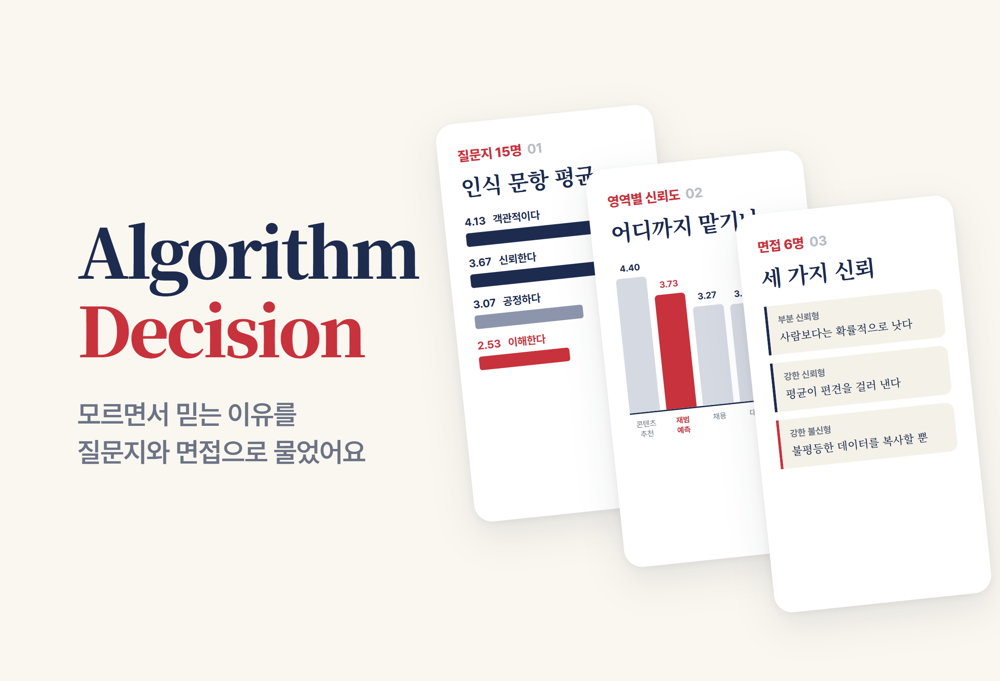
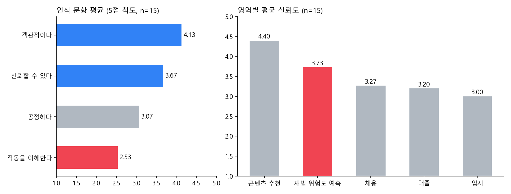

# AGDecision.

> 通过问卷（15 人）和访谈（6 人）检验“基于算法的决策真的客观吗”的社会·文化研究。关注点不在算法歧视了什么，而在人们为什么毫不怀疑地接受它的判定

---

## 1. 项目概述 (Overview)

| 项目 | 内容 |
|---|---|
| 项目名称 | AGDecision.（基于算法的决策客观性检验） |
| 一句话概述 | 通过结合问卷法与访谈法的混合研究，在人们信任算法的方式中找到了四种模式：① 越了解越不信任 ② 不了解却信任 ③ 连高风险决策也交给算法 ④ 区分“客观”与“公正” |
| 进行时间 | 2026.06（高二《社会与文化》表现性评价 ①·②） |
| 参与人数 | 个人研究 |
| 本人角色 | 选题、文献调研、问卷与访谈设计、资料收集、统计分析、报告撰写 |
| 贡献度 | 100% |

如今算法不仅负责内容推荐，还承担着招聘简历筛选、信用评估、升学录取乃至再犯风险预测。其背后是一种普遍观念：“AI 不受情绪左右，所以比人更客观。”然而，算法是从人类积累的数据中学习的，数据中刻下的歧视也会被一并学走。

出发点是我做的 [HowTo](HowTo_README.md)。识别垃圾照片的模型，一旦拍摄角度、光照、背景发生变化，或者出现训练数据中少见的形态，就会反复把同一件物品错分成别的类别。连垃圾这种风险很小的对象都会判错，那么对人作出判定的算法，比如招聘或贷款，又会怎样？如果这些误判并非随机，而是集中在特定群体身上呢？这项研究就是用社会与文化课程所强调的反思性态度（怀疑表面现象背后真相的态度）来追问这个疑问。

已有研究大多表明算法的**输出**存在偏见。本研究则从用户认知的角度解释这种歧视**为什么会被毫不怀疑地接受**。

## 2. 技术栈 (Tech Stack)

这是一项社会科学研究，因此这里列出的不是代码，而是研究方法与分析工具。

| 类别 | 方法 · 工具 | 选择理由 |
|---|---|---|
| 研究设计 | 混合研究（定量 + 定性） | 用问卷看“发生了什么”，用访谈看“为什么会这样”，彼此弥补空白 |
| 定量资料 | 问卷法：18 题 · 6 个领域 · 5 点量表（同年级 15 人） | 按照对客观性的抽象态度 → 各领域的信任 → 与偏见认知之间的落差这一顺序逐步测量 |
| 定性资料 | 访谈法：半结构化（6 人）· 4 个共同问题 + 按倾向追问 | 挖掘数字背后的判断逻辑 |
| 分析 | 均值比较、相关系数、交叉分析、Mann-Whitney U 检验 | 样本小，难以假设正态性，因此采用非参数检验 |
| 文献 | 凯西·奥尼尔《数学杀伤性武器》、ProPublica COMPAS、Gender Shades、亚马逊 AI 招聘、社会·文化教科书 | 用案例补充认知调查无法直接测量的“输出中的歧视” |

## 3. 核心功能与负责工作 (Key Features & Contributions)

### 问卷设计（15 人 · 18 题）

| 部分 | 领域 | 测量内容 |
|:---:|---|---|
| 0 | 基本信息 | 性别 · AI 使用时长 · 编程经验 |
| 1 | 客观性认知 | “AI 是否比人类更客观”、“是否不带情绪和偏见、足够公正” |
| 2 | 各领域信任度 | 招聘 · 贷款 · 升学 · 再犯预测 · 内容推荐 |
| 3 | 偏见 · 歧视认知 | 对特定群体不利的可能性，是否知道歧视案例 |
| 4 | 认知落差 | “明知有偏见仍然信任吗”、“若存在歧视是否应当修正” |
| 5 | 自由回答 | 用一句话说明信任或不信任的理由 |

### 访谈设计（6 人）

先问 4 个共同问题（对 AI 的信任程度、是否同意其客观性、对决策过程的理解、对特定群体歧视的可能性），再根据回答倾向提出不同的追问。受访者分为三种类型。

| 类型 | 核心逻辑 |
|---|---|
| 部分信任型（2 人） | **排除法式的信任。**“没有私心的 AI 从概率上讲总比不透明的人类主观判断要好。”使用它的理由与其说是信任，不如说更接近推卸责任和图方便 |
| 强信任型（2 人） | **统计最优解。**认为海量数据的平均能滤掉个人偏见。把歧视案例也解读为暂时性错误，而非技术缺陷 |
| 强不信任型（2 人） | **机械的漠不关心。**认为复制不平等现实数据的系统不可能客观。并指出弱势群体本身数据就不足，主流的标准于是成了默认标准 |

### 保证客观性的措施

- 问卷中混合了正面和负面陈述，采用标准化的 5 点量表，并删去了诱导特定回答的表述。
- 访谈时不透露研究者的假设，以中立的方式提问，并原样记录回答。

### 主要工作

- 确定研究主题并提出假设（“算法学习并放大社会中的偏见，在客观性的外衣下再生产歧视”）
- 文献调研，并与课程概念（客观态度 · 主体间性、信息鸿沟、批判犯罪学）相联系
- 设计 18 道问卷题目和访谈问题，收集资料，进行统计分析和类型划分
- 将定量、定性结果与文献交叉解读，撰写报告（11 页）

## 4. 成果与结果 (Results & Metrics)

### 定量成果

根据报告中的数值重新绘制的图表。左侧是理解程度明显低于客观性认知和信任的“黑箱信任”，右侧是再犯预测信任度高于招聘、贷款、升学的“高风险委托”

| 模式 | 依据 |
|---|---|
| ① 越了解越不信任 | 有编程经验者（5 人）理解度 4.0 · 信任度 2.8，无经验者（10 人）理解度 1.8 · 信任度 4.1。理解度与信任度的相关系数为 −0.26。Mann-Whitney U：理解度差异 p = 0.013（显著），信任度差异 p = 0.152（方向一致但不显著） |
| ② 不了解却信任 | “AI 是客观的”4.13，“可以信任”3.67，“理解其运作过程”2.53 |
| ③ 连高风险决策也交给算法 | 各领域信任度：内容推荐 4.40 > 再犯预测 3.73 > 招聘 3.27 > 贷款 3.20 > 升学 3.00 |
| ④ 客观 ≠ 公正 | “是客观的”4.13 对“是公正的”3.07。15 人中有 6 人给客观性的评分比公正性高 2 分以上。“即使存在歧视也应当修正”3.73（6 人打了 5 分） |

| 项目 | 结果 |
|---|---|
| 对歧视可能性的认知 / 亲身经历不公 | 3.53 / 5 人 |
| 自由回答 | 信任的理由分为 4 类（一致性、统计合理性、处理能力、对数据的信任），不信任的理由分为 5 类（不透明、错误信息、责任缺失、缺乏语境与伦理、可能被滥用） |
| 表现性评价分数 | （待确认） |

### 定性成果

- **用访谈和文献交叉确认了四种模式。** 越了解越不信任的模式（①）与具有中级编程水平的受访者所说“细节逻辑是黑箱”相吻合；进而引出这样的解读：奥尼尔所说的算法不透明性，在认知层面表现为“正因为不了解才信任”（②）。
- **用教科书案例指出了“数据多就公正”这一逻辑的漏洞。** 《文学文摘》调查了一千万人却预测失误，原因在于样本中缺少低收入群体。以数据代表性问题反驳了强信任型的逻辑，并与 Gender Shades 中代表性不足导致的误差联系起来。
- **发现信任与不信任的依据在性质上就不同。** 信任的理由是“一致性 · 效率 · 统计”这类模糊的期待，而不信任的理由是“不透明 · 缺乏语境”这类具体的观察。
- **提出了三方面的对策。** 算法素养教育；在高风险领域强制要求可解释性和由人做最终审查；确保训练数据的代表性并开展歧视影响评估。

### 已知局限

- **样本只有同年级的 15 名男生。** 这是一项讨论性别与阶层歧视的研究，但样本本身就偏向一侧，结论难以推广。
- **只测量了认知。** 没有直接测量实际算法输出中的歧视，而是用文献案例加以补充。
- **模式 ① 只是一种倾向。** 有编程经验者只有 5 人，信任度差异也不显著。
- 提交版中的参考文献 [2](社会·文化教科书) 的作者、出版社、年份仍是空白。（待确认）

## 5. 问题排查经验 (Troubleshooting)

### ① 需要一种比较 5 人和 10 人的方法

**问题** 按有无编程经验划分，一组 5 人，另一组 10 人。回答是 5 点量表，分布也与正态分布相去甚远。

**原因** 只比较平均值的话，少数几个极端回答就会让结果大幅波动。样本小，也难以假设正态性。

**解决** 先用交叉分析对照各组的回答分布，再用基于秩的非参数检验 Mann-Whitney U 确认两组之间的差异。

**结果** 理解度差异显著（p = 0.013），信任度差异只是方向一致，并不显著（p = 0.152）。交叉表显示，有经验者中半数以上信任度低，无经验者中 80% 信任度高。

### ② 期望的结论没有被统计确证

**问题** 与假设最吻合的模式 ①（“越了解越不信任”），其核心的信任度差异没有达到显著水平。

**原因** 有经验者的样本只有 5 人，即使存在差异，检验力也不够。

**解决** 降低了结论的强度。模式 ① 不写作“已确证的结果”，而写作“需要扩大样本再次确认的倾向”，并附上相关系数（−0.26）和访谈陈述作为辅助依据。局限一节中也单独注明了这一点。

**结果** 读者可以区分哪些经检验确认（① 的理解度差异），哪些停留在均值比较（②③④），哪些只是倾向（① 的信任度差异）。

### ③ 仅靠认知调查无法断言“实际上是否存在歧视”

**问题** 假设是“算法再生产歧视”，但问卷和访谈只能测量人们的认知。

**原因** 高中生没有办法直接获取并测量招聘、再犯预测等算法的输出。

**解决** 划分了各自的角色。输出中的歧视用 COMPAS、Gender Shades、亚马逊招聘等案例补充，本研究则集中于从认知层面解释“这种歧视为什么会被接受”。作为后续课题，还设计了一个实验：在 HowTo 模型中比较训练图像多的类别和少的类别的误识别率，从技术层面确认“数据越少的对象越容易判错”。

**结果** 明确把假设检验的范围限定在“认知与态度层面”，输出层面则交给文献和后续实验。

## 6. 链接与交付物 (Links & Deliverables)

| 类别 | 链接 |
|---|---|
| GitHub 仓库 | 无 |
| 交付物 | 表现性评价 ① 研究计划书，表现性评价 ② 研究报告（11 页），自我评价书 |
| 相关项目 | [HowTo](HowTo_README.md)（研究动机，后续实验对象） |

<b>术语</b>

- **混合研究**：同时使用定量（问卷法）和定性（访谈法）方法、彼此弥补空白的研究设计
- **半结构化访谈**：在共同问题之外，针对每位受访者追加深入问题的方式
- **Mann-Whitney U 检验**：在样本较小或难以假设正态性时，用秩来确认两组差异的非参数检验
- **主体间性**：把研究者共享的视角也纳入其中的客观性。是对“谁的视角成为了标准”的反思
- **信息鸿沟**：数字接入与使用能力上的差距进而导致另一种不平等的现象
- **批判犯罪学（冲突理论）**：认为刑事司法制度可能以有利于社会强者的方式运作的观点
- **黑箱信任**（本研究的定义）：在不了解运作原理的情况下，就认为算法客观并加以信任的现象
- **用数学表达的观点**（奥尼尔）：看似客观的公式中，其实蕴含着开发者和数据的价值判断

<b>参考文献</b>

[1] 凯西·奥尼尔 著，Kim Jeong-hye 译，《数学杀伤性武器：大数据如何扩散不平等、威胁民主》（韩文版），Heureum 出版社，2017。（原著：C. O'Neil, *Weapons of Math Destruction*, Crown, 2016.）
[2] 《高中社会·文化》教科书（作者 · 出版社 · 年份待确认）
[3] J. Angwin, J. Larson, S. Mattu, and L. Kirchner, "Machine Bias," *ProPublica*, May 23, 2016.
[4] J. Buolamwini and T. Gebru, "Gender Shades: Intersectional Accuracy Disparities in Commercial Gender Classification," *Proceedings of Machine Learning Research*, vol. 81, pp. 77–91, 2018.
[5] J. Dastin, "Amazon scraps secret AI recruiting tool that showed bias against women," *Reuters*, Oct. 10, 2018.
[6] stx4R, "HowTo: 基于图像识别的垃圾分类投放指南网络应用," GitHub.

---

+++

## 客户旅程图 (Journey Map)

这里的“用户”是接受算法判定的普通市民。根据访谈类型和问卷结果，重构了一个人逐步接受算法的过程。

| 阶段 | 行为 | 想法 | 研究中确认的内容 |
|---|---|---|---|
| 接触 | 每天使用推荐服务 3 小时以上 | “方便，而且很合我口味” | 内容推荐信任度 4.40 |
| 泛化 | 把推荐的体验推广到其他领域 | “既然是机器，应该很客观吧” | “是客观的”4.13，“理解其运作”2.53 |
| 委托 | 连对人作出判定的决策也交给算法 | “总比人强吧” | 再犯预测 3.73，高于招聘、贷款、升学。部分信任型的排除法式信任 |
| 裂痕 | 接触到歧视案例 | “只是暂时性的错误吧” / “本来就是这种结构” | 强信任型解读为错误，强不信任型解读为结构问题 |
| 诉求 | 希望得到纠正 | “如果是歧视就应该改” | “应当修正”3.73，6 人打了 5 分 |

## DREAD 漏洞管理 (DREAD Risk Assessment)

用 DREAD 整理了研究中讨论的“高风险领域委托”。分数是基于研究结果和文献案例的定性评估。

| 威胁 | D | R | E | A | D | 分数 | 应对（研究提出的建议） |
|---|---|---|---|---|---|---|---|
| 再犯预测中按群体出现的误分类（COMPAS） | 3 | 3 | 2 | 3 | 2 | 2.6 | 确保可解释性，强制由人做最终审查 |
| 招聘模型再生产过去的偏见（亚马逊案例） | 3 | 3 | 2 | 2 | 2 | 2.4 | 检查训练数据的代表性，开展事前 · 事后歧视影响评估 |
| 不理解却信任导致缺乏验证（黑箱信任） | 2 | 3 | 3 | 3 | 1 | 2.4 | 算法素养教育 |

D·R·E·A·D = 损害 · 可复现性 · 利用难度 · 影响范围 · 可发现性（1~3）。分数为平均值。
