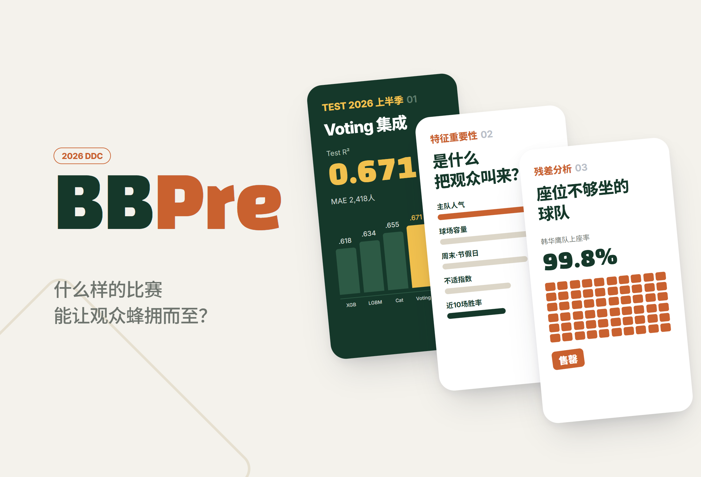
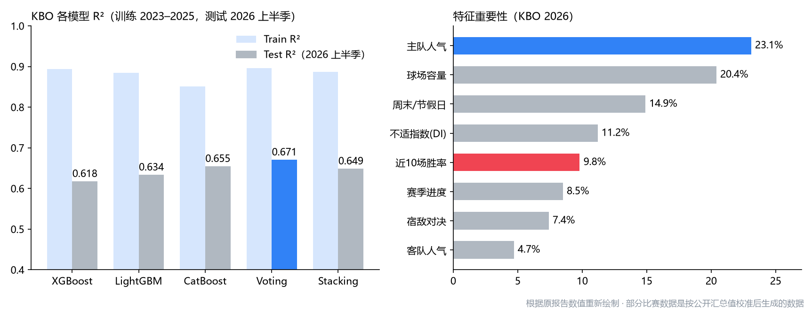

# BBPre.

> 用 KBO · MLB 比赛数据预测“哪些比赛会吸引大批观众”的机器学习研究。以完全隔离 2026 上半季的时间留出集进行验证，并找到了在满座成为常态的赛季中预测问题性质发生转变的节点（截断）

---

## 1. 项目概述 (Overview)

| 项目 | 内容 |
|---|---|
| 项目名称 | BBPre.（KBO & MLB 观众人数预测） |
| 一句话概述 | 用 3 种 Gradient Boosting 和 2 种集成方法预测每场比赛的观众人数。KBO 2026 上半季 Test R² 0.671，MAE 2,418 人。主队人气是比近期战绩强两倍以上的变量 |
| 进行时间 | 2026.03.10 ~ 2026.07.13 |
| 参与人数 | 个人研究 |
| 本人角色 | 问题设定、数据收集与预处理、特征工程、建模、结果分析、撰写报告（25 页）和演示材料 |
| 贡献度 | 100% |
| 进行背景 | 高二课外活动（DDC，活动性质待确认） |

2026 年 KBO 上半季仅 424 场比赛就吸引了 763 万 3,775 名观众（场均 18,004 人），创下上半季观众人数纪录。观众人数的意义并不止于门票收入，还延伸到球场餐饮、周边商品、赞助，乃至转播权谈判的筹码。但仅凭“观众很多”这一事实，什么也决定不了。只有知道观众会涌向哪些比赛、因为什么因素、满座背后还隐藏着多少需求，才能用数据来判断票价、营销、人员配置和球场扩建。

**研究问题。** 观众人数只是简单的时间序列趋势，还是天气、宿敌对决、排名、人气交织而成的逐场条件的函数？

| 假设 | 内容 | 确认方法 |
|---|---|---|
| 1. 事件交互作用 | 以逐场条件为输入的回归模型能达到 R² 0.6 以上 | 测试 R² |
| 2. 品牌优势 | 长期积累的球队人气是比短期战绩更强的预测变量 | 特征重要性排名 |
| 3. 泛化 | 用 2023–2025 训练的模型在 2026 上半季也不会崩溃，但会因满座上限而降低性能 | 相对原有划分的变化幅度，残差模式 |

> **关于数据。** 正如原报告局限一节所述，部分逐场详细数据是按照公开汇总值（上半季 424 场、总计 763 万人、各球队平均观众与上座率）校准后生成的**合成数据**。以下性能数值是基于这些数据的估计值。获得实测的逐场数据后，需要用同一流水线重新计算。

## 2. 技术栈 (Tech Stack)

| 类别 | 技术 | 选择理由 |
|---|---|---|
| 模型 | XGBoost，LightGBM，CatBoost | 在表格数据上能很好地捕捉非线性交互（酷暑 × 露天球场等），也能比较三种方法的倾向差异 |
| 集成 | Voting（简单平均），Stacking（Ridge 元模型） | 让单一模型的偏差相互抵消 |
| 验证 | 保持时间顺序的 CV（调参），2026 上半季时间留出集（最终评估 1 次） | 随机划分会出现用未来信息拟合过去的泄漏 |
| 数据 | KBO 官方 · Naver Sports，韩国气象厅气象数据开放门户，MLB Stats API · pybaseball，Retrosheet 格式比赛日志 | 把比赛、天气、赛伯计量学数据按单场合并 |
| 指标 | R²，MAE，RMSE，过拟合差距（Train R² − Test R²） | MAE 可以直接读作“差了多少人”，差距则反映对新赛季的泛化能力 |

## 3. 核心功能与负责工作 (Key Features & Contributions)

### 数据

| 数据 | 时间范围 | 规模 |
|---|---|---|
| KBO 比赛记录 | 2023 ~ 2026 上半季 | 2,584 场（训练 2,160 · 测试 424） |
| 气象 | 2023 ~ 2026 | 比赛日 × 球场观测站映射（气温 · 降水 · 湿度 · 风速 · 云量） |
| MLB 比赛记录 | 2020 ~ 2026 上半季 | 14,456 场（训练 13,046 · 测试约 1,410） |
| MLB 比赛日志 | 2020 ~ 2026 | 28,912 条球队-比赛记录 |

- 气象缺失值用相邻观测站的数值或月平均值填补，没有观众人数的比赛予以剔除。
- 雨天取消、暂停续赛、揭幕战、儿童节等特殊比赛单独标记。
- 巨蛋球场（高尺）通过与巨蛋虚拟变量的交互来分离天气影响。MLB 2020 年（缩短为 60 场，含空场比赛）予以排除或以虚拟变量处理。
- 类别变量在 CatBoost 中由其自身处理，XGBoost · LightGBM 则用 Label/One-hot 编码。有泄漏风险的目标编码没有使用。

### 特征工程

原则只有一条：**只使用营销人员在比赛开始前就能知道的信息。**

| 分类 | 特征 |
|---|---|
| 环境 | 不适指数 `DI = 9/5·T − 0.55·(1 − RH/100)·(9/5·T − 26) + 32` |
| 赛程 | `is_weekend`，`is_holiday`，`holiday_weight` |
| 赛季 | `season_progress`，`race_intensity = 진행률 × 홈팀 승률` |
| 势头 | `home_recent10_wr = rolling_mean(win, 10).shift(1)` |
| 人气 | `home_pop / away_pop = expanding_mean(attendance).shift(1)` |
| 球场 | `capacity`，`is_dome` |
| 宿敌对决 | 蚕室德比、LG 对乐天的“El Lotte Clásico”、经典系列赛、锦江系列赛的二值标记 |

### 建模

- 超参数在训练区间内通过保持时间顺序的 CV 搜索（树深 4–8，学习率 0.03–0.1，树数量 300–1,200，子采样 0.7–1.0）。测试集只在最终评估时使用一次。
- 对 KBO 和 MLB 运行同一条流水线，考察结果能否跨联盟复现。
- 用 MLB 比赛日志按球队-赛季计算 OPS、wRC+、WAR、BABIP、ISO、毕达哥拉斯胜率，单独分析其与观众模型的关系。

### 主要工作

- 收集 KBO · MLB · 气象数据并按单场合并，制定预处理规则
- 设计无泄漏的特征（`shift(1)`，expanding mean）并验证时间排序的单调性
- 训练、调参、比较 5 个模型，分析特征重要性与残差，按年份分析首尔 3 支球队
- 赛伯计量学扩展分析，撰写报告和演示材料

## 4. 成果与结果 (Results & Metrics)

### 定量成果

根据原报告中的数值重新绘制的图表

**KBO（训练 2023–2025，测试 2026 上半季 424 场）**

| 模型 | Train R² | Test R² | 过拟合差距 |
|---|---|---|---|
| XGBoost | 0.894 | 0.618 | 0.276 |
| LightGBM | 0.885 | 0.634 | 0.251 |
| CatBoost | 0.851 | 0.655 | **0.196（最小）** |
| **Voting** | 0.896 | **0.671（最高）** | 0.225 |
| Stacking | 0.887 | 0.649 | 0.238 |

**MLB（测试 2026 上半季）**：CatBoost RMSE **6,941 人**（最低）· LightGBM 6,988 · Stacking 7,063 · Voting 7,120

| 项目 | 结果 |
|---|---|
| 最佳性能 | Voting Test R² 0.671，MAE 2,418 人（约为平均观众 18,004 人的 13.4%） |
| 相对原有划分 | 在 2023–2025 内以 2025 下半季为测试集的原最高 R² 0.697 → 2026 完全留出集 0.671（−0.026） |
| 假设 1 | 支持（Test R² 0.671 > 0.6） |
| 假设 2 | 支持（主队人气 23.1% vs 近 10 场胜率 9.8%） |
| 假设 3 | 支持（没有崩溃，只是小幅下降） |

**首尔 3 支球队按年份的 R²**

| 年份 | LG | 斗山 | Kiwoom | 解读 |
|---|:---:|:---:|:---:|---|
| 2023 | 0.6091 | 0.5810 | 0.5340 | 正常赛季 |
| 2024 | 0.3887 | 0.4120 | 0.3650 | 联盟高速增长期分布变化，所有球队骤降 |
| 2025 | 0.5707 | 0.5420 | 0.5150 | 在创纪录的票房热潮中回升 |
| 2026 上半季 | 0.5210 | 0.4980 | 0.4640 | 满座上限导致方差缩小 |

### 定性成果

- **品牌胜过战绩。** 吸引观众靠的不是本周的排名之争，而是多年积累的球迷基础。这为“即使在重建赛季也不应削减球迷体验投入”提供了依据。
- **CatBoost 的稳定性在两个联盟中得到复现。** 在 KBO 中过拟合差距最小，在 MLB 中以单一模型胜过了集成方法。XGBoost 训练性能位居前列，但差距为 0.276，对新赛季的泛化能力最弱。
- **精细的赛伯指标在观众模型中作用较弱。** 球队 OPS 与得分强相关，上垒率对得分的贡献大于长打率。但把这些指标放入观众模型后，重要性都偏低。我的解读是：球迷对排名、连胜、明星这类看得见的信号有反应，而不是 wRC+；比赛表现要经由长期人气才转化为票房。
- **从结构上解释了 MLB 误差大的原因。** 平均约 2.8 万人对应 RMSE 6,941 人，误差偏大，这是因为 30 支球队及其球场之间的差异远大于 10 支球队的 KBO。

### 已知局限

- **部分比赛数据是合成数据。** 性能数值不是实测结果，而是基于校准数据的估计值。原始数据和代码没有保留在本地。（待确认）
- **只诊断了截断，并没有解决。** 要估计满座比赛的潜在需求，需要 Tobit 回归或考虑截断的损失函数等方法。
- **2026 年只反映了上半季。** 需要加入下半季的排名之争和季后赛，做全赛季的重新验证。
- **没有票价变量**，因此无法估计价格弹性。

## 5. 问题排查经验 (Troubleshooting)

### ① 随机划分会虚高性能

**问题** 观众数据是有时间顺序的。如果随机划分训练集和测试集，模型就会用未来比赛的信息去拟合过去。近期胜率、人气这类动态变量中也会混入该场比赛本身的结果。

**原因** 泄漏发生在两个层面：特征层面是“包含该场比赛在内”的胜率和平均观众，评估层面是比测试集更晚的比赛进入了训练。

**解决** 设置了两道防线。特征方面，对所有动态变量施加 `shift(1)`，只使用该场比赛**之前**的信息。排序一旦出错 `shift` 就会失效，因此用代码验证了比赛时间的单调性。评估方面，以 2023–2025 训练、2026 上半季测试，彻底按时间切分；调参也只在训练区间内使用按时间顺序的 CV。

**结果** 得到 0.671，低于原有划分的 0.697。我把这个差距理解为“无泄漏的泛化性能与重现过去能力之间的差别”，而不是性能下降。结论是：比起高 R²，先要看它是在什么条件下测出来的。

### ② 满座增多后，模型开始学习的不是“需求”而是“座位”

**问题** 2026 上半季性能下降，容量的特征重要性从 18.3% 升至 20.4%。首尔 3 支球队的 R² 也全部下降。

**原因** 观测到的观众人数是 `min(수요, 수용인원)`。满座比赛中，实际需求在容量处被截断，无法观测。于是观众人数本身的方差缩小，“可供解释的方差”消失，预测问题从需求预测变成了供给约束预测。

**解决** 按球队、星期、上座率区间拆分残差，寻找截断的痕迹。韩华主场比赛的残差系统性地集中在负值一侧（预测 > 实际上限）。仅看条件，模型预测的人数超过了容量，而实际值却在上限处被截断。反过来还发现，周一移动日之后的周二比赛残差偏向正值，说明模型对工作日效应反映过度。

**结果** 韩华的平均观众处于中游，上座率却是联盟最高，由此得到了“增加座位就会被填满的需求确实存在”的依据。结论是：观众模型不只是营销工具，也可以成为增设座位等投资决策的出发点。直接估计潜在需求规模的 Tobit 类方法留作后续课题。

### ③ 仅凭气温无法反映夏季观赛的不适感

**问题** 盛夏露天球场的观众减少不仅仅是气温问题。同样的气温，体感炎热程度会随湿度大不相同。而巨蛋球场则完全不受天气影响。

**原因** 如果把气温和湿度分别输入，模型就得自己去找两者的联合效应，而且会用同一套规则对待巨蛋和露天球场。

**解决** 加入结合气温（`T`）和湿度（`RH`）的不适指数作为衍生变量，巨蛋球场则通过与巨蛋虚拟变量的交互分离天气效应。

**结果** 不适指数的重要性排第 4（11.2%）。树模型捕捉到了 DI 超过 80 的酷暑区间内露天球场观众减少的非线性模式。

## 6. 链接与交付物 (Links & Deliverables)

| 类别 | 链接 |
|---|---|
| GitHub 仓库 | 无 |
| 交付物 | 研究报告（25 页，附录：数据说明书 · 术语整理），演示材料 `KBO & MLB.pptx` |

<b>主要变量</b>

| 变量 | 类型 | 说明 |
|---|---|---|
| `date` / `dow` | 日期 / 类别 | 比赛日期，星期 |
| `home` / `away` | 类别 | 主队，客队 |
| `stadium` / `capacity` | 类别 / 数值 | 球场，容量 |
| `attendance` | 数值（目标） | 观众人数 |
| `temp` / `rain` / `humid` / `wind` | 数值 | 气温，降水量，湿度，风速 |
| `DI` | 数值（衍生） | 不适指数 |
| `is_weekend` / `is_holiday` / `holiday_weight` | 二值 / 数值 | 周末，公休日，连休权重 |
| `season_progress` / `race_intensity` | 数值（衍生） | 赛季进度，排名竞争程度 |
| `home_recent10_wr` | 数值（衍生） | 主队近 10 场胜率（shift 1） |
| `home_pop` / `away_pop` | 数值（衍生） | 主队 · 客队人气（expanding mean，shift 1） |
| `is_rivalry` / `is_dome` | 二值 | 宿敌对决，巨蛋球场 |
| `occupancy` | 数值（分析用） | 上座率 = 观众人数 / 容量 |

<b>术语</b>

- **时间留出集**：按时间顺序切分训练与测试，只用未来数据进行评估的方式
- **数据泄漏**：预测时点无法得知的信息被用于训练，导致性能虚高的现象
- **截断（Truncation）**：观测值在上限或下限处被截断，无法得知真实值的状态（满座比赛的观众人数）
- **Tobit 模型**：估计被截断因变量潜在值的计量经济学模型
- **过拟合差距**：Train 性能与 Test 性能之差
- **Ordered Boosting**：CatBoost 的训练方式，在随机顺序中只用排在某个样本之前的样本来计算该样本的残差，以减少泄漏
- **Expanding Mean**：截至时点 *t* 的所有历史值的平均。作为累积球迷基础的代理指标

---

+++

## 客户旅程图 (Journey Map)

本研究的“客户”是使用模型的球队营销人员。

| 阶段 | 行为 | 想法 | 模型提供的内容 |
|---|---|---|---|
| 赛季前 | 拿到主场赛程 | “应该在哪些比赛上发力？” | 根据星期、公休日、宿敌对决、对手人气给出每场的预计观众 |
| 比赛周 | 查看天气预报 | “遇上酷暑会少来多少人？” | 纳入不适指数的预测，每场误差约 2,400 人 |
| 比赛当天 | 安排售卖点库存和安保人员 | “按多少人来准备？” | MAE 2,418 人水平的人员规划依据 |
| 赛季中 | 战绩下滑 | “观众也会跟着减少吧？” | 人气的影响比近期胜率强两倍以上的依据 |
| 赛季后 | 研究扩建和票价 | “增加座位能坐满吗？” | 从满座球队的负残差中看出的潜在需求 |
