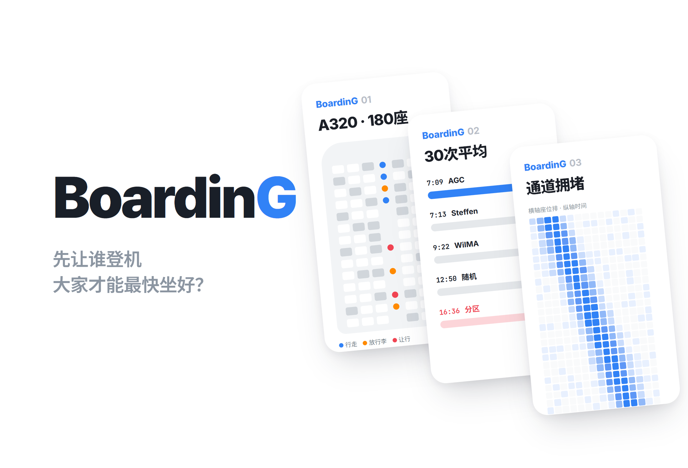
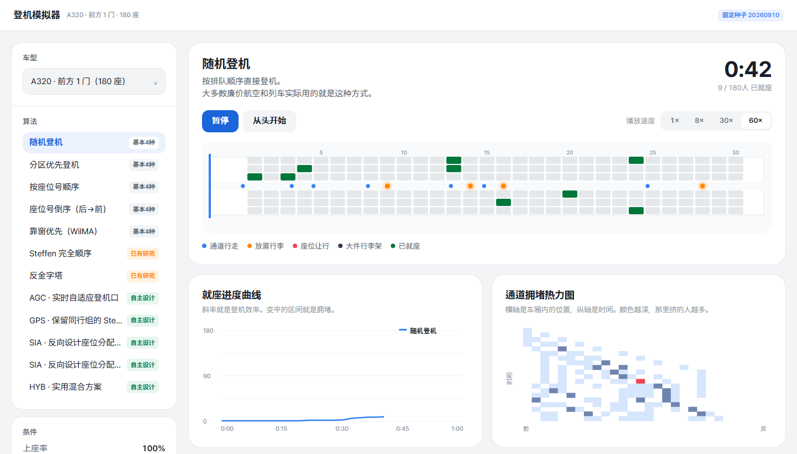
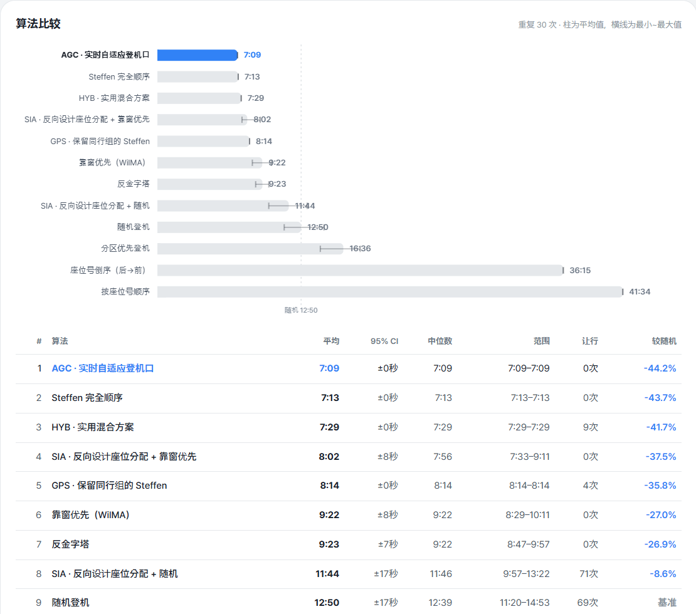
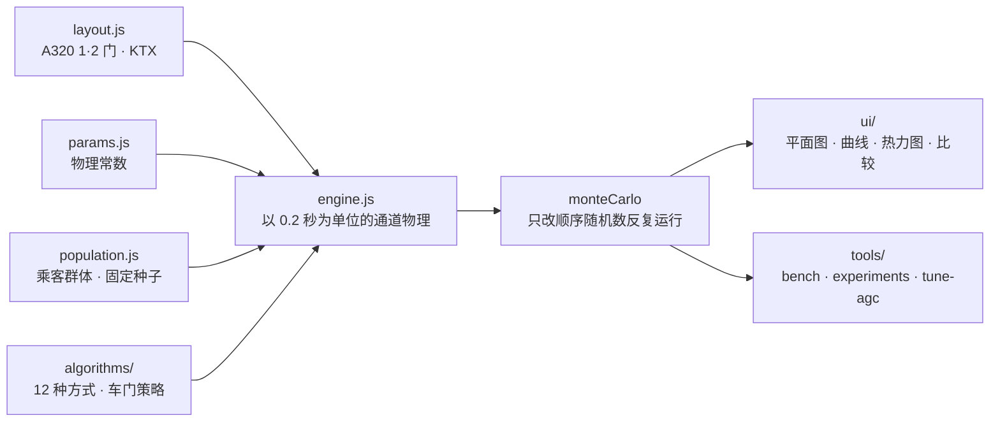

# BoardinG

> 用一个对通道物理、行李安放乃至座位让行都做了建模的基于智能体的模拟器，实验“让乘客最快登上飞机和火车的顺序是什么”的项目

---

## 1. 项目概述 (Overview)

| 项目 | 内容 |
|---|---|
| 项目名称 | BoardinG（登机模拟器） |
| 一句话概述 | 用同一批乘客比较 12 种登机方式，并通过自己设计的 4 种方式找出“顺序优化之后”的改进方向（抗干扰能力、座位分配、车门数量、站台引导） |
| 进行时间 | 2026.09.10（v1.0.0 → v1.1.4，一天） |
| 参与人数 | 个人项目（基本 4 种方式的比较是作业要求，作业背景待确认） |
| 本人角色 | 模型设计，模拟引擎、算法、实验工具与可视化实现，结果分析 |
| 贡献度 | 100%（仓库全部 6 次提交均由本人完成） |

航空公司大多从后排区域开始登机。我很好奇这样是否真的快，如果有更快的方法，为什么不用。要回答这个问题，得先对人在通道里如何互相阻挡进行建模。前面的人放行李时后面的人只能等；靠窗的乘客来得晚，已经坐下的人就得起身让路。这个模拟器用物理方式重现这些摩擦，并在此基础上让各种登机方式一较高下。

## 2. 技术栈 (Tech Stack)

| 类别 | 技术 | 选择理由 |
|---|---|---|
| 模拟 | Vanilla JavaScript（ES 模块），固定种子的随机数 | 浏览器和 Node 共用同一个引擎。种子相同则结果相同，比较可以复现 |
| 可视化 | Canvas 2D（客舱平面图 · 就座曲线 · 拥堵热力图 · 对比柱状图） | 没有用图表库，全部自己绘制 |
| 实验工具 | Node 脚本（`bench` · `experiments` · `tune-agc`） | 一行命令即可复现蒙特卡洛比较和 4 项实验 |
| 部署 | GitHub Pages · 本地静态服务器（`tools/serve.mjs`） | ES 模块在 `file://` 下会被拦截，所以用静态服务器启动 |

没有外部依赖。`package.json` 里只有脚本。

## 3. 核心功能与负责工作 (Key Features & Contributions)

本地截图。上：随机登机以 60 倍速回放中（通道移动、安放行李、座位让行以颜色区分，下方是就座曲线和通道拥堵热力图）。下：“全部比较”重复 30 次的结果

### 建模了什么

把通道看作一维连续空间，以 0.2 秒为单位向前推进。

| 要素 | 模型 |
|---|---|
| 通道移动 | 不能超越。与前一个人保持 `bodyGap`（0.45 m），拥堵会向后传播 |
| 安放行李 | 到达自己那一排后，按 `stowBase + 가방당 시간` 占住通道 |
| 放行李时的手臂空间 | 放行李的人身后需要 `stowGap`（0.95 m），比座位排距（0.81 m）还大 |
| 座位让行 | 进入内侧座位时，已坐在外侧的 b 名乘客要走到通道上 |
| 同行者 | 分配相邻座位。从靠窗位开始入座，同行者内部的让行为 0 |
| 车门通过率 | 一扇门的最大通过速度（飞机 2.0 秒/人，火车 1.0 秒/人） |
| 大件行李架 | 仅限火车。带大件行李的乘客在车门旁停下，堵住出入口 |
| 干扰 | 偏离排队顺序（σ），以及叫号时不在登机口的迟到比例 |

`stowGap > pitch` 是最关键的一行。“相邻两排不能同时放行李”并不是人为定下的规则，而是由物理推导出来的。因此 Steffen 方式为什么要隔一排安排一排，也是作为结果而不是假设显现出来的。

### 已实现功能

- **3 种车型**：A320 前部 1 门 · 前后 2 门（180 座），KTX-山川（360 座，10 号车厢）。
- **12 种登机方式**：基本 4 种（随机 · 分区由后向前 · 按座位号顺序与逆序 · 靠窗优先 WilMA），已有研究 2 种（Steffen 完全顺序 · 反金字塔），自主设计 4 种（AGC · GPS · SIA · HYB）以及 SIA 变体。
- **回放**：1× · 8× · 30× · 60× 倍速，以颜色区分乘客状态（通道移动 · 安放行李 · 座位让行 · 大件行李架 · 已就座）。
- **分析图表**：就座进度曲线（斜率即通过率）、通道拥堵热力图（横轴位置 × 纵轴时间）、全部比较柱状图（平均值与最小~最大值）。
- **条件调节**：载客率、车门通过率、顺序偏离 σ、迟到比例、是否保持同行、重复次数。结果可导出为 CSV。

### 自主设计的 4 种方式

现有方式都只看座位的几何属性（第几排、是否靠窗）。下面四种各自抓住了不同的杠杆。

| 方式 | 核心 |
|---|---|
| **AGC** 实时自适应登机口 | 不预先确定排队顺序。每当登机口空出来，就查看通道状态挑选下一个人。仅凭局部判断就自行重新发现了 Steffen 的结构（12 批 × 15 人，让行 0） |
| **GPS** 保留同行组的 Steffen | 把同行者打包为一个单元，按代表的 Steffen 顺位排序。衡量“不拆散同行者”这一约束的代价 |
| **SIA** 反向设计座位分配 | 值机时把行李多的乘客和大团体安排在后部靠窗，把没有行李的乘客安排在前部靠通道一侧。这是与登机顺序正交的杠杆 |
| **HYB** 实用混合方案 | SIA + GPS。在不拆散同行者的同时也利用座位分配 |

### 主要工作

- 通道、行李、让行、车门、干扰的物理模型与模拟引擎
- 实现 12 种登机方式，为公平比较固定乘客群体
- 4 种实验工具（车门瓶颈 · 双门分割点 · 抗干扰能力 · KTX 站台）与 AGC 参数调优脚本
- 客舱平面图、就座曲线、热力图、比较图表 UI

## 4. 成果与结果 (Results & Metrics)

### 定量成果

**A320 · 180 座 · 1 门 · 重复 30 次**（`node tools/bench.mjs --runs 30`，2026.09 重新运行的结果与 README 一致）

| # | 方式 | 平均 | 让行 | 相对随机 |
|---|---|---|---|---|
| 1 | **AGC** 实时自适应登机口 | **7:09** | 0 | **−44.2%** |
| 2 | Steffen 完全顺序 | 7:13 | 0 | −43.7% |
| 3 | **HYB** 实用混合方案 | 7:29 | 9 | −41.7% |
| 4 | **SIA** + 靠窗优先 | 8:02 | 0 | −37.5% |
| 5 | **GPS** 保留同行组的 Steffen | 8:14 | 4 | −35.8% |
| 6 | 靠窗座位优先（WilMA） | 9:22 | 0 | −27.0% |
| 7 | 反金字塔 | 9:23 | 0 | −26.9% |
| 8 | **SIA** + 随机 | 11:44 | 71 | −8.6% |
| 9 | 随机登机 | 12:50 | 69 | — |
| 10 | 分区优先登机 | 16:36 | 71 | **+29.4%** |
| 11 | 座位号逆序 | 36:15 | 60 | +182.5% |
| 12 | 按座位号顺序 | 41:34 | 60 | +223.9% |

| 实验 | 结果 |
|---|---|
| 1. 车门瓶颈 | 车门 2.0 秒/人时，Steffen 与理论下限（6:00）只差 73 秒。顺序优化实际上已经到头了 |
| 2. 前后双门 | 最佳分割点是 30 排中的第 16 排（前部 96 人 · 后部 84 人）。1 门 7:13 → 2 门 4:19（−40%） |
| 3. 抗干扰能力 | 顺序偏离 σ=25 + 迟到 10% 时，Steffen 为 +35%（9:44），AGC 为 +6%（7:35）。相差 2 分 9 秒 |
| 4. KTX 站台 | 只要引导乘客走自己车厢的车门，无论哪种方式都能缩短 46~51%（AGC 3:09 → 1:42） |
| 实测校准 · 与实际登机比较 | （待确认） |

模型的合理性通过文献（Steffen 2008）报告的相对顺序来确认。Steffen ≪ WilMA < 随机 < 分区由后向前 ≪ 按座位号顺序得以重现，相对随机的比例也与文献区间（Steffen −39%，分区 +24%）吻合。

### 定性成果

- **证明了业界标准比随机还慢。** 分区由后向前登机比随机慢 29%。原因在热力图上一目了然：同一区域的乘客挤在通道的同一位置互相阻挡，而通道其余 80% 却空着。
- **找到了“顺序之后”的方向。** 在座位固定的前提下，Steffen 已经接近物理最优。因此把目标从更快的排序转向可行性（GPS）、抗干扰能力（AGC）以及独立的杠杆（SIA · 车门数量 · 站台引导）。
- **把约束的代价变成了数字。** 不拆散同行者的 GPS 比 Steffen 慢 61 秒（+14%）。HYB 在不拆散同行者的情况下与 Steffen 只差 16 秒。这说明 Steffen 在现实中没人用，原因不在速度，而在社会约束。

### 已知局限

- **把通道看作一维。** 实际上人可以沿宽度方向稍微侧身错开，因此让行时间可能被高估。
- **物理常数只是对齐到文献区间，没有用实测数据校准。** 应当相信相对顺序，而不是绝对值。
- **只有一个乘客群体。** 基准测试只用一个种子抽取一次乘客属性（行李 · 步行速度 · 放行李时间），30 次重复只改变登机顺序的随机性。因此像 Steffen 这样顺序固定的方式，30 次结果完全相同（±0 秒）。排名换成其他乘客群体后是否依然成立，尚未验证。
- **模型中没有下车，也没有上下车同时进行的情况。** 分析火车在中途站停靠时需要这一点。
- **把服从指示的程度笼统地归为一个 σ。** 让 σ 随个人叫号或分区叫号而变化的模型会更准确。

## 5. 问题排查经验 (Troubleshooting)

### ① 贪心登机口找不到“靠窗优先”

**问题** AGC 是一种贪心方法，每当登机口空出，就选出代价最小的乘客。如果代价只计入“自己要承担的让行”，就得不出从靠窗开始填的顺序。

**原因** 先让靠窗乘客登机的好处并不归乘客本人，而是归之后到来的同一排中间和靠通道的乘客。只看自身代价的贪心算法意识不到这一好处。

**解决** 把代价改为双向：在自己要承担的让行之外，再加上自己会给别人造成的让行（同一排内侧仍在等待的人数）。在此基础上加入单调递减链规则：“座位比前一个人更靠近车门的乘客不需要越过前一个人，因此绝不会被挡住”。投放目的地持续向车门方向拉近，但至少隔开 `stowGap`；没有可以再拉近的位置时，就断开链条，从最后一排重新开始。四个权重由调优脚本（`tools/tune-agc.mjs`）对 96 种组合做网格搜索选出。

**结果** AGC 不必记住 Steffen 顺序，就自行找到了 12 批 × 15 人、让行 0 的相同结构（7:09，Steffen 为 7:13）。在结构被打乱的干扰情形下，它会当场重新寻找最优解，比 Steffen 快 2 分 9 秒。

### ② “把行李多的人往后推就会变快”的假设是错的

**问题** BLW（按行李加权的批次）的假设是：在 Steffen 的每个批次内，把行李多的前排乘客往后推，就能降低批次切换的成本。结果比 Steffen 慢了 53 秒。

**原因** Steffen 的速度只来自一个性质：队列中的目标排号单调递减。在批次内把某人往后推，目标排号就会在那个位置向后跳，这个人必须越过前面所有人。单调性被破坏造成的损失大于行李加权带来的收益。

**解决** 放弃这个假设，并把失败记录在 README 中。根据由此得出的结论，调整了自主方式的目标。在座位固定的情况下继续打磨顺序已经没有意义，因此转而瞄准 Steffen 忽略的方向：可行性（GPS）、抗干扰能力（AGC）、座位分配（SIA）。

**结果** 这次方向调整中诞生的 AGC 排名第 1，HYB 排名第 3，SIA 另外取得了“即使无法让乘客排队也能 −8.6%”的结果。

### ③ 比较不同方式时乘客每次都不一样

**问题** 如果每种方式都重新抽取乘客，结果就会随行李多的乘客坐在哪里、有几个人而波动，方式之间的差异被运气淹没。

**原因** 登机时间的方差大部分来自乘客属性，而不是方式。

**解决** 乘客的个体属性（行李件数、步行速度、放行李时间）只用一个种子抽取一次，让所有方式载运完全相同的一批人。方式能改变的变量只有顺序和（SIA 的情况下）座位分配。

**结果** 差异只来自方式本身，连第 1、2 名之间 4 秒的差距都可以比较。代价是结果被绑定在一个乘客群体上（见上文“已知局限”）。

## 6. 链接与交付物 (Links & Deliverables)

| 类别 | 链接 |
|---|---|
| GitHub 仓库 | [stx4R/BoardinG](https://github.com/stx4R/BoardinG)（非公开） |
| 部署网址 | https://stx4r.github.io/BoardinG/ |
| 复现 | `node tools/bench.mjs --runs 30` · `node tools/experiments.mjs bound / split / disruption / train` |

### 结构

新方式只需在 `algorithms/` 中添加文件并在 `index.js` 中注册，就会自动进入 UI、基准测试和实验。

---

+++

## 客户旅程图 (Journey Map)

用户是想比较各种登机方式的学生或课堂听众。

| 阶段 | 用户行为 | 用户想法 | 模拟器的响应 |
|---|---|---|---|
| 观察 | 回放随机登机 | “怎么这么堵？” | 平面图上可以看到安放行李（橙）和让行（红）堵住通道 |
| 比较 | 切换为分区登机再回放 | “航空公司用的方式，应该很快吧” | 热力图上人只挤在一个位置，就座曲线上升得更慢 |
| 确认 | 点击“全部比较” | “那到底哪个最快？” | 用柱状图展示 12 种方式 30 次的平均值和范围 |
| 实验 | 调高顺序偏离 σ 和迟到比例 | “现实里大家根本不按顺序排队” | Steffen 明显变慢，AGC 几乎不变 |
| 分享 | 导出为 CSV | “想用在演示材料里” | 各方式的统计数据导出为文件 |

## 动效设计 (Motion Design)

- 乘客圆点随状态变色（通道移动为蓝 · 安放行李为橙 · 座位让行为红 · 大件行李架为深灰）。拥堵向后传播的过程可以直接从运动中看到。
- 回放速度可在 1×~60× 之间切换，交替观察整体流动和某一处的摩擦。

## 自适应设计 (Adaptive Design)

- 左侧放车型、方式、条件、运行面板，右侧放回放画面和分析图表。比较结果同时以柱状图和表格呈现。
