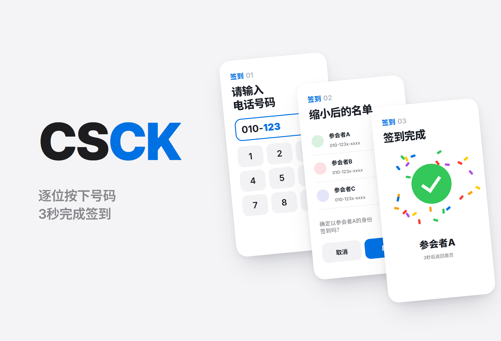
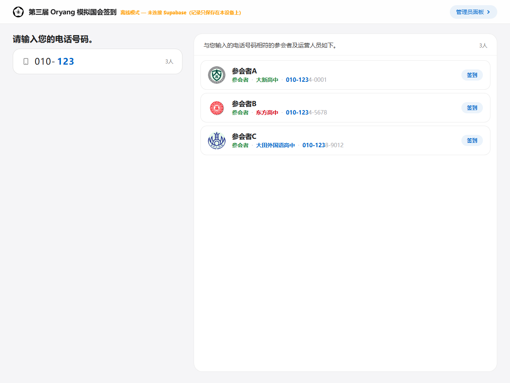
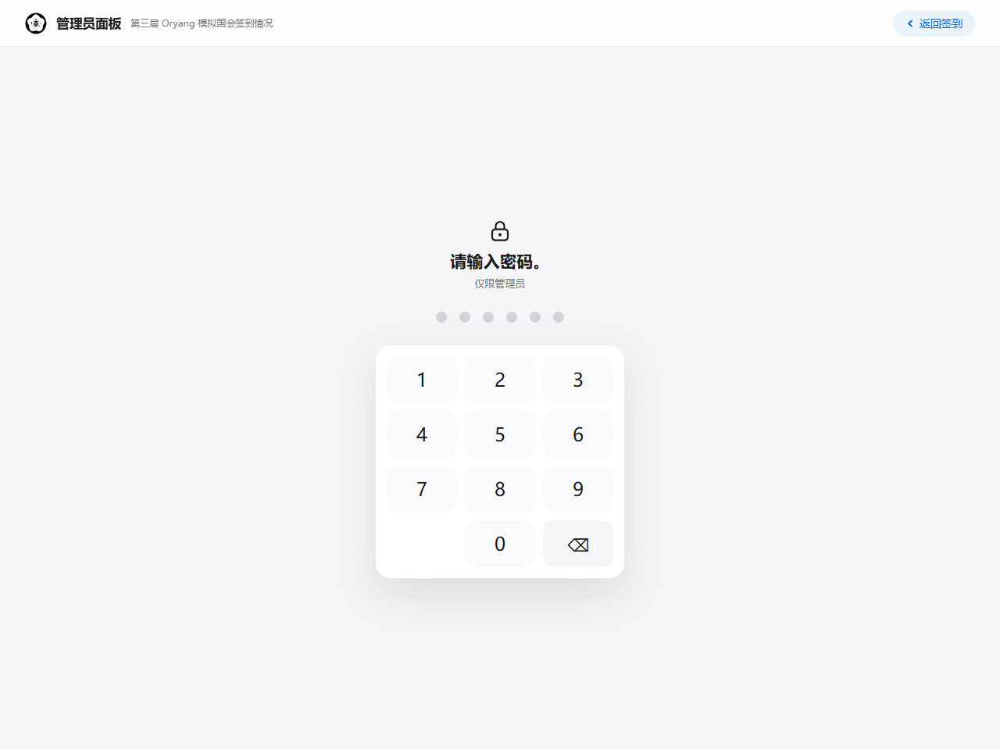
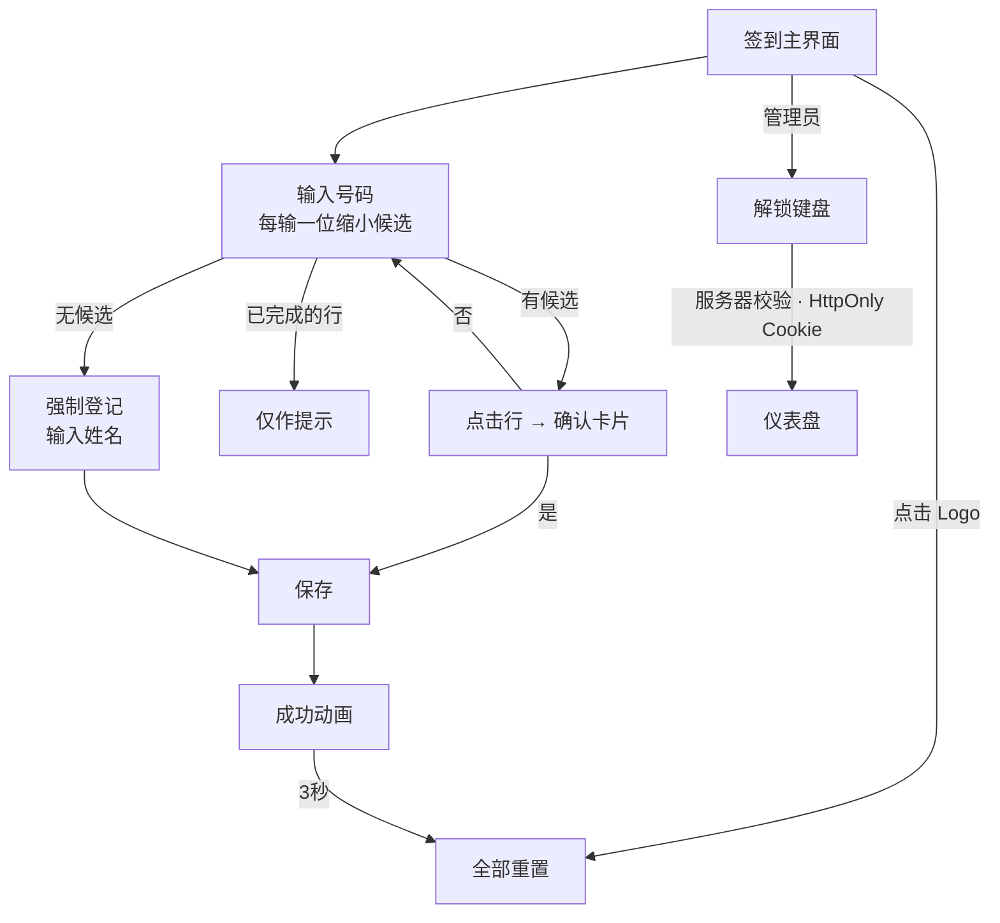

# CSCK

<p align="center"></p>

> 放在第三届 Oryang 模拟国会会场入口的公用平板上，让初次接触的人无需任何说明、3秒内完成签到的签到自助终端

---

## 1. 项目概述 (Overview)

| 项目 | 内容 |
|---|---|
| 项目名称 | CSCK（第三届 Oryang 模拟国会签到 · MoGuk Attendance Check） |
| 一句话概述 | 电话号码每按一位，名单就缩小一圈，点击姓名确认即可完成。没有服务器或网络中断时，同一个构建照样运行 |
| 进行时间 | 2026.07.11 ~ 2026.07.20（10天）· 用于活动（常任委员会07.18，全体会议07.25）入场 |
| 参与人数 | 个人项目 |
| 本人角色 | 策划、UX 设计、全部实现、部署 |
| 贡献度 | 100%（仓库16次提交全部由本人完成） |

活动入口的签到通常用纸质名单和圆珠笔完成。队伍越排越长，无法实时知道谁到了，结束后还得把名单重新誊写一遍。可是，电子化以后反而比纸质更慢的情况也很常见：要求装应用，队伍就停住；要求登录，停得更久；发放二维码，到了弄丢二维码的人那里就彻底卡死。

本次活动的名单上共有来自大新高中、Dongbang 高中、大田外国语高中三所学校的参与者和运营人员133人。设计标准只有一句话：**初次接触的人，无需说明，3秒内完成。** 对此没有贡献的功能一概不加。

| 现场约束 | 对设计的影响 |
|---|---|
| 设备是公用的 | 没有登录。无法以个人账号为前提 |
| 用户每次都在变 | 没有学习的机会。第二次使用不可能比第一次更快 |
| 有人在排队 | 一个人的延误就是后面所有人的延误。不能有死胡同 |
| 运营人员不在旁边 | 必须无需说明就能完成，按错了也要能撤回 |
| 现场网络靠不住 | 即使服务器宕机，登记也必须继续 |

## 2. 技术栈 (Tech Stack)

| 类别 | 技术 | 选择理由 |
|---|---|---|
| 框架 | Next.js 15 (App Router) · React 19 · TypeScript | 把自助终端界面、管理员仪表盘和锁定 API 放在同一个项目里。用中间件在服务器端锁住仪表盘 |
| 数据 | Supabase (Postgres · Realtime) ↔ `localStorage` 自动切换 | 有环境变量时使用远程 DB，没有时使用浏览器存储。只有数据层的一个文件知道两者的差别 |
| 样式 | 手写 CSS（设计令牌 · 动画） | 把运行时依赖控制在4个（Next · React · React DOM · Supabase SDK） |
| 认证 | 服务器路由 + `HttpOnly` Cookie（8小时） | 仪表盘密码只在服务器端校验。客户端校验只要打开 bundle 就能看到 |
| 部署 | Vercel · iPad Safari“添加到主屏幕” | 无需应用商店审核，也无需安装包，一个网址就能变成全屏自助终端 |

## 3. 核心功能与负责工作 (Key Features & Contributions)

<p align="center"></p>
<p align="center"><sub>基于本地构建截图。名单替换为12名虚构参与者。图中已输入到“010-123”，由于没有服务器配置，标题栏显示离线模式警告。</sub></p>

### 已实现功能

- **逐步缩小**：不要求输入完整的电话号码。每按一位，就按前缀匹配筛选名单，并在输入框旁显示剩余人数。列表的每一行都把已输入的位数标成蓝色、其余部分淡化，一眼就能看出为什么会出现这个人。看到自己名字的那一刻，就是该停下的时候。
- **确认卡片**：点击某一行后并不立即记录，而是弹出“确定以 OO 的身份签到吗？”的卡片。姓名写得最大，因为需要确认的对象是人，而不是操作。
- **已完成的人也留在列表中**：已签到的人仍留在列表里，只是按钮变成 `출석 완료`（意为“签到完成”）徽章。如果从列表中删掉，再次过来的人就无从确认自己的记录，只好去找运营人员。
- **强制登记**：号码不在名单上时，弹出“要强制继续吗？”，收下姓名后在同一存储中加上 `forced` 标记进行记录。连姓名都不知道时，记为 `(이름 미입력)`（意为“未输入姓名”）。现场不设阻拦，事后仍可区分。
- **3秒自动复位**：保存后出现勾选动画和彩纸特效，3秒后输入框、键盘、面板全部关闭。下一个人不需要知道怎么清掉上一个画面。
- **重复签到三重防御**：用“保存中”标志防止连击，由客户端核对是否已签到，再接住 DB 唯一索引（`attendance_once_idx`）的违规代码（`23505`），转为“已签到”提示。强制登记允许重复。
- **触控防护**：禁止双指缩放、双击缩放、长按复制、文本选择、图片拖拽和点击高亮，只有输入框例外放开。
- **管理员仪表盘**：实时显示签到情况和记录表。同一姓名同时存在正常签到和强制签到时，用不同颜色标出。仪表盘由中间件锁住，密码键盘在位数输满后自动提交，输错时卡片会左右晃动。

### 主要工作

- 从现场约束出发的 UX 设计（逐步缩小、确认卡片、强制登记、自动复位）
- 数据层设计：远程 DB ↔ 本地存储自动切换，调用处零分支
- 实时刷新的冗余设计（Realtime 订阅 + 5秒轮询 + 3种界面恢复事件）
- 仪表盘的服务器端锁定（中间件 · 服务器路由 · `HttpOnly` Cookie）
- 把名单中的个人信息从仓库中清除（见下文问题排查 ②）

## 4. 成果与结果 (Results & Metrics)

### 定量成果

| 项目 | 结果 |
|---|---|
| 对象 | 名单133人（参与者·运营人员，3所学校） |
| 输入 | 不输完整电话号码（8位），只输到候选人剩1人为止 |
| 界面 | 自助终端 · 锁定 · 仪表盘共3个，代码1,140行 |
| 运行时依赖 | 4个 |
| 实时刷新 | 订阅 + 5秒轮询 + 3种恢复事件 |
| 实际签到人数 · 强制登记比例 · 人均耗时 | （待确认） |

“3秒内完成”是设计目标，并非现场实测值。

### 定性成果

- 一旦以“无法学习的用户”为前提，教程、设置、需要记住的状态就都不再需要。剩下的只有当前屏幕上看得到的东西，我让用户仅凭这些就能完成操作。
- 把数据层隔离在一个文件里，因此活动前一天能在笔记本上断网彩排，也能在服务器配置完成之前把界面做完。
- 没有隐藏降级状态。处于本地存储模式时，会在标题栏显示警告。如果悄悄存到本地，运营人员会一直以为数据正在写入服务器，直到活动结束后才发现。
- 在修订过程中，把各界面间略有差异的同类元素统一起来（07.18，新增207行、删除236行）。在自助终端上，同一个东西长得不一样，用户就会把它读成不同的东西。

### 已知局限（基于2026.09的代码）

- **名单仍可能暴露在浏览器中。** 虽然把降级名单移到了 `NEXT_PUBLIC_ROSTER_JSON` 环境变量，但 `NEXT_PUBLIC_` 的值在构建时会被打进客户端 bundle。远程 DB 一侧，为了在浏览器中做前缀搜索，也把名单表开放为可用匿名密钥读取（`anon can read roster ... using (true)`）。匿名密钥就在 bundle 里，因此任何人都能查询包含电话号码的名单。应当把搜索移到服务器函数，结果中只返回打码后的号码。私有仓库的历史中也还留着名单。
- **仪表盘的默认密码写在代码和 README 中。** 不设置环境变量时，就能用这个值打开。Cookie 令牌也只是密码的 SHA-256 值，所有管理员共用同一个令牌，无法单独注销某一人。
- **不满足标准 PWA 要求。** 没有 Web 清单和 Service Worker，首次加载需要网络，离线运行仅限于记录保存的降级处理。
- **只适用于横屏大屏幕。** 最小宽度为1024px，在竖屏平板和手机上布局无法成立。
- **禁止缩放是以无障碍为代价换来的。** 为了自助终端的操作手感禁止了缩放，这与低视力用户的需求相冲突。
- **没有修改记录的界面。** 错误写入的记录必须到 DB 控制台删除，也没有把强制登记改为正常记录的界面。

## 5. 问题排查经验 (Troubleshooting)

### ① 网络一波动，仪表盘就悄无声息地停住

**问题** 管理员仪表盘通过 Realtime 订阅即时接收新的签到。但只要会场网络短暂中断，或平板屏幕熄灭后再亮起，订阅就会断开，而画面看起来一切正常。运营人员会以为一直没有人进来。

**原因** 订阅即使断开，也不会在界面上显示错误。对自助终端用的平板来说，屏幕熄灭再亮起属于正常运行，所以这种情况经常发生。

**解决** 把刷新途径叠加起来。在订阅之外每5秒轮询一次，并在标签页重新可见、窗口获得焦点、恢复在线时立即重新读取。为了不让轮询导致界面周期性重绘，把收到的记录序列化，与上一次的值相同时就不更新状态。

**结果** 订阅正常时即时更新，订阅断开也能在5秒内更新，屏幕重新亮起时则当场变为最新状态。没有变化时，界面保持不动。

### ② 参与者133人的电话号码曾放在仓库里

**问题** 第一版把名单以代码形式放在种子 SQL（`supabase/seed.sql`）和降级用的 `lib/roster.ts` 两处，两者都包含133条姓名和电话号码。这是为了在没有服务器配置时也能跑演示，结果却是任何打开仓库的人都能看到参与者的联系方式。

**原因** 把“没有服务器也能运行同一个构建”的目标原封不动地套用到了名单数据上。界面代码和数据放在同一个仓库里，代码与个人信息的界限变得模糊。

**解决** 分两次清除。07.13 从仓库中删除了种子 SQL 和数据库结构文件，07.20 删除 `roster.ts` 后改为从部署环境变量读取名单。名单现在从仓库外部注入。

**结果** 当前代码中已没有个人信息。不过，如上文“已知局限”所述，该环境变量是面向客户端的，仓库历史和 DB 查询策略也还在，彻底的解决办法是把名单搜索移到服务器并清理历史。

### ③ 别让“点外面就关闭”变成“点哪儿都关闭”

**问题** 键盘设计为点击外部即关闭，免得用户去找关闭按钮。可是如果在整个文档上接收外部点击，那么点击列表中的姓名或确认卡片时键盘也会关闭，原本想点的操作反而不生效。

**原因** 挂在整个文档上的“外部点击”处理器，连列表、卡片、键盘内部的点击也一并接收了，因为事件会从内部元素向外传播。

**解决** 在列表、确认卡片、键盘内部分别阻止点击事件的传播，只有真正点到外部时才关闭。触控防护也按同样的原则编写：全局禁止复制菜单和文本选择，只对输入框明确放开。如果只做全局锁定，就没法输入姓名了。

**结果** 点击空白处键盘即关闭，列表和卡片也能正常点击。

## 6. 链接与交付物 (Links & Deliverables)

| 类别 | 链接 |
|---|---|
| GitHub 仓库 | [stx4R/CSCK](https://github.com/stx4R/CSCK)（私有） |
| 部署网址 | https://stx4r.me/project/CSCK |

<p align="center"></p>

### 界面流程



数据层：

```
                                 ┌─ 有环境变量 → Supabase (远程表 · 订阅 + 轮询)
界面代码 ──→ lib/attendance.ts ─┤
                                 └─ 无环境变量 → localStorage (存储事件 + 轮询) + 标题栏警告
```

---

+++

## 客户旅程图 (Journey Map)

| 阶段 | 用户的行为 | 用户的想法 | 自助终端的应对 |
|---|---|---|---|
| 到达 | 排队后站到平板前 | “要我做什么？” | 屏幕第一行只有一句“请输入您的电话号码。” |
| 输入 | 开始按号码 | “要全部按完吗？” | 每输一位候选就减少，并显示剩余人数。看到自己的名字就停下 |
| 选择 | 点击姓名 | “要是点错了呢？” | 弹出把姓名写得很大的确认卡片 |
| 例外 | 提示不在名单上 | “我明明报名了啊？” | 通过强制登记，只收姓名就放行 |
| 完成 | 看到勾选动画 | “这样就好了吗？” | 用夸张的成功动画给人确定感。3秒后回到下一个人的界面 |
| 再确认 | 又回来按号码 | “我真的签过了吗？” | `출석 완료` 徽章原样留着 |

## 自适应与预测式设计 (Adaptive & Predictive Design)

- **自适应**：以横屏 iPad（最小宽度1024px）为基准固定设计界面。布局针对一种公用设备，不会因窗口大小而错乱。
- **预测式**：界面不替用户判断号码要按到哪一位。只要显示剩余候选人数和高亮的位数，用户自己就知道何时该停。成功后的自动复位，也是预先考虑到“下一个人会接着用这个界面”的设计。

## 手势设计 (Gesturing)

- 输入只有点击屏幕键盘这一种。浏览器默认手势中会破坏自助终端的那些（双指缩放、双击缩放、长按复制、图片拖拽）全部禁用。停留在放大状态的画面，下一位用户没法还原；双击一旦被误认为放大，连击就会被吞掉。
- 键盘点击外部即关闭，锁定界面的失败则通过卡片左右晃动的动作来传达。不用读文字也知道失败了。

## 动效设计 (Motion Design)

- 成功时出现勾选动画，并落下36片彩纸。如果界面只是悄悄回到列表，用户无法确定自己的操作是否生效，就会再按一次。夸张的反馈不是装饰，而是防止重试的装置。
- 锁定键盘输错时会左右晃动，并清空输入。

## 安全漏洞管理 (DREAD)

| 威胁 | 损害程度 | 可复现性 | 可利用性 | 受影响用户 | 可发现性 | 判断 |
|---|---|---|---|---|---|---|
| 用匿名密钥查询完整名单（电话号码） | 高 | 高 | 高 | 133人 | 中 | 最优先。把搜索移到服务器函数，关闭名单表的匿名读取 |
| `NEXT_PUBLIC_` 名单被打包进 bundle | 高 | 高 | 中 | 133人 | 中 | 把降级名单改为空名单 + 手动输入 |
| 仓库历史中残留的名单 | 高 | 低 | 中 | 133人 | 低 | 清理历史（仅有仓库访问权限的人可见，范围较小） |
| 用默认密码打开仪表盘 | 中 | 高 | 高 | 管理员 | 高 | 改为没有环境变量时直接锁死仪表盘 |
| 用匿名密钥任意插入签到记录 | 中 | 高 | 中 | 活动记录 | 中 | 把插入收窄为 RPC，在服务器端核对名单 |

损害程度和影响范围较大的前三项全都涉及名单中的个人信息。删除记录从一开始就对匿名密钥关闭（重置只能用 service role），只在活动当天需要时才开放相应策略。
