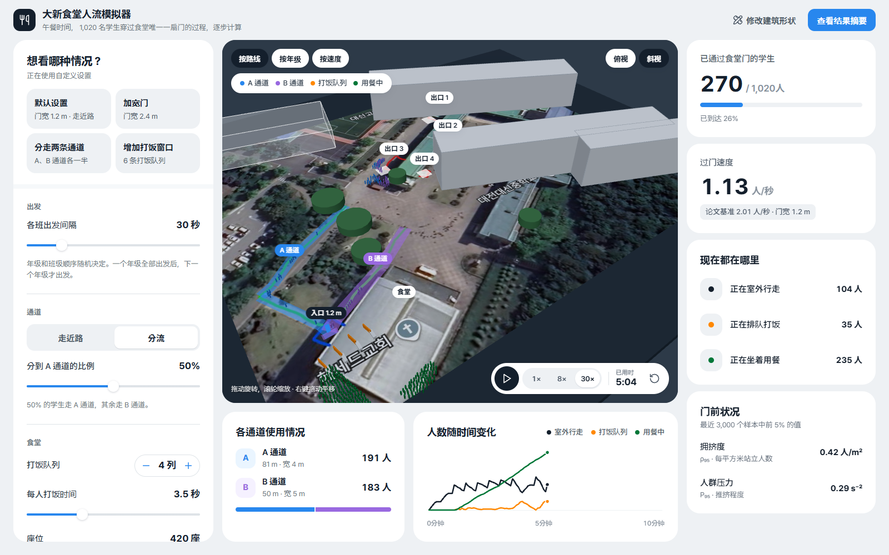
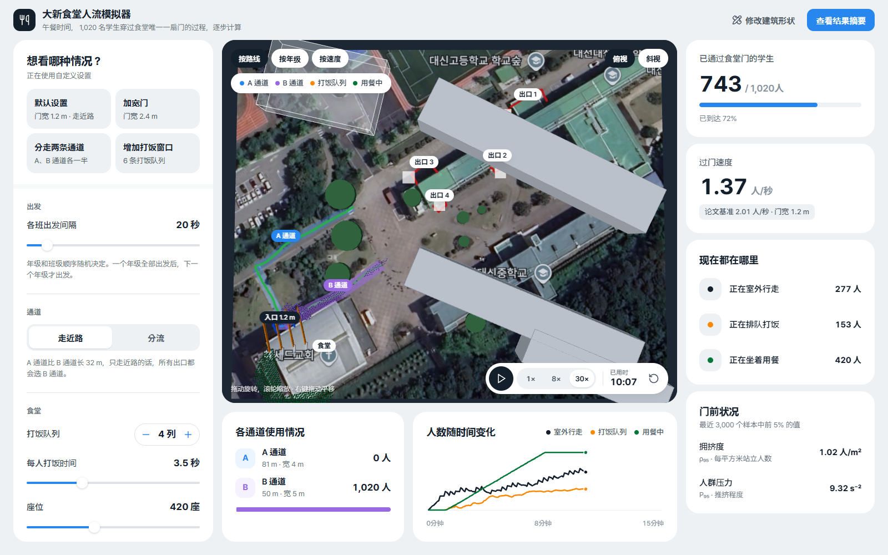
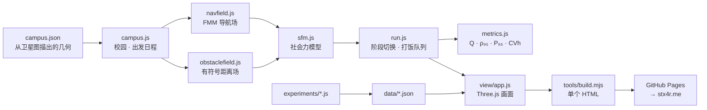

# CafeteriaSimulator

<p align="center"></p>

> 用 JavaScript 重新实现三星 HumanTech 论文中使用的社会力模型并复现论文基准值，再扩展到大田大新高中整个校园，计算 1,020 名学生在午餐时间穿过食堂唯一一扇门的人群模拟器

---

## 1. 项目概述 (Overview)

| 项目 | 内容 |
|---|---|
| 项目名称 | CafeteriaSimulator（网页版「大新食堂人流模拟器」，提交简称 CafSim） |
| 一句话概述 | 不改论文研究过的“门前障碍物”，而是改学校不用施工就能调整的两件事——各班出发间隔和通道分配，计算食堂门前的瓶颈 |
| 进行时间 | 2026.09.10 ~ 2026.10.03（v1.0.0 → v1.1.4）· 09.10 模拟核心与实验 · 10.03 网页部署与界面改版 |
| 参与人数 | 个人项目 |
| 本人角色 | 社会力模型与导航场实现、论文基准值复现与常数校准、校园几何描绘、实验设计、3D 网页应用开发与部署 |
| 贡献度 | 100%（仓库全部 9 次提交均由本人完成） |

三星 HumanTech 论文《从人群流体视角分析学校食堂瓶颈前方障碍物的流动稳定效果》（原题：「군중 유체 관점에서 분석한 학교 급식실 병목부 전방 장애물의 흐름 안정화 효과 분석」）用 MATLAB 在一段宽 6.0 m、收窄到 1.2 m 出入口的通道里放入 60 人，观察在门前放一个圆柱障碍物时人流如何变化。论文改变了障碍物的大小、距离和位置，但没有找到能同时改善通过量和安全的布置。

这个仓库是那篇论文的补充材料。首先，我用 JavaScript 从零实现了同一个模型，复现了论文 Table 1 中无障碍物的基准值。接着把舞台扩展到真实校园：学生从教学楼的 4 个出口出来，穿过广场，经由两条通道之一进入食堂唯一的门，再走到打饭队列和座位。改变的变量不再是障碍物，而是学校只靠规则就能决定的各班出发间隔和通道分配。

## 2. 技术栈 (Tech Stack)

| 类别 | 技术 | 选择理由 |
|---|---|---|
| 人群物理 | 用 Vanilla JavaScript 实现的 Helbing–Farkas–Vicsek 社会力模型（空间哈希邻居搜索、半隐式欧拉积分） | 只有和论文是同一个模型，才能对照基准值 |
| 寻路 | 用快速行进法（FMM）求解程函方程 | 8 邻域 Dijkstra 的方向误差约 8%，会让瓶颈附近的行走方向偏掉。FMM 在 1% 以下 |
| 墙体处理 | 由阻挡格子生成的有符号距离场与法线（Felzenszwalb–Huttenlocher 距离变换） | 在校园规模下，为每个行人遍历墙线段的计算占了大部分开销。换成距离场后只需读两次数组 |
| 食堂内部 | 排队模型（打饭队列 + 座位停留） | 室内要回答的问题是“门和打饭窗口，哪个才是瓶颈”。力模型在这里只会多加接触噪声 |
| 渲染 | Three.js r160 + 卫星图地面纹理 | 用 3D 展示校园，同时与物理计算分开 |
| 构建 · 部署 | 用 Node 构建脚本打包成单个 HTML（约 1.0 MB）→ GitHub Actions → GitHub Pages，由 stx4r.me 的 Cloudflare Worker 代理 | Three.js、核心代码、几何数据和地面纹理全部内联，几周后也能凭一个文件打开 |
| 实验 | 4 个 Node 脚本（`replicate` · `calibrate` · `sweep` · `bimodal`） | 用固定种子的随机数（mulberry32），每次运行都能重现 |

## 3. 核心功能与负责工作 (Key Features & Contributions)

<p align="center"></p>
<p align="center">
  
  </p>
<p align="center"><sub>在本地构建中截取。上：分走两条通道、出发间隔 30 秒，第 5 分钟（A 通道 191 人，B 通道 183 人）。左下：出发间隔 20 秒、走近路，第 10 分钟的俯视画面（1,020 人全部涌向 B 通道，门前人群压力 P₉₅ 达 9.32）。右下：默认设置的结果摘要（23 分 7 秒，重复 6 次的柱状图）</sub></p>

### 已实现功能

- **校园 3D 画面**：在卫星图上放置教学楼、花坛、两条通道和出入口，让 1,020 名学生移动。颜色可按路线、年级、速度切换，视角可在俯视和斜视之间切换。
- **4 种场景预设**：默认（门宽 1.2 m · 走近路）· 加宽门（2.4 m）· 分走两条通道（A、B 各一半）· 增加打饭窗口（6 列）。
- **设置滑块**：各班出发间隔、路线策略（走近路 / 分流）及分到 A 通道的比例、打饭队列数、每人打饭时间、座位数、用餐时间、门宽。改变门宽会重新计算寻路地图。
- **实时仪表盘**：已通过门的人数、门的流量（与论文基准 2.01 人/秒并排显示）、各位置人数（室外 · 打饭队列 · 用餐中）、门前拥挤度 ρ₉₅ 和人群压力 P₉₅、人数随时间变化的曲线、各通道使用人数。
- **结果摘要**：显示全部进入用时、室外人数峰值、被解救的学生数，以及预先计算好的重复 6 次结果柱状图。可以保存为图片，设置写在网址里，通过链接就能分享相同条件（`?hw=45&route=split&a=50…`）。
- **堵塞判定**：所有班级出发后，若 600 秒内通过门的人少于 10 人，就以“门前堵住了”结束，并告知剩余人数。
- **几何编辑**：在应用内修改并应用 `campus.json`。直接从卫星图读取的值和根据低分辨率图片估算的值分开显示。

### 模型构成与核心公式

```
m dv/dt = m (v₀e − v)/τ + Σ f_ij + Σ f_iW
f_ij = [ A·exp((r_ij − d_ij)/B) + k·g(r_ij − d_ij) ] n_ij + κ·g(r_ij − d_ij)·(Δv_ji · t_ij) t_ij
e = −∇T/|∇T|,   |∇T| = 1   (程函方程, FMM)
ρ = N/A,   Q = (N − 1)/(t_N − t_1),   CV_h = s_h / h̄,   P = ρ·Var(v)
```

行人参数完全沿用论文（r 0.23 m、m 75 kg、v₀ 1.34 ± 0.12 m/s、τ 0.5 s、dt 0.03 s）。论文没有写出的力常数通过校准确定（A 3000 N、B 0.055 m、通道长 8.0 m）。在校园模拟中，每个行人经过六个阶段。

| 阶段 | 内容 | 模型 |
|---|---|---|
| 0 | 从出口走到分配的通道入口 | 社会力 |
| 1 | 沿通道走到食堂门 | 社会力 |
| 2 | 在最短的打饭队列中等待 | 排队 |
| 3 | 打饭（3.5 秒 × 0.75~1.25） | 排队 |
| 4 | 用餐（780 秒 × 0.8~1.2） | 停留 |
| 5 | 离开 | — |

### 主要工作

- 从零实现社会力模型、空间哈希和积分器，并重建论文场景（6.0 m → 1.2 m，60 人）
- 复现论文 Table 1 基准值，并对论文未给出的常数做网格扫描
- 在卫星图上描绘校园几何（Google Earth 60 m 比例尺 = 372 px → 0.1613 m/px，用 2.3 m 停车位间距 = 14.46 px 交叉核对）
- 设计出发间隔 × 通道分配实验，结果分歧大的条件逐个种子全部运行
- Three.js 3D 应用、单 HTML 构建、GitHub Pages 自动部署

## 4. 成果与结果 (Results & Metrics)

### 定量成果

**复现论文基准值**（无障碍物，10 个种子，2026.10 重新运行）

| 指标 | 模拟 | 论文 Table 1 | 差异 | 95% 置信区间 |
|---|---|---|---|---|
| 流量 Q（人/s） | 1.979 ± 0.061 | 2.008 ± 0.040 | −1.5% | 重叠 |
| 密度 ρ₉₅（人/m²） | 2.870 ± 0.074 | 3.017 ± 0.014 | −4.9% | 不重叠 |
| 间隔变异 CV_h | 0.542 ± 0.035 | 0.612 ± 0.032 | −11.5% | 不重叠 |
| 压力 P₉₅（s⁻²，区域平均） | 0.934 | 1.431 ± 0.047 | −34.7% | 定义不同 |
| 压力 P₉₅（s⁻²，局部场） | 1.803 ± 0.063 | 1.431 ± 0.047 | +26.0% | 定义不同 |

校准前的默认常数（A 2000 N、B 0.08 m）下，Q 偏差 −15.5%，CV_h 偏差 +26.5%。

**出发间隔 × 通道分配**（3 个种子的平均值，`data/sweep.json`）

| 出发间隔 | 路线 | 门流量 Q（人/s） | 间隔 CV_h | P₉₅（s⁻²） | 到最后一次打饭（s） | 室外人数峰值 |
|---|---|---|---|---|---|---|
| 20 秒 | 走近路 | 0.886 | 8.27 | 8.40 | 1,749 ± 1,577 | 300 |
| 20 秒 | A 30% | 0.912 | 7.17 | 7.76 | 1,317 ± 632 | 295 |
| 20 秒 | **A 50%** | **1.211** | **1.34** | 8.52 | **916 ± 9** | 291 |
| 30 秒 | 走近路 | 1.116 | 3.09 | 0.11 | 982 ± 30 | 136 |
| 30 秒 | A 30% | 1.095 | 2.10 | 0.22 | 997 ± 17 | 137 |
| 30 秒 | A 50% | 1.104 | 1.94 | 0.24 | 997 ± 29 | 139 |
| 45 秒 | 走近路 | 0.752 | 3.71 | 0.08 | 1,427 ± 31 | 102 |
| 45 秒 | A 30% | 0.746 | 2.82 | 0.17 | 1,431 ± 25 | 102 |
| 45 秒 | A 50% | 0.747 | 2.64 | 0.19 | 1,434 ± 24 | 103 |

选择走近路时，A 通道比 B 通道长 32 m，所以四个出口都走 B 通道（A 比例 0%）。

**出发间隔 20 秒，6 个种子全部运行**（`data/bimodal.json`）

| 路线 | 到最后一次打饭（s），种子 1~6 | 范围 |
|---|---|---|
| 走近路 | 3,358 · 921 · 968 · 906 · 1,577 · 4,415 | 906 ~ 4,415 |
| A 50% | 906 · 920 · 921 · 920 · 921 · 922 | 906 ~ 922 |

| 项目 | 结果 |
|---|---|
| 规模 | 核心与实验 JS 1,765 行，应用 JS 1,037 行 + HTML · CSS 574 行 |
| 构建结果 | `dist/simulator.html` 1.0 MB |
| 与真实食堂实测值的对照 | （待确认） |
| 论文评审结果 | （待确认） |

### 定性成果

- **用数据缩小了论文没定下的设置。** 力常数和通道长度决定拥挤程度，论文却没有给出。我没有凭空假设，而是用网格扫描找出最接近 Table 1 的组合，这个结果本身也就成了对“论文实际所用设置”的估计。
- **揭示了压力指标的定义差异。** 论文把 ρ 定义为区域平均，P 却引用了 Helbing（2007）。两种方式都算一遍，区域平均是 0.934，局部场是 1.803，论文值 1.431 正好落在两者之间。要比较 P₉₅，得先统一定义。
- **分走通道的效果体现在尾部，而不是平均值。** 出发间隔 30 秒和 45 秒时，最后一次打饭的时间几乎相同（982 对 997 秒，1,427 对 1,434 秒）。差别只在间隔很紧的 20 秒时出现：只走近路时 6 次中有 3 次超过 25 分钟，各分一半则 6 次都在 15 分 6 秒~15 分 22 秒之间结束。不过门前人群压力 P₉₅ 分别是 8.40 和 8.52，差不多。分流并不会让门前变得不挤，只是消除了堵塞僵死的情况。
- **选了能改变的变量。** 论文中的障碍物需要施工。出发间隔和通道分配只靠引导规则就能改变。

### 已知局限

- **复现指标中只有 Q 落在置信区间内。** ρ₉₅ 为 −4.9%，CV_h 为 −11.5%，都在区间之外。仓库 README 写着误差在 2.4 / 6.8 / 6.5% 以内，但用现在的代码重新运行，CV_h 的误差是 11.5%。现在运行 `calibrate.js`，最优值是通道长 6.5 m、B 0.05 m，与 `calibration.json` 中的 8.0 m、0.055 m 也不同。B 0.055 根本不在扫描网格（0.05 / 0.08 / 0.12 / 0.16）里，所以需要重新核实校准值的来源。
- **建筑轮廓是最弱的输入。** 出口、两条通道和出入口的位置是从带标注的卫星图直接读取的，比较可靠。建筑轮廓、运动场边界和通道宽度则是根据低分辨率图片估算的。门宽 1.2 m 没有实测，直接用了论文中的 W。
- **食堂内部数值是文献默认值。** 4 条打饭队列、每人 3.5 秒、420 个座位、用餐 13 分钟，都需要换成实测值。
- **社会力模型无法自行解开已经僵死的堵塞。** 门前一旦形成拱，就不会散开。所以长时间独自卡住的人会被移到门内，并在结果中报告人数。出发间隔 20 秒的条件下，每次运行有 1~4 人。
- **100 名教师还不会移动。** `campus.json` 里有教师人数，也预留了行人容量，但运行的总人数只算学生 1,020 人。
- **sweep 数据不完整。** `sweep.js` 也定义了 60 秒和 90 秒的出发间隔，但 `data/sweep.json` 只有 20、30、45 秒。每个条件也只有 3 个种子。

## 5. 问题排查经验 (Troubleshooting)

### ① 因为论文缺少的常数，基准值对不上

**问题** 即使原样搬来论文场景，用 Helbing 默认常数（A 2000 N、B 0.08 m）运行时，流量 Q 为 1.697 人/s，比论文低 15.5%，间隔变异 CV_h 高 26.5%。

**原因** 论文写了半径、质量、期望速度、反应时间、时间步长、门宽和通道宽度，却没写力常数 A、B 和通道长度。这三个值决定门前的拥挤程度，而拥挤程度会牵动全部四个指标。

**解决** 不挑一个值去假设，而是扫描。通道长 4 种 × A 3 种 × B 4 种，共 48 种组合，每种用 5 个种子运行，按落入论文置信区间的指标数和归一化误差排序。压力 P 的定义有歧义，所以同时按区域平均和局部场两种方式记录。

**结果** 在 A 3000 N、B 0.055 m、通道长 8.0 m 时，Q 的误差缩小到 −1.5%。但 ρ₉₅ 和 CV_h 仍在置信区间之外（见已知局限）。

### ② 一次放出全班 34 人，整个出口都被困住了

**问题** 班级出发时，把 34 人同时放进出口前的生成框，被分配到这个出口的人全部动弹不得。

**原因** 生成框内的密度达到约 7 人/m²，接触力无法解开重叠。现实中 34 人是从一扇教室门排队走出来的，同时生成是物理上不可能出现的初始状态。

**解决** 把出发的班级放进队列，每个出口每秒放出 2 人。放人时最多尝试 12 次，寻找与他人相距 0.6 m 以上的位置，找不到就推到下一步。

**结果** 在出发间隔 30 秒和 45 秒的 18 次运行中，被困人数为 0，完成率 1.000。

### ③ 必须分清停住的人是在排队还是被卡住

**问题** 有几个人卡在门前汇合处的墙边，始终没有到达。这样完成率指标就失去了意义。

**原因** 有一个角落里，通道导航场的梯度指向建筑内部，走进去的人会顶着墙停下。可是在门前排队的人同样是停着的，只看速度分不出两者。

**解决** 用邻居数量来区分。2.5 m 内有 3 个以上其他行人，就视为在排队，不去处理。只有独自停住超过 120 秒的人才会被移进门内，并把人数作为“被解救的学生”原样写进结果。如果这个数字不小，我就把它当作几何数据出错的信号，而不是人群本身的问题。模型内部也会给停住超过 15 秒的人施加一个随机方向的小力，让他慢慢挪动。

**结果** 出发间隔 30 秒和 45 秒时被解救的学生为 0，20 秒时每次运行 1~4 人。

### ④ ±1,577 秒的置信区间并不是噪声

**问题** 出发间隔 20 秒、走近路的条件下，最后一次打饭的时间是 1,749 ± 1,577 秒，分散到平均值毫无意义。

**原因** 结果分成两种：要么 15 分钟左右结束，要么门前汇合处出现堵塞且无法恢复，拖上几千秒。3 个种子的平均值把两种模式混在了一起。

**解决** 不取平均，另写了一个跑完全部 6 个种子并逐个报告的实验（`bimodal.js`）。应用的结果画面也原样放入了这 6 根柱子。

**结果** 走近路从 906 秒到 4,415 秒，各分一半从 906 秒到 922 秒。结论从“分流能降低平均值”变成了“分流能消除堵塞的长尾”。

### ⑤ 堵塞的运行永远不会弹出结果画面

**问题** 网页应用要等所有人都通过门才打开结果画面。在出现堵塞的条件下，这个时刻永远不会到来，画面一直停在“正在移动”。

**原因** 完成判定只有“全部通过”一种。正如 ④ 所示，这个模型无法自行解开僵死的堵塞，于是出现了永远不会结束的运行。

**解决** 在 v1.1.3 中把结果状态分成“进行中 · 完成 · 堵塞”三种。所有班级都已出发，但最近 600 秒内通过门的人少于 10 人，就判定为堵塞。堵塞时图标变成橙色警告，显示门前剩余人数，并提示“在这个条件下，模型无法自行解除拥堵”。

**结果** 任何设置下都会打开结果画面。即使堵塞，也会以“门前堵住了”的标题和门前剩余学生数结束。

## 6. 链接与交付物 (Links & Deliverables)

| 类别 | 链接 |
|---|---|
| GitHub 仓库 | [stx4R/CafeteriaSimulator](https://github.com/stx4R/CafeteriaSimulator)（私有） |
| 部署地址 | https://stx4r.me/project/CafeteriaSimulator/ |
| 复现实验 | `node experiments/replicate.js` · `calibrate.js` · `sweep.js` · `bimodal.js` |
| 构建 | `node tools/build.mjs` → `dist/simulator.html` |
| 原论文 | 《从人群流体视角分析学校食堂瓶颈前方障碍物的流动稳定效果》（三星 HumanTech 论文） |

### 结构



---

+++

## 客户旅程图 (Journey Map)

用户是负责安排午餐动线的老师或学生会。

| 阶段 | 用户的行动 | 用户的想法 | 工具的回应 |
|---|---|---|---|
| 探索 | 直接播放默认设置 | “午餐时外面有多挤？” | 23 分 7 秒内室外最多 102 人，门的流量显示在论文基准 2.01 人/秒 旁边 |
| 发现 | 查看各通道使用情况卡片 | “为什么没人走 A 通道？” | 提示 A 通道比 B 通道长 32 m，所以所有出口都选 B |
| 比较 | 把出发间隔缩短到 20 秒再跑一次 | “放得快就结束得快吧？” | 门前人越积越多，人群压力超过 9 |
| 确认 | 看结果摘要里重复 6 次的柱状图 | “那次堵塞不是偶然吗？” | 走近路是 15~74 分钟，分流 6 次都在 15 分钟左右 |
| 分享 | 点击“复制链接” | “开会时就用这个条件给大家看” | 复制带有设置的网址 |

## 手势设计 (Gesturing)

- 拖动 3D 画面旋转，滚轮缩放，右键拖动平移。
- 用一个标签在俯视和斜视之间切换，视角平滑过渡。

## 自适应设计 (Adaptive Design)

- 宽屏时，设置 · 地图 · 仪表盘排成三列。
- 宽度 1,279 px 以下时，设置和地图排成两列，仪表盘移到下方排成一行网格。
- 899 px 以下时，按地图（屏幕高度的 62%）→ 仪表盘 → 设置的顺序堆成一列。地图上的图例、标签和播放栏也会重新摆放，避免重叠。
- 对开启“减少动态效果”的用户，关闭过渡效果。
