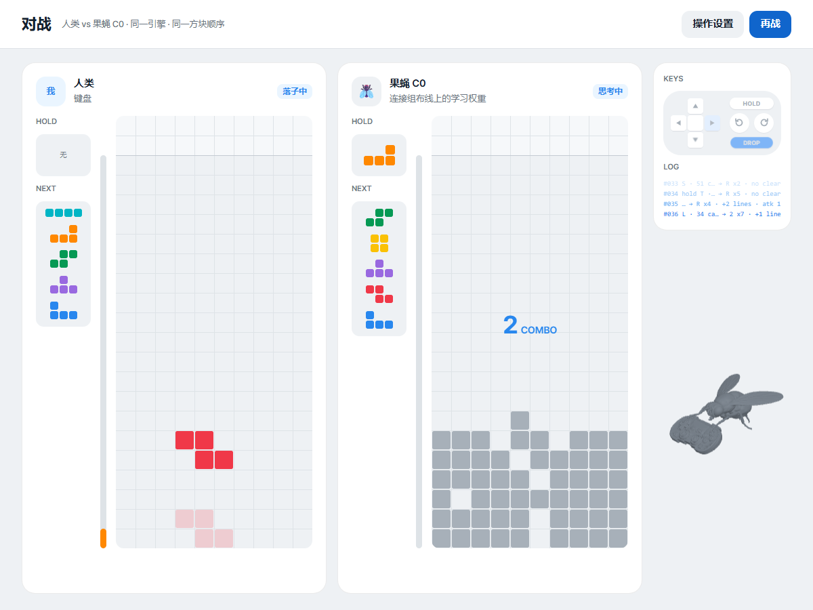
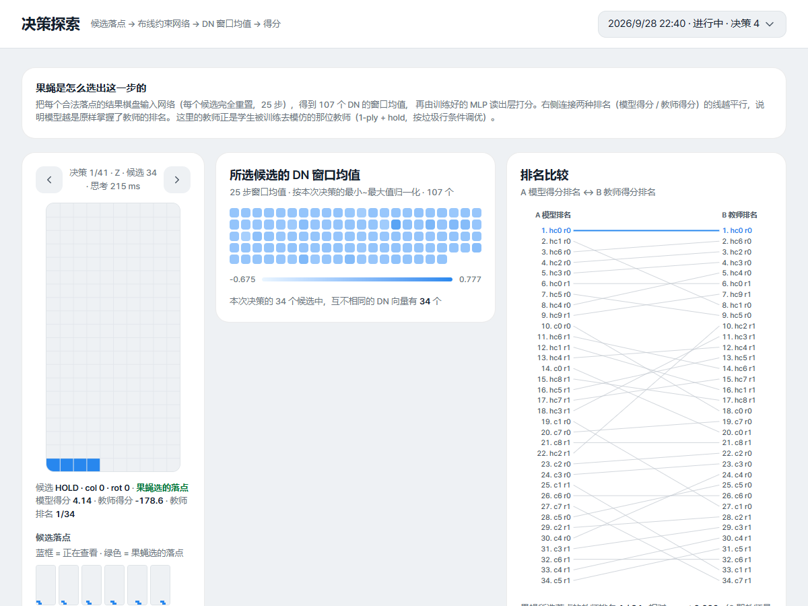
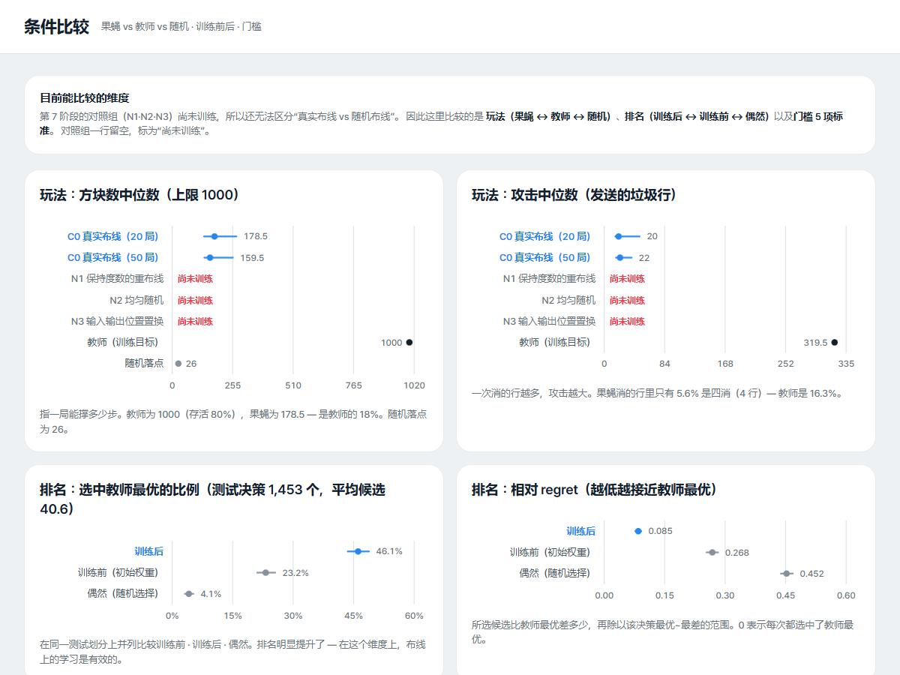
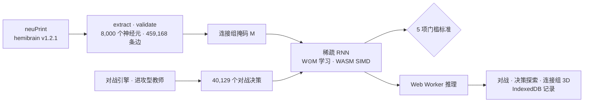

# Fly

> 以果蝇脑连接组（hemibrain）的布线为约束，教一个网络玩俄罗斯方块对战，并把结果公开到网页上，让人可以直接与之较量的研究型项目

---

## 1. 项目概述 (Overview)

| 项目 | 内容 |
|---|---|
| 项目名称 | Fly (VFB-Tetris) |
| 一句话概述 | 把 8,000 个果蝇神经元、459,168 条连接的布线用作稀疏掩码，在其上训练权重，得到俄罗斯方块对战策略。门槛没有达到，并部署了如实展示这一未达标结果的对战网页 |
| 进行时间 | 2026.09.15 ~ 2026.09.24（v0.1.0 → v0.13.6，26 次提交） |
| 参与人数 | 个人项目 |
| 本人角色 | 研究设计、数据提取、模拟与训练代码、实验与判定、网页实现与部署 |
| 贡献度 | 100% |

出发点是这样一个问题：“真实果蝇的大脑布线对玩俄罗斯方块有没有用？”最初做的是一个把连接组的突触数直接当作固定权重的储备池（脉冲神经网络）。直到第 5 阶段，结果都是阴性。于是在第 6 阶段改变了主张：从连接组中只取“哪个神经元连接到哪个神经元”，权重则通过学习得到。报告和网页中都没有使用“果蝇学会了俄罗斯方块”这样的表述。

| 阶段 | 内容 | 结果 |
|---|---|---|
| 1 | 从 neuPrint 提取 hemibrain v1.2.1（输入 LC/LPLC · 中间层 · 输出 DN） | 8,000 个神经元 · 459,168 条边 |
| 2–3 | 脉冲储备池（LIF）+ 校准 | 规格范围内通过 0/1200，探针门槛未达标 |
| 4–5 | afterstate 评估，比较 6 种 null model | 能区分候选，但没有排序信息（τ ≤ 0.075） |
| 6 | 对战引擎 · 进攻型教师 · 排序损失验证 | 原因不在损失，而在固定权重的表达能力 |
| 7 | 在连接组掩码上学习权重（A → A-2 → A-3 → A-4′） | 排序指标通过，对局门槛未达标 |
| 8 | 人 vs 果蝇实时对战网页 | 已部署 |

## 2. 技术栈 (Tech Stack)

| 类别 | 技术 | 选择理由 |
|---|---|---|
| 数据 | neuPrint Cypher API（hemibrain v1.2.1） | 可以获取果蝇半脑连接组，细到神经元 type、ROI 和突触数。响应缓存在本地 |
| 模拟 · 训练 | Node.js（ES 模块），`node:test`，worker_threads | 不用训练库，自己实现了稀疏 RNN、BPTT、Adam、DAgger。同一套代码也用于浏览器推理 |
| 内核 | WebAssembly SIMD (f64x2) | 缓解 12 个 worker 同时读取权重时产生的内存带宽瓶颈。没有借助外部工具，直接手工组装二进制 |
| 网页 | Vanilla JS 哈希路由，three.js，esbuild，Web Worker，IndexedDB | 把 10 个页面整合成一个应用。果蝇推理在 worker 中运行，对战记录不会离开浏览器 |
| 设计 | Toss 设计系统 token，Pretendard 自托管 | 不发出任何外部请求，仅靠打包文件（7.3 MB）即可运行 |
| 部署 | GitHub Pages（`gh-pages` 分支） | 静态网站就足够了 |

## 3. 核心功能与负责工作 (Key Features & Contributions)

截自已部署的网站。左边是人，右边是训练好的 C0 模型，使用同一个引擎和同样的方块顺序。右侧的 KEYS·LOG 把果蝇选择的落点反推成按键输入显示出来

### 连接组提取（第 1 阶段）

- 输入层为视觉投射神经元（LC · LPLC），输出层为下行神经元（DN）。名字相似但作用不同的神经元（LCNO 是中央复合体神经元，DN1~3 是昼夜节律时钟神经元）被排除在外。
- 中间层是距输入 2-hop、距输出也在 2-hop 以内的神经元。只保留突触数在 3 个及以上的边，超过 8,000 个时按突触总量截断。
- 给每个神经元标注 primary ROI（脑区）。8,000 个中 null 为 3 个，脑区共 44 个。

### 固定权重储备池（第 2–5 阶段）

- 事件驱动的 LIF 神经元（dt 1 ms）、脉冲频率适应（SFA）、以 ROI 为单位的局部抑制、确定性随机数（xorshift128+）。
- 盘面通过每个输入神经元的高斯感受野转换为电流，再根据 107 个 DN 的放电数选择动作。
- 与 6 种 null model（保持度分布的重连、权重置换、层块随机图、移除 Kenyon cell、移除直接边、活动量控制）进行比较。

### 对战引擎与教师（第 6 阶段）

- 以落点为单位实现了 Guideline 规则，包含 hold、next 5、垃圾行队列与抵消、连击、T-Spin（3-corner + 用 BFS 求出的可达位置）、全消（Perfect Clear）。
- 进攻型教师使用 11 个特征和束搜索，并用 CEM 调参。1000 个方块的攻击中位数为 377，存活率 100%。
- 通过教师对局收集了 40,129 个对战决策（候选 1.70 M）。按局以 60/20/20 划分，并做了泄漏检查。

### 布线约束学习（第 7 阶段）

- 模型：速率 RNN `x(t+1) = (1−lr)x + lr·tanh((W⊙M)x + W_in·u + b)`。M 是连接组邻接掩码，保持固定；W 只在掩码存在的位置学习。参数共 1,067,041 个。
- 训练：对每个决策，把教师选择的着法与 7 个负样本候选进行比较的 pairwise 损失，BPTT（T 25），AdamW，dropout，DAgger。评估始终在全部候选上进行。
- 对照组：参数量相同的稠密 MLP（D0），3 种布线 null（保持度分布的重连 · 均匀随机 · 输入输出位置置换）。三个 null 的神经元、边和参数数量都与 C0 完全相同。

### 对战网页（第 8 阶段）

决策探索。把一步的 51 个候选输入网络后得到的 107 个 DN 窗口平均（中间），以及连接模型排名与教师排名的 bump chart（右侧）

- **对战**：人用键盘操作，果蝇每隔 150 ms 落一块。推理每个方块只做一次，在 worker 中异步运行。
- **来自对战的页面**：对战记录、连接组 3D（分层抽样的 907 个神经元 · 5,963 个突触，按激活强度点亮）、决策探索、神经活动光栅图、对局分析。一局都没下时显示空状态，不会编造数值。
- **离线实测页面**：首页（5 项门槛标准）、实验、条件比较。尚未训练的 3 种 null 的位置留空，标注为“尚未训练”。
- 在移动端，侧边栏折叠为顶部栏。尊重 reduced-motion 设置；即使没有 WebGL，除 3D 以外的页面也能正常运行。

### 主要工作

- neuPrint 提取与验证流水线，神经元层级判定与 ROI 标注
- 自行实现 LIF 储备池、ESN、稀疏 RNN 以及 BPTT、Adam、DAgger，编写 WASM SIMD 内核
- 实验设计与门槛判定，bootstrap 95% CI，6 篇分阶段文档（`docs/`）
- 实验预算估算器（实测单位成本 × 计划维度，超过 8 小时时建议削减哪个维度）
- 对战网页 10 个页面，果蝇 3D 模型轻量化（Blender 脚本），GitHub Pages 部署

## 4. 成果与结果 (Results & Metrics)

### 定量成果

条件比较。对局指标并列展示果蝇、教师和随机，排序指标并列展示训练前、训练后和偶然水平

**最终模型 C0（第 7 阶段 A-4′，测试集 1,453 个决策 · 平均 40.6 个候选，对局 20 局 × 1000 个方块 · 包含垃圾行注入）**

| 指标 | 训练前 | 训练后 [95% CI] | 教师 | 门槛 |
|---|---|---|---|---|
| 与教师最优一致（top-1） | 23.2% | **46.1%** [43.6, 48.8] | — | — |
| 相对 regret（越低越好） | 0.268 | **0.085** [0.077, 0.092] | 0 | ≤ 0.10 通过 |
| 方块数中位数 | — | 178.5 [134.5, 270.5] | 1000 | ≥ 700 **未达标** |
| 攻击中位数 | — | 20 [15.5, 49] | 319.5 | ≥ 191.7 **未达标** |
| 每局 Tetris 次数中位数 | — | 1 [0, 2] | 41.5 | ≥ 1 通过 |

5 个门槛中通过了 3 个（表中未列出的一项是因垃圾行而死亡的对局比例 ≤ 50%，实测 50%）。排序能力提高到训练前的两倍，但撑过一整局的能力只有教师的 18%。Phase B（布线 null 比较）以通过门槛为前提，所以一直没有运行；后来方向改为先做对战网页，于是在 N1 训练途中（第 0 轮，epoch 10/15）中止。

| 项目 | 结果 |
|---|---|
| 单元测试 | `npm test` 151/151 通过（2026.09 重新运行） |
| 第 6 阶段原因分离 | 在相同储备池特征上把损失从 mse 换成 listwise，τ 变化为 −0.011。把同样的损失用在原始盘面上，τ 为 0.31 |
| 稠密 MLP 对照（D0，Phase A 试点） | 参数量相同、协议相同，top-1 35.6%，方块数 80，以同样的方式失败。没有布线掩码也失败，说明当时的未达标是训练设置的问题 |
| 训练后的权重 | 与连接组初始值的相关为 0.537，46.9% 的边变为抑制性（初始为 0%）。输入→中间层离初始值最远（相关 0.14），中间层之间为 0.36 |
| WASM SIMD 内核 | 每个决策的 BPTT 325–423 ms → 199–223 ms（×1.6–1.9），与 JS 内核的结果差 ≤ 1e-18 |
| Node ↔ 浏览器推理一致性 | 最大差 1.42e-14 |
| 部署 | https://stx4r.github.io/Fly/（确认响应 200） |
| 用户 · 访问量 | （待确认） |

### 定性成果

- **以阴性结果为依据改变了主张。** 先把固定权重储备池行不通的原因拆成损失问题和表达能力问题分别确认，然后才转向“只约束布线，权重通过学习”。前面阶段的文档没有删除，而是作为依据章节保留。
- **所有判定都事先设定了门槛和 CI。** 为了避免看到结果后再修改标准，每个阶段都先定好标准，未达标就停下来，把原因和下一步方向写成文档。
- **网页不隐藏失败。** 首页第一屏就显示门槛 3/5，未训练的对照组留作空白。

### 已知局限

- **对局门槛未达标。** 20 局全部在 1000 个方块之前死亡，死亡时空洞数的中位数为 19。训练方式是逐步模仿教师，因此像保持井这样的长期策略较弱。保持井的连续区间中位数，教师为 6 步，模型为 2 步。
- **布线是否有用，目前还无法回答。** 要等 Phase B 的 3 种 null 训练完成，才能讨论“真实布线 vs 随机布线”。
- **输入感受野的分配是任意的。** 没有参照真实 LC 神经元的视野图（视网膜拓扑），而是在网格上均匀铺开。
- **对战物理是以落点为单位的近似。** 没有重力、锁定延迟、180° 旋转和 B2B。
- 第 9 阶段（最终报告）尚未撰写。

## 5. 问题排查经验 (Troubleshooting)

### ① 按规格设置的网络全部沉默

**问题** 在第 3 阶段的校准中，规格范围（ρ 0.8–1.3）内的 1,200 个搜索点没有一个满足约束。中间层神经元几乎不放电（放电率中位数 0 Hz）。

**原因** ρ 是按线性化后的谱半径设定的，但带阈值和泄漏的 LIF 神经元每单位输入的脉冲增益远小于 1。线性判定把实际的断崖（g ≈ 0.07）低估了 4 倍（g = 0.0169）。而且没有 SFA 时，少数神经元会垄断放电（平均 30–50 Hz，中位数却是 0 Hz）。

**解决** 把搜索范围放宽到 ρ ≤ 5，所得结果不与规格范围混在一起，而是单独记为 `extended`。同时运行固定 b = 0、k_local = 0 的部分搜索，分离出究竟是什么打破了赢者通吃。

**结果** 通过的点全部是开启 SFA 的情形，打破赢者通吃的正是 SFA。还确认了局部抑制在 k_local > 0.5 时会让整个网络熄火。此外，直接输入原始数据的线性探针也只有 +4.3%p，这说明这个门槛（+10%p）在该任务上本来就无法达到，这一点也记录了下来。

### ② 固定权重储备池无法给着法排序

**问题** 在第 4–5 阶段，每个候选着法的 DN 放电各不相同（70–90% 为不同向量），但在决策内部与教师排序的相关只有 τ ≤ 0.075。对局表现在所有条件下都停留在随机水平。

**原因** 首先要分清：是损失函数教不会排序，还是固定权重的表示中本来就没有排序信息。

**解决** 在第 6 阶段，对相同的储备池特征只替换损失（mse · centered · listwise · pairwise），并把同样的损失用在原始盘面 200 格上进行比较。

**结果** 在储备池上无论用哪种损失，τ 都只有 0.00–0.03，而在原始盘面上得到 τ 0.31。损失的贡献为 0，问题在于固定权重的表达能力。以此为依据，第 7 阶段改为学习权重的结构。固定储备池时为 16–20% 的 top-1，在第一次训练（Phase A）中达到 37.8%，最终模型达到 46.1%（最终模型以更换了教师和测试划分的 A-4′ 为准）。

### ③ 耗时数小时的训练两次中途丢失

**问题** 第 7 阶段的正式训练需要 5–6 小时，但第 0 轮丢失了两次。启动运行的终端会话结束时，连同其进程树也被一并清理掉了。

**原因** 训练状态只存在于进程内存中，运行本身也绑定在会话上。

**解决** 每个 epoch 都把参数、最佳参数、Adam 状态（m, v, t）和历史写入检查点，设置相同时从下一个 epoch 接着跑。也是在这里发现了续跑会导致结果不同的 bug：epoch 洗牌沿用了上一个 epoch 的排列，于是改为只依赖 epoch 种子。运行通过 Windows 任务计划程序与会话分离，遇到异常退出码时由运行器最多重新启动 5 次。

**结果** 编写了续跑测试：在 epoch 中途强制终止子进程后重新启动。最终参数、Adam 状态、每个 epoch 的验证损失都与不间断运行的结果在 1e-9 以内一致。此后 A-2（5.01 h）、A-3（6.36 h）、A-4′（5.85 h）都顺利跑完。

### ④ 浏览器中模型很慢，而且 WASM 处于关闭状态

**问题** 训练时开 12 个 worker，实测 epoch 时间是计算值的 2.9 倍。浏览器推理中 WASM 后端处于关闭状态，只靠 JS 在跑。

**原因** 12 个 worker 每一步都要同时读取权重（3.7 MB）和索引（1.8 MB），卡在了内存带宽上。浏览器端则是因为 WASM 内核代码中残留了 Node 专用的 `Buffer`，导致 WASM 被关闭。

**解决** 把稀疏矩阵乘法和反向传播中的逐元素步骤迁移到 WebAssembly SIMD，数组也放进 WASM 内存。把 `Buffer` 换成 `TextEncoder`，并为不支持 SharedArrayBuffer 的浏览器加入 `ArrayBuffer` 回退。对战中果蝇的落块计算每个方块只在 worker 中异步运行一次。

**结果** 每个决策的 BPTT 加快了 1.6–1.9 倍。Node 与浏览器的推理结果一致，最大差为 1.42e-14。

## 6. 链接与交付物 (Links & Deliverables)

| 类别 | 链接 |
|---|---|
| GitHub 仓库 | [stx4R/Fly](https://github.com/stx4R/Fly) |
| 部署网址 | https://stx4r.github.io/Fly/ |
| 分阶段文档 | `docs/stage3-calibration.md` ~ `docs/stage8-web-v1.md`（6 篇） |
| 数据来源 | [neuPrint](https://neuprint.janelia.org) hemibrain v1.2.1 |

### 结构

---

+++

## 客户旅程图 (Journey Map)

用户是不太了解连接组或神经网络，但想和果蝇下一局俄罗斯方块的访客。

| 阶段 | 用户行为 | 用户想法 | 网站的响应 |
|---|---|---|---|
| 到达 | 打开首页 | “果蝇会玩俄罗斯方块？” | 第一段就说明只取了布线，权重是训练出来的。同时显示门槛 3/5 |
| 对战 | 用方向键和空格键操作 | “比想象中玩得好 / 很快就死了” | 果蝇每隔 150 ms 落一块，KEYS·LOG 把这一步拆解成按键输入显示出来 |
| 好奇 | 打开决策探索 | “那一步为什么这么走？” | 显示全部候选的 DN 响应，以及连接模型排名与教师排名的连线 |
| 深入 | 打开连接组 3D 和神经活动 | “大脑里是什么亮了？” | 用刚才那一步的激活点亮神经元，回放 25 步 |
| 判断 | 打开条件比较 | “所以布线到底有没有用？” | 用空白（“尚未训练”）表明目前还无法回答 |

## 自适应设计 (Adaptive Design)

- 对于一局都没下过的用户，各个对战页面显示空状态和“开始对战”按钮。下过一局后，同样的页面会用那一局的数值填满。
- 窄屏下侧边栏折叠为顶部栏，两个棋盘纵向堆叠。没有 WebGL 时只去掉 3D。
- 操作按键和显示选项在设置页面中修改，并保存在浏览器里。

## 动效设计 (Motion Design)

- 对战画面旁的果蝇 3D 模型会随着落块敲击按键板。原始模型用 Blender 脚本削减了多边形，并做成 2 秒的循环动画。
- 连接组 3D 可以拖动旋转、滚轮缩放，并按步回放单个决策的激活。
- 尊重 reduced-motion 设置。

## DREAD 漏洞管理 (DREAD Risk Assessment)

| 威胁 | D | R | E | A | D | 分数 | 应对 |
|---|---|---|---|---|---|---|---|
| neuPrint API 令牌泄露 | 2 | 1 | 1 | 1 | 2 | 1.4 | 令牌只通过环境变量或 `.env` 读取，并用 `.gitignore` 阻止提交。部署包中只包含提取结果 |
| 对战记录外传 | 1 | 1 | 1 | 1 | 1 | 1.0 | 记录只保存在 IndexedDB（最近 20 局），不发送到服务器。网站的外部请求为 0 |

D·R·E·A·D = 损害 · 可复现性 · 利用难度 · 影响范围 · 可发现性（1~3）。分数为平均值。
