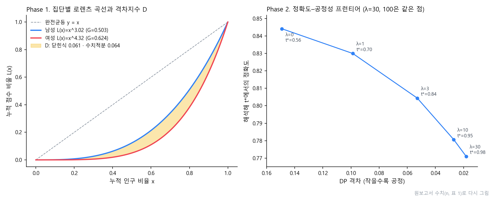

# Gini.

<p align="center"></p>

> 用微积分审计去掉性别后训练的“盲”收入分类器是否原样复现了性别差距的两阶段探究。先用定积分构建衡量歧视的指标，再对该指标求导，以解析方式求出兼顾准确率与公平性的判定阈值

---

## 1. 项目概述 (Overview)

| 项目 | 内容 |
|---|---|
| 项目名称 | Gini.（表现性评价②「지니계수가 숨긴 차별」 → 表现性评价③「공정성 적분 감사기」，分别意为“基尼系数掩盖的歧视”“公平性积分审计器”） |
| 一句话概述 | 证明基尼系数看不到群体间的平均差距，并提出两条洛伦兹曲线之间的面积 `D`。接着由 `J(t) = Acc(t) − λD(t)` 的一阶条件推导出最优阈值 `t*`，与真实数据网格搜索结果的准确率相差在1.9%以内 |
| 进行时间 | 2026.06（高二微积分表现性评价②·③，数学分析摘要） |
| 参与人数 | 个人探究 |
| 本人角色 | 选题设计、公式推导、Python 分析流水线、结果解读、撰写报告和海报 |
| 贡献度 | 100% |

在活动单上用定积分求洛伦兹曲线和基尼系数时，我开始好奇：这个把不平等压缩成一个数字的工具，能不能也用在人工智能上。**AI 模型的公平性也能这样衡量吗？这种衡量值得信赖吗？**

随着 AI 自动审核在贷款、招聘、福利筛选中普及，“数字弱势群体”问题日益突出，即算法在结构上对特定群体作出不利判定的问题。常见的应对办法是把性别这类保护变量排除在训练之外。但如果其他变量与性别相关，性别信息就会经由这些变量间接进入模型。因此我认为，部署之前需要一种直接剖析模型输出的事后审计工具。

| 假设 | 内容 | 验证 |
|---|---|---|
| 1. 代理变量 | 即使去掉保护属性，模型也会给出与现实差距相近的结果 | 各群体模型平均分 vs 现实基础率 |
| 2. 均值不变性 | 单一基尼系数对群体间平均差距不敏感，会把歧视性模型误判为公平 | 整体基尼系数的反应 |
| 3. 积分差距指数 | 两条洛伦兹曲线之间的面积 `D` 能捕捉到基尼系数遗漏的差距，且闭式解与数值积分一致 | 闭式解 vs 梯形积分 |
| 4. 微分优化 | `J′(t*) = 0` 的解析解与网格搜索最优点性能相同 | 两个 `t*` 处的准确率差 |
| 5. trade-off | 仅靠阈值追求完全公平时，`t*` 会饱和到上限，分类器变得毫无用处 | λ 扫描 |

## 2. 技术栈 (Tech Stack)

| 类别 | 技术 | 选择理由 |
|---|---|---|
| 数据 | UCI Adult (Census Income) 32,561条，去除缺失值后训练集21,113条 · 验证集9,049条（7:3分层划分） | 预测年收入是否超过5万美元的公开基准数据集，可作为对人进行判定的自动审核的替代任务 |
| 模型 | scikit-learn Logistic Regression（标准化 + 独热编码，排除性别、种族），验证 AUC 0.900 | 分数 `s = P(收入 > 50K)` 以概率形式输出，且 logit 接近正态分布，便于解读 |
| 数学 | 定积分（洛伦兹曲线·选择率·准确率）、微积分基本定理、链式法则、logit 正态分布 | 用累积量定义指标，求一次导就只剩下边界处的密度 |
| 数值分析 | SciPy `brentq`（区间二分法）、`norm`、网格搜索 | 直接利用一阶条件是在 `t*` 附近变号的连续函数这一性质 |
| 可视化 | matplotlib（密度·差距·`J(t)`·前沿，共4种图） | 用图形再确认一遍公式得出的结果 |

## 3. 核心功能与负责工作 (Key Features & Contributions)

### 设定

- 把模型给每个人打出的高收入分数 `s` 看作被分配的资源。用分数代替收入作为分配对象，就能把收入不平等指标原样移植到 AI 审计中。
- 按性别划分群体：A（男，人口占比0.680，基础率0.315）· B（女，0.320，0.108）。**基础率差距 +0.207** 在后文中被证明是所有差距的根源。

### Phase 1 — 用定积分衡量

```
G = 2 ∫₀¹ ( x − L(x) ) dx,    L(x) = xⁿ  ⇒  G = (n − 1)/(n + 1),   n = (1 + G)/(1 − G)
D = ∫₀¹ | L_M(x) − L_F(x) | dx = | 1/(n_M + 1) − 1/(n_F + 1) |
```

对各群体的分数排序、累加，用梯形积分求出 `G`，再反推 `n`。“曲线之间的面积”这一几何定义在 `xⁿ` 模型下可以化为闭式解，因此数值积分与解析解能够互相验证。

### Phase 2 — 用微分修正

```
SR_g(t) = ∫ₜ¹ f_g(s) ds,   Δ(t) = SR_A(t) − SR_B(t),   D(t) = Δ(t)²
Acc(t)  = Σ_g π_g [ p_g ∫ₜ¹ f_{g,1} ds + (1 − p_g) ∫₀ᵗ f_{g,0} ds ]

J′(t) = Acc′(t) + 2λ Δ(t) [ f_A(t) − f_B(t) ] = 0
```

- 把选择率和准确率都定义为分数密度的定积分，再用微积分基本定理求导，**就只剩下边界 `t` 处的密度值。** `D′` 中则同时用到链式法则和基本定理。
- λ = 0 时，一阶条件退化为经典的**贝叶斯阈值**，可借此检验模型。
- 假设 logit 服从正态分布（logit 正态），选择率就能闭合为 `Φ((μ − logit t)/σ)`。此时若类条件密度与群体无关，则 **`D ∝ (p_A − p_B)²`**，也就是说，公式本身显示出差距的根源在于基础率之差。

| 群体·类别 | μ | σ |
|---|:---:|:---:|
| A1（男·阳性） | +0.78 | 2.39 |
| A0（男·阴性） | −2.63 | 2.12 |
| B1（女·阳性） | +0.47 | 2.39 |
| B0（女·阴性） | −3.58 | 1.74 |

### 分析流水线

盲 LR 训练 → 按群体·类别拟合 logit 正态分布 → `J′(t*) = 0` 解析解（`brentq`）→ 真实数据网格搜索 → λ 扫描·可视化。用一个脚本（206行）跑完全部流程，结果保存在 `results.json` 中。

### 主要工作

- 论证基尼系数的均值不变性，设计差距指数 `D`
- 用积分定义选择率和准确率，借助 FTC 和链式法则推导一阶条件，将其具体化为 logit 正态形式，并得出推论 `D ∝ (p_A − p_B)²`
- 搭建 Python 分析流水线，交叉验证解析解与网格搜索结果
- 撰写报告（表现性评价②3页，表现性评价③8页）和数学分析摘要海报

## 4. 成果与结果 (Results & Metrics)

### 定量成果

<p align="center"></p>
<p align="center"><sub>根据原报告数值重新绘制的图。左图为两个群体洛伦兹曲线之间的面积 D，右图为 λ 越大、差距与准确率一同下降的前沿</sub></p>

**Phase 1**

| 群体 | 实际 > 50K | 模型平均分 | 基尼系数（群体内） | `n` |
|---|:---:|:---:|:---:|:---:|
| 男性 | 30.4% | 30.1% | 0.503 | 3.02 |
| 女性 | 10.9% | 11.5% | 0.624 | 4.32 |

- 把全体当作一个整体来看，只剩下整体基尼系数0.569这一个数字，看不出性别歧视的痕迹。
- 按群体拆分后，**平均差距18.6%p** 和 **差距指数 `D` = 0.064** 才显现出来，与闭式解的值在0.06的水平上一致。
- 模型的 `D`（0.064）小于用现实基础率计算的 `D`（0.097）。

**Phase 2（λ 扫描）**

| λ | `t*` 解析解 | `t*` 网格搜索 | Acc @ 解析 | Acc @ 网格 | \|ΔAcc\| | DP 差距 |
|:---:|:---:|:---:|:---:|:---:|:---:|:---:|
| 0 | 0.5633 | 0.4703 | 0.8442 | 0.8478 | 0.0036 | +0.1491 |
| 1 | 0.7041 | 0.6069 | 0.8300 | 0.8436 | 0.0136 | +0.0987 |
| 3 | 0.8407 | 0.7485 | 0.8044 | 0.8235 | 0.0191 | +0.0529 |
| 10 | 0.9516 | 0.8880 | 0.7806 | 0.7956 | 0.0149 | +0.0270 |
| 30 | 0.9800 | 0.9851 | 0.7710 | 0.7700 | 0.0010 | +0.0182 |
| 100 | 0.9800 | 0.9851 | 0.7710 | 0.7700 | 0.0010 | +0.0182 |

| 项目 | 结果 |
|---|---|
| 贝叶斯退化验证 | λ = 0 时 `Acc′(t*) ≈ 4.6 × 10⁻¹⁷` |
| 解析解 vs 网格搜索 | 所有 λ 下准确率差均在1.9%p以内 |
| trade-off | DP 差距 0.149 → 0.018，准确率 0.844 → 0.771（约7%p），`t*` 在0.98处饱和 |
| 假设 | 1–5全部得到支持 |
| 表现性评价分数 | （待确认） |

### 定性成果

- **用数字反驳了“去掉敏感变量就公平”的通行看法。** 去掉性别的模型给出女性11.5% · 男性30.1%，几乎原样描绘出了现实（10.9% · 30.4%）。
- 模型造成的差距与现实规模相当，但在常用指标（整体基尼系数）中却看不出来。
- 用“以积分衡量，以微分修正”一句话串起了两次表现性评价。前一阶段说明标准指标看不见歧视，后一阶段则回答了既然如此应当在哪里划线。
- 还制作了政策决策表。把 λ 当作组织的政策参数，就能在前沿表中选择：为了换取多少公平性，愿意让出多少准确率。

### 已知局限

- **盲模型中包含 `relationship` 变量。** 该变量的取值（Husband · Wife）几乎直接暴露了性别。假设1所说的经由代理变量间接渗入，与其说来自婚姻状况、工作时长这类弱代理变量，不如说这个变量的影响可能更大。需要去掉该变量后重新运行。
- 解析解与网格搜索在 `t*` 位置上的差异，有一部分来自 logit 正态假设的近似误差。
- **仅靠调整阈值无法触及基础率差距。** 必须同时采用预处理（重新加权）或训练中的公平性约束。
- 公平性标准只优化了选择率差距（Demographic Parity）一项，没有涉及它与机会均等、均等几率无法同时满足的不可能性定理。
- 只审计了性别，没有涉及与种族、年龄的交叉差距。
- 表1中的数值以图片形式放在报告里，这次没能与原始数据重新核对。脚本还在，但本地没有数据文件（`adult.data`），因此没有重新运行。（待确认）

## 5. 问题排查经验 (Troubleshooting)

### ① 用基尼系数看不出歧视

**问题** 用去掉性别的模型分数计算整体基尼系数，只得到0.569这一个数字。从这个值里读不出女性得分远低于男性这一事实。

**原因** 基尼系数只衡量分布的集中程度。所有分数都乘以 `c` 倍，`G` 也不会改变（均值不变性）。即使把某个群体的分数整体砍掉一半，基尼系数也依然不变。

**解决** 为各群体分别绘制洛伦兹曲线，把两条曲线之间的面积定义为新指标 `D`。用 `L(x) = xⁿ` 建模后，`D` 可以化为闭式解，从而让梯形数值积分与解析解能够互相验证。

**结果** `D` = 0.064 与闭式解在0.06的水平上一致。用 `D` 揭示出了隐藏在基尼系数0.569背后的18.6%p平均差距。

### ② 解析解与网格搜索的 `t*` 不一致

**问题** 由解析解求出的 `t*` 与真实数据网格搜索的 `t*`，在 λ 较小的区间相差较大。λ = 3 时为0.8407对0.7485。

**原因** logit 正态假设的近似误差是一方面，更主要的原因是准确率目标函数在最优点附近很平坦。在平坦的峰顶上，位置即使不同，高度（准确率）也几乎相同。

**解决** 改变验证标准：不看位置是否相同，而看该位置的性能是否相同。并列比较两个 `t*` 处测得的准确率，同时确认 λ = 0 时一阶条件是否退化为贝叶斯阈值（`Acc′(t*) ≈ 0`）。

**结果** 所有 λ 下准确率差都在1.9%p以内，λ = 0 时得到 `Acc′(t*) ≈ 4.6 × 10⁻¹⁷`。从两个方向获得了所推导一阶条件正确的依据。

### ③ λ 再怎么增大，差距也不归零

**问题** 把 λ 提高到30、100，`t*` 仍停在0.98，DP 差距到0.018就不再下降。这期间只有准确率从0.844降到了0.771。

**原因** 在 logit 正态模型中，若类条件密度与群体无关，则 `D ∝ (p_A − p_B)²`。差距的根源不在模型，而在基础率差距（+0.207）。无论把阈值设在哪里，这个常数项都不会消失。

**解决** 用公式说明了阈值调整这一后处理手段的局限，并在结论中明确写出“完全公平不是免费的”。同时提出了后续方向：必须配合预处理（重新加权）和训练中的公平性约束。

**结果** 定量地表明：仅靠阈值逼近完全公平时，分类器（`t*` = 0.98）几乎会拒绝所有人。

## 6. 链接与交付物 (Links & Deliverables)

| 类别 | 链接 |
|---|---|
| GitHub 仓库 | 无 |
| 交付物 | 表现性评价②报告「基尼系数掩盖的歧视」，表现性评价③报告「公平性积分审计器」，分析脚本（`.py`，206行），数学分析摘要海报 |
| 数据 | [UCI Adult](https://archive.ics.uci.edu/dataset/2/adult) |

<details>
<summary><b>符号</b></summary>

| 符号 | 说明 |
|---|---|
| `s` | 分类器分数 `P(收入 > 50K)`，`s ∈ [0,1]` |
| `t`, `t*` | 判定阈值（`s ≥ t` 时判为1），满足 `J′(t*) = 0` 的最优阈值 |
| `π_g`, `p_g` | 群体人口占比，基础率 `P(y=1 \| g)` |
| `f_{g,1}`, `f_{g,0}` | 按群体·类别划分的分数密度（阳性·阴性） |
| `SR_g(t)`, `Δ(t)`, `D(t)` | 选择率，选择率之差，差距指数 `Δ²` |
| `Acc(t)`, `J(t)`, `λ` | 准确率，目标函数 `Acc − λD`，公平性权重 |
| `L(x)`, `G`, `n` | 洛伦兹曲线 `xⁿ`，基尼系数，反推指数 |
| `μ`, `σ` | logit `logit(s)` 的正态拟合参数 |

</details>

<details>
<summary><b>术语</b></summary>

- **均值不变性**：所有值都乘以 `c` 倍后基尼系数不变的性质
- **代理变量**：与保护属性高度相关、间接传递其信息的变量
- **基础率**：群体内实际阳性的比例
- **DP 差距**：两个群体选择率之差。为0时即为人口统计均等
- **微积分基本定理（FTC）**：以积分上下限为变量求导时，只剩下边界处的被积函数值
- **logit 正态分布**：logit 变换值服从正态分布的 `[0,1]` 上的分布
- **贝叶斯阈值**：使准确率最大化的经典阈值，即 λ = 0 时的特解
- **准确率–公平性前沿**：描绘差距越小、准确率越低这一关系的曲线

</details>

---

+++

## DREAD 漏洞管理 (DREAD Risk Assessment)

本探究提出的是一种部署前的审计工具。这里用 DREAD 整理了不经审计就部署盲模型时的风险。

| 威胁 | D | R | E | A | D | 分数 | 应对（探究的建议） |
|---|---|---|---|---|---|---|---|
| 经由代理变量（`relationship` 等）渗入性别信息 | 3 | 3 | 2 | 3 | 1 | 2.4 | 在数据阶段重新确认与保护属性的相关性，去除强代理变量 |
| 只看整体基尼系数就误判为“公平” | 3 | 3 | 3 | 3 | 1 | 2.6 | 把群体差距积分指标 `D` 纳入审计标准 |
| 仅靠阈值追求公平，导致分类器失去用处 | 2 | 3 | 2 | 2 | 2 | 2.2 | 先用 λ 前沿看清代价，并配合预处理和训练中约束 |

<sub>D·R·E·A·D = 损害程度·可复现性·可利用性·影响范围·可发现性（1~3）。分数取平均值。</sub>
