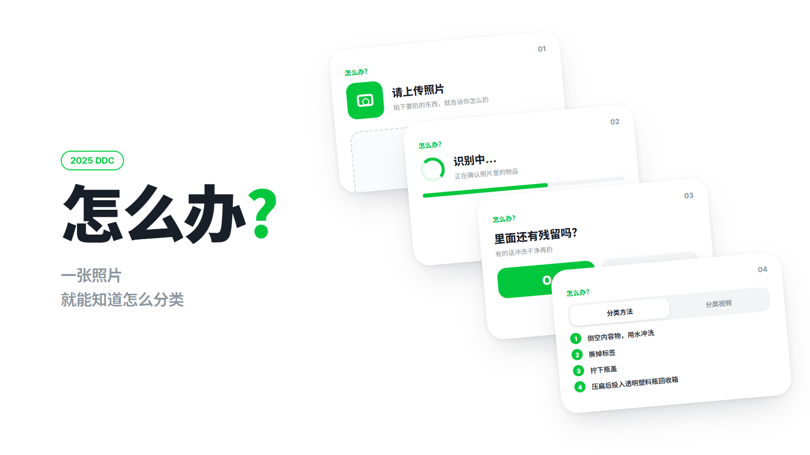
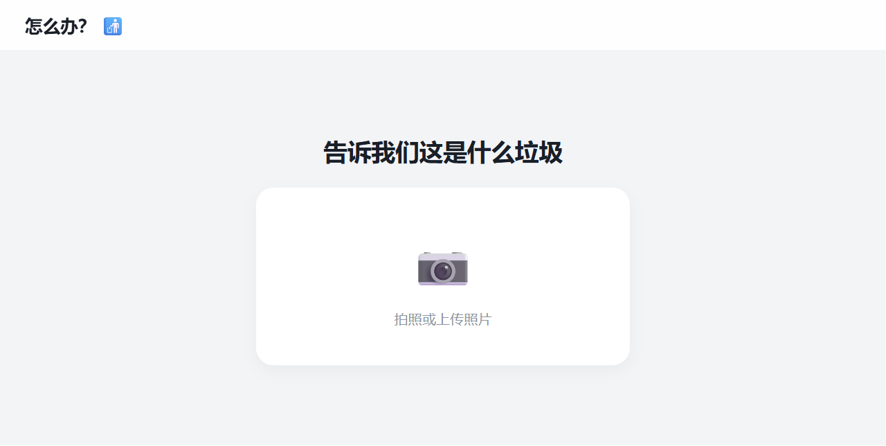
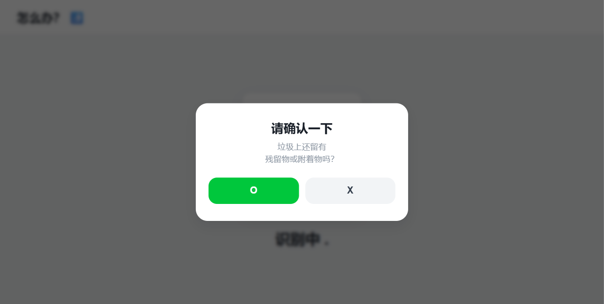
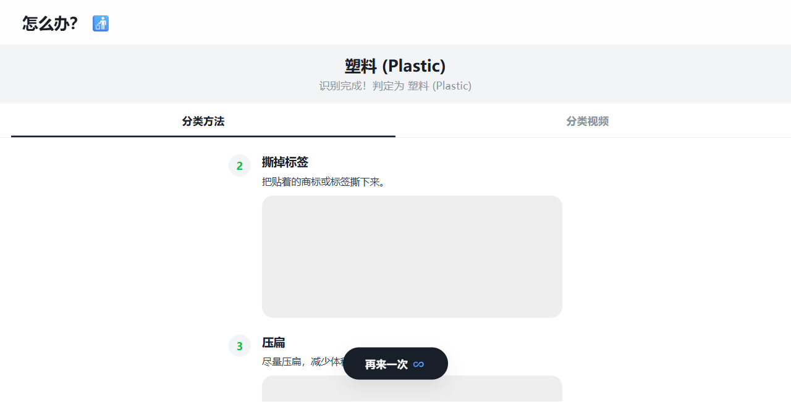
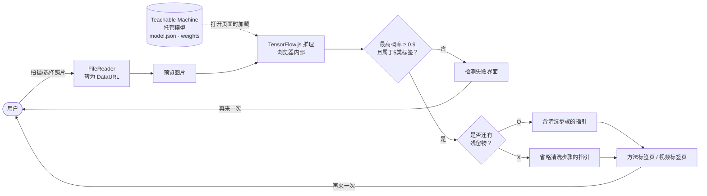

# HowTo

> 上传一张垃圾照片，就能识别材质、给出分类投放步骤和演示视频的 Web 应用「어떻게?」（意为“怎么办？”）

---

## 1. 项目概述 (Overview)

| 项目 | 内容 |
|---|---|
| 项目名称 | HowTo（服务名「어떻게?」） |
| 一句话概述 | 用在浏览器中运行的图像分类模型识别垃圾材质，再询问是否有残留物，只给出用户真正需要的投放步骤 |
| 进行时间 | 2025.12.10 ~ 2025.12.18（9天，2025 DDC 研究课题）· 之后于 2025.12.22、2026.03.03 做过小幅修改 |
| 参与人数 | 4人团队（大田大新高中一年级学生） |
| 本人角色 | 队长。负责 Web 应用的整体设计与开发、分类模型对接和 UI 实现。仓库中的50次提交全部来自本人账号 |
| 贡献度 | （待确认） |

分类投放规定繁杂，人们拿不准时要么问身边的人（47.2%），要么凭感觉处理（38.9%）。在团队问卷中，72.2%的受访者表示分类回收时经常感到困惑。我认为在搜索框里输入物品名称再找答案，这个过程本身就很麻烦，因此把目标定为：只要把摄像头对准物品，答案就会出来。

## 2. 技术栈 (Tech Stack)

| 类别 | 技术 | 选择理由 |
|---|---|---|
| 界面 | HTML · CSS · Vanilla JavaScript（单个 `index.html`） | 必须在9天内完成，结构上也不需要服务器。无需构建工具，一个文件就能完成部署和修改 |
| 推理 | TensorFlow.js + `@teachablemachine/image` | 模型在用户的浏览器中运行。照片不会发往外部服务器，也就无需另行运维推理服务器 |
| 模型训练 | Google Teachable Machine（图像分类，输入 224px） | 只要按类别放入图片就能完成迁移学习，结果用一个 URL 即可加载。适合在短时间内多次重新训练模型 |
| 数据 | 垃圾图像11个类别共20,773张（来源待确认） | 在公开垃圾分类数据集的类别构成上增加了塑料膜文件夹。最终模型使用其中5种材质 |
| 部署 | GitHub Pages | 只需要静态文件，没有额外的托管费用 |
| 设计 | 自定义设计令牌（CSS 变量） | 把颜色、圆角、阴影统一为变量，使整个界面的风格保持一致 |

## 3. 核心功能与负责工作 (Key Features & Contributions)

  
  
  

### 已实现功能

- **照片识别**：用 `FileReader` 读取拍摄或从相册选取的照片，送入模型。输出标签为塑料、塑料膜、纸、金属、玻璃5种。
- **识别失败处理**：最高概率低于0.9，或结果不属于这5种时，不显示指引，而是转到“检测失败”界面。点一下底部的 `또다시`（意为“再来一次”）按钮，就能从头重拍。
- **确认残留物后给出定制指引**：识别完成后立即询问“是否还有残留物或附着物？”。回答没有时，跳过清洗、倒空步骤，直接从投放步骤开始显示。
- **投放方法 / 视频标签页**：按材质提供2~3步的文字指引，以及团队成员拍摄的投放视频，分成两个标签页。
- **使用教程**：从首页 `이렇게!`（意为“就这样！”）按钮进入的6页使用说明，其中专门用一页说明识别失败的情况。
- **添加到主屏幕**：加入 iOS Web App 的 meta 标签，添加到主屏幕后会以无地址栏的全屏方式打开。

### 主要工作

- 设计界面流程（开场 → 上传 → 检测中 → 残留物确认 → 结果 / 失败）
- 编写模型加载、推理和阈值判定逻辑，重新训练模型后进行替换
- 设计按材质划分的指引数据结构。为每个步骤加上 `isCleaning` 标记，按残留物的回答进行过滤
- 定义设计令牌并全面重新设计（2025.12.16，新增640行、删除538行）
- 实现教程幻灯片与切换动画

## 4. 成果与结果 (Results & Metrics)

### 定量成果

| 项目 | 结果 |
|---|---|
| 开发周期 | 9天，50次提交 |
| 训练数据 | 收集11个类别共20,773张 → 最终模型使用5种材质 |
| 判定标准 | 仅当最高概率达到0.9以上时给出指引 |
| 问卷：偏好方式 | 85.7%偏好“拍照后给出指引”的方式 |
| 问卷：名称·角色 | 80.6%对问句式名称「어떻게?」感到亲切，88.9%表示如果有角色形象会更愿意使用 |
| 问卷：公共导入 | 86.1%表示如果由学校或地方政府提供就会使用 |
| 问卷受访人数 | （待确认） |
| 模型准确率 | 无测量记录（待确认） |

问卷中拒绝付费的理由分成了两派：“没有应用也能扔”（51.5%）和“嫌麻烦”（48.5%）。这意味着向个人收费的模式很难成立，团队由此得出面向学校和地方政府供应的 B2G 方向。

### 定性成果

- 无需服务器，一个浏览器就能跑完全部流程，运营成本为0。用户的照片也不会离开设备。
- 用一次提问补上了模型无法判断的信息（是否有残留物）。不增加分类类别，指引也能因人而异。
- 置信度低时不给出错误指引，而是让用户重拍，减少了诱导错误投放的情况。

### 已知问题（基于2026.09的代码）

- 识别为塑料膜时，显示的却是玻璃的指引和视频。指引数据中的 `Vinyl` 项仍停留在复制玻璃内容后的状态，已有的 `HowTo_Vinyl_Recycle.mp4` 没有用上。
- 纸类视频路径误写成了 `.mp4r`，纸类的视频标签页无法播放。
- 教程中写的是“按 O 会跳过清洗步骤”，而实际代码是在按 X（无残留物）时跳过。行为以代码为准，是说明文字写错了。
- TensorFlow.js 脚本以 `@latest` 引入，库一旦更新，行为可能在毫无预告的情况下改变。

## 5. 问题排查经验 (Troubleshooting)

### ① 模型加载不出来

**问题** 首次对接 Teachable Machine 模型时，识别功能完全不工作。

**原因** 两个问题叠在了一起。粘贴模型地址时，地址里又套了一遍地址（`.../models/https://.../models/zEph8gOIH//`），末尾还多出两个斜杠。此外，引入 TensorFlow.js 和 Teachable Machine 库的 `<script>` 标签缺失，即使地址正确，`tmImage` 也处于未定义状态。

**解决** 分三次提交修正了地址，并补上 CDN 脚本标签。加载模型前先检查 `tmImage` 和 `tf` 是否存在；若不存在或加载失败，不只输出到控制台，还会在界面上（Logo 旁边）显示“模型加载失败”。

**结果** 加载完成后会在控制台打印类别数，能立即确认模型是否正确载入。之后重新训练并替换模型时（`zEph8gOIH` → `HPWXwtXOO`），只需改一行地址。

### ② 把沾有食物的容器当成干净容器来指引

**问题** 初期模型把残留食物的外卖容器也直接判为“塑料”，应用便照此指引用户直接投放。实际上要洗净才能回收。

**原因** 图像分类模型学到的是材质，而不是状态。要区分“脏塑料”和“干净塑料”，就得按材质分别收集有无污染的照片，再重新训练。

**解决** 不让模型连状态一起判断，而是改成两阶段结构：识别完成后向用户问一次“是否还有残留物？”。在指引数据的每个步骤上加 `isCleaning` 标记，用户回答没有残留物时，过滤掉相应步骤。

**结果** 用同一个5类模型，就能根据状态给出不同的指引。照片看不出的信息由用户补上，模型无需扩大。不过，这一改动让准确率提升了多少，并没有测量。

### ③ 面对无法辨认的照片也自信作答

**问题** 即使上传模糊的照片或完全无关的物品，应用也总会给出某种指引。

**原因** 分类模型的输出概率之和为1。无论什么照片，总有一个概率最高的类别。最初的对接代码不管这个值是多少，都直接当作结果。

**解决** 分两次修正。先加入阈值，最高概率低于0.7即判为失败。当时标签若不在指引数据中，会按“其他垃圾”来指引，但这终究也是没有依据的答案。于是把阈值提高到0.9，并把标签范围以外的结果也导向失败界面。失败界面上放了提示重拍的文字和 `또다시` 按钮，教程里也增加了一页失败情况的说明。

**结果** 由给出错误指引改为引导用户重拍。在垃圾分类中，错误的答案比“不知道”更有害。不过，选择0.7和0.9的依据没有留下记录（待确认）。

## 6. 链接与交付物 (Links & Deliverables)

| 类别 | 链接 |
|---|---|
| GitHub 仓库 | [stx4R/HowTo](https://github.com/stx4R/HowTo)（私有） |
| 成果 | 研究结果报告、经营（市场进入）报告、探究海报、图书海报 |

### 系统架构图

---

+++

## 客户旅程图 (Journey Map)

| 阶段 | 用户的行为 | 用户的想法 | 应用的应对 |
|---|---|---|---|
| 投放前 | 拿着要扔的东西站在回收箱前 | “这个该扔哪儿？” | 首页只放一句文案（“让分类回收更简单。”）和两个按钮 |
| 首次使用 | 第一次用这个应用，有些犹豫 | “该点哪里？” | 用 `이렇게!` 教程预先展示整体流程 |
| 拍摄 | 拍下物品并上传 | “能认准吗？” | 放大显示上传的照片，用“检测中...”动画表示正在处理 |
| 确认 | 回答弹窗中的问题 | “要不要洗？” | 询问是否有残留物，只保留需要的步骤 |
| 投放 | 按顺序照做 | “原来这样就行” | 把编号步骤和视频分成标签页展示 |
| 失败 | 识别不出来 | “不行啊” | 不给错误答案，而是告知失败，并用 `또다시` 立即重试 |

## 自适应与预测式设计 (Adaptive & Predictive Design)

- **自适应**：以1920×1080为基准固定应用容器，比屏幕大时按比例缩小。窗口大小改变时布局也不会错乱。在竖屏平板和手机（宽度1024px以下、竖屏方向）上，只有教程页采用将图片和说明上下堆叠的单独布局。
- **预测式**：“是否还有残留物？”这个提问，是预先把握用户下一步行动的设计。已经洗干净再拿来的人不需要清洗指引，一个回答就能只留下这个人要做的事。

## 动效设计 (Motion Design)

- 开场页每点一下展开一步：Logo 先向上移，接着浮现副标题，然后是按钮。
- 教程幻灯片切换时，当前页向上退出，下一页从下方升起（0.5秒）。切换过程中的连击用 `isAnimating` 标记拦住。
- 检测过程中显示点数在1~3个之间变化的“检测中...”文字，1.5秒后给出结果。最初是1~2秒之间的随机延迟，后来改为固定值。
- 弹窗在背景变模糊的同时从下方上移20px。按钮在按住期间会略微缩小（scale 0.95）。

## 安全漏洞管理 (DREAD)

HowTo 没有服务器，也没有账号，照片也不会发送到设备之外。剩下的风险来自从外部加载的代码和模型。

| 威胁 | 损害程度 | 可复现性 | 可利用性 | 受影响用户 | 可发现性 | 判断 |
|---|---|---|---|---|---|---|
| 以 `@latest` 引入 CDN 脚本，新版本可能破坏应用，或混入被篡改的代码 | 中 | 高 | 低 | 全体 | 中 | 固定版本并加上 SRI（完整性哈希）是成本最低的措施 |
| 每次都从 Teachable Machine 服务器获取模型，服务一旦中断便无法识别 | 中 | 中 | 低 | 全体 | 低 | 把模型文件一并放进仓库，自行托管 |
| 轻信识别结果而错误投放（误分类） | 低 | 中 | 低 | 个人 | 高 | 通过0.9阈值和失败界面部分缓解，仍需测量准确率 |

修复顺序以 SRI·固定版本 → 模型自托管 → 测量准确率为宜。前两项只需几行代码，效果却惠及全体用户。
