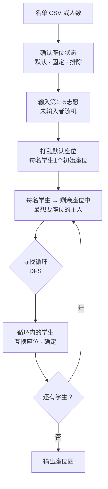

# Jari

<p align="center"></p>

> 为每名学生收集最多5个志愿座位，再用 Top Trading Cycles（TTC）算法互换座位完成分配的教室座位编排程序

---

## 1. 项目概述 (Overview)

| 项目 | 内容 |
|---|---|
| 项目名称 | Jari（桌面版「우리반 자리 배정 시스템」，意为“我们班座位分配系统”；网页版「스마트 자리 배정」，意为“智能座位分配”） |
| 一句话概述 | 不靠抽签，而是收集学生的偏好，先把座位分下去，再让有需要的人相互交换，以此确定座位 |
| 进行时间 | 2026.03.03 ~ 2026.03.06（4天）· 03.03 桌面版（Python）→ 03.06 网页版（HTML/JS） |
| 参与人数 | 个人项目 |
| 本人角色 | 算法选择与实现、桌面 GUI 与网页 UI 开发、可执行文件打包 |
| 贡献度 | 100%（仓库5次提交全部由本人完成） |

新学期的座位通常靠抽签决定。抽签固然公平，但想坐某个位置的学生，其偏好完全得不到体现。反过来，如果收集偏好后由老师手工调整，结果就取决于谁先开口、照顾了谁的情况。我的目标是在体现偏好的同时，按确定的规则完成分配。

算法取自匹配理论。广为人知的 Gale-Shapley 适用于双方都有偏好的双边匹配（学生-学校、求职者-公司）。座位不会挑选学生，所以这个问题是只有一方有偏好的单边分配。因此我选择了 TTC：先给每名学生分一个座位，再让他们与自己想要的座位的主人互换。

## 2. 技术栈 (Tech Stack)

| 类别 | 技术 | 选择理由 |
|---|---|---|
| 桌面版 | Python 3.13 · customtkinter（278行） | 比原生 tkinter 能用上更简洁的深色主题控件。文件对话框和消息窗口直接沿用 tkinter 自带的 |
| 打包 | PyInstaller 单个可执行文件（`.exe`，约14MB） | 教室电脑无需安装 Python 即可直接运行 |
| 网页版 | HTML · CSS · Vanilla JavaScript（单个 `index.html`，579行） | 无需安装，用浏览器即可打开。通过点击改变教室布局的座位图，用网页做起来更容易 |
| 字体 | Pretendard（jsDelivr CDN） | 韩文可读性 |
| 输入 | CSV（`번호,이름`，即“学号,姓名”） | 学校使用的名单可以直接从 Excel 保存后使用 |

## 3. 核心功能与负责工作 (Key Features & Contributions)

<p align="center"></p>
<p align="center"><sub>网页版，人数模式24人。将1、2号设为固定座位、31~36号设为排除座位后的分配结果</sub></p>

### 已实现功能

- **准备名单**：导入 `번호,이름` 格式的 CSV。网页版还有不需要名单、只输入人数（最多36人）的模式，不上传姓名也能使用。
- **输入偏好**：为每名学生选择第1~5志愿的座位。同一座位选两次则不予保存。没能全部收齐时，会询问是否随机补全其余学生的偏好。另有一个供演示用的全部随机生成按钮。
- **TTC 分配**：每一轮中，每名学生指向“尚未离场的座位中自己最想要的那个座位的主人”。沿着指向关系走下去会形成循环，循环内的学生互换座位后退出。如果想要的座位都已离场，就指向自己的座位，留在原位。
- **座位图**：以黑板、讲台下方分3组、每组2列的布局展示结果。
- **座位状态调整（网页版）**：点一次课桌设为固定座位，点两次设为排除座位。固定座位上的学生在下次分配时留在该座位，排除座位则从偏好列表和分配中剔除。剩余座位少于学生人数时，阻止分配并说明原因。

### 主要工作

- 问题定义与算法选择（不是双边匹配 Gale-Shapley，而是单边分配 TTC）
- 实现 TTC：构建指向图、DFS 寻找循环、按轮次迭代
- customtkinter GUI（三步式侧边栏、日志窗口、偏好输入窗口、座位图窗口）与 PyInstaller 打包
- 移植网页版并新增功能（随机初始分配、固定座位与排除座位、人数模式、座位不足检查）

## 4. 成果与结果 (Results & Metrics)

### 定量成果

以下是把网页版的分配代码原样移植到 Node.js，为每名学生随机生成5个志愿，各条件运行5,000次的结果（2026.09 撰写报告时测量，脚本见 [`assets/ch/Jari/seat_sim.js`](../assets/ch/Jari/seat_sim.js)）。

| 条件（学生 / 座位） | 分到第一志愿 | 前三志愿以内 | 前五志愿以内 |
|---|---|---|---|
| 30人 / 30座 | 49.7% | 73.4% | 81.2% |
| 24人 / 30座 | 39.0% | 66.8% | 76.7% |
| 24人 / 36座 | 31.3% | 58.9% | 70.3% |

| 项目 | 结果 |
|---|---|
| 开发周期 | 4天（桌面版1天，网页版1天） |
| 成果 | 可执行文件1个（约14MB）+ 网页1个 |
| 支持规模 | 网页版最多36座，桌面版座位图35座 |
| 实际课堂使用 | （待确认） |

学生数与座位数相同时，约一半的学生分到第一志愿，80%以上分到前五志愿以内的座位。座位越富余数值越低，原因整理在下文“已知局限”中。

### 定性成果

- 把抽签与手工调整之间的矛盾重新定义为匹配理论问题，并选择了契合问题结构（单边）的算法。
- 用 Python GUI 和网页两种形式实现同一算法，可以根据教室电脑的情况，在安装版和浏览器版之间选择。
- 在网页版中，用三种座位状态解决了各教室课桌布局不同、“这个学生固定坐前排”之类的现实条件。

### 已知局限（基于2026.09的代码）

- **空座位不进入交换市场。** 网页版把可用座位打乱后，只按学生人数截取，作为初始座位分下去。其余空座位不属于任何人，学生即使把它填为第一志愿也分不到。在24人 / 36座的条件下，有33.2%的第一志愿指向这类空座位。换用把空座位也纳入市场的变体（YRMH-IGYT：空座位指向优先级最高的学生），在相同条件下运行，结果差别很大。

  | 条件 | 当前 第一志愿 / 前五志愿以内 | 纳入空座位后 第一志愿 / 前五志愿以内 |
  |---|---|---|
  | 24人 / 30座 | 39.0% / 76.7% | 61.4% / 95.7% |
  | 24人 / 36座 | 31.3% / 70.3% | 68.2% / 98.5% |

- **打乱座位的方式并不均匀。** `sort(() => 0.5 - Math.random())` 的比较函数前后不一致，各种排列出现的概率并不相同。打乱30个元素时，第一个元素仍留在第一位的概率为8.49%，是均匀情况（3.33%）的2.5倍。初始座位分配的公平性取决于这一步，因此应改用 Fisher-Yates 洗牌。
- **只收集到第五志愿。** 已有证明表明，TTC 在收集完整偏好时，任何人都无法通过谎报偏好获利。截断为5个之后这一保证是否依然成立，需要另行论证。
- **网页版只按 UTF-8 读取 CSV。** 桌面版中的 CP949 备用读取没有移植过来，从 Excel 保存的韩文名单可能出现乱码。
- **桌面版座位图固定为35座。** 36人以上时可以完成分配，但不会显示在座位图上。
- **把没有学生的座位设为固定座位，实际上就成了排除座位。** 因为固定座位会从待分配的座位中剔除。

## 5. 问题排查经验 (Troubleshooting)

### ① 名单顺序就是初始座位，学号靠前的人占优

**问题** 桌面版把第 k 号座位作为初始座位分给名单上的第 k 名学生。TTC 从初始座位出发进行交换，一开始就持有热门座位的学生在交换中占优。

**原因** 假设多数学生偏好前排（越靠前被选中的权重越高），以30人 / 30座运行5,000次。名单上1~5号有66.5%分到第一志愿，26~30号只有7.1%。仅仅因为学号靠前，就拿到了前排座位的所有权，并带着它进入交换。

**解决** 在网页版中改为先打乱可用座位，再分给学生（随机初始分配）。

**结果** 相同条件下，1~5号与26~30号的第一志愿分配率分别为31.6%和31.8%，二者持平。顺带一提，已知随机初始分配的 TTC 与按随机顺序让每人依次挑选的方式（随机序列独裁）结果分布相同（Abdulkadiroğlu & Sönmez, 1998）。不过由于上述洗牌偏差，当前实现并非完全均匀。以上数据是撰写报告时通过模拟实验（[`seat_sim2.js`](../assets/ch/Jari/seat_sim2.js)）得到的。

### ② 教室里的课桌并不刚好等于学生人数

**问题** 桌面版让座位数与学生数相同，座位图画成35座。实际教室里会有空课桌，还有不使用的座位，以及因视力或个人情况事先定好的座位。

**原因** 只把座位当成“与学生人数一样多的编号列表”来处理，没有地方记录每个座位的状态。

**解决** 在网页版中先画出36座的网格，给每个座位设置状态（默认 · 固定 · 排除）。每点一次课桌，状态就轮换一次。偏好输入列表和随机偏好生成都会跳过排除座位。分配前如果 `36 - 排除座位 - 固定座位` 少于待分配的学生人数，就停下来并提示应释放哪些座位。

**结果** 上传名单之前就能先把教室布局设好。固定座位的学生即使重新分配也会留在原位。

### ③ 用 Excel 保存的名单中韩文变成乱码

**问题** 学校名单通常是在 Excel 中另存为 CSV 来用。只按 UTF-8 读取这类文件时，导入会失败。

**原因** 韩文版 Windows 的 Excel 以 CP949（EUC-KR 系）保存 CSV。按 UTF-8 读取时，遇到韩文字节就会抛出 `UnicodeDecodeError`。

**解决** 在桌面版中先按 UTF-8 读取，出现解码错误时再按 CP949 重新读取。两种情况下文件都在 `finally` 中关闭。

**结果** 直接从 Excel 保存的名单和 UTF-8 名单都能读取。网页版目前还没有这项处理。

## 6. 链接与交付物 (Links & Deliverables)

| 类别 | 链接 |
|---|---|
| GitHub 仓库 | [stx4R/Jari](https://github.com/stx4R/Jari)（私有） |
| 部署网址 | https://stx4r.github.io/Jari/ |
| 可执行文件 | 仓库中的 `Jari.exe`（Windows） |
| 模拟实验 | [`seat_sim.js`](../assets/ch/Jari/seat_sim.js)、[`seat_sim2.js`](../assets/ch/Jari/seat_sim2.js) |

### 算法流程



一轮的示例：

```
A 想要 B 的座位，B 想要 C 的座位，C 想要 A 的座位
→ A → B → C → A 构成循环 → 三人同时换到想要的座位并退出
```

---

+++

## 客户旅程图 (Journey Map)

用户是负责分配座位的班主任（或班干部）。

| 阶段 | 用户的行为 | 用户的想法 | 程序的应对 |
|---|---|---|---|
| 准备 | 回想教室的课桌布局 | “我们班不用最后一排” | 即使没有名单，也可以先点课桌指定排除座位 |
| 名单 | 寻找名单文件 | “能上传姓名吗？” | 用只输入人数的模式，仅凭学号就能分配 |
| 收集偏好 | 向学生收集想要的座位 | “还没收齐” | 询问是否随机补全未输入的学生 |
| 分配 | 点击按钮 | “结果可信吗？” | 桌面版会把每一轮的循环记录到日志中 |
| 调整 | 把某个学生安排到前排 | “只固定这个学生，再来一次” | 设为固定座位后，重新分配时仍留在原位 |

## 自适应设计 (Adaptive Design)

- 桌面版在1000×650的固定窗口中放置三步式侧边栏，从上往下依次点按钮即可完成操作。前一步完成之前，下一个按钮处于禁用状态。
- 网页版沿用同样的三步式侧边栏，把座位图放在右侧。在2026.03.06的第二次提交中统一缩小了边距、字号和课桌尺寸（课桌84×70 → 78×64），让36个座位能放进一屏。

## 安全漏洞管理 (DREAD)

座位分配必须守住结果的公平性。凡是操纵或偏差可能改变结果的环节，都视为威胁。

| 威胁 | 损害程度 | 可复现性 | 可利用性 | 受影响用户 | 可发现性 | 判断 |
|---|---|---|---|---|---|---|
| 有偏差的洗牌使特定座位更常落到特定序号的学生手中 | 中 | 高 | 低 | 全班 | 低 | 换成 Fisher-Yates。虽然只有一行代码，但从外部看不出来，应优先修复 |
| 操作者反复重跑，直到对分配结果满意为止 | 中 | 高 | 高 | 全班 | 低 | 公开随机数种子并与结果一同记录，就能核实是否重跑过 |
| 用 `innerHTML` 渲染 CSV 中的姓名，可能被注入脚本 | 低 | 中 | 中 | 操作者电脑 | 中 | 名单文件由操作者亲自选择，风险较低。改用 `textContent` 即可 |

修复顺序以替换洗牌 → 记录种子 → 改用 `textContent` 为宜。前两项与公平性直接相关。
