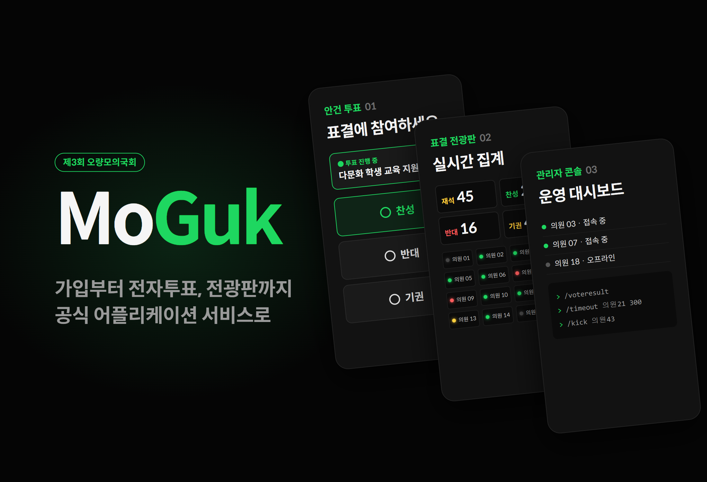
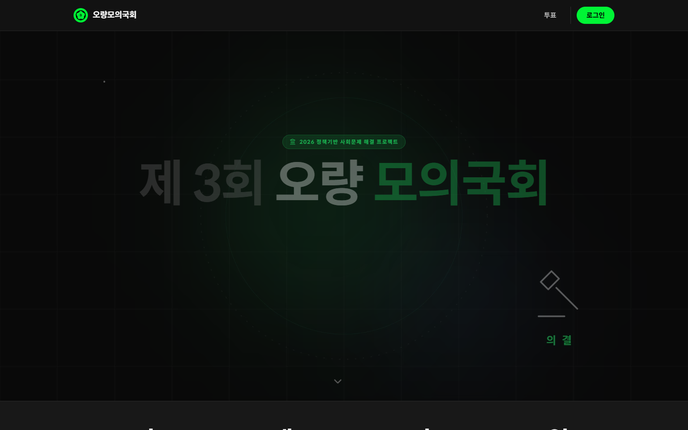
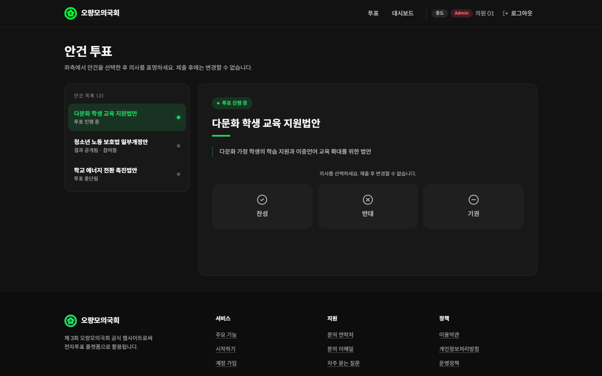
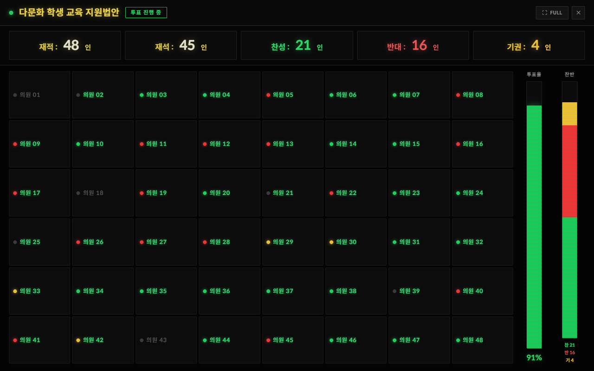
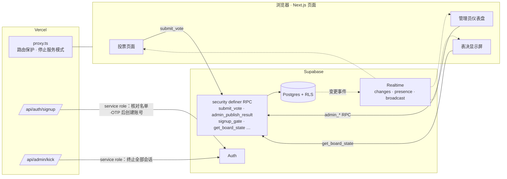

# MoGuk

<p align="center"></p>

> 为130名议员参加的第三届 Oryang 模拟国会，把注册、电子投票、表决显示屏和运营工具整合在一起的官方 Web 服务

---

## 1. 项目概述 (Overview)

| 项目 | 内容 |
|---|---|
| 项目名称 | MoGuk（第三届 Oryang 模拟国会官方网站 · 电子投票平台） |
| 一句话概述 | 只有预先登记的议员才能注册，并对每项议案各投一票；运营团队通过显示屏管理出席与表决，结果由服务器直接统计并公布 |
| 大会时间 | 2026.05.29 ~ 2026.07.25（常任委员会07.18，全体会议07.25）· 大田大新高中 |
| 仓库周期 | 2026.05.21（v1.0）~ 2026.07.24（闭幕后停止服务）· 32次提交 |
| 参与人数 | 开发团队3人（网站页脚标注 stx4R · kmc11004） |
| 本人角色 | 开发（仓库32次提交全部来自本人账号）。具体分工（待确认） |
| 贡献度 | （待确认） |

Oryang 模拟国会是校内12个社团联合举办的青少年模拟国会。第三届大会采用进步派40人 · 保守派40人 · 中间派50人的三党体制，运行9个常任委员会。从议案研究到全体会议电子投票，整个活动持续近两个月，因此需要一套系统，在同一处负责参会者名单管理和投票的公正性。本服务既是活动的官方网站，也是全体会议的表决系统。谁有资格投票、每人是否只投一次、公布的数字是否与实际票数一致，全部设计为由服务器和数据库来保证。

## 2. 技术栈 (Tech Stack)

| 类别 | 技术 | 选择理由 |
|---|---|---|
| 框架 | Next.js 16.2 (App Router) · React 19 · TypeScript | 页面和服务器 API（`app/api`）放在同一个仓库里。在 `proxy.ts`（Next 16 的中间件）中，请求到达页面之前先过滤权限 |
| 样式 | Tailwind CSS v4（`@theme` 令牌）· framer-motion · three.js(@react-three/fiber) | 用 CSS 变量管理深色主题的设计令牌。用于区块入场动画和首页的 3D 背景 |
| 认证 | Supabase Auth + 预先登记名单（`allowed_names`）+ OTP | 只有持有运营团队预先发放的姓名·OTP 组合的人才能创建账号 |
| 数据 | Supabase Postgres · Row Level Security · `security definer` RPC | 禁止直接写表，投票、统计、管理操作全部交给 DB 函数处理。即使客户端被篡改，规则仍在 DB 中得到执行 |
| 实时 | Supabase Realtime（`postgres_changes` · Presence · Broadcast） | 议案的开启/关闭和结果公布即时同步到所有界面。可查看在线情况，并断开特定用户的会话 |
| 部署 | Vercel · PWA 清单（`standalone`） | 推送即部署。可以像应用一样安装到手机主屏幕 |

## 3. 核心功能与负责工作 (Key Features & Contributions)

<p align="center"></p>
<p align="center">
  
  
</p>
<p align="center"><sub>基于本地构建截图。投票和显示屏界面用假数据代替 Supabase 进行渲染（议案名、议员名均为示例）。</sub></p>

### 已实现功能

- **邀请制注册**：凭姓名 + 运营团队发放的 OTP + 邮箱 + 密码（8位以上）注册。服务器 API 先把 IP 和姓名交给 DB 闸门（`signup_gate`）判定是否允许此次尝试，再确认是否为名单上的姓名·OTP 组合、该姓名是否已注册，然后用 service role 密钥创建账号。失败原因不作区分，一律返回相同的响应。
- **议案投票**：对开放中的议案在赞成、反对、弃权中选择一项。只能通过 `submit_vote` 这一个 RPC 提交，提交后不能更改。DB 函数依次检查登录状态、是否被封禁、议案是否开放、是否重复，最后由 `(agenda_id, user_id)` 唯一约束兜底防止重复。
- **结果公布**：投票期间任何人都看不到统计。管理员公布时，服务器直接统计 `votes` 生成结果行，并实时显示在所有在线用户的界面上。
- **表决显示屏**：像国会的电子显示屏一样，用每位议员对应的 LED 显示赞成、反对、弃权、未投票，同时显示在籍人数、在席人数、赞成与反对票数以及投票率条形图。管理员可以处理出席、校正表决。已公布结果的议案，议员也能以只读方式查看（公开记名表决）。
- **管理员仪表盘**：在线议员列表（Presence），议案的创建、开启、关闭、完成，以及 `/kick` `/ban` `/timeout` `/voteresult` 命令控制台。
- **强制登出**：通过 RPC 记录状态，服务器 API 用 service role 密钥断开目标的所有会话，再通过 Broadcast 通知目标界面。目标界面收到广播后并不立即登出，而是向服务器重新查询会话，只有确实已被断开时才跳转到登录界面。
- **大会信息·政策页面**：日程、常任委员会、政党构成，使用条款、隐私政策、运营政策，指南视频，FAQ。
- **停止服务模式**：闭幕后通过一个标志把所有页面切换为停止服务说明，API 则以 `410 Gone` 关闭。

### 主要工作

- 设计认证与权限流程（预先名单 + OTP 注册、`proxy.ts` 路由保护、管理员 API 的来源检查）
- 设计 Supabase 数据库结构、RLS 策略和 RPC，并落实安全检查结果（V-1 · V-3 · V-4）
- 实现投票页面、管理员仪表盘、表决显示屏
- 配置安全响应头（CSP · HSTS · X-Frame-Options 等）
- 精简功能并整理公开仓库（v4.2 删除5,206行，07.13 移除 DB 脚本）

## 4. 成果与结果 (Results & Metrics)

### 定量成果

| 项目 | 结果 |
|---|---|
| 对象活动 | 议员130人（3个政党）· 社团12个 · 常任委员会9个 · 大会周期58天 |
| 服务规模 | 页面11个 + 服务器 API 2个，TS/TSX/CSS 共4,471行 |
| DB 设计 | 表13张，RLS 策略33条（以 v4.2 之前的数据库结构为准），客户端调用的 RPC 12种 |
| 开发历程 | 32次提交，版本 v1.0 → v7.2 → 闭幕 |
| 功能精简 | v4.2 删除聊天、公告、Bug 反馈等共5,206行 |
| 实际注册人数 · 投票数 · 同时在线人数 | （待确认） |

### 定性成果

- 投票的三个条件（只有具备资格的人、只投一次、公布的数字与实际票数一致）不是靠界面，而是由 DB 规则来保证。即使修改客户端代码也无法绕过。
- 把全体会议前的安全检查项（V-1 · V-3 · V-4 等）按编号管理，逐一修复。
- 果断砍掉了用不上的功能。聊天和 Bug 反馈这类功能都是可能遭受攻击的入口，对活动来说也并非必需。
- 闭幕后明确关闭服务，消除了经由残留账号和数据进入的途径。

### 已知局限（基于2026.09的代码）

- **DB 脚本不在仓库中。** 2026.07.13 的提交从公开仓库中删除了数据库结构、RLS 和安全补丁的 SQL（1,366行）。此后新增的 `signup_gate` 等函数完全没有记录，仅凭仓库无法重新搭建服务。
- **在客户端屏蔽开发者工具不算安全措施。** 屏蔽 F12、右键、`debugger` 的脚本仍然保留。正如代码注释所写的“另有服务器层面的保护”，真正的防线是 CSP 和 RLS。
- **CSP 中有 `script-src 'unsafe-inline'`。** 上述内联脚本需要它，但对脚本注入的防御也相应减弱。
- **闭幕提交破坏了首页布局。** 为了让停止服务说明页居中，把 `main` 改成了横向 `flex`。如果重新开放服务，由多个区块组成的首页会被横向挤压。上方截图是恢复到闭幕前的布局后拍摄的。
- **强制登出的三个步骤各自独立执行。** RPC · 服务器 API · Broadcast 之间没有事务，中间步骤失败，后续步骤仍会执行。

## 5. 问题排查经验 (Troubleshooting)

### ① 只要登录就能看到别人的票，结果数字由客户端决定（安全检查 V-1 · V-4）

**问题** 在常任委员会（07.18）六天前的安全检查中发现了两个问题。`votes` 表的查询策略是 `to authenticated using (true)`，任何登录用户都能读取其他议员的选择。结果公布也是把管理员界面算出的数字直接写入结果表的结构。

**原因** 这条策略最初的名称是“认证用户可查询投票结果”。为了展示统计，把原始选票表本身开放了出去。结果公布只依赖“只有管理员会点”这一界面条件。一旦管理员账号被盗或请求被篡改，数字就可能被改动。

**解决** （V-1）把 `votes` 的查询范围收窄为本人的票和管理员。投票页面只读自己的票，需要统计的地方由 `security definer` 函数代为计数。（V-4）把结果公布移到 `admin_publish_result` RPC，确认管理员权限后由服务器直接统计 `votes` 生成结果行。客户端发来的数字一概不收。

**结果** 投票期间除管理员外任何人都看不到个人选票，公布的数字始终与 DB 中的实际票数一致。之后在 v7.1 中增加了一个单独的 RPC（`get_published_board_state`），只对已公布结果的议案以只读方式展示各议员的表决。公布前严守秘密，公布后透明展示记名表决。

### ② 注册尝试限制在无服务器环境中无法正常生效（V-3）

**问题** 注册 API 限制每个 IP 每分钟最多尝试5次，目的是拖慢对 OTP 的暴力破解攻击。

**原因** 尝试次数保存在服务器内存的 `Map` 中。Vercel 的无服务器函数每次请求都可能在不同的实例上运行，实例冷却后内存也随之消失。每个实例各有一套计数器，限制实际上形同虚设。IP 读取的也是 `x-forwarded-for` 的最后一个值（最近的代理）。

**解决** 把尝试记录和判定移到 DB 函数 `signup_gate`，让所有实例看到同一份记录。同时传入 IP 和姓名，注册成功后用 `signup_mark_success` 标记该次尝试（函数本体不在仓库中，具体规则待确认）。读取 `x-forwarded-for` 时也改为使用第一个值（原始客户端），而非最后一个值。同一轮还堵住了另外两处。
- **姓名规范化**：与名单比对前，把姓名规范化为 NFC，并删除控制字符和零宽空格。防止有人插入肉眼看不见的字符，用同一个姓名重复注册，或干扰名单比对。
- **删除 OTP 痕迹**：账号创建后立即从用户元数据中删除 OTP，因为元数据可以用本人的令牌读取。

**结果** 无论实例有多少，都适用同一套限制。失败响应不论原因都完全相同，仅凭响应无法得知哪个姓名在名单上。

### ③ 在实时显示屏上不漏掉未投票处理，也不搞乱响应顺序

**问题** 表决显示屏（v7.0）实时接收 `votes` 表和出席表的变更并重新绘制。当管理员把某位议员的票退回“未投票”，或投票集中导致查询接连发出时，界面可能与实际状态不一致。

**原因** 未投票处理是删除 `votes` 行的操作。Realtime 的 DELETE 事件只带主键，如果设置了 `agenda_id=eq.{议案}` 这样的服务器过滤器，这个事件就会被过滤掉。另外，先发出的查询如果响应较晚到达，旧状态就会覆盖新状态。

**解决** `votes` 不加服务器过滤器直接订阅，只有当收到的事件没有 `agenda_id`（DELETE）或与当前议案相同时才重新加载。每次查询都编上序号（`fetchSeq`），只把最近一次发出的查询的响应反映到界面上。管理员的出席和表决校正先反映到界面，若 RPC 失败再恢复原值。

**结果** 无论新增、修改还是删除，显示屏都能跟上；即使响应顺序颠倒，留下的也是最终状态。这些处理在最初创建显示屏的提交中就一并加入了。

### ④ 链接下划线工具类不生效

**问题** 给页脚链接加了 `underline` 类，下划线还是不出现。

**原因** Tailwind v4 使用 CSS 级联层。全局 CSS 中的 `a { text-decoration: none }` 重置写在层外，而层外的规则总是优先于层内的工具类。

**解决** 把重置移到 `@layer base` 之内。

**结果** 默认保持无下划线，需要的地方可以用工具类覆盖。

## 6. 链接与交付物 (Links & Deliverables)

| 类别 | 链接 |
|---|---|
| GitHub 仓库 | [L-INK-dshs/MoGuk](https://github.com/L-INK-dshs/MoGuk)（公开） |
| 部署网址 | https://moguk.vercel.app （2026.07.24 闭幕后为停止服务说明页） |

### 系统架构图



单次投票的处理顺序：

```
submit_vote(议案, 选择)
 ├─ 是否已登录          否则拒绝
 ├─ 是否被封禁或暂停    是则拒绝
 ├─ 议案是否开放        否则返回 "投票已截止"
 ├─ 是否已投过票        是则拒绝
 └─ INSERT  ── (agenda_id, user_id) 唯一约束是最后一道防线
```

---

+++

## 客户旅程图 (Journey Map)

用户是参加大会的议员。

| 阶段 | 用户的行为 | 用户的想法 | 服务的应对 |
|---|---|---|---|
| 注册 | 用从运营团队拿到的 OTP 注册 | “随便什么人都能注册怎么办？” | 只有名单上的姓名·OTP 组合才能成为账号 |
| 等待 | 全体会议前浏览网站 | “什么时候做什么？” | 首页展示日程、常任委员会、政党构成和指南视频 |
| 投票 | 选择开放中的议案，点击赞成或反对 | “投进去了吗？” | 绿点闪烁的是正在进行的议案，提交后固定显示我的选择 |
| 结果 | 等待结果公布 | “别人是怎么投的？” | 公布的瞬间所有界面都显示结果，并可查看各议员的显示屏 |
| 闭幕 | 活动结束后再次访问 | “我的信息呢？” | 只剩停止服务说明和联系方式 |

## 自适应设计 (Adaptive Design)

- 投票页面在宽屏上是左侧议案列表 + 右侧详情的两栏布局，在窄屏（小于 `md`）上变为可横向滑动的议案标签列表 + 详情的单栏布局。
- 显示屏先按1280×720的基准做好画面，再按父元素宽度等比缩小（`ResizeObserver`）。在手机上也能看到与礼堂屏幕相同的布局。点击全屏按钮即可直接投到投影仪上。
- 在桌面端，窗口高度达到700px以上时，把正文固定为屏幕高度（`md:[@media(min-height:700px)]`）。

## 动效设计 (Motion Design)

- 各区块进入画面时通过 framer-motion 从下方浮现，数字统计从0增长到目标值。
- 进行中议案的绿点以1.6秒为周期，像脉搏一样闪烁。
- 显示屏 LED 以赞成、反对、弃权对应的颜色柔和发光（glow），远处也能分辨状态。
- 首页背景是用 three.js 绘制的 3D 场景。

## 安全漏洞管理 (DREAD)

| 威胁 | 损害程度 | 可复现性 | 可利用性 | 受影响用户 | 可发现性 | 措施 |
|---|---|---|---|---|---|---|
| 查看个人选票（侵犯秘密投票） | 高 | 高 | 高 | 全体 | 中 | 通过 V-1 将查询策略限制为本人 + 管理员 — **已解决** |
| 篡改结果数字 | 高 | 中 | 中 | 全体 | 低 | 通过 V-4 只允许服务器统计 RPC — **已解决** |
| 通过 OTP 暴力破解抢注他人姓名 | 高 | 中 | 中 | 相关议员 | 中 | V-3 DB 闸门 · 统一的失败响应 · 姓名规范化 — **已解决** |
| 重复投票 | 高 | 低 | 低 | 全体 | 低 | RPC 检查 + 唯一约束双重防御 — **设计阶段即已具备** |
| 伪造的强制登出广播 | 中 | 中 | 中 | 个人 | 中 | 收到广播后向服务器重新确认会话 — **设计阶段即已具备** |
| 允许内联脚本（`unsafe-inline`） | 中 | 低 | 低 | 全体 | 中 | 移除开发者工具屏蔽脚本，改用基于 nonce 的 CSP — **遗留问题** |

损害程度和影响范围最大的前三项，已在全体会议（07.25）前的7月12日~21日修复。遗留问题只剩内联脚本这一项。
