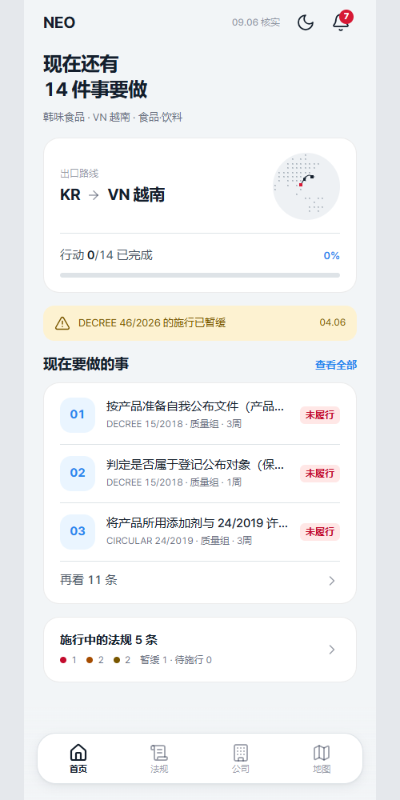
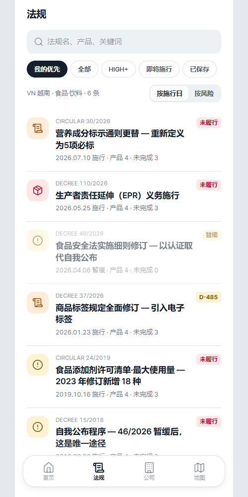
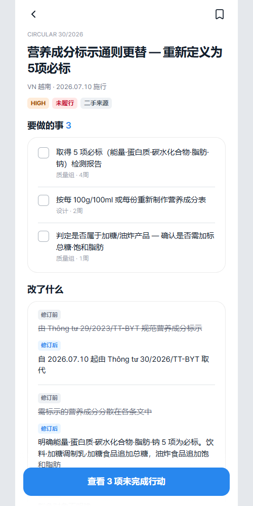
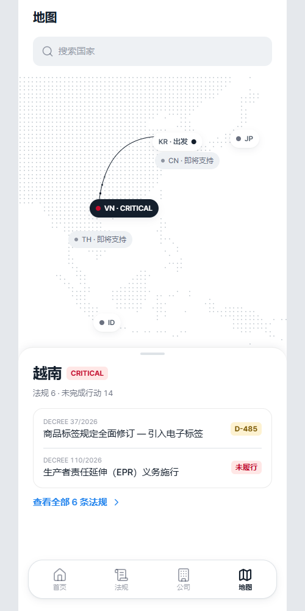
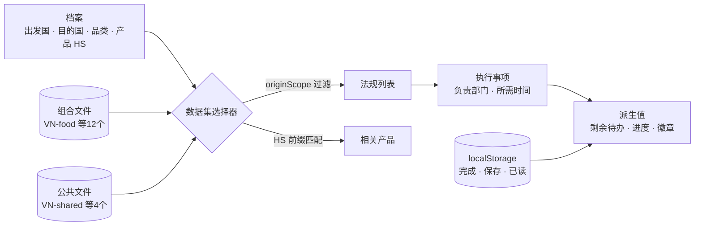

# Neo

<p align="center"></p>

> 把海外出口规制从“这条法律变了”转换成“所以你需要做这件事”的 PWA。61条法规、174项执行事项均经人工交叉核验后录入，安装后即使断网也能打开所有页面

---

## 1. 项目概述 (Overview)

| 项目 | 内容 |
|---|---|
| 项目名称 | Neo（海外出口规制应对 PWA） |
| 一句话概述 | 让没有法务·规制应对团队的出口中小企业负责人无需阅读条文，就能确认并完成“是否涉及我们的产品 → 做什么、何时之前、由谁” |
| 进行时间 | 2026.09.05 ~ 2026.09.10（创建仓库 → v1.0.0 → 同日 v2.0 全面更换设计，v2.0.4） |
| 参与人数 | 个人项目 |
| 本人角色 | 问题定义、法规调查与交叉核验数据集构建、设计·实现·部署全部工作 |
| 贡献度 | 100%（仓库提交全部来自本人） |

货物装船之后，出口还要通过目的国的规制才算真正完成。规制因国家和品类而异，原文是越南语、日语、印尼语，而且会不经预告就发生变化。大企业有专门负责的团队，中小企业却没有。出口负责人通常还兼管质量或销售，没有时间阅读条文。然而一旦出错，代价就是清关被拒、召回或罚款。

信息并不缺乏。法规在官报上公开，法规类新闻简报也很多。只是“那么我们的产品是否受影响”的判定哪里都找不到。这个应用提供的不是信息，而是转换。**条文 → 我们的产品是否适用 → 做什么、何时之前、由谁。**

## 2. 技术栈 (Tech Stack)

| 类别 | 技术 | 选择理由 |
|---|---|---|
| 框架 | Next.js 16 (App Router) · React 19 · TypeScript | 预先静态生成61个法规详情页，无需服务器即可部署 |
| 数据 | 19个静态 JSON 文件 + `localStorage` | 法规是人工核验过的数据集，不需要服务器。只有档案、已完成的行动项和已保存的法规存放在浏览器中 |
| 地图 | `d3-geo` · `topojson-client`（把原有脚本移植到 npm） | 把地图数据作为静态文件放入，去掉了对 CDN 的依赖。离线时也能绘制地球仪 |
| 样式 | Tailwind CSS 4 · 设计令牌（`--tds-*`）· Pretendard | v2.0 改为基于 Toss 设计系统（TDS）。默认浅色，深色可选 |
| PWA | 自行编写的 Service Worker · Web Manifest | 不用框架插件，自行设计了预缓存和运行时缓存 |
| 验证 | 自制数据完整性检查器（`scripts/check-data.mjs`） | JSON 无法通过类型检查把关，因此单独检查引用关系 |
| 部署 | Vercel | 静态产物 |

运行时依赖只有 `next` · `react` · `react-dom` · `d3-geo` · `topojson-client` 五个。没有使用 UI 库，也没有使用底部弹层（bottom sheet）库。去掉 CDN 依赖的决定源于离线需求。

## 3. 核心功能与负责工作 (Key Features & Contributions)

<p align="center">
  
  
  
  
</p>
<p align="center"><sub>用本地构建截取，设置为仓库中自带的示例公司（Hanmat 食品，韩国 → 越南，食品·饮料）。从左到右依次为首页 · 规制列表 · 法规详情 · 地图</sub></p>

### 已实现功能

- **初始设置4步**：依次选择出发国 → 目的国 → 品类 → 产品列表（HS 编码）。这份档案决定了所有页面的数据。
- **首页**：显示“现在还有14件事要做”这样的剩余行动项数量、出口路线、行动项进度、暂缓法规提醒、待办列表以及正在施行的规制数量。页面上的数字全部由数据计算得出。
- **规制列表**：提供优先级·全部·HIGH 以上·即将施行·已保存几种筛选，以及按施行日期·风险度排序。每条法规都标有编号、标题、施行日期、相关产品数、未完成行动项数和状态徽章（`미이행`（意为“未履行”）· `D-485` · `보류`（意为“暂缓”））。
- **法规详情**：风险度、状态、来源等级（一手·二手）徽章。把“需要做的事”以清单形式展示，并附上负责部门和所需时间。“有什么变化”则对照修订前后的内容展示。
- **地图**：从出发国到目的国的路线以及各国风险度。不支持的国家也以淡色保留。
- **公司·通知**：公司信息与产品列表，期限·暂缓提醒。
- **PWA**：安装引导、离线提示栏、浅色·深色主题切换（记住选择，200ms 过渡）。

### 数据设计

- **单位是组合。** 即使是同一个国家，不同品类的规制重点也不同。越南化妆品的门槛是产品备案，日本化妆品的门槛则是配方和注册。因此拆分为目的国4个 × 品类3类 = 12个组合文件，外加各国公共法规4个文件。
- **HS 编码才是真正的匹配键。** 法规带有 `["16","17","18","19","20","21","2202"]` 这样长度不一的前缀列表，产品的 HS 编码只要以其中之一开头就算受影响。不凭空编造不存在的细分，只按法规规定的范围收窄。
- **出发国也会影响要件。** 韩美 FTA 特惠关税只在出发国为韩国时才成立。用 `originScope` 进行过滤，并在列表下方用一行写明被排除的法规数量。变了的就写变了，没变的就写没变。
- **风险度**按制裁强度 × 应对紧迫性 × 本公司产品涉及范围来评定，但页面上只显示四级标签。负责人需要的是先后顺序，而不是乘积值。

### 调查规则7条

| # | 规则 |
|:---:|---|
| 1 | 不知道的就留空，不编造 |
| 2 | 用2个以上的独立来源交叉确认。编号、施行日期、核心变更一致才予以记录 |
| 3 | 区分一手来源（官报·主管部门）和二手来源（律师事务所·法律数据库·检测认证机构），并在页面上标明 |
| 4 | `최종 확인`（意为“最终确认”）日期是实际打开该 URL 的日期 |
| 5 | 期限只录入法规中明确规定的。不为凑页面上的数字而倒推 |
| 6 | 确认该日期是我们品类的日期之后再录入 |
| 7 | 连同被排除的法规及其理由一并记录 |

### 主要工作

- 4国 × 3品类的法规调查与交叉核验，记录排除理由和未确认值
- 数据模式（组合文件 + 公共文件）、档案 → 数据集选择器、派生值计算
- 数据完整性检查器，Service Worker·离线设计与实测验证
- 实现8个页面，v2.0 全面更换设计（令牌·公共组件·文案统一为 haeyo 体，即韩语中亲切的敬语语体）
- 真机检查，修复 iOS 主屏幕应用的缺陷

## 4. 成果与结果 (Results & Metrics)

### 定量成果

| 项目 | 结果 |
|---|---|
| 数据 | 16个组合（12个组合 + 4个公共）· 法规 **61条** · 执行事项 **174项** |
| 来源 | 一手 **47** / 二手 **14** · 状态：施行中60 · 暂缓1 |
| 完整性 | 检查器结果为“引用完整性通过”（2026.09 重新运行） |
| 离线 | 关闭服务器后，6个页面 + 设置 + 61个法规详情页全部能打开 |
| 可访问性 | 触控目标44px（6个页面全部检查），风险度色块上的文字对比度最低5.05:1（v1 测量） |
| 规模 | 代码7,393行，运行时依赖5个，CDN 依赖0 |
| 实际用户 · 用户测试 | （待确认） |

| 目的国 \ 品类 | 食品·饮料 | 化妆品 | 电气·电子 |
|---|:---:|:---:|:---:|
| VN 越南 | 4 | 4 | 5 |
| JP 日本 | 5 | 5 | 4 |
| US 美国 | 5 | 5 | 4 |
| ID 印度尼西亚 | 4 | 4 | 4 |

此外还有8条公共法规（VN 电子标签·EPR，JP 包装材料标识·再商品化，US 强迫劳动推定排除·原产地标示·韩美 FTA，ID 清真认证）。

### 定性成果

- **做出了一个“没有就写没有”的数据集。** 在调查文档中，被排除的法规及其理由（仍处于草案阶段、义务主体是进口商、已包含在其他法规中）以及留空的未确认值，所占篇幅比采用的法规还多。
- **把页面上的数字全部改为派生值。** 设计稿里写死的 `대응 필요 3건`（意为“需应对3项”）、`규제 5 · 미완 액션 10`（意为“规制5 · 未完成行动项10”）这类数字全部改为计算得出，因此哪怕只勾选一个行动项，也不会出现错误的数字。
- **把编造的值从页面上清除了。** 废弃了按模拟数据画出的 `D-45` · `D-14`，只用真实存在的日期生成徽章。因为没有服务器，“最后同步”时间也删掉了。应用能说明的只有“这些来源是何时打开查看的”。
- **一天之内就能整体更换设计。** 得益于颜色·圆角·阴影只通过令牌使用的规则，v2.0 更换时重写了公共组件和8个页面，并把文案统一为 haeyo 体。

### 已知局限

- **没有法律分析引擎。** 只验证到页面·流程的一致性和数据转换方法论为止。不自动解释条文，也没有设置假装在解释的页面。
- **没有数据更新渠道。** 法规变更后，需要人工重新调查并提交。
- **范围较窄。** 只有4国 × 3品类，出发国数据只有韩国。扩展的负担更多在于调查成本，而不是代码。
- **没能进行用户测试。** “新用户能在60秒内找到1条影响本公司的法规和1个行动项”这一成功标准，只用页面流程计数代替确认。
- **禁用了缩放。** 这是为了让它用起来像应用而做的选择，但违反了 WCAG 1.4.4（200% 缩放）。作为缓解，正文最小字号设为15px，并在文档中写明了恢复方法。
- **通知只存在于应用内部。** 即使期限临近，也要打开应用才能看到。要把“所以你需要做这件事”贯彻到底，需要一条不打开应用也能触达的渠道。

## 5. 问题排查经验 (Troubleshooting)

### ① 只有打开过的页面能离线打开

**问题** 计划书里写的是缓存 `data/*.json`。但启动生产构建、只打开首页后关闭服务器，其余页面都因 chunk 加载失败而变成空白。

**原因** 问题有两层。第一，JSON 是静态导入的，被打包在 JS chunk 里，没有单独可缓存的 URL。第二，cache-first 运行时缓存只保存实际请求过的内容。因此只有在线时打开过的页面才能在离线时打开。

**解决** 不借助构建钩子解决了问题。从预缓存的文档 HTML 中提取静态 chunk 引用，一并缓存。这样就不必为了获知哈希文件名而生成构建清单。路由文档的 URL 不固定，因此由应用告知 Service Worker。客户端导航的载荷每次构建的查询哈希都不同，因此与文档分开，放在另一个缓存中。

**结果** 打开一次首页后即使关闭服务器，6个页面·设置·61个法规详情页也都能打开，连地图也能绘制出来。验证方法本身定为“真的断开试一试”。

### ② 设计稿上的数字是错的

**问题** 设计画板上画着 `규제 5 · 미완 액션 10` 这样的数字和 `D-45` · `D-14` 这样的期限。

**原因** 这些是按模拟数据手写的值。验算后发现，5条法规的全部行动项不是10项而是9项。期限徽章也不是真实存在的日期。

**解决** 把页面上的所有数字改为由数据计算，并为期限徽章制定规则，只用真实存在的日期生成。

| 条件 | 徽章 |
|---|---|
| 法规中有明确规定的期限 | 倒计时到该日期 |
| 没有期限但已在施行 | `미이행`（意为“未履行”） |
| 尚未施行 | 倒计时到施行日期 |
| 已暂缓的法规 | 无徽章 |

第二行比较微妙。对于持续性义务，即使过了施行日期，标上“已逾期”也是错误的说法。并没有错过什么日期，而是本应遵守的义务还没有履行。

**结果** 用户勾选行动项后，首页·列表·详情·地图的数字会一起变化。全部都是派生值，只要计算正确就不会出错。

### ③ 法规中写的日期并不是我们品类的日期

**问题** 曾打算把某条法规过渡条款中写的日期直接作为期限录入。

**原因** 那个日期是另一个品类的宽限期结束日。过渡条款中，不同品类的结束日可能不同。如果直接录入，负责人就会按一个并不存在的截止日期行事。

**解决** 在调查规则中加入“确认该日期是我们品类的日期之后再录入”（第6条）。未能确认的期限留空，并在调查文档中写明留空这一事实。

**结果** 数据集中的期限全部是针对相应品类确认过的日期。自动采集虽能抓取条文，却无法判定“这个日期是不是我们品类的日期”，因此在这个问题上比人更不准确。

### ④ 主屏幕应用中标签栏下方被截断

**问题** 在浏览器中一切正常，但在 iPhone 上添加到主屏幕后打开，底部标签栏的文字和 Home 指示条的位置被挤出了屏幕。白色背景的页面上方还留下一条灰色带。

**原因** 在主屏幕应用模式下，iOS 按包括状态栏在内的整个屏幕计算视口单位（`lvh`），而 WebView 是从状态栏下方开始的。框架因此多出了这段差值。状态栏区域应用无法绘制，由 iOS 用 `theme-color` 填色，而这个值被固定为一种浅灰色。

**解决** 不靠视口单位推测，而是在首次绘制前测量 `window.innerHeight` 并写入 `--app-h`。键盘弹起时 iOS 不会缩小 `innerHeight`，因此输入过程中框架也不会晃动。`theme-color` 改为每次切换页面时跟随该页面的背景色（浅色·深色均如此）。

**结果** 安装版中标签栏也能完整显示，状态栏与页面连成同一种颜色（v2.0.4）。

## 6. 链接与交付物 (Links & Deliverables)

| 类别 | 链接 |
|---|---|
| GitHub 仓库 | [stx4R/Neo](https://github.com/stx4R/Neo)（私有） |
| 部署网址 | https://stx4r.me/project/Neo |

### 数据流



```ts
interface Dataset {
  profile, today, country, category
  laws, actions, products     // 출발국 필터를 이미 통과한 것
  hiddenByOrigin: number      // originScope로 빠진 법령 수
  empty: boolean              // 이 조합에 데이터가 아예 없는가
}
```

页面不读取“当前数据集”之类的全局变量，而是把这个值作为参数接收。`null` 表示“还不知道”，与“没有数据”不同。档案存放在 `localStorage` 中，在 hydration 渲染时读取不到。在这一帧里，页面不会用0填充不存在的数据，而是绘制骨架屏。

---

+++

## 客户旅程图 (Journey Map)

用户是出口中小企业中兼管质量·销售的出口负责人。

| 阶段 | 用户的行为 | 用户的想法 | 应用的应对 |
|---|---|---|---|
| 设置 | 选择目的国·品类·产品 | “HS 编码是什么来着？” | 选定品类后，代表产品和 HS 编码会作为默认值自动填入 |
| 了解 | 打开首页 | “有没有和我们相关的？” | “现在还有14件事要做”一句话和进度 |
| 排优先级 | 查看规制列表 | “该先做什么？” | 按风险度·施行日期排序，`미이행`·`D-485` 徽章 |
| 执行 | 在法规详情中勾选待办 | “这是谁负责的？” | 每项待办都附有负责部门和所需时间 |
| 确信 | 确认来源 | “这个能信吗？” | 一手·二手来源徽章，最终确认日期 |
| 移动中 | 在现场再次打开 | “现在没网啊” | 安装后离线也能打开所有页面 |

## 自适应设计 (Adaptive Design)

- 在402 · 375 · 1400三种宽度下变换组合进行了确认。在宽屏上也把移动端宽度的框架放在中间。
- 安全区域不用固定值，而是通过 `env()` 读取。在浏览器标签页中安全区域为0，此时状态栏色带消失才是正确的。如果模仿一个不存在的状态栏，只会留下一条空白色带。
- 在主屏幕应用中，屏幕高度使用实测值（问题排查 ④），并按页面匹配状态栏颜色。
- 默认浅色，深色通过首页顶部按钮开启。会记住所选主题，并在首次绘制前应用，因此不会闪烁。

## 动效设计 (Motion Design)

- 切换主题时，颜色在200ms内过渡。
- 读取档案之前的一帧里，骨架屏像脉搏一样跳动。若设置了 `prefers-reduced-motion`，则关闭脉动效果。
- 地图上从出发国到目的国的路线以线条绘制，重叠的国家标记会相互避让、各自就位。

## 安全漏洞管理 (DREAD)

没有服务器和账号，用户数据不会离开设备。这个应用最大的风险不是被黑客攻击，而是**错误的信息看起来像事实**。因此把信息完整性当作威胁来看待。

| 威胁 | 损害程度 | 可复现性 | 可利用性 | 受影响用户 | 可发现性 | 措施 |
|---|---|---|---|---|---|---|
| 把其他品类的日期显示为期限 | 高 | 中 | — | 相应组合的用户 | 低 | 调查规则第6条 — **应用** |
| 法规修订后仍继续显示旧数据 | 高 | 高 | — | 全体 | 中 | 按来源显示最终确认日期。更新流程为**遗留问题** |
| 让二手来源看起来像一手来源 | 中 | 低 | — | 全体 | 低 | 来源等级徽章 — **应用** |
| 引用断裂导致行动项悄然消失 | 中 | 中 | — | 相应法规 | 低 | 完整性检查器（一个行动项挂在两条法规上或成为孤儿行动项时即判失败）— **应用** |

可利用性一栏留空。表中的威胁并非来自他人的恶意利用，而是产生于调查与展示过程中的错误。
