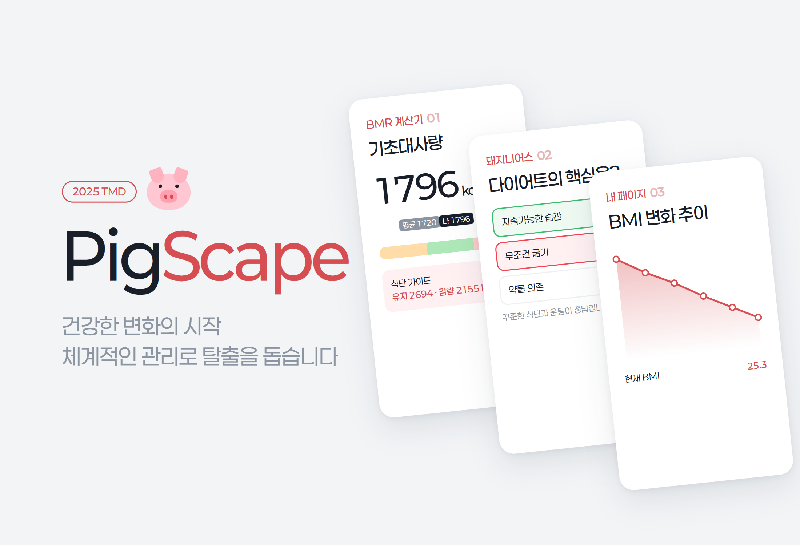
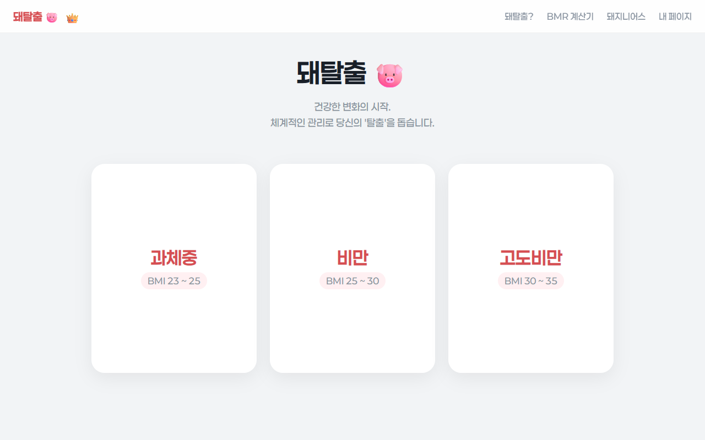
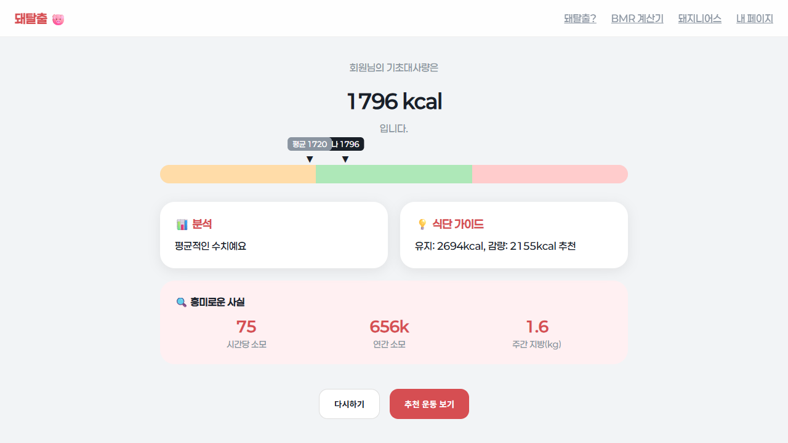
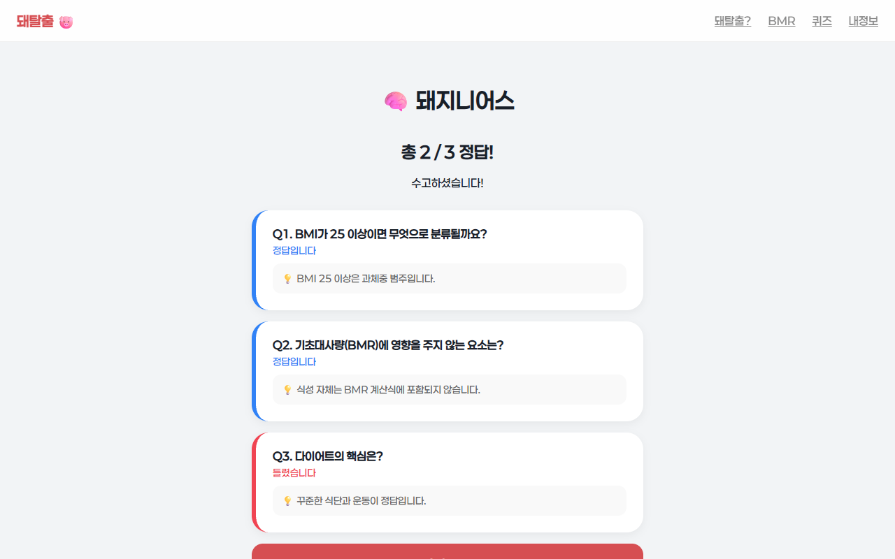
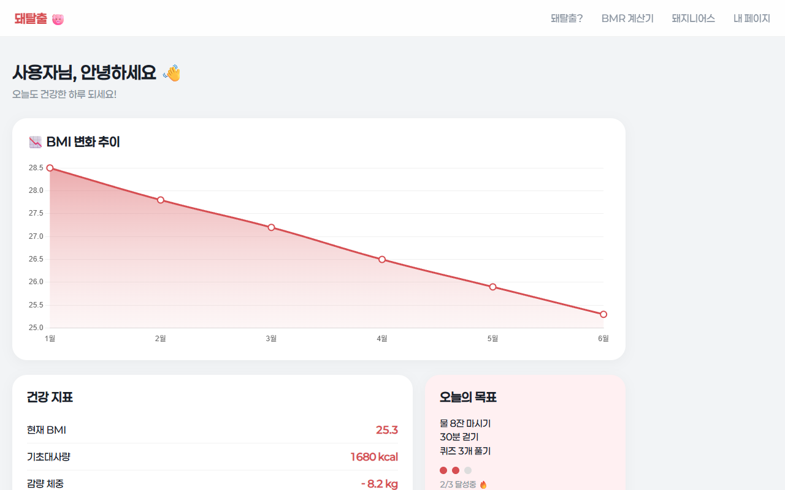

# PigScape.

> 以团队项目形式策划了集基础代谢计算、减肥常识测验和个人记录页面于一体的减肥助手网站 「돼탈출」（意为“小猪大逃脱”），并在技术部分先后三次重做的项目

---

## 1. 项目概述 (Overview)

| 项目 | 内容 |
|---|---|
| 项目名称 | PigScape.（「돼탈출」🐷） |
| 一句话概述 | 策划了一项同时应对肥胖与压力的减肥服务，并制作了由 BMR 计算器、测验、我的页面和会员介绍组成的 6 页网页原型 |
| 进行时间 | 2025.08 ~ 2025.12（以文件为准。Flask 第一版 2025.08–09 → Flask 重制 2025.09 → 静态网页 ReReWork 2025.12） |
| 参与人数 | 6 人（Team 「뒷동네」（意为“后街”）：技术部 3 人 · 运营部 3 人）+ 导师 1 人 |
| 本人角色 | 技术部“技术与制作”。编写各页面的需求规格，实现网页，三次重构 |
| 贡献度 | （待确认） |
| 进行背景 | 高一第二学期 TMD 活动（待确认） |

团队给这项服务的定位是“持续地（Continuous）、系统地（Systematic）”帮助人们减肥。技术部负责制作能直观展示这项服务的网页原型。我为每个页面编写了规格说明，细到布局、文案、颜色、动画和异常行为，并据此制作页面。规格以“所有组件都要完整容纳在一屏之内”为原则撰写。

没有代码仓库。本报告依据本地留存的三个版本的源码和策划笔记撰写。

## 2. 技术栈 (Tech Stack)

| 类别 | 技术 | 选择理由 |
|---|---|---|
| 第 1、2 版（Flask） | Python Flask 3.0.2，Jinja 模板，gunicorn 21.2.0 + Procfile | 按路由划分页面，也考虑到了服务器部署 |
| 第 3 版（ReReWork） | HTML · CSS · Vanilla JavaScript（6 个页面，约 1,480 行） | 服务器实际上无事可做，于是迁移为静态文件（§5-③） |
| 图表 | Chart.js（CDN） | 我的页面中的 BMI 变化趋势折线图 |
| 设计 | Paperlogy 字体自托管，柔和酒红（#D64E52）· 粉色 + Toss 风格灰色背景 | 在策划阶段把配色定为“四种浅色柔和红色系” |

## 3. 核心功能与负责工作 (Key Features & Contributions)

本地截图（第 3 版 ReReWork）。三张 BMI 区间卡片在鼠标悬停或点击时会翻转，显示对应区间的运动建议

| 页面 | 功能 |
|---|---|
| 首页 | Logo 交互，按 BMI 区间（超重 23–25 · 肥胖 25–30 · 重度肥胖 30–35）显示的建议卡片，点击 👑 弹出高级版介绍弹窗 |
| 「돼탈출?」 | 通过滚动吸附逐屏翻页的介绍页：提出问题 → 价值（Continuous · Systematic）→ 主要功能 → 团队 · 导师 → 版权 |
| BMR 计算器 | 输入性别 · 年龄 · 身高 · 体重的弹窗 → 计算基础代谢率 → 在性别区间条上标出“我”和“年龄段平均”两个箭头 → 分析 · 饮食指南 · 趣味知识 → 推荐运动视频 |
| 「돼지니어스」（意为“猪天才”） | 三选一的减肥常识测验。点击后用颜色显示对错，最后给出每题解析和分数 |
| 我的页面 | 登录后的仪表盘：BMI 变化趋势图、健康指标、今日目标进度、成就徽章 |
| 高级版 | 3 种订阅方案，以及把部分订阅费转为奖金的挑战赛构想 |

BMR 计算结果（示例输入：男性 · 17 岁 · 175 cm · 72 kg）。用条上的三个区间和两个箭头展示与年龄段平均值的差距

### BMR 计算方式

- 公式采用修订版 Harris-Benedict 方程。男性 `88.362 + 13.397W + 4.799H − 5.677A`，女性 `447.593 + 9.247W + 3.098H − 4.330A`。
- 年龄段平均值取自性别 × 5 岁区间表（例：男性 25 岁以下 1,720 kcal），在平均值 ±100 kcal 以内判定为“处于平均水平”。
- 饮食指南以 BMR × 1.5 作为维持摄入量、BMR × 1.2 作为减重摄入量。趣味知识则把 BMR 换算成每小时和每年的消耗量，以及每周相当于多少脂肪（7,700 kcal = 1 kg）。

### 主要工作

- 编写 6 个页面的需求规格（布局、文案、颜色、过渡动画、异常行为）
- Flask 第一版实现：首页 · 介绍 · BMR 计算器（测验和我的页面显示“开发中”提示）
- Flask 重制：完成全部 6 页，配置用于部署的 `Procfile` · `requirements.txt`
- 静态网页 ReReWork：整理设计，修正判定逻辑，改为无需服务器即可打开的结构

## 4. 成果与结果 (Results & Metrics)

### 定量成果

| 项目 | 结果 |
|---|---|
| 页面 | 6 个（首页 · 介绍 · BMR 计算器 · 测验 · 我的页面 · 高级版） |
| 版本 | 重构 3 次（Flask 第一版 5 页中实现 3 页 → 重制 6/6 → 静态 ReReWork 6/6） |
| 测验 | 3 道题，每题附解析 |
| 发表 · 评价结果 | （待确认） |
| 实际用户数 · 部署地址 | （待确认） |

### 定性成果

- **练习了把策划转化为规格。** 例如“左半边放 Logo，右边放主题 · 副主题两组，主题用粗体、副主题用细体”，先用文字定义每个画面的布局和层级，再动手制作。
- **把同一个服务重做了三次。** 每换一个版本，都会从页面切换方式、判定逻辑、文件结构中找出一个问题加以修正（§5）。

### 已知局限

- **我的页面只是模型（mockup）。** 登录只是与写死在代码里的一个账号比对，图表、指标、徽章全是固定值。输入的 BMR 不会被保存，也不会形成记录。
- **代码中没有注明年龄段平均 BMR 表的出处。**（待确认）
- **BMI 区间的表述在各页面之间不一致。** 首页卡片把 23–25 划为超重、25–30 划为肥胖，而测验解析写的是“25 以上为超重”。
- **推荐运动视频总是只打开第一个文件。** 原始文件是 iPhone `.MOV`，部分浏览器可能无法播放。（待确认）
- **高级版方案还处于构想阶段。** 支付按钮不起作用。
- 加入了屏蔽右键、复制和开发者工具的脚本，但这只是浏览器端的手段，起不到真正的保护作用。

## 5. 问题排查经验 (Troubleshooting)

### ① 介绍页只能用鼠标滚轮翻页

**问题** 第一版介绍页是逐屏翻页的结构。滚动滚轮就移动到下一节，到达团队介绍页后 2 秒自动跳到下一页。

**原因** 做法是接收 `wheel` 事件，把容器移动 `translateY(-N×100vh)`，并加 0.8 秒的锁定。由于只接收滚轮事件，触摸滚动和键盘都无法翻页。像触控板这样连续产生事件的输入，一次翻过的屏数会随锁定时间而变化。

**解决** 从重制版开始改用 CSS `scroll-snap-type: y mandatory`。每节指定 `scroll-snap-align: start`，滚动本身交给浏览器处理。第 3 版删掉了只有团队 · 导师标题的中间画面，直接显示团队介绍，把小节从六个减为五个。

**结果** 滚轮、触控板、触摸、键盘都以同样的方式逐屏翻页。切换脚本被移除后，介绍页上剩下的 JS 只有导航效果和安全脚本。

### ② “低于平均水平”并不是与平均值比较的结果

**问题** 第 1、2 版的 BMR 计算器会在结果下方显示“低于平均水平 / 处于平均水平 / 高于平均水平”。但即使改变年龄，只要 BMR 相同，判定就完全一样。

**原因** 判定依据的不是年龄段平均值，而是按性别固定的区间（男性 1,600 · 1,900 kcal，女性 1,300 · 1,700 kcal）。性别 · 年龄段平均表只用来决定箭头的位置。

**解决** 第 3 版把判定标准改为用户所属性别 · 年龄段的平均值。在平均值 ±100 kcal 以内显示“处于平均水平哦”，更低或更高则如实告知。条上并排放置“我”和“平均”两个箭头。

**结果** 文案和箭头指向同一个标准。17 岁男性、72 kg · 175 cm 的结果为 1,796 kcal，在平均值 1,720 kcal 的 +100 以内，因此判定为“处于平均水平”。

### ③ 服务器实际上无事可做

**问题** Flask 重制版连部署用的 `Procfile` 都准备好了，但每次打开页面都必须先启动 Python 服务器。

**原因** 6 个路由全都只返回 `render_template`。计算、测验、登录全在浏览器 JS 中运行。而链接（`/info`、`/bmr`）和资源路径（`/static/...`）却都是以服务器根目录为基准写的。

**解决** 第 3 版把模板迁移为静态 HTML，链接改成 `info_pigscape.html` 这样的文件名，资源改为 `static/...` 相对路径。

**结果** 无需服务器，直接打开整个文件夹或原样上传到静态托管都可以运行。

## 6. 链接与交付物 (Links & Deliverables)

| 类别 | 链接 |
|---|---|
| GitHub 仓库 | 无 |
| 部署网址 | （待确认） |
| 交付物 | 静态网页 6 页（ReReWork），Flask 版本 2 个，Logo 与运动视频 8 个，各页面的策划规格 |

 

左：「돼지니어스」结果（每题的正确答案与解析）。右：我的页面仪表盘（固定的模拟数据，截图时把姓名改成了“用户”）

---

+++

## 客户旅程图 (Journey Map)

用户是打算开始管理体重的人。

| 阶段 | 用户行为 | 用户想法 | 服务的响应 |
|---|---|---|---|
| 到达 | 打开首页 | “我这个 BMI 该做些什么？” | 翻开三张区间卡片，就能看到步行、力量训练、保护关节等适合该区间的第一步行动 |
| 了解 | 滚动浏览「돼탈출?」页面 | “这是什么服务？” | 按问题 → 价值 → 功能 → 制作者的顺序逐屏展示 |
| 测量 | 在 BMR 计算器中输入 | “我比平均消耗得多吗？” | 把我的数值和年龄段平均放在同一条上，并给出摄入指南 |
| 学习 | 做「돼지니어스」测验 | “饿着不就行了吗？” | 答错时同时标出正确答案，并用解析纠正 |
| 坚持 | 打开我的页面 | “我做得怎么样？” | 用趋势图、今日目标和徽章展示进度（模型） |

## 手势设计 (Gesturing)

- 建议卡片在鼠标悬停时翻转，触屏设备上点击翻转，键盘则用 Enter · Space 翻转（`tabindex="0"`）。
- 点击 Logo 中的 🐷 和标题文字会弹跳，点击 👑 会打开高级版弹窗。
- 鼠标悬停在导航项上时，其余项会变暗，悬停项下方出现一行说明。

## 动效设计 (Motion Design)

- 卡片以 `fadeUp` 间隔 0.1 秒依次升起。翻转时使用 `rotateY(180deg)` 过渡。
- 测验在选择后显示 1.2 秒的对错颜色，然后进入下一题。
- 登录失败时卡片会左右摇晃。

## DREAD 漏洞管理 (DREAD Risk Assessment)

| 威胁 | D | R | E | A | D | 分数 | 应对 |
|---|---|---|---|---|---|---|---|
| 登录账号以明文形式存在于客户端代码中 | 1 | 3 | 3 | 1 | 3 | 2.2 | 目前只有模型仪表盘，损害较小。若要接入真实记录，必须先实现服务器认证和哈希存储 |
| 误把屏蔽开发者工具当成保护手段 | 1 | 3 | 3 | 1 | 2 | 2.0 | 以无法阻止他人查看代码为前提，不在客户端存放敏感数值 |

D·R·E·A·D = 损害 · 可复现性 · 利用难度 · 影响范围 · 可发现性（1~3）。分数为平均值。
