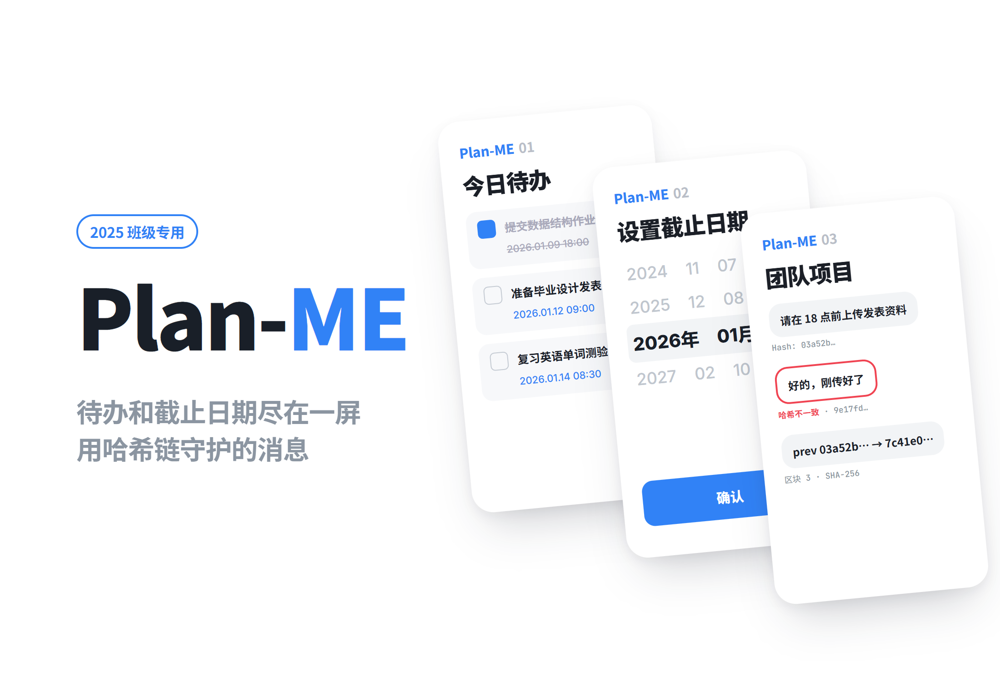
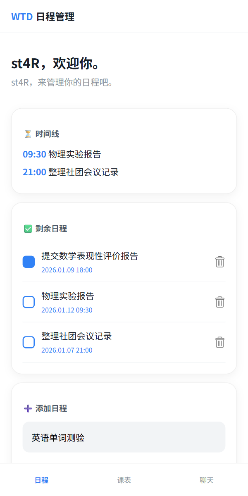
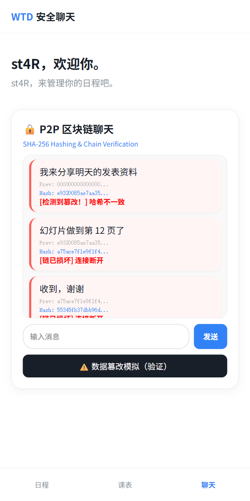
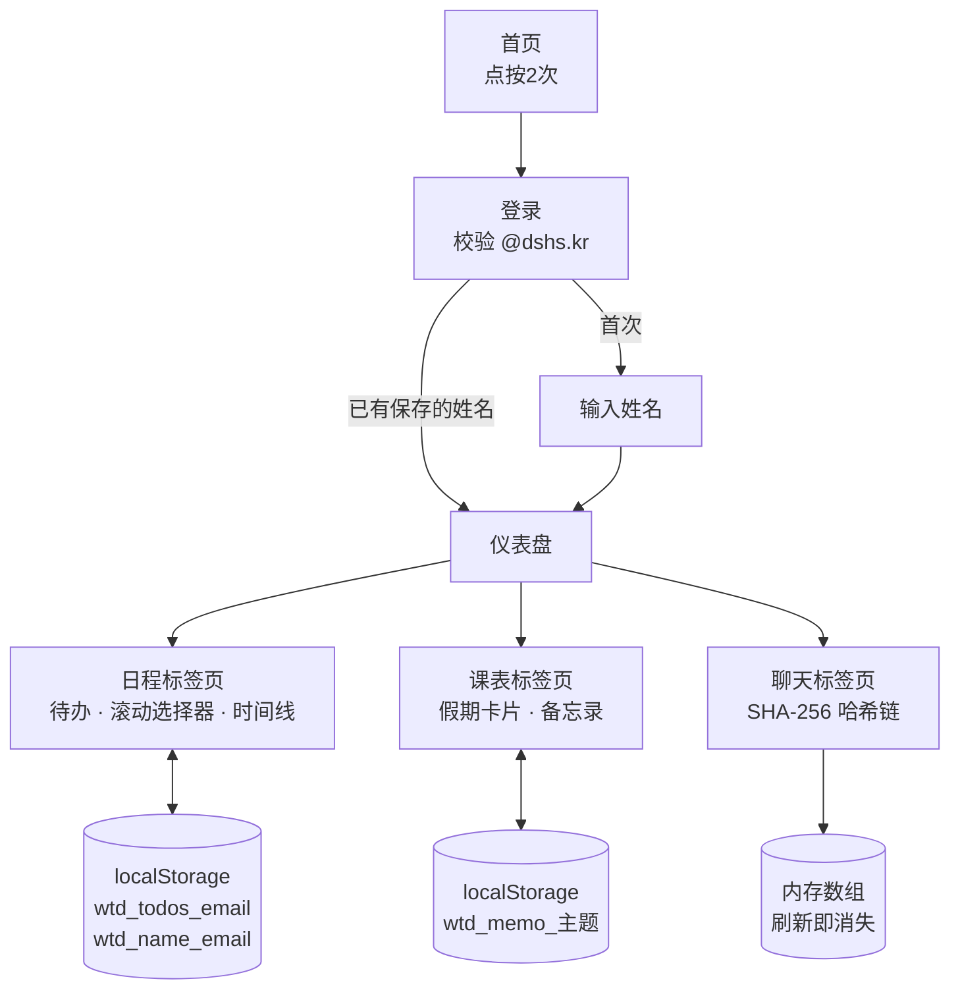

# Plan-ME

<p align="center"></p>

> 用学校邮箱登录，管理带截止期限的待办事项，并借助哈希链体验消息篡改检测概念的学生日程应用「WTD」

---

## 1. 项目概述 (Overview)

| 项目 | 内容 |
|---|---|
| 项目名称 | Plan-ME（应用名「WTD」 — What To Do → All in One School Manager） |
| 一句话概述 | 无需服务器，仅靠浏览器存储按用户管理待办、截止期限和备忘，并用 SHA-256 哈希链聊天展示区块链篡改检测原理的单页应用 |
| 进行时间 | 2025.12.19（第一版，一天10次提交）· 2026.01.05（扩展为3个标签页）· 2026.01.13、2026.03.03（整理注释） |
| 参与人数 | 个人项目 |
| 本人角色 | 策划、界面设计、全部实现 |
| 贡献度 | 100%（仓库13次提交全部由本人完成） |

最初它正如其名，只是一个回答“该做什么”的待办清单。目标是用学校邮箱登录后只看到自己的日程，截止时间一目了然。寒假期间陆续加上课表、备忘和聊天标签页，把范围扩展为“校园生活一站式”，并在聊天功能中亲手实现了区块链的哈希链结构。

## 2. 技术栈 (Tech Stack)

| 类别 | 技术 | 选择理由 |
|---|---|---|
| 界面 | HTML · CSS · Vanilla JavaScript（单个 `index.html`，463行） | 希望做成打开一个文件就能直接使用的结构。不用框架，页面切换靠 `section` 和标签的 `active` 类处理 |
| 存储 | `localStorage`（按用户邮箱区分的键） | 无需服务器和数据库，刷新或重新进入后数据依然保留。把邮箱放进键名，在同一台设备上区分多个账号 |
| 哈希 | Web Crypto API `crypto.subtle.digest('SHA-256')` | 浏览器标准 API，不需要额外的库。用于生成哈希链聊天的区块哈希 |
| 输入 UI | 基于 CSS `scroll-snap` 自制的滚动选择器 | 像滚轮一样滚动选择年、月、日、时、分。移动端浏览器自带的日期输入控件样式各不相同，因此自己做了一个契合应用风格的输入器 |
| 字体 | Noto Sans KR（Google Fonts） | 韩文可读性 |
| 部署 | 无（待确认） | 仓库中没有 Pages 设置 |

## 3. 核心功能与负责工作 (Key Features & Contributions)

<p align="center">
  
  
</p>
<p align="center"><sub>在本地运行后截图。Logo 图片未包含在仓库中，因此做了遮挡。</sub></p>

### 已实现功能

- **分步式首页**：第一次点按时提示文字切换，第二次点按时出现登录按钮。
- **学校账号登录**：只接受以 `@dshs.kr` 结尾的邮箱。首次登录的账号会询问一次姓名（昵称），之后直接用保存的姓名打开仪表盘。
- **待办 + 截止期限**：开始输入待办事项时会展开滚动选择器。滚动年（2025~2030）、月、日、时、分五列来设定截止时间，支持完成勾选和删除。
- **时间线**：把尚未完成的事项连同截止时刻单独汇总显示。
- **课表标签页**：假期说明卡片和假期计划备忘。正式课表计划在开学后通过 NEIS API 对接，目前只预留了位置。
- **备忘录**：按主题保存备忘。
- **哈希链聊天**：对每条消息的 `前一区块哈希 + 正文 + 时间` 做 SHA-256 哈希，生成区块并接入链中。每个气泡都会显示前一个哈希和当前哈希的开头部分。
- **篡改模拟**：点击按钮后修改第一个区块的内容，再把该区块标为“哈希不一致”、其后的区块标为“链已损坏”，以此展示一个区块被篡改会波及其后全部区块的结构。

### 主要工作

- 设计界面流程（首页 → 登录 → 登记姓名 → 仪表盘3个标签页）
- 设计按用户划分的数据存储结构（`wtd_name_{email}`、`wtd_todos_{email}`、`wtd_memo_{主题}`）
- 实现滚动选择器（生成各列、按当前时间对齐初始位置、滚动位置 → 数值转换）
- 实现 SHA-256 哈希链与篡改可视化
- 2026.01.05 扩展改版（新增256行、删除55行）

## 4. 成果与结果 (Results & Metrics)

### 定量成果

| 项目 | 结果 |
|---|---|
| 第一版完成 | 一天（2025.12.19），10次提交 |
| 最终规模 | `index.html` 463行，外部 JS 库0个 |
| 功能 | 3个标签页（日程 · 课表 · 聊天），3种存储键 |
| 哈希 | 每个区块做 SHA-256（256位）哈希，通过前一个哈希相连 |
| 实际用户 | （待确认） |

### 定性成果

- 做出了无需服务器、按用户隔离的数据在刷新后依然保留的结构。
- 把区块链收窄到“每个区块都包含前一区块的哈希”这一个性质，亲手实现。可以在界面上直观展示：前面一个区块一变，后面就全部对不上。
- 没有使用浏览器自带的输入控件，而是自己做滚动选择器，其间独立设计了滚动位置与数值之间的换算。

### 已知局限（基于2026.09的代码）

- **登录并不是认证。** 只检查邮箱是否以 `@dshs.kr` 结尾、密码栏是否为空。密码既不校验也不保存。
- **“共享”和“P2P”目前只是名字。** 备忘录上写着“已 P2P 同步”，但所有数据都只存在那台设备的 `localStorage` 里，不会与他人共享。
- **篡改检测并不重新计算哈希。** 点击按钮后，会无条件把第一个区块及其后的区块标为损坏。2026.03.03 删除的早期注释中也写明：本来应该用前一哈希、正文、时间重新计算哈希再作比较，但因为只是模拟，所以强制设为已检测状态。聊天链只存在于内存中，刷新就会消失。
- **NEIS 课表尚未对接。** 只有提示文字。
- **选择器的日期范围与月份无关。** 二月也能选到31日。
- **时间线上没有日期。** 只显示时刻，也不按截止时间排序，因此不同日期的事项看起来像是同一天的日程（上方截图中的09:30是1月12日，21:00是1月7日）。

## 5. 问题排查经验 (Troubleshooting)

### ① 一刷新，待办和姓名全部消失

**问题** 第一版中即使添加了待办事项，刷新页面后列表也会清空。每次登录还都要重新询问姓名。

**原因** 待办数组和姓名只保存在 JavaScript 变量里。页面重新加载时，变量会被初始化。

**解决** 改为存入 `localStorage`，并把登录的邮箱放进键名，按用户区分（`todos_{email}`、`name_{email}`）。登录时如果该邮箱已有姓名，就跳过姓名输入框。

**结果** 在同一台设备上重新进入，日程依然保留；多人共用一台设备时，各自的列表也不会混在一起。

### ② 把滚动位置转换为日期值

**问题** 要让用户像转滚轮一样选择截止期限，就得在用户停下的位置读出“当前处于正中的值”。还需要在列首次绘制时对齐到当前时间。

**原因** 为了让选中格位于列的正中，每列上下各放了一个空格子。因此由滚动位置算出的序号与实际子元素的序号相差一格。初始位置也必须等列在界面上布局完成后才能设置。

**解决** 在 CSS 和脚本中把格子高度统一为同一个值（34px），数值从第 `Math.round(scrollTop / 34) + 1` 个子元素读取，`+1` 用来跳过上方的空格子。初始位置在插入列100ms后按 `(当前值 - 起始值) × 34` 设置，并借助 `scroll-snap` 精确停在格子中央。为了防止滚到尽头时算出的序号越界而报错，扩展改版时加入了防御代码：对应元素不存在时返回 `'00'`。

**结果** 五列都从当前时间开始，停下那一格的值会原样保存为 `2026.01.09 18:00` 格式的截止时间。

### ③ 存储键可能与其他应用冲突

**问题** 最初的存储键是 `todos_{email}`、`name_{email}` 这类常见名字。

**原因** `localStorage` 按源（域名）共享。在 GitHub Pages 上，`stx4r.github.io/应用名` 形式的多个应用共用同一个源，如果别的应用用了同名的键，数据就会被覆盖。

**解决** 所有键前面都加上 `wtd_`（`wtd_todos_{email}`、`wtd_name_{email}`，之后还有 `wtd_memo_{主题}`）。

**结果** 即使同一个源上部署了其他应用，本应用的数据也只会待在自己的前缀之下。

## 6. 链接与交付物 (Links & Deliverables)

| 类别 | 链接 |
|---|---|
| GitHub 仓库 | [stx4R/Plan-ME](https://github.com/stx4R/Plan-ME)（私有） |
| 部署网址 | 无（待确认） |

### 系统架构图



哈希链的区块结构：

```
区块 0: prev = 000…000 (64个字符)   hash = SHA256(prev + 正文 + 时间)
区块 1: prev = 区块 0 的 hash       hash = SHA256(prev + 正文 + 时间)
区块 2: prev = 区块 1 的 hash       …
```

---

+++

## 手势设计 (Gesturing)

- 首页不靠按钮，而是靠点按屏幕任意位置来推进。第一次点按时文字切换，第二次点按时登录按钮浮上来。
- 截止期限不用输入数字，而是上下滑动各列来选择。`scroll-snap` 会把松手的位置对齐到最近的格子。

## 动效设计 (Motion Design)

- 首页文字消失时向下移动20px并逐渐淡出，下一句在0.4秒后回到原位浮现（0.6秒过渡）。
- 切换标签页时，内容从下方上移10px，在0.3秒内显现。
- 复选框点击后填充为蓝色；检测到篡改的气泡，左侧色条和背景会变成红色。

## 自适应设计 (Adaptive Design)

- 所有标签页内容的最大宽度设为500px，以手机屏幕为基准进行设计。在宽屏上则显示为居中的手机宽度布局。
- 设置了底部固定标签栏和顶部固定标题栏，并给正文留出相应的边距（`padding-bottom: 80px`），避免最后一张卡片被标签栏遮住。

## 安全漏洞管理 (DREAD)

| 威胁 | 损害程度 | 可复现性 | 可利用性 | 受影响用户 | 可发现性 | 判断 |
|---|---|---|---|---|---|---|
| 待办和消息正文直接用 `innerHTML` 插入，可能被注入脚本（XSS） | 中 | 高 | 高 | 该设备的用户 | 高 | 改用 `textContent` 即可解决，是成本最低的修复。存储的数据不会离开设备，受害范围较小 |
| 登录不校验密码。只要知道别人的邮箱，就能打开对方的列表 | 中 | 高 | 高 | 同一设备的用户 | 高 | 接入真正的认证（学校账号 OAuth 等），或者老老实实把登录界面改为“选择用户” |
| 篡改检测不重新计算哈希，检测结果不能反映真实的完整性 | 低 | 高 | 低 | 全体 | 中 | 替换为对每个区块重新计算哈希并与存储值比较的校验函数 |

修复顺序以 `textContent` 替换 → 重新计算哈希的校验 → 认证为宜。前两项只需几行代码，认证则需要服务器，整体结构会随之改变。
