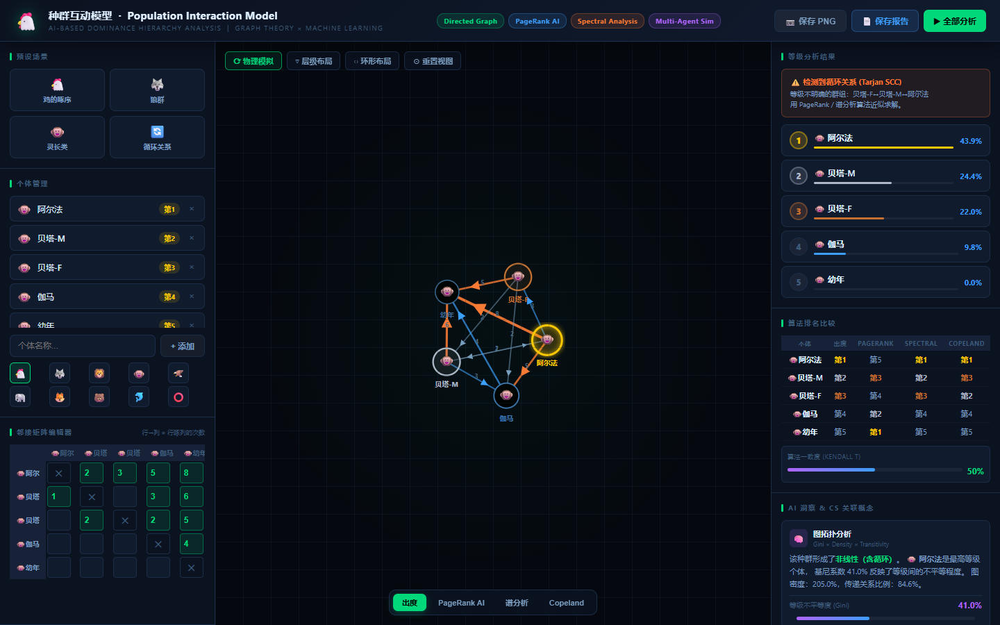
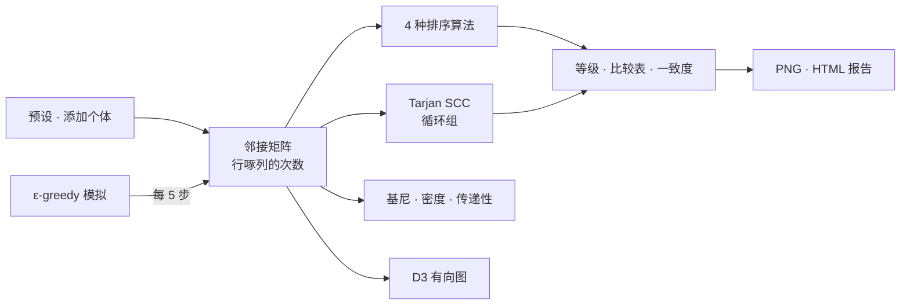

# PopInT.

> 把动物群体的啄序（pecking order）转换为有向图，并在一个画面中比较四种排序算法的教学用分析工具

---

## 1. 项目概述 (Overview)

| 项目 | 内容 |
|---|---|
| 项目名称 | PopInT.（Population Interaction Model · 种群相互作用模型） |
| 一句话概述 | 以邻接矩阵输入“谁啄了谁几次”，即可绘制图，并用出度、PageRank、谱排序、Copeland 四种方式排出等级并列展示 |
| 进行时间 | 2026.06（以文件为准，开始时间待确认） |
| 参与人数 | （待确认） |
| 本人角色 | 策划、算法实现、可视化、UI |
| 贡献度 | （待确认） |
| 进行背景 | 连接生命科学等级制单元与图论的教学工具（课程 · 作业背景待确认） |

鸡群内部的啄食顺序是固定的。生物教科书把它解释为“A 啄 B，B 啄 C”这样一条链。实际的观察记录却没有这么整齐：有时会互相啄，有时还会出现 A→B→C→A 这样的石头剪刀布结构。这个工具只要把观察次数填进矩阵，就能立刻显示图和等级，并比较不同的排序方式会让结果发生怎样的变化。

没有代码仓库。本报告依据本地留存的单个文件（`index.html`，1,181 行）撰写。

## 2. 技术栈 (Tech Stack)

| 类别 | 技术 | 选择理由 |
|---|---|---|
| 结构 | 单个 HTML 文件，Vanilla JavaScript | 无需安装，一个文件就能打开，方便在课堂上分发 |
| 图 | D3.js v7.8.5（force simulation · zoom · drag） | 可以直接控制有向边、箭头、物理布局以及缩放和平移 |
| 导出 | html2canvas 1.4.1，Blob 下载 | 把图保存为 2 倍分辨率的 PNG，并把分析结果下载为一页 HTML 报告 |
| 算法 | 自行实现（不使用库） | 出度、PageRank（迭代 120 次）、幂迭代法求特征向量、Copeland、Tarjan SCC、Floyd–Warshall、Kahn 拓扑排序 |

## 3. 核心功能与负责工作 (Key Features & Contributions)

本地截图（灵长类预设）。左侧是个体与邻接矩阵编辑器，中间是有向图，右侧是等级、循环警告和算法比较表。比较表的 PageRank 列直接暴露了 §5-③ 中的问题

| 区域 | 功能 |
|---|---|
| 预设 | 一键载入鸡群等级 · 狼群 · 灵长类 · 循环关系四种情景 |
| 个体 · 矩阵 | 用名字（8 个字符）和 10 种图标添加或删除个体，并在每个格子中输入“行啄列的次数”。输入后 0.28 秒重新运行全部分析 |
| 图 | 物理模拟 · 分层布局（拓扑排序后按最长路径分层）· 环形布局三种布局。边的粗细与次数成正比，排名第 1 的个体带有发光效果。支持拖动、缩放（0.08–5 倍）和提示框 |
| 等级分析 | 按所选算法的分数排名并以柱状图显示。若存在循环，则用 Tarjan SCC 找出并警告“等级不明确组” |
| 算法比较 | 把四种方式的排名放在一张表里，并用柱状图显示算法之间的一致度 |
| 洞察 | 根据排名不平等度（基尼系数）、图密度、传递关系比例判定群体的等级制类型（强线性 · 中等线性 · 弱 · 含循环） |
| 模拟 | 让两个个体随机相遇，按过去的胜率决定胜者，但有 10% 随机决定（ε-greedy）。以日志展示 120 次相遇中等级逐渐固化的过程 |
| 导出 | 图 PNG，以及包含算法比较表、邻接矩阵和概念说明的 HTML 报告 |

### 排序算法

| 算法 | 分数 | 衡量的是 |
|---|---|---|
| 出度 | 自己啄别人的次数之和 | 直接支配的量 |
| PageRank | 分数沿边流动的马尔可夫链的平稳分布（阻尼 0.85） | 间接影响力 |
| 谱排序 | 邻接矩阵的主特征向量（幂迭代法） | 战胜强者的价值 |
| Copeland | 对每一对个体比较谁啄得更多，胜 1 · 平 0.5 | 一对一交锋战绩 |

### 主要工作

- 实现 4 种排序算法以及循环检测（Tarjan SCC）、传递闭包（Floyd–Warshall）、拓扑排序（Kahn）
- D3 有向图与三种布局，邻接矩阵编辑器
- 四种预设情景与 ε-greedy 交互模拟
- PNG · HTML 报告导出

## 4. 成果与结果 (Results & Metrics)

### 定量成果

以下是撰写本报告时（2026.09）用 Node 重新运行四种预设的结果。每个格子是该算法排在第 1 的个体。

| 预设 | 出度 | PageRank | 谱排序 | Copeland | 循环检测 |
|---|---|---|---|---|---|
| 鸡群等级（完全线性） | 阿尔法 | **艾普西隆**（最末位个体） | 阿尔法（其余 4 只为 0 分） | 阿尔法 | 无 |
| 狼群 | 阿尔法♂ | **欧米伽**（最末位个体） | 阿尔法♀ | 阿尔法♂ · 阿尔法♀ 并列 | 阿尔法♂ ↔ 阿尔法♀ |
| 灵长类 | 阿尔法 | **青少年**（最末位个体） | 阿尔法 | 阿尔法 | 阿尔法 · 贝塔-M · 贝塔-F |
| 循环关系 | C | B | B | A · C 并列 | A–B–C–D 全部 |

| 项目 | 结果 |
|---|---|
| 代码 | 单个文件 1,181 行，外部库 2 个（CDN） |
| 用户 · 使用结果 | （待确认） |

### 定性成果

- **用画面说明等级并不是“只有一个正确答案的值”。** 在循环关系预设中，排名第 1 的个体因算法而异，分别是 C、B、A · C 并列。同一份观察记录，排名会随着“什么算支配”的定义而改变。
- **把生物概念和计算机概念整合进一个工具。** 用有向图解释等级制，用强连通分量解释循环等级，用基尼系数解释等级的不平等。

### 已知局限

- **PageRank 把等级排反了。** 在三个线性等级制预设中，被啄次数最多的个体都排到了第 1（§5-③）。目前尚未修正。
- **在完全线性的等级中，谱排序的分数会失效。** 像鸡群预设这样完全没有循环时，邻接矩阵越乘越趋于 0，结果只有第 1 名是 100%，其余全部 0 分并列。
- **只要有一个循环，分层布局就无法分层。** 拓扑排序在循环处停止，因此在狼群预设中五只狼全部落在同一层。
- **“图密度”会超过 100%。** 计算时不是看边是否存在，而是把啄的次数累加后再相除，因此灵长类预设得出 205.0%。
- **“Kendall τ”一致度并不是 τ。** 它实际上是一致对的比例（0–100%）。要表示为 τ，需要换算为 2 × 比例 − 1。
- 洞察面板中的概念关联（GNN、纳什均衡等）只是说明文字，工具并不实际进行这些计算。

## 5. 问题排查经验 (Troubleshooting)

### ① 有循环时根本无法排成一列

**问题** 教科书式的等级只要用拓扑排序，也就是“啄的一方在前”这条规则，就能排成一列。但只要出现一个 A→B→C→A 这样的循环，拓扑排序就无法完成。狼群和灵长类预设中上位个体之间互相啄的情况也一样。

**原因** 拓扑排序只对无环图（DAG）有定义，而实际观察记录中互啄和循环很常见。

**解决** 把排序和循环检测分开。等级由对任何图都能计算的基于分数的算法来排定；循环则用 Tarjan 算法找出强连通分量，单独作为“等级不明确组”发出警告。

**结果** 在循环关系预设中 A–B–C–D 全部、在狼群预设中两只阿尔法被标为同一组。排名表照常输出，同时标明哪一段不可信。

### ② 只看一种算法的结果，错了也发现不了

**问题** 等级分数随公式的构造方式而变化，如果画面上只有一种算法的排名，即使排名很奇怪也无从察觉。

**原因** 排名没有可供对照的标准答案，算法之间的共识实际上是唯一的依据。

**解决** 做了一个比较面板：把四种算法的排名按个体放在一张表里，并以柱状图显示两两算法之间排名对一致比例的平均值。

**结果** 正是这张比较表暴露了 ③ 的问题。在灵长类预设中，出度、谱排序、Copeland 都把阿尔法排在第 1，唯独 PageRank 把青少年排在第 1，一致度随之降到 50%。

### ③ PageRank 把最弱的个体选为第 1（复核时发现，尚未修正）

**问题** 撰写本报告时重新运行预设，发现 PageRank 在三个线性等级制预设中都把最末位个体排在第 1（鸡群艾普西隆 43.1%，狼群欧米伽 43.3%，灵长类青少年 43.6%）。

**原因** 矩阵的方向是“行啄列”，但 PageRank 的实现让分数从啄的个体流向被啄的个体。它原样沿用了网页链接中“收到的箭头越多越重要”这一假设，结果被啄得最多的个体反而积累了分数。

**解决**（未应用）把矩阵转置后再输入，让分数从被啄的一方流向啄的一方即可修正。在优劣关系中，边应当读作“输的一方指向赢的一方”。

**结果**（待确认）修正后需要重新确认四种算法的一致度和排名。

## 6. 链接与交付物 (Links & Deliverables)

| 类别 | 链接 |
|---|---|
| GitHub 仓库 | 无 |
| 部署网址 | （待确认） |
| 交付物 | 单文件网页工具 `index.html`，导出结果（图 PNG · 分析 HTML 报告） |

---

+++

## 客户旅程图 (Journey Map)

用户是正在学习等级制单元的学生。

| 阶段 | 用户行为 | 用户想法 | 工具的响应 |
|---|---|---|---|
| 开始 | 打开文件 | “该输入什么呢？” | 鸡群等级预设已经载入 |
| 探索 | 切换预设看看 | “狼群居然有两个阿尔法？” | 图的形状和循环警告立即随之变化 |
| 输入 | 把观察到的次数填进矩阵 | “用我们班观察到的数据试试” | 输入结束 0.28 秒后重新计算图和排名 |
| 比较 | 逐个点击算法按钮 | “为什么排名会变？” | 用比较表和一致度展示差异 |
| 提交 | 保存报告 | “想附在作业里” | 下载 PNG 和 HTML 报告 |

## 手势设计 (Gesturing)

- 拖动节点时物理模拟会跟着运动，滚轮可缩放到 0.08–5 倍。“重置视图”以 0.45 秒的过渡回到原位。
- 鼠标悬停在节点上时，提示框会显示该个体的等级分数以及出度和入度。
- 矩阵格子的值大于 0 时，输入过程中就会立即高亮。

## 动效设计 (Motion Design)

- 物理模拟布局以边长 130、斥力 −320 运行，完整呈现个体逐渐找到位置的过程。
- 排名列表以 `fadeUp` 升起，排名第 1 的个体通过发光滤镜闪亮。
- 模拟每 0.55 秒相遇一次，每 5 次更新一次矩阵、图和排名，展示等级逐渐固化的过程。

## 自适应设计 (Adaptive Design)

- 三栏布局（输入 · 图 · 结果）在 1,280px 和 1,060px 处缩窄两侧面板，1,060px 以下隐藏页眉标签。
- 窗口大小改变时，按新尺寸重新绘制图。
- 只有存在循环时，才会出现循环警告和“非传递关系”洞察卡片。
