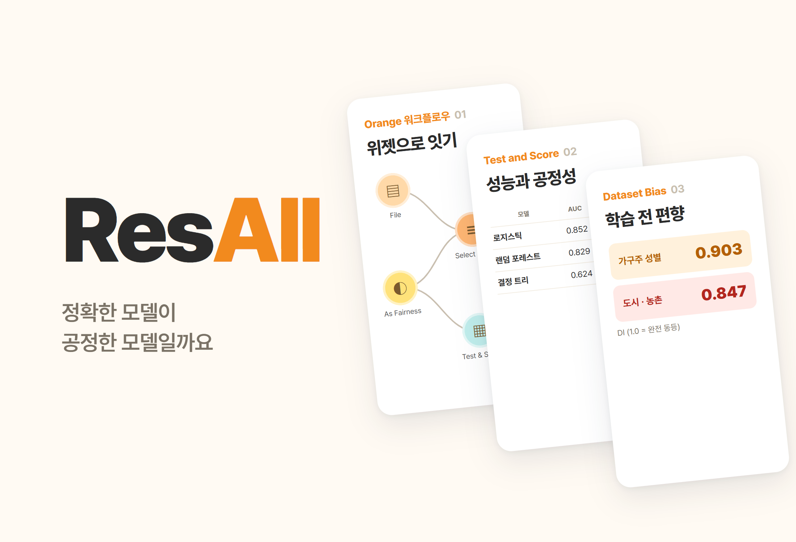
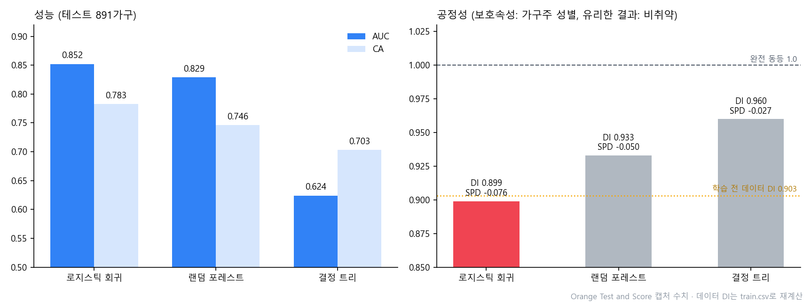

# ResAll.

> 把“有限的福利预算该给谁”转化为哥斯达黎加家庭贫困数据分类问题的 Orange 研究。除了比较三个模型的性能，还用另行安装的 Fairness 插件审计了模型对户主性别和地区的公平性

---

## 1. 项目概述 (Overview)

| 项目 | 内容 |
|---|---|
| 项目名称 | ResAll.（Resource Allocation，福利资源分配） |
| 一句话概述 | 用 Orange 搭建了不依赖收入、仅凭住房·资产·教育·家庭构成识别脆弱家庭的分类器。性能第一的逻辑回归（AUC 0.852）在性别公平性上反而最差（DI 0.899） |
| 进行时间 | 2026.06（高二《人工智能基础》，按工作文件为 2026.06.08–06.09） |
| 参与人数 | 个人研究 |
| 本人角色 | 问题设定、数据清洗设计、Orange 工作流搭建、Fairness 插件安装与审计、结果解读 |
| 贡献度 | 100% |
| 进行背景 | 机器学习模型实现作业（评价方式待确认） |

福利预算有限，而越是最贫困的家庭，越难正式证明自己的收入。美洲开发银行（IADB）用代理家计调查（Proxy Means Test, PMT）来解决这一问题：不看收入，而是根据墙壁和屋顶材质、家电拥有情况、受教育程度等肉眼可确认的特征来推断贫困程度。本研究把 PMT 转化为机器学习分类问题，并进一步检验了该模型是否会系统性地漏掉女性户主或农村家庭。

| 假设 | 内容 |
|---|---|
| 1. 可识别性 | 即使没有收入变量，仅凭住房·资产·教育·家庭构成也能区分脆弱/非脆弱 |
| 2. 指标选择 | 在福利领域，漏掉需要帮助的家庭（假阴性）代价更大，因此 Recall·F1 比准确率更关键 |
| 3. 偏差的起点 | 在建模之前，数据本身就已存在群体偏差 |
| 4. trade-off | 缓解偏差意味着牺牲部分准确率来换取公平性，而且无法同时满足多种公平性标准 |

## 2. 技术栈 (Tech Stack)

| 类别 | 技术 | 选择理由 |
|---|---|---|
| 工具 | Orange Data Mining（基于控件的工作流） | 无需写代码即可串联预处理 → 训练 → 评估，并能随时查看每一步的数据 |
| 公平性 | Orange **Fairness 插件**（默认安装中没有）：As Fairness Data、Dataset Bias、Reweighing、Weighted Logistic Regression | 在同一张表中同时查看公平性指标（DI·SPD·EOD·AOD）和性能指标 |
| 数据 | Kaggle “Costa Rican Household Poverty Level Prediction”（IADB）`train.csv`，9,557人 · 142个变量 | 为改进实际用于福利对象甄选的 PMT 而公开的数据 |
| 模型 | 决策树、随机森林、逻辑回归 | 分别属于基于规则、集成、线性概率模型，性质各不相同，便于比较 |

## 3. 核心功能与负责工作 (Key Features & Contributions)

作业当时截取的 Orange 工作流。上面一行是预处理，中间是训练与评估，左下是 Fairness 插件（Dataset Bias、Reweighing → Weighted Logistic Regression）

### 预处理

| 步骤 | 控件 | 处理 |
|:---:|---|---|
| ① | Select Rows | 只保留户主（`parentesco1 = 1`）所在的行，使一行 = 一个家庭（9,557人 → 2,973户） |
| ② | Edit Domain | 把 `Target` 的4个等级（极端贫困·中度贫困·脆弱·非脆弱）合并为脆弱（1–3）/ 非脆弱（4），并给 `male` 加上男性/女性标签 |
| ③ | Select Columns | 只选取约20个可解释的变量。把字符与数字混杂的 `edjefe`·`edjefa`·`dependency` 以及标识符 `Id`·`idhogar` 移入 meta，防止泄漏 |
| ④ | Impute | 用均值·众数填补缺失值 |
| ⑤ | As Fairness Data | 受保护属性 = 户主性别，特权群体 = 男性，有利结果 = 非脆弱 |
| ⑥ | Data Sampler | 70% 分层抽样（固定随机种子）→ 训练 2,082 / 测试 891 |

| 变量类别 | 变量 |
|---|---|
| 住房 | `epared1~3`（墙壁）、`etecho1~3`（屋顶）、`eviv1~3`（地面）、`abastaguadentro`（自来水）、`noelec`（无电）、`v14a`（厕所） |
| 拥挤·规模 | `rooms`、`overcrowding`、`hacdor`、`tamhog`、`hogar_nin`、`hogar_mayor` |
| 资产 | `refrig`、`computer`、`television`、`qmobilephone`、`v18q` |
| 教育·人口 | `meaneduc`、`escolari`、`age`、`male` |
| 地区 | `area1`（城市）·`area2`（农村）、`lugar1~6`（区域） |

### 模型

| 模型 | 特点 |
|---|---|
| 决策树 | 反复提出能使信息增益最大的问题来分裂节点。人可以直接读出是哪些因素划分了贫困与否 |
| 随机森林 | 用不同的数据·变量子集构建多棵树，再以多数投票决定。结果稳定，但更难解释 |
| 逻辑回归 | 把加权和代入 sigmoid 函数，得出贫困概率。通过系数还能解读各因素的影响方向 |

### 公平性审计

- 用 **Dataset Bias** 在建模**之前**测量数据本身的偏差。
- 在 **Test and Score** 中把性能指标和公平性指标（DI·SPD·EOD·AOD）放在一张表里比较。
- 在 **Weighted Logistic Regression** 上接入 **Reweighing** 作为预处理器，构建偏差缓解模型。
- 地区（城市·农村）另建了一个更换受保护属性的 Orange 文件进行分析。

### 主要工作

- 把福利分配问题定义为基于 PMT 的二分类问题，设计目标二值化和以家庭为单位的规范化
- 搭建包括排除泄漏变量、处理缺失值、分层划分在内的预处理工作流
- 安装 Fairness 插件，指定受保护属性·特权群体·有利结果，同时比较性能与公平性
- 构建偏差缓解模型并解读结果

## 4. 成果与结果 (Results & Metrics)

### 定量成果

根据 Test and Score 截图中的数值重新绘制的图表。虚线是不经模型、直接从数据测得的性别 DI（0.903）

**测试集891户，类别平均**

| 模型 | AUC | CA | F1 | Prec | Recall | MCC | SPD | EOD | AOD | DI |
|---|:---:|:---:|:---:|:---:|:---:|:---:|:---:|:---:|:---:|:---:|
| **逻辑回归** | **0.852** | **0.783** | **0.776** | **0.778** | **0.783** | **0.501** | −0.076 | −0.046 | −0.066 | 0.899 |
| 随机森林 | 0.829 | 0.746 | 0.738 | 0.738 | 0.746 | 0.413 | −0.050 | −0.017 | −0.045 | 0.933 |
| 决策树 | 0.624 | 0.703 | 0.702 | 0.702 | 0.703 | 0.338 | **−0.027** | **−0.024** | **−0.011** | **0.960** |

**训练前的数据偏差（撰写报告 v2.0 时用 `train.csv` 重新计算，户主2,973户）**

| 受保护属性 | 有利结果（非脆弱）比例 | DI | SPD |
|---|---|:---:|:---:|
| 户主性别 | 男性 68.3% · 女性 61.7% | 0.903 | −0.066 |
| 地区 | 城市 68.7% · 农村 58.2% | 0.847 | −0.105 |

| 项目 | 结果 |
|---|---|
| 假设 1 | 得到支持。不使用收入变量，CA 0.783，AUC 0.852 |
| 假设 3 | 得到支持。即使没有模型，数据的 DI 在性别上为0.903，在地区上为0.847 |
| 假设 2 · 4 | 部分确认（参见下方的局限） |
| 表现性评价分数 | （待确认） |

### 定性成果

- **准确的模型并不等于公平的模型。** 在全部四项公平性指标上，性能第一的逻辑回归都是最差的，最好的反而是性能最低的决策树。如果只看性能表来选模型，就会连同歧视一起部署出去。
- **模型几乎原封不动地搬运了数据中的偏差。** 逻辑回归的 DI（0.899）与训练前数据的 DI（0.903）几乎相同。偏差并非在算法中新产生，而是源于社会和数据。
- 加入了作业范围之外的审计环节。自己找到并安装了默认 Orange 中没有的 Fairness 插件，把数据清洗 → 模型比较 → 公平性审计 → 偏差缓解串联成一个工作流。

### 已知局限

- **表中的 Recall 并不是脆弱家庭的召回率。** 由于 Test and Score 设置为“类别平均”，表中的 Recall 是两个类别召回率的加权平均，与准确率（CA）数值相同。要看假设2所说的“漏掉的脆弱家庭”，需要把目标类别改为“脆弱”，或者查看 Confusion Matrix。（待确认）
- **偏差缓解模型的结果没有保留下来。** Weighted Logistic Regression 虽已连接到 Test and Score，但结果截图中只有三个模型，而且该控件上显示着信息提示。缓解前后的对比数值（待确认）
- **随机森林的树数量在各份记录中不一致。** 之前的报告写的是10棵，但保存下来的工作流中是75棵。截取性能截图时的取值（待确认）
- 模型是用哥斯达黎加的数据训练的，若要应用于其他社会，需要按地区重新训练，并持续检查公平性。
- 预测只能用于发掘援助对象，不能用于贴标签或制裁，最终判断需要经过人工审核。

## 5. 问题排查经验 (Troubleshooting)

### ① 直接使用个人层面的数据，同一个家庭会被多次计入

**问题** 原始数据一行是一个人（9,557人），而贫困等级和住房·资产特征在同一家庭内取值相同。以这种状态训练，家庭成员多的家庭会被重复计数，同一个家庭还可能同时出现在训练集和测试集中。

**原因** 福利援助的单位是家庭，而数据的单位是个人。

**解决** 用 Select Rows 只保留户主（`parentesco1 = 1`）所在的行，统一为一行 = 一个家庭。标识符 `Id`·`idhogar` 以及字符与数字混杂的变量移入 meta，不参与训练。

**结果** 整理为2,973户，并通过分层抽样在保持类别比例的前提下划分为训练 2,082 / 测试 891。

### ② 只看准确率时最“好”的模型却最不公平

**问题** 单看性能指标，选逻辑回归就完事了。但这个模型如何对待女性户主，性能表里看不出来。

**原因** 默认的 Orange 没有公平性指标。准确率·AUC 是整体平均，会掩盖群体之间的差异。

**解决** 安装 Fairness 插件，用 As Fairness Data 指定受保护属性（户主性别）、特权群体（男性）、有利结果（非脆弱）。这样一来，Test and Score 的一张表里就并排显示出性能和 DI·SPD·EOD·AOD。还用 Dataset Bias 单独测量了建模之前的数据偏差。

**结果** 在一张表中展示了性能排名（逻辑回归 > 随机森林 > 决策树）与公平性排名（决策树 > 随机森林 > 逻辑回归）恰好相反。

### ③ 表中的 Recall 与准确率完全相同（复核）

**问题** 重新整理报告时发现，三个模型的 Recall 与 CA 直到小数点后第三位都完全相同（0.783、0.746、0.703）。假设2以“漏掉了多少脆弱家庭”为核心，但这个值并没有单独显示出来。

**原因** Test and Score 的目标类别设成了“None, show average over classes”。按类别比例加权平均的召回率在数学上等于准确率。

**解决** （记录于报告 v2.0）通过原始资料的截图确认了原因，并在表中注明 Recall 为“类别平均”。脆弱家庭的召回率需要把目标类别改为“脆弱”后重新导出。

**结果** 假设2（指标选择的原则）依然成立，但已在局限中写明：凭这次的数值无法说出“找到了百分之几的脆弱家庭”。

## 6. 链接与交付物 (Links & Deliverables)

| 类别 | 链接 |
|---|---|
| GitHub 仓库 | 无 |
| 交付物 | Orange 工作流（`기계학습 모델 구현.ows`，文件名意为“机器学习模型实现”）、控件·数据表·Data Sampler·Test and Score 截图、工作流指南文档 |
| 数据 | Kaggle “Costa Rican Household Poverty Level Prediction”（IADB） |

<b>指标</b>

| 指标 | 含义 |
|---|---|
| CA | 整体准确率。易受类别不平衡影响 |
| Precision / Recall | 预测结果中正确的比例 / 实际样本中被找出的比例 |
| F1 | 精确率与召回率的调和平均 |
| AUC | ROC 曲线下面积。与阈值无关的判别能力 |
| MCC | 马修斯相关系数。在不平衡数据上也可靠的综合指标 |
| DI | 两个群体有利结果比例之比。1.0 表示完全均等 |
| SPD | 两个群体有利结果比例之差。0 表示完全均等 |
| EOD | 两个群体召回率（TPR）之差 |
| AOD | 两个群体 TPR 差与 FPR 差的平均 |

<b>术语</b>

- **代理家计调查（PMT）**：难以证明收入时，根据住房·资产等可观测特征推断贫困程度的福利对象甄选方式
- **分层抽样**：在保持类别·群体比例的前提下划分样本的方法
- **数据泄漏**：预测时无法获知的变量或含有目标信息的变量混入训练，导致性能被高估的现象
- **假阴性 / 假阳性**：实际脆弱却被判为非脆弱（被排除在援助之外）/ 实际非脆弱却被判为脆弱（过度援助）
- **受保护属性 / 特权群体**：不应出现歧视的基准变量 / 获得有利结果更多的群体（指标计算的基准）
- **Reweighing**：在训练前为样本重新分配权重，以校正群体间不平衡的预处理方法

---

+++

## 客户旅程图 (Journey Map)

这里的“用户”是使用模型的福利工作人员。

| 阶段 | 行为 | 想法 | 模型与审计提供的内容 |
|---|---|---|---|
| 调查 | 走访家庭，记录住房和资产情况 | “没有收入证明的家庭该怎么判断？” | 仅凭约20个可观测特征作出判定 |
| 筛选 | 用模型分数挑出援助候选 | “这份名单可信吗？” | AUC 0.852 的判别能力 |
| 检查 | 查看候选名单的构成 | “会不会漏掉了女性户主或农村家庭？” | 性别 DI 0.899，数据本身的地区 DI 0.847 |
| 决定 | 确定最终援助对象 | “模型错了谁来负责？” | 预测只用于发掘对象、最终判断由人作出的原则 |

## DREAD 漏洞管理 (DREAD Risk Assessment)

| 威胁 | D | R | E | A | D | 分数 | 应对 |
|---|---|---|---|---|---|---|---|
| 农村·女性户主脆弱家庭被系统性遗漏 | 3 | 3 | 2 | 3 | 2 | 2.6 | 按群体检查召回率，采用 Reweighing 等偏差缓解手段 |
| 只看类别平均指标而发现不了遗漏 | 3 | 3 | 3 | 2 | 1 | 2.4 | 用目标类别设为“脆弱”的 Recall 和 Confusion Matrix 进行审计 |
| 把预测挪用于贴标签·制裁 | 3 | 2 | 2 | 3 | 1 | 2.2 | 把用途限定为发掘援助对象，由人进行最终审核 |

D·R·E·A·D = 损害 · 可复现性 · 利用难度 · 影响范围 · 可发现性（1~3）。分数为平均值。
