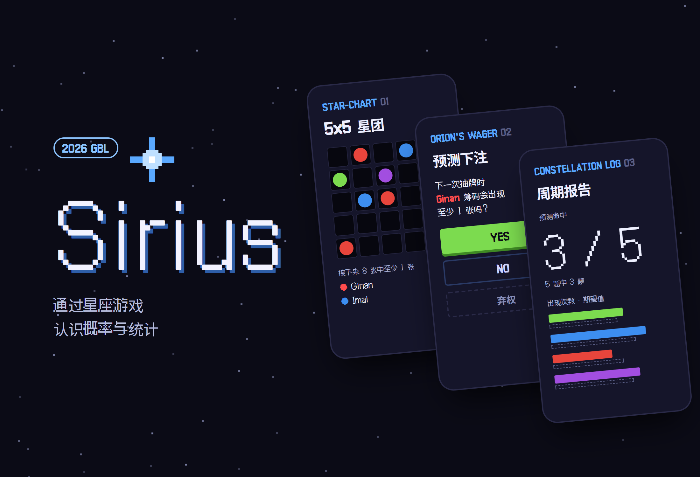
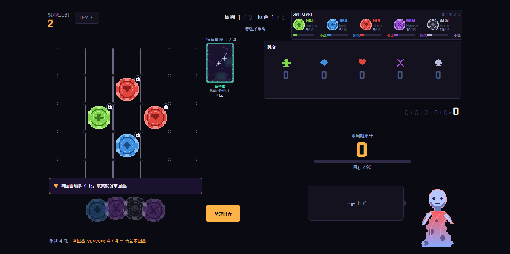
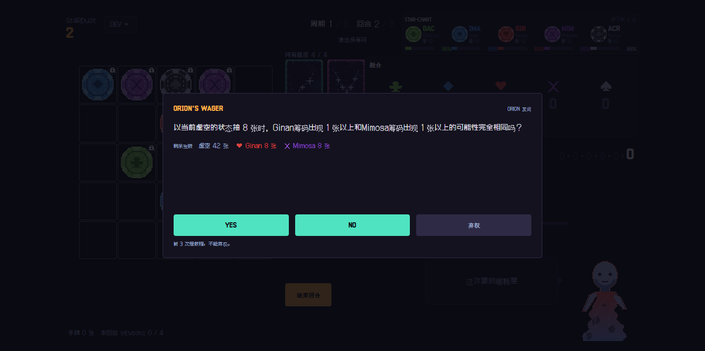
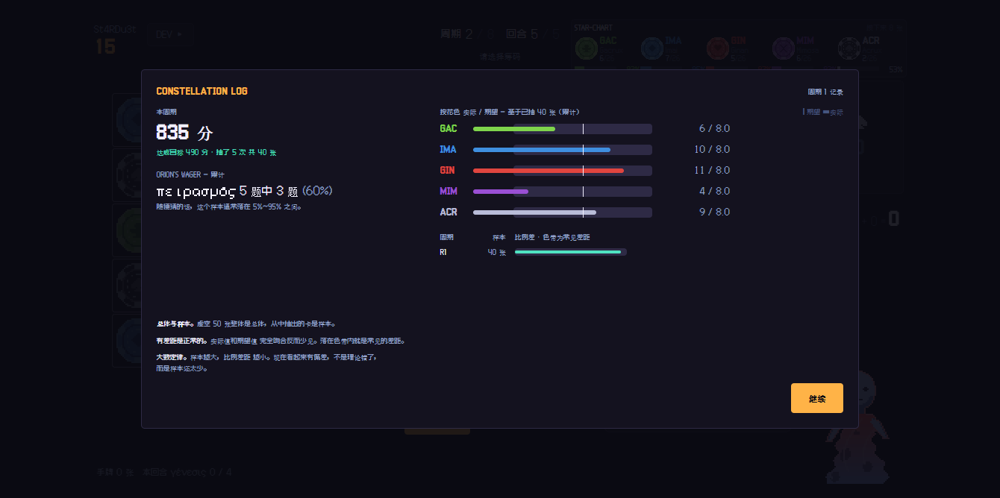
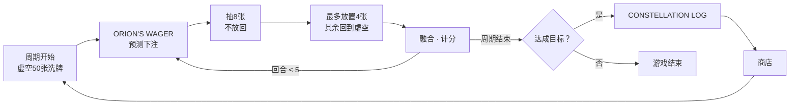

# Sirius

<p align="center"></p>

> 把概率与统计写进判定规则而非说明文字的像素风桌游。平衡性用固定种子的蒙特卡洛模拟验证，并以面向展位笔记本电脑的单个 exe 发布

---

## 1. 项目概述 (Overview)

| 项目 | 内容 |
|---|---|
| 项目名称 | Sirius（包名 STA-mble） |
| 一句话概述 | 让初中生每回合都用概率来判断“现在该选哪一边”的游戏。把教科书的成就标准与游戏规则一一对应 |
| 进行时间 | 2026.08.05 ~ 2026.08.15（11天）· 提交37次，v0.1.0 → v7.0.0 |
| 参加活动 | GBL（Game Based Learning）2026 Math 组 · 主题为概率与统计 · 面向初中生 · 展位演示 |
| 参与人数 | 个人项目 |
| 本人角色 | 游戏策划（GDD 3,400行）、课程衔接设计、规则引擎·UI·模拟器·打包全部工作 |
| 贡献度 | 100%（仓库提交全部来自本人） |

学生会计算 `C(50,8)`，却没有学过“那么现在该选哪一边”。计算在纸面上就结束了，判断却在教室之外。游戏会强迫玩家做出选择，并立即反馈结果，因此很适合用来处理这道鸿沟。

我先读了教科书，再确定设计标准。2022 修订版高中《概率与统计》在每个大单元都注明了与初中内容的衔接，而初中生已经学过计数与概率（初二）和相对频率（初一）。因此，这个游戏不教他们不知道的东西，而是充当桥梁，把已经掌握的内容连接到高中概念（统计概率·期望值）上。

## 2. 技术栈 (Tech Stack)

| 类别 | 技术 | 选择理由 |
|---|---|---|
| 语言 · 构建 | TypeScript（`strict`）· Vite 8 | 用类型约束规则引擎，就能用数据结构强制执行“不把正确答案的概率放进题目”这类设计规则 |
| 规则引擎 | 纯 TypeScript `core/`（对 React·DOM 的依赖为0） | 游戏·模拟器·测试共享同一个状态机（`core/game.ts`） |
| UI | React 19 · Zustand · Tailwind CSS 4 · Framer Motion | 在1120×630的固定画布上绘制像素画。store 只负责包装状态机 |
| 模拟 | Node + tsx，基于种子的 `mulberry32` | 同一种子必须得到同一结果，平衡测量才能复现 |
| 测试 | Vitest 4 | 包含守护设计约定的检查，例如把概率公式与 BigInt 精确组合数进行对照 |
| 打包 | Electron 43 · electron-builder 26（`portable`） | 一个无需安装、运行时和网络的 exe 文件。复制到展位笔记本电脑上即可 |

## 3. 核心功能与负责工作 (Key Features & Contributions)

<p align="center"></p>
<p align="center">
  
  
</p>
<p align="center"><sub>用仓库中的自动截图工具在本地截取（固定种子）。上：游戏画面；下左：预测下注；右：周期结束时的统计报告</sub></p>

### 已实现功能

**核心循环。** 一个周期为5回合。每回合从虚空（50张卡）中抽8张，并把其中最多4张放到5×5的星团上。没有放置的碎片会回到虚空重新洗混。放置的碎片与相同纹样相连时产生融合得分，周期累计得分达到目标就进入下一个周期。抽牌是不放回的，而只有放置这一事件会把卡从总体中移除，因此这个循环本身就是一次抽样练习。

**碎片构成本身就是计数问题。** 基本碎片有5种。特殊碎片是把两种纹样各取一半合成的芯片，共 ₅C₂ = 10种。流浪碎片从相邻的4个方向中选3个方向进行判定，因此有 ₄C₃ = 4种情况。特殊碎片的数量不是随意定的，而是组合数本身。

**4种学习装置。** 每种装置负责的单元和统计单位各不相同。

| 装置 | 作用 | 课程 |
|---|---|---|
| `STAR-CHART` | 常驻显示各纹样的剩余张数和“接下来8张中至少出现1张的概率”（计算值），并与此前手牌中观测到的比例（实际值）并列 | Ⅱ-1 概率的意义 · Ⅱ-2 对立事件 · Ⅲ-5 总体与样本 |
| `ORION'S WAGER` | 抽牌前进行 YES / NO / 弃权的预测下注。周期越往后，难度按简单比较 → 对立事件 → 条件概率逐步提高 | Ⅱ-1 · Ⅱ-2 · Ⅱ-3 条件概率 |
| `DRIFT ORACLE` | 用表格列出流浪碎片可能读取的全部情况，并询问期望值 | Ⅲ-2 期望值 |
| `CONSTELLATION LOG` | 周期结束时，把预测命中率和各纹样出现次数与期望值进行比较。比例后面一定附上样本数（“5题中3题”） | Ⅱ-1 统计概率 · Ⅲ-3 |

**用对立事件计算，不构造阶乘。** “至少1张”按 `1 − C(n−k, h) / C(n, h)` 求得，但实际用累乘 `∏ (n−k−i)/(n−i)` 计算。`C(50,8)` 已达 5.4×10⁸，而 60! 超出了双精度范围，若分别求出分子和分母，在做除法之前就会变成 `Infinity ÷ Infinity`。累乘的每个因子都在0~1之间，因此结果不会超出概率范围。

### 主要工作

- 撰写 GDD 与课程映射（9个游戏系统 ↔ 成就标准）
- 无头状态机 `core/game.ts`、融合得分、商店、3种学习装置（`wager` · `oracle` · `report`）
- 蒙特卡洛模拟器（玩家策略 random · greedy · smart）与平衡曲线设计
- 像素画程序化生成流水线（芯片·星座卡·角色）
- Electron 外壳与 portable exe 打包，面向展位运营的构建分支

## 4. 成果与结果 (Results & Metrics)

### 定量成果

| 项目 | 结果 |
|---|---|
| 测试 | Vitest **493个通过**（24个文件，基于 v7.0.0 于2026.09重新运行）· 类型检查无错误 |
| 平衡测量 | 每种组合1,000次 × 9种组合，种子 20260101 |
| 代码规模 | `src/` · `sim/` 15,178行，GDD 3,409行 |
| 展位吞吐量 | 每人用时27.8分钟（计算值），按3台笔记本电脑计每小时5.5人 |
| 发布物 | Windows portable exe 1个 |
| 活动结果 · 实际参与学生人数 | （待确认） |

**预测下注对结果的影响**（基于之前的展位目标曲线 `[490, 630, 640]`）：

| 玩家策略 | 下注命中 0% | 50% | 100% |
|---|--:|--:|--:|
| greedy（展位版） | **71.3%** | 85.0% | 87.2% |
| smart（展位版） | 94.7% | 94.2% | 94.2% |
| smart（完整版） | 4.2% | — | 40.4%（+36.2%p） |

在展位版中，即使一道概率题都没答对，greedy 也能以71.3%的比例通关，学习装置不会成为入门门槛。而在完整版中，预测下注决定胜负。对两个版本采用不同原则的判断得到了数据的支持。展位版的目标后来经设计者亲自试玩，被有意提高到了 `[600, 900, 2000]`。

### 定性成果

- **把两种概率并排放置后，统计概率无需解释便一目了然。** 第1周期结束时，五种纹样都是10/51，五行的计算值都是85%，而实际观测值却分散为 100 / 80 / 100 / 60 / 100%。学生能亲眼看到：样本小时，计算与观测会出现偏离。
- **教科书修正了设计。** 教科书的写法是 `큰수의법칙`（即“大数定律”，连写不加空格），属于二项分布单元的学习要素。不放回抽样不属于条件概率单元，而属于总体与样本单元。由于教学注意事项禁止在条件概率中作时间顺序·因果上的解释，我把“已经出了3张，所以现在”这类题目全部改写为“当虚空处于当前状态时”。
- **不隐瞒样本小这一事实。** 统计报告在比例旁写明样本数，同时显示随机猜测时会落入的范围。在3个周期的累计中，观测到“常见差异”按6.3% → 4.5% → 3.6%逐步缩小的收敛过程。

### 已知局限

- **30种伴星没有效果。** 只有名称·说明·等级·价格。所有平衡曲线都是在没有伴星的情况下测得的，一旦开放就得把9种组合重新测一遍。我通过在购买动作类型中根本不设置对应变体的方式将其封存。
- **27.8分钟的吞吐量是计算值而非实测值。** 阅读速度（250字/分钟）和判断时间都是假设值。
- **没有测量学习效果。** 验证的是“概念是否植入了规则”和“游戏能否正常运转”。前测·后测是下一步。
- **自动截图工具与当前的标题画面不匹配。** 工具不认识 v7 新的标题菜单（开始游戏 · 展位模式 · 图鉴 · 设置）。本报告中的画面是只修改了工具的开始步骤后截取的。

## 5. 问题排查经验 (Troubleshooting)

### ① 两个学习装置互相抵消

**问题** 预测下注（`ORION'S WAGER`）窗口弹出时，不透明度85%的遮罩层盖住了概率面板（`STAR-CHART`）。要回答概率题就必须看剩余张数，而作答的那一刻这个数值却不在画面上。时间再充裕，题目本身也无法解答。

**原因** 问题不只在遮罩层。窗口主体遮住了面板的66%。把遮罩层设为透明不行，移动面板也不行。一旦移动面板，概率 % 那一列也会露出来，只要照着读就能得到答案。

**解决** 只在题目窗口中放入各纹样的剩余张数，不放概率。不靠条件语句，而是用数据结构来强制：题目类型中没有存放概率的位置，因此题目生成器即使知道概率值，也没有办法传给窗口。测量明度对比后发现，透过遮罩层的纹样颜色与正文的对比度只有1.08~1.44:1，远低于标准（4.5:1）。被遮住的 % 列无论放在哪里都无法辨认。

**结果** 简单比较题保留了“张数多则可能性大”这一步推理，对立事件题保留了计算过程。在不泄露答案的前提下，题目重新变得可解。

### ② 模拟器找出了规则漏洞

**问题** 完整版的通关率高于设计意图，而且修改规则时，它的变化方向与展位版不同。

**原因** 星座卡持有上限（4张）的处理存在缺陷。达到上限后仍无法把卡过滤掉，持有数增加到了5·6·7张。完整版的 smart 策略在48%的商店访问中都处于上限状态，一直在享受这个缺陷带来的好处。展位版达不到上限，所以影响为0。两个版本的数值朝不同方向变化，正是线索所在。

**解决** 修正上限处理，重新测量9种组合。这次测量之所以可信，得益于结构。如果模拟器拥有自己独立的循环，被测量的游戏和发布的游戏就会是两套不同的实现。因此游戏·模拟器·测试共用同一个 `core/game.ts`，任何地方都不直接调用 `Math.random()`，而是由外部注入随机数。连台词输出用的随机数也与游戏随机数分离（`seed ^ 0x5ee0`）。如果台词消耗了游戏随机数，种子复现就会被破坏。

**结果** 完整版 smart 的通关率从28.1%修正为11.7%。展位版的数值在重新测量后依然有效。

### ③ “展位版15分钟”并不是实测

**问题** 策划初期，我把展位版一局定为15分钟，以为每小时能接待12人。

**原因** 这个数字不是从任何计算中得出的。按题目字数和阅读速度重新计算，一局要32.4分钟，其中15道预测下注题占了44%（14.1分钟）。阅读速度以韩国成人的最高速度（约589字/分钟）乘以初中生系数0.8、需要判断的文本系数0.6，定为250字/分钟。

**解决** 答对时省略解析，并把解析篇幅缩短一半（下注题 3,030字 → 1,627字）。统计报告没有缩减。展示收敛的三个点就是体现大数定律的全部装置，因此我没有选择靠削减学习装置来换取时间。

**结果** 一局缩短到27.8分钟。加上轮换时间，3台笔记本电脑每小时可接待5.5人。GBL 由参与学生投票决定名次，吞吐量就等于成绩。我在活动之前就意识到，确保笔记本电脑的台数是比预想中更重要的条件。

### ④ 只在韩文路径下构建崩溃

**问题** 类型检查和测试都能通过，唯独生产构建以 `STATUS_STACK_BUFFER_OVERRUN` 崩溃。

**原因** 项目路径中混有韩文·空格·云同步文件夹。打包器在这类路径上会崩溃，而且只在构建阶段才暴露出来。

**解决** 把工作树迁移到只含 ASCII、没有空格的简单路径，并把“不再移回同步文件夹”作为项目规则写进文档。

**结果** 构建和打包都能稳定完成。

## 6. 链接与交付物 (Links & Deliverables)

| 类别 | 链接 |
|---|---|
| GitHub 仓库 | [stx4R/Sirius](https://github.com/stx4R/Sirius)（私有） |
| 发布物 | `Sirius-v<version>-portable.exe`（electron-builder `portable`） |
| 设计文档 | 仓库中的 `docs/GDD.md`（3,409行）、`sim/out/results.md`（模拟结果） |

### 结构

```
core/game.ts  ←──  sim/     （由模拟器驱动）
              ←──  store/   （由 Zustand 包装）
              ←──  tests/   （由测试验证）

src/core/   纯 TypeScript。规则·概率计算·学习装置。React·DOM 依赖为0
src/ui/     React 组件。禁止写游戏规则逻辑
sim/        Node 蒙特卡洛模拟器（只 import core）
electron/   打包外壳。游戏逻辑0行
```



---

+++

## 客户旅程图 (Journey Map)

用户是来到展位的初中生。

| 阶段 | 用户的行为 | 用户的想法 | 游戏的应对 |
|---|---|---|---|
| 入座 | 坐到笔记本电脑前 | “这个怎么玩？” | 第一局第一回合由引导提示逐步指点操作。前3次预测下注强制作为教程 |
| 第一个周期 | 试着放置碎片 | “随便放哪儿都行？” | 第一个周期设计为人人都能通过。淘汰一个学生，就会失去他的一票 |
| 判断 | 阅读下注题目 | “还剩几张来着？” | 题目窗口中有剩余张数，概率由学生自己推断 |
| 观察 | 查看概率面板 | “说是85%，怎么是60%？” | 计算值与实际值并列显示，能看到小样本带来的波动 |
| 总结 | 查看周期报告 | “我做得好吗？” | 像“5题中3题”这样，同时显示样本数和随机猜测时的范围 |
| 离场 | 去投票 | | 结束时显示投票指引 |

## 动效设计 (Motion Design)

- 手牌呈扇形展开，融合结算按纹样逐个加分。由于不一次性合计，能用眼睛追踪是哪一行得了分。
- 角色 ORION 会随情况变换表情来搭话。台词用的随机数与游戏随机数分离，演出不会改变游戏结果。
- Electron 窗口在第一帧之前先涂上背景色，游戏不是从白屏，而是从黑暗中浮现出来。

## 自适应设计 (Adaptive Design)

- 使用1120×630的固定画布，按屏幕等比例缩放。即使每台展位笔记本电脑的分辨率不同，所有画面上显示的都是同样的游戏。测试会在固定画布上检测元素框的重叠与溢出。
- 发布形态也配合运营环境。生产构建只显示展位版（完整版8个周期约40分钟，相当于一个座位丢掉一张票的时间）。演示时用 `?mode=full` 打开。不使用运行时配置文件，因此各台笔记本电脑之间的设置不可能出现偏差。

## 安全漏洞管理 (DREAD)

这是一款离线游戏，既没有个人信息，也没有服务器。这里把展位电脑上可能发生的滥用视为威胁。

| 威胁 | 损害 | 可复现性 | 可利用性 | 影响 | 可发现性 | 措施 |
|---|---|---|---|---|---|---|
| exe 内的链接让学校电脑变成浏览器 | 中 | 中 | 低 | 展位电脑 | 中 | 不把新窗口交给系统浏览器打开，而是直接拒绝（`setWindowOpenHandler`）——**应用** |
| 学生打开完整版，占用座位40分钟 | 中 | 低 | 低 | 排队的学生 | 低 | 生产构建只提供展位版，只能通过 URL 参数解除——**应用** |
| 用开发者工具篡改分数 | 低 | 中 | 中 | 当前这一局 | 中 | 虽然手动绑定了快捷键，但开发者工具的快捷键仍然保留。在发布构建中将其屏蔽是遗留问题 |
