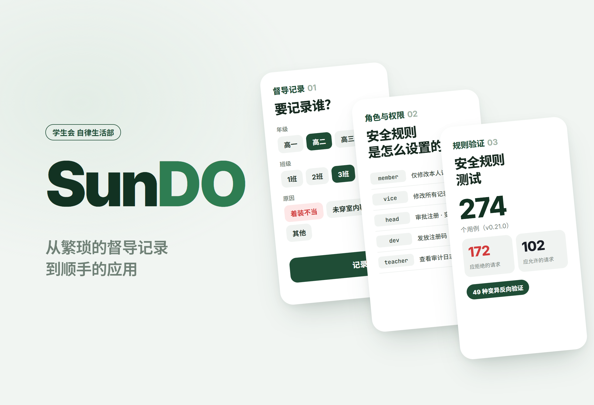
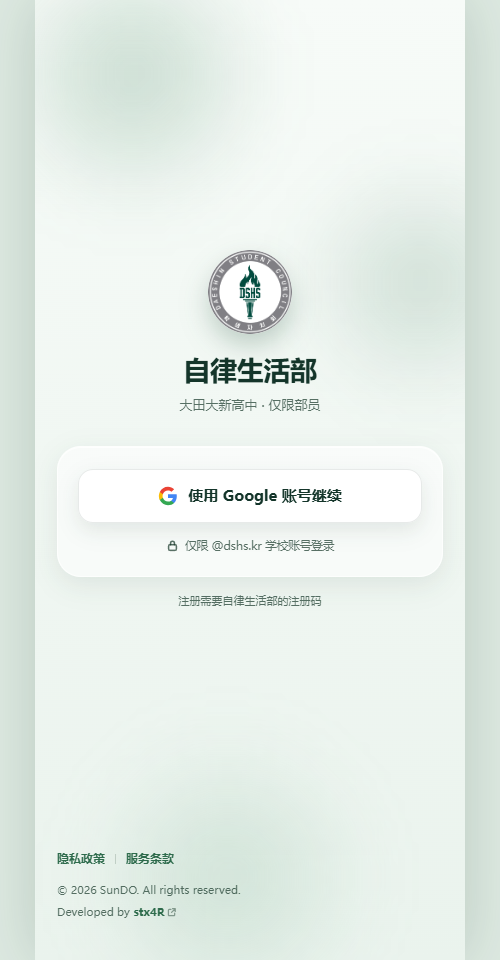
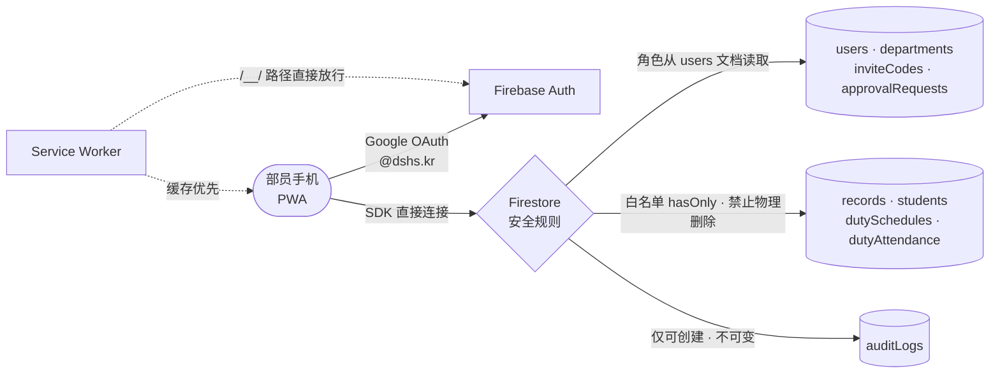

# SunDO

<p align="center"></p>

> 把学生会自律生活部的督导记录从纸面搬到线上的学校专用 PWA。不设服务器，仅靠 Firestore 安全规则强制执行权限，并用变异反向验证证明了这些规则确实会拒绝请求

---

## 1. 项目概述 (Overview)

| 项目 | 内容 |
|---|---|
| 项目名称 | SunDO（自律生活部督导电子记录 PWA） |
| 一句话概述 | 部员选择学生并记录督导事由，同时管理巡查日程与出勤。由于这是未成年人的生活指导记录，设计的重心放在了用规则钉死“谁能看到什么” |
| 进行时间 | 2026.08.20 ~ 2026.09.18 · v0.0.1 → v1.0.0（09.11 正式上线）→ v1.1.0（安全加固） |
| 参与人数 | 个人项目（用户：大田大新高中学生会自律生活部部员约40人） |
| 本人角色 | 策划、权限模型·威胁模型设计、安全规则、界面·PWA 全部实现、部署·运维 |
| 贡献度 | 100%（仓库的60次提交全部来自本人） |

自律生活部的督导记录一直以纸质形式管理。无法追踪谁在何时写了什么，写错的记录被擦掉也不会留下痕迹，也没有任何文件规定谁可以查看某个学生的记录。

电子化本身并不难，问题在于处理的数据是未成年人的生活指导记录。设计不当，反而会比纸质更糟。纸质记录在物理上只有一份，而数据库只要一行查询就能交出全校学生的记录。

这个应用没有应用服务器，浏览器中的 Firebase SDK 直接连接数据库。因此，能够判定权限的地方只有安全规则这一处。在界面上隐藏按钮并不是防御，在控制台里直接调用 SDK 就能绕过。**界面负责便利，规则负责强制。两者不一致时，真正能拦住的只有规则拦住的部分。**

## 2. 技术栈 (Tech Stack)

| 类别 | 技术 | 选择理由 |
|---|---|---|
| 界面 | React 19 · TypeScript · Vite 8 · React Router 8 · Tailwind CSS 4 | 包含13个页面、31个组件的移动应用。以 Dock 标签栏结构和底部弹出面板为核心的 UI |
| 认证 | Firebase Auth（Google OAuth，`@dshs.kr` 域名） | 学校的 Google 账号就是身份凭证，无需另外管理密码 |
| 数据 · 权限 | Cloud Firestore + 577行安全规则 | 不设服务器，用规则强制执行按角色·状态·字段划分的权限。规则文件里的注释比条件还长 |
| 规则验证 | Firestore 模拟器 · `@firebase/rules-unit-testing` · 自制的变异反向验证框架 | 不仅测量“是否允许”，还测量“拒绝是否真的发生” |
| PWA | Web 应用清单 · 自写的 Service Worker（`public/sw.js`） | 无需应用商店即可安装到主屏幕。包含离线横幅·更新横幅·安装指引 |
| 部署 | Firebase Hosting · 安全响应头 | 把应用和认证处理程序放在同一源下。应用了 X-Frame-Options·CSP `frame-ancestors` 等 |

## 3. 核心功能与负责工作 (Key Features & Contributions)

<p align="center"></p>
<p align="center"><sub>已部署站点的登录界面。登录后的界面包含真实的学生信息，因此未收录。</sub></p>

### 已实现功能

- **注册与审批**：用学校 Google 账号认证 → 输入部长发放的注册码 → 同意政策 → 等待部长审批。审批前（`pending`）的账号无法访问任何业务数据。
- **督导记录（首页）**：按年级 → 班级 → 学生的顺序选择，记录事由（着装不整 · 未穿室内鞋 · 其他）。记录时间自动填写。也可以点放大镜按学号搜索，直接记录。
- **记录查询·修改（记录）**：实时查看记录，只有作者·副部长·部长·dev 可以修改或删除。删除并不真正抹除数据，只改变状态。
- **巡查日程与出勤（日程）**：按周编排午餐·晚餐时段的巡查人员，并记录部员的出勤（正常·迟到·缺席）。
- **管理（管理）**：注册审批·拒绝、角色变更、部长移交、注册码发放·失效、学生名单、审计日志。只有副部长及以上才能进入。
- **设置·政策**：注销账号，以及隐私政策·使用条款·开源许可证页面。
- **PWA**：主屏幕安装指引、离线横幅、新版本更新横幅、下拉刷新、键盘弹出时的底部留白修正。

### 角色与权限

| 角色 | 权限要点 |
|---|---|
| `member`（部员） | 撰写督导记录。只能修改·删除自己写的记录 |
| `vice`（副部长） | 以上权限 + 修改·删除所有记录，查看注册申请 |
| `head`（部长） | 以上权限 + 注册审批·拒绝、角色变更、名单管理、编排巡查日程 |
| `dev` | 以上权限 + 注册码发放·失效、物理删除用户文档 |
| `teacher`（教师） | 仅可查看审计日志·注册申请 |

### 主要工作

- 先列举10项威胁模型（T1~T10），再设计规则
- 编写安全规则的12个 `match` 块，并把规则无法表达的6项内容及其替代防御写成文档
- 通过5次模拟器实测（Q-1~Q-5）确认规则引擎的实际行为
- 编写规则测试框架与变异反向验证框架
- 实现界面·PWA·Service Worker，负责部署及运维期间的热修复

## 4. 成果与结果 (Results & Metrics)

### 定量成果

| 项目 | 结果 |
|---|---|
| 规则测试 | 6个套件 **274个用例**——拒绝 172 / 允许 102（基于 v0.21.0） |
| 变异反向验证 | **49种**——逐个故意放开规则条件，对照声明的用例是否真的失败 |
| 模拟器实测 | 5项（列表查询 · 批处理内读取的时点 · 批处理原子性 · 读取次数上限 · 正则锚点） |
| 规模 | `src/` 14,937行，安全规则577行，提交60次 |
| 运营 | 2026.09.11 正式上线，部员约40人 · 全校学生名单 |
| 实际累计记录数 · 每日使用量 | （待确认） |

拒绝用例是允许用例的1.7倍，因为规则测试的主体不是“能做到”，而是“做不到”。

### 定性成果

- **放弃了只测“通过”的验证。** 如果只确认“应当允许的会被允许”，那么根本没写条件的规则也能通过。因此我逐个故意放开规则中的条件再运行，看原本守护该条件的测试是否真的失败。如果没有失败，就说明这个条件什么也没做。
- **用白名单而非黑名单来编写。** 修改记录时，像 `affectedKeys().hasOnly(['reasonCode', 'reasonText', 'updatedBy', 'updatedAt'])` 这样只写出允许变更的字段。字段增加时，黑名单会自动出现漏洞，而白名单会自动锁住。
- **取消了物理删除。** 记录·审计日志·注册申请·注册码都是 `allow delete: if false`。删除只以状态转换的形式发生，`dev` 也不例外。审计日志创建后任何人都无法修改。
- **故意不设 catch-all 拒绝规则。** 引擎本来就是默认拒绝。`match /{document=**} { allow read, write: if false; }` 与开发期的临时规则长得一模一样，只要有人改动一个字，所有集合就会重新开放。
- **写明了规则做不到的事。** 列举了“部长恰好只有1人”（无法做集合查询）、“没有审计日志连修改也会失败”（看不到同级操作）、字段级读取限制（`allow read` 以文档为单位）等6项，并分别指定了批处理原子性·界面约束·迁移到服务器函数等替代防御。

### 已知局限

- **用户文档对本部门成员开放了全部字段。** “不渲染邮箱”只是界面上的约定，并不是规则。根本的解决办法是变更 schema，把敏感字段拆分到子文档中。
- **集合不变式和并发移交的竞态无法用规则封堵。** 需要迁移到服务器函数（事务）中。
- **审计日志的完整性依赖批处理的原子性。** 批处理由应用代码构建，因此如果绕过应用直接调用 SDK，就能进行不留日志的修改。
- **注册码暴力破解。** 列表虽已锁住，但单个注册码的读取对全体学校账号开放（组合数为4,569,760种）。需要配套的申请速率限制。
- **规则测试不在仓库中。** 整理仓库时（v0.22.0）把 `tests/` 移出了目录树。新拉取仓库的人无法运行规则测试，而 v1.1.0 的规则加固部分在仓库层面没有验证记录（待确认）。

## 5. 问题排查经验 (Troubleshooting)

### ① 正式上线后登录陷入无限循环

**问题** 发布 v1.0.0 后，出现了完成 Google 登录后又回到登录界面的现象。浏览器的弹窗方式和 PWA 的重定向方式都出现了同样的症状。

**原因** 问题出在 Service Worker。由于把认证域名（`authDomain`）设成了与应用相同的域名，登录时打开的 Firebase 保留路径 `/__/auth/handler` 和 `/__/auth/iframe` 也作为与应用同源的页面导航请求进入。只要是页面导航，Service Worker 就不看路径，直接返回缓存的 `index.html`。于是认证处理程序的位置上显示出了应用界面，凭据也就失去了返回父窗口的途径。用 `curl` 请求同一地址时，服务器返回的是真正的处理程序；用浏览器打开时，出现的却是 SunDO 界面。拦截请求的正是 Service Worker。在 PWA 性能改进那一轮（W-27）中，网络优先策略被改成了缓存优先，原本只在超时时偶尔失败的问题就变成了每次都失败。

**解决** 在 Service Worker 的 fetch 处理最前面，让以 `/__/` 开头的路径不经处理，直接交给浏览器的默认处理（v1.0.1，当天发布）。这类路径也没有挂离线替代页面，因为它们本来就需要网络才有意义。

**结果** 登录循环消失了。我把原因、复现方法以及“为什么之前的版本没有出现”写进了代码注释，这样即使同样的策略变更再次引入，也能及时察觉。

### ② 列表页面整个崩溃，或者注册码全部泄露

**问题** 规格说明中的规则骨架把单个读取（`get`）和列表查询（`list`）合并成了一个 `allow read`。如果保持原样，一旦给用户文档加上“本人或本部门成员”的条件，部员列表页面就会崩溃；一旦给注册码加上“已登录即可”的条件，所有有效注册码就会以列表形式泄露出去。

**原因** 用模拟器确认后发现，在只有一条 `allow read: if request.auth.uid == uid` 的规则下，单个读取被允许，集合列表却被拒绝。而用 `where(문서ID == 본인)`（即按“文档ID == 本人”筛选）缩小范围的查询则能通过。规则不会逐条过滤列表结果。查询如果不能自行证明满足规则条件，整个查询就会被拒绝。这正是“规则不是过滤器”的确切含义。

**解决** 在所有集合中把 `get` 和 `list` 分开编写。注册码则反过来利用了这一特性：文档 ID 就是注册码字符串本身，因此即使把单个读取开放给全体学校账号，也只有已经知道注册码的人才能读到那1条。列表只对部长开放，以防止枚举注册码。

**结果** 列表页面通过能证明条件的查询正常工作，注册码只有已经知道它的人才能确认。

### ③ 规格说明指定的防御什么也没拦住

**问题** 规格说明把域名检查正则 `.*@dshs[.]kr$` 末尾的 `$` 规定为必要条件。

**原因** 实测发现，即使删掉 `$`，`attacker@dshs.kr.evil.com` 依然会被拒绝，因为规则引擎的 `matches()` 要求整个字符串完全匹配。反之，一旦在末尾加上 `.*`，攻击就能通过。有没有 `$` 无关紧要，`.*` 后缀才是真正的要害。

**解决** 保留 `$` 作为双重防御，但在注释中写明真正的风险。这个结论也加入了变异反向验证：`no-dollar-anchor` 变异声明的预期值是“没有任何测试失败”，而 `domain-suffix-open` 变异则必须让域名防御用例失败。

**结果** 规则的依据由文档变成了实测。用同样方式实测的批处理行为（批处理内的读取看到的是批处理之前的状态；一个操作被拒绝，整个批处理都会回滚）成为了部长移交·注册审批批处理设计的依据。

### ④ 反向验证抓到的是测试这一侧的失误

**问题** 每个变异都声明了“放开这个条件时哪些用例应当失败”，但运行反向验证时，声明之外的用例也一起失败了。

**原因** 在收紧权限的那一轮中新增了批处理用例，却没有更新已有变异的声明列表。同样的情况发生了两次。

**解决** 把声明与实际结果对齐，并建立了一套流程：收紧权限时，先在应用源码中全面排查使用该集合的地方，然后再部署。放宽权限时先部署规则，收紧权限时先部署应用。

**结果** 确认了反向验证不仅检查规则，还会检查“规则与测试之间的对应关系”。只要声明仍靠手工维护，同样的遗漏就可能再次发生，因此把各变异的实际失败列表固定为快照，成为了下一步的改进点。

## 6. 链接与交付物 (Links & Deliverables)

| 类别 | 链接 |
|---|---|
| GitHub 仓库 | [stx4R/SunDO](https://github.com/stx4R/SunDO)（私有） |

### 系统架构图



规则验证的两层：

```
第1层  用例验证      274个（拒绝 172 / 允许 102）——fixture 在关闭规则的状态下写入
第2层  变异反向验证  49种——放开一个条件时，声明的用例是否真的失败
                     例：no-dollar-anchor → 失败用例为0个才是正确答案
```

---

+++

## 客户旅程图 (Journey Map)

用户是在午餐·晚餐时段巡查的自律生活部部员。

| 阶段 | 用户的行为 | 用户的想法 | 应用的应对 |
|---|---|---|---|
| 注册 | 用学校账号登录并输入注册码 | “可不能谁都能进来” | 域名限制 + 部长发放的注册码 + 部长审批，共3道关卡 |
| 巡查 | 发现着装不整的学生 | “得赶紧记下来” | 年级 → 班级 → 学生点三下，或搜索一次学号 |
| 记录 | 选择事由 | “时间要我自己填吗？” | 记录时间自动生成，且无法修改 |
| 更正 | 修改写错的记录 | “删了会被看出来吗？” | 只有作者能修改事由，删除是会留下痕迹的状态转换 |
| 运营 | 部长安排下周的巡查 | “谁没来？” | 在一个页面中处理按周的日程和出勤（正常·迟到·缺席） |

## 自适应设计 (Adaptive Design)

- 明确了支持的设备（Android 10 以上的 Galaxy S 系列，iOS 17 以上的 iPhone SE 第3代及以后机型）。以巡查现场单手使用的手机屏幕为基准，布置 Dock 标签栏和底部弹出面板。
- 输入框获得焦点、虚拟键盘弹出时，按键盘高度修正底部留白（`useKeyboardInset`）。各设备不同的屏幕高度按实际可见高度重新计算（`appHeight`）。
- 离线时在顶部显示横幅，新版本发布时用更新横幅提示。

## 手势设计 (Gesturing)

- 日程·管理页面可以下拉刷新。这是巡查途中用单手拇指获取最新状态的操作。
- 记录修改·学生搜索·日程编辑都通过从下方升起的底部弹出面板打开。

## 安全漏洞管理 (DREAD)

| 威胁 | 损害 | 可复现性 | 可利用性 | 受影响用户 | 可发现性 | 措施 |
|---|---|---|---|---|---|---|
| 外部人员在没有学校账号的情况下访问 | 高 | 高 | 中 | 全体 | 高 | 检查令牌中邮箱的域名——**应用** |
| 伪造自己的角色后提交 | 高 | 高 | 中 | 全体 | 中 | 角色只从服务器端的 users 文档读取——**应用** |
| 事后篡改记录中的学生·时间·作者 | 高 | 中 | 中 | 相关学生 | 低 | `hasOnly` 白名单——**应用** |
| 不留痕迹地删除记录 | 高 | 中 | 中 | 相关学生 | 低 | 禁止物理删除，只允许状态转换——**应用** |
| 查看注册码列表 | 高 | 高 | 中 | 全体 | 中 | 分离 `get`/`list`——**应用** |
| 部长授予 `dev`·`teacher` 角色 | 中 | 高 | 中 | 全体 | 中 | 限制可授予的角色——**v1.1.0 应用** |
| 用不存在的学生姓名记录 | 中 | 高 | 中 | 记录可信度 | 中 | 检查学生文档是否存在、姓名是否一致——**v1.1.0 应用** |
| 本部门成员查看其他部员的邮箱 | 中 | 高 | 低 | 部员 | 低 | 需要拆分字段——**遗留问题** |
| 注册码暴力破解 | 中 | 中 | 中 | 全体 | 中 | 需要速率限制——**遗留问题** |

从损害大的项目开始用规则封堵，超出规则表达能力的两项则交由 schema 变更和服务器端限制处理。
