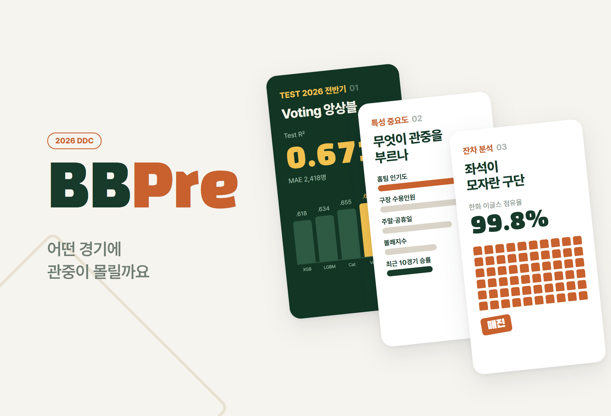
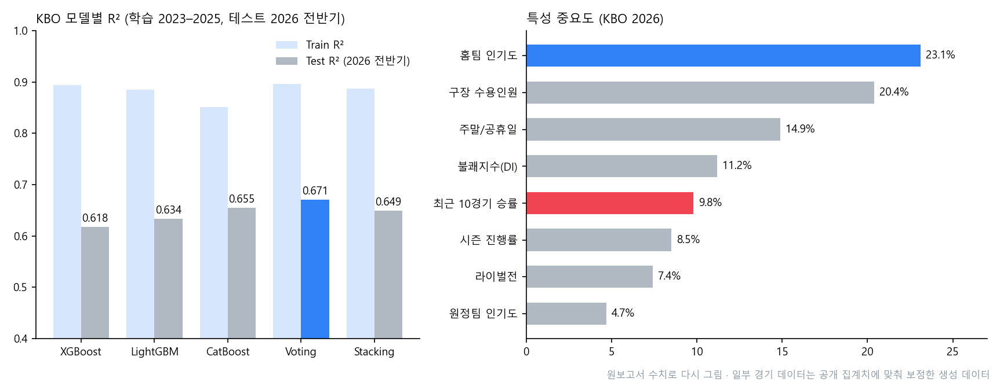

# BBPre.

> A machine learning inquiry that used KBO and MLB game data to predict "which games draw the crowds." It was validated on a temporal holdout that kept the entire first half of 2026 separate, and it found the point (truncation) where the nature of the prediction problem changes in a season where sellouts have become routine

---

## 1. Project Overview

| Item | Details |
|---|---|
| Project | BBPre. (KBO & MLB attendance prediction) |
| One-line Summary | Predicted per-game attendance with 3 gradient boosting models and 2 ensembles. KBO first half of 2026: Test R² 0.671, MAE 2,418 people. Home team popularity was more than twice as strong a predictor as recent form |
| Period | 2026.03.10 ~ 2026.07.13 |
| Team | Individual inquiry |
| My Role | Problem framing, data collection and preprocessing, feature engineering, modeling, result analysis, writing the report (25 pages) and presentation |
| Contribution | 100% |
| Context | Second-year extracurricular activity (DDC; nature of the activity to be confirmed) |

In 2026 the KBO drew 7,633,775 fans (18,004 per game) in just 424 first-half games, setting a record for first-half attendance. Attendance doesn't stop at ticket revenue; it carries through to ballpark F&B, merchandising, sponsorships and leverage in broadcast rights negotiations. But "attendance is high" on its own decides nothing. Pricing, marketing, staffing and stadium expansion can only be decided with data once you know which games draw crowds, because of what factors, and how much demand is hidden behind sellouts.

**Research question.** Is attendance a simple time-series trend, or a function of per-game conditions that tangle together weather, rivalries, standings and popularity?

| Hypothesis | Details | How it's checked |
|---|---|---|
| 1. Event interaction | A regression model that takes per-game conditions as input reaches R² of 0.6 or higher | Test R² |
| 2. Brand advantage | Team popularity built up over years is a stronger predictor than short-term performance | Feature importance ranking |
| 3. Generalization | A model trained on 2023–2025 doesn't collapse on the first half of 2026, but loses performance to the extent of the sellout cap | Change relative to the earlier split, residual patterns |

> **About the data.** As stated in the limitations section of the original report, some of the detailed game-level data is **synthetic data** calibrated to public aggregates (424 first-half games, 7.63 million in total, per-team average attendance and occupancy). The performance figures below are estimates based on it. Once real game-level data is obtained, they need to be recomputed with the same pipeline.

## 2. Tech Stack

| Category | Technology | Why |
|---|---|---|
| Models | XGBoost, LightGBM, CatBoost | Good at capturing nonlinear interactions in tabular data (heat wave × outdoor stadium, etc.), and the three differ enough in character to compare |
| Ensembles | Voting (simple average), Stacking (Ridge meta-model) | Individual models' biases offset one another |
| Validation | Time-order-preserving CV (tuning), first half of 2026 as a temporal holdout (one final evaluation) | A random split leaks information, using the future to predict the past |
| Data | KBO official site and Naver Sports, KMA Open MET Data Portal, MLB Stats API and pybaseball, Retrosheet-format game logs | Joins games, weather and sabermetrics at the level of a single game |
| Metrics | R², MAE, RMSE, overfitting gap (Train R² − Test R²) | MAE reads directly as "how many people off," and the gap shows how well it generalizes to a new season |

## 3. Key Features & Contributions

### Data

| Data | Period | Size |
|---|---|---|
| KBO game records | 2023 ~ first half of 2026 | 2,584 games (training 2,160 · test 424) |
| Weather | 2023 ~ 2026 | Game day × stadium weather station mapping (temperature, precipitation, humidity, wind speed, cloud cover) |
| MLB game records | 2020 ~ first half of 2026 | 14,456 games (training 13,046 · test about 1,410) |
| MLB game logs | 2020 ~ 2026 | 28,912 team-games |

- Missing weather values were filled from neighboring stations or monthly averages, and games without attendance figures were dropped.
- Special games such as rainouts, suspended games, opening days and Children's Day were flagged separately.
- For the dome (Gocheok), weather effects were separated through an interaction with a dome dummy. MLB 2020 (shortened to 60 games, including games without fans) was excluded or handled with a dummy.
- Categorical variables were handled natively by CatBoost and encoded with Label/One-hot for XGBoost and LightGBM. Target encoding, which risks leakage, wasn't used.

### Feature Engineering

There was one rule: **use only information a marketing manager could know before the first pitch.**

| Category | Features |
|---|---|
| Environment | Discomfort index `DI = 9/5·T − 0.55·(1 − RH/100)·(9/5·T − 26) + 32` |
| Schedule | `is_weekend`, `is_holiday`, `holiday_weight` |
| Season | `season_progress`, `race_intensity = progress × home win rate` |
| Momentum | `home_recent10_wr = rolling_mean(win, 10).shift(1)` |
| Popularity | `home_pop / away_pop = expanding_mean(attendance).shift(1)` |
| Stadium | `capacity`, `is_dome` |
| Rivalries | Binary flags for the Jamsil Derby, Ellotte-sico (LG vs. Lotte), the Classic Series and the Geumgang Series |

### Modeling

- Hyperparameters were searched with time-ordered CV inside the training period (tree depth 4–8, learning rate 0.03–0.1, 300–1,200 trees, subsample 0.7–1.0). The test set was used once, for the final evaluation.
- Ran the same pipeline on the KBO and MLB to see whether the results carry across leagues.
- Computed team-season OPS, wRC+, WAR, BABIP, ISO and Pythagorean win percentage from the MLB game logs and analyzed their relationship with the attendance model separately.

### Main Tasks

- Collected KBO, MLB and weather data, joined it at the game level, and set the preprocessing rules
- Leak-free feature design (`shift(1)`, expanding mean) and a check that the time ordering is monotonic
- Trained, tuned and compared 5 models; feature importance and residual analysis; year-by-year analysis of the three Seoul teams
- Extended sabermetrics analysis; wrote the report and presentation

## 4. Results & Metrics

### Quantitative Results

Graphs redrawn from the figures in the original report

**KBO (training 2023–2025, test on 424 games from the first half of 2026)**

| Model | Train R² | Test R² | Overfitting gap |
|---|---|---|---|
| XGBoost | 0.894 | 0.618 | 0.276 |
| LightGBM | 0.885 | 0.634 | 0.251 |
| CatBoost | 0.851 | 0.655 | **0.196 (lowest)** |
| **Voting** | 0.896 | **0.671 (best)** | 0.225 |
| Stacking | 0.887 | 0.649 | 0.238 |

**MLB (test on the first half of 2026)**: CatBoost RMSE **6,941 people** (lowest) · LightGBM 6,988 · Stacking 7,063 · Voting 7,120

| Item | Result |
|---|---|
| Best performance | Voting Test R² 0.671, MAE 2,418 people (about 13.4% of the 18,004 average attendance) |
| vs. earlier split | Best R² of 0.697 on the earlier split (testing on the second half of 2025 within 2023–2025) → 0.671 on the full 2026 holdout (−0.026) |
| Hypothesis 1 | Supported (Test R² 0.671 > 0.6) |
| Hypothesis 2 | Supported (home team popularity 23.1% vs. last-10-games win rate 9.8%) |
| Hypothesis 3 | Supported (a small drop, no collapse) |

**R² by year for the three Seoul teams**

| Year | LG | Doosan | Kiwoom | Interpretation |
|---|:---:|:---:|:---:|---|
| 2023 | 0.6091 | 0.5810 | 0.5340 | Normal season |
| 2024 | 0.3887 | 0.4120 | 0.3650 | Sharp drop for every team as the distribution shifted during the league's growth spurt |
| 2025 | 0.5707 | 0.5420 | 0.5150 | Recovery amid record-breaking attendance |
| First half of 2026 | 0.5210 | 0.4980 | 0.4640 | Variance shrinks under the sellout cap |

### Qualitative Results

- **Brand beats performance.** Drawing fans was a function of a fan base built up over years rather than this week's standings race. That's an argument against cutting investment in the fan experience even during a rebuilding season.
- **CatBoost's stability held up in both leagues.** It had the smallest overfitting gap in the KBO, and in the MLB it beat the ensembles as a single model. XGBoost had the best training performance but, with a gap of 0.276, generalized worst to a new season.
- **Sophisticated sabermetric stats were weak in the attendance model.** Team OPS was strongly tied to runs scored, and on-base percentage contributed more to runs than slugging did. But when these stats were added to the attendance model, their importance came out low. My interpretation: fans respond to visible signals like standings, winning streaks and stars rather than wRC+, and on-field performance turns into ticket sales by way of long-term popularity.
- **Explained the larger MLB error through structure.** An RMSE of 6,941 against an average of about 28,000 is on the high side, because the 30 teams and ballparks are far more heterogeneous than the 10-team KBO.

### Known Limitations

- **Some of the game data is synthetic.** The performance figures are estimates based on calibrated data, not real measurements. The raw data and code no longer exist on my machine. (to be confirmed)
- **Truncation was diagnosed, not solved.** Estimating the latent demand behind sold-out games needs methods like Tobit regression or a truncation-aware loss function.
- **2026 covers only the first half.** A full-season recheck including the second-half pennant race and the postseason is needed.
- **There is no ticket price variable**, so price elasticity couldn't be estimated.

## 5. Troubleshooting

### ① A random split inflates performance

**Problem** Attendance data has a time order. Splitting training and test sets at random lets the model predict the past using information from future games. Dynamic variables like recent win rate and popularity also absorb the result of the very game being predicted.

**Cause** Leakage happens on two levels. On the feature side, win rates and average attendance "including that game" get in; on the evaluation side, games that come after the test period end up in training.

**Solution** Blocked it at both levels. For features, every dynamic variable gets `shift(1)` so it only uses information from **before** that game. Since `shift` is useless if the ordering is off, the code verifies that game dates are monotonic. For evaluation, time is fully separated, with 2023–2025 for training and the first half of 2026 for testing, and tuning uses only time-ordered CV inside the training period.

**Result** It came out at 0.671, lower than the 0.697 of the earlier split. I read that gap not as a drop in performance but as "the difference between leak-free generalization performance and the ability to reproduce the past." The conclusion: what conditions a score was measured under matters before how high the R² is.

### ② As sellouts increased, the model started learning "seats" instead of "demand"

**Problem** Performance dropped in the first half of 2026, and the feature importance of capacity jumped from 18.3% to 20.4%. R² fell for all three Seoul teams as well.

**Cause** Observed attendance is `min(demand, capacity)`. In sold-out games, actual demand is cut off at capacity (truncated) and can't be seen. That shrinks the variance of attendance itself, so the "variance to explain" disappears, and the prediction problem turns from forecasting demand into forecasting a supply constraint.

**Solution** Broke the residuals down by team, day of week and occupancy band to look for traces of truncation. Residuals for Hanwha home games were systematically negative (prediction > actual cap). Going by conditions alone, the model predicts more than capacity, but the actual value is cut off at the cap. I also found the opposite for Tuesday games after the Monday travel day: residuals skewed positive, meaning the model overweights the weekday effect.

**Result** Hanwha's average attendance is mid-table but its occupancy is the highest in the league, which is evidence that there's demand to fill more seats if they were added. This led to the conclusion that an attendance model isn't just a marketing tool; it can also be a starting point for investment decisions like adding seats. A Tobit-family method that estimates the size of latent demand directly is left as follow-up work.

### ③ Temperature alone can't capture how unpleasant summer games are

**Problem** The dip in attendance at outdoor stadiums in midsummer isn't just about temperature. The same temperature can feel very different depending on humidity. And domes aren't affected by weather at all.

**Cause** Feeding temperature and humidity in separately leaves the model to discover their combined effect on its own, and treats domes and outdoor stadiums by the same rules.

**Solution** Added the discomfort index, which combines temperature (`T`) and humidity (`RH`), as a derived variable, and separated the weather effect for domes through an interaction with a dome dummy.

**Result** The discomfort index ranked 4th in importance (11.2%). The tree models picked up the nonlinear pattern of outdoor attendance slowing down in the heat-wave range where DI exceeds 80.

## 6. Links & Deliverables

| Category | Link |
|---|---|
| GitHub Repository | None |
| Deliverables | Inquiry report (25 pages, appendices: data specification · glossary), presentation `KBO & MLB.pptx` |

<b>Key Variables</b>

| Variable | Type | Description |
|---|---|---|
| `date` / `dow` | Date / categorical | Game date, day of week |
| `home` / `away` | Categorical | Home team, away team |
| `stadium` / `capacity` | Categorical / numeric | Stadium, capacity |
| `attendance` | Numeric (target) | Attendance |
| `temp` / `rain` / `humid` / `wind` | Numeric | Temperature, precipitation, humidity, wind speed |
| `DI` | Numeric (derived) | Discomfort index |
| `is_weekend` / `is_holiday` / `holiday_weight` | Binary / numeric | Weekend, public holiday, holiday-period weight |
| `season_progress` / `race_intensity` | Numeric (derived) | Season progress, intensity of the standings race |
| `home_recent10_wr` | Numeric (derived) | Home team win rate over the last 10 games (shift 1) |
| `home_pop` / `away_pop` | Numeric (derived) | Home and away popularity (expanding mean, shift 1) |
| `is_rivalry` / `is_dome` | Binary | Rivalry game, dome stadium |
| `occupancy` | Numeric (for analysis) | Occupancy = attendance / capacity |

<b>Terms</b>

- **Temporal holdout**: splitting training and test data in time order so that evaluation uses only future data
- **Data leakage**: information that isn't available at prediction time being used in training, which inflates performance
- **Truncation**: a state where observed values are cut off at an upper or lower bound, so the true value is unknown (attendance at sold-out games)
- **Tobit model**: an econometric model that estimates the latent values of a truncated dependent variable
- **Overfitting gap**: the difference between Train and Test performance
- **Ordered Boosting**: CatBoost's training scheme, which reduces leakage by computing each sample's residual using only the samples that precede it in a random order
- **Expanding Mean**: the average of all past values up to time *t*. A proxy for the accumulated fan base

---

+++

## Customer Journey Map

The "customer" in this inquiry is a team marketing manager who uses the model.

| Stage | Action | Thought | What the model provides |
|---|---|---|---|
| Preseason | Receives the home schedule | "Which games should we push?" | Expected attendance per game from day of week, holidays, rivalries and opponent popularity |
| Game week | Checks the weather forecast | "How many will we lose to a heat wave?" | Predictions that account for the discomfort index, with an error of about 2,400 per game |
| Game day | Sets concession stock and security staffing | "How many people should we plan for?" | A basis for staffing plans at the level of MAE 2,418 |
| Midseason | The team's results slide | "Attendance will drop too, right?" | Evidence that popularity is more than twice as strong as recent win rate |
| Offseason | Reviews expansion and pricing | "If we add seats, will they fill?" | Signs of latent demand in the negative residuals of sold-out teams |
