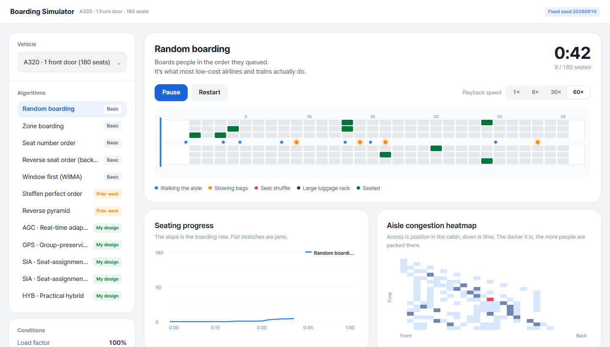
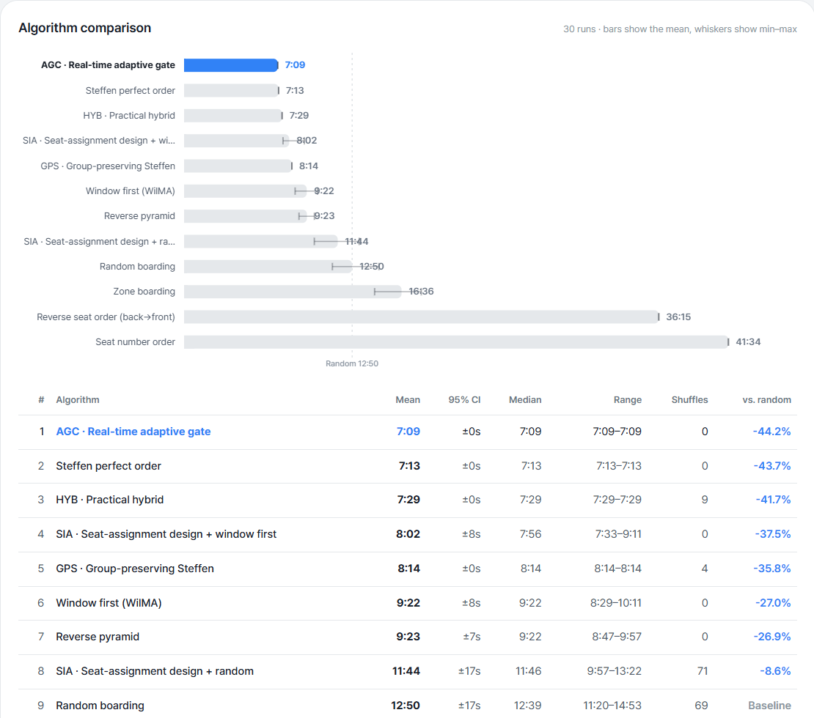
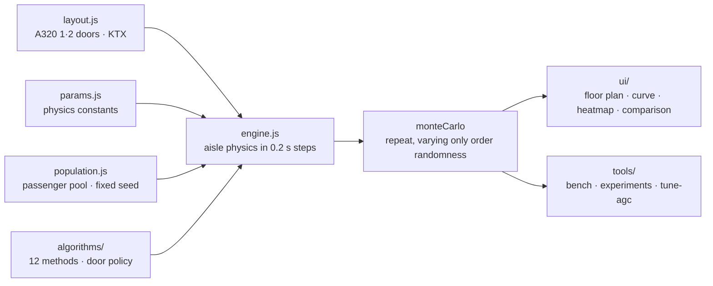

# BoardinG

> A project that tests "what order gets people onto a plane or train fastest" with an agent-based simulator that models aisle physics, luggage stowing and seat shuffles

---

## 1. Project Overview

| Item | Details |
|---|---|
| Project | BoardinG (boarding simulator) |
| One-line Summary | Compares 12 boarding methods on the same passenger pool, then uses 4 methods of my own design to find where the gains lie "after order optimization" (robustness to disruption, seat assignment, number of doors, platform guidance) |
| Period | 2026.09.10 (v1.0.0 → v1.1.4, one day) |
| Team | Solo project (comparing the 4 basic methods was an assignment requirement; the assignment context is to be confirmed) |
| My Role | Model design; implementing the simulation engine, algorithms, experiment tools and visualization; result analysis |
| Contribution | 100% (all 6 commits in the repository are mine) |

Most airlines board from the rear zones first. I wanted to know whether that is actually fast, and if a faster method exists, why nobody uses it. Answering that means first modeling how people block each other in the aisle. The person behind waits while the person in front stows a bag, and when a window-seat passenger shows up late, whoever is already seated has to get up and let them in. This simulator reproduces that friction as physics and pits boarding methods against each other on top of it.

## 2. Tech Stack

| Category | Technology | Why |
|---|---|---|
| Simulation | Vanilla JavaScript (ES modules), seeded random numbers | The browser and Node share one engine. The same seed gives the same result, so comparisons are reproducible |
| Visualization | Canvas 2D (cabin floor plan, seating curve, congestion heatmap, comparison bars) | Drawn by hand, no chart library |
| Experiment tools | Node scripts (`bench` · `experiments` · `tune-agc`) | Reproduce the Monte Carlo comparison and all 4 experiments with a single command |
| Deployment | GitHub Pages · local static server (`tools/serve.mjs`) | ES modules are blocked under `file://`, so it runs from a static server |

There are no external dependencies. `package.json` contains only scripts.

## 3. Key Features & Contributions

Captured locally. Top: random boarding playing at 60× (aisle movement, stowing and seat shuffles are color-coded, with the seating curve and aisle congestion heatmap below). Bottom: results of 30 runs of "Compare all"

### What Was Modeled

The aisle is treated as a one-dimensional continuous space and advanced in 0.2-second steps.

| Element | Model |
|---|---|
| Aisle movement | No overtaking. Each passenger keeps `bodyGap` (0.45 m) from the person ahead, so congestion propagates backward |
| Luggage stowing | On reaching their row, a passenger blocks the aisle for `stowBase + per-bag time` |
| Arm room while stowing | A passenger stowing luggage needs `stowGap` (0.95 m) behind them, which is more than the seat pitch (0.81 m) |
| Seat shuffle | To reach an inner seat, the b already-seated outer passengers step out into the aisle |
| Groups | Assigned adjacent seats. They enter window-first, so shuffles within a group are 0 |
| Door throughput | The maximum rate a single door can pass people (airplane 2.0 s/person, train 1.0 s/person) |
| Large luggage rack | Train only. Passengers with large luggage stop next to the door and block the entrance |
| Disruption | Deviation from queue order (σ) and the share of latecomers who aren't at the gate when called |

`stowGap > pitch` is the single most important line. "You can't stow bags in two adjacent rows at the same time" isn't written in as a rule; it falls out of the physics. So the reason the Steffen method skips every other row also shows up as a result, not an assumption.

### Implemented Features

- **3 vehicles**: A320 with 1 front door or front and rear doors (180 seats), KTX-Sancheon (360 seats, 10 cars).
- **12 boarding methods**: 4 basic methods (random · zone back→front · seat number in order and in reverse · window-first WilMA), 2 from prior research (Steffen perfect order · reverse pyramid), and 4 of my own design (AGC · GPS · SIA · HYB) plus an SIA variant.
- **Playback**: 1× · 8× · 30× · 60× speed, with passenger states (aisle movement · stowing · seat shuffle · large luggage rack · seated) color-coded.
- **Analysis charts**: seating progress curve (its slope is the throughput), aisle congestion heatmap (position across × time down), overall comparison bars (mean and min to max).
- **Adjustable conditions**: load factor, door throughput, order deviation σ, latecomer rate, whether groups stay together, number of runs. Results export to CSV.

### 4 Methods of My Own Design

Existing methods all look only at seat geometry (which row, window or not). Each of the four below pulls a different lever.

| Method | Core idea |
|---|---|
| **AGC** real-time adaptive gate | No queue order is fixed in advance. Every time the gate frees up, it checks the aisle state and picks the next person. With nothing but local decisions, it rediscovers Steffen's structure on its own (12 waves × 15 people, 0 shuffles) |
| **GPS** group-preserving Steffen | Bundles each group into one unit and sorts by the Steffen rank of its representative. Measures the price of the "don't split groups" constraint |
| **SIA** seat assignment inverse design | At check-in, assigns passengers with lots of luggage and large groups to rear window seats, and passengers with no luggage to front aisle seats. A lever orthogonal to boarding order |
| **HYB** practical hybrid | SIA + GPS. Makes use of seat assignment too, without splitting groups |

### Main Tasks

- Physics model for the aisle, stowing, shuffles, doors and disruption, plus the simulation engine
- Implemented 12 boarding methods; fixed the passenger pool for a fair comparison
- 4 experiment tools (door bottleneck · 2-door split point · disruption robustness · KTX platform) and an AGC parameter tuning script
- UI for the cabin floor plan, seating curve, heatmap and comparison chart

## 4. Results & Metrics

### Quantitative Results

**A320 · 180 seats · 1 door · 30 runs** (`node tools/bench.mjs --runs 30`; a 2026.09 re-run matches the README)

| # | Method | Mean | Shuffles | vs. random |
|---|---|---|---|---|
| 1 | **AGC** real-time adaptive gate | **7:09** | 0 | **−44.2%** |
| 2 | Steffen perfect order | 7:13 | 0 | −43.7% |
| 3 | **HYB** practical hybrid | 7:29 | 9 | −41.7% |
| 4 | **SIA** + window-first | 8:02 | 0 | −37.5% |
| 5 | **GPS** group-preserving Steffen | 8:14 | 4 | −35.8% |
| 6 | Window seats first (WilMA) | 9:22 | 0 | −27.0% |
| 7 | Reverse pyramid | 9:23 | 0 | −26.9% |
| 8 | **SIA** + random | 11:44 | 71 | −8.6% |
| 9 | Random boarding | 12:50 | 69 | — |
| 10 | Zone boarding | 16:36 | 71 | **+29.4%** |
| 11 | Seat number, reverse order | 36:15 | 60 | +182.5% |
| 12 | Seat number, in order | 41:34 | 60 | +223.9% |

| Experiment | Result |
|---|---|
| 1. Door bottleneck | At 2.0 s/person through the door, Steffen comes within 73 seconds of the theoretical lower bound (6:00). Order optimization is essentially finished |
| 2. Front and rear doors | The optimal split gives 16 of the 30 rows to the front door (96 front · 84 rear). 1 door 7:13 → 2 doors 4:19 (−40%) |
| 3. Disruption robustness | With order deviation σ=25 + 10% latecomers, Steffen is +35% (9:44) and AGC +6% (7:35). A gap of 2 min 9 s |
| 4. KTX platform | Simply guiding passengers to their own car's door cuts time by 46–51% for every method (AGC 3:09 → 1:42) |
| Real-world calibration · comparison with actual boarding | (to be confirmed) |

The model's validity was checked against the relative order reported in the literature (Steffen 2008). It reproduces Steffen ≪ WilMA < random < zone back→front ≪ seat-number order, and the ratios relative to random also fall within the ranges in the literature (Steffen −39%, zone +24%).

### Qualitative Results

- **Showed that the industry standard is slower than random.** Back-to-front zone boarding is 29% slower than random boarding. The heatmap shows why at a glance: passengers from the same zone pile up at the same spot in the aisle and block each other while the other 80% of the aisle sits empty.
- **Found the axes that lie "beyond order."** With seats fixed, Steffen is already close to the physical optimum. So I moved the goal from faster sorting to feasibility (GPS), robustness to disruption (AGC) and separate levers (SIA · number of doors · platform guidance).
- **Put a number on the price of a constraint.** GPS, which keeps groups together, is 61 seconds (+14%) slower than Steffen. HYB keeps groups together and still finishes only 16 seconds behind Steffen. That's evidence that what keeps Steffen out of real-world use is social constraints, not speed.

### Known Limitations

- **The aisle is one-dimensional.** In reality people can sidestep slightly across the aisle width, so shuffle time may be overestimated.
- **Physics constants were only fitted to ranges from the literature, never calibrated against measurements.** Trust the relative order more than the absolute values.
- **There is only one passenger pool.** The benchmark draws passenger attributes (luggage, walking speed, stowing time) once from a single seed, and the 30 runs vary only the randomness of boarding order. So a method with a fixed order, like Steffen, gets the same value in all 30 runs (±0 s). I didn't check whether the ranking holds for other passenger pools.
- **Deplaning and simultaneous boarding and alighting aren't modeled.** Analyzing intermediate train stops would need them.
- **Compliance with instructions is lumped into a single σ.** A model where σ differs between individual calls and zone calls would be more accurate.

## 5. Troubleshooting

### ① The greedy gate couldn't find "window-first"

**Problem** AGC is greedy: every time the gate frees up, it picks the passenger with the lowest cost. With only "the shuffle I will pay" in the cost, a window-first order never emerges.

**Cause** The benefit of boarding window passengers first goes not to those passengers but to the middle and aisle passengers of the same row who come later. A greedy rule that only looks at its own cost can't see that benefit.

**Solution** Made the cost two-way. On top of the shuffle I will pay, it adds the shuffle I will impose on others (the number of passengers for seats further in on the same row who are still waiting). I also added a monotonically decreasing chain rule: "a passenger who sits closer to the door than the person ahead never has to pass them, so they are never blocked." The dispatch target keeps moving toward the door while staying `stowGap` apart, and when there is no seat left to pull it toward, the chain breaks and a new one starts from the back. The four weights were picked by grid-searching 96 combinations with a tuning script (`tools/tune-agc.mjs`).

**Result** Without memorizing the Steffen order, AGC found the same structure on its own: 12 waves × 15 people, 0 shuffles (7:09, vs. 7:13 for Steffen). Under disruption, where that structure breaks down, it re-finds the optimum on the spot and was 2 min 9 s faster than Steffen.

### ② The hypothesis "holding back passengers with lots of luggage will speed things up" was wrong

**Problem** BLW (baggage-weighted waves) was based on the hypothesis that pushing front-seat passengers with lots of luggage toward the back of each Steffen wave would lower the cost of switching waves. It came out 53 seconds slower than Steffen.

**Cause** Steffen's speed comes from one property: the target row numbers in the queue decrease monotonically. Pushing someone back within a wave makes the target row jump backward at that point, and that person has to get past everyone in front of them. The loss from breaking monotonicity outweighed the gain from weighting by luggage.

**Solution** Dropped the hypothesis and recorded the failure in the README. The conclusion changed the goal of my own methods. With seats fixed, polishing the order any further is pointless, so I targeted the axes Steffen ignores: feasibility (GPS), robustness to disruption (AGC) and seat assignment (SIA).

**Result** That change of direction produced AGC in 1st place, HYB in 3rd, and a separate result for SIA: "−8.6% even when you can't line people up."

### ③ The passengers changed every time I compared methods

**Problem** Drawing new passengers for each method made the results swing with how many heavy-luggage passengers ended up where, so the differences between methods got buried in luck.

**Cause** Most of the variance in boarding time comes from passenger attributes, not from the method.

**Solution** Individual passenger attributes (number of bags, walking speed, stowing time) are drawn once from a single seed, so every method boards exactly the same people. The only things a method changes are the order and, for SIA, the seat assignment.

**Result** Since the differences come only from the method, even the 4-second gap between 1st and 2nd place can be compared. The trade-off is that the results are tied to a single passenger pool (see "Known Limitations" above).

## 6. Links & Deliverables

| Category | Link |
|---|---|
| GitHub Repository | [stx4R/BoardinG](https://github.com/stx4R/BoardinG) (private) |
| Live URL | https://stx4r.github.io/BoardinG/ |
| Reproduce | `node tools/bench.mjs --runs 30` · `node tools/experiments.mjs bound / split / disruption / train` |

### Structure

To add a new method, drop a file into `algorithms/` and register it in `index.js`; it then shows up automatically in the UI, the benchmark and the experiments.

---

+++

## Customer Journey Map

The user is a student or a class audience who wants to compare boarding methods.

| Stage | User action | User thought | Simulator response |
|---|---|---|---|
| Observe | Plays random boarding | "Why is it so jammed?" | The floor plan shows stowing (orange) and shuffles (red) blocking the aisle |
| Compare | Switches to zone boarding and plays it | "Airlines use it, so it must be fast" | The heatmap shows people crowding into a single spot, and the seating curve rises more slowly |
| Confirm | Presses "Compare all" | "So what's the fastest?" | Shows the 30-run mean and range of all 12 methods as bars |
| Experiment | Raises order deviation σ and the latecomer rate | "Nobody actually keeps to the line in real life" | Steffen slows down a lot; AGC barely changes |
| Share | Exports to CSV | "I want to use this in my presentation" | Per-method statistics come out as a file |

## Motion Design

- Passenger dots change color by state (aisle movement blue · stowing orange · seat shuffle red · large luggage rack dark gray). You can watch congestion propagate backward as it happens.
- Playback speed goes from 1× to 60×, so you can switch between the overall flow and the friction at a single spot.

## Adaptive Design

- The vehicle, method, condition and run panels are on the left; the playback view and analysis charts are on the right. Comparison results are shown as both bars and a table.
