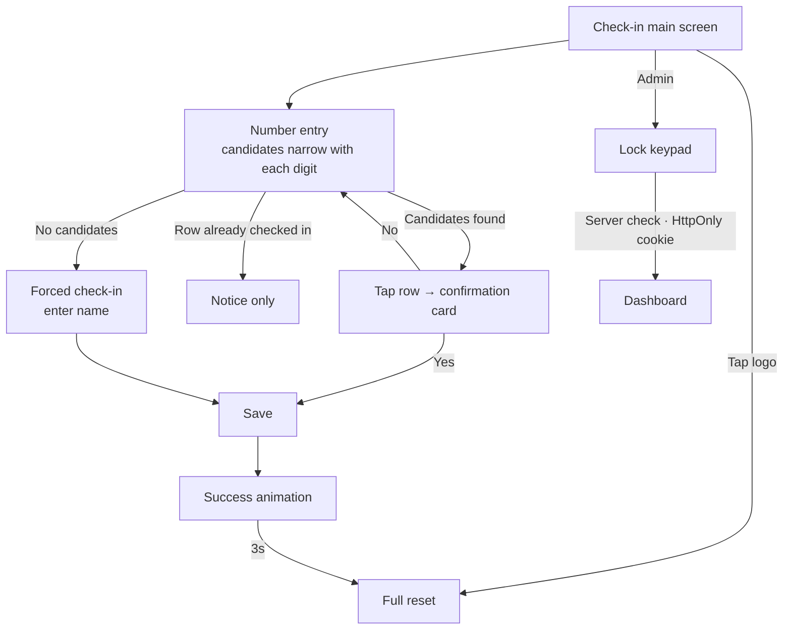

# CSCK

<p align="center"></p>

> An attendance kiosk for the shared tablet at the entrance of the 3rd Oryang Mock National Assembly, designed so that someone seeing it for the first time can check in within 3 seconds without any explanation

---

## 1. Project Overview

| Item | Details |
|---|---|
| Project | CSCK (3rd Oryang Mock National Assembly attendance check · MoGuk Attendance Check) |
| One-line Summary | Each digit of the phone number narrows down the roster, and tapping and confirming your name finishes it. The same build keeps running even with no server or a dropped network |
| Period | 2026.07.11 ~ 2026.07.20 (10 days) · for entry to the event (standing committees 07.18, plenary session 07.25) |
| Team | Solo project |
| My Role | Planning, UX design, full implementation, deployment |
| Contribution | 100% (all 16 commits in the repository are mine) |

Attendance at an event entrance is usually taken with a paper list and a pen. The line gets long, nobody knows in real time who has arrived, and the list has to be copied out again afterwards. Yet going digital often turns out slower than paper. Asking people to install an app stalls the line, requiring a login stalls it further, and handing out QR codes brings it to a complete halt at the first person who lost theirs.

The roster for this event had 133 participants and staff from three schools: Daeshin High, Dongbang High and Daejeon Foreign Language High. The design criterion was a single sentence: **someone seeing it for the first time finishes, without explanation, within 3 seconds.** Any feature that didn't serve that goal was left out.

| On-site constraint | Effect on the design |
|---|---|
| The device is shared | No login. Personal accounts can't be assumed |
| The user changes every time | There's no chance to learn. The second use can't be any faster than the first |
| There's a line | One person's delay is a delay for everyone behind them. There can be no dead ends |
| No staff member stands by | It has to work without explanation, and a wrong tap has to be reversible |
| The venue network can't be trusted | Check-in has to keep going even if the server dies |

## 2. Tech Stack

| Category | Technology | Why |
|---|---|---|
| Framework | Next.js 15 (App Router) · React 19 · TypeScript | Keeps the kiosk screen, the admin dashboard and the lock API in one project. Middleware locks the dashboard on the server |
| Data | Supabase (Postgres · Realtime) ↔ automatic switch to `localStorage` | Uses the remote DB when the environment variables are set, and browser storage when they aren't. Only one data-layer file knows about the difference |
| Styling | Hand-written CSS (design tokens · animations) | Kept runtime dependencies down to 4 (Next · React · React DOM · Supabase SDK) |
| Auth | Server route + `HttpOnly` cookie (8 hours) | The dashboard password is checked only on the server. A client-side check is visible to anyone who opens the bundle |
| Deployment | Vercel · iPad Safari "Add to Home Screen" | No app store review and no installer: a single URL becomes a full-screen kiosk |

## 3. Key Features & Contributions

<p align="center"></p>
<p align="center"><sub>Captured from a local build. The roster was replaced with 12 fictional participants. This is the state after typing "010-123"; with no server configured, the header shows an offline-mode warning.</sub></p>

### Implemented Features

- **Progressive narrowing**: It doesn't ask for the full phone number. Each digit filters the roster by prefix match, and the number of people left is shown next to the input field. Each row shows the typed digits in blue and dims the rest, so you can see why that person came up. The moment you see your own name is the moment to stop.
- **Confirmation card**: Tapping a row doesn't record anything right away; it brings up a card asking "Check in as [Name]?" The name is written in the largest type, because what needs confirming is the person, not the action.
- **Checked-in people stay in the list**: Someone who has already checked in stays listed, with their button replaced by a `출석 완료` ("Checked in") badge. If they were removed from the list, a person coming back would have no way to confirm their own record and would go looking for staff.
- **Forced check-in**: If the number isn't on the roster, the kiosk asks "Proceed anyway?", takes a name, and records it in the same store with a `forced` mark. If even the name is unknown, the entry is saved as `(이름 미입력)` ("no name entered"). The line is never blocked, and these entries can still be told apart afterwards.
- **Auto-return after 3 seconds**: Once the record is saved, a check animation and confetti play, and 3 seconds later the input, keypad and panel all close. The next person doesn't need to know how to clear the previous screen.
- **Triple protection against duplicates**: A saving-in-progress flag blocks rapid taps, the client checks whether the person has already checked in, and the violation code (`23505`) from the DB unique index (`attendance_once_idx`) is turned into an "Already checked in" message. Forced check-ins allow duplicates.
- **Touch guard**: Blocks pinch zoom, double-tap zoom, long-press copy, text selection, image dragging and tap highlights. Only the input field is exempt.
- **Admin dashboard**: Shows attendance status and a record table in real time. If both a normal and a forced check-in exist under the same name, they're shown in different colors. The dashboard is locked by middleware; the password keypad submits automatically once every digit is filled, and a wrong password makes the card shake side to side.

### Main Tasks

- UX design grounded in on-site constraints (progressive narrowing, confirmation card, forced check-in, auto-return)
- Data layer design: automatic switching between the remote DB and local storage, with zero branching at the call sites
- Redundant real-time updates (Realtime subscription + 5-second polling + 3 kinds of return-to-screen events)
- Server-side dashboard lock (middleware · server route · `HttpOnly` cookie)
- Removing the roster's personal data from the repository (Troubleshooting ② below)

## 4. Results & Metrics

### Quantitative Results

| Item | Result |
|---|---|
| Scope | 133 people on the roster (participants and staff, 3 schools) |
| Input | Instead of the full phone number (8 digits), type only until one candidate is left |
| Screens | 3 (kiosk · lock · dashboard), 1,140 lines of code |
| Runtime dependencies | 4 |
| Real-time updates | Subscription + 5-second polling + 3 kinds of return events |
| Actual check-ins · forced check-in ratio · time per person | (to be confirmed) |

"Done within 3 seconds" is a design goal, not a value measured on site.

### Qualitative Results

- Once I assumed users who can't learn, tutorials, settings and remembered state all became unnecessary. All that's left is what's on the screen right now, and I made sure that alone is enough to finish.
- Isolating the data layer in a single file meant I could rehearse on a laptop with no internet the day before the event, and finish the screens before the server setup was done.
- The fallback state isn't hidden. In local storage mode, the header shows a warning. If records were quietly saved locally, staff would believe they were piling up on the server and only find out after the event.
- Over the revisions, the same elements that looked slightly different from screen to screen were unified (07.18, 207 lines added · 236 lines deleted). On a kiosk, when the same thing looks different, users read it as something different.

### Known Limitations (as of the 2026.09 code)

- **The roster can still be exposed in the browser.** The fallback roster was moved to the `NEXT_PUBLIC_ROSTER_JSON` environment variable, but `NEXT_PUBLIC_` values are baked into the client bundle at build time. On the remote DB side, the roster table was also left readable with the anonymous key so prefix search could run in the browser (`anon can read roster ... using (true)`). The anonymous key is in the bundle, so anyone can query the roster, phone numbers included. Search should move into a server function that returns only masked numbers. The roster also remains in the private repository's history.
- **The dashboard's default password is written in the code and the README.** If the environment variable isn't set, the dashboard opens with that value. The cookie token is also just the SHA-256 of the password, so every admin shares the same token and none can be cut off individually.
- **Standard PWA requirements aren't met.** There's no web manifest or service worker, so the first load needs a network connection, and offline operation is limited to the record-saving fallback.
- **Landscape large screens only.** With a minimum width of 1024px, the layout doesn't work on portrait tablets or phones.
- **Blocking zoom is a trade-off against accessibility.** Zoom was blocked to make it feel like a kiosk, which conflicts with the needs of low-vision users.
- **There's no screen for editing records.** Wrong entries have to be deleted from the DB console, and there's no screen for turning a forced check-in into a normal record either.

## 5. Troubleshooting

### ① The dashboard silently freezes when the network wobbles

**Problem** The admin dashboard gets new check-ins instantly through a Realtime subscription. But if the venue network drops for a moment, or the tablet screen turns off and back on, the subscription is cut while the screen still looks perfectly fine. Staff assume nobody is coming in.

**Cause** A cut subscription doesn't surface any error on screen. On a kiosk tablet, the screen turning off and on is part of normal operation, so this happens often.

**Solution** I layered the update paths. Separately from the subscription, the dashboard polls every 5 seconds and re-reads immediately when the tab becomes visible again, when the window gets focus, and when the device comes back online. So that polling doesn't redraw the screen every few seconds, the received records are serialized and the state is left alone if they match the previous value.

**Result** The screen is up to date instantly if the subscription is alive, within 5 seconds if it's dead, and right away when the screen turns back on. If nothing has changed, the screen stays as it is.

### ② 133 participants' phone numbers were in the repository

**Problem** The first version put the roster in code in two places: the seed SQL (`supabase/seed.sql`) and the fallback `lib/roster.ts`. Both held 133 names and phone numbers. The point was to let the demo run without any server setup, but anyone who opened the repository could see the participants' contact details.

**Cause** I applied the goal "the same build runs even without a server" to the roster data as well. Keeping screen code and data in the same repository blurred the line between code and personal data.

**Solution** I removed it in two steps. On 07.13 I deleted the seed SQL and schema files from the repository, and on 07.20 I deleted `roster.ts` and changed the roster to be read from a deployment environment variable. The roster is now injected from outside the repository.

**Result** The current code contains no personal data. However, as noted under "Known Limitations" above, that environment variable is client-side, and the repository history and the DB read policy are still there, so the complete fix is to move roster search to the server and clean up the history.

### ③ Keeping "tap outside to close" from turning into "tap anywhere to close"

**Problem** The keypad closes when you tap outside it, so nobody has to hunt for a close button. But when the outside tap was caught on the whole document, the keypad also closed on a tap on a name in the list or on the confirmation card, and the tap the user actually meant didn't register.

**Cause** The "outside tap" handler attached to the whole document also received taps inside the list, the card and the keypad, because events propagate outward from the inner element.

**Solution** Taps inside the list, the confirmation card and the keypad each stop propagation, so the keypad closes only when something truly outside is tapped. The touch guard follows the same principle: the copy menu and text selection are blocked globally, but the input field is explicitly exempted. Just locking everything globally would make it impossible to type a name.

**Result** The keypad closes when you tap an empty area, and the list and cards respond normally.

## 6. Links & Deliverables

| Category | Link |
|---|---|
| GitHub Repository | [stx4R/CSCK](https://github.com/stx4R/CSCK) (private) |
| Live URL | https://csck.vercel.app |

<p align="center"></p>

### Screen Flow



Data layer:

```
                                   ┌─ env vars set → Supabase (remote tables · subscription + polling)
Screen code ──→ lib/attendance.ts ─┤
                                   └─ env vars not set → localStorage (storage events + polling) + header warning
```

---

+++

## Customer Journey Map

| Stage | What the user does | What the user thinks | How the kiosk responds |
|---|---|---|---|
| Arrival | Waits in line and steps up to the tablet | "What am I supposed to do?" | The first line on the screen is just "Enter your phone number." |
| Input | Starts typing the number | "Do I have to type all of it?" | Candidates shrink with every digit and the number left is shown. They stop once they see their name |
| Selection | Taps their name | "What if I tapped the wrong one?" | A confirmation card with the name in large type appears |
| Exception | Is told they're not on the roster | "But I signed up!" | Forced check-in takes just a name and lets them through |
| Done | Sees the check animation | "Did it work?" | An exaggerated success animation gives certainty. After 3 seconds it goes back to the screen for the next person |
| Double-check | Comes back and types the number again | "Did I actually do it?" | The `출석 완료` badge is still there |

## Adaptive & Predictive Design

- **Adaptive**: The screen is designed as a fixed layout for a landscape iPad (minimum width 1024px). Because it targets a single kind of shared device, the layout doesn't fall apart with window size.
- **Predictive**: The screen doesn't decide for users how many digits they need to type. Showing the number of remaining candidates and the highlighted digits lets them see for themselves when to stop. The automatic reset after a success is also designed around what comes next: "the next person takes over this screen."

## Gesturing

- The only input is tapping the on-screen keypad. Every default browser gesture that breaks a kiosk (pinch zoom, double-tap zoom, long-press copy, image dragging) is blocked. A screen left zoomed in can't be put back by the next user, and if a double tap is read as a zoom, rapid taps get swallowed.
- The keypad closes when you tap outside it, and a failure on the lock screen is communicated by the card shaking side to side. You know it failed without reading a word.

## Motion Design

- On success, a check animation plays and 36 pieces of confetti fall. If the screen just quietly went back to the list, users wouldn't be sure their input had registered and would tap again. Exaggerated feedback isn't decoration; it's there to prevent retries.
- The lock keypad shakes side to side and clears the input when the password is wrong.

## Security Risk Management (DREAD)

| Threat | Damage | Reproducibility | Exploitability | Affected Users | Discoverability | Assessment |
|---|---|---|---|---|---|---|
| Reading the entire roster (phone numbers) with the anonymous key | High | High | High | 133 people | Medium | Top priority. Move search into a server function and close anonymous reads on the roster table |
| `NEXT_PUBLIC_` roster included in the bundle | High | High | Medium | 133 people | Medium | Replace the fallback roster with an empty roster + manual entry |
| Roster left in the repository history | High | Low | Medium | 133 people | Low | Clean up the history (exposure is limited to people with repository access) |
| Dashboard opens with the default password | Medium | High | High | Admins | High | Change it so the dashboard stays fully locked when the environment variable isn't set |
| Arbitrary attendance records inserted with the anonymous key | Medium | High | Medium | Event records | Medium | Narrow inserts down to an RPC and match against the roster on the server |

The first three items, with the largest damage and reach, are all about the roster's personal data. Deleting records was blocked for the anonymous key from the start (resets only through the service role), and the policy was opened only when needed on event day.
