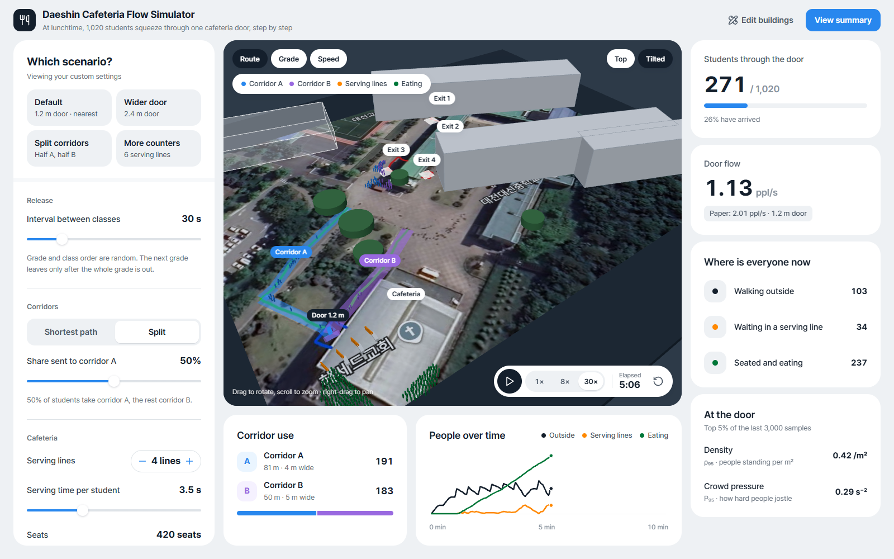
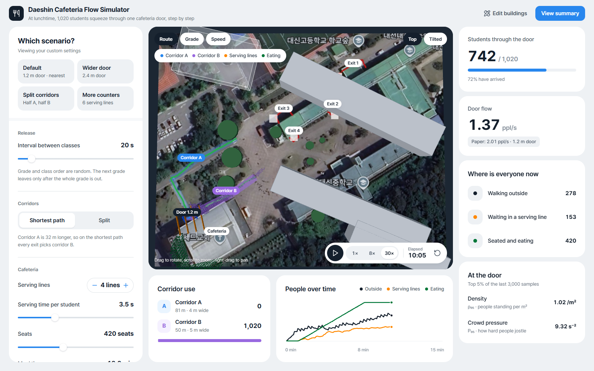
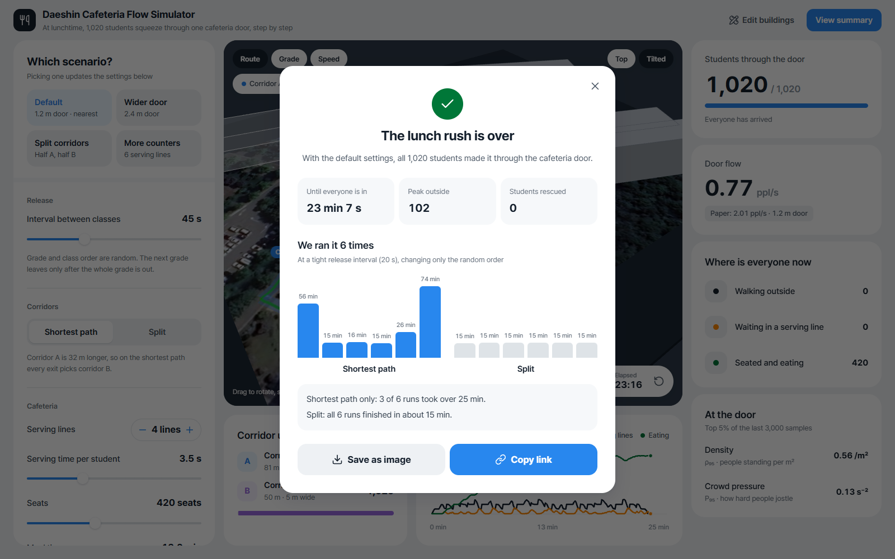
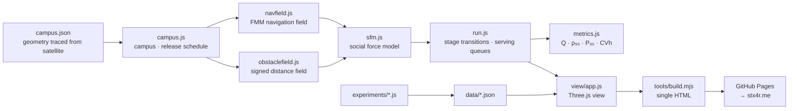

# CafeteriaSimulator

<p align="center"></p>

> A crowd simulator that re-implements the social force model used in the Samsung HumanTech paper in JavaScript, reproduces the paper's baseline, and then scales it up to the whole Daejeon Daeshin High School campus to compute the lunchtime rush of 1,020 students through a single cafeteria door

---

## 1. Project Overview

| Item | Details |
|---|---|
| Project name | CafeteriaSimulator (web edition: "Daeshin Cafeteria Flow Simulator", commit shorthand CafSim) |
| One-line summary | Instead of the "obstacle in front of the door" the paper varied, it varies two things the school can change without construction, the release interval between classes and how students are split between corridors, and computes the bottleneck at the cafeteria door |
| Period | 2026.09.10 – 2026.10.03 (v1.0.0 → v1.1.4) · 09.10 simulation core and experiments · 10.03 web deployment and UI overhaul |
| Team size | Solo project |
| My role | Social force model and navigation field, paper baseline replication and constant calibration, campus geometry tracing, experiment design, 3D web app development and deployment |
| Contribution | 100% (all 9 commits in the repository are mine) |

The Samsung HumanTech paper "An Analysis of the Flow-Stabilising Effect of an Obstacle in Front of a School Cafeteria Bottleneck from a Crowd-Fluid Perspective" (「군중 유체 관점에서 분석한 학교 급식실 병목부 전방 장애물의 흐름 안정화 효과 분석」) used MATLAB to put 60 people into a 6.0 m wide approach that narrows to a 1.2 m doorway, and looked at how the flow changes when a cylindrical obstacle is placed in front of the door. It varied the obstacle's size, distance and position but found no arrangement that improved throughput and safety at the same time.

This repository is the paper's supplement. First, I implemented the same model from scratch in JavaScript and reproduced the paper's no-obstacle baseline from Table 1. Then I moved the stage to the real campus. Students leave four building exits, cross the plaza, take one of two corridors, go through the single cafeteria door, and continue to the serving lines and seats. The variables are no longer obstacles but the release interval between classes and the corridor split, both of which the school can set by rule alone.

## 2. Tech Stack

| Category | Technology | Why |
|---|---|---|
| Crowd physics | Helbing–Farkas–Vicsek social force model written in Vanilla JavaScript (spatial-hash neighbour search, semi-implicit Euler integration) | It has to be the same model as the paper's for the baseline to be comparable |
| Pathfinding | Eikonal equation solved with the Fast Marching Method (FMM) | 8-neighbour Dijkstra has about 8% direction error, which skews walking directions near a bottleneck. FMM stays under 1% |
| Walls | Signed distance field and normals built from the blocked grid (Felzenszwalb–Huttenlocher distance transform) | At campus scale, looping over wall segments for every pedestrian took most of the step cost. With a distance field it is two array reads |
| Cafeteria interior | Queueing model (serving lines + seat dwell time) | The question indoors is "which binds, the door or the counters?". A force model would only add contact noise to that |
| Rendering | Three.js r160 + satellite ground texture | Shows the campus in 3D while keeping the physics separate |
| Build · deploy | Node build script bundling a single HTML file (about 1.0 MB) → GitHub Actions → GitHub Pages, proxied by the stx4r.me Cloudflare Worker | Three.js, the core, the geometry and the ground texture are all inlined, so the page still opens as one file weeks later |
| Experiments | 4 Node scripts (`replicate` · `calibrate` · `sweep` · `bimodal`) | A seeded PRNG (mulberry32) makes every run reproducible |

## 3. Key Features & Contributions

<p align="center"></p>
<p align="center">
  
  </p>
<p align="center"><sub>Captured from a local build. Top: split corridors with a 30 s release interval, at 5 minutes (191 on corridor A, 183 on corridor B). Bottom left: 20 s interval on the shortest path, seen from above at 10 minutes (all 1,020 crowd into corridor B and crowd pressure P₉₅ at the door reaches 9.32). Bottom right: result summary with default settings (23 min 7 s, bars of the 6 repeat runs)</sub></p>

### Implemented Features

- **3D campus view**: buildings, flower beds, both corridors and the door sit on a satellite image, and 1,020 students move across it. Colour by route, grade or speed, and switch between a top view and a tilted view.
- **4 scenario presets**: Default (1.2 m door · shortest path) · Wider door (2.4 m) · Split corridors (half A, half B) · More counters (6 lines).
- **Setting sliders**: release interval between classes, route policy (shortest / split) and the share sent to corridor A, number of serving lines, serving time per student, seats, meal time, door width. Changing the door width recomputes the route map.
- **Live dashboard**: students through the door, door flow (next to the paper's 2.01 people/s), where everyone is (outside · serving line · eating), density ρ₉₅ and crowd pressure P₉₅ at the door, people over time, and use per corridor.
- **Result summary**: time until everyone is in, peak number outside and students rescued, plus bars of 6 precomputed repeat runs. It can be saved as an image, and the settings live in the URL so a link shares the exact conditions (`?hw=45&route=split&a=50…`).
- **Jam detection**: if, after every class has left, fewer than 10 people pass the door in 600 s, the run ends with "The door is jammed" and shows how many are left.
- **Geometry editing**: edit `campus.json` inside the app and apply it. Values read straight off the satellite image and values estimated from a low-resolution image are shown separately.

### Model Structure and Key Formulas

```
m dv/dt = m (v₀e − v)/τ + Σ f_ij + Σ f_iW
f_ij = [ A·exp((r_ij − d_ij)/B) + k·g(r_ij − d_ij) ] n_ij + κ·g(r_ij − d_ij)·(Δv_ji · t_ij) t_ij
e = −∇T/|∇T|,   |∇T| = 1   (eikonal, FMM)
ρ = N/A,   Q = (N − 1)/(t_N − t_1),   CV_h = s_h / h̄,   P = ρ·Var(v)
```

Pedestrian values follow the paper exactly (r 0.23 m, m 75 kg, v₀ 1.34 ± 0.12 m/s, τ 0.5 s, dt 0.03 s). The force constants the paper does not state were set by calibration (A 3000 N, B 0.055 m, approach 8.0 m). In a campus run, each pedestrian goes through six stages.

| Stage | What happens | Model |
|---|---|---|
| 0 | From the exit to the mouth of the assigned corridor | Social force |
| 1 | Along the corridor to the cafeteria door | Social force |
| 2 | Waiting in the shortest serving line | Queueing |
| 3 | Being served (3.5 s × 0.75–1.25) | Queueing |
| 4 | Eating (780 s × 0.8–1.2) | Dwell |
| 5 | Leaving | — |

### Main Tasks

- Implemented the social force model, spatial hash and integrator from scratch, and rebuilt the paper's scenario (6.0 m → 1.2 m, 60 people)
- Reproduced the paper's Table 1 baseline and grid-scanned the constants the paper leaves out
- Traced the campus geometry on a satellite image (Google Earth 60 m scale bar = 372 px → 0.1613 m/px, cross-checked against the 2.3 m parking-stall pitch = 14.46 px)
- Designed the release interval × corridor split experiment, and ran every seed separately for the conditions that diverge
- 3D app in Three.js, single-HTML build, automatic GitHub Pages deployment

## 4. Results & Metrics

### Quantitative Results

**Paper baseline replication** (no obstacle, 10 seeds, re-run 2026.10)

| Metric | Simulation | Paper Table 1 | Difference | 95% CI |
|---|---|---|---|---|
| Flow Q (people/s) | 1.979 ± 0.061 | 2.008 ± 0.040 | −1.5% | Overlap |
| Density ρ₉₅ (people/m²) | 2.870 ± 0.074 | 3.017 ± 0.014 | −4.9% | No overlap |
| Headway variation CV_h | 0.542 ± 0.035 | 0.612 ± 0.032 | −11.5% | No overlap |
| Pressure P₉₅ (s⁻², zone average) | 0.934 | 1.431 ± 0.047 | −34.7% | Different definition |
| Pressure P₉₅ (s⁻², local field) | 1.803 ± 0.063 | 1.431 ± 0.047 | +26.0% | Different definition |

With the default constants before calibration (A 2000 N, B 0.08 m), Q was off by −15.5% and CV_h by +26.5%.

**Release interval × corridor split** (mean of 3 seeds, `data/sweep.json`)

| Release interval | Route | Door flow Q (people/s) | Headway CV_h | P₉₅ (s⁻²) | Until last serving (s) | Peak outside |
|---|---|---|---|---|---|---|
| 20 s | Shortest | 0.886 | 8.27 | 8.40 | 1,749 ± 1,577 | 300 |
| 20 s | A 30% | 0.912 | 7.17 | 7.76 | 1,317 ± 632 | 295 |
| 20 s | **A 50%** | **1.211** | **1.34** | 8.52 | **916 ± 9** | 291 |
| 30 s | Shortest | 1.116 | 3.09 | 0.11 | 982 ± 30 | 136 |
| 30 s | A 30% | 1.095 | 2.10 | 0.22 | 997 ± 17 | 137 |
| 30 s | A 50% | 1.104 | 1.94 | 0.24 | 997 ± 29 | 139 |
| 45 s | Shortest | 0.752 | 3.71 | 0.08 | 1,427 ± 31 | 102 |
| 45 s | A 30% | 0.746 | 2.82 | 0.17 | 1,431 ± 25 | 102 |
| 45 s | A 50% | 0.747 | 2.64 | 0.19 | 1,434 ± 24 | 103 |

On the shortest path, corridor A is 32 m longer, so all four exits use corridor B (A share 0%).

**20 s release interval, all 6 seeds** (`data/bimodal.json`)

| Route | Until last serving (s), seeds 1–6 | Range |
|---|---|---|
| Shortest | 3,358 · 921 · 968 · 906 · 1,577 · 4,415 | 906 – 4,415 |
| A 50% | 906 · 920 · 921 · 920 · 921 · 922 | 906 – 922 |

| Item | Result |
|---|---|
| Size | 1,765 lines of core and experiment JS, 1,037 lines of app JS + 574 lines of HTML/CSS |
| Build output | `dist/simulator.html` 1.0 MB |
| Comparison with real cafeteria measurements | (to be confirmed) |
| Paper review result | (to be confirmed) |

### Qualitative Results

- **Narrowed down what the paper left unstated, using data.** The force constants and approach length control packing density, yet the paper gives neither. Instead of assuming them, I grid-scanned for the combination closest to Table 1, and that result doubles as an estimate of "the setup the paper actually used".
- **Exposed a definitional gap in the pressure metric.** The paper defines ρ as a zone average but cites Helbing (2007) for P. Computing both gives 0.934 for the zone average and 1.803 for the local field, and the published 1.431 sits between them. Comparing P₉₅ means agreeing on the definition first.
- **Splitting the corridors pays off in the tail, not the mean.** At 30 and 45 s intervals, the last serving time is nearly identical (982 vs 997 s, 1,427 vs 1,434 s). The difference only shows at the tight 20 s interval. On the shortest path, 3 of 6 runs went past 25 minutes; split half and half, all 6 finished between 15 min 6 s and 15 min 22 s. Crowd pressure P₉₅ at the door, though, is about the same at 8.40 and 8.52. Splitting does not make the door less crowded. It only removes the cases where the jam locks up.
- **Chose variables that can actually change.** The paper's obstacle needs construction work. The release interval and the corridor split can be changed with a guidance rule.

### Known Limitations

- **Only Q falls inside the confidence interval.** ρ₉₅ is −4.9% and CV_h is −11.5%, both outside. The repository README says the errors are within 2.4 / 6.8 / 6.5%, but re-running the current code gives an 11.5% error for CV_h. Running `calibrate.js` now picks an approach of 6.5 m and B 0.05 m, which also differs from the 8.0 m and 0.055 m in `calibration.json`. B 0.055 is not even on the scan grid (0.05 / 0.08 / 0.12 / 0.16), so where the calibrated values came from needs checking.
- **Building outlines are the weakest input.** The exits, both corridors and the door were read directly off an annotated satellite image and are reliable. Building outlines, the sports-field edge and corridor widths were estimated from a low-resolution image. The 1.2 m door width was not measured; it is the paper's W.
- **Cafeteria interior values are literature defaults.** 4 serving lines, 3.5 s per student, 420 seats and a 13-minute meal all need to be replaced with measurements.
- **The social force model cannot clear a locked jam by itself.** Once an arch forms at the door, it stays. So anyone stuck alone for a long time is moved inside, and that count is reported in the results. At the 20 s interval it came to 1–4 people per run.
- **The 100 teachers do not move yet.** `campus.json` has a teacher count and pedestrian capacity is reserved for them, but a run only counts the 1,020 students.
- **The sweep data is partial.** `sweep.js` also defines 60 and 90 s intervals, but `data/sweep.json` only contains 20, 30 and 45 s. Each condition also has only 3 seeds.

## 5. Troubleshooting

### ① The baseline did not match because of constants the paper never gives

**Problem** Even with the paper's scenario copied exactly, running with Helbing's default constants (A 2000 N, B 0.08 m) gives a flow Q of 1.697 people/s, 15.5% below the paper, and a headway variation CV_h 26.5% above it.

**Cause** The paper states the radius, mass, desired speed, relaxation time, time step, door width and approach width, but not the force constants A and B or the approach length. Those three set the packing density at the door, and density moves all four metrics.

**Fix** Rather than assume one value, I scanned. 4 approach lengths × 3 values of A × 4 values of B, 48 combinations, each run on 5 seeds and ranked by how many metrics landed inside the paper's confidence interval and by normalised error. Because pressure P is ambiguously defined, I recorded it both as a zone average and as a local field.

**Result** At A 3000 N, B 0.055 m and an 8.0 m approach, the Q error dropped to −1.5%. ρ₉₅ and CV_h still stayed outside the confidence interval (see Known Limitations).

### ② Releasing a whole class of 34 at once trapped an entire exit

**Problem** When a class left, putting all 34 students into the spawn box in front of the exit at the same moment froze everyone assigned to that exit.

**Cause** The density inside the box reached about 7 people/m², and the contact forces could not resolve the overlap. In reality 34 students file out of one classroom door, so spawning them all at once is a starting state that could never happen physically.

**Fix** A released class goes into a queue, and each exit lets out 2 people per second. Each one needs a spot at least 0.6 m from anyone else; up to 12 spots are tried, and if none is free the student waits for the next step.

**Result** Over 18 runs at 30 and 45 s intervals, 0 people were stranded and completion was 1.000.

### ③ Telling a person waiting in line from a person who is wedged

**Problem** A few people got wedged against the wall where the streams merge at the door and never arrived. That makes the completion metric meaningless.

**Cause** In one corner the corridor's navigation gradient points into the building, so anyone who ends up there stops while pushing on the wall. But someone queueing in front of the door is just as still. Speed alone cannot tell them apart.

**Fix** Neighbours decide. If 3 or more other pedestrians are within 2.5 m, the person counts as queueing and is left alone. Only someone who has been stopped alone for more than 120 s is moved through the door, and that count is reported as "students rescued" in the results. If that number is not small, I read it as a sign that the geometry is wrong, not the crowd. Inside the model too, anyone stopped for more than 15 s gets a small push in a random direction so they shuffle.

**Result** At 30 and 45 s intervals, 0 students were rescued; at 20 s it was 1–4 per run.

### ④ A ±1,577 s confidence interval was not noise

**Problem** At a 20 s interval on the shortest path, the last serving time came out as 1,749 ± 1,577 s. The spread was so wide the mean meant nothing.

**Cause** The outcome splits two ways. Either the run finishes in about 15 minutes, or a jam forms where the streams merge at the door, never recovers and drags on for thousands of seconds. A mean of 3 seeds blends the two modes.

**Fix** Instead of averaging, I wrote a separate experiment (`bimodal.js`) that runs all 6 seeds and reports each one. The app's result screen shows those 6 bars as they are.

**Result** The shortest path ranged from 906 to 4,415 s, the half-and-half split from 906 to 922 s. The conclusion changed from "splitting lowers the mean" to "splitting removes the jam tail".

### ⑤ A jammed run never reached the result screen

**Problem** The web app opened the result screen only once everyone had passed the door. In jammed conditions that moment never came, and the screen stayed on "still moving".

**Cause** The only completion check was "everyone through". As ④ showed, this model cannot clear a locked jam by itself, so some runs never end.

**Fix** In v1.1.3 the result state became three: running, done and jammed. If every class has left but fewer than 10 people passed the door in the last 600 s, the run is judged jammed. A jammed run switches to an orange warning icon, shows how many are left at the door, and says "Under these conditions the model can't clear the jam by itself".

**Result** The result screen opens for any setting. Even when jammed, the run ends with the title "The door is jammed" and the number of students left at the door.

## 6. Links & Deliverables

| Category | Link |
|---|---|
| GitHub repository | [stx4R/CafeteriaSimulator](https://github.com/stx4R/CafeteriaSimulator) (private) |
| Live URL | https://stx4r.me/project/CafeteriaSimulator/ |
| Reproducing the experiments | `node experiments/replicate.js` · `calibrate.js` · `sweep.js` · `bimodal.js` |
| Build | `node tools/build.mjs` → `dist/simulator.html` |
| Original paper | "An Analysis of the Flow-Stabilising Effect of an Obstacle in Front of a School Cafeteria Bottleneck from a Crowd-Fluid Perspective" (Samsung HumanTech paper) |

### Structure



---

+++

## Customer Journey Map

The user is a teacher or student council member deciding how lunch traffic should flow.

| Stage | What the user does | What the user thinks | How the tool responds |
|---|---|---|---|
| Explore | Plays the default settings as they are | "How crowded does it get outside at lunch?" | Over 23 min 7 s, up to 102 people are outside, and door flow appears next to the paper's 2.01 people/s |
| Discover | Looks at the corridor use card | "Why is nobody using corridor A?" | A note explains that corridor A is 32 m longer, so every exit picks B |
| Compare | Cuts the release interval to 20 s and runs again | "Sending them faster should finish faster, right?" | People pile up at the door and crowd pressure goes past 9 |
| Confirm | Checks the 6 repeat-run bars in the result summary | "Wasn't that one jam just bad luck?" | Shortest path: 15–74 minutes; split: all 6 runs around 15 minutes |
| Share | Presses Copy link | "I'll show these exact conditions at the meeting" | A URL carrying the settings is copied |

## Gesturing

- Drag the 3D view to rotate, scroll to zoom, and right-drag to pan.
- One chip switches between the top view and the tilted view, and the camera moves smoothly between them.

## Adaptive Design

- On wide screens, settings · map · dashboard sit in three columns.
- At 1,279 px wide or less, settings and map form two columns and the dashboard drops below them as a one-row grid.
- At 899 px or less, everything stacks into one column in the order map (62% of the screen height) → dashboard → settings. The legend, chips and play bar over the map are repositioned so they do not overlap.
- For users who turn on reduced motion, transitions are switched off.
