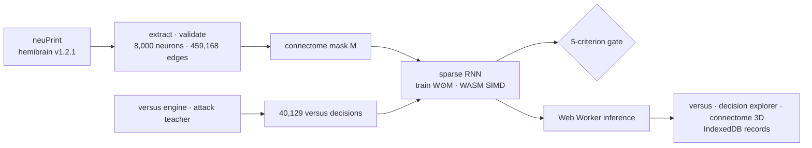

# Fly

> A research project that taught Tetris versus play to a network constrained by the wiring of the fruit fly brain connectome (hemibrain), then put the result on the web so anyone can play against it

---

## 1. Project Overview

| Item | Details |
|---|---|
| Project | Fly (VFB-Tetris) |
| One-line Summary | Used the wiring of 8,000 fruit fly neurons and 459,168 connections as a sparsity mask and trained the weights on top of it to get a Tetris versus policy. It missed the gate, and I deployed a versus site that shows the missed result as it is |
| Period | 2026.09.15 ~ 2026.09.24 (v0.1.0 → v0.13.6, 26 commits) |
| Team | Solo project |
| My Role | Research design, data extraction, simulation and training code, experiments and evaluation, web implementation and deployment |
| Contribution | 100% |

The starting question was "could a real fruit fly's brain wiring be of any use for playing Tetris?" At first I built a reservoir (a spiking neural network) that used the connectome's synapse counts directly as fixed weights. Through stage 5 the results were negative, so at stage 6 I changed the claim: from the connectome I take only "which neuron connects to which," and the weights are learned. Nowhere in the report or on the site do I say that "a fruit fly learned Tetris."

| Stage | Details | Result |
|---|---|---|
| 1 | Extracted hemibrain v1.2.1 from neuPrint (input LC/LPLC · intermediate layer · output DN) | 8,000 neurons · 459,168 edges |
| 2–3 | Spiking reservoir (LIF) + calibration | 0/1200 passed within the spec range, probe gate missed |
| 4–5 | afterstate evaluation, comparison with 6 null models | Tells candidates apart but carries no ranking information (τ ≤ 0.075) |
| 6 | Versus engine · attack-oriented teacher · ranking loss check | The cause was the expressiveness of fixed weights, not the loss |
| 7 | Weight training on the connectome mask (A → A-2 → A-3 → A-4′) | Ranking metrics passed, play gates missed |
| 8 | Real-time human vs. fruit fly versus site | Deployed |

## 2. Tech Stack

| Category | Technology | Why |
|---|---|---|
| Data | neuPrint Cypher API (hemibrain v1.2.1) | Serves the fruit fly hemibrain connectome down to neuron type, ROI and synapse count. Responses are cached locally |
| Simulation · training | Node.js (ES modules), `node:test`, worker_threads | Sparse RNN, BPTT, Adam and DAgger implemented by hand with no ML library. The same code also runs inference in the browser |
| Kernel | WebAssembly SIMD (f64x2) | Eases the memory bandwidth bottleneck when 12 workers read the weights at once. The binary was assembled by hand, without external tools |
| Web | Vanilla JS hash router, three.js, esbuild, Web Worker, IndexedDB | Ties 10 screens into one app. Fruit fly inference runs in a worker, and match records never leave the browser |
| Design | Toss design system tokens, self-hosted Pretendard | Runs from the bundle alone (7.3 MB), with no external requests |
| Deployment | GitHub Pages (`gh-pages` branch) | A static site is enough |

## 3. Key Features & Contributions

Captured from the deployed site. The human is on the left, the trained C0 model on the right, playing on the same engine with the same piece sequence. KEYS·LOG on the right work backward from the placement the fly chose to the button inputs that produce it

### Connectome Extraction (Stage 1)

- The input layer is visual projection neurons (LC·LPLC) and the output layer is descending neurons (DN). Neurons with similar names but different roles (LCNO are central complex neurons, DN1~3 are circadian clock neurons) were excluded.
- The intermediate layer is made up of neurons within 2 hops of the input and within 2 hops of the output. Only edges with 3 or more synapses were kept, and when the count went over 8,000 neurons it was cut by total synapse count.
- Each neuron was tagged with a primary ROI (brain region). Of the 8,000, 3 are null, and there are 44 regions in total.

### Fixed-Weight Reservoir (Stages 2–5)

- Event-driven LIF neurons (dt 1 ms), spike frequency adaptation (SFA), ROI-level local inhibition, deterministic random numbers (xorshift128+).
- The board is turned into current through a Gaussian receptive field for each input neuron, and the action is chosen from the spike counts of the 107 DNs.
- Compared against 6 null models (degree-preserving rewiring, weight permutation, layer-block random graph, Kenyon cell removal, direct edge removal, activity-level control).

### Versus Engine and Teacher (Stage 6)

- Implemented the guideline rules at the placement level: hold, next 5, garbage queue and cancellation, combos, T-spins (3-corner + reachable positions found with BFS), and perfect clears.
- The attack-oriented teacher uses 11 features and beam search, tuned with CEM. Median attack over 1000 pieces is 377, with 100% survival.
- Collected 40,129 versus decisions (1.70 M candidates) from teacher play. Split 60/20/20 by game and checked for leakage.

### Wiring-Constrained Learning (Stage 7)

- Model: a rate RNN `x(t+1) = (1−lr)x + lr·tanh((W⊙M)x + W_in·u + b)`. M is the connectome adjacency mask and stays fixed; W is trained only where the mask has an entry. 1,067,041 parameters.
- Training: a pairwise loss comparing the teacher's move with 7 negative candidates per decision, BPTT (T 25), AdamW, dropout, DAgger. Evaluation always uses the full candidate set.
- Controls: a dense MLP with the same parameter count (D0) and 3 wiring nulls (degree-preserving rewiring · uniform random · input/output placement permutation). The three nulls have exactly the same neuron, edge and parameter counts as C0.

### Versus Site (Stage 8)

Decision explorer. The window-averaged responses of the 107 DNs (center) when the 51 candidates for one move are fed into the network, and a bump chart linking the model ranking to the teacher ranking (right)

- **Versus**: The human plays with the keyboard; the fly moves every 150 ms. Inference runs once per piece, asynchronously in a worker.
- **Screens fed by matches**: match history, connectome 3D (a stratified sample of 907 neurons · 5,963 synapses, lit by activation strength), decision explorer, neural activity raster, play analysis. If no game has been played yet, they draw an empty state instead of making up values.
- **Screens with offline measurements**: home (5 gate criteria), experiments, condition comparison. The slots for the 3 nulls that haven't been trained yet are left blank as "not trained yet."
- On mobile the sidebar collapses into a top bar. It respects reduced-motion, and without WebGL every screen except the 3D one still works.

### Main Tasks

- neuPrint extraction and validation pipeline, neuron layer classification and ROI tagging
- Hand-written LIF reservoir, ESN, sparse RNN, BPTT, Adam and DAgger; WASM SIMD kernel
- Experiment design and gate evaluation, bootstrap 95% CI, 6 stage documents (`docs/`)
- Experiment budget estimator (measured unit cost × planned axes; suggests which axes to trim when a plan exceeds 8 hours)
- 10-screen versus site, lightweight 3D fruit fly model (Blender script), GitHub Pages deployment

## 4. Results & Metrics

### Quantitative Results

Condition comparison. Play metrics put the fly, the teacher and random side by side; ranking metrics put before training, after training and chance side by side

**Final model C0 (stage 7 A-4′; test set of 1,453 decisions · 40.6 candidates on average; play over 20 games × 1000 pieces · with garbage injection)**

| Metric | Before training | After training [95% CI] | Teacher | Gate |
|---|---|---|---|---|
| Match with teacher's best (top-1) | 23.2% | **46.1%** [43.6, 48.8] | — | — |
| Relative regret (lower is better) | 0.268 | **0.085** [0.077, 0.092] | 0 | ≤ 0.10 passed |
| Median pieces placed | — | 178.5 [134.5, 270.5] | 1000 | ≥ 700 **missed** |
| Median attack | — | 20 [15.5, 49] | 319.5 | ≥ 191.7 **missed** |
| Median Tetrises per game | — | 1 [0, 2] | 41.5 | ≥ 1 passed |

It passed 3 of the 5 gates (the one not in the table is the share of games lost to garbage ≤ 50%; measured at 50%). Its ability to rank moves doubled compared with before training, but its ability to survive a game reached only 18% of the teacher's. Phase B (the wiring null comparison) was conditional on passing the gates, so it was held back; when I changed direction to build the versus site first, it was stopped partway through N1 training (round 0, epoch 10/15).

| Item | Result |
|---|---|
| Unit tests | `npm test` 151/151 passed (re-run 2026.09) |
| Stage 6 cause isolation | On the same reservoir features, switching the loss from mse → listwise changes τ by −0.011. The same loss on the raw board gives τ 0.31 |
| Dense MLP control (D0, Phase A pilot) | With the same parameter count and protocol: top-1 35.6%, 80 pieces, failing the same way. It failed even without the wiring mask, so the miss at that point came from the training setup |
| Learned weights | Correlation of 0.537 with the connectome initial values; 46.9% of edges became inhibitory (0% initially). Input→intermediate moved furthest from the initial values (correlation 0.14); intermediate-to-intermediate was 0.36 |
| WASM SIMD kernel | BPTT per decision 325–423 ms → 199–223 ms (×1.6–1.9); results differ from the JS kernel by ≤ 1e-18 |
| Node ↔ browser inference agreement | Max difference 1.42e-14 |
| Deployment | https://stx4r.github.io/Fly/ (200 response confirmed) |
| Users · visits | (to be confirmed) |

### Qualitative Results

- **Used negative results as grounds for changing the claim.** Before moving to "constrain only the wiring, learn the weights," I checked whether the fixed-weight reservoir failed because of the loss or because of its expressiveness. The earlier stage documents weren't deleted; they remain as chapters of evidence.
- **Every judgment had a pre-set gate and a CI.** So that criteria couldn't be adjusted after seeing results, I fixed them first at every stage. On a miss I stopped and documented the cause and the next axis to try.
- **The site doesn't hide failure.** The home screen shows gates 3/5 right up front, and the untrained controls are left blank.

### Known Limitations

- **Play gates missed.** All 20 games died before 1000 pieces, with a median of 19 holes at death. Because the model learns by imitating the teacher one move at a time, it's weak at long-horizon patterns like keeping a well open. The median run of moves that keep the well is 6 for the teacher and 2 for the model.
- **Whether the wiring helped is still unanswered.** Only once the 3 nulls in Phase B finish training can I say anything about "real wiring vs. random wiring."
- **The input receptive field assignment is arbitrary.** The fields were spread evenly over the grid, ignoring the actual visual field map (retinotopy) of LC neurons.
- **Versus physics is a placement-level approximation.** There is no gravity, lock delay, 180° rotation or B2B.
- Stage 9 (the final report) hasn't been written yet.

## 5. Troubleshooting

### ① Every network configured to spec went silent

**Problem** In stage 3 calibration, not one of the 1,200 search points within the spec range (ρ 0.8–1.3) passed the constraints. Intermediate neurons barely fired (median firing rate 0 Hz).

**Cause** ρ was set as the linearized spectral radius, but LIF neurons with a threshold and leak have a spike gain per unit of input far below 1. The linear estimate put the actual cliff (g ≈ 0.07) 4 times too low (g = 0.0169). On top of that, without SFA a handful of neurons monopolized firing (mean 30–50 Hz, median 0 Hz).

**Solution** Widened the search to ρ ≤ 5 and recorded those results separately as `extended`, never mixing them with the spec range. I also ran partial searches with b = 0 and k_local = 0 fixed, to isolate what breaks winner-take-all.

**Result** Every passing point had SFA turned on; SFA is what broke winner-take-all. I also confirmed that local inhibition shuts down the entire network at k_local > 0.5. And I showed that even a linear probe on the raw input gains only +4.3%p, documenting that this gate (+10%p) was out of reach for this task from the start.

### ② The fixed-weight reservoir couldn't rank moves

**Problem** In stages 4–5, DN firing differed from one candidate move to another (70–90% distinct vectors), but within a decision the correlation with the teacher's ranking was τ ≤ 0.075. Play was at random level under every condition.

**Cause** The first thing to settle was whether the loss function failed to teach ranking, or whether the fixed-weight representation simply contained no ranking information.

**Solution** In stage 6, I swapped only the loss on the same reservoir features (mse · centered · listwise · pairwise) and compared with the same losses applied to the raw 200-cell board.

**Result** On the reservoir, every loss gave τ 0.00–0.03, while the raw board gave τ 0.31. The loss contributed nothing; the fixed weights' expressiveness was the problem. On that basis, stage 7 switched to a structure that learns the weights. Top-1, which was 16–20% on the fixed reservoir, reached 37.8% in the first training run (Phase A) and 46.1% in the final model (the final model is measured on A-4′, where the teacher and test split changed).

### ③ Hours-long training runs vanished midway, twice

**Problem** The main stage 7 training takes 5–6 hours, and round 0 was lost twice. When the terminal session that launched the run ended, its whole process tree was cleaned up with it.

**Cause** Training state lived only in process memory, and the run itself was tied to the session.

**Solution** Every epoch writes the parameters, best parameters, Adam state (m, v, t) and history to a checkpoint, and with the same config training resumes from the next epoch. This also turned up a bug where resuming changed the results: the epoch shuffle was inheriting the previous epoch's permutation, so I made it depend only on the epoch seed. Runs are detached from the session through Windows Task Scheduler, and on an abnormal exit code the runner relaunches them up to 5 times.

**Result** Wrote a resume test that force-kills the child process mid-epoch and relaunches it. The final parameters, Adam state and per-epoch validation loss match an uninterrupted run within 1e-9. After that, A-2 (5.01 h), A-3 (6.36 h) and A-4′ (5.85 h) all ran to completion.

### ④ The model was slow, and WASM was off in the browser

**Problem** Running 12 workers during training, the measured epoch time was 2.9× the calculated value. Browser inference had the WASM backend switched off and was running on JS alone.

**Cause** 12 workers reading the weights (3.7 MB) and indices (1.8 MB) at the same time on every step hit the memory bandwidth limit. On the browser side, the WASM kernel code still referenced the Node-only `Buffer`, so WASM was disabled.

**Solution** Moved sparse matrix multiplication and the element-wise backprop steps to WebAssembly SIMD and kept the arrays inside WASM memory. Replaced `Buffer` with `TextEncoder` and added an `ArrayBuffer` fallback for browsers without SharedArrayBuffer. During matches, the fly's move is computed only once per piece, asynchronously in a worker.

**Result** BPTT per decision became 1.6–1.9× faster. Node and browser inference agree to within a maximum difference of 1.42e-14.

## 6. Links & Deliverables

| Category | Link |
|---|---|
| GitHub Repository | [stx4R/Fly](https://github.com/stx4R/Fly) |
| Live URL | https://stx4r.github.io/Fly/ |
| Stage documents | `docs/stage3-calibration.md` ~ `docs/stage8-web-v1.md` (6 documents) |
| Data source | [neuPrint](https://neuprint.janelia.org) hemibrain v1.2.1 |

### Structure

---

+++

## Customer Journey Map

The user is a visitor who doesn't know much about connectomes or neural networks but wants to play a round of Tetris against a fruit fly.

| Stage | User action | User thought | Site response |
|---|---|---|---|
| Arrive | Opens the home page | "A fruit fly plays Tetris?" | The first paragraph states that only the wiring was borrowed and the weights were trained. Gates 3/5 are shown alongside it |
| Play | Plays with the arrow keys and space bar | "It plays better than I expected / it dies fast" | The fly moves every 150 ms, and KEYS·LOG break each move down into button inputs |
| Curiosity | Opens the decision explorer | "Why did it play that?" | Shows the DN responses for every candidate and lines linking the model ranking to the teacher ranking |
| Dig deeper | Opens connectome 3D · neural activity | "What lit up inside the brain?" | Lights up neurons by their activation for the move just played and replays 25 steps |
| Judge | Opens condition comparison | "So was the wiring any use?" | Shows that this can't be answered yet, with blank slots ("not trained yet") |

## Adaptive Design

- Users who haven't played a game yet see an empty state and a "Play" button on the match screens. After one game, the same screens fill in with that game's values.
- On narrow screens the sidebar collapses into a top bar and the two boards stack vertically. Without WebGL, only the 3D view is dropped.
- Control keys and display options are changed on the settings screen and saved in the browser.

## Motion Design

- The 3D fruit fly model next to the match screen taps a pad in time with each move. The original model was reduced with a Blender script and turned into a 2-second loop animation.
- Connectome 3D rotates by drag and zooms with the wheel, and replays the activation of a single decision step by step.
- Respects the reduced-motion setting.

## DREAD Risk Assessment

| Threat | D | R | E | A | D | Score | Mitigation |
|---|---|---|---|---|---|---|---|
| neuPrint API token leak | 2 | 1 | 1 | 1 | 2 | 1.4 | The token is read only from environment variables or `.env`, and `.gitignore` keeps it out of commits. The deployed bundle contains only the extracted results |
| Match records sent off-device | 1 | 1 | 1 | 1 | 1 | 1.0 | Records stay only in IndexedDB (the last 20 games) and are never sent to a server. The site makes 0 external requests |

D·R·E·A·D = Damage · Reproducibility · Exploitability · Affected users · Discoverability (1~3). The score is the average.
