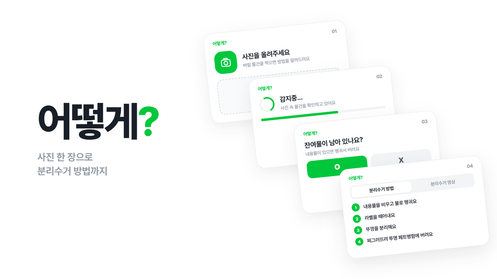
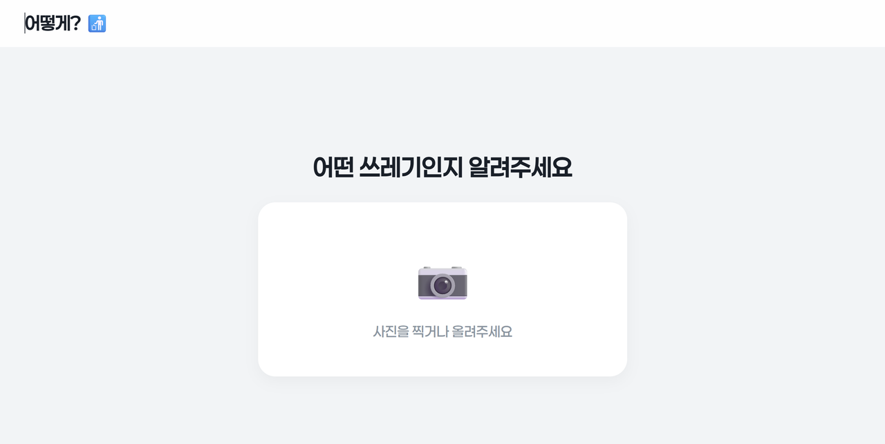
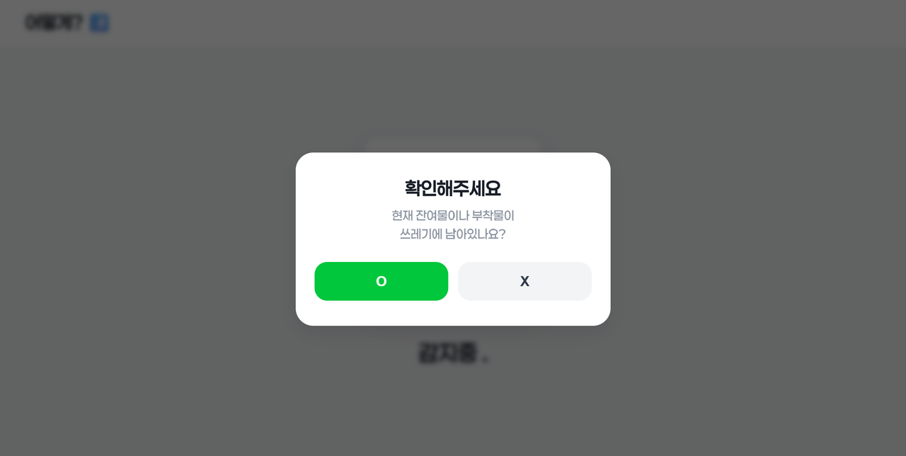
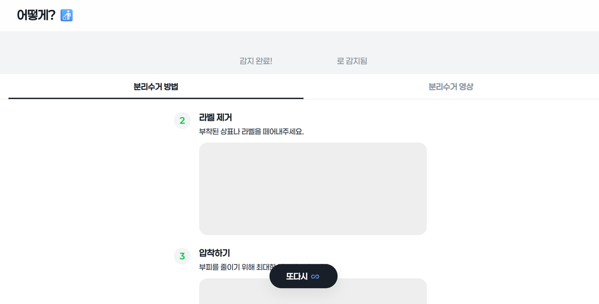
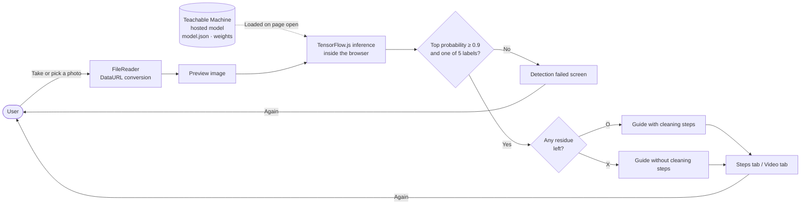

# HowTo

> 「어떻게?」 ("How?"), a web app that takes one photo of a piece of trash, identifies its material and shows the disposal steps along with a video

---

## 1. Project Overview

| Item | Details |
|---|---|
| Project | HowTo (service name 「어떻게?」) |
| One-line Summary | An image classification model running in the browser identifies the material of the trash. The app also asks whether there is residue, so each person only gets the disposal steps they actually need |
| Period | 2025.12.10 ~ 2025.12.18 (9 days, 2025 DDC research project) · minor fixes afterwards on 2025.12.22 and 2026.03.03 |
| Team | Team of 4 (first-year students at Daejeon Daeshin High School) |
| My Role | Team lead. Designed and built the entire web app, integrated the classification model, implemented the UI. All 50 commits in the repository are from my account |
| Contribution | (to be confirmed) |

Recycling rules are complicated, so when people are unsure they either ask someone nearby (47.2%) or go with their gut (38.9%). In our team survey, 72.2% of respondents said they are often confused when sorting recycling. We saw typing an item name into a search box as a hassle in itself, so the goal was to get an answer just by pointing a camera at the item.

## 2. Tech Stack

| Category | Technology | Why |
|---|---|---|
| Frontend | HTML · CSS · Vanilla JavaScript (single `index.html`) | It had to be finished in 9 days, and the design didn't need a server. With no build tools, deploying and editing come down to one file |
| Inference | TensorFlow.js + `@teachablemachine/image` | The model runs in the user's browser. Photos never go to an external server, and there is no separate inference server to operate |
| Model training | Google Teachable Machine (image classification, 224px input) | Add images per class and transfer learning runs; the result loads from a single URL. Good for retraining the model several times in a short period |
| Data | 20,773 trash images in 11 classes (source to be confirmed) | The class layout of a public trash-classification dataset plus an added vinyl (plastic film) folder. The final model uses 5 of these materials |
| Deployment | GitHub Pages | Only static files are needed, so there is no hosting cost |
| Design | Custom design tokens (CSS variables) | Colors, corner radii and shadows are grouped as variables to keep one consistent tone across every screen |

## 3. Key Features & Contributions

  
  
  

### Implemented Features

- **Photo classification**: A photo taken with the camera or picked from the album is read with `FileReader` and fed to the model. There are five output labels: plastic, vinyl, paper, metal and glass.
- **Handling failed detection**: If the top probability is below 0.9 or the result falls outside the five classes, no guide is shown and the user lands on a "Detection failed" screen instead. One tap on the `또다시` ("Again") button at the bottom starts over from the photo.
- **Tailored guide after a residue check**: Right after classification the app asks, "Is there any residue or anything stuck to it?" If the answer is no, the washing and emptying steps are dropped and the guide starts straight at the disposal step.
- **Steps / Video tabs**: 2–3 text steps per material and disposal videos filmed by team members, split into tabs.
- **Tutorial**: A 6-page walkthrough reached through the `이렇게!` ("Like this!") button on the first screen. One page is devoted entirely to the detection-failed case.
- **Add to home screen**: iOS web-app meta tags are included, so once added to the home screen the app opens full screen with no address bar.

### Main Tasks

- Designed the screen flow (intro → upload → detecting → residue check → result / failure)
- Wrote the model loading, inference and threshold logic; swapped in the retrained model
- Designed the per-material guide data structure. Each step carries an `isCleaning` flag so it can be filtered out based on the residue answer
- Defined the design tokens and did a full redesign (2025.12.16, 640 lines added · 538 lines deleted)
- Implemented the tutorial slides and transition animations

## 4. Results & Metrics

### Quantitative Results

| Item | Result |
|---|---|
| Development time | 9 days, 50 commits |
| Training data | Collected 20,773 images in 11 classes → final model uses 5 materials |
| Decision rule | Guidance only when the top probability is 0.9 or higher |
| Survey: preferred method | 85.7% prefer "take a photo, then get guidance" |
| Survey: name & character | 80.6% find the question-style name 「어떻게?」 friendly; 88.9% would use it more if it had a character |
| Survey: public adoption | 86.1% would use it if their school or local government provided it |
| Survey respondents | (to be confirmed) |
| Model accuracy | No measurement on record (to be confirmed) |

Respondents who would not pay for it split between "I can throw things out without an app" (51.5%) and "Too much hassle" (48.5%). In other words, charging individuals is a hard sell, so the team concluded on a B2G direction: supplying the app to schools and local governments.

### Qualitative Results

- Everything runs in the browser with no server, so operating cost is zero. User photos never leave the device either.
- A single question fills in what the model can't judge (whether there is residue). The guidance differs per person without adding more classes.
- When confidence is low, the app asks for a retake instead of giving wrong guidance, which cuts down on cases where it encourages incorrect disposal.

### Known Issues (as of the 2026.09 code)

- When an item is classified as vinyl, the glass guide and glass video are shown. The `Vinyl` entry in the guide data is still a copy of the glass content. The existing `HowTo_Vinyl_Recycle.mp4` is never used.
- The paper video path is mistyped as `.mp4r`, so the paper video tab doesn't play.
- The tutorial says "pressing O skips the cleaning steps," but the code actually skips them when X (no residue) is pressed. The code's behavior is the correct one; the explanation text is wrong.
- The TensorFlow.js script is loaded via `@latest`, so a library update can change behavior without warning.

## 5. Troubleshooting

### ① The model won't load

**Problem** When I first hooked up the Teachable Machine model, classification didn't work at all.

**Cause** Two things overlapped. While pasting the model URL, the URL ended up nested inside itself (`.../models/https://.../models/zEph8gOIH//`) with two trailing slashes. On top of that, the `<script>` tags that load TensorFlow.js and the Teachable Machine library were missing, so even with a correct URL `tmImage` would have been undefined.

**Solution** Over three commits I fixed the URL and added the CDN script tags. Before loading the model, the code now checks that `tmImage` and `tf` exist. If they're missing or loading fails, the error isn't just logged to the console; "Model failed to load" appears on screen (next to the logo).

**Result** When loading finishes, the class count is printed to the console, so I can see right away whether the model came in correctly. Later, when I retrained and swapped the model (`zEph8gOIH` → `HPWXwtXOO`), only the one line with the URL had to change.

### ② Containers with food on them get the clean-container guide

**Problem** The early model classified a delivery container with leftover food as plain "plastic," and the app told the user to throw it out as-is. In reality it has to be washed to be recycled.

**Cause** What the image classification model learned was material, not condition. Telling "dirty plastic" from "clean plastic" would mean collecting separate photos for each material by contamination state and retraining.

**Solution** Instead of making the model guess the condition too, I switched to a two-step structure: once classification is done, the app asks the user one question, "Is there any residue left?" Each step in the guide data has an `isCleaning` flag, and those steps are filtered out if the user answers that there is no residue.

**Result** The same 5-class model can now give different guidance depending on condition. The user supplies what a photo alone can't show, so the model didn't have to grow. However, I didn't measure how much this change improved accuracy.

### ③ It answers confidently even for unrecognizable photos

**Problem** Even for a blurry photo or a completely unrelated object, the app always gave guidance for something.

**Cause** A classification model outputs probabilities that sum to 1. Whatever the photo, some class always comes out on top. The first integration code used that class as the result no matter how low its value was.

**Solution** I fixed it in two rounds. First I added a threshold that counted a top probability below 0.7 as a failure. At that stage, a label missing from the guide data got the "general waste" guide, which was still an answer with no basis. So I raised the threshold to 0.9 and sent out-of-label results to the failure screen as well. The failure screen has a message asking for a retake and a `또다시` button, and I added a page explaining the failure case to the tutorial.

**Result** The app now prompts a retake instead of giving wrong guidance. In recycling, a wrong answer does more harm than "I don't know." That said, the reasoning behind choosing 0.7 and 0.9 was never recorded (to be confirmed).

## 6. Links & Deliverables

| Category | Link |
|---|---|
| GitHub Repository | [stx4R/HowTo](https://github.com/stx4R/HowTo) (private) |
| Live URL | https://stx4r.github.io/HowTo/ (unreachable as of 2026.09, to be confirmed) |
| Outputs | Research report, business (market entry) report, research poster, book poster |

### System Architecture

---

+++

## Customer Journey Map

| Stage | What the user does | What the user thinks | How the app responds |
|---|---|---|---|
| Right before disposal | Stands at the bins holding the item | "Where does this go?" | The first screen has just one line of copy ("Recycling, made easier.") and two buttons |
| First use | Hesitates because the app is new | "What do I tap?" | The `이렇게!` tutorial previews the whole flow |
| Taking the photo | Photographs the item and uploads it | "Will it recognize this?" | Shows the uploaded photo large with a "Detecting..." animation to signal it's working |
| Check | Answers the popup question | "Do I have to wash it?" | Asks about residue and keeps only the steps that are needed |
| Disposal | Follows the steps in order | "Ah, so that's how" | Shows numbered steps and a video in separate tabs |
| Failure | Recognition fails | "It's not working" | Reports the failure instead of a wrong answer and lets the user retry right away with `또다시` |

## Adaptive & Predictive Design

- **Adaptive**: The app container is fixed at a 1920×1080 base and scaled down when it's larger than the screen, so the layout holds when the window is resized. On portrait tablets and phones (width 1024px or less, portrait orientation), the tutorial alone switches to a separate layout that stacks the image and text vertically.
- **Predictive**: The "Is there any residue left?" question anticipates the user's next move. Someone who already washed the item doesn't need washing instructions, so a single answer leaves only what that person has to do.

## Motion Design

- The intro opens one step per tap. The logo moves up, then the subtitle floats in, then the buttons.
- On tutorial slides, the current page slides up and out while the next one rises from below (0.5s). Rapid taps during a transition are blocked with an `isAnimating` flag.
- While detecting, a "Detecting..." label with 1–3 cycling dots is shown, and the result appears after 1.5 seconds. It started as a random delay between 1 and 2 seconds and was later changed to a fixed value.
- Popups rise 20px from below while blurring the background. Buttons shrink slightly while pressed (scale 0.95).

## Security Risk Management (DREAD)

HowTo has no server and no accounts. Photos never leave the device either. What remains is the risk from code and models loaded from outside.

| Threat | Damage | Reproducibility | Exploitability | Affected Users | Discoverability | Assessment |
|---|---|---|---|---|---|---|
| CDN scripts loaded via `@latest`, so a new version can break the app or tampered code can slip in | Medium | High | Low | All | Medium | Pinning the version and adding SRI (integrity hash) is the cheapest fix |
| The model is fetched from Teachable Machine's servers every time. If the service shuts down, classification stops | Medium | Medium | Low | All | Low | Self-host by committing the model files to the repository |
| Users trust the result and dispose of items incorrectly (misclassification) | Low | Medium | Low | Individual | High | Partly mitigated by the 0.9 threshold and failure screen; accuracy still needs measuring |

A sensible order of fixes is SRI and version pinning → self-hosting the model → measuring accuracy. The first two take a few lines of code, and every user benefits.
