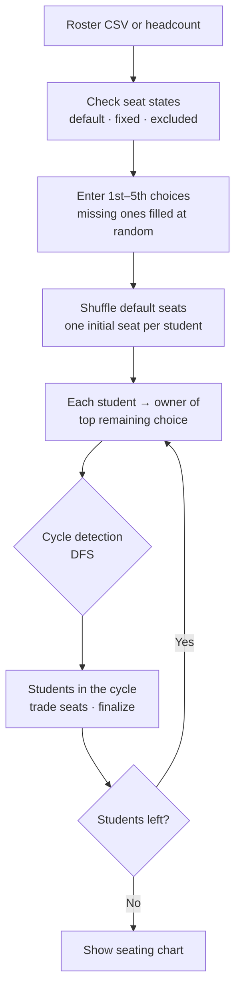

# Jari

<p align="center"></p>

> A classroom seating program that takes up to five seat preferences from each student and assigns seats by swapping them with the Top Trading Cycles (TTC) algorithm

---

## 1. Project Overview

| Item | Details |
|---|---|
| Project | Jari (desktop version 「우리반 자리 배정 시스템」 ("Our Class Seat Assignment System"), web version 「스마트 자리 배정」 ("Smart Seat Assignment")) |
| One-line Summary | Instead of drawing lots, it collects students' preferences, hands out initial seats, and lets students who want each other's seats trade |
| Period | 2026.03.03 ~ 2026.03.06 (4 days) · 03.03 desktop version (Python) → 03.06 web version (HTML/JS) |
| Team | Solo project |
| My Role | Chose and implemented the algorithm, built the desktop GUI and the web UI, packaged the executable |
| Contribution | 100% (all 5 commits in the repository are mine) |

Seats for a new semester are usually assigned by drawing lots. That's fair, but it completely ignores students who want a particular seat. On the other hand, if the teacher collects preferences and adjusts by hand, the outcome depends on who asked first and whose circumstances got special consideration. The goal was an assignment that reflects preferences while following fixed rules.

I took the algorithm from matching theory. The well-known Gale-Shapley is for two-sided matching, where both sides have preferences (students–schools, applicants–companies). Seats don't choose students, so this is a one-sided assignment problem in which only one side has preferences. That's why I chose TTC: every student first gets one seat, then trades with the owner of the seat they want.

## 2. Tech Stack

| Category | Technology | Why |
|---|---|---|
| Desktop version | Python 3.13 · customtkinter (278 lines) | Cleaner dark-theme widgets than plain tkinter. File dialogs and message boxes still come from tkinter |
| Packaging | PyInstaller single executable (`.exe`, about 14MB) | Runs right away on classroom computers without installing Python |
| Web version | HTML · CSS · Vanilla JavaScript (single `index.html`, 579 lines) | Opens in a browser with no install. A seating chart whose classroom layout changes on click was easier to build on the web |
| Font | Pretendard (jsDelivr CDN) | Korean readability |
| Input | CSV (`번호,이름`: number, name) | The roster used at school can be saved straight from Excel and loaded |

## 3. Key Features & Contributions

<p align="center"></p>
<p align="center"><sub>Web version, headcount mode with 24 students. Result of an assignment with seats 1 and 2 fixed and seats 31–36 excluded</sub></p>

### Implemented Features

- **Roster setup**: Loads a `번호,이름` (number, name) CSV. The web version also has a mode that takes only a headcount (up to 36), so it can be used without uploading any names.
- **Preference input**: Each student picks their 1st through 5th choice seats. Picking the same seat twice isn't saved. If not everyone has entered preferences, the program asks whether to fill in the rest at random. There's also a button that generates everything at random for demos.
- **TTC assignment**: In each round, every student points to "the owner of the seat they want most among those still available." Students in a cycle formed by following the pointers trade seats with each other and drop out. If every seat a student wanted is gone, they point to their own seat and stay where they are.
- **Seating chart**: Shows the result as 3 sections of 2 columns each, below the blackboard and teacher's desk.
- **Seat state control (web version)**: Clicking a desk once makes it a fixed seat; clicking it twice makes it an excluded seat. The student in a fixed seat stays there in the next assignment, and excluded seats are left out of preference lists and the assignment. If there are fewer remaining seats than students, the assignment is blocked and the reason is shown.

### Main Tasks

- Defined the problem and chose the algorithm (one-sided assignment with TTC, not two-sided matching with Gale-Shapley)
- Implemented TTC: building the pointer graph, DFS cycle detection, repeating rounds
- customtkinter GUI (3-step sidebar, log window, preference input window, seating chart window) and PyInstaller packaging
- Ported it to the web and added features (random initial assignment, fixed and excluded seats, headcount mode, seat shortage check)

## 4. Results & Metrics

### Quantitative Results

These results come from porting the web version's assignment code as-is to Node.js, giving each student 5 random preferences and running 5,000 trials per condition (measured while writing this report in 2026.09; the script is [`assets/Jari/seat_sim.js`](../assets/Jari/seat_sim.js)).

| Condition (students / seats) | Got 1st choice | Within top 3 | Within top 5 |
|---|---|---|---|
| 30 students / 30 seats | 49.7% | 73.4% | 81.2% |
| 24 students / 30 seats | 39.0% | 66.8% | 76.7% |
| 24 students / 36 seats | 31.3% | 58.9% | 70.3% |

| Item | Result |
|---|---|
| Development time | 4 days (desktop version 1 day, web version 1 day) |
| Outputs | 1 executable (about 14MB) + 1 web page |
| Supported size | Up to 36 seats in the web version, 35-seat chart in the desktop version |
| Real classroom use | (to be confirmed) |

When the number of students equals the number of seats, about half get their first choice and over 80% get a seat within their top 5. Why the numbers drop as more seats go unused is covered under "Known Limitations" below.

### Qualitative Results

- Reframed a problem stuck between drawing lots and hand adjustment as a matching-theory problem, and chose an algorithm that fits its (one-sided) structure.
- Implemented the same algorithm both as a Python GUI and on the web, so each classroom can pick an installed or a browser-based version depending on its PCs.
- In the web version, handled real-world conditions such as each classroom's different desk layout and "this student stays in front" through three seat states.

### Known Limitations (as of the 2026.09 code)

- **Empty seats don't enter the exchange market.** The web version shuffles the available seats and cuts the list at the number of students to hand out initial seats. The leftover empty seats belong to no one, so a student can't get one even as their first choice. With 24 students / 36 seats, 33.2% of first choices pointed at such empty seats. Running the same conditions with a variant that also puts empty seats into the market (YRMH-IGYT: an empty seat points to the highest-priority student) changes the results dramatically.

  | Condition | Current: 1st choice / within top 5 | With empty seats: 1st choice / within top 5 |
  |---|---|---|
  | 24 students / 30 seats | 39.0% / 76.7% | 61.4% / 95.7% |
  | 24 students / 36 seats | 31.3% / 70.3% | 68.2% / 98.5% |

- **The seat shuffle isn't uniform.** `sort(() => 0.5 - Math.random())` uses an inconsistent comparator, so different orderings come out with different probabilities. When shuffling 30 items, the chance that the first element stayed in first place was 8.49%, 2.5 times the uniform value (3.33%). The fairness of the initial seat distribution depends on this, so it should be replaced with a Fisher-Yates shuffle.
- **Only up to 5 preferences are taken.** TTC is proven to have the property that no one can gain by lying about their preferences when it receives full preference lists. Whether that guarantee still holds once the list is cut to 5 needs to be checked separately.
- **The web version reads CSV only as UTF-8.** The CP949 fallback from the desktop version wasn't ported, so a Korean roster saved from Excel may come out garbled.
- **The desktop seating chart is fixed at 35 seats.** With 36 or more students, assignment still works but the extra students don't appear on the chart.
- **Marking a seat with no student as fixed effectively turns it into an excluded seat.** That's because fixed seats are removed from the pool of seats to assign.

## 5. Troubleshooting

### ① Roster order decides the initial seat, so low numbers have the edge

**Problem** The desktop version gives the k-th student on the roster seat k as their initial seat. Since TTC starts from initial seats and trades from there, a student who owns a popular seat from the start has the upper hand in the exchange.

**Cause** Assuming most students prefer front seats (weights that make front seats more likely to be chosen), I ran 5,000 trials with 30 students / 30 seats. Roster numbers 1–5 got their first choice 66.5% of the time; numbers 26–30 only 7.1%. Simply by having low numbers, those students get ownership of the front seats and enter the exchange holding them.

**Solution** In the web version, the available seats are shuffled before being handed out to students (random initial assignment).

**Result** Under the same conditions, first-choice rates for numbers 1–5 and 26–30 evened out at 31.6% and 31.8%. For reference, TTC with a random initial assignment is known to produce the same outcome distribution as having students pick one at a time in random order (random serial dictatorship) (Abdulkadiroğlu & Sönmez, 1998). Because of the shuffle bias described above, though, the current implementation isn't fully uniform. The figures come from a simulation run while writing this report ([`seat_sim2.js`](../assets/Jari/seat_sim2.js)).

### ② Classrooms don't have exactly as many desks as students

**Problem** The desktop version makes the number of seats equal to the number of students and draws the chart with 35 seats. Real classrooms have empty desks, seats that aren't used, and seats set aside in advance because of eyesight or other circumstances.

**Cause** Seats were treated only as "a list of numbers as long as the student count." There was nowhere to store a state for each seat.

**Solution** In the web version, the 36-seat grid is drawn first and each seat has a state (default · fixed · excluded). Every click on a desk cycles its state. The preference input list and random preference generation leave out excluded seats. Before assignment, if `36 - 제외석 - 고정석` (36 − excluded seats − fixed seats) is less than the number of students to seat, it stops and tells you which seats to free up.

**Result** The classroom layout can be set up before the roster is loaded. Students in fixed seats stay in place even when seats are reassigned.

### ③ Korean text in rosters saved from Excel gets garbled

**Problem** School rosters are usually saved from Excel as CSV. Reading these files only as UTF-8 makes loading fail.

**Cause** Excel on Korean Windows saves CSV as CP949 (an EUC-KR variant). Reading it as UTF-8 raises a `UnicodeDecodeError` on the Korean bytes.

**Solution** The desktop version first reads the file as UTF-8 and, on a decode error, reads it again as CP949. In both cases the file is closed in `finally`.

**Result** It reads both rosters saved straight from Excel and UTF-8 rosters. The web version doesn't have this handling yet.

## 6. Links & Deliverables

| Category | Link |
|---|---|
| GitHub Repository | [stx4R/Jari](https://github.com/stx4R/Jari) (private) |
| Live URL | https://stx4r.github.io/Jari/ |
| Executable | `Jari.exe` in the repository (Windows) |
| Simulations | [`seat_sim.js`](../assets/Jari/seat_sim.js), [`seat_sim2.js`](../assets/Jari/seat_sim2.js) |

### Algorithm Flow



Example of one round:

```
A wants B's seat, B wants C's seat, C wants A's seat
→ cycle A → B → C → A → all three move to the seats they want at once and drop out
```

---

+++

## Customer Journey Map

The user is the homeroom teacher (or a class officer) assigning the seats.

| Stage | What the user does | What the user thinks | How the program responds |
|---|---|---|---|
| Preparation | Pictures the classroom's desk layout | "Our class doesn't use the back row" | Excluded seats can be set first by clicking desks, even without a roster |
| Roster | Looks for the roster file | "Is it OK to upload names?" | Headcount mode lets you assign seats using numbers only |
| Collecting preferences | Asks students which seats they want | "I couldn't get everyone's" | Asks whether to fill in the missing students at random |
| Assignment | Presses the button | "Can I trust the result?" | The desktop version logs the cycles of every round |
| Adjustment | Puts a particular student up front | "Fix just this student and run it again" | A seat marked as fixed stays in place on reassignment |

## Adaptive Design

- The desktop version uses a fixed 1000×650 window with a 3-step sidebar, so pressing the buttons from top to bottom finishes the job. The next button stays disabled until the previous step is done.
- The web version keeps the same 3-step sidebar and puts the seating chart on the right. In the second commit on 2026.03.06, margins, text and desks were all shrunk together (desks 84×70 → 78×64) so all 36 seats fit on one screen.

## Security Risk Management (DREAD)

In seat assignment, what needs protecting is the fairness of the result. Any point where manipulation or bias can change the result is treated as a threat.

| Threat | Damage | Reproducibility | Exploitability | Affected Users | Discoverability | Assessment |
|---|---|---|---|---|---|---|
| A biased shuffle sends certain seats to students at certain positions more often | Medium | High | Low | Whole class | Low | Replace it with Fisher-Yates. It's one line of code but invisible from the outside, so it comes first |
| The operator reruns the assignment until they like the result | Medium | High | High | Whole class | Low | Publishing the random seed and recording it with the result makes reruns verifiable |
| Names from the CSV are rendered with `innerHTML`, so scripts can be injected | Low | Medium | Medium | Operator's PC | Medium | The operator picks the roster file themselves, so the risk is low. Switching to `textContent` fixes it |

A sensible order of fixes is replacing the shuffle → recording the seed → switching to `textContent`. The first two bear directly on fairness.
