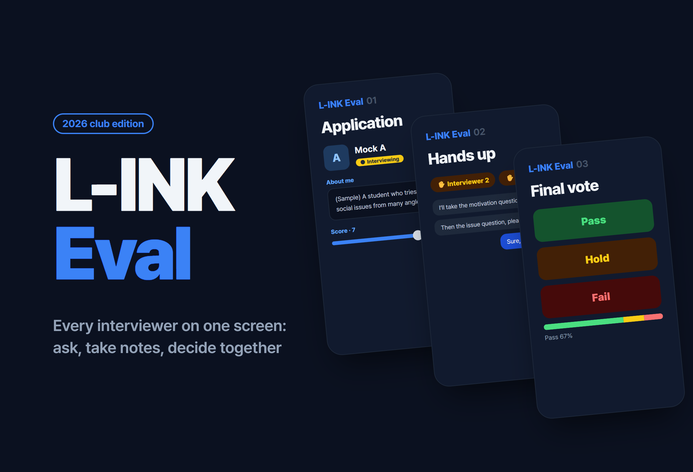
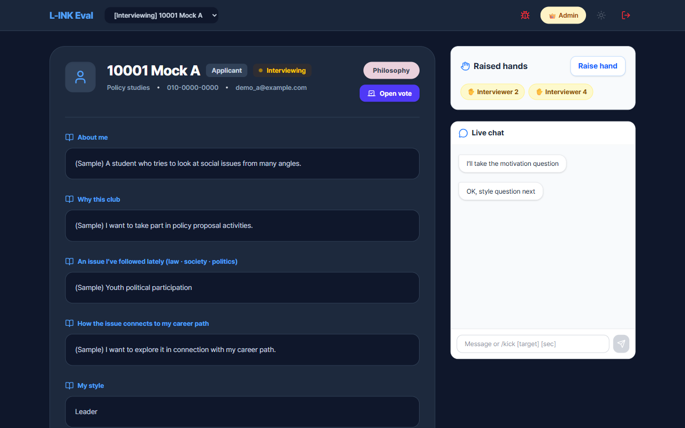
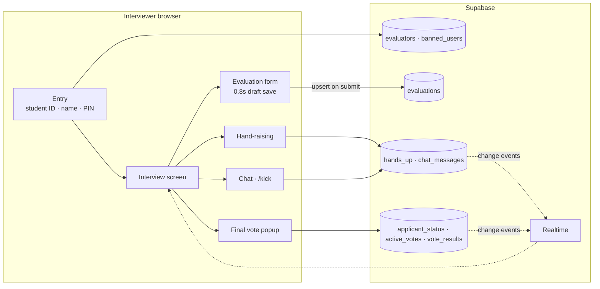

# L-INK Interview

<p align="center"></p>

> 「L-INK Eval」, an interview evaluation web app that lets several interviewers run club recruitment interviews on one screen and keep scores, question order and the pass vote in sync in real time

---

## 1. Project Overview

| Item | Details |
|---|---|
| Project | L-INK Interview (app name 「L-INK Eval」) |
| One-line Summary | Gathers the applications, scores, notes and pass/fail opinions that used to be scattered across interviewers into one place, and shares in real time who asks the next question, right up to the final pass vote |
| Period | 2026.03 (repository created 2026.03.21; interview dates to be confirmed) · code uploaded to the club's organization repository on 2026.07.20 |
| Team | 1 developer (me). The users are L-INK interviewers |
| My Role | Planning, design and full implementation; admin (moderator) on interview day |
| Contribution | 100% (all commits in the repository are mine). However, the development history is squashed into a single upload commit |

L-INK is a humanities–science convergence club at Daejeon Daeshin High School. In interviews for new members, several interviewers see one applicant at the same time, yet applications came on paper or as files, scores lived in each person's notes, and pass/fail opinions were collected verbally after the interview. Who asked the next question was settled by reading the room. I built a tool that lets the interviewers look at the same screen during the interview, record their scores, and decide the question order and the outcome on the spot.

## 2. Tech Stack

| Category | Technology | Why |
|---|---|---|
| Frontend | React 19 · TypeScript · Vite | A single-page app of about 10 components, so a lightweight build tool was enough |
| State | Zustand | Shares the current interviewer, the selected applicant and draft evaluations globally. Less setup than Redux |
| Styling | Tailwind CSS v4 · lucide-react | Turns dark mode (`dark:` variant) on to match the system setting |
| Backend | Supabase (Postgres · Realtime) | No separate server code: table subscriptions alone push chat, hand-raising and votes to every interviewer's screen at once |
| Deployment | Vercel (SPA rewrite config) | Every path is routed to `index.html`, so the app still opens after a refresh |

## 3. Key Features & Contributions

<p align="center"></p>
<p align="center"><sub>Captured from a local build. All applicant information and chat messages were replaced with fictional data for rendering.</sub></p>

### Implemented Features

- **Interviewer entry**: Interviewers enter their student ID and name; the first time, they set a 4-digit PIN, and they use that PIN from then on. An interviewer who has been kicked from the chat is blocked at the entry step.
- **Viewing applications**: Picking an applicant from the dropdown at the top lays out their career path, department, self-introduction, motivation, issue of interest, how that issue relates to their career path, personality and the evidence for it, activities they want to do, and resolution as cards on one screen.
- **Interview status**: Each time the admin clicks an applicant's badge, it moves through `면접 대기 → 면접중 → 면접 완료` (waiting → interviewing → done), and the status LED changes color with it. Evaluation input opens only for applicants in the `면접중` (interviewing) state.
- **Evaluation input**: A 1–10 slider and a comment. 0.8 seconds after typing stops, a draft is saved inside the app, and pressing Submit overwrites the DB row keyed by `(면접관, 지원자)` (interviewer, applicant).
- **Hand-raising**: When an interviewer who wants to ask a question raises their hand, their name appears under "Live hand-raise status" on every screen.
- **Live chat**: Interviewers split up the questions among themselves. The admin can remove a specific interviewer for a set time with the `/kick [대상] [초]` ([target] [seconds]) command.
- **Final vote**: When the admin opens a vote, a Pass/Hold/Fail popup appears on every interviewer's screen. When the admin closes it, the ratios are revealed.
- **Admin summary screen**: Search all evaluations by applicant or interviewer and see average scores.
- **Suggestion board**: Interviewers report bugs and suggestions, and the admin updates their status.

### Main Tasks

- Designed the interview flow (entry → applicant selection → status change → evaluation → hand-raising & chat → final vote)
- Set up the Supabase tables and Realtime subscriptions (chat · hand-raising · voting · vote results)
- Separated draft saving from DB submission for evaluations
- State management for the final vote popup (Troubleshooting ① below)

## 4. Results & Metrics

### Quantitative Results

| Item | Result |
|---|---|
| Interviews covered | 24 applicants (4 departments: Startup 14 · Politics 5 · Philosophy 4 · Business & Economics 1) |
| Application fields | 10 written fields per applicant, shown on one screen |
| Size | 2,331 lines of TS/TSX (including about 430 lines of application data), 10 components · 2 pages |
| Realtime channels | 4: chat · hand-raising · vote status · vote results |
| Number of interviewers · time in use | (to be confirmed) |

### Qualitative Results

- The step of collecting scores and opinions all over again after the interview is gone. Vote results and average scores are on one screen right after the interview.
- Showing who asks next as a hand-raise list cut down on interviewers talking over each other.
- The authentication and permission problems this project exposed (see limitations below) were solved two months later in MoGuk with a pre-registered roster + server-side verification + RLS.

### Known Limitations (as of the 2026.09 code)

- **Applicants' personal data is in the source code.** 24 applications (including phone numbers and school emails) are hard-coded under the name `MOCK_APPLICANTS`. When the app is built they go straight into the JavaScript bundle, so anyone who knows the deployment URL can read them with developer tools. Applications should be served from the DB only to authorized users and scrubbed from the repository history as well.
- **PIN checks happen in the browser.** At login, the PIN stored in the DB is fetched into the browser and compared with the input. A single query is enough to learn another interviewer's PIN, and PINs are stored in plain text.
- **Admin checks also happen in the browser.** A specific student ID and name combination, or a student ID of `admin` or `00000`, makes you an admin. Anyone who knows the values can open the admin screen.
- **The DB permission rules aren't in the repository.** Without the table creation SQL and the RLS policies, there's no way to check how far direct writes from the client were blocked (to be confirmed).
- **No development history remains.** The repository has only a single commit that uploaded the finished version, and the README is the default Vite template.

## 5. Troubleshooting

### ① The final vote popup closes and reopens on its own

**Problem** When the admin opens a vote, a popup has to appear on every interviewer's screen. According to the fix comments left in the component, the popup came back even after an interviewer had checked the result and closed it, and it flickered every time another interviewer's vote came in.

**Cause** Whether to show the popup was decided by "is there current vote data." Clearing the vote data to close the popup made the initial-load effect run again, fetch the data, and open the popup once more. Events for newly added votes also rewrote the vote state, so the popup flickered along with it. On top of that, state was among the dependencies of the effect that set up the subscription, so the subscription kept being re-created.

**Solution** I split popup visibility out into its own state (`showModal`). Closing the popup only turns off `showModal` and leaves the vote data as it is. Vote-added events update only the tally numbers and never touch the popup state. The popup reopens to show the results only at the moment the vote status changes `voting → finished`. The subscription uses an empty dependency array, so it's set up just once when the screen first opens.

**Result** The popup now opens at exactly two moments: "new vote started" and "vote closed." In between, if an interviewer closes it, it stays closed. The whole process is recorded step by step in the component's comments.

### ② Switching applicants mid-evaluation wipes the input

**Problem** Interviewers keep revising scores and notes throughout an interview. Writing to the DB on every change means far too many requests. Saving only when Submit is pressed means that whatever was being written disappears after a quick look at another applicant.

**Cause** The evaluation form's inputs are component state, so switching applicants resets them for the new applicant.

**Solution** I split saving into two stages. 0.8 seconds after typing stops, a draft is saved in the global store under a `지원자-면접관` (applicant-interviewer) key, and that value is loaded back when the applicant is selected again. The DB is written only when the interviewer presses Submit, with an upsert keyed on `(evaluator_id, applicant_name)`, so even if the same interviewer submits several times, only one row remains.

**Result** Drafts survive moving back and forth between applicants, and only values the interviewer has confirmed go into the DB.

### ③ Hand-raise order isn't shared among interviewers

**Problem** The original question queue still in the code (`HandRaiseQueue`) shows a raised hand only on that interviewer's own screen.

**Cause** The queue was managed only as Zustand state inside the browser. The code had just "DB INSERT" and "DB DELETE" comments with no actual storage behind them, so each interviewer's list lived in its own world.

**Solution** I moved hand-raising into a Supabase `hands_up` table (`HandUpSection`), upserting with the interviewer's name as the key. Every screen subscribes to changes on this table and reloads the list.

**Result** When one person raises a hand, it shows up on every interviewer's screen immediately. The old queue component is still in the code, unused.

## 6. Links & Deliverables

| Category | Link |
|---|---|
| GitHub Repository | [L-INK-dshs/L-INK-Interview](https://github.com/L-INK-dshs/L-INK-Interview) (private) |
| Live URL | (to be confirmed) |

### System Architecture



How one applicant's interview runs:

```
Admin:       click applicant badge → Interviewing (evaluation form opens)
Interviewer: raise hand → ask → score · notes → submit
Admin:       open final vote → popup on every screen → close → reveal Pass · Hold · Fail ratios
Admin:       click badge → Done
```

---

+++

## Customer Journey Map

The user is an interviewer (a club member).

| Stage | What the user does | What the user thinks | How the app responds |
|---|---|---|---|
| Entry | Enters their student ID and name | "Do I have to make yet another password?" | Just a 4-digit PIN, set once the first time |
| Preparation | Opens the next applicant's application | "Where's this student's application?" | Pick from the dropdown and all 10 fields appear on one screen |
| Asking | Raises a hand to ask a question | "Is it OK to speak now?" | The list of interviewers with raised hands is visible to everyone |
| Evaluation | Leaves a score and notes | "I'll clean this up later" | Drafts are saved automatically; submitting sends them to the DB |
| Decision | Decides pass or fail | "What do the others think?" | Everyone votes at the same time, and the ratios are revealed when the vote closes |

## Motion Design

- While a vote is open, the Pass/Hold/Fail buttons glow like LEDs that brighten and dim as if breathing, and grow slightly when pressed (`hover:scale-105`).
- The LED dot on the applicant status badge has a different color for each state: `면접 대기` (waiting), `면접중` (interviewing) and `면접 완료` (done).

## Adaptive Design

- If the operating system is in dark mode, the app starts in dark mode too, and a button in the header switches it.
- On wide screens, the application (left) and hand-raising & chat (right) sit side by side, so interviewers can follow the chat while reading the application.

## Security Risk Management (DREAD)

| Threat | Damage | Reproducibility | Exploitability | Affected Users | Discoverability | Assessment |
|---|---|---|---|---|---|---|
| Applicants' personal data included in the JS bundle | High | High | High | 24 applicants | High | Top priority. Move applications to the DB, allow reads only by authorized interviewers, and clean up the repository history |
| Stored PINs downloaded to the browser for comparison | High | High | Medium | All interviewers | Medium | Move PIN comparison into a server function and store hashes |
| Admin status decided on the client | High | High | Medium | All | Medium | Decide admin status with a DB role column and RLS |
| Direct writes to the vote and status tables (RLS can't be verified) | Medium | Medium | Medium | All | Low | Allow writes only through RPCs and keep the RLS in the repository |

All four come from the same root cause: trusting the browser. The right order of fixes is personal data → PIN → admin check → write permissions. The first two cause damage that outlasts the interviews themselves, so they have to be closed first.
