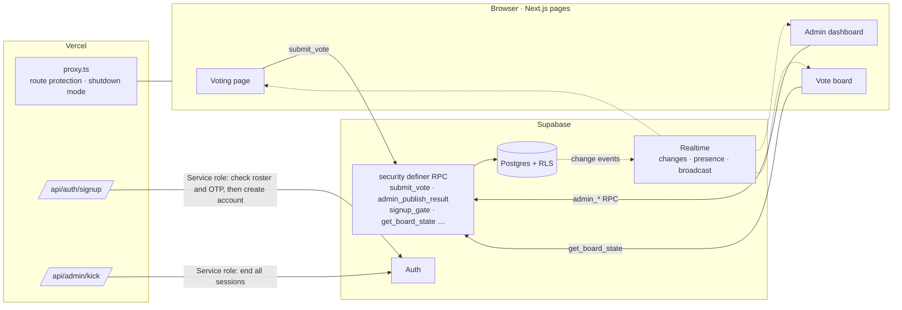

# MoGuk

<p align="center"></p>

> The official web service of the 3rd Oryang Mock National Assembly, with 130 participating members, bringing sign-up, electronic voting, the vote board and operations tools together in one place

---

## 1. Project Overview

| Item | Details |
|---|---|
| Project | MoGuk (official website and e-voting platform of the 3rd Oryang Mock National Assembly) |
| One-line Summary | Only pre-registered members can sign up and vote once per agenda item, organizers manage attendance and votes on the vote board, and the server tallies and publishes the results itself |
| Event Period | 2026.05.29 ~ 2026.07.25 (standing committees 07.18, plenary session 07.25) · Daejeon Daeshin High School |
| Repository Period | 2026.05.21 (v1.0) ~ 2026.07.24 (service shut down after closing) · 32 commits |
| Team | Dev team of 3 (the site footer credits stx4R · kmc11004) |
| My Role | Development (all 32 commits in the repository are from my account). Detailed split of work: (to be confirmed) |
| Contribution | (to be confirmed) |

The Oryang Mock National Assembly is a youth mock parliament run jointly by 12 school clubs. The 3rd edition ran 9 standing committees under a three-party system of 40 progressive, 40 conservative and 50 centrist members. The event stretches over nearly two months, from researching bills to the electronic vote at the plenary session, so it needed a single system responsible for managing the participant list and keeping the vote fair. This service is both the event's official website and its plenary voting system. It was designed so that the server and database guarantee who can vote, that each person votes only once, and that the published numbers match the actual votes.

## 2. Tech Stack

| Category | Technology | Why |
|---|---|---|
| Framework | Next.js 16.2 (App Router) · React 19 · TypeScript | Pages and server APIs (`app/api`) live in one repository. `proxy.ts` (Next 16's middleware) filters permissions before a request reaches a page |
| Styling | Tailwind CSS v4 (`@theme` tokens) · framer-motion · three.js(@react-three/fiber) | Dark-theme design tokens are managed as CSS variables. The animation libraries drive section entrances and the 3D background on the first screen |
| Auth | Supabase Auth + pre-registered roster (`allowed_names`) + OTP | Only people holding a name/OTP pair issued in advance by the organizers can create an account |
| Data | Supabase Postgres · Row Level Security · `security definer` RPC | Direct table writes are blocked, and every voting, tallying and admin action goes through DB functions. Even if the client is tampered with, the rules still hold in the DB |
| Realtime | Supabase Realtime (`postgres_changes` · Presence · Broadcast) | Opening and closing agenda items and publishing results show up on every screen instantly. It also shows who is connected and cuts off a specific user's sessions |
| Deployment | Vercel · PWA manifest (`standalone`) | Every push deploys right away. It can be installed on a phone's home screen like an app |

## 3. Key Features & Contributions

<p align="center"></p>
<p align="center">
  
  
</p>
<p align="center"><sub>Captured from a local build. The voting and vote board screens were rendered with mock data instead of Supabase (agenda titles and member names are examples).</sub></p>

### Implemented Features

- **Invite-only sign-up**: Members sign up with their name + the OTP handed out by the organizers + email + password (8 characters or more). The server API passes the IP and name to a DB gate (`signup_gate`) that first decides whether to allow the attempt, then checks that the name/OTP pair is on the roster and that the name isn't already registered, and creates the account with the service role key. Every failure returns the same response, whatever the reason.
- **Agenda voting**: On an open agenda item, the member picks one of Yes, No or Abstain. Votes can be submitted only through the single `submit_vote` RPC and can't be changed afterwards. The DB function checks login, ban status, whether the item is open and duplicates in turn, and the `(agenda_id, user_id)` unique constraint blocks duplicates as the last step.
- **Result publishing**: While voting is underway, nobody can see the tally. When an admin publishes, the server counts `votes` directly to create the result row, and it appears on every connected screen in real time.
- **Vote board**: Like the electronic board in the National Assembly, it shows each member's Yes/No/Abstain/Not voted as an LED, together with registered members, members present, yes/no counts and a turnout bar. Admins can record attendance and correct votes. For agenda items whose results have been published, members can view the board read-only too (roll-call vote disclosure).
- **Admin dashboard**: List of connected members (Presence), creating/opening/closing/completing agenda items, and a command console with `/kick` `/ban` `/timeout` `/voteresult`.
- **Forced logout**: An RPC records the status, the server API ends all of the target's sessions with the service role key, and a Broadcast notifies the target's screen. The target's screen doesn't log out the moment it receives the broadcast; it asks the server about its session again and only goes to the login screen if the session was actually ended.
- **Event info and policy pages**: Schedule, standing committees, party composition; terms of service, privacy policy, operating policy; guide videos; FAQ.
- **Service shutdown mode**: After closing, a single flag turns every page into a shutdown notice and closes the API with `410 Gone`.

### Main Tasks

- Designed the auth and permission flow (pre-registered roster + OTP sign-up, `proxy.ts` route protection, origin checks on admin APIs)
- Designed the Supabase schema, RLS policies and RPCs, and applied the security review findings (V-1 · V-3 · V-4)
- Implemented the voting page, admin dashboard and vote board
- Configured security headers (CSP · HSTS · X-Frame-Options, etc.)
- Trimmed features and cleaned up the public repository (v4.2 deleted 5,206 lines; DB scripts removed on 07.13)

## 4. Results & Metrics

### Quantitative Results

| Item | Result |
|---|---|
| Target event | 130 members (3 parties) · 12 clubs · 9 standing committees · 58-day event period |
| Service size | 11 pages + 2 server APIs, 4,471 lines of TS/TSX/CSS |
| DB design | 13 tables, 33 RLS policies (schema just before v4.2), 12 RPCs called by the client |
| Development history | 32 commits, versions v1.0 → v7.2 → closed |
| Feature trimming | v4.2 deleted 5,206 lines, including chat, announcements and bug reports |
| Actual sign-ups · votes · concurrent users | (to be confirmed) |

### Qualitative Results

- Guaranteed the three conditions for a vote (only eligible people, only once, published numbers that match the actual votes) through DB rules rather than the UI. Modifying the client code can't get around them.
- Tracked the pre-plenary security review items by number (V-1 · V-3 · V-4, etc.) and fixed them one at a time.
- Cut unused features without hesitation. Things like chat and bug reports were all potential entry points for attacks and weren't essential to the event.
- After closing, shut the service down explicitly, removing any way in through leftover accounts and data.

### Known Limitations (as of the 2026.09 code)

- **The DB scripts aren't in the repository.** A 2026.07.13 commit removed the schema, RLS and security patch SQL (1,366 lines) from the public repository. Functions added after that, such as `signup_gate`, have no record at all, so the service can't be rebuilt from the repository alone.
- **Blocking developer tools on the client isn't security.** Scripts that block F12, right-click and `debugger` are still there. As the code comment itself says, "server-level protection is handled separately"; the real defenses are CSP and RLS.
- **The CSP includes `script-src 'unsafe-inline'`.** The inline scripts above need it, but it weakens protection against script injection accordingly.
- **The closing commit breaks the home layout.** To center the shutdown notice page, `main` was switched to a horizontal `flex`. If the service is reopened, the multi-section home screen gets squeezed sideways. The screenshot above was taken after reverting to the layout from just before closing.
- **Forced logout runs as three separate steps.** There's no transaction across the RPC, server API and Broadcast, so later steps still run even if a middle step fails.

## 5. Troubleshooting

### ① Any logged-in user could see other people's votes, and the client decided the result numbers (security review V-1 · V-4)

**Problem** A security review six days before the standing committees (07.18) turned up two issues. The read policy on the `votes` table was `to authenticated using (true)`, so anyone logged in could read other members' choices. Result publishing also wrote the numbers calculated on the admin screen straight into the results table.

**Cause** The original policy was named "authenticated users can view vote results." To show the tally, the raw vote table itself had been left open. Result publishing relied only on a UI condition, "only admins can press it." If an admin account was hijacked or a request was forged, the numbers could be changed.

**Solution** (V-1) I narrowed `votes` reads to the member's own vote and to admins. The voting page reads only the user's own vote, and anywhere a tally is needed, a `security definer` function does the counting instead. (V-4) I moved result publishing into the `admin_publish_result` RPC, which checks admin rights and then has the server count `votes` directly to create the result row. Numbers sent by the client are not accepted.

**Result** While voting is underway, nobody except admins can see individual votes, and the published numbers always match the actual votes in the DB. Later, in v7.1, I added a separate RPC (`get_published_board_state`) that shows per-member votes read-only, and only for agenda items whose results have been published. The ballot stays secret before publication, and the roll-call vote is shown openly after it.

### ② Sign-up rate limiting doesn't hold up in a serverless environment (V-3)

**Problem** The sign-up API limited each IP to 5 attempts per minute. It was there to slow down brute-force guessing of OTPs.

**Cause** Attempt counts were stored in a `Map` in server memory. Vercel's serverless functions can run on a different instance for each request, and memory is lost when an instance goes cold. With a separate counter on every instance, the limit effectively disappears. The IP was also being read from the last value of `x-forwarded-for` (the nearest proxy).

**Solution** I moved attempt records and decisions into the DB function `signup_gate` so every instance sees the same records. The IP and name are passed together, and on a successful sign-up `signup_mark_success` marks that attempt (the function bodies aren't in the repository, so the detailed rules are to be confirmed). When reading `x-forwarded-for`, it now uses the first value (the original client) instead of the last one. Two more things were locked down in the same round.
- **Name normalization**: Before matching against the roster, names are normalized to NFC and stripped of control characters and zero-width spaces. This stops anyone from slipping in invisible characters to register the same name twice or to throw off roster matching.
- **Removing OTP traces**: Right after the account is created, the OTP is deleted from the user metadata, because metadata can be read with the user's own token.

**Result** The same limit applies no matter how many instances are running. Failure responses are identical regardless of the reason, so the response alone doesn't reveal which names are on the roster.

### ③ Keeping the real-time vote board from missing "not voted" resets and out-of-order responses

**Problem** The vote board (v7.0) receives changes to `votes` and the attendance table in real time and redraws itself. When an admin reset a member's vote to "not voted," or when a rush of votes sent queries out back to back, the screen could drift from the actual state.

**Cause** Resetting to "not voted" deletes a `votes` row. Realtime DELETE events carry only the primary key, so a server filter like `agenda_id=eq.{안건}` (per agenda item) filters those events out. And if the response to an earlier query arrives later, the old state overwrites the new one.

**Solution** `votes` is subscribed to without a server filter, and the board reloads only when the incoming event has no `agenda_id` (DELETE) or matches the current agenda item. Every query gets a sequence number (`fetchSeq`), and only the response to the most recently sent query is applied to the screen. Admin corrections to attendance and votes are shown on screen first and rolled back to the original value if the RPC fails.

**Result** The board keeps up with inserts, updates and deletes alike, and the latest state wins even when responses arrive out of order. This handling went in with the commit that first built the board.

### ④ The link underline utility has no effect

**Problem** Giving footer links the `underline` class didn't produce an underline.

**Cause** Tailwind v4 uses CSS cascade layers. The global CSS reset `a { text-decoration: none }` sat outside any layer, and unlayered rules always take precedence over utilities inside layers.

**Solution** I moved the reset into `@layer base`.

**Result** Links have no underline by default, and utilities can override that where needed.

## 6. Links & Deliverables

| Category | Link |
|---|---|
| GitHub Repository | [L-INK-dshs/MoGuk](https://github.com/L-INK-dshs/MoGuk) (public) |
| Live URL | https://moguk.vercel.app (shutdown notice page since closing on 2026.07.24) |

### System Architecture



Processing order for a single vote:

```
submit_vote(agenda, choice)
 ├─ logged in?               if not, reject
 ├─ banned · timed out?      if so, reject
 ├─ agenda item open?        if not, "Voting is closed"
 ├─ already voted?           if so, reject
 └─ INSERT  ── (agenda_id, user_id) unique constraint is the last line of defense
```

---

+++

## Customer Journey Map

The user is a member taking part in the event.

| Stage | What the user does | What the user thinks | How the service responds |
|---|---|---|---|
| Sign-up | Signs up with the OTP received from the organizers | "What if just anyone can sign up?" | Only name/OTP pairs on the roster become accounts |
| Waiting | Looks around the site before the plenary session | "What happens when?" | The first screen shows the schedule, standing committees, party composition and guide videos |
| Voting | Picks an open agenda item and votes yes or no | "Did it go through?" | A blinking green dot marks the item in progress, and after submitting, the member's choice stays locked on screen |
| Results | Waits for the results to be published | "How did everyone else vote?" | The moment they're published, the results appear on every screen and the per-member vote board can be viewed |
| Closing | Comes back after the event is over | "What about my data?" | Only the shutdown notice and a contact address remain |

## Adaptive Design

- On wide screens the voting page has two columns (agenda list on the left, details on the right); on narrow screens (below `md`) it switches to a single column with a horizontally scrolling chip list of agenda items above the details.
- The vote board is built on a 1280×720 base screen and scaled down proportionally to fit the parent width (`ResizeObserver`). Even on a phone, you see the same layout as on the auditorium screen. A fullscreen button puts it straight onto a projector.
- On desktop, when the window is 700px tall or more, the body is fixed to the screen height (`md:[@media(min-height:700px)]`).

## Motion Design

- Sections float up from below with framer-motion as they enter the screen, and numeric stats count up from 0 to their target values.
- The green dot on an agenda item in progress pulses like a heartbeat on a 1.6-second cycle.
- The vote board's LEDs glow softly in the Yes/No/Abstain colors, so the status can be told apart from a distance.
- The first screen's background is a 3D scene rendered with three.js.

## Security Risk Management (DREAD)

| Threat | Damage | Reproducibility | Exploitability | Affected Users | Discoverability | Action |
|---|---|---|---|---|---|---|
| Viewing individual votes (breach of the secret ballot) | High | High | High | All | Medium | V-1 limited the read policy to self + admins — **Resolved** |
| Tampering with the result numbers | High | Medium | Medium | All | Low | V-4 allows only the server-side tally RPC — **Resolved** |
| Brute-forcing OTPs to claim someone else's name | High | Medium | Medium | The affected member | Medium | V-3 DB gate · uniform failure response · name normalization — **Resolved** |
| Double voting | High | Low | Low | All | Low | Two layers of defense: RPC check + unique constraint — **Built in from the design stage** |
| Forged forced-logout broadcast | Medium | Medium | Medium | Individual | Medium | On receiving a broadcast, the session is re-checked with the server — **Built in from the design stage** |
| Allowing inline scripts (`unsafe-inline`) | Medium | Low | Low | All | Medium | Remove the devtools-blocking scripts and switch to a nonce-based CSP — **Remaining Work** |

The first three items, with the highest damage and the widest impact, were fixed between July 12 and 21, before the plenary session (07.25). The one item left is inline scripts.
