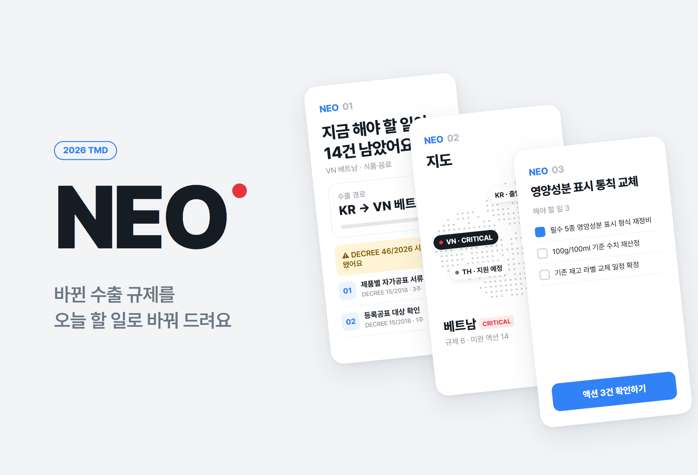
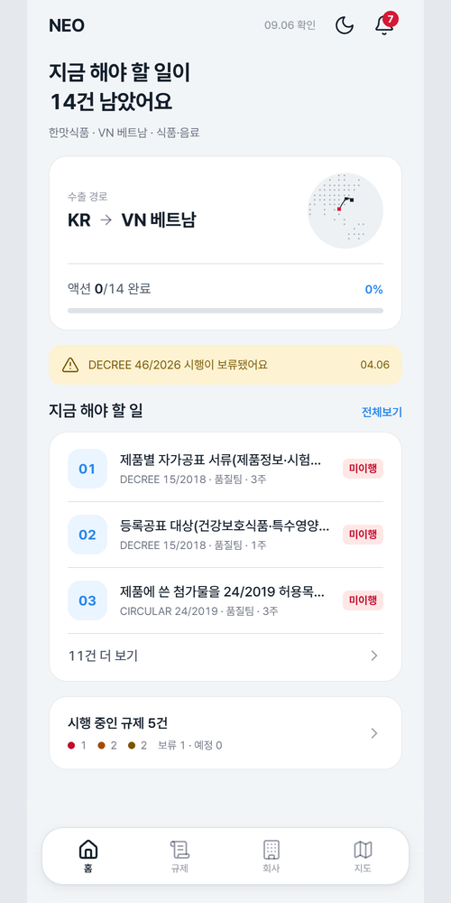
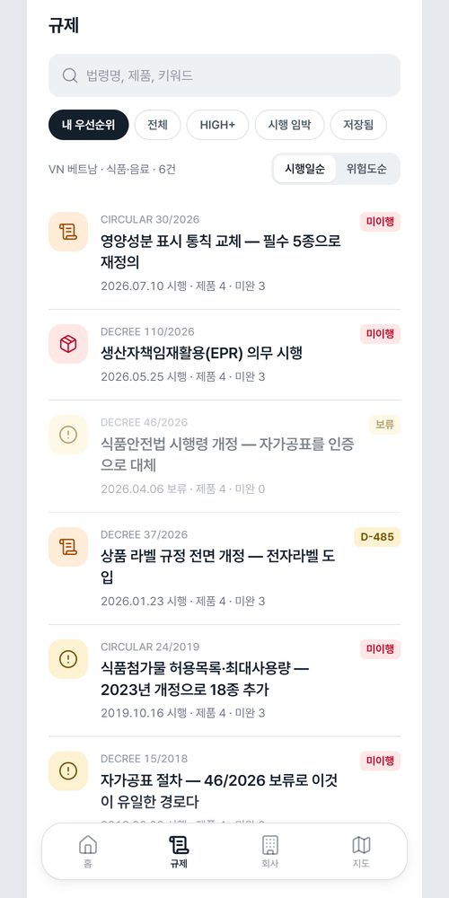
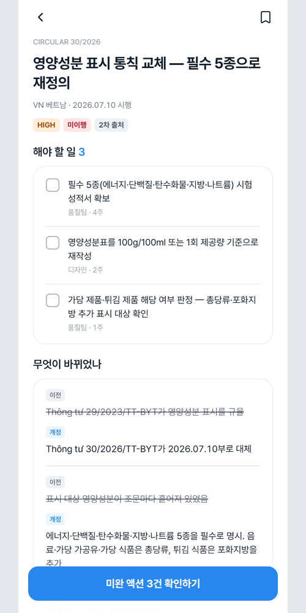
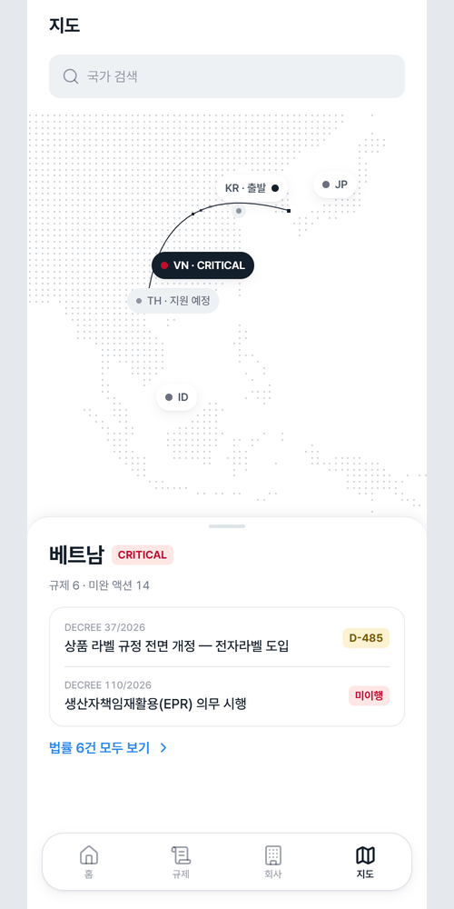
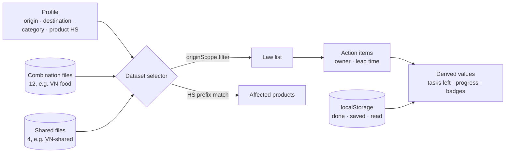

# Neo

<p align="center"></p>

> A PWA that turns overseas export regulations from "this law changed" into "so here is what you have to do." 61 laws and 174 action items were cross-checked by hand, and once installed, every screen opens even with no network connection

---

## 1. Project Overview

| Item | Details |
|---|---|
| Project | Neo (a PWA for dealing with overseas export regulations) |
| One-line Summary | Lets the export manager at a small or mid-sized exporter with no legal or regulatory team check and complete "does this hit our product → what, by when, by whom" without reading the legal text |
| Period | 2026.09.05 ~ 2026.09.10 (repository created → v1.0.0 → full v2.0 design overhaul the same day, v2.0.4) |
| Team | Solo project |
| My Role | Problem definition, law research and building the cross-checked dataset, and all of the design, implementation and deployment |
| Contribution | 100% (every commit in the repository is mine) |

Even after the goods are loaded onto a ship, an export isn't done until it clears the destination country's regulations. Regulations are split by country and by product, the originals are in Vietnamese, Japanese and Indonesian, and they change without notice. Large companies have a team for this; small and mid-sized companies don't. The export manager usually handles quality or sales as well and has no time to read legal text. Yet a mistake comes back as a customs rejection, a recall or a fine.

There is no shortage of information. Laws are published in official gazettes, and there are plenty of legal newsletters. What you can't find anywhere is the verdict: "so does this hit our product?" What this app sells is not information but conversion. **Legal text → whether it applies to our product → what, by when, by whom.**

## 2. Tech Stack

| Category | Technology | Why |
|---|---|---|
| Framework | Next.js 16 (App Router) · React 19 · TypeScript | All 61 law detail pages are pre-generated statically, so it deploys without a server |
| Data | 19 static JSON files + `localStorage` | The laws are a human-verified dataset, so no server is needed. Only the profile, completed actions and saved laws live in the browser |
| Map | `d3-geo` · `topojson-client` (original script ported to npm) | Map data is bundled as static files, which removed the CDN dependency. The globe renders even offline |
| Styling | Tailwind CSS 4 · design tokens (`--tds-*`) · Pretendard | Switched to a Toss Design System (TDS) base in v2.0. Light by default, dark optional |
| PWA | Hand-written service worker · web manifest | Designed the precache and runtime cache myself, with no framework plugin |
| Validation | Custom data integrity checker (`scripts/check-data.mjs`) | JSON doesn't go through type checking, so references are checked separately |
| Deployment | Vercel | Static output |

There are only five runtime dependencies: `next` · `react` · `react-dom` · `d3-geo` · `topojson-client`. No UI library and no bottom sheet library. The decision to drop CDN dependencies came from the offline requirement.

## 3. Key Features & Contributions

<p align="center">
  
  
  
  
</p>
<p align="center"><sub>Captured from a local build, set up with the sample company included in the repository (Hanmat Foods, Korea → Vietnam, food & beverages). From left: Home · Regulation list · Law detail · Map</sub></p>

### Implemented Features

- **4-step setup**: Pick the origin country → destination country → product category → product list (HS codes). This profile determines the data on every screen.
- **Home**: Shows the number of remaining actions (e.g. "You have 14 things left to do"), the export route, action progress, alerts for laws on hold, the to-do list and the number of regulations in force. Every number on the screen is computed from the data.
- **Regulation list**: Filters for priority, all, HIGH and above, taking effect soon, and saved; sorting by effective date or by risk. Each law shows its number, title, effective date, number of affected products, number of open actions and a status badge (`미이행` ("not done") · `D-485` · `보류` ("on hold")).
- **Law detail**: Badges for risk level, status and source grade (primary/secondary). "What to do" is shown as a checklist, with the responsible department and lead time attached. "What changed" compares the previous and amended text side by side.
- **Map**: The route from the origin country to the destination and the risk level per country. Unsupported countries stay on the map, dimmed.
- **Company & alerts**: Company info and product list, deadline and on-hold alerts.
- **PWA**: Install guide, offline bar, light/dark theme toggle (choice remembered, 200ms transition).

### Data Design

- **The unit is the combination.** Even within one country, the axis of regulation differs by product. For Vietnamese cosmetics the hurdle is product notification; for Japanese cosmetics it's formulation and registration. So the data is split into 12 combination files (4 destinations × 3 product categories) plus 4 shared per-country law files.
- **The HS code is the actual matching key.** A law holds a list of prefixes of varying length, such as `["16","17","18","19","20","21","2202"]`, and it applies if the product's HS code starts with one of them. It narrows only as far as the law does, without inventing subdivisions that don't exist.
- **The origin country splits requirements too.** Preferential tariffs under the Korea–US FTA only apply when the origin is Korea. These are filtered out with `originScope`, and the number of excluded laws is noted in one line below the list. Whatever changed is reported as changed, and whatever stayed the same is reported as unchanged.
- **Risk** is scored as sanction severity × urgency × share of our products affected, but the screen shows only four level labels. The manager needs an order, not a multiplied score.

### Seven Research Rules

| # | Rule |
|:---:|---|
| 1 | Leave unknowns blank. Don't make anything up |
| 2 | Cross-check against at least two independent sources. Record it only when the number, effective date and key changes all match |
| 3 | Distinguish primary sources (official gazettes, competent ministries) from secondary sources (law firms, legal databases, testing and certification bodies), and show which is which on screen |
| 4 | The `최종 확인` ("last checked") date is the day that URL was actually opened |
| 5 | Enter only deadlines stated in the law. Don't back-calculate to make the numbers on screen work |
| 6 | Confirm that a date applies to our product category before entering it |
| 7 | Record excluded laws along with the reason |

### Main Tasks

- Researched and cross-checked the laws for 4 countries × 3 product categories; recorded exclusion reasons and unconfirmed values
- Data schema (combination files + shared files), profile → dataset selector, derived-value calculations
- Data integrity checker, service worker and offline design, verified by actually testing it
- Built 8 screens; full v2.0 design overhaul (tokens, shared components, copy unified in one polite, friendly register)
- Checked on real devices and fixed defects in the iOS home-screen app

## 4. Results & Metrics

### Quantitative Results

| Item | Result |
|---|---|
| Data | 16 combinations (12 combinations + 4 shared) · **61** laws · **174** action items |
| Sources | Primary **47** / secondary **14** · status: 60 in force · 1 on hold |
| Integrity | Checker result: "referential integrity passed" (re-run 2026.09) |
| Offline | With the server down, all 6 screens + settings + all 61 law detail pages open |
| Accessibility | 44px touch targets (checked on all 6 screens), lowest text contrast on risk color fills 5.05:1 (measured on v1) |
| Scale | 7,393 lines of code, 5 runtime dependencies, 0 CDN dependencies |
| Real users · user testing | (to be confirmed) |

| Destination \ Category | Food & Beverages | Cosmetics | Electrical & Electronics |
|---|:---:|:---:|:---:|
| VN Vietnam | 4 | 4 | 5 |
| JP Japan | 5 | 5 | 4 |
| US United States | 5 | 5 | 4 |
| ID Indonesia | 4 | 4 | 4 |

On top of these come 8 shared laws (VN e-labeling · EPR, JP packaging identification marks · recycling, US forced-labor presumption exclusion · country-of-origin marking · Korea–US FTA, ID halal certification).

### Qualitative Results

- **Built a dataset that says what's missing.** In the research documents, the excluded laws and their reasons (still at draft stage, the obligation falls on the importer, already covered by another law) and the unconfirmed values left blank take up more space than the laws that were adopted.
- **Turned every number on screen into a derived value.** Numbers baked into the design deliverables, such as `대응 필요 3건` ("3 need action") and `규제 5 · 미완 액션 10` ("5 regulations · 10 open actions"), were all replaced with calculations, so checking off a single action never leaves a wrong number anywhere.
- **Removed made-up values from the screens.** `D-45` · `D-14`, drawn to fit the mock data, were thrown out, and badges are built only from real dates. With no server, the "last synced" time was removed too. All the app can say is "when these sources were last opened."
- **The whole design could be replaced in one day.** Thanks to the rule of using only tokens for color, corner radius and shadow, the v2.0 overhaul rewrote the shared components and all 8 screens and unified the copy in one polite register.

### Known Limitations

- **There is no legal analysis engine.** Verification covered the consistency of screens and flows and the data conversion methodology, nothing more. It doesn't interpret legal text automatically, and there is no screen that pretends to.
- **There is no data update path.** When a law changes, a person has to research it again and commit.
- **The scope is narrow.** 4 countries × 3 product categories, and Korea is the only origin country with data. The cost of expanding lies more in research than in code.
- **No user testing was done.** The success criterion, "a new user reaches one law affecting their company and one action within 60 seconds," was only checked indirectly by counting the steps in the screen flow.
- **Zooming is blocked.** This was a choice to make it feel like an app, and it violates WCAG 1.4.4 (resize text to 200%). I softened it with a 15px minimum for body text and documented how to undo it.
- **Alerts exist only inside the app.** Even as a deadline approaches, you only see it if you open the app. Carrying "so here is what you have to do" all the way through needs a path that reaches people without opening the app.

## 5. Troubleshooting

### ① Only screens I had already opened worked offline

**Problem** The plan said to cache `data/*.json`. But when I ran the production build, opened only the home screen and then took the server down, the other screens went blank with chunk load failures.

**Cause** There were two layers. First, the JSON was statically imported and sat inside JS chunks, so there was no separate URL to cache. Second, cache-first runtime caching only stores what was actually requested. So only screens already opened while online would open offline.

**Solution** I solved it without a build hook. The static chunk references are extracted from the precached document HTML and cached along with it. No build manifest is needed to learn the hashed file names. Route documents don't have fixed URLs, so the app tells the service worker about them. Client navigation payloads have query hashes that change with every build, so they go into a separate cache from the documents.

**Result** After opening home once and taking the server down, all 6 screens, settings and all 61 law detail pages open, and even the map renders. I made "actually cut the connection" the verification method itself.

### ② The numbers in the design deliverables were wrong

**Problem** The design artboards had numbers like `규제 5 · 미완 액션 10` and deadlines like `D-45` · `D-14` drawn in.

**Cause** They were values written in by hand to fit the mock data. When I checked the math, the total number of actions for those 5 laws was 9, not 10. The deadline badges weren't real dates either.

**Solution** I made every number on screen computed from the data, and set rules so that deadline badges are only built from real dates.

| Condition | Badge |
|---|---|
| The law states a deadline | Countdown to that date |
| No deadline, but already in force | `미이행` ("not done") |
| Not yet in force | Countdown to the effective date |
| The law is on hold | No badge |

The second row is subtle. For a standing obligation, labeling it "overdue" once the effective date has passed would be wrong. No date was missed; it is an obligation already in effect that hasn't been met yet.

**Result** When the user checks off an action, the numbers on home, the list, the detail page and the map change together. They are all derived values, so they can't be wrong as long as the calculation is right.

### ③ The date written in the law wasn't the date for our product category

**Problem** I was about to enter a date from a law's transitional provisions directly as a deadline.

**Cause** That date was the end of the grace period for a different product category. Transitional provisions can have different end dates for each product. Had I entered it as-is, the manager would have worked toward a deadline that doesn't exist.

**Solution** I added "Confirm that a date applies to our product category before entering it" (rule 6) to the research rules. Deadlines I couldn't confirm are left blank, and the fact that they were left blank is written in the research documents.

**Result** Every deadline in the dataset is a date confirmed for that product category. Automated collection can scrape legal text, but it can't judge "is this date for our product category?", so on this problem it is less accurate than a person.

### ④ The bottom of the tab bar got cut off in the home-screen app

**Problem** It was fine in the browser, but once installed to the iPhone home screen and opened, the bottom tab bar labels and the home indicator area were pushed off the screen. A gray strip was left above the white-background screens.

**Cause** In home-screen app mode, iOS measures viewport units (`lvh`) as the whole screen including the status bar, but the webview starts below the status bar. The frame was longer by that difference. The app can't draw the status bar area; iOS paints it with `theme-color`, and that value was fixed to a single light gray.

**Solution** Instead of guessing with viewport units, `window.innerHeight` is measured before the first paint and stored in `--app-h`. iOS doesn't shrink `innerHeight` when the keyboard comes up, so the frame doesn't shift while typing. `theme-color` now follows the background color of each screen as you navigate (in both light and dark).

**Result** The tab bar is fully visible in the installed app too, and the status bar and the screen continue as one color (v2.0.4).

## 6. Links & Deliverables

| Category | Link |
|---|---|
| GitHub Repository | [stx4R/Neo](https://github.com/stx4R/Neo) (private) |
| Live URL | https://neo-tau-six.vercel.app |

### Data Flow



```ts
interface Dataset {
  profile, today, country, category
  laws, actions, products     // 출발국 필터를 이미 통과한 것
  hiddenByOrigin: number      // originScope로 빠진 법령 수
  empty: boolean              // 이 조합에 데이터가 아예 없는가
}
```

Screens don't read a global like "the current dataset"; they receive this value as an argument. `null` means "not known yet," which is different from "no data." The profile lives in `localStorage`, so it can't be read during the hydration render. For that one frame, the screen draws a skeleton instead of filling the missing data with zeros.

---

+++

## Customer Journey Map

The user is the export manager at a small or mid-sized exporter who also handles quality and sales.

| Stage | What the user does | What the user thinks | How the app responds |
|---|---|---|---|
| Setup | Picks the destination, category and products | "What was our HS code again?" | Picking a category fills in representative products and HS codes as defaults |
| Overview | Opens home | "Does anything apply to us?" | One sentence, "You have 14 things left to do," plus a progress bar |
| Priorities | Looks at the regulation list | "What do I do first?" | Sorting by risk and effective date, `미이행` · `D-485` badges |
| Action | Checks off tasks on the law detail page | "Whose job is this?" | A responsible department and lead time for every task |
| Confidence | Checks the sources | "Can I trust this?" | Primary/secondary source badges, last-checked date |
| On the move | Opens it again on site | "I have no internet right now" | Once installed, every screen opens offline |

## Adaptive Design

- Checked at three widths, 402 · 375 · 1400, while switching between combinations. On wide screens the mobile-width frame stays centered.
- Safe areas are read with `env()` instead of fixed values. In a browser tab the safe area is 0, and the status bar strip is supposed to disappear then. Faking a status bar that isn't there just leaves an empty strip.
- In the home-screen app, the screen height uses the measured value (Troubleshooting ④), and the status bar color is matched to each screen.
- Light is the default; dark is turned on with the button at the top of home. The chosen theme is remembered and applied before the first paint, so there is no flash.

## Motion Design

- Switching themes crossfades the colors over 200ms.
- For the one frame before the profile is read, a skeleton pulses. With `prefers-reduced-motion`, the pulse is turned off.
- On the map, the route from the origin country to the destination is drawn as a line, and overlapping country markers shift aside to make room for each other.

## Security Risk Management (DREAD)

There is no server and no account, and user data never leaves the device. The biggest risk in this app isn't hacking but **wrong information that looks like fact**. So information integrity is what gets treated as the threat.

| Threat | Damage | Reproducibility | Exploitability | Affected Users | Discoverability | Mitigation |
|---|---|---|---|---|---|---|
| Showing another product category's date as the deadline | High | Medium | — | Users of that combination | Low | Research rule 6 — **Applied** |
| Continuing to show old data after a law is amended | High | High | — | All | Medium | Last-checked date shown per source. An update procedure is **Remaining Work** |
| Making a secondary source look like a primary one | Medium | Low | — | All | Low | Source grade badge — **Applied** |
| A broken reference making an action silently disappear | Medium | Medium | — | Users of that law | Low | Integrity checker (fails if one action is linked to two laws or is orphaned) — **Applied** |

The Exploitability column is left blank. The threats in this table don't come from someone abusing the app; they come from errors in the research and display process.
