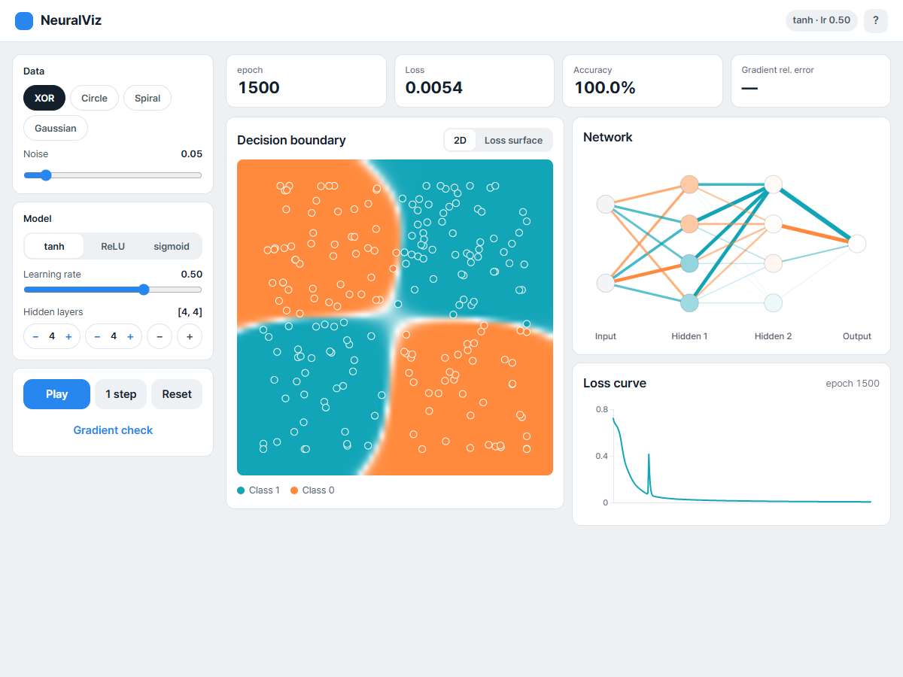
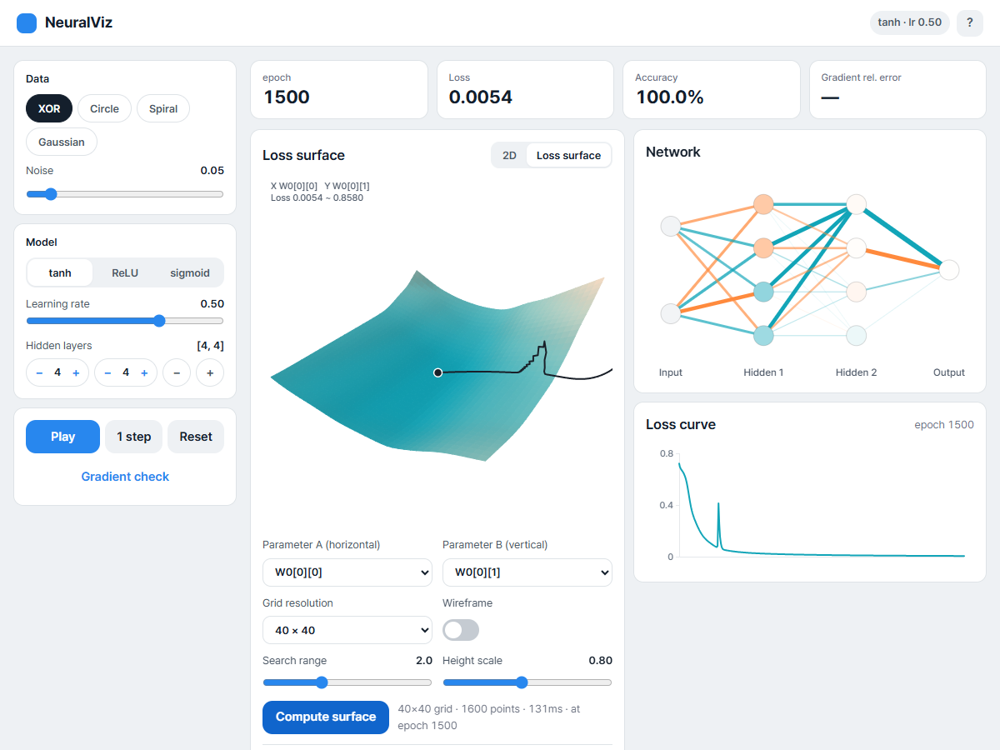
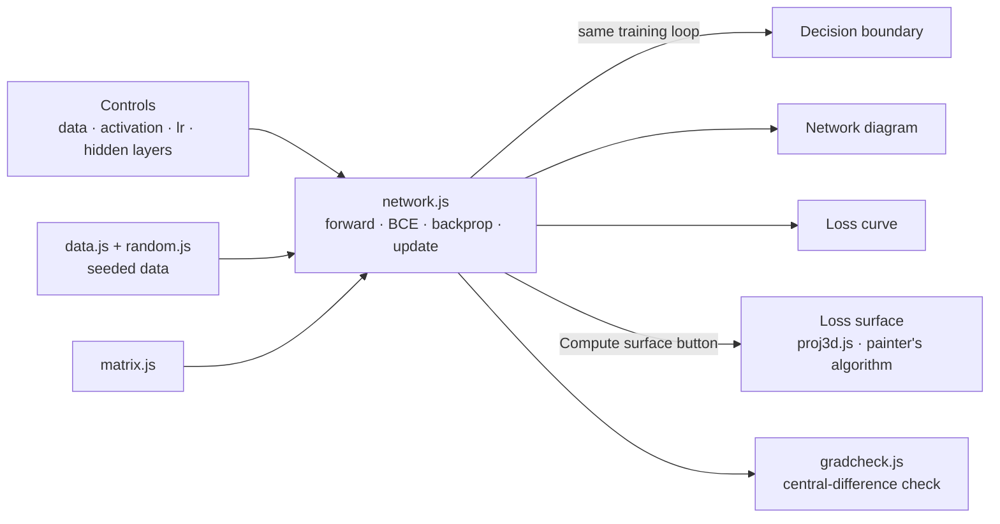

# NeuralVisualizer

<p align="center"></p>

> 「NeuralViz」, a teaching tool that implements everything from matrix operations to backpropagation and 3D projection with no external libraries, and shows a multilayer perceptron learning in the browser through four views

---

## 1. Project Overview

| Item | Details |
|---|---|
| Project | NeuralVisualizer (app name 「NeuralViz」) |
| One-line Summary | Change the data, activation, learning rate or hidden layers, and the decision boundary, network diagram, loss curve and 3D loss surface all update in real time, driven by the same training loop |
| Period | 2026.09.09 ~ 2026.09.11 (v1.0.0 → v1.0.6) |
| Team | Solo project |
| My Role | Design; implemented the neural network engine, 3D renderer, visualizations and UI; ran the verification experiments |
| Contribution | 100% (all 7 commits in the repository are mine) |

In neural network classes, backpropagation is taught through equations. But equations alone make it hard to see why hidden layers are needed, why a large learning rate diverges, or why ReLU and sigmoid converge differently. This tool lets you compare those differences directly on screen.

It uses no external libraries at all, because the point of this project is "implement it yourself." With a tensor library, backpropagation becomes one line and whatever you learned disappears.

## 2. Tech Stack

| Category | Technology | Why |
|---|---|---|
| Language | Vanilla JavaScript (ES modules) · HTML · CSS | Opens from a single `index.html` with no build tools. I didn't want the toolchain getting in the way of "implement it yourself" |
| Numerics | Hand-written `number[][]` matrix operations (float64) | A dimension mismatch throws with the shapes printed. JS numbers are float64 by default, so a gradient checking threshold of 1e-7 is usable |
| Rendering | Canvas 2D | Even the 3D view is drawn without WebGL, computing rotation, perspective projection, Lambert lighting and the painter's algorithm by hand |
| Randomness | mulberry32 + Box–Muller | The same seed gives the same data and the same initial weights, so experiments can be reproduced |
| Deployment | GitHub Pages | Static files only |

## 3. Key Features & Contributions

<p align="center"></p>
<p align="center"></p>
<p align="center"><sub>Captured locally after training XOR · [4,4] · tanh · lr 0.5 for 1500 epochs. Top: decision boundary. Bottom: loss surface along two weight directions, with the training path</sub></p>

### Implemented Features

- **4 datasets**: XOR (quadrants), circle, spiral, and two Gaussian clusters. Contrasting data that can be split by a line with data that can't shows why hidden layers are needed. Noise is adjustable.
- **Model settings**: Change the hidden activation (tanh / ReLU / sigmoid), the learning rate, the number of hidden layers and the neurons per layer. The output is fixed to sigmoid and the loss to binary cross-entropy. Initialization uses Xavier for tanh and sigmoid, and He for ReLU.
- **Decision boundary**: 3,600 grid points are computed in a single forward pass and painted as a heatmap. Data points are filled with their label color and outlined in white, so correctly classified points blend into the background and only the wrong ones stand out.
- **Network diagram**: Line thickness is weight magnitude, color is sign, circle fill is bias.
- **Loss curve**: Once there are more points than the width, they are thinned out evenly before drawing.
- **3D loss surface**: Pick two parameters, sweep a 40×40 grid around their current values, and draw the training path on top. Drag to rotate it.
- **Gradient check button**: Compares the backprop gradients against central-difference numerical derivatives and shows the relative error.

### Implemented Equations

```
Forward    z[l] = W[l]·a[l-1] + b[l],   a[l] = f(z[l])
Loss       J = -(1/m) Σ [ y·log(a) + (1-y)·log(1-a) ]      a clipped to [1e-12, 1-1e-12]
Backprop   δ[L] = a[L] - y
           δ[l] = (W[l+1]ᵀ·δ[l+1]) ⊙ f'(z[l])
           dW[l] = (1/m)·δ[l]·a[l-1]ᵀ,   db[l] = (1/m)·Σ δ[l]
3D         Ry(yaw) → Rx(−pitch) composed, perspective s = f / (z + d), lighting I = 0.35 + 0.65·max(0, n·l)
```

The output-layer delta simplifies to `a - y` because BCE's `∂J/∂a = (a-y) / (a(1-a))` and the sigmoid's `σ'(z) = a(1-a)` are multiplied together by the chain rule and the denominator cancels out.

### Main Tasks

- Implemented matrix operations, the MLP (forward pass, BCE, backprop, update), data generation and the seeded RNG
- Gradient checking and ReLU kink detection (Troubleshooting ① and ② below)
- Renderer with 3D projection, normals, Lambert lighting and the painter's algorithm
- The four visualizations and controls, wiring up the training loop, the v1.0.6 UI reorganization
- Experiments (hidden layers and XOR, learning rate, convergence per activation, capacity limits on the spiral) and writing up the README

## 4. Results & Metrics

### Quantitative Results

| Item | Result |
|---|---|
| External libraries | 0 · about 2,800 lines of code |
| Engine tests (`tests/run.html`) | **5/5 passed** (re-run 2026.09). Gradient relative error: tanh 9.622e-10, ReLU 2.788e-10, sigmoid 1.732e-10 |
| Gradient checking sweep | 4 datasets × 3 activations × 7 layer configurations = 84 combinations, repeated 3 times (252 runs) + 4 after training, 0 failures, max relative error 1.2e-8 (as recorded in the README; the sweep script is not in the repository) |
| 3D verification | Length-preservation error after rotation 8.88e-16, `R(θ)R(-θ) = I` error 2.22e-16. 0 depth inversions from the painter's algorithm across 36 yaw angles × 31,408 pixels |
| XOR training | [2,4,4,1] tanh, loss 0.0043 · accuracy 100% after 2000 epochs (265ms) |
| Use in real classes / by users | (to be confirmed) |

**Convergence by activation** (XOR with 200 points, [2,4,4,1], lr 0.5, 2000 epochs, median over seeds 1–8)

| Activation | Reached loss < 0.1 | Epoch reached | Final loss | Accuracy |
|---|---|---|---|---|
| tanh | 8/8 runs | 226 | 0.0043 | 100% |
| ReLU | 7/8 runs | **162** | 0.0105 | 100% |
| sigmoid | **0/8 runs** | — | 0.3040 | 87.0% |

ReLU is the fastest, but in 1 run out of 8 it never reached the threshold because of dead units. Sigmoid's derivative peaks at 0.25, so after two hidden layers the gradient shrinks to 1/16 or less, and it didn't reach the threshold even once.

### Qualitative Results

- **The 2D and 3D views state the same fact in different ways.** Remove every hidden layer and train on XOR, and the loss stalls at 0.6849 (near ln 2 ≈ 0.6931) with 49.5% accuracy. In the decision boundary this shows up as a single straight line wandering between the points; on the loss surface it is a flat dish whose lowest point, 0.6852, is effectively the same as the current loss. Looking at the surface too makes it obvious that "running it longer won't help."
- **Measured which part of the spiral untangles first.** `[6,6]` tanh reaches 94.5% at 5,370 epochs. Broken down by radius band, the outer region is sorted out first, already at 81% by epoch 500, while the middle band is the slowest, still in the 20% range at epoch 2000. The gap between the two arms is constant, but the curvature grows toward the center, and a handful of hidden units can't produce enough bends. The 20% range doesn't mean it can't classify those points; it means it is classifying them the opposite way.
- **Verified by "measured," not "looks right."** Outputs before and after refactoring were compared byte by byte, and neuron circle overlap was measured in pixels by scanning the canvas alpha channel (`[2,8,8,1]` within 280px: 26px diameter, 3px minimum gap).

### Known Limitations

- **The loss surface is a 2D slice.** Only the two chosen parameters move; the rest are fixed at their current values. In actual training the rest move too, so the path drawn on the surface is an approximation.
- **Once training has run long enough, the gradient check can exceed the threshold.** While writing this report, I trained XOR · [4,4] · tanh for 1500 epochs and pressed the check button: the relative error was 2.8e-7, over the threshold (1e-7), and it showed "failed." It looks like once the loss drops to around 0.005, the gradients themselves become small, so floating-point rounding takes up a larger share of the relative error (a guess, to be confirmed). The check needs to look at absolute error alongside it, or scale ε to the gradient magnitude.
- **The 252-run sweep can't be reproduced.** The repository only holds 5 tests. The sweep script has to be committed too before anyone else can verify the numbers in the README.
- **The painter's algorithm relies on the heightfield assumption.** Extending it to shapes with overhangs would need a z-buffer or cell splitting.

## 5. Troubleshooting

### ① Only ReLU failed gradient checking

**Problem** tanh and sigmoid passed with relative errors around 1e-10, but ReLU alone failed at 2e-2.

**Cause** The problem was on the numerical derivative side, not in backprop. ReLU isn't differentiable at `z = 0`. With biases initialized to 0, a dead unit whose inputs from the previous layer are all 0 ends up with z of exactly 0. At that point the central difference straddles the kink and averages the left derivative 0 and the right derivative 1, so the numerical gradient itself is wrong. I confirmed this with a controlled experiment. Sweeping 30 seeds, all 17 with `min|z| = 0` failed and all 13 with `min|z| > 0` passed. There were no exceptions.

**Solution** Before checking, the code now decides whether "this point is far enough from a kink." If the point sits on a kink, it moves to a kink-free seed, measures again, and records that on screen and in the log.

**Result** Measured only at points away from kinks, the relative error drops to the 1e-8 to 1e-10 range. The test log keeps the record as is: "Seed 3 point hits a kink → rechecked with kink-free seed 1 → 2.788e-10 passed."

### ② The kink check was too optimistic

**Problem** Even with the check in place, 2 of the 252 runs failed with a max relative error of 5.17e-4.

**Cause** The first version of the check only considered that "nudging a parameter by ε moves the next layer's z by at most `ε·max|a|`." But a perturbation that starts in an earlier layer gets amplified by the weights as it passes through later layers.

**Solution** I changed it to accumulate the perturbation bound layer by layer.

```
R[l] = ‖W[l]‖∞ · R[l-1] + ε · max(|a[l-1]|, 1)
```

This is a Lipschitz bound that uses the fact that tanh, sigmoid and ReLU all have derivatives with absolute value at most 1. If `min|z| > R[l]` at every layer, no parameter nudge can cross a kink.

**Result** The 2 remaining failures disappeared. I deliberately avoided the "if it fails, redraw the seed until it passes" approach. That approach will find a point that happens to pass even when there is a real backprop bug, which defeats the check. By first deciding whether a point is valid for measurement and keeping that separate from the result, a pass can be trusted, and the fact that a kink was hit isn't hidden either.

### ③ Can a 3D surface be occluded correctly without a z-buffer?

**Problem** Drawing the loss surface with Canvas 2D means handling hidden surfaces. A per-pixel z-buffer would be slow and would bloat the code.

**Cause** In general shapes, cyclic overlaps can occur, where cell A covers B while B also covers A, so simply sorting cells isn't safe.

**Solution** I relied on the fact that this surface is a heightfield on a grid viewed from above, so cyclic overlaps can't occur. Cells are sorted in descending order by the average depth of their four corners and painted from far to near (the painter's algorithm). I checked that assumption by measurement: for 36 yaw angles, at each of 31,408 pixels, I compared the painter's algorithm result with the actual nearest cell found by barycentric interpolation.

**Result** 0 depth inversions. The assumption that a single representative value per cell gives a total order holds for this shape.

## 6. Links & Deliverables

| Category | Link |
|---|---|
| GitHub Repository | [stx4R/NeuralVisualizer](https://github.com/stx4R/NeuralVisualizer) (private) |
| Live URL | https://stx4r.me/project/NeuralVisualizer/ |
| Engine tests | `tests/run.html` in the repository (open it with a static server and check the console) |

### Structure



| File | Role |
|---|---|
| `src/matrix.js` | Matrix operations. A dimension mismatch throws with the shapes printed |
| `src/network.js` | The MLP itself |
| `src/gradcheck.js` | Compares the relative error between numerical and analytic gradients |
| `src/proj3d.js` | 3D rotation, perspective projection, normals, Lambert shading (pure functions) |
| `src/viz-*.js` | Decision boundary · network diagram · loss curve · loss surface |
| `src/main.js` | Controls, training loop, view switching |

---

+++

## Customer Journey Map

The user is a student learning about neural networks for the first time.

| Stage | What the user does | What the user thinks | How the tool responds |
|---|---|---|---|
| Start | Picks XOR and presses play | "What's moving?" | The decision boundary colors spread out and the loss curve drops |
| Experiment 1 | Removes every hidden layer | "Why isn't it working?" | The loss stalls at 0.69 and the surface is a flat dish |
| Experiment 2 | Raises the learning rate to 3.0 | "That should make it faster, right?" | The loss curve jumps around like a saw blade between 0.3 and 0.8 |
| Experiment 3 | Switches to sigmoid | "What difference does the activation make?" | With the same settings, the loss goes down far more slowly |
| Check | Presses gradient check | "Is this math even right?" | The relative error between the analytic and numerical gradients appears |

## Motion Design

- During training, all four views move together every frame, following the same training loop. The decision boundary starts out white (output 0.5) and splits into two colors. The background is white before training because Xavier initialization keeps the weights small, so the output sits at 0.5 across the whole range.
- The loss surface is rotated by dragging (pitch 5°~85°). It is only computed when the "Compute surface" button is pressed, so it doesn't slow down the training loop.

## Gesturing

- Drag the loss surface with a mouse or a finger to change the vertical axis (yaw) and the tilt (pitch). The top-down viewing angle is limited to 5°~85° so the surface never appears flipped over.

## Adaptive Design

- In v1.0.6, the controls that had been crammed into the top bar moved to cards on the left (data · model · playback), and the metric cards (epoch · loss · accuracy · gradient relative error) and the four visualizations were placed on the right.
