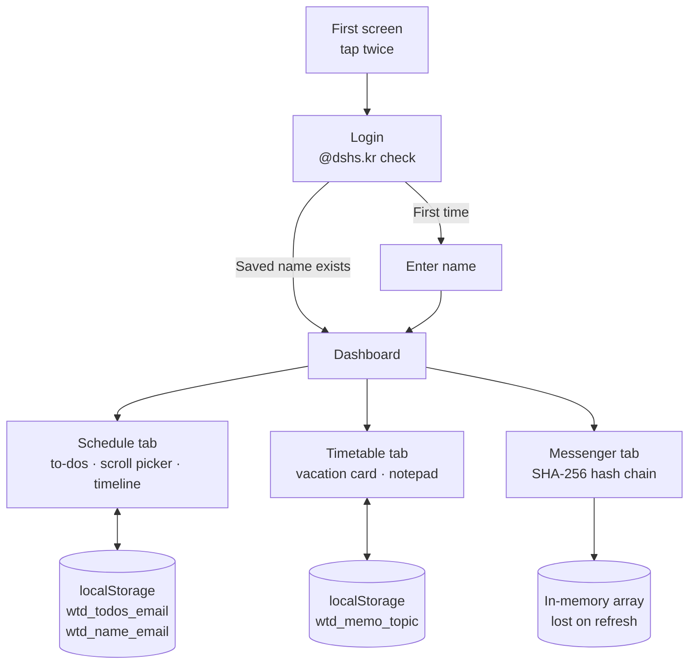

# Plan-ME

<p align="center"></p>

> 「WTD」, a scheduling app for students: sign in with a school email, manage to-dos with deadlines, and see firsthand how message tampering gets caught by a hash chain

---

## 1. Project Overview

| Item | Details |
|---|---|
| Project | Plan-ME (app name 「WTD」 — What To Do → All in One School Manager) |
| One-line Summary | A single-page app that manages each user's to-dos, deadlines and memos using nothing but browser storage, with no server, and demonstrates how a blockchain detects tampering through a SHA-256 hash-chain messenger |
| Period | 2025.12.19 (first version, 10 commits in one day) · 2026.01.05 (expanded to 3 tabs) · 2026.01.13, 2026.03.03 (comment cleanup) |
| Team | Solo project |
| My Role | Planning, screen design, full implementation |
| Contribution | 100% (all 13 commits in the repository are mine) |

It started as a to-do list that, true to its name, only answered "what do I have to do." The goal was to sign in with a school email, see only my own schedule, and tell at a glance when things were due. Over winter break I added timetable, memo and messenger tabs, widening the scope to an "all-in-one for school life," and built a blockchain-style hash chain into the messenger myself.

## 2. Tech Stack

| Category | Technology | Why |
|---|---|---|
| Frontend | HTML · CSS · Vanilla JavaScript (single `index.html`, 463 lines) | I wanted something you could open as one file and use right away. There's no framework; screen changes are handled with `section` elements and the tabs' `active` class |
| Storage | `localStorage` (keys per user email) | Data survives refreshes and revisits without a server or DB. Putting the email in the key keeps multiple accounts apart on one device |
| Hashing | Web Crypto API `crypto.subtle.digest('SHA-256')` | A standard browser API, so no library is needed. It produces the block hashes for the hash-chain messenger |
| Input UI | Custom scroll picker built on CSS `scroll-snap` | Year, month, day, hour and minute are picked by rolling them like a wheel. Instead of the native date input, which looks different in every mobile browser, I built a picker that matches the app's look |
| Font | Noto Sans KR (Google Fonts) | Korean readability |
| Deployment | None (to be confirmed) | The repository has no Pages setup |

## 3. Key Features & Contributions

<p align="center">
  
  
</p>
<p align="center"><sub>Captured from a local run. The logo image isn't included in the repository, so it has been masked.</sub></p>

### Implemented Features

- **Step-by-step first screen**: The first tap changes the intro text, and the second tap brings up the login button.
- **School account sign-in**: Only emails ending in `@dshs.kr` are accepted. A first-time account is asked for a name (nickname) once; after that the dashboard opens right away with the saved name.
- **To-dos + deadlines**: Typing a to-do expands the scroll picker. The deadline is set by rolling five columns (year 2025–2030, month, day, hour, minute), and items can be checked off and deleted.
- **Timeline**: Pulls out only the unfinished items and shows them with their due times.
- **Timetable tab**: A vacation-period info card and a vacation-plan notepad. The regular timetable only has a placeholder; the plan was to connect it to the NEIS API once school started.
- **Notepad**: Saves memos by topic.
- **Hash-chain messenger**: Each message becomes a block by SHA-256 hashing `이전 블록 해시 + 본문 + 시각` (previous block hash + message body + timestamp), and the block is linked into the chain. Each bubble shows the first few characters of the previous hash and its own hash.
- **Tampering simulation**: Pressing a button alters the first block's content, then marks that block "Hash mismatch" and every block after it "Chain broken," showing how tampering with one block spreads to everything behind it.

### Main Tasks

- Designed the screen flow (first screen → login → name registration → 3-tab dashboard)
- Designed the per-user storage structure (`wtd_name_{email}`, `wtd_todos_{email}`, `wtd_memo_{주제}` per topic)
- Implemented the scroll picker (column generation, initial position set to the current time, scroll position → value conversion)
- Implemented the SHA-256 hash chain and the tampering visualization
- Expansion overhaul on 2026.01.05 (256 lines added · 55 lines deleted)

## 4. Results & Metrics

### Quantitative Results

| Item | Result |
|---|---|
| First version completed | In one day (2025.12.19), 10 commits |
| Final size | `index.html` 463 lines, 0 external JS libraries |
| Features | 3 tabs (Schedule · Timetable · Messenger), 3 kinds of storage keys |
| Hashing | SHA-256 (256-bit) hash per block, linked through the previous hash |
| Actual users | (to be confirmed) |

### Qualitative Results

- Built a structure in which each user's data stays separate and survives refreshes, with no server.
- Narrowed a blockchain down to a single property, "each block carries the hash of the block before it," and implemented it myself. The screen can show that changing one earlier block throws off everything after it.
- By building my own scroll picker instead of using the browser's native input, I designed the conversion between scroll position and value myself.

### Known Limitations (as of the 2026.09 code)

- **Login is not authentication.** It only checks that the email ends in `@dshs.kr` and that the password field isn't empty. The password is neither verified nor stored.
- **"Sharing" and "P2P" exist in name only.** The notepad says "P2P synced," but all data lives only in that device's `localStorage`. Nothing is shared with anyone else.
- **Tamper verification doesn't recompute hashes.** Pressing the button unconditionally marks the first block and the blocks after it as broken. An early comment, removed on 2026.03.03, also stated that the hash should really be recomputed from the previous hash, body and timestamp and then compared, but because this was a simulation the detected state was forced. The messenger chain exists only in memory and disappears on refresh.
- **The NEIS timetable isn't connected.** There's only a notice.
- **The picker's day range ignores the month.** You can pick the 31st even in February.
- **The timeline has no dates.** It shows only times and doesn't sort by deadline, so items on different dates look like they fall on the same day (in the screenshot above, 09:30 is January 12 and 21:00 is January 7).

## 5. Troubleshooting

### ① Refreshing wipes out every to-do and the name

**Problem** In the first version, to-dos I added were gone as soon as the page was refreshed. The name was also asked again at every login.

**Cause** The to-do array and the name were held only in JavaScript variables. When the page reloads, the variables are reset.

**Solution** I saved them to `localStorage` and put the logged-in email in the key to separate users (`todos_{email}`, `name_{email}`). At login, if a name already exists for that email, the name prompt is skipped.

**Result** Schedules are still there when you come back on the same device, and several people can share one device without their lists getting mixed up.

### ② Turning a scroll position into a date value

**Problem** To let users roll the deadline like a wheel, I had to read "the value currently in the middle" from wherever the user stopped. Each column also had to start at the current time when it was first drawn.

**Cause** I added one empty cell at the top and bottom of each column so that the selected cell sits in the middle. That makes the index computed from the scroll position off by one from the actual child element's index. The initial position also has to be set after the column has been laid out on screen.

**Solution** I set the cell height to the same value (34px) in both CSS and script and read the value from child number `Math.round(scrollTop / 34) + 1`. The `+1` skips the empty cell at the top. The initial position is set 100ms after the column is attached, to `(현재값 - 시작값) × 34` (current value − start value), and `scroll-snap` makes it stop exactly at the center of a cell. So that rolling all the way to the end can't cause an error when the computed index falls out of range, I added defensive code during the expansion overhaul that returns `'00'` when the element doesn't exist.

**Result** All five columns start at the current time, and the value in the cell where the user stops is saved directly as a deadline in the `2026.01.09 18:00` format.

### ③ Storage keys could collide with other apps

**Problem** The initial storage keys had generic names like `todos_{email}` and `name_{email}`.

**Cause** `localStorage` is shared per origin (domain). On GitHub Pages, multiple apps in the form `stx4r.github.io/앱이름` (app name) share the same origin, so if another app uses a key with the same name, it overwrites the data.

**Solution** I prefixed every key with `wtd_` (`wtd_todos_{email}`, `wtd_name_{email}`, and later `wtd_memo_{주제}`).

**Result** Even when other apps are hosted on the same origin, this app's data stays inside its own prefix.

## 6. Links & Deliverables

| Category | Link |
|---|---|
| GitHub Repository | [stx4R/Plan-ME](https://github.com/stx4R/Plan-ME) (private) |
| Live URL | None (to be confirmed) |

### System Architecture



Hash-chain block structure:

```
Block 0: prev = 000…000 (64 chars)   hash = SHA256(prev + body + time)
Block 1: prev = hash of block 0      hash = SHA256(prev + body + time)
Block 2: prev = hash of block 1      …
```

---

+++

## Gesturing

- The first screen advances by tapping anywhere on it, not by pressing a button. The first tap changes the text, and the second brings up the login button.
- Deadlines are picked by swiping each column up and down instead of typing numbers. `scroll-snap` snaps the point where the finger lifts to the nearest cell.

## Motion Design

- On the first screen, outgoing text drifts down 20px as it fades, and the next line rises into place 0.4s later (0.6s transition).
- Switching tabs makes the content rise 10px from below and fade in over 0.3s.
- Checkboxes fill blue when pressed, and a bubble in which tampering is detected turns its left stripe and background red.

## Adaptive Design

- All tab content has a maximum width of 500px, designed around a phone screen. On wide screens it shows as a centered, phone-width layout.
- There's a fixed tab bar at the bottom and a fixed header at the top, and the body gets matching padding (`padding-bottom: 80px`) so the last card isn't hidden behind the tab bar.

## Security Risk Management (DREAD)

| Threat | Damage | Reproducibility | Exploitability | Affected Users | Discoverability | Assessment |
|---|---|---|---|---|---|---|
| To-do and message text is inserted as-is via `innerHTML`, so scripts can be injected (XSS) | Medium | High | High | Users of that device | High | The cheapest fix: switching to `textContent` is all it takes. Stored data never leaves the device, so the damage stays narrow |
| Login with no password check. Knowing someone's email is enough to open their list | Medium | High | High | Users of the same device | High | Add real authentication (e.g. school-account OAuth), or honestly relabel the login screen as "choose user" |
| Tamper verification doesn't recompute hashes, so the detection result doesn't reflect actual integrity | Low | High | Low | All | Medium | Replace it with a verification function that recomputes each block's hash and compares it with the stored value |

A sensible order of fixes is switching to `textContent` → verification that recomputes hashes → authentication. The first two take a few lines of code; authentication needs a server and changes the architecture.
