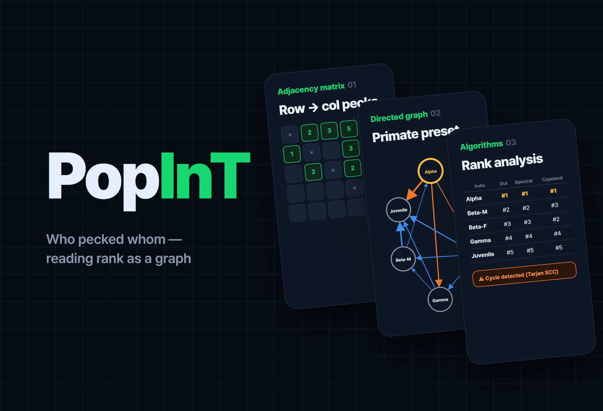
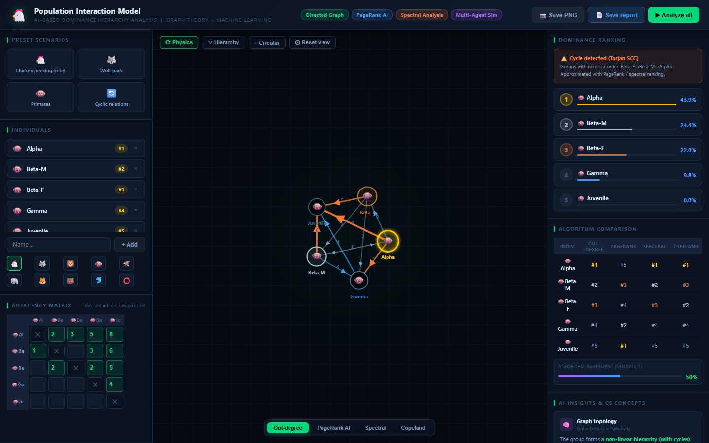
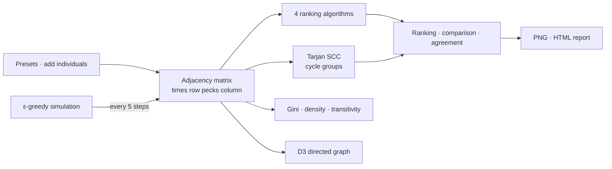

# PopInT.

> An educational analysis tool that turns the pecking order of an animal group into a directed graph and compares four ranking algorithms on a single screen

---

## 1. Project Overview

| Item | Details |
|---|---|
| Project | PopInT. (Population Interaction Model) |
| One-line Summary | Enter "who pecked whom, how many times" as an adjacency matrix, and it draws the graph and ranks the group four ways (out-degree, PageRank, spectral, Copeland), side by side |
| Period | 2026.06 (based on file dates; start date to be confirmed) |
| Team | (to be confirmed) |
| My Role | Planning, algorithm implementation, visualization, UI |
| Contribution | (to be confirmed) |
| Context | An educational tool connecting the dominance hierarchy unit in life science with graph theory (class or assignment context to be confirmed) |

Chickens in a flock have a fixed pecking order. Biology textbooks describe it as a chain: "A pecks B, and B pecks C." Real observation records are not that tidy. Birds peck each other back and forth, and rock-paper-scissors loops like A→B→C→A show up. This tool takes observed counts in a matrix, immediately shows the graph and the ranking, and lets you compare how the result changes with the ranking method.

There is no repository. This report is based on the single file left on my machine (`index.html`, 1,181 lines).

## 2. Tech Stack

| Category | Technology | Why |
|---|---|---|
| Structure | Single HTML file, Vanilla JavaScript | Opens from one file with nothing to install. Easy to hand out in class |
| Graph | D3.js v7.8.5 (force simulation · zoom · drag) | Gives direct control over directed edges, arrowheads, physics layout, zooming and panning |
| Export | html2canvas 1.4.1, Blob download | Saves the graph as a PNG at 2× resolution and downloads the analysis as a single HTML report |
| Algorithms | Written from scratch (no libraries) | Out-degree, PageRank (120 iterations), power-method eigenvector, Copeland, Tarjan SCC, Floyd–Warshall, Kahn topological sort |

## 3. Key Features & Contributions

Captured locally (primate preset). Left: individuals and the adjacency matrix editor; center: the directed graph; right: ranking, cycle warning and algorithm comparison table. The PageRank column of the comparison table shows the problem from §5-③ plainly

| Area | Features |
|---|---|
| Presets | Loads one of four scenarios in one click: chicken pecking order · wolf pack · primates · cyclic relations |
| Individuals · matrix | Add and remove individuals with a name (8 characters) and one of 10 icons, and enter "how many times the row pecks the column" in each cell. The full analysis re-runs 0.28 seconds after input |
| Graph | Three layouts: physics simulation · hierarchical (layers by longest path after a topological sort) · circular. Edge thickness scales with the count, and the top-ranked individual gets a glow effect. Drag, zoom (0.08–5×) and tooltips |
| Ranking analysis | Ranks individuals by the selected algorithm's score and shows it as bars. If there are cycles, Tarjan SCC finds them and flags an "unclear ranking group" |
| Algorithm comparison | Puts the rankings from all four methods in one table and shows the agreement between algorithms as bars |
| Insights | Classifies the group's hierarchy type (strongly linear · moderately linear · weak · with cycles) from rank inequality (Gini coefficient), graph density and the share of transitive relations |
| Simulation | Pairs two random individuals and picks the winner by past win rate, with 10% of outcomes random (ε-greedy). A log shows the ranking settling over 120 encounters |
| Export | Graph PNG, and an HTML report with the algorithm comparison table, adjacency matrix and concept explanations |

### Ranking Algorithms

| Algorithm | Score | What it measures |
|---|---|---|
| Out-degree | Total number of times I pecked | Amount of direct dominance |
| PageRank | Stationary distribution of a Markov chain where score flows along the edges (damping 0.85) | Indirect influence |
| Spectral | Principal eigenvector of the adjacency matrix (power method) | The value of beating strong individuals |
| Copeland | For each pair, whoever pecked more gets win 1 · draw 0.5 | Head-to-head record |

### Main Tasks

- Implemented the 4 ranking algorithms plus cycle detection (Tarjan SCC), transitive closure (Floyd–Warshall) and topological sort (Kahn)
- D3 directed graph with three layouts, and the adjacency matrix editor
- Four preset scenarios and the ε-greedy interaction simulation
- PNG and HTML report export

## 4. Results & Metrics

### Quantitative Results

These are the four presets re-run in Node while writing this report (2026.09). Each cell is the individual that algorithm ranked first.

| Preset | Out-degree | PageRank | Spectral | Copeland | Cycle detection |
|---|---|---|---|---|---|
| Chicken pecking order (perfectly linear) | Alpha | **Epsilon** (lowest-ranked) | Alpha (the other 4 score 0) | Alpha | None |
| Wolf pack | Alpha♂ | **Omega** (lowest-ranked) | Alpha♀ | Alpha♂ · Alpha♀ tied | Alpha♂ ↔ Alpha♀ |
| Primates | Alpha | **Juvenile** (lowest-ranked) | Alpha | Alpha | Alpha · Beta-M · Beta-F |
| Cyclic relations | C | B | B | A · C tied | All of A–B–C–D |

| Item | Result |
|---|---|
| Code | Single file of 1,181 lines, 2 external libraries (CDN) |
| Users · usage results | (to be confirmed) |

### Qualitative Results

- **Shows on screen that a ranking is not "a value with one right answer."** In the cyclic relations preset, first place splits by algorithm into C, B, and an A · C tie. The same observation record ranks differently depending on what you count as dominance.
- **Tied biology concepts and CS concepts together in one tool.** A dominance hierarchy is explained as a directed graph, circular rankings as strongly connected components, and rank inequality as a Gini coefficient.

### Known Limitations

- **PageRank ranks the hierarchy upside down.** In all three linear hierarchy presets, the individual pecked the most comes out on top (§5-③). Not fixed yet.
- **The spectral score collapses on a perfectly linear hierarchy.** With no cycles at all, as in the chicken preset, repeatedly multiplying the adjacency matrix drives everything to 0, so first place gets 100% and everyone else ties at 0.
- **The hierarchical layout can't form layers if there is even one cycle.** The topological sort stops at the cycle, so in the wolf preset all five wolves end up on a single layer.
- **"Graph density" goes above 100%.** It divides the summed peck counts rather than whether an edge exists, so the primate preset shows 205.0%.
- **The "Kendall τ" agreement isn't τ.** It's the share of concordant pairs (0–100%). To report it as τ, it needs to be converted to 2 × share − 1.
- The concept links in the insights panel (GNNs, Nash equilibrium, etc.) are explanatory text; the tool doesn't actually compute any of them.

## 5. Troubleshooting

### ① A cycle makes lining them up impossible

**Problem** A textbook ranking is just a topological sort: line them up by the rule "the pecker goes first." But with even one cycle like A→B→C→A, the topological sort never finishes. The same happens when top individuals peck each other, as in the wolf and primate presets.

**Cause** A topological sort is only defined on graphs without cycles (DAGs). Real observation records are full of mutual pecking and cycles.

**Solution** Separated ranking from cycle detection. The ranking comes from score-based algorithms that work on any graph, and cycles are found separately with Tarjan's algorithm as strongly connected components and flagged as "unclear ranking groups."

**Result** In the cyclic relations preset, all of A–B–C–D is shown as one group; in the wolf preset, the two alphas are. The ranking table still appears, but alongside it you can see which part of it not to trust.

### ② Looking at one algorithm's result, you can't tell when it's wrong

**Problem** Ranking scores depend on how the formula is set up, and with only one algorithm's ranking on screen there's no way to notice when it looks off.

**Cause** There's no ground truth for a ranking. Agreement between algorithms is effectively the only reference.

**Solution** Built a comparison panel that puts the four algorithms' rankings in one table per individual, and shows as bars the average share of rank pairs on which each pair of algorithms agrees.

**Result** This comparison table is what exposed the problem in ③. In the primate preset, out-degree, spectral and Copeland all put Alpha first, but PageRank alone puts Juvenile first, and agreement drops to 50%.

### ③ PageRank picked the weakest individual as No. 1 (found during re-verification, not yet fixed)

**Problem** While writing this report I re-ran the presets and found that PageRank ranked the lowest individual first in all three linear hierarchy presets (chicken Epsilon 43.1%, wolf Omega 43.3%, primate Juvenile 43.6%).

**Cause** The matrix direction is "row pecks column," but PageRank was implemented so that score flows from the pecker to the pecked. It carried over the original web-link assumption that "the more incoming arrows, the more important," so the individuals that get pecked the most collect the score.

**Solution** (not applied) Feeding in the transposed matrix, so that score flows from the pecked to the pecker, would fix it. For dominance relations, an edge should be read as "the loser points to the winner."

**Result** (to be confirmed) After the fix, the agreement and rankings of all four algorithms need to be checked again.

## 6. Links & Deliverables

| Category | Link |
|---|---|
| GitHub Repository | None |
| Live URL | (to be confirmed) |
| Deliverables | Single-file web tool `index.html`, export outputs (graph PNG · analysis HTML report) |

---

+++

## Customer Journey Map

The user is a student learning the dominance hierarchy unit.

| Stage | User action | User thought | Tool response |
|---|---|---|---|
| Start | Opens the file | "What am I supposed to enter?" | The chicken pecking order preset is already loaded |
| Explore | Switches presets | "Wolves have two alphas?" | The graph shape and cycle warning update immediately |
| Input | Enters observed counts into the matrix | "Let's try it with what we saw in class" | 0.28 seconds after input ends, the graph and ranking are recalculated |
| Compare | Tries the algorithm buttons | "Why does the ranking change?" | The comparison table and agreement show the differences |
| Submit | Saves the report | "I want to attach this to my assignment" | Downloads the PNG and the HTML report |

## Gesturing

- Dragging a node pulls the physics simulation along with it, and the wheel zooms from 0.08 to 5×. "Reset view" returns to the original position with a 0.45-second transition.
- Hovering over a node shows a tooltip with that individual's ranking score and out-degree and in-degree.
- Matrix cells are highlighted as you type as soon as the value is greater than 0.

## Motion Design

- The physics layout uses an edge length of 130 and a repulsion of −320, showing the individuals as they settle into place.
- The ranking list rises in with `fadeUp`, and the top-ranked individual glows with a glow filter.
- The simulation runs one encounter every 0.55 seconds and updates the matrix, graph and ranking every 5 encounters, so you can watch the hierarchy harden.

## Adaptive Design

- The three-column layout (input · graph · results) narrows both side panels at 1,280px and 1,060px, and hides the header tags at 1,060px and below.
- When the window is resized, the graph is redrawn at the new size.
- The cycle warning and the "intransitive relations" insight card appear only when there is a cycle.
