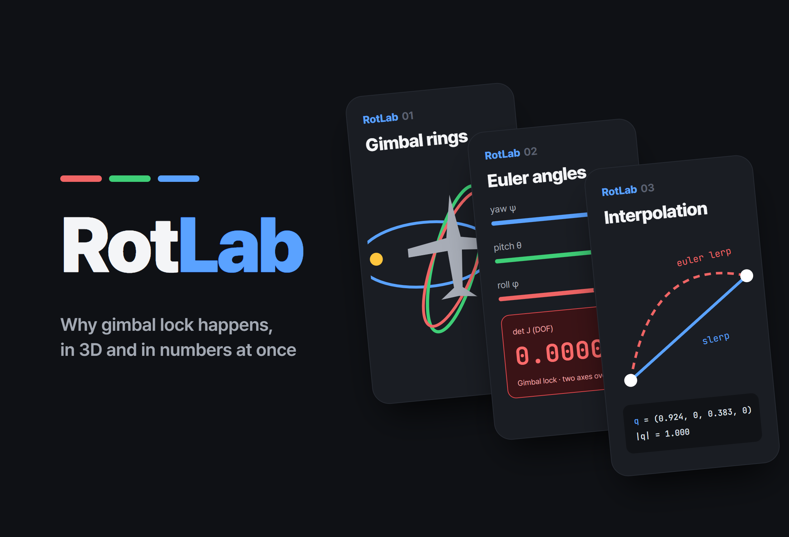
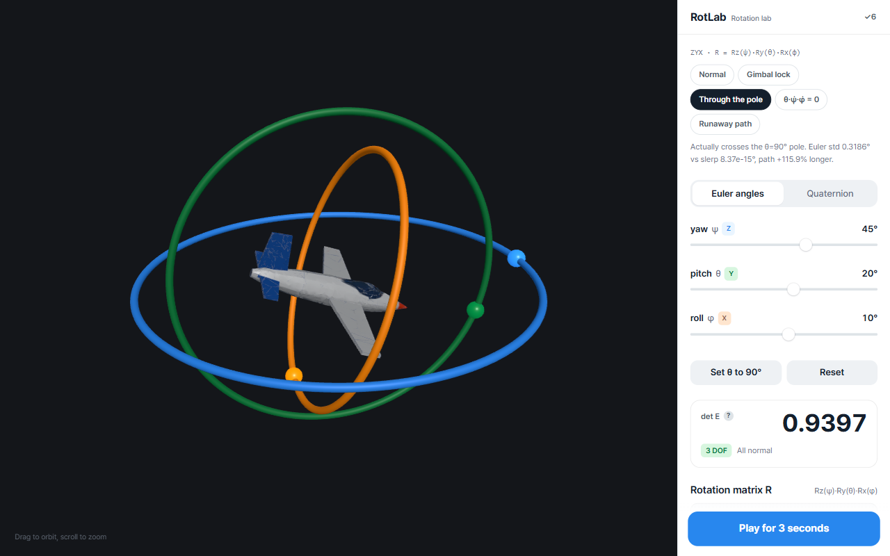
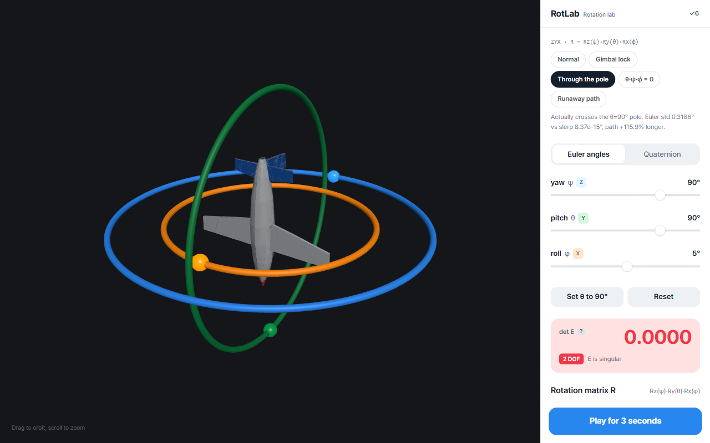
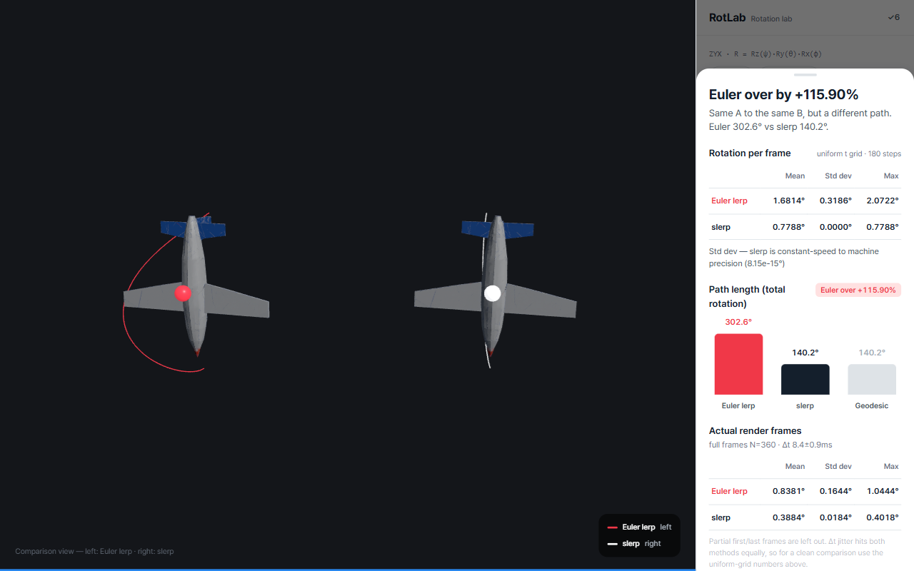
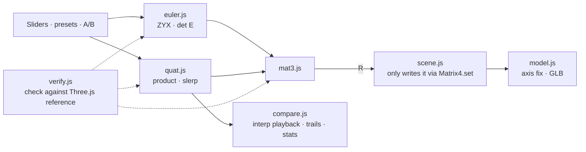

# RotLab

<p align="center"></p>

> A rotation lab that implements Euler angles, rotation matrices and quaternions from scratch, without libraries, and shows gimbal lock and the difference between interpolation methods in 3D and in numbers at the same time

---

## 1. Project Overview

| Item | Details |
|---|---|
| Project | RotLab (rotation transform lab) |
| One-line Summary | Spins an airplane model inside three gimbal rings and uses measured values to show a degree of freedom vanishing as θ approaches ±90°, and how much longer a path Euler linear interpolation takes compared with slerp |
| Period | 2026.09.09 (v1.0.0 → v1.1.3, one day) |
| Team | Solo project |
| My Role | Rotation math implementation, verification design, 3D scene and UI implementation, measurement methodology |
| Contribution | 100% (all 6 commits in the repository are mine) |

Anyone learning rotations meets Euler angles, rotation matrices and quaternions in that order. Textbooks tell you that Euler angles are intuitive but suffer from gimbal lock, and that quaternions interpolate smoothly. What they don't tell you is what exactly disappears in gimbal lock, or whether Euler interpolation being "not smooth" is a problem of speed or of path. You have to measure that yourself. This tool answers both questions with numbers.

Three.js is used only for rendering (scene, camera, lights, meshes). **Not a single line of library code goes into the rotation math.** The rotation-building methods of `THREE.Euler`, `THREE.Quaternion` and `Matrix4` are used only inside the verification module, as reference answers to check my implementation against.

## 2. Tech Stack

| Category | Technology | Why |
|---|---|---|
| Rotation math | Pure Vanilla JavaScript functions (`mat3` · `euler` · `quat`) | The implementation itself is the learning goal. Split into modules so it never mixes with the renderer |
| Rendering | Three.js r185 (bundled into a single file with esbuild, pinned in `vendor/`) | Handles only the scene, lighting and meshes. Works right after cloning with no `npm install`, and uses no CDN |
| Verification | Custom verifier + Three.js built-in rotations as reference answers (browser and Node runners) | An independently implemented answer already exists, so results can be compared component by component |
| 3D asset | GLB airplane model (generated with Meshy AI → remeshed) | Cut the original 3.07 million polygons down to 26,762 and downscaled the textures |
| Font · Deployment | Pretendard (bundled in the repo) · GitHub Pages | Static files only |

## 3. Key Features & Contributions

<p align="center"></p>
<p align="center">
  
  </p>
<p align="center"><sub>Captured locally. Top: normal attitude (det E 0.9397, 3 degrees of freedom). Bottom left: gimbal lock at θ=90° (the blue Z ring and orange X ring collapse into one plane, det E 0.0000, 2 degrees of freedom). Bottom right: pole-crossing interpolation result (Euler path excess +115.90%)</sub></p>

### Implemented Features

- **Attitude control**: Rotate the aircraft with yaw, pitch and roll sliders (Euler mode) or in quaternion mode. Three gimbal rings (Z blue · Y green · X orange) show each axis.
- **Instrument panel**: Shows the rotation matrix R, the determinant of the angular-velocity mapping matrix `det E = cos θ`, and the remaining degrees of freedom in real time. Switches to a warning color when `|det E| < 0.05`.
- **Gimbal lock demo button**: Checks the sign of θ, automatically picks the "pair that yields the same rotation", and prints three numbers: the match, a control, and the vanished direction.
- **Interpolation comparison**: Set attitudes A and B, then play Euler linear interpolation (red) and slerp (white) side by side for 3 seconds. Draws the trajectory of the nose tip and shows a result sheet with the mean, standard deviation and maximum of the per-frame rotation angle, the total rotation angle, and the excess over the geodesic.
- **5 presets**: Normal · Gimbal lock · Pole-crossing interpolation · θ̇·ψ̇·φ̇=0 · Path blow-up. A single chip sets the attitude or starts playback right away.
- **Verification report**: The `✓6` button in the panel opens comparison results run directly in the browser.

### Coordinate Conventions and Key Formulas

The world is Z-up, the aircraft has +x nose · +z up · +y left wing, and the Euler order is ZYX (yaw ψ → pitch θ → roll φ).

```
R = Rz(ψ) · Ry(θ) · Rx(φ)
E = [ Rz(ψ)Ry(θ)·e₁ ,  Rz(ψ)·e₂ ,  e₃ ]      ω = E · [φ̇, θ̇, ψ̇]ᵀ,     det E = cos θ
slerp(q₀,q₁,t) = ( sin((1−t)Ω)·q₀ + sin(tΩ)·q₁ ) / sin Ω,   Ω = arccos(q₀·q₁)
```

`matrixToEuler` uses `atan2` rather than `asin`, whose conditioning collapses near θ = ±90°. Matrix → quaternion conversion uses Shepperd's method, extracting whichever of the four components has the largest absolute value first. Extracting w first destroys precision for rotations near 180°.

### Main Tasks

- Implemented 3×3 matrices, ZYX Euler angles and quaternions (Hamilton product, axis-angle, applying rotations, slerp) from scratch
- Designed 6 verification checks against Three.js built-in rotations, with browser and Node runners
- Algebraic analysis and hands-on demonstration of gimbal lock; measurement methodology for the interpolation comparison
- UI for the gimbal rings, trajectories, instrument panel and result sheet; axis correction and fallback for the GLB model

## 4. Results & Metrics

### Quantitative Results

**Comparison with Three.js built-ins** (Node runner, re-run 2026.09, all 6 checks passed)

| # | Check | Compared against | Samples | Max error | Threshold |
|---|---|---|---|---|---|
| 1 | `eulerToMatrix` (ZYX) | `Matrix4.makeRotationFromEuler` | 200 | 2.220e-16 | 1e-12 |
| 2 | `quat.multiply` | `Quaternion.multiply` | 200 | 2.220e-16 | 1e-12 |
| 3 | `toMatrix`/`fromMatrix` round trip | Self-consistency | 200 | 1.110e-15 | 1e-12 |
| 4 | `quat.rotateVector` | `Vector3.applyQuaternion` | 200 | 8.882e-16 | 1e-12 |
| 5 | `quat.slerp` | `Quaternion.slerp` | 1100 | 3.331e-16 | 1e-9 |
| 6 | `gimbalMeasure` = det E | `cos θ` (analytic solution) | 200 | 2.220e-16 | 1e-14 |

The samples for check 5 include 47/100 antipodal pairs (`dot < 0`). Check 6 also confirms `|det E| = 6.12e-17` at θ=±90°. Running all 400 random seeds produces 0 failures, and the worst error across all checks is 2.442e-15.

**Euler interpolation vs. slerp** (uniform t grid, 180 steps)

| Case | Euler std. dev. | slerp std. dev. | Euler total rotation | slerp total rotation | Excess |
|---|---|---|---|---|---|
| Pole crossing (90, −45, 5) → (85, 95, 10) | 0.3186° | 8.37e-15° | 302.647° | 140.177° | **+115.9%** |
| θ̇·ψ̇·φ̇ = 0 (−70, 80, 0) → (100, −80, 0) | 1.24e-14° | — | 233.451° | 178.266° | **+31.0%** |
| Path blow-up (135, 85, 15) → (145, 95, 5) | 1.62e-14° | 5.70e-15° | 339.676° | 22.355° | **+1419.5% (15.19×)** |

| Item | Result |
|---|---|
| Scale | About 2,700 lines of JS across rotation math, verification and scene |
| 3D model | 3.07 million → 26,762 polygons |
| Actual use in class / by users | (to be confirmed) |

### Qualitative Results

- **Showed gimbal lock in three ways.** Numerically (det E is 1 at θ=0°, 0.5 at 60°, 0 at 90°), algebraically (at θ=+90° every component of R is written only in terms of `sin(φ−ψ)` and `cos(φ−ψ)`, so the two angles merge into one), and by demonstration (at θ=+90° the difference between yaw +30° and roll −30° is 1.110e-16, and moving φ and ψ together leaves the attitude unchanged anywhere from 5° to 180°).
- **Showed that Euler interpolation has two separate failure modes.** Expanding the angular speed gives `|ω|² = ψ̇² + θ̇² + φ̇² − 2ψ̇φ̇·sin θ(t)`, so if any one of the three angular rates is 0, Euler interpolation also runs at a perfectly constant speed. The path can still stretch to 15 times the geodesic. Looking only at speed fluctuation (standard deviation) would have missed the most dramatic failure.
- **Kept model correction apart from rotation math.** The constant that rotates the GLB model's local axes into the app's convention (`MODEL_AXIS_FIX`, det = +1) lives in exactly one place in the model module, and the rotation math modules don't know that file exists. After switching from the axis tripod to the GLB, the measured gimbal lock values (`θ=+90°: 1.110e-16 / 0.9962`) stayed exactly the same.

### Known Limitations

- **The pitch sign is the opposite of the aviation convention.** In a right-handed system with x forward and z up, y is forced to point left, and `Ry(θ)·(1,0,0) = (cos θ, 0, −sin θ)`, so +pitch lowers the nose. This follows from the convention; it isn't an implementation bug. Flipping just the slider sign would change the meaning of every value already measured, so I kept the convention and documented it.
- **The Euler decomposition is not unique at θ=±90°.** When `|cos θ| < 1e-6`, the result is flagged `degenerate: true` and φ is pinned to 0.
- **An exact ±180° difference leaves the interpolation direction undefined.** There are two shortest directions, so the floating-point sign decides. For A(20, 85, −10) → B(20, 95, −10), the Euler path comes out 35.97× or 1.57× depending on the sign combination. That's why every preset stays at least 5° away from ±180°.
- **Switching modes can shift the attitude by up to about 0.9°.** Decomposed values are rounded to slider steps. The interpolation comparison stores its attitudes separately as quaternions, so it isn't affected.
- **The three GIFs in the README are missing from the repository.** The README references `hero.gif` and others, but the files were never committed, so the images are broken.

## 5. Troubleshooting

### ① slerp sometimes went the long way around

**Problem** With quaternion slerp written exactly as the formula in the spec, some A·B pairs rotated the long way, past 180°. With sign handling removed, comparing against the Three.js reference showed max errors of up to 1.95 on antipodal pairs (threshold 1e-9).

**Cause** The quaternion double cover. q and −q are the same rotation but opposite points on the 4D sphere. If `dot(q₀,q₁) < 0`, q₁ sits in the opposite hemisphere, `Ω = arccos(dot)` exceeds 90°, and the interpolation follows the far arc.

**Solution** When `dot < 0`, flip the sign of q₁ to take the short way. When the two quaternions are almost identical, `dot > 0.9995` (Ω ≈ 1.81°), sin Ω is close to 0 and the division breaks down, so it falls back to linear interpolation followed by normalization (nlerp). In that range, nlerp differs from true slerp by at most 6e-5°. The check also fails if the verification sample contains no antipodal pairs at all, so it can never pass without actually testing this case.

**Result** The max error over 1100 slerp samples dropped to 3.331e-16, with 47 antipodal pairs included.

### ② The gimbal lock criterion in my spec was wrong

**Problem** The original criterion was "at θ=90°, yaw +30° and roll +30° produce the same rotation." Measured, the difference between the two matrices was 0.9962. Not the same at all.

**Cause** The statement ignored signs. Expanding R at θ=+90°, every component depends on `(φ − ψ)` alone. For the rotations to match, that difference has to match, so the partner of yaw +30° is roll **−30°**. At θ=−90° it depends on `(φ + ψ)`, and the partner's sign flips again.

**Solution** Corrected the criterion using the expansion and made the gimbal lock demo button pick the partner automatically from the sign of θ. The output prints all three: the matching pair, the control and the vanished direction.

**Result** At θ=+90°, yaw +30° vs. roll −30° gives 1.110e-16 (same rotation) and roll +30° gives 0.9962 (different rotation). At θ=−90° it comes out exactly the other way around. I didn't bend the spec to fit the code; I fixed the spec with math.

### ③ Standard deviation alone misses the biggest failure

**Problem** I set out to show that Euler interpolation is bad using the "standard deviation of the per-frame rotation angle." But in the path blow-up case (135, 85, 15) → (145, 95, 5), Euler and slerp both had standard deviations around 1e-14, impossible to tell apart.

**Cause** Expanding the angular speed, the only time-varying term is `−2ψ̇φ̇·sin θ(t)`. In this case θ decomposes to 85° at both ends, so θ̇ = 0 and Euler interpolation runs at a perfectly constant speed. Instead, the path bends so far that Euler turns 339.7° while slerp turns 22.4°.

**Solution** Added total rotation angle and excess over the geodesic to the metrics, and refined the measurement method. Render Δt jitter mixes into both methods equally and hides the difference, so the statistics are computed on a uniform t grid. The first and last playback frames are structurally partial frames, so they're excluded. Before excluding them, the slerp standard deviation of 0.0493° came from a single outlier out of 180; after, it was 1.06e-14°. Statistics from actual render frames are reported separately, with that caveat stated.

**Result** The result sheet shows "speed fluctuation" and "path blow-up" separately. Path blow-up shows up as +1419.5%, or 15.19×.

### ④ The rotation angle formula broke down at small angles

**Problem** Computing the per-frame rotation angle from the trace of the rotation matrix (`α = arccos((tr − 1)/2)`) produced wrong values in playbacks where A and B were nearly identical.

**Cause** The derivative of `arccos` diverges as its input approaches 1. The trace formula effectively feeds `1 − α²/4` into `arccos`, so the smaller α gets, the larger the error. Measured against exact reference values built from axis-angle, the relative error was 1.7e-4 at 0.0001° and 1.0 (it returned 0) at 0.000001°.

**Solution** Measure with the relative quaternion between the two attitudes: `q_rel = q_t ⊗ conj(q_{t−1})`, `α = 2·atan2(‖(x,y,z)‖, |w|)`. Because it uses `|w|`, the double cover is handled automatically.

**Result** In an A≈B (0.005°) playback, the max relative error was 3.10e-3 for the trace versus 1.01e-9 for the quaternion. At large angles the two formulas agree to machine precision, so switching formulas didn't change any of the existing numbers.

## 6. Links & Deliverables

| Category | Link |
|---|---|
| GitHub Repository | [stx4R/RotLab](https://github.com/stx4R/RotLab) (private) |
| Live URL | https://stx4r.me/project/RotLab/ |
| Verification | `npm install && npm run verify` (Node) · `tests/run.html` (browser console) · the app's `✓6` button |

### Structure

```
payload (Group)     ← the R computed by the rotation math goes in as-is
  └ fixed (Group)   ← MODEL_AXIS_FIX · scale · centering. Constant, applied once
       └ GLB scene   (falls back to an axis tripod automatically if loading fails, shown on screen)
```



---

+++

## Customer Journey Map

The user is a student learning 3D rotation.

| Stage | User action | User thought | Tool response |
|---|---|---|---|
| Explore | Pushes the yaw slider all the way | "Why do the rings turn separately?" | Only the outer Z ring spins; the inner rings and the aircraft ride along with it |
| Discover | Presses the "θ to 90°" button | "What exactly gets locked?" | Two rings collapse into one plane, det E reads 0.0000, and the degrees of freedom drop to 2 |
| Confirm | Presses the gimbal lock demo | "Is it really the same rotation?" | Shows the 1.110e-16 difference between yaw +30° and roll −30° as a number |
| Compare | Plays the pole-crossing interpolation preset | "So what's better about quaternions?" | The red trail swings wide and the result sheet shows +115.9% excess |
| Doubt | Opens the `✓6` verification report | "Can I trust this math?" | Shows the errors from the 6 checks just run in the browser |

## Motion Design

- During interpolation playback, the two aircraft move side by side for 3 seconds and their nose tips leave trails. Euler is red, slerp is white.
- Playback runs on `requestAnimationFrame`, but in environments where the window isn't composited, rAF never fires. If no frame arrives within 100ms, a timer drives playback instead, and the statistics record the actual Δt.
- The det E gauge switches to a warning color once it drops below 0.05.

## Gesturing

- Drag the 3D view to orbit the camera and use the wheel to zoom in and out. The camera orbit is implemented by hand, without OrbitControls.

## Adaptive Design

- The 3D view takes the wide area on the left, with controls and instruments in the right panel. Interpolation results appear in a sheet that slides up on the right, so it never covers the 3D view.
