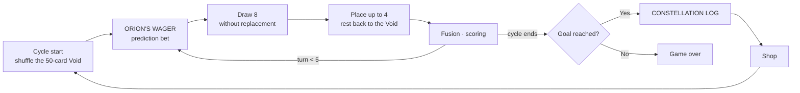

# Sirius

<p align="center"></p>

> A pixel-art board game that builds probability and statistics into the rules that decide outcomes, not into explanatory text. Balance was verified with seeded Monte Carlo simulation, and it ships as a single exe for booth laptops

---

## 1. Project Overview

| Item | Details |
|---|---|
| Project | Sirius (package name STA-mble) |
| One-line Summary | A game that makes middle school students use probability every turn to decide "which way do I go now." Curriculum achievement standards are mapped one-to-one onto game rules |
| Period | 2026.08.05 ~ 2026.08.15 (11 days) · 37 commits, v0.1.0 → v7.0.0 |
| Event | GBL (Game Based Learning) 2026, Math category · topic: probability and statistics · audience: middle school students · booth demo |
| Team | Solo project |
| My Role | Game design (3,400-line GDD), curriculum mapping, and all of the rule engine, UI, simulator and packaging |
| Contribution | 100% (every commit in the repository is mine) |

Students know how to compute `C(50,8)`, but nobody teaches them "so which one do you pick now?" The calculation ends on paper, and the judgment lives outside the classroom. A game forces you to choose and hands the result back right away, which makes it a good tool for closing that gap.

I read the textbook first and set the design criteria from it. The 2022 revised high school *Probability and Statistics* textbook lists the related middle school content for each major unit, and middle school students have already learned counting and probability (middle school year 2) and relative frequency (middle school year 1). So this game doesn't teach anything they don't know. It works as a bridge that connects what they already know to high school concepts (statistical probability, expected value).

## 2. Tech Stack

| Category | Technology | Why |
|---|---|---|
| Language · Build | TypeScript (`strict`) · Vite 8 | Binding the rule engine with types lets design rules such as "never put the correct probability in a question" be enforced by the data structures |
| Rule engine | Pure TypeScript `core/` (0 React/DOM dependencies) | The game, the simulator and the tests all share one state machine (`core/game.ts`) |
| UI | React 19 · Zustand · Tailwind CSS 4 · Framer Motion | Pixel art is drawn on a fixed 1120×630 canvas. The store only wraps the state machine |
| Simulation | Node + tsx, seeded `mulberry32` | The same seed has to give the same result for balance measurements to be reproducible |
| Testing | Vitest 4 | Includes guards for the design rules, such as checking the probability formulas against exact BigInt combinations |
| Packaging | Electron 43 · electron-builder 26 (`portable`) | A single exe that needs no install, runtime or network. Just copy it onto the booth laptop |

## 3. Key Features & Contributions

<p align="center"></p>
<p align="center">
  
  
</p>
<p align="center"><sub>Captured locally with the repository's automated screenshot tool (fixed seed). Top: gameplay screen. Bottom left: prediction bet. Bottom right: end-of-cycle statistics report</sub></p>

### Implemented Features

**Core loop.** A cycle is 5 turns. Each turn you draw 8 cards from the Void (50 cards) and place up to 4 of them on the 5×5 cluster. Pieces you don't place go back into the Void and get reshuffled. When placed pieces connect through the same symbol they score fusion points, and when the cycle's running score reaches the goal you move on to the next cycle. Drawing is without replacement, and placing a card is the only event that removes it from the population, so the loop itself is hands-on sampling.

**The piece set is itself counting.** There are 5 basic pieces. Special pieces are chips that combine two symbols half and half, so there are ₅C₂ = 10 of them. A drifter piece picks 3 of its 4 adjacent directions to evaluate, which gives ₄C₃ = 4 cases. The number of special pieces isn't an arbitrary value; it is the number of combinations itself.

**4 learning devices.** Each device covers a different curriculum unit and a different statistical idea.

| Device | What it does | Curriculum |
|---|---|---|
| `STAR-CHART` | Always shows the cards left per symbol and the "chance of at least 1 in the next 8 cards" (calculated) side by side with the rate observed in your hands so far (actual) | Ⅱ-1 Meaning of probability · Ⅱ-2 Complementary events · Ⅲ-5 Population and sample |
| `ORION'S WAGER` | A YES / NO / abstain prediction bet right before the draw. It gets harder as the cycles go up: simple comparison → complement → conditional | Ⅱ-1 · Ⅱ-2 · Ⅱ-3 Conditional probability |
| `DRIFT ORACLE` | Lays out every case a drifter can read in a table and asks for the expected value | Ⅲ-2 Expected value |
| `CONSTELLATION LOG` | At the end of a cycle, compares prediction accuracy and appearances per symbol against the expected values. Every ratio always comes with its sample size ("3 of 5 questions") | Ⅱ-1 Statistical probability · Ⅲ-3 |

**Compute through the complement, and never build a factorial.** "At least 1" is defined as `1 − C(n−k, h) / C(n, h)` but computed as the running product `∏ (n−k−i)/(n−i)`. `C(50,8)` is already 5.4×10⁸ and 60! is beyond double precision, so building the numerator and the denominator separately turns into `Infinity ÷ Infinity` before the division even happens. In the running product every factor is between 0 and 1, so the result can't leave the probability range.

### Main Tasks

- Wrote the GDD and the curriculum mapping (9 game systems ↔ achievement standards)
- Headless state machine `core/game.ts`, fusion scoring, shop, 3 learning devices (`wager` · `oracle` · `report`)
- Monte Carlo simulator (player policies random · greedy · smart) and balance curve design
- Procedural pixel-art generation pipeline (chips, constellation cards, characters)
- Electron shell and portable exe packaging, build branches for running the booth

## 4. Results & Metrics

### Quantitative Results

| Item | Result |
|---|---|
| Tests | Vitest **493 passed** (24 files, re-run 2026.09 on v7.0.0) · type check clean |
| Balance measurement | 1,000 runs per combination × 9 combinations, seed 20260101 |
| Code size | 15,178 lines in `src/` · `sim/`, 3,409-line GDD |
| Booth throughput | 27.8 minutes per person (calculated), 5.5 people per hour with 3 laptops |
| Distributable | 1 Windows portable exe |
| Event results · number of students who took part | (to be confirmed) |

**Effect of the prediction bet on the outcome** (against the earlier booth goal curve `[490, 630, 640]`):

| Player policy | Bet accuracy 0% | 50% | 100% |
|---|--:|--:|--:|
| greedy (booth edition) | **71.3%** | 85.0% | 87.2% |
| smart (booth edition) | 94.7% | 94.2% | 94.2% |
| smart (full version) | 4.2% | — | 40.4% (+36.2%p) |

In the booth edition, greedy clears 71.3% of the time even without answering a single probability question correctly, so the learning devices don't become a barrier to entry. In the full version, the prediction bet decides who wins. The numbers backed up the decision to run the two versions on different principles. The booth edition's goals were later raised on purpose to `[600, 900, 2000]` after I played it myself as the designer.

### Qualitative Results

- **Putting the two probabilities side by side made statistical probability visible without any explanation.** At the end of cycle 1, all five symbols were at 10/51, so the calculated value was 85% on all five rows, yet the actual observations scattered to 100 / 80 / 100 / 60 / 100%. Students see for themselves that calculation and observation drift apart when the sample is small.
- **The textbook corrected the design.** The textbook spells it `큰수의법칙` ("law of large numbers," written without spaces), and it is a learning element of the binomial distribution unit. Sampling without replacement belongs not to conditional probability but to the population and sample unit. The teaching notes rule out time-order and causal readings of conditional probability, so every "3 cards are already out, so now..." style question was rewritten as "when the Void is in this state right now."
- **The small sample size isn't hidden.** The statistics report writes the sample size next to each ratio and also shows the range you'd get by guessing. Over 3 cycles combined, convergence was observed as the "typical difference" shrank from 6.3% → 4.5% → 3.6%.

### Known Limitations

- **The 30 companion stars do nothing.** They only have a name, description, tier and price. All the balance curves were measured without companion stars, so turning them on would mean re-measuring all 9 combinations. They are sealed off by leaving the corresponding variant out of the purchase action type altogether.
- **The 27.8-minute throughput is a calculation, not a measurement.** The reading speed (250 characters/min) and the decision time are assumed values.
- **The learning effect wasn't measured.** What was verified is "are the concepts built into the rules" and "does the game work." A pre-test and post-test are the next step.
- **The automated screenshot tool doesn't match the current title screen.** The tool doesn't know about v7's new title menu (Start game · Booth mode · Collection · Settings). The screens in this report were captured after fixing only the tool's start step.

## 5. Troubleshooting

### ① Two learning devices cancelled each other out

**Problem** When the prediction bet (`ORION'S WAGER`) window opened, a backdrop at 85% opacity covered the probability panel (`STAR-CHART`). Answering a probability question means looking at the cards left, but at the moment you answered, those numbers weren't on screen. No matter how much time you had, the question itself couldn't be solved.

**Cause** It wasn't just the backdrop. The window itself covered 66% of the panel. Making the backdrop transparent didn't fix it, and neither did moving the panel. Moving the panel would also expose the probability % column, so you could simply read off the answer.

**Solution** I put only the cards left per symbol inside the question window. The probabilities are left out. This is enforced by the data structure rather than by a conditional: the question type has no field that can hold a probability, so the question generator knows the probability value but has no way to pass it to the window. I also measured the contrast, and the symbol colors seen through the backdrop against the body text came in at 1.08~1.44:1, far below the standard (4.5:1). A covered % column can't be read no matter where it sits.

**Result** Simple comparison questions still require a one-step inference ("more cards left means a higher chance"), and complement questions still require the calculation. The answer doesn't leak, and the questions became problems you can actually solve again.

### ② The simulator found a rule bug

**Problem** The full version's clear rate came out higher than intended, and when I changed the rules it moved in a different direction from the booth edition.

**Cause** There was a defect in how the constellation card holding limit (4 cards) was handled. Hitting the limit didn't filter out new cards, so holdings grew to 5, 6 and 7. In the full version, the smart policy was at the limit on 48% of its shop visits, so it was always profiting from this defect. The booth edition never reached the limit, so the effect there was 0. The clue was that the two versions' numbers moved in different directions.

**Solution** I fixed the limit handling and re-measured all 9 combinations. The structure is what made this measurement trustworthy. If the simulator had its own loop, the game that was measured and the game that shipped would be two different implementations. So the game, the simulator and the tests all use the single `core/game.ts`, nothing calls `Math.random()` directly, and randomness is injected instead. Even the RNG for dialogue lines is kept separate from the game RNG (`seed ^ 0x5ee0`). If dialogue consumed game randomness, seed reproducibility would break.

**Result** The full version's smart clear rate was corrected from 28.1% → 11.7%. The booth edition's numbers held up unchanged when re-measured.

### ③ "15 minutes for the booth edition" was never measured

**Problem** Early in planning, I assumed one booth game took 15 minutes, which meant 12 people per hour.

**Cause** That number didn't come from any calculation. Recomputing from the question character counts and reading speed gave 32.4 minutes per game, and the 15 prediction bet questions took up 44% of that (14.1 minutes). The reading speed was set at 250 characters/min: the maximum adult reading speed in Korean (about 589 characters/min) multiplied by a factor of 0.8 for middle school students and a factor of 0.6 for text that requires judgment.

**Solution** The explanation is now skipped when the answer is correct, and I cut the explanations to half their length (bet questions 3,030 characters → 1,627 characters). The statistics report wasn't cut. Its three points showing convergence are the entire device for showing the law of large numbers, so I didn't buy time by trimming the learning devices.

**Result** A game came down to 27.8 minutes. Including turnover time, that's 5.5 people per hour on 3 laptops. GBL ranks entries by the votes of participating students, so throughput is the score, and I learned before the event that securing enough laptops was a heavier requirement than I had guessed.

### ④ The build only crashes on a path with Korean characters

**Problem** Type checking and tests passed, but the production build alone crashed with `STATUS_STACK_BUFFER_OVERRUN`.

**Cause** The project path mixed Korean characters, spaces and a cloud-synced folder. The bundler dies on paths like that, and it only showed up at the build step.

**Solution** I moved the working tree to a simple ASCII path with no spaces, and wrote down never moving it back into a synced folder as a project rule.

**Result** Builds and packaging now finish reliably.

## 6. Links & Deliverables

| Category | Link |
|---|---|
| GitHub Repository | [stx4R/Sirius](https://github.com/stx4R/Sirius) (private) |
| Distributable | `Sirius-v<version>-portable.exe` (electron-builder `portable`) |
| Design documents | `docs/GDD.md` (3,409 lines) and `sim/out/results.md` (simulation results) in the repository |

### Structure

```
core/game.ts  ←──  sim/     (driven by the simulator)
              ←──  store/   (wrapped by Zustand)
              ←──  tests/   (verified by the tests)

src/core/   Pure TypeScript. Rules, probability math, learning devices. 0 React/DOM dependencies
src/ui/     React components. No game rule logic allowed
sim/        Node Monte Carlo simulator (imports core only)
electron/   Packaging shell. 0 lines of game logic
```



---

+++

## Customer Journey Map

The user is a middle school student who stops by the booth.

| Stage | What the user does | What the user thinks | How the game responds |
|---|---|---|---|
| Sitting down | Sits down in front of the laptop | "How do I play this?" | On the first turn of the first game, coach marks point out the controls one step at a time. The first 3 prediction bets are a mandatory tutorial |
| First cycle | Tries placing pieces | "Just put them anywhere?" | The first cycle is designed so anyone can pass it. Knocking a student out loses that student's vote |
| Judgment | Reads a bet question | "How many were left again?" | The cards left are shown inside the question window. The probability is theirs to work out |
| Observation | Looks at the probability panel | "It said 85%, so why is it 60%?" | Calculated and actual sit side by side, so the wobble of a small sample is visible |
| Wrap-up | Looks at the cycle report | "Did I do well?" | Shows the sample size, as in "3 of 5 questions," along with the range you'd get by guessing |
| Leaving | Heads off to vote | | A voting reminder appears at the end |

## Motion Design

- The hand fans out, and fusion scoring counts up one symbol at a time. Because it doesn't add everything up at once, you can follow with your eyes which line produced the points.
- The character ORION changes expression and talks to you depending on the situation. The dialogue RNG is kept separate from the game RNG, so the presentation never changes the game's outcome.
- The Electron window paints its background color before the first frame, so the game rises out of darkness rather than from a white screen.

## Adaptive Design

- It uses a fixed 1120×630 canvas that is scaled up or down to fit the screen with the aspect ratio preserved. Even though every booth laptop has a different resolution, every screen shows the same game. Tests measure box overlap and overflow on the fixed canvas.
- The distribution format was fitted to the operating environment as well. The production build only shows the booth edition (the full version's 8 cycles take about 40 minutes, the time in which one seat loses one vote). For demos it is opened with `?mode=full`. There is no runtime config file, so settings can't drift from one laptop to another.

## Security Risk Management (DREAD)

It's an offline game, so there is no personal data and no server. The threats are the kinds of misuse that could happen on a booth PC.

| Threat | Damage | Reproducibility | Exploitability | Affected | Discoverability | Mitigation |
|---|---|---|---|---|---|---|
| A link inside the exe turns the school PC into a web browser | Medium | Medium | Low | Booth PC | Medium | Opening a new window is refused instead of being handed to the system browser (`setWindowOpenHandler`) — **Applied** |
| A student turns on the full version and holds a seat for 40 minutes | Medium | Low | Low | Students waiting in line | Low | The production build is booth-edition only, and it can only be unlocked with a URL parameter — **Applied** |
| Tampering with the score through developer tools | Low | Medium | Medium | That game | Medium | Shortcuts were bound manually, but the developer tools shortcut is still there. Blocking it in the release build is remaining work |
