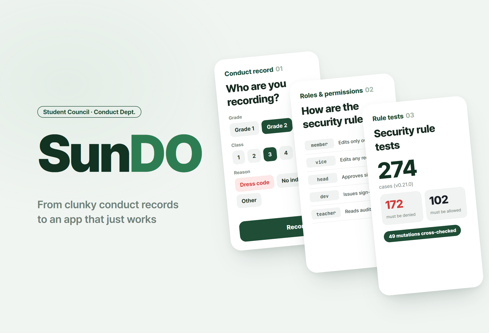
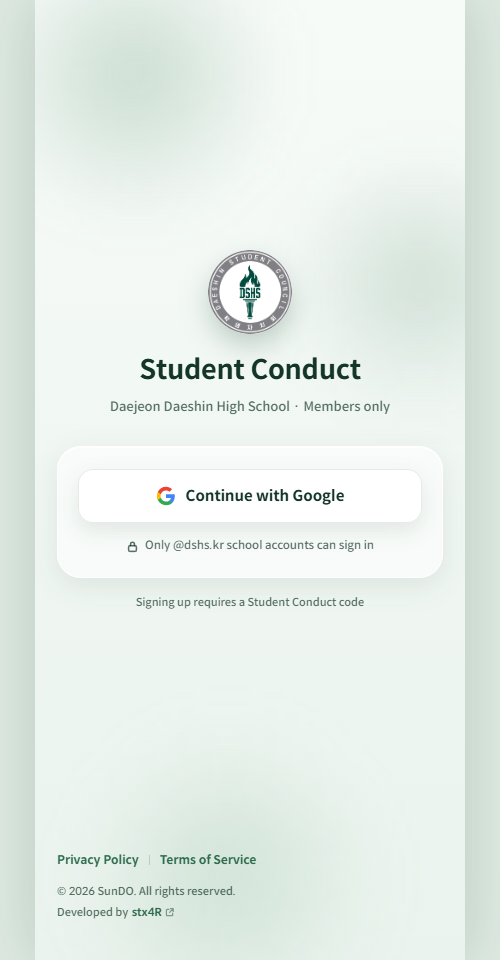
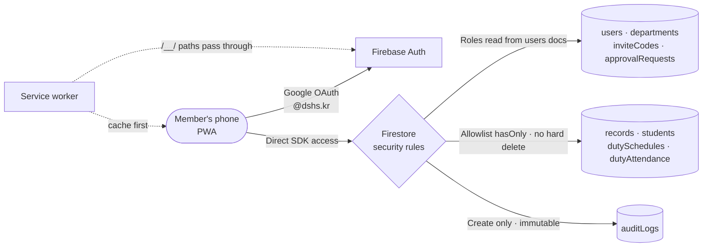

# SunDO

<p align="center"></p>

> A school-only PWA that moved the student council Student Conduct Department's conduct records off paper. With no server, permissions are enforced by Firestore security rules alone, and mutation testing proved that those rules actually deny what they are supposed to

---

## 1. Project Overview

| Item | Details |
|---|---|
| Project | SunDO (a PWA for the Student Conduct Department's electronic conduct records) |
| One-line Summary | Members pick a student and record the reason for a conduct citation, and manage patrol schedules and attendance. These are student guidance records about minors, so the design put its weight on pinning down "who can see what" in the rules |
| Period | 2026.08.20 ~ 2026.09.18 · v0.0.1 → v1.0.0 (official release 09.11) → v1.1.0 (security hardening) |
| Team | Solo project (users: about 40 members of the student council's Student Conduct Department at Daejeon Daeshin High School) |
| My Role | Planning, permission model and threat model design, security rules, all screen and PWA implementation, deployment and operation |
| Contribution | 100% (all 60 commits in the repository are mine) |

The Student Conduct Department kept its conduct records on paper. There was no way to trace who wrote what and when, erasing a wrong entry left no trace, and there was no document saying who was allowed to see which student's records.

Digitizing that isn't hard in itself. The problem is that the data is guidance records about minors. Designed badly, it ends up worse than paper. Paper physically exists in a single copy; a database hands over the whole school's records for a one-line query.

This app has no application server. The Firebase SDK in the browser connects straight to the database. That leaves the security rules as the only place where permissions can be decided. Hiding a button on screen is not a defense; anyone can just call the SDK from the console. **The screens handle convenience and the rules handle enforcement. When the two disagree, the only thing that is actually blocked is what the rules block.**

## 2. Tech Stack

| Category | Technology | Why |
|---|---|---|
| Screens | React 19 · TypeScript · Vite 8 · React Router 8 · Tailwind CSS 4 | A mobile app with 13 screens and 31 components. Dock-tab structure and a UI built around bottom sheets |
| Auth | Firebase Auth (Google OAuth, `@dshs.kr` domain) | The school Google account is the identity. No separate passwords to manage |
| Data · Permissions | Cloud Firestore + 577 lines of security rules | Enforces permissions by role, state and field through rules, with no server. In the rules file, the comments are longer than the conditions |
| Rule verification | Firestore emulator · `@firebase/rules-unit-testing` · custom mutation-testing harness | Measures not only "is this allowed" but "does the denial actually happen" |
| PWA | Web manifest · custom service worker (`public/sw.js`) | Installs to the home screen without an app store. Includes an offline banner, an update banner and an install guide |
| Deployment | Firebase Hosting · security headers | Keeps the app and the auth handler on the same origin. X-Frame-Options, CSP `frame-ancestors` and more applied |

## 3. Key Features & Contributions

<p align="center"></p>
<p align="center"><sub>The login screen of the live site. Screens past login contain real student information, so they are not included.</sub></p>

### Implemented Features

- **Sign-up and approval**: Authenticate with a school Google account → enter the sign-up code issued by the head → agree to the policies → wait for the head's approval. Accounts that aren't approved yet (`pending`) can't access any work data.
- **Conduct records (Home tab)**: Pick grade → class → student and record the reason (dress code violation · not wearing indoor shoes · other). The date and time are filled in automatically. You can also search by student ID with the magnifying glass and record right away.
- **Viewing and editing records (Records tab)**: Records are shown in real time, and only the author, the deputy heads, the head and dev can edit or delete them. Deleting doesn't erase anything; it only changes the status.
- **Patrol schedule and attendance (Schedule tab)**: Assign lunch and dinner patrol members week by week and record members' attendance (present · late · absent).
- **Admin (Admin tab)**: Approve or reject sign-ups, change roles, hand over the head role, issue and expire sign-up codes, student roster, audit log. Deputy heads and above only.
- **Settings & policies**: Account deletion, plus privacy policy, terms of use and open source license screens.
- **PWA**: Home-screen install guide, offline banner, update banner for new versions, pull to refresh, bottom padding adjusted when the keyboard comes up.

### Roles and Permissions

| Role | Permissions in brief |
|---|---|
| `member` (department member) | Writes conduct records. Can edit or delete only their own records |
| `vice` (deputy head) | Above + edit or delete any record, view sign-up requests |
| `head` (department head) | Above + approve or reject sign-ups, change roles, manage the roster, assign patrol schedules |
| `dev` | Above + issue and expire sign-up codes, hard-delete user documents |
| `teacher` (teacher) | Read-only access to audit logs and sign-up requests |

### Main Tasks

- Listed 10 threat model items (T1~T10) first, then designed the rules
- Wrote 12 `match` blocks of security rules; documented 6 things the rules can't express, each with a substitute defense
- Checked how the rule engine actually behaves with 5 emulator measurements (Q-1~Q-5)
- Wrote the rule test harness and the mutation-testing harness
- Implemented the screens, PWA and service worker; deployment and hotfixes during operation

## 4. Results & Metrics

### Quantitative Results

| Item | Result |
|---|---|
| Rule tests | 6 suites, **274 cases** — 172 deny / 102 allow (as of v0.21.0) |
| Mutation testing | **49 mutations** — each rule condition is deliberately opened one at a time to check whether the declared cases actually break |
| Emulator measurements | 5 (list queries · when reads inside a batch are evaluated · batch atomicity · read count limit · regex anchors) |
| Scale | 14,937 lines in `src/`, 577 lines of security rules, 60 commits |
| Operation | Officially released 2026.09.11, about 40 members · the whole school's student roster |
| Actual total records · daily usage | (to be confirmed) |

There are 1.7 times as many deny cases as allow cases. The heart of rule testing is not "this works" but "this doesn't."

### Qualitative Results

- **Dropped verification that only measures passes.** If you only check that "what should be allowed is allowed," a rule with no conditions at all passes too. So I deliberately open each rule condition one at a time, rerun the tests, and see whether the tests guarding that condition actually fail. If they don't fail, that condition isn't doing anything.
- **Wrote allowlists, not denylists.** A record edit lists only the fields that may change, as in `affectedKeys().hasOnly(['reasonCode', 'reasonText', 'updatedBy', 'updatedAt'])`. When new fields are added, a denylist opens up automatically, while an allowlist locks automatically.
- **Got rid of hard deletes.** Records, audit logs, sign-up requests and codes are all `allow delete: if false`. Deletion only happens as a state transition, and `dev` is no exception. Once an audit log entry is created, nobody can change it.
- **Deliberately left out a catch-all deny rule.** The engine already denies by default. `match /{document=**} { allow read, write: if false; }` looks exactly like the temporary rule used during development, so changing a single character would reopen every collection.
- **Wrote down what the rules can't do.** I listed 6 items, including "there is exactly one head" (no set queries), "an edit without an audit log should fail too" (sibling operations can't be seen) and field-level read restrictions (`allow read` works per document), and assigned each a substitute defense: batch atomicity, UI discipline, or moving the logic to server functions.

### Known Limitations

- **User documents are open to department members with every field visible.** "Don't render the email" is a promise the screens make, not a rule. The real fix is a schema change that splits sensitive fields off into a subdocument.
- **Set invariants and races between concurrent handovers can't be closed off with rules.** They need to move to server functions (transactions).
- **Audit log integrity depends on batch atomicity.** The batch is built by app code, so calling the SDK directly without going through the app makes an edit without a log possible.
- **Brute-forcing sign-up codes.** Listing is locked, but looking up a single code is open to every school account (4,569,760 possible combinations). A rate limit on requests is needed to go with it.
- **The rule tests live outside the repository.** During the repository cleanup (v0.22.0), `tests/` was taken out of the tree. Someone cloning it fresh can't run the rule tests, and the v1.1.0 rule hardening has no verification record in the repository (to be confirmed).

## 5. Troubleshooting

### ① Login looped forever right after the official release

**Problem** Once v1.0.0 was deployed, finishing Google login sent users straight back to the login screen. The browser's popup flow and the PWA's redirect flow showed the same symptom.

**Cause** It was the service worker. The auth domain (`authDomain`) was set to the same domain as the app, so the Firebase reserved paths that login opens, `/__/auth/handler` and `/__/auth/iframe`, also arrived as same-origin navigation requests. For any navigation, the service worker returned the cached `index.html` without looking at the path. The app screen appeared where the auth handler should have been, and the credentials lost their way back to the parent window. Requesting the same URL with `curl` returned the real handler from the server, while opening it in a browser showed the SunDO screen. The service worker was intercepting it. In the PWA performance round (W-27), the network-first strategy had been switched to cache-first, which turned something that only failed occasionally on timeouts into something that failed every time.

**Solution** At the very top of the service worker's fetch handling, paths starting with `/__/` are left untouched and handed to the browser's default handling (v1.0.1, deployed the same day). I didn't attach an offline fallback to these paths either; they only make sense with a network connection in the first place.

**Result** The login loop was gone. I left the cause, the reproduction steps and "why it didn't show up in earlier versions" in a code comment, so the same strategy change will be recognizable if it ever creeps back in.

### ② Either the list screens die outright or every sign-up code leaks

**Problem** The rule skeleton in the spec bundled single-document reads (`get`) and list reads (`list`) under a single `allow read`. Left that way, the moment "self or department member" is applied to user documents, the member list screen dies, and the moment "if logged in" is applied to sign-up codes, every valid code leaks out as a list.

**Cause** Checking with the emulator, a rule with only `allow read: if request.auth.uid == uid` allowed the single-document read and denied the collection list. A query narrowed with `where(문서ID == 본인)` (document ID == self) passed. Rules don't filter list results one entry at a time. If a query can't prove the rule condition on its own, the query itself is denied. That is exactly what "rules are not filters" means.

**Solution** I wrote `get` and `list` separately for every collection. For sign-up codes, I used this property the other way around. The document ID is the code string itself, so even with single-document reads open to every school account, only someone who already knows a code can read that one document. Listing is open only to the head, which prevents enumerating the codes.

**Result** The list screens work with queries that prove the condition, and sign-up codes can only be checked by people who already know them.

### ③ The defense named in the spec didn't block anything

**Problem** The spec defined the trailing `$` in the domain-check regex `.*@dshs[.]kr$` as a required condition.

**Cause** Measuring it showed that even with the `$` removed, `attacker@dshs.kr.evil.com` was still denied, because the rule engine's `matches()` is a full-string match. On the other hand, the moment a `.*` was appended to the end, the attack got through. Whether `$` was there made no difference; the `.*` suffix was the real weak spot.

**Solution** I kept the `$` as defense in depth, but wrote the real risk in the comment. This conclusion also went into the mutation testing: the `no-dollar-anchor` mutation declares "no tests break" as its expected result, while the `domain-suffix-open` mutation has to break the domain defense cases.

**Result** Measurement, not documentation, became the basis for the rules. Batch behavior measured the same way (reads inside a batch see the state from before the batch; if one operation is denied, the whole batch is rolled back) became the basis for designing the head handover and sign-up approval batches.

### ④ What the mutation testing caught was a mistake in the tests

**Problem** For each mutation I had declared "opening this condition should break these cases," but when I ran the mutation testing, cases that weren't in the declarations failed as well.

**Cause** In a round that narrowed permissions, I added new batch cases without updating the declared lists of the existing mutations. This happened twice.

**Solution** I brought the declarations in line with the actual results and set up a procedure: before narrowing a permission, search the app source for every place that uses that collection, and only then deploy. When widening, the rules are deployed first; when narrowing, the app goes first.

**Result** This confirmed that mutation testing checks not just the rules but also "how the rules and the tests correspond." As long as the declarations are maintained by hand, the same omission can happen again, so pinning each mutation's actual failure list as a snapshot remains the next improvement.

## 6. Links & Deliverables

| Category | Link |
|---|---|
| GitHub Repository | [stx4R/SunDO](https://github.com/stx4R/SunDO) (private) |

### System Architecture



Two layers of rule verification:

```
Layer 1  Case tests         274 (deny 172 / allow 102) — fixtures are seeded with the rules turned off
Layer 2  Mutation testing   49 mutations — with one condition opened, do the declared cases actually fail?
                            e.g. no-dollar-anchor → 0 broken cases is the correct answer
```

---

+++

## Customer Journey Map

The user is a Student Conduct Department member who patrols during lunch and dinner.

| Stage | What the user does | What the user thinks | How the app responds |
|---|---|---|---|
| Sign-up | Logs in with a school account and enters the code | "Surely not just anyone can get in" | Three steps: domain restriction + code issued by the head + head approval |
| Patrol | Spots a student breaking the dress code | "I need to write this down fast" | Three taps (grade → class → student), or a single student ID search |
| Recording | Picks the reason | "Do I have to write down the time?" | The date and time are automatic and can't be changed |
| Correction | Fixes an entry made by mistake | "Will it show if I delete it?" | Only the author can change the reason, and deletion is a state transition that leaves a trace |
| Operation | The head plans next week's patrols | "Who didn't show up?" | Weekly schedule and attendance (present · late · absent) on one screen |

## Adaptive Design

- The supported devices are stated explicitly (Galaxy S series on Android 10 or later; iPhone SE 3rd generation or later on iOS 17 or later). The dock tabs and bottom sheets are laid out for a phone screen used one-handed while on patrol.
- When an input field gets focus and the virtual keyboard comes up, the bottom padding is adjusted by the keyboard's height (`useKeyboardInset`). The screen height, which varies from device to device, is recalculated from the actual visible height (`appHeight`).
- Going offline brings up a banner at the top, and when a new version is deployed, an update banner announces it.

## Gesturing

- The schedule and admin screens refresh when pulled down. It's a way to fetch the latest state with one thumb while on patrol.
- Editing a record, searching for a student and editing the schedule all open in a bottom sheet that slides up from below.

## Security Risk Management (DREAD)

| Threat | Damage | Reproducibility | Exploitability | Affected Users | Discoverability | Mitigation |
|---|---|---|---|---|---|---|
| An outsider gets in without a school account | High | High | Medium | All | High | Email domain check on the token — **Applied** |
| Forging one's own role and sending it | High | High | Medium | All | Medium | Roles are read only from the users document on the server — **Applied** |
| Altering a record's student, date or author after the fact | High | Medium | Medium | The student concerned | Low | `hasOnly` allowlist — **Applied** |
| Deleting a record without a trace | High | Medium | Medium | The student concerned | Low | No hard deletes, state transitions only — **Applied** |
| Viewing the list of sign-up codes | High | High | Medium | All | Medium | Separate `get`/`list` — **Applied** |
| The head granting the `dev` or `teacher` role | Medium | High | Medium | All | Medium | Restrict which roles can be granted — **Applied in v1.1.0** |
| Recording under the name of a student who doesn't exist | Medium | High | Medium | Record reliability | Medium | Check that the student document exists and the name matches — **Applied in v1.1.0** |
| A department member looking up other members' emails | Medium | High | Low | Members | Low | Needs field separation — **Remaining Work** |
| Brute-forcing sign-up codes | Medium | Medium | Medium | All | Medium | Needs a rate limit — **Remaining Work** |

The items with the greatest damage were blocked with rules first, and the two items beyond what rules can express have been handed off to a schema change and server-side limits.
