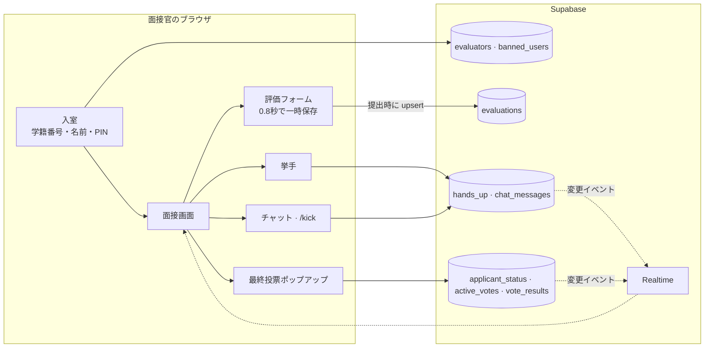

# L-INK Interview

<p align="center"></p>

> 部活動の新入部員の面接を複数の面接官が1つの画面で進め、点数・質問の順番・合否の投票をリアルタイムでそろえる面接評価 Web アプリ「L-INK Eval」

---

## 1. プロジェクト概要 (Overview)

| 項目 | 内容 |
|---|---|
| プロジェクト名 | L-INK Interview（アプリ名「L-INK Eval」） |
| 一行要約 | 面接官ごとにばらばらだった応募書類・点数・メモ・合否の意見を一か所に集め、次に誰が質問するかから最終的な合否投票までをリアルタイムで共有する |
| 期間 | 2026.03（リポジトリ作成 2026.03.21、面接の日程は要確認）・2026.07.20 に部活動の組織リポジトリへコードをアップロード |
| 参加人数 | 開発1人（本人）。ユーザーは L-INK の面接官 |
| 本人の役割 | 企画・設計・全体の実装、面接当日の管理者（進行役） |
| 貢献度 | 100%（リポジトリのコミットはすべて本人）。ただし、開発履歴はアップロード時のコミット1件にまとめられている |

L-INK は、大田大新高等学校の文理融合の部活動である。新入部員の面接では複数の面接官が1人の応募者を同時に見るが、応募書類は紙やファイルで、点数は各自のメモで、合否の意見は面接が終わってから口頭で集めていた。次に誰が質問するかも、その場の空気で決めていた。そこで、面接の最中に面接官たちが同じ画面を見ながら点数を残し、質問の順番と合否をその場で決められるツールを作った。

## 2. 技術スタック (Tech Stack)

| 区分 | 技術 | 選定理由 |
|---|---|---|
| 画面 | React 19 · TypeScript · Vite | コンポーネント10個規模のシングルページアプリなので、軽量なビルドツールで十分だった |
| 状態管理 | Zustand | 現在の面接官、選択中の応募者、一時保存した評価をグローバルに共有する。Redux より設定が短くて済む |
| スタイル | Tailwind CSS v4 · lucide-react | ダークモード（`dark:` バリアント）を、システム設定に合わせて有効にする |
| バックエンド | Supabase（Postgres · Realtime） | サーバー側のコードを別に書かず、テーブルの購読だけでチャット・挙手・投票を複数の面接官の画面に同時に反映する |
| デプロイ | Vercel（SPA のリライト設定） | すべてのパスを `index.html` に向け、リロードしてもアプリが開くようにした |

## 3. 主な機能と担当業務 (Key Features & Contributions)

<p align="center"></p>
<p align="center"><sub>ローカルビルドでキャプチャ。応募者の情報・チャットは、すべて架空のデータに置き換えてレンダリングした。</sub></p>

### 実装した機能

- **面接官の入室**：学籍番号と名前を入力する。初回は4桁の PIN を設定し、次回からはその PIN で入室する。チャットで退出させられた面接官は、入室の段階でブロックされる。
- **応募書類の閲覧**：上部のドロップダウンで応募者を選ぶと、進路、部門、自己紹介、志望動機、関心のあるテーマ、テーマと進路の関係、性格とその根拠、やりたい活動、意気込みが1画面にカードで表示される。
- **面接の状態**：管理者が応募者のバッジを押すたびに `면접 대기 → 면접중 → 면접 완료`（面接待ち → 面接中 → 面接完了）と切り替わり、状態 LED の色も合わせて変わる。評価の入力欄は、`면접중`（面接中）の応募者に対してだけ開く。
- **評価の入力**：1〜10点のスライダーとコメント。入力が止まって0.8秒経つとアプリ内に一時保存し、提出ボタンを押すと DB に `(面接官, 応募者)` 単位で上書きする。
- **挙手**：質問したい面接官が手を挙げると、すべての画面の「リアルタイム挙手状況」に名前が表示される。
- **リアルタイムチャット**：面接官同士で質問を分担する。管理者は `/kick [対象] [秒]` コマンドで、特定の面接官を一定時間退出させられる。
- **最終投票**：管理者が投票を開始すると、すべての面接官の画面に合格・保留・不合格のポップアップが表示される。管理者が締め切ると、割合が公開される。
- **管理者用の集計画面**：すべての評価を応募者・面接官で検索し、平均点を確認する。
- **要望掲示板**：面接官はバグや要望を書き込み、管理者は対応状況を変更する。

### 主な業務

- 面接の進行フローの設計（入室 → 応募者の選択 → 状態の切り替え → 評価 → 挙手・チャット → 最終投票）
- Supabase のテーブル構成と Realtime の購読（チャット · 挙手 · 投票 · 投票結果）
- 評価の一時保存と DB への提出の分離
- 最終投票ポップアップの状態管理（後述のトラブルシューティング①）

## 4. 成果と結果 (Results & Metrics)

### 定量的成果

| 項目 | 結果 |
|---|---|
| 対象の面接 | 応募者24人（4部門：起業部 14 · 政治部 5 · 哲学部 4 · 商経部 1） |
| 応募書類の項目 | 応募者1人あたり10個の記述項目を1画面に表示 |
| 規模 | TS/TSX 2,331行（応募書類のデータ約430行を含む）、コンポーネント10個 · ページ2個 |
| リアルタイムチャネル | チャット · 挙手 · 投票状態 · 投票結果の4つ |
| 参加した面接官の数 · 利用時間 | （要確認） |

### 定性的成果

- 面接が終わった後に点数と意見を集め直す手間がなくなった。投票結果と平均点が、面接の直後に1つの画面に残る。
- 次に誰が質問するかを挙手リストで見えるようにし、面接官同士の発言がかぶることを減らした。
- このプロジェクトで明らかになった認証・権限の問題（後述の限界）は、2か月後に始めた MoGuk で、事前名簿 + サーバー側の検証 + RLS という構成で解決した。

### 確認された限界（2026.09 時点のコード）

- **応募者の個人情報がソースコードに含まれている。** 応募書類24件（連絡先・学校のメールアドレスを含む）が、`MOCK_APPLICANTS` という名前でコードに直接埋め込まれている。ビルドすると JavaScript のバンドルにそのまま載り、公開 URL を知っている人なら誰でも開発者ツールで読める。応募書類は DB から権限のあるユーザーにだけ渡し、リポジトリの履歴からも消す必要がある。
- **PIN の確認がブラウザで行われている。** ログイン時に DB に保存された PIN をブラウザに取得し、入力値と比較している。1回照会するだけで他の面接官の PIN が分かり、しかも PIN は平文で保存されている。
- **管理者の判定もブラウザで行われている。** 特定の学籍番号・名前の組み合わせか、学籍番号が `admin`・`00000` であれば管理者になる。値さえ知っていれば、誰でも管理者画面を開ける。
- **DB の権限ルールがリポジトリにない。** テーブル作成の SQL と RLS ポリシーがないため、クライアントからの直接書き込みがどこまで防がれていたのかを確認できない（要確認）。
- **開発履歴が残っていない。** リポジトリには完成版を一度にアップロードしたコミットしかなく、README も Vite のデフォルトテンプレートのままである。

## 5. トラブルシューティング (Troubleshooting)

### ① 最終投票のポップアップが勝手に閉じたり、また表示されたりする

**問題** 管理者が投票を開始したら、すべての面接官の画面にポップアップが表示されなければならない。コンポーネントに残っている修正時のコメントによると、面接官が結果を確認してポップアップを閉じてもまた表示されたり、他の面接官の票が入るたびにポップアップがちらついたりする問題があった。

**原因** ポップアップを表示するかどうかを、「現在の投票データがあるか」で決めていた。ポップアップを閉じるために投票データを空にすると、初期ロードのエフェクトが再び走ってデータを取得し、ポップアップがまた開いた。票が追加されるイベントでも投票状態を書き直していたため、ポップアップの表示も一緒に揺れた。購読を登録するエフェクトの依存配列に状態が含まれていて、購読が繰り返される問題もあった。

**解決** ポップアップを表示するかどうかを、別の状態（`showModal`）として切り出した。ポップアップを閉じるときは `showModal` だけをオフにし、投票データはそのまま残す。票が追加されるイベントでは集計の数字だけを更新し、ポップアップの状態には触れない。投票状態が `voting → finished` に変わった瞬間にだけポップアップを再表示し、結果を見せる。購読は依存配列を空にして、画面が最初に開いたときに一度だけ登録する。

**結果** ポップアップが開くタイミングは、「新しい投票の開始」と「投票の締め切り」の2つに整理された。その間は、面接官が閉じれば閉じたままになる。この過程は、コンポーネントのコメントに段階ごとに残っている。

### ② 評価を書いている途中で応募者を切り替えると、入力内容が消える

**問題** 面接官は、面接の最中に点数とメモを何度も書き直す。入力のたびに DB に書き込むとリクエストが多すぎる。かといって提出ボタンを押したときだけ保存すると、別の応募者をちょっと見て戻ってきたときに、書きかけの内容が消えてしまう。

**原因** 評価フォームの入力値はコンポーネントの状態なので、応募者を切り替えると新しい応募者に合わせて初期化される。

**解決** 保存を2段階に分けた。入力が止まって0.8秒経つとグローバルストアに `応募者-面接官` のキーで一時保存し、その応募者を再び選ぶとその値を読み込む。DB には、面接官が提出ボタンを押したときだけ `(evaluator_id, applicant_name)` 単位で upsert するので、同じ面接官が何度提出しても行は1つしか残らない。

**結果** 応募者を行き来しても書きかけの評価が残り、DB には面接官が確定させた値だけが入る。

### ③ 挙手の順番が面接官の間で共有されない

**問題** コードに残っている最初の質問待ちキュー（`HandRaiseQueue`）は、手を挙げた面接官が自分の画面にしか表示されない構造である。

**原因** キューをブラウザ内の Zustand の状態だけで管理していた。コードには「DB INSERT」「DB DELETE」というコメントがあるだけで実際の保存処理はなく、面接官ごとにリストがばらばらだった。

**解決** 挙手を Supabase の `hands_up` テーブルに移し（`HandUpSection`）、面接官の名前をキーにして upsert する。すべての画面がこのテーブルの変更を購読し、リストを読み込み直す。

**結果** 1人が手を挙げると、すべての面接官の画面にすぐ表示される。古いキューのコンポーネントは、使われないままコードに残っている。

## 6. リンクと成果物 (Links & Deliverables)

| 区分 | リンク |
|---|---|
| GitHub リポジトリ | [L-INK-dshs/L-INK-Interview](https://github.com/L-INK-dshs/L-INK-Interview)（非公開） |
| 公開URL | （要確認） |

### システム構成図



応募者1人分の面接の進行：

```
管理者: 応募者のバッジをクリック → 面接中（評価フォームが開く）
面接官: 挙手 → 質問 → 点数・メモ → 提出
管理者: 最終投票を開始 → 全画面にポップアップ → 締め切り → 合格・保留・不合格の割合を公開
管理者: バッジをクリック → 面接完了
```

---

+++

## カスタマージャーニーマップ (Journey Map)

ユーザーは面接官（部員）である。

| 段階 | ユーザーの行動 | ユーザーの考え | アプリの対応 |
|---|---|---|---|
| 入室 | 学籍番号・名前を入力する | 「またパスワードを作らないといけないの？」 | 最初に一度、4桁の PIN を決めるだけ |
| 準備 | 次の応募者の応募書類を開く | 「この子の応募書類、どこだっけ？」 | ドロップダウンで選べば、10項目が1画面に |
| 質問 | 質問しようと手を挙げる | 「今話してもいいかな？」 | 手を挙げた面接官のリストが全員に見える |
| 評価 | 点数とメモを残す | 「あとで整理しなきゃ」 | 自動で一時保存し、提出すれば DB へ |
| 決定 | 合否を決める | 「他の人はどう思ってるんだろう？」 | 全員が同時に投票し、締め切りと同時に割合を公開 |

## モーションデザイン (Motion Design)

- 投票の進行中は、合格・保留・不合格のボタンが呼吸するように明るくなったり暗くなったりする LED のように光り、押すと少し大きくなる（`hover:scale-105`）。
- 応募者の状態バッジにある LED の点は、`면접 대기`・`면접중`・`면접 완료`（面接待ち・面接中・面接完了）ごとに色が異なる。

## アダプティブデザイン (Adaptive Design)

- OS がダークモードならアプリもダークモードで起動し、ヘッダーのボタンで切り替えられる。
- 広い画面では応募書類（左）と挙手・チャット（右）を並べて配置し、面接官が応募書類を見ながらチャットを読めるようにした。

## セキュリティ脆弱性管理 (DREAD)

| 脅威 | 損害 | 再現性 | 悪用性 | 影響ユーザー | 発見性 | 判断 |
|---|---|---|---|---|---|---|
| 応募者の個人情報が JS バンドルに含まれている | 高 | 高 | 高 | 応募者24人 | 高 | 最優先。応募書類を DB に移して権限のある面接官にだけ閲覧を許可し、リポジトリの履歴を整理 |
| 保存された PIN をブラウザに取得して比較している | 高 | 高 | 中 | 面接官全員 | 中 | PIN の比較をサーバー側の関数に移し、ハッシュで保存 |
| クライアント側での管理者判定 | 高 | 高 | 中 | 全体 | 中 | 管理者かどうかを DB のロール列と RLS で判定 |
| 投票・状態テーブルへの直接書き込み（RLS を確認できない） | 中 | 中 | 中 | 全体 | 低 | 書き込みは RPC 経由のみ許可し、RLS をリポジトリに記録 |

4つとも、「ブラウザを信用した」という同じ原因から来ている。修正の順序は、個人情報 → PIN → 管理者判定 → 書き込み権限とするのが正しい。前の2つは面接が終わった後も残る被害なので、先に防がなければならない。
