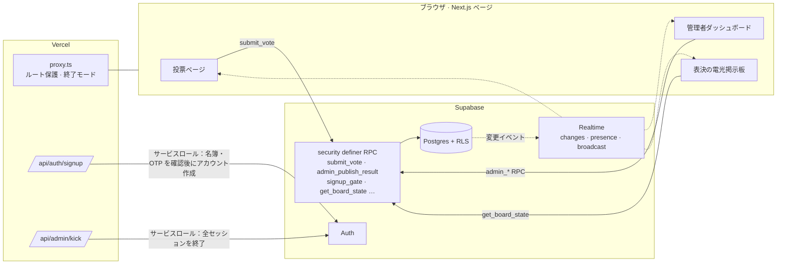

# MoGuk

<p align="center"></p>

> 議員130人が参加した第3回オリャン模擬国会の会員登録・電子投票・電光掲示板・運営ツールを1つにまとめた公式 Web サービス

---

## 1. プロジェクト概要 (Overview)

| 項目 | 内容 |
|---|---|
| プロジェクト名 | MoGuk（第3回オリャン模擬国会 公式 Web サイト · 電子投票プラットフォーム） |
| 一行要約 | 事前登録された議員だけが会員登録して議案ごとに1回ずつ投票し、運営陣は出席・表決を電光掲示板で管理し、結果はサーバーが直接集計して公開する |
| 大会期間 | 2026.05.29 ~ 2026.07.25（常任委員会 07.18、本会議 07.25）・大田大新高等学校 |
| リポジトリの期間 | 2026.05.21（v1.0）~ 2026.07.24（閉会後にサービス終了）・コミット32件 |
| 参加人数 | 開発チーム3人（サイトのフッターには stx4R · kmc11004 と表記） |
| 本人の役割 | 開発（リポジトリのコミット32件はすべて本人のアカウント）。詳しい分担は（要確認） |
| 貢献度 | （要確認） |

オリャン模擬国会は、校内の12の部活動が合同で開く青少年模擬国会である。第3回大会は進歩40人 · 保守40人 · 中道50人の3党体制で、9つの常任委員会を運営した。議案の研究から本会議の電子投票まで2か月近く続く行事なので、参加者名簿の管理と投票の公正さを一か所で担うシステムが必要だった。このサービスは行事の公式 Web サイトであると同時に、本会議の表決システムでもある。誰が投票できるのか、1人が1回だけ投票しているか、公開された数字が実際の票と一致しているかを、すべてサーバーとデータベースが保証するように設計した。

## 2. 技術スタック (Tech Stack)

| 区分 | 技術 | 選定理由 |
|---|---|---|
| フレームワーク | Next.js 16.2（App Router）· React 19 · TypeScript | ページとサーバー API（`app/api`）を1つのリポジトリに置ける。`proxy.ts`（Next 16 のミドルウェア）で、リクエストがページに届く前に権限をチェックする |
| スタイル | Tailwind CSS v4（`@theme` トークン）· framer-motion · three.js（@react-three/fiber） | ダークテーマのデザイントークンを CSS 変数で管理する。セクションの登場アニメーションと、最初の画面の 3D 背景に使う |
| 認証 | Supabase Auth + 事前登録名簿（`allowed_names`）+ OTP | 運営陣が事前に発行した名前・OTP のペアを持つ人だけが、アカウントを作成できる |
| データ | Supabase Postgres · Row Level Security · `security definer` RPC | テーブルへの直接書き込みを禁じ、投票・集計・管理の操作はすべて DB 関数で処理する。クライアントが改ざんされても、ルールは DB 側で守られる |
| リアルタイム | Supabase Realtime（`postgres_changes` · Presence · Broadcast） | 議案の開閉と結果の公開を、すべての画面に即座に反映する。接続者の状況を確認し、特定ユーザーのセッションを切断する |
| デプロイ | Vercel · PWA マニフェスト（`standalone`） | プッシュすればすぐにデプロイされる。スマートフォンのホーム画面に、アプリのようにインストールできる |

## 3. 主な機能と担当業務 (Key Features & Contributions)

<p align="center"></p>
<p align="center">
  
  
</p>
<p align="center"><sub>ローカルビルドでキャプチャ。投票・電光掲示板の画面は、Supabase の代わりにダミーデータを入れてレンダリングした（議案名・議員名は例）。</sub></p>

### 実装した機能

- **招待制の会員登録**：名前 + 運営陣が配布した OTP + メールアドレス + パスワード（8文字以上）で登録する。サーバー API が IP と名前を DB のゲート（`signup_gate`）に渡し、試行を許可するかどうかをまず判定する。続いて名簿にある名前・OTP のペアか、すでに登録済みの名前ではないかを確認したうえで、サービスロールキーでアカウントを作成する。失敗の理由は区別せず、同じレスポンスを返す。
- **議案への投票**：開いている議案に対して、賛成・反対・棄権のいずれかを選ぶ。提出は `submit_vote` RPC 1つからしかできず、提出後は変更できない。ログインの有無・ブロックの有無・議案の開閉・重複を DB 関数が順に確認し、最後に `(agenda_id, user_id)` のユニーク制約が重複を防ぐ。
- **結果の公開**：投票中は誰も集計を見られない。管理者が公開すると、サーバーが `votes` を直接数えて結果の行を作り、すべての接続者の画面にリアルタイムで表示される。
- **表決の電光掲示板**：国会の電光掲示板のように、議員ごとの LED で賛成・反対・棄権・未投票を示し、在籍数・出席数・賛否の数と投票率のバーも合わせて表示する。管理者は出席の処理と表決の補正ができる。結果が公開された議案は、議員も読み取り専用で閲覧できる（記名表決の公開）。
- **管理者ダッシュボード**：接続中の議員の一覧（Presence）、議案の作成・開始・終了・完了、`/kick` `/ban` `/timeout` `/voteresult` のコマンドコンソール。
- **強制ログアウト**：RPC で状態を記録し、サーバー API がサービスロールキーで対象者のすべてのセッションを切り、Broadcast で対象者の画面に通知する。対象者の画面は通知を受けてもすぐにはログアウトせず、サーバーにセッションを問い合わせ直し、実際に切断されていた場合だけログイン画面に送る。
- **大会情報・ポリシーのページ**：日程・常任委員会・政党構成、利用規約・プライバシーポリシー・運営ポリシー、ガイド動画、FAQ。
- **サービス終了モード**：閉会後はフラグ1つですべてのページを終了案内に切り替え、API は `410 Gone` で閉じる。

### 主な業務

- 認証・権限フローの設計（事前名簿 + OTP による登録、`proxy.ts` によるルート保護、管理者 API のオリジン検査）
- Supabase のスキーマ・RLS ポリシー・RPC の設計と、セキュリティ点検結果の反映（V-1 · V-3 · V-4）
- 投票ページ、管理者ダッシュボード、表決の電光掲示板の実装
- セキュリティヘッダー（CSP · HSTS · X-Frame-Options など）の設定
- 機能の整理と公開リポジトリの整理（v4.2 で5,206行を削除、07.13 に DB スクリプトを除去）

## 4. 成果と結果 (Results & Metrics)

### 定量的成果

| 項目 | 結果 |
|---|---|
| 対象の行事 | 議員130人（3党）· 部活動12 · 常任委員会9 · 大会期間58日 |
| サービスの規模 | ページ11個 + サーバー API 2個、TS/TSX/CSS 4,471行 |
| DB 設計 | テーブル13個、RLS ポリシー33個（v4.2 直前のスキーマ基準）、クライアントが呼び出す RPC 12種類 |
| 開発履歴 | コミット32件、バージョン v1.0 → v7.2 → 閉会 |
| 機能の整理 | v4.2 でチャット・お知らせ・バグ報告などの5,206行を削除 |
| 実際の登録者数 · 投票数 · 同時接続数 | （要確認） |

### 定性的成果

- 投票の3つの条件（資格のある人だけが、1回だけ投票し、公開される数字が実際の票と一致する）を、画面ではなく DB のルールで保証した。クライアントのコードを書き換えても回避できない。
- 本会議前のセキュリティ点検項目（V-1 · V-3 · V-4 など）を番号で管理し、1つずつ直した。
- 使わない機能は思い切って取り除いた。チャットやバグ報告のような機能はどれも攻撃の入口になりうるうえ、行事に必須でもなかった。
- 閉会後はサービスを明示的に閉じ、残ったアカウントやデータに入り込む経路をなくした。

### 確認された限界（2026.09 時点のコード）

- **DB スクリプトがリポジトリにない。** 2026.07.13 のコミットで、スキーマ・RLS・セキュリティパッチの SQL（1,366行）を公開リポジトリから削除した。その後に追加した `signup_gate` のような関数は記録がまったく残っておらず、リポジトリだけではサービスを再構築できない。
- **クライアント側で開発者ツールをブロックしても、セキュリティにはならない。** F12・右クリック・`debugger` をブロックするスクリプトが残っている。コードのコメントにも「サーバーレベルの保護は別に用意する」とあるとおり、実際の防御は CSP と RLS である。
- **CSP に `script-src 'unsafe-inline'` が含まれている。** 上記のインラインスクリプトのために必要だが、その分スクリプト挿入に対する防御が弱くなる。
- **閉会時のコミットがホームのレイアウトを崩している。** 終了案内ページを中央寄せにするため、`main` を横方向の `flex` に変えた。サービスを再開すると、複数のセクションからなるホーム画面が横に押しつぶされる。上のスクリーンショットは、閉会直前のレイアウトに戻して撮影した。
- **強制ログアウトは3つの段階が別々に実行される。** RPC · サーバー API · Broadcast の間にトランザクションがないため、途中の段階が失敗しても後の段階が実行されてしまう。

## 5. トラブルシューティング (Troubleshooting)

### ① ログインさえすれば他人の票が見え、結果の数字はクライアントが決めていた（セキュリティ点検 V-1 · V-4）

**問題** 常任委員会（07.18）を6日後に控えたセキュリティ点検で、2つの問題が見つかった。`votes` テーブルの参照ポリシーが `to authenticated using (true)` だったため、ログインした人なら誰でも他の議員の選択を読めた。結果の公開も、管理者画面で計算した数字をそのまま結果テーブルに入れる構造だった。

**原因** 最初のポリシーの名前は「認証ユーザーは投票結果を閲覧可能」だった。集計を見せるために、元の票のテーブルそのものを開放していたのである。結果の公開は「管理者しか押さない」という画面上の条件だけに頼っていた。管理者アカウントが乗っ取られたり、リクエストが改ざんされたりすれば、数字を変えられる状態だった。

**解決** （V-1）`votes` の参照を本人の票と管理者に絞った。投票ページは自分の票だけを読み、集計が必要な箇所では `security definer` 関数が代わりに数える。（V-4）結果の公開を `admin_publish_result` RPC に移し、管理者権限を確認したうえでサーバーが `votes` を直接数えて結果の行を作るようにした。クライアントから送られてきた数字は受け取らない。

**結果** 投票中は管理者以外の誰も個別の票を見られず、公開される数字は常に DB 上の実際の票と一致する。その後 v7.1 で、結果が公開された議案に限って議員ごとの表決を読み取り専用で見せる別の RPC（`get_published_board_state`）を追加した。公開前は秘密を守り、公開後は記名表決を透明に見せる構造である。

### ② 登録の試行回数制限がサーバーレス環境でうまく効かない（V-3）

**問題** 登録 API は、IP ごとに1分間に5回までしか試行できないよう制限していた。OTP の総当たり攻撃を遅らせるための仕組みだった。

**原因** 試行回数をサーバーメモリ上の `Map` に保存していた。Vercel のサーバーレス関数はリクエストごとに別のインスタンスで動くことがあり、インスタンスが破棄されるとメモリも消える。インスタンスごとにカウンターが別々に存在するので、制限は事実上外れてしまう。IP も `x-forwarded-for` の最後の値（最も近いプロキシ）を読んでいた。

**解決** 試行の記録と判定を DB 関数 `signup_gate` に移し、すべてのインスタンスが同じ記録を見るようにした。IP と名前を一緒に渡し、登録に成功すると `signup_mark_success` でその試行に印を付ける（関数の本体はリポジトリになく、詳しいルールは要確認）。`x-forwarded-for` を読むときも、最後の値ではなく最初の値（元のクライアント）を使うように直した。同じ回で、さらに2つの対策を入れた。
- **名前の正規化**：名簿と照合する前に名前を NFC で正規化し、制御文字やゼロ幅スペースを取り除く。目に見えない文字を挟んで同じ名前で重複登録したり、名簿との照合を揺さぶったりするのを防ぐ。
- **OTP の痕跡の削除**：アカウントを作成した直後に、ユーザーメタデータから OTP を消す。メタデータは本人のトークンで読めるからである。

**結果** インスタンスの数に関係なく、同じ制限が効くようになった。失敗時のレスポンスは理由を問わずすべて同じなので、レスポンスだけではどの名前が名簿にあるのか分からない。

### ③ リアルタイムの電光掲示板で、未投票への差し戻しとレスポンスの順序を取りこぼさない

**問題** 表決の電光掲示板（v7.0）は、`votes` と出席テーブルの変更をリアルタイムで受け取って再描画する。管理者がある議員の票を「未投票」に戻す場合や、票が集中して照会が立て続けに発生する場合に、画面が実際の状態とずれることがあった。

**原因** 未投票への差し戻しは、`votes` の行を削除する操作である。Realtime の DELETE イベントには主キーしか含まれないので、`agenda_id=eq.{議案}` のようなサーバー側のフィルターをかけると、このイベントが除外されてしまう。また、先に送った照会のレスポンスが後から届くと、新しい状態が古い状態で上書きされる。

**解決** `votes` はサーバー側のフィルターなしで購読し、受け取ったイベントに `agenda_id` がない場合（DELETE）か、現在の議案と一致する場合だけ再読み込みするようにした。照会ごとに連番（`fetchSeq`）を振り、最後に送った照会のレスポンスだけを画面に反映する。管理者による出席・表決の補正は先に画面へ反映し、RPC が失敗したら元の値に戻す。

**結果** 追加・更新・削除のどれであっても電光掲示板が追従し、レスポンスの順序が入れ替わっても最後の状態が残る。この処理は、電光掲示板を最初に作ったコミットに最初から含めてある。

### ④ リンクの下線ユーティリティが効かない

**問題** フッターのリンクに `underline` クラスを付けても、下線が表示されなかった。

**原因** Tailwind v4 は CSS のカスケードレイヤーを使う。グローバル CSS にある `a { text-decoration: none }` のリセットがレイヤーの外にあったが、レイヤー外のルールはレイヤー内のユーティリティより常に優先される。

**解決** リセットを `@layer base` の中に移した。

**結果** デフォルトは下線なしのまま、必要な箇所ではユーティリティで上書きできるようになった。

## 6. リンクと成果物 (Links & Deliverables)

| 区分 | リンク |
|---|---|
| GitHub リポジトリ | [L-INK-dshs/MoGuk](https://github.com/L-INK-dshs/MoGuk)（公開） |
| 公開URL | https://moguk.vercel.app （2026.07.24 の閉会後は終了案内ページ） |

### システム構成図



投票1件の処理順序：

```
submit_vote(議案, 選択)
 ├─ ログインしているか          していなければ拒否
 ├─ ブロック・タイムアウト中か  そうなら拒否
 ├─ 議案が開いているか          閉じていれば「投票は締め切られました」
 ├─ すでに投票したか            していれば拒否
 └─ INSERT  ── (agenda_id, user_id) のユニーク制約が最後の防衛線
```

---

+++

## カスタマージャーニーマップ (Journey Map)

ユーザーは、大会に参加した議員である。

| 段階 | ユーザーの行動 | ユーザーの考え | サービスの対応 |
|---|---|---|---|
| 登録 | 運営陣から受け取った OTP で登録する | 「誰でも登録できたらどうするんだろう？」 | 名簿にある名前・OTP のペアだけがアカウントになる |
| 待機 | 本会議の前にサイトを見て回る | 「いつ何をするんだっけ？」 | 最初の画面に日程・常任委員会・政党構成とガイド動画 |
| 投票 | 開いている議案を選んで賛否を押す | 「ちゃんと入ったかな？」 | 緑の点が点滅している議案が進行中の議案で、提出すると自分の選択が固定表示される |
| 結果 | 結果の公開を待つ | 「他の人はどう投票したんだろう？」 | 公開された瞬間にすべての画面に結果が表示され、議員ごとの電光掲示板も見られる |
| 閉会 | 行事が終わった後に再びアクセスする | 「自分の情報はどうなった？」 | サービス終了の案内と問い合わせ先だけが残る |

## アダプティブデザイン (Adaptive Design)

- 投票ページは、広い画面では左に議案リスト + 右に詳細の2カラム、狭い画面（`md` 未満）では議案を横にスクロールするチップのリスト + 詳細の1カラムに切り替わる。
- 電光掲示板は 1280×720 基準の画面を作っておき、親要素の幅に合わせて比率を保ったまま縮小する（`ResizeObserver`）。スマートフォンでも、講堂のスクリーンと同じ配置が見える。全画面ボタンで、そのままプロジェクターに映せる。
- デスクトップでウィンドウの高さが700px以上あれば、本文を画面の高さに合わせて固定する（`md:[@media(min-height:700px)]`）。

## モーションデザイン (Motion Design)

- 各セクションは画面に入ってくると framer-motion で下から浮かび上がり、統計の数字は0から目標値までカウントアップする。
- 進行中の議案の緑の点は、1.6秒周期で脈打つように点滅する。
- 電光掲示板の LED は賛成・反対・棄権の色でほのかに光り（glow）、遠くからでも状態を見分けられる。
- 最初の画面の背景は、three.js で描いた 3D シーンである。

## セキュリティ脆弱性管理 (DREAD)

| 脅威 | 損害 | 再現性 | 悪用性 | 影響ユーザー | 発見性 | 対応 |
|---|---|---|---|---|---|---|
| 個別の票の閲覧（秘密投票の侵害） | 高 | 高 | 高 | 全体 | 中 | V-1 で参照ポリシーを本人＋管理者に制限 — **解決** |
| 結果の数字の改ざん | 高 | 中 | 中 | 全体 | 低 | V-4 でサーバー側集計の RPC のみ許可 — **解決** |
| OTP の総当たりによる他人の名前の先取り | 高 | 中 | 中 | 該当の議員 | 中 | V-3 の DB ゲート · 統一した失敗レスポンス · 名前の正規化 — **解決** |
| 二重投票 | 高 | 低 | 低 | 全体 | 低 | RPC の検査 + ユニーク制約の二重防御 — **設計段階から** |
| 偽造された強制ログアウト通知 | 中 | 中 | 中 | 個人 | 中 | 通知を受けたらサーバーにセッションを再確認 — **設計段階から** |
| インラインスクリプトの許可（`unsafe-inline`） | 中 | 低 | 低 | 全体 | 中 | 開発者ツールのブロックスクリプトを取り除き、nonce ベースの CSP に移行 — **残る課題** |

損害と影響範囲が最も大きい上の3項目は、本会議（07.25）前の7月12日〜21日に直した。残る課題はインラインスクリプトの1件だけである。
