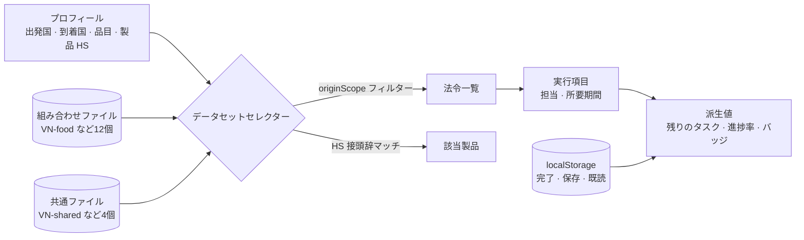

# Neo

<p align="center"></p>

> 海外の輸出規制を「この法律が変わった」ではなく「だからあなたはこれをやるべきだ」に変換する PWA。法令61件・実行項目174件を人の手で相互検証して収録し、インストール後はネットワークが切れてもすべての画面が開く

---

## 1. プロジェクト概要 (Overview)

| 項目 | 内容 |
|---|---|
| プロジェクト名 | Neo（海外輸出規制対応 PWA） |
| 一行要約 | 法務・規制対応チームを持たない輸出中小企業の担当者が、条文を読まなくても「自社製品に該当するか → 何を・いつまでに・誰が」を確認し、完了まで進められるようにする |
| 期間 | 2026.09.05 ~ 2026.09.10（リポジトリ作成 → v1.0.0 → 同日に v2.0 でデザインを全面刷新、v2.0.4） |
| 参加人数 | 個人プロジェクト |
| 本人の役割 | 問題定義、法令調査・相互検証データセットの構築、設計・実装・デプロイのすべて |
| 貢献度 | 100%（リポジトリのコミットはすべて本人） |

物を船に積んだあとも、輸出は到着国の規制を通過して初めて完了する。規制は国と品目ごとに分かれ、原文はベトナム語・日本語・インドネシア語で書かれており、予告なく変わる。大企業にはこれを担うチームがあるが、中小企業にはない。輸出担当者はたいてい品質管理や営業を兼務していて、条文を読む時間がない。それでいて、ミスをすれば通関拒否・リコール・課徴金となって返ってくる。

情報が足りないわけではない。法令は官報で公開されており、法令ニュースレターも多い。ただ、「で、自社製品に該当するのか」という判定はどこにもない。このアプリが売るのは情報ではなく変換である。**条文 → 自社製品の該当有無 → 何を・いつまでに・誰が。**

## 2. 技術スタック (Tech Stack)

| 区分 | 技術 | 選定理由 |
|---|---|---|
| フレームワーク | Next.js 16 (App Router) · React 19 · TypeScript | 法令詳細61ページを静的に事前生成するので、サーバーなしでデプロイできる |
| データ | 静的 JSON 19ファイル + `localStorage` | 法令は人が検証したデータセットなので、サーバーは要らない。プロフィール・完了したアクション・保存した法令だけをブラウザに置く |
| 地図 | `d3-geo` · `topojson-client`（元のスクリプトを npm に移植） | 地図データを静的ファイルとして同梱し、CDN への依存をなくした。オフラインでも地球儀が描かれる |
| スタイル | Tailwind CSS 4 · デザイントークン（`--tds-*`） · Pretendard | v2.0 で Toss デザインシステム（TDS）ベースに刷新。ライトが既定で、ダークは選択式 |
| PWA | 自作のサービスワーカー · Web マニフェスト | フレームワークのプラグインに頼らず、プリキャッシュとランタイムキャッシュを自分で設計した |
| 検証 | 自作のデータ整合性チェッカー（`scripts/check-data.mjs`） | JSON は型チェックの対象にならないので、参照を別途検査する |
| デプロイ | Vercel | 静的な出力物 |

ランタイム依存は `next` · `react` · `react-dom` · `d3-geo` · `topojson-client` の5つだけである。UI ライブラリもボトムシートのライブラリも使っていない。CDN 依存をなくすという判断は、オフライン対応の要件から来たものである。

## 3. 主な機能と担当業務 (Key Features & Contributions)

<p align="center">
  
  
  
  
</p>
<p align="center"><sub>ローカルビルドでキャプチャ。リポジトリに含まれるサンプル企業（ハンマッ食品、韓国 → ベトナム、食品・飲料）で設定した状態。左からホーム · 規制一覧 · 法令詳細 · 地図</sub></p>

### 実装した機能

- **初期設定4ステップ**：出発国 → 到着国 → 品目群 → 製品リスト（HS コード）を選ぶ。このプロフィールが、すべての画面に出るデータを決める。
- **ホーム**：「今やるべきことが残り14件です」のように残りのアクション数を示し、輸出ルート、アクションの進捗率、保留中の法令の通知、タスク一覧、施行中の規制数を表示する。画面上の数字はすべてデータから計算される。
- **規制一覧**：優先順位・すべて・HIGH 以上・施行間近・保存済みのフィルターと、施行日順・リスク順の並べ替え。法令ごとに番号、タイトル、施行日、該当製品数、未完了アクション数、ステータスバッジ（未履行を示す `미이행`、`D-485`、保留を示す `보류`）を付ける。
- **法令詳細**：リスク、ステータス、出典等級（1次・2次）のバッジ。「やるべきこと」をチェックリストで示し、担当部署と所要期間を添える。「何が変わったか」は改正前と改正後を対照して見せる。
- **地図**：出発国から到着国までのルートと、国別のリスク。対応していない国も薄く表示して残す。
- **会社・通知**：会社情報と製品リスト、期限・保留の通知。
- **PWA**：インストール案内、オフラインバー、ライト・ダークのテーマ切り替え（選択を記憶、200ms の遷移）。

### データ設計

- **単位は組み合わせである。** 同じ国でも、品目によって規制の軸が違う。ベトナムの化粧品は製品届出が、日本の化粧品は処方と登録が壁になる。そこで、到着国4か国 × 品目3群 = 12組み合わせのファイルと、国ごとの共通法令4ファイルに分けた。
- **HS コードが実際のマッチングキーである。** 法令は `["16","17","18","19","20","21","2202"]` のように長さがまちまちな接頭辞リストを持ち、製品の HS コードがそのどれかで始まれば該当する。存在しない細分類をでっち上げず、法令が定めた範囲までしか絞り込まない。
- **出発国によっても要件が分かれる。** 韓米 FTA の特恵関税は、出発国が韓国の場合にしか成立しない。`originScope` で除外し、除外された法令の数を一覧の下に1行で記す。変わったものは変わったと、変わらないものは変わらないと書く。
- **リスク**は制裁の強さ × 対応の緊急度 × 自社製品の該当範囲で算出するが、画面には4段階のラベルしか出さない。担当者に必要なのは掛け算の値ではなく、順番である。

### 調査ルール7項

| # | ルール |
|:---:|---|
| 1 | 分からないことは空欄にする。でっち上げない |
| 2 | 独立した出典2つ以上で相互確認する。番号・施行日・主な変更点が一致して初めて記録する |
| 3 | 1次出典（官報・所管省庁）と2次出典（法律事務所・法律DB・試験認証機関）を区別し、画面に表示する |
| 4 | `최종 확인`（最終確認）の日付は、その URL を実際に開いた日である |
| 5 | 期限は法令に明記されたものだけを入れる。画面の数字に合わせるための逆算はしない |
| 6 | その日付が自社品目の日付であることを確認してから入れる |
| 7 | 除外した法令とその理由まで記録する |

### 主な業務

- 4か国 × 3品目の法令調査と相互検証、除外理由・未確認値の記録
- データスキーマ（組み合わせファイル + 共通ファイル）、プロフィール → データセットのセレクター、派生値の計算
- データ整合性チェッカー、サービスワーカー・オフラインの設計と実測による検証
- 8画面の実装、v2.0 でのデザイン全面刷新（トークン・共通部品・文言をヘヨ体に統一）
- 実機での確認と、iOS ホーム画面アプリの不具合修正

## 4. 成果と結果 (Results & Metrics)

### 定量的成果

| 項目 | 結果 |
|---|---|
| データ | 組み合わせ16個（12組み合わせ + 共通4） · 法令 **61件** · 実行項目 **174件** |
| 出典 | 1次 **47** / 2次 **14** · ステータス：施行中 60 · 保留 1 |
| 整合性 | チェッカーの結果「参照整合性 通過」（2026.09 に再実行） |
| オフライン | サーバーを落とした状態で、6画面 + 設定 + 法令詳細61ページがすべて開く |
| アクセシビリティ | タッチターゲット 44px（6画面すべてを確認）、リスク色の面に載る文字のコントラスト最低 5.05:1（v1 で測定） |
| 規模 | コード 7,393行、ランタイム依存5個、CDN 依存0 |
| 実ユーザー · ユーザーテスト | （要確認） |

| 到着国 \ 品目 | 食品・飲料 | 化粧品 | 電気・電子 |
|---|:---:|:---:|:---:|
| VN ベトナム | 4 | 4 | 5 |
| JP 日本 | 5 | 5 | 4 |
| US 米国 | 5 | 5 | 4 |
| ID インドネシア | 4 | 4 | 4 |

これに共通法令8件（VN 電子ラベル・EPR、JP 容器包装の識別表示・再商品化、US 強制労働の推定による輸入排除・原産地表示・韓米 FTA、ID ハラール認証）が加わる。

### 定性的成果

- **ないものはないと記すデータセットを作った。** 調査文書では、除外した法令とその理由（草案段階、義務を負うのが輸入者、別の法令にすでに含まれている）や、空欄にした未確認値のほうが、採用した法令よりも多くの紙幅を占めている。
- **画面の数字をすべて派生値にした。** デザイン成果物に埋め込まれていた `대응 필요 3건`（「対応が必要 3件」）や `규제 5 · 미완 액션 10`（「規制 5 · 未完了アクション 10」）といった数字をすべて計算に置き換えたので、アクションを1つチェックしても食い違う数字は出ない。
- **でっち上げの値を画面から取り除いた。** モックデータに合わせて描いた `D-45` · `D-14` を廃棄し、実在する日付からしかバッジを作らない。サーバーがないので「最終同期」の時刻も消した。アプリが言えるのは「これらの出典をいつ開いて確かめたか」だけである。
- **デザインを1日で丸ごと入れ替えられた。** 色・角丸・影はトークン経由でしか使わないというルールのおかげで、v2.0 の刷新では共通部品と8画面を書き直し、文言をヘヨ体に統一できた。

### 確認された限界

- **法律分析エンジンはない。** 検証したのは、画面・フローの整合性とデータ変換の方法論までである。条文を自動で解釈することはせず、解釈しているふりをする画面も置いていない。
- **データの更新経路がない。** 法令が変われば、人が調査し直してコミットする必要がある。
- **範囲が狭い。** 4か国 × 3品目で、出発国のデータは韓国だけである。拡張の負担はコードよりも調査コストにある。
- **ユーザーテストはできていない。** 「新規ユーザーが60秒以内に、自社に影響する法令1件とアクション1件にたどり着く」という成功基準は、画面遷移の回数を数えることで代わりに確認しただけである。
- **拡大を禁止してある。** アプリらしく扱われるようにするための選択だが、WCAG 1.4.4（200% 拡大）に反する。本文を最小15px にして緩和し、元に戻す方法をドキュメントに記した。
- **通知はアプリ内にしかない。** 期限が迫っても、アプリを開かなければ見えない。「だからあなたはこれをやるべきだ」を最後まで届けるには、アプリを開かなくても届く経路が必要である。

## 5. トラブルシューティング (Troubleshooting)

### ① 一度開いた画面しかオフラインで開かなかった

**問題** 計画書には `data/*.json` をキャッシュすると書いてあった。ところが本番ビルドを立ち上げてホームだけを開き、サーバーを落とすと、ほかの画面はチャンクの読み込みに失敗して真っ白になった。

**原因** 2つ重なっていた。1つ目に、JSON は静的にインポートされて JS チャンクの中に入っているため、個別にキャッシュする URL がそもそもなかった。2つ目に、cache-first のランタイムキャッシュは実際にリクエストされたものしか保存しない。そのため、オンラインのときに開いた画面しかオフラインで開かなかった。

**解決** ビルドフックを使わずに解決した。プリキャッシュしたドキュメントの HTML から静的チャンクへの参照を抜き出し、一緒にキャッシュする。ハッシュ付きのファイル名を知るためにビルドマニフェストを作る必要はない。ルートのドキュメントは URL が固定されないので、アプリからサービスワーカーに知らせる。クライアントナビゲーションのペイロードはクエリのハッシュがビルドごとに変わるため、ドキュメントとは別のキャッシュに入れる。

**結果** ホームを一度開いたあとサーバーを落としても、6画面・設定・法令詳細61ページがすべて開き、地図まで描かれる。検証方法そのものを「実際に切断してみる」と定めた。

### ② デザイン成果物の数字が間違っていた

**問題** デザインのアートボードには、`규제 5 · 미완 액션 10` のような数字や `D-45` · `D-14` のような期限が描かれていた。

**原因** モックデータに合わせて手で書いた値だった。検算してみると、法令5件のアクションは合計10件ではなく9件だった。期限バッジも実在する日付ではなかった。

**解決** 画面のすべての数字をデータから計算するように変え、期限バッジはルールを決めて、実在する日付からしか作らないようにした。

| 条件 | バッジ |
|---|---|
| 法令に明記された期限がある | その日付までのカウントダウン |
| 期限はないが、すでに施行中である | `미이행`（未履行） |
| まだ施行前である | 施行日までのカウントダウン |
| 保留中の法令である | バッジなし |

2行目が微妙なところである。常時適用される義務に、施行日を過ぎたからといって「期限切れ」と付けると誤りになる。逃した日付があるわけではなく、すでに守るべき義務をまだ果たしていない状態だからである。

**結果** ユーザーがアクションをチェックすると、ホーム・一覧・詳細・地図の数字が連動して変わる。すべて派生値なので、計算が正しい限り間違えようがない。

### ③ 法令に書かれた日付が自社品目の日付ではなかった

**問題** ある法令の経過規定に書かれた日付を、そのまま期限として入れようとした。

**原因** その日付は、別の品目の猶予期間の終了日だった。経過規定は品目ごとに終了日が異なることがある。そのまま入れていたら、担当者は存在しない締め切りに合わせて動いていたはずである。

**解決** 調査ルールに「その日付が自社品目の日付であることを確認してから入れる」（第6項）を追加した。確認できなかった期限は空欄にし、空欄にしたという事実を調査文書に記す。

**結果** データセットの期限はすべて、該当品目について確認済みの日付である。自動収集は条文を取ってくることはできても、「この日付は自社品目の日付か」は判定できない。この問題に関しては、人より不正確になる。

### ④ ホーム画面アプリでタブバーの下が切れた

**問題** ブラウザでは問題ないのに、iPhone のホーム画面に追加して開くと、下部タブバーのラベルとホームインジケーターの領域が画面外に押し出された。白背景の画面の上には灰色の帯が残った。

**原因** ホーム画面アプリのモードでは、iOS はビューポート単位（`lvh`）をステータスバーまで含めた画面全体で測るが、Web ビューはステータスバーの下から始まる。その差の分だけフレームが長くなっていた。ステータスバーの領域はアプリが描画できず、iOS が `theme-color` で塗るのだが、その値が薄い灰色1つに固定されていた。

**解決** ビューポート単位からの推測をやめ、最初のペイントの前に `window.innerHeight` を測って `--app-h` に入れる。キーボードが出ても iOS は `innerHeight` を縮めないので、入力中もフレームが揺れない。`theme-color` は、画面を移るたびにその画面の背景色に追従させた（ライト・ダークとも）。

**結果** インストール版でもタブバーが欠けずに表示され、ステータスバーと画面がひと続きの色でつながる（v2.0.4）。

## 6. リンクと成果物 (Links & Deliverables)

| 区分 | リンク |
|---|---|
| GitHub リポジトリ | [stx4R/Neo](https://github.com/stx4R/Neo)（非公開） |
| 公開URL | https://neo-tau-six.vercel.app |

### データフロー



```ts
interface Dataset {
  profile, today, country, category
  laws, actions, products     // 출발국 필터를 이미 통과한 것
  hiddenByOrigin: number      // originScope로 빠진 법령 수
  empty: boolean              // 이 조합에 데이터가 아예 없는가
}
```

画面は「現在のデータセット」のようなグローバル変数を参照せず、この値を引数として受け取る。`null` は「データなし」とは別で、「まだ分からない」を意味する。プロフィールは `localStorage` にあるため、ハイドレーション時のレンダーでは読めない。その1フレームの間、画面は存在しないデータを0で埋めず、スケルトンを描く。

---

+++

## カスタマージャーニーマップ (Journey Map)

ユーザーは、輸出中小企業で品質管理・営業を兼務している輸出担当者である。

| 段階 | ユーザーの行動 | ユーザーの考え | アプリの対応 |
|---|---|---|---|
| 設定 | 到着国・品目・製品を選ぶ | 「HS コードって何だったっけ？」 | 品目群を選ぶと、代表的な製品と HS コードが既定値として入る |
| 把握 | ホームを開く | 「うちに関係あるものはある？」 | 「今やるべきことが残り14件です」の一文と進捗率 |
| 優先順位 | 規制一覧を見る | 「何から手をつければいい？」 | リスク順・施行日順の並べ替え、`미이행`・`D-485` バッジ |
| 実行 | 法令詳細でタスクをチェックする | 「これ、誰がやるの？」 | タスクごとの担当部署と所要期間 |
| 確信 | 出典を確認する | 「これ、信じていいの？」 | 1次・2次出典のバッジ、最終確認日 |
| 移動中 | 現場でもう一度開く | 「今ネットにつながらないんだけど」 | インストールしておけば、オフラインでもすべての画面が開く |

## アダプティブデザイン (Adaptive Design)

- 402 · 375 · 1400 の3つの幅で、組み合わせを変えながら確認した。広い画面でも、モバイル幅のフレームを中央に置く。
- セーフエリアは固定値を使わず、`env()` で読み取る。ブラウザのタブではセーフエリアが0なので、ステータスバーの帯が消えるのが正しい。存在しないステータスバーを真似ると、空の帯だけが残る。
- ホーム画面アプリでは画面の高さに実測値を使い（トラブルシューティング④）、画面ごとにステータスバーの色を合わせる。
- ライトが既定で、ダークはホーム上部のボタンでオンにする。選んだテーマは記憶し、最初のペイントの前に適用するのでちらつきがない。

## モーションデザイン (Motion Design)

- テーマを切り替えると、200ms かけて色が移り変わる。
- プロフィールを読み込む前の1フレームは、スケルトンが脈打つように明滅する。`prefers-reduced-motion` のときはパルスを止める。
- 地図では出発国から到着国までのルートが線で描かれ、重なり合う国のマーカーは互いに避けて位置を取る。

## セキュリティ脆弱性管理 (DREAD)

サーバーもアカウントもなく、ユーザーデータは端末の外に出ない。このアプリで最大のリスクはハッキングではなく、**誤った情報が事実のように見えること**である。そこで、情報の完全性を脅威として扱う。

| 脅威 | 損害 | 再現性 | 悪用性 | 影響ユーザー | 発見性 | 対応 |
|---|---|---|---|---|---|---|
| 別の品目の日付を期限として表示する | 高 | 中 | — | 該当する組み合わせのユーザー | 低 | 調査ルール第6項 — **適用** |
| 法令改正後も古いデータを表示し続ける | 高 | 高 | — | 全体 | 中 | 出典ごとに最終確認日を表示。更新手順は**残る課題** |
| 2次出典を1次出典のように見せてしまう | 中 | 低 | — | 全体 | 低 | 出典等級バッジ — **適用** |
| 参照が切れてアクションが黙って消える | 中 | 中 | — | 該当する法令 | 低 | 整合性チェッカー（1つのアクションが2つの法令にまたがるか、孤立したアクションがあれば失敗） — **適用** |

悪用性の欄は空けてある。表の脅威は誰かの悪用から来るのではなく、調査と表示の過程で起きる誤りから生じる。
