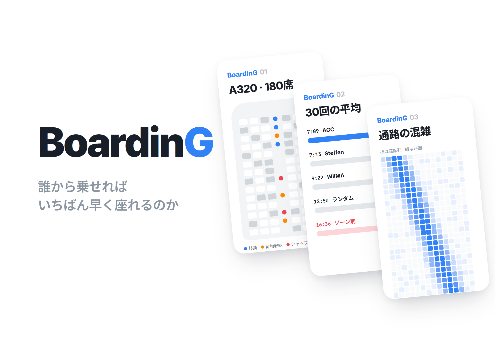
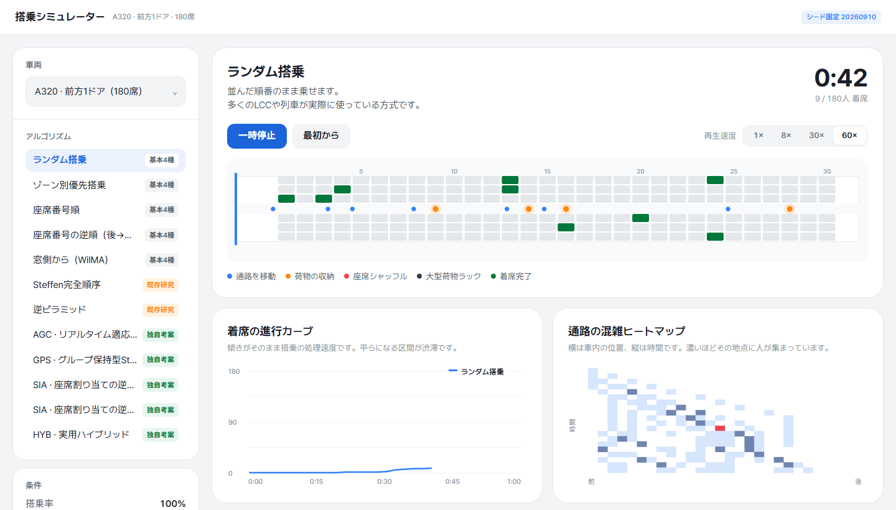
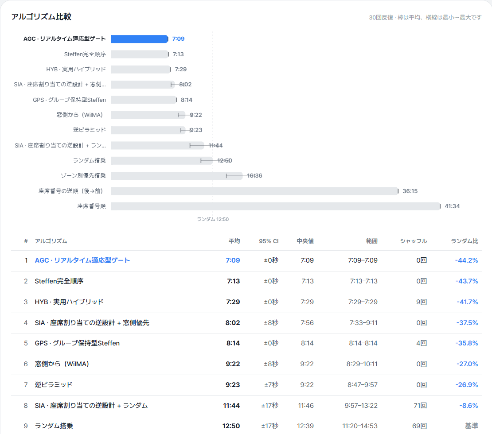
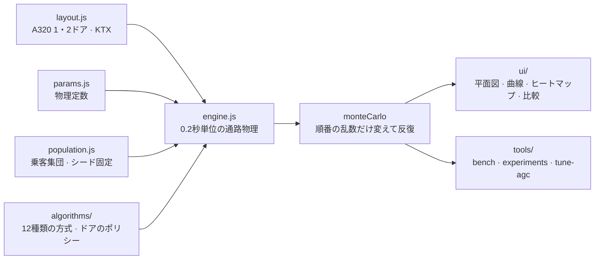

# BoardinG

> 「飛行機や列車に人を最も速く乗せる順番は何か」を、通路の物理・荷物の収納・座席シャッフルまでモデル化したエージェントベースのシミュレーターで検証したプロジェクト

---

## 1. プロジェクト概要 (Overview)

| 項目 | 内容 |
|---|---|
| プロジェクト名 | BoardinG（搭乗シミュレーター） |
| 一行要約 | 12種類の搭乗方式を同じ乗客集団で比較し、独自に考案した4方式で「順番の最適化の先」にある改善軸（撹乱への耐性・座席割り当て・ドアの数・ホームでの案内）を見つけた |
| 期間 | 2026.09.10（v1.0.0 → v1.1.4、1日） |
| 参加人数 | 個人プロジェクト（基本4種の比較は課題の要件。課題の背景は要確認） |
| 本人の役割 | モデル設計、シミュレーションエンジン・アルゴリズム・実験ツール・可視化の実装、結果分析 |
| 貢献度 | 100%（リポジトリのコミット6件すべて本人） |

航空会社の多くは後方のゾーンから乗せる。それが本当に速いのか、もっと速い方法があるならなぜ使わないのかが気になった。答えを出すには、まず人が通路でお互いをどう塞ぐのかをモデル化する必要がある。前の人が荷物を上げている間、後ろの人は待たされるし、窓側の乗客が遅れて来れば、すでに座っている人が立ち上がって道を空けなければならない。このシミュレーターはその摩擦を物理として再現し、その上で搭乗方式を競わせる。

## 2. 技術スタック (Tech Stack)

| 区分 | 技術 | 選定理由 |
|---|---|---|
| シミュレーション | Vanilla JavaScript（ESモジュール）、シード固定の乱数 | エンジンをブラウザとNodeで共用する。同じシードなら同じ結果が出るので、比較を再現できる |
| 可視化 | Canvas 2D（客室の平面図・着席曲線・混雑ヒートマップ・比較用の棒グラフ） | チャートライブラリを使わずに自分で描いた |
| 実験ツール | Nodeスクリプト（`bench` · `experiments` · `tune-agc`） | モンテカルロ比較と4種類の実験をコマンド1行で再現する |
| デプロイ | GitHub Pages · ローカルの静的サーバー（`tools/serve.mjs`） | ESモジュールは`file://`では読み込めないので、静的サーバーで立ち上げる |

外部依存はない。`package.json`にはスクリプトしか書かれていない。

## 3. 主な機能と担当業務 (Key Features & Contributions)

ローカルでキャプチャ。上：ランダム搭乗を60倍速で再生中（通路の移動・荷物の収納・座席シャッフルが色分けされ、下に着席曲線と通路の混雑ヒートマップ）。下：「全体を比較する」の30回反復の結果

### 何をモデル化したか

通路を1次元の連続空間とみなし、0.2秒単位で前進させる。

| 要素 | モデル |
|---|---|
| 通路の移動 | 追い越し不可。前の人と`bodyGap`（0.45 m）を保つので、渋滞が後ろへ伝わる |
| 荷物の収納 | 自分の列に着くと、`stowBase + バッグ1個あたりの時間`だけ通路を塞ぐ |
| 収納時の腕の幅 | 荷物を上げる人の後ろには`stowGap`（0.95 m）が必要になる。座席ピッチ（0.81 m）より大きい |
| 座席シャッフル | 内側の席に入るとき、すでに座っている外側の乗客b人が通路に出てくる |
| 同行者 | 隣接した座席を割り当てる。窓側から入るので、グループ内のシャッフルは0 |
| ドアの処理能力 | ドア1つが通せる最大速度（航空機2.0秒/人、列車1.0秒/人） |
| 大型荷物ラック | 列車専用。大きな荷物を持った乗客が乗降口の横で立ち止まり、出入口を塞ぐ |
| 撹乱 | 列の順番の乱れ（σ）と、呼び出し時にゲートにいない遅刻者の割合 |

最も重要なのは`stowGap > pitch`の1行である。「隣り合う2列で同時に荷物を上げられない」はルールとして決めたものではなく、物理から出てくる。だからSteffen方式が1列おきに乗せる理由も、仮定ではなく結果として現れる。

### 実装した機能

- **車両3種**：A320の前方1ドア・前後2ドア（180席）、KTX-山川（360席の10号車）。
- **12種類の搭乗方式**：基本4種（ランダム · ゾーン別に後方→前方 · 座席番号順とその逆順 · 窓側から乗るWilMA）、既存研究の2種（Steffenの完全順序 · 逆ピラミッド）、独自考案の4種（AGC · GPS · SIA · HYB）とSIAの変形。
- **再生**：1× · 8× · 30× · 60×の倍速で、乗客の状態（通路の移動 · 荷物の収納 · 座席シャッフル · 大型荷物ラック · 着席完了）を色で区別する。
- **分析チャート**：着席の進行曲線（傾きがそのまま処理能力）、通路の混雑ヒートマップ（横が位置、縦が時間）、全体比較の棒グラフ（平均と最小〜最大）。
- **条件の調整**：搭乗率、ドアの処理能力、順番の乱れσ、遅刻率、同行者をまとめるかどうか、反復回数。結果はCSVで書き出せる。

### 独自に考案した4方式

既存の方式はどれも座席の幾何（何列目か、窓側か）しか見ていない。以下の4つは、それぞれ別のレバーに手をかける。

| 方式 | 要点 |
|---|---|
| **AGC** リアルタイム適応型ゲート | 列の順番を事前に決めない。ゲートが空くたびに通路の状態を見て、次の1人を選ぶ。局所的な判断だけで、Steffenの構造（12ウェーブ × 15人、シャッフル0）を自力で再発見する |
| **GPS** グループ保持型Steffen | 同行者を1単位にまとめ、代表者のSteffen順位で並べる。「グループを分けない」という制約のコストを測る |
| **SIA** 座席割り当ての逆設計 | チェックインの段階で、荷物の多い乗客や大人数のグループを後方の窓側に、荷物のない乗客を前方の通路側に割り当てる。搭乗順とは直交するレバーである |
| **HYB** 実用ハイブリッド | SIA + GPS。グループを分けずに、座席割り当てまで活用する |

### 主な業務

- 通路・収納・シャッフル・ドア・撹乱の物理モデルとシミュレーションエンジン
- 12種類の搭乗方式の実装、公平な比較のための乗客集団の固定
- 4種類の実験ツール（ドアのボトルネック · 2ドアの分割点 · 撹乱への耐性 · KTXのホーム）とAGCのパラメータ調整スクリプト
- 客室の平面図・着席曲線・ヒートマップ・比較チャートのUI

## 4. 成果と結果 (Results & Metrics)

### 定量的成果

**A320 · 180席 · 1ドア · 30回反復**（`node tools/bench.mjs --runs 30`、2026.09に再実行した結果がREADMEと一致）

| # | 方式 | 平均 | シャッフル | ランダム比 |
|---|---|---|---|---|
| 1 | **AGC** リアルタイム適応型ゲート | **7:09** | 0 | **−44.2%** |
| 2 | Steffen完全順序 | 7:13 | 0 | −43.7% |
| 3 | **HYB** 実用ハイブリッド | 7:29 | 9 | −41.7% |
| 4 | **SIA** + 窓側優先 | 8:02 | 0 | −37.5% |
| 5 | **GPS** グループ保持型Steffen | 8:14 | 4 | −35.8% |
| 6 | 窓側の席から（WilMA） | 9:22 | 0 | −27.0% |
| 7 | 逆ピラミッド | 9:23 | 0 | −26.9% |
| 8 | **SIA** + ランダム | 11:44 | 71 | −8.6% |
| 9 | ランダム搭乗 | 12:50 | 69 | — |
| 10 | ゾーン別優先搭乗 | 16:36 | 71 | **+29.4%** |
| 11 | 座席番号の逆順 | 36:15 | 60 | +182.5% |
| 12 | 座席番号順 | 41:34 | 60 | +223.9% |

| 実験 | 結果 |
|---|---|
| 1. ドアのボトルネック | ドア2.0秒/人のとき、Steffenは理論下限（6:00）まで73秒差に迫る。順番の最適化は事実上もう行き着いている |
| 2. 前後2ドア | 最適な分割は30列のうち16列（前方96人 · 後方84人）。1ドアの7:13 → 2ドアの4:19（−40%） |
| 3. 撹乱への耐性 | 順番の乱れσ=25 + 遅刻10%のとき、Steffenは+35%（9:44）、AGCは+6%（7:35）。差は2分9秒 |
| 4. KTXのホーム | 乗客を自分の号車のドアへ誘導するだけで、どの方式でも46〜51%短縮（AGC 3:09 → 1:42） |
| 実測によるキャリブレーション · 実際の搭乗との比較 | （要確認） |

モデルの妥当性は、文献（Steffen 2008）が報告している相対的な順位で確かめた。Steffen ≪ WilMA < ランダム < ゾーン別の後方→前方 ≪ 座席番号順が再現され、ランダム比の数値も文献の範囲（Steffen −39%、ゾーン別 +24%）と合っている。

### 定性的成果

- **業界標準がランダムより遅いことを示した。** ゾーン別の後方→前方搭乗はランダムより29%遅い。原因はヒートマップを見ればすぐわかる。同じゾーンの乗客が通路の同じ場所に集まってお互いを塞いでいる間、通路の残り80%は空いている。
- **「順番の先」の軸を見つけた。** 座席が固定されている限り、Steffenはすでに物理的な最適に近い。そこで目標を、より速い並べ方から、実現可能性（GPS）、撹乱への耐性（AGC）、別のレバー（SIA・ドアの数・ホームでの案内）へと移した。
- **制約のコストを数値にした。** グループを分けないGPSはSteffenより61秒（+14%）遅い。HYBはグループを分けずにSteffenとの差を16秒に抑える。Steffenが現実に使われない理由が速度ではなく社会的な制約にある、という根拠になる。

### 確認された限界

- **通路を1次元として扱っている。** 実際には幅方向に少し体をかわしてすれ違う動きがあるので、シャッフル時間を過大に見積もっている可能性がある。
- **物理定数は文献の範囲に合わせただけで、実測で補正していない。** 絶対値よりも相対的な順位を信じるべきである。
- **乗客集団が1つしかない。** ベンチでは乗客の属性（荷物・歩行速度・収納時間）を1つのシードで一度だけ生成し、30回の反復では搭乗順のランダム性だけを変える。そのためSteffenのように順番が決まっている方式は、30回とも同じ値（±0秒）になる。別の乗客集団でも順位が保たれるかは確かめていない。
- **降車や乗降の同時進行はモデルに含まれていない。** 列車の途中駅での停車を分析するには必要になる。
- **指示に従う度合いをσ1つにまとめてしまった。** 個人の呼び出しかゾーンの呼び出しかによってσが変わるモデルのほうが正確である。

## 5. トラブルシューティング (Troubleshooting)

### ① 貪欲法のゲートが「窓側から」を見つけられなかった

**問題** AGCは、ゲートが空くたびにコストが最小の乗客を選ぶ貪欲法である。コストに「自分が払うシャッフル」だけを入れると、窓側から埋めていく順番が出てこない。

**原因** 窓側の乗客を先に乗せる利益は、その乗客本人ではなく、後から来る同じ列の中央席・通路側の乗客に返ってくる。自分のコストしか見ない貪欲法には、この利益が見えない。

**解決** コストを双方向にした。自分が払うシャッフルに、自分が他人に負わせるシャッフル（同じ列の内側にまだ残っている待機者の数）も加える。さらに「前の人よりドア寄りの席に座る乗客は、前の人を追い越す必要がないので決して詰まらない」という単調減少チェーンのルールを加えた。投入する目的地をドア側へ詰め続けながらも`stowGap`分は空け、それ以上詰める席がなくなったらチェーンを切って最後尾から新しく始める。4つの重みは、調整スクリプト（`tools/tune-agc.mjs`）で96通りの組み合わせをグリッドサーチして選んだ。

**結果** AGCはSteffenの順番を覚えさせなくても、12ウェーブ × 15人、シャッフル0という同じ構造を自力で見つけた（7:09、Steffenは7:13）。構造が崩れる撹乱のある状況では、その場で改めて最適を探し、Steffenより2分9秒速かった。

### ② 「荷物の多い人を後回しにすれば速くなる」という仮説が外れた

**問題** BLW（荷物で重み付けしたウェーブ）は、Steffenの各ウェーブの中で荷物の多い前方席の乗客を後回しにすれば、ウェーブ切り替えのコストが減るだろうという仮説だった。結果はSteffenより53秒遅かった。

**原因** Steffenの速さは、待ち行列の目標列番号が単調減少するという性質1つから生まれている。ウェーブの中で誰かを後回しにすると、その地点で目標列が後ろへ跳ね、その人は前にいる全員を追い越さなければならなくなる。荷物の重み付けで得られる利益より、単調性が崩れる損失のほうが大きかった。

**解決** 仮説は捨て、失敗をREADMEに記録した。ここで得た結論をもとに、独自方式の目標を変えた。座席が固定された状態で順番をさらに磨いても意味がないので、Steffenが無視している軸である実現可能性（GPS）、撹乱への耐性（AGC）、座席割り当て（SIA）を狙った。

**結果** この方向転換から生まれたAGCが1位、HYBが3位になり、SIAも「列を並ばせられない状況でも−8.6%」という別の成果を出した。

### ③ 方式どうしを比べているのに、乗客が毎回違っていた

**問題** 方式ごとに乗客を生成し直すと、荷物の多い乗客がどこに何人座るかで結果がぶれ、方式間の差が運に埋もれてしまう。

**原因** 搭乗時間のばらつきの大部分は、方式ではなく乗客の属性から生じる。

**解決** 乗客個々の属性（荷物の数、歩行速度、収納時間）は1つのシードで一度だけ生成し、すべての方式がまったく同じ人たちを乗せるようにした。方式によって変わるのは、順番と（SIAの場合は）座席割り当てだけである。

**結果** 差が方式からしか生じなくなったので、1位と2位の4秒差まで比較できるようになった。その代わり、結果が1つの乗客集団に縛られるという限界が生まれた（前述の「確認された限界」）。

## 6. リンクと成果物 (Links & Deliverables)

| 区分 | リンク |
|---|---|
| GitHub リポジトリ | [stx4R/BoardinG](https://github.com/stx4R/BoardinG)（非公開） |
| 公開URL | https://stx4r.github.io/BoardinG/ |
| 再現 | `node tools/bench.mjs --runs 30` · `node tools/experiments.mjs bound / split / disruption / train` |

### 構成

新しい方式は、`algorithms/`にファイルを追加して`index.js`に登録すれば、UI・ベンチ・実験に自動で組み込まれる。

---

+++

## カスタマージャーニーマップ (Journey Map)

ユーザーは、搭乗方式を比べてみたい学生や授業の聴衆である。

| 段階 | ユーザーの行動 | ユーザーの考え | シミュレーターの対応 |
|---|---|---|---|
| 観察 | ランダム搭乗を再生する | 「なんでこんなに詰まるんだろう？」 | 荷物の収納（オレンジ）とシャッフル（赤）が通路を塞ぐ様子が平面図に表示される |
| 比較 | ゾーン別搭乗に切り替えて再生する | 「航空会社のやり方だから速いはず」 | ヒートマップで1か所にだけ人が集中し、着席曲線の立ち上がりも遅くなる |
| 確認 | 「全体を比較する」を押す | 「じゃあ一番速いのはどれ？」 | 12方式の30回平均と範囲を棒グラフで示す |
| 実験 | 順番の乱れσと遅刻率を上げる | 「現実では列なんて守らないよね」 | Steffenは大きく遅くなり、AGCはほとんど変わらない |
| 共有 | CSVで書き出す | 「発表資料に使いたい」 | 方式別の統計がファイルとして出力される |

## モーションデザイン (Motion Design)

- 乗客の点は状態によって色が変わる（通路の移動は青 · 荷物の収納はオレンジ · 座席シャッフルは赤 · 大型荷物ラックは濃い灰色）。渋滞が後ろへ伝わっていく様子が動きとして見える。
- 再生速度を1×〜60×で切り替え、全体の流れと1か所の摩擦を交互に確認できる。

## アダプティブデザイン (Adaptive Design)

- 左側に車両・方式・条件・実行のパネルを、右側に再生画面と分析チャートを配置した。比較結果は棒グラフと表をあわせて表示する。
