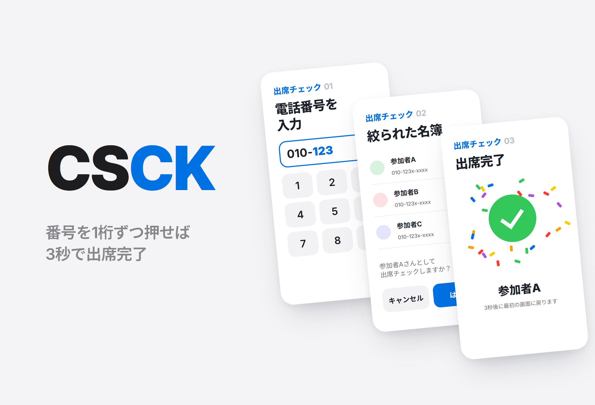
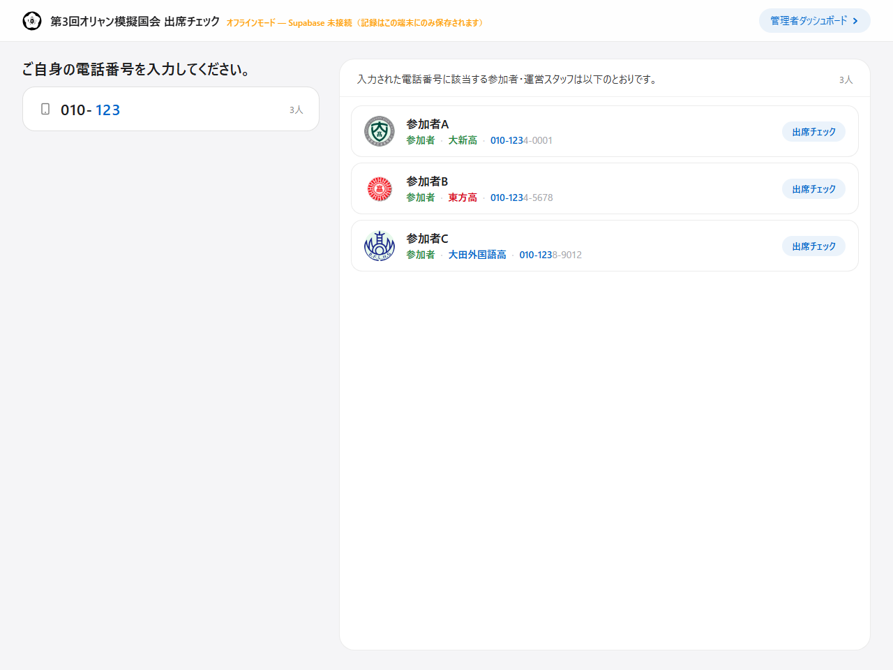
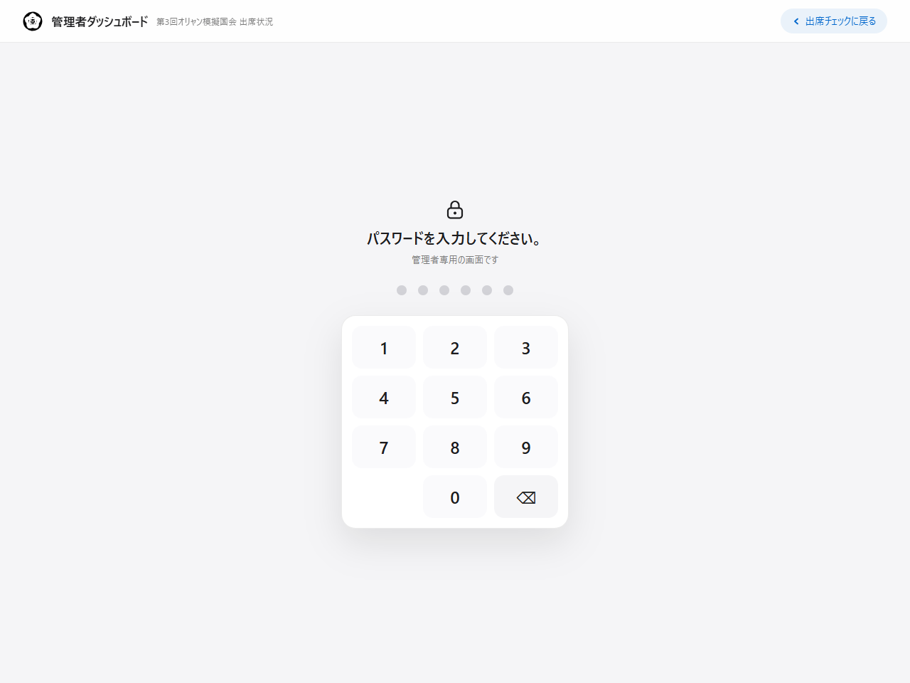
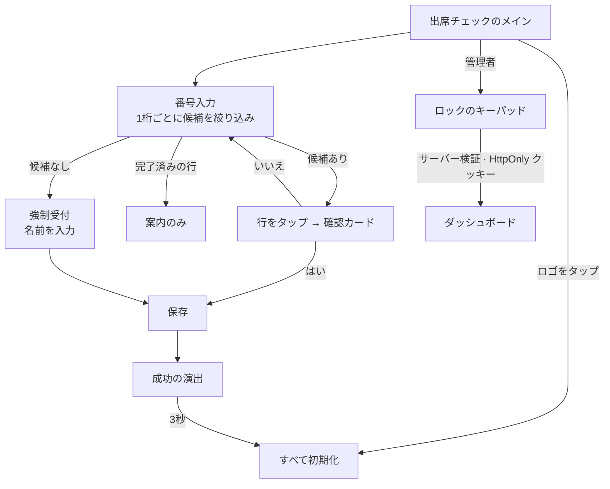

# CSCK

<p align="center"></p>

> 第3回オリャン模擬国会の会場入口に置いた共用タブレットで、初めて見る人でも説明なしに3秒以内で出席登録を終えられるように設計した出席チェックキオスク

---

## 1. プロジェクト概要 (Overview)

| 項目 | 内容 |
|---|---|
| プロジェクト名 | CSCK（第3回オリャン模擬国会 出席チェック · MoGuk Attendance Check） |
| 一行要約 | 電話番号を1桁押すたびに名簿が絞り込まれ、名前を押して確認すれば終わる。サーバーがなくても、ネットワークが切れても、同じビルドがそのまま動く |
| 期間 | 2026.07.11 ~ 2026.07.20（10日間）・行事（常任委員会 07.18、本会議 07.25）の入場用 |
| 参加人数 | 個人プロジェクト |
| 本人の役割 | 企画、UX 設計、全体の実装、デプロイ |
| 貢献度 | 100%（リポジトリのコミット16件はすべて本人） |

会場入口の出席チェックは、たいてい紙の名簿とボールペンで行う。列が長くなり、誰が来たかをリアルタイムで把握できず、終わった後には名簿を書き写し直さなければならない。ところが、電子化したものが紙より遅くなることもよくある。アプリを入れてもらおうとすれば列が止まり、ログインを求めればさらに止まり、QR コードを配れば QR をなくした人のところで完全に止まる。

この行事の名簿には、大新高・東方高・大田外国語高の3校の参加者と運営スタッフ、計133人が載っていた。設計の基準は一文だった。**初めて見る人が、説明なしで、3秒以内に終える。** これに寄与しない機能は入れなかった。

| 現場の制約 | 設計への影響 |
|---|---|
| 端末が共用である | ログインがない。個人アカウントを前提にできない |
| 利用者が毎回変わる | 学ぶ機会がない。2回目の利用が1回目より速くなることはありえない |
| 列ができている | 1人の遅れが後ろ全員の遅れになる。行き止まりがあってはならない |
| 運営スタッフが付きっきりではない | 説明なしで終わらなければならず、押し間違えても元に戻せなければならない |
| 現場のネットワークを信用できない | サーバーが落ちても、受付は続けられなければならない |

## 2. 技術スタック (Tech Stack)

| 区分 | 技術 | 選定理由 |
|---|---|---|
| フレームワーク | Next.js 15（App Router）· React 19 · TypeScript | キオスク画面と管理者ダッシュボード、ロック API を1つのプロジェクトに置く。ミドルウェアで、ダッシュボードをサーバー側でロックする |
| データ | Supabase（Postgres · Realtime）↔ `localStorage` の自動切り替え | 環境変数があればリモートの DB、なければブラウザのストレージで動く。この違いを知っているのは、データ層のファイル1つだけである |
| スタイル | 自前で書いた CSS（デザイントークン · アニメーション） | ランタイムの依存を4つ（Next · React · React DOM · Supabase SDK）に抑えた |
| 認証 | サーバールート + `HttpOnly` クッキー（8時間） | ダッシュボードのパスワードはサーバー側でのみ確認する。クライアントでの検査は、バンドルを開けば見えてしまう |
| デプロイ | Vercel · iPad Safari の「ホーム画面に追加」 | アプリストアの審査もインストールファイルもなしに、URL 1つでフルスクリーンのキオスクになる |

## 3. 主な機能と担当業務 (Key Features & Contributions)

<p align="center"></p>
<p align="center"><sub>ローカルビルドでキャプチャ。名簿は架空の参加者12人に置き換えた。「010-123」まで入力した状態で、サーバーの設定がないため、ヘッダーにオフラインモードの警告が出ている。</sub></p>

### 実装した機能

- **段階的な絞り込み**：電話番号を最後まで入力させない。1桁押すたびに名簿を前方一致で絞り込み、残りの人数を入力欄の横に表示する。リストの各行は入力済みの桁を青色で、残りを薄く表示するので、なぜこの人が候補に出てきたのかが読み取れる。自分の名前が見えた瞬間が、入力をやめるタイミングである。
- **確認カード**：行を押してもすぐには記録せず、「OO さんとして出席チェックをしますか？」というカードを表示する。名前は一番大きく書く。確認すべき対象は操作ではなく、人だからである。
- **完了した人もリストに残す**：すでにチェック済みの人は、ボタンが `출석 완료`（「出席完了」）のバッジに変わった状態で残る。リストから消してしまうと、もう一度来た人が自分の記録を確かめる手段がなくなり、運営スタッフを探すことになる。
- **強制受付**：名簿にない番号なら「強制的に進めますか？」と表示し、名前を入力してもらったうえで、同じストレージに `forced` の印を付けて記録する。名前も分からなければ `(이름 미입력)`（「名前未入力」）として残す。現場の流れは止めず、事後の区別はできるようにした。
- **3秒での自動復帰**：保存されるとチェックのアニメーションと紙吹雪の演出が出て、3秒後に入力・キーパッド・パネルがすべて閉じる。次の人は、前の画面を消す方法を知らなくてよい。
- **重複の三重防御**：保存中フラグで連打を防ぎ、クライアント側ですでにチェック済みの人かどうかを照合し、DB のユニークインデックス（`attendance_once_idx`）の違反コード（`23505`）を受け取ったら「すでに出席済み」の案内に切り替える。強制受付は重複を許可する。
- **タッチガード**：ピンチズーム・ダブルタップズーム・長押しでのコピー・テキスト選択・画像のドラッグ・タップハイライトを防ぐ。入力欄だけは例外として解除してある。
- **管理者ダッシュボード**：出席状況と記録の表をリアルタイムで表示する。通常のチェックと強制チェックが同じ名前で両方ある場合は、別の色で表示する。ダッシュボードはミドルウェアがロックし、パスワードのキーパッドは桁数が埋まると自動で送信され、間違えるとカードが左右に揺れる。

### 主な業務

- 現場の制約から出発した UX 設計（段階的な絞り込み、確認カード、強制受付、自動復帰）
- データ層の設計：リモート DB ↔ ローカルストレージの自動切り替え、呼び出し側での分岐0
- リアルタイム更新の二重化（Realtime の購読 + 5秒ごとのポーリング + 画面復帰イベント3種類）
- ダッシュボードのサーバー側ロック（ミドルウェア · サーバールート · `HttpOnly` クッキー）
- 名簿の個人情報をリポジトリから取り除く作業（後述のトラブルシューティング②）

## 4. 成果と結果 (Results & Metrics)

### 定量的成果

| 項目 | 結果 |
|---|---|
| 対象 | 名簿133人（参加者・運営スタッフ、3校） |
| 入力 | 電話番号全体（8桁）ではなく、候補が1人になるまでだけ入力 |
| 画面 | キオスク · ロック · ダッシュボードの3つ、コード1,140行 |
| ランタイムの依存 | 4つ |
| リアルタイム更新 | 購読 + 5秒ごとのポーリング + 復帰イベント3種類 |
| 実際の出席処理人数 · 強制受付の割合 · 1人あたりの所要時間 | （要確認） |

「3秒以内に終える」は設計上の目標であって、現場で測った値ではない。

### 定性的成果

- 学習できない利用者を前提にしたところ、チュートリアル・設定・記憶される状態がすべて不要になった。残るのは今画面に見えているものだけで、それだけで完結するように作った。
- データ層をファイル1つに隔離したことで、行事の前日にノートパソコンでインターネットなしのリハーサルができ、サーバーの設定が終わる前に画面を完成させられた。
- フォールバックの状態を隠さなかった。ローカル保存モードのときは、ヘッダーに警告を表示する。黙ってローカルに保存していると、運営スタッフはサーバーに記録が溜まっていると思い込み、行事が終わってから気づくことになる。
- 改訂を重ねる中で、画面ごとに少しずつ違っていた同じ要素を1つに統一した（07.18、207行追加・236行削除）。キオスクで同じものが違う見た目をしていると、利用者は別のものだと受け取ってしまう。

### 確認された限界（2026.09 時点のコード）

- **名簿が依然としてブラウザに露出しうる。** フォールバック用の名簿を `NEXT_PUBLIC_ROSTER_JSON` 環境変数に移したが、`NEXT_PUBLIC_` の値はビルド時にクライアントのバンドルに入る。リモート DB 側も、前方一致の検索をブラウザで行うために、名簿テーブルを匿名キーで読めるように開けてある（`anon can read roster ... using (true)`）。匿名キーはバンドルに含まれているので、誰でも電話番号入りの名簿を照会できる。検索をサーバー関数に移し、結果にはマスキングした番号だけを返すべきである。非公開リポジトリの履歴にも名簿が残っている。
- **ダッシュボードのデフォルトパスワードがコードと README に書かれている。** 環境変数を設定しなければ、その値で開いてしまう。クッキーのトークンもパスワードの SHA-256 値1つだけなので、すべての管理者が同じトークンを使い、個別に切断できない。
- **標準的な PWA の要件は満たしていない。** Web マニフェストと Service Worker がないため初回の読み込みにはネットワークが必要で、オフラインでの動作は記録保存のフォールバックに限られる。
- **横向きの大画面専用である。** 最小幅が 1024px なので、縦向きのタブレットやスマートフォンではレイアウトが成り立たない。
- **拡大の禁止は、アクセシビリティと引き換えである。** キオスクとしての操作感のために拡大を禁止しており、これは弱視の利用者のニーズと衝突する。
- **記録の修正画面がない。** 誤って入った記録は DB のコンソールで削除する必要があり、強制受付を通常の記録に変える画面もない。

## 5. トラブルシューティング (Troubleshooting)

### ① ネットワークが不安定になると、ダッシュボードが黙って止まる

**問題** 管理者ダッシュボードは、Realtime の購読で新しい出席を即座に受け取る。ところが会場のネットワークが一瞬切れたり、タブレットの画面が消えてまた点いたりすると、購読が切れたまま画面は正常に見える。運営スタッフは、誰も来ていないと思い込んでしまう。

**原因** 購読は切れても、エラーを画面に出さない。キオスク用のタブレットは画面が消えてまた点くのが通常の運用なので、この状況が頻繁に起きる。

**解決** 更新の経路を重ねておいた。購読とは別に5秒ごとにポーリングし、タブが再び表示されたとき・ウィンドウにフォーカスが戻ったとき・オンラインに復帰したときには、すぐに読み直す。ポーリングのせいで画面が定期的に再描画されないよう、受け取った記録をシリアライズし、直前の値と同じなら状態を変えない。

**結果** 購読が生きていれば即座に、切れていても5秒以内に、画面が再び点けばその場で最新の状態になる。変化がなければ、画面はそのままである。

### ② 参加者133人の電話番号がリポジトリに入っていた

**問題** 最初のバージョンでは、名簿をシードの SQL（`supabase/seed.sql`）とフォールバック用の `lib/roster.ts` の2か所に、コードとして入れていた。どちらも名前と電話番号133件を含んでいた。サーバーの設定なしでもデモが動くようにするための選択だったが、リポジトリを開いた人は誰でも参加者の連絡先を見られた。

**原因** 「サーバーがなくても同じビルドが動く」という目標を、名簿のデータにもそのまま当てはめてしまった。画面のコードとデータを同じリポジトリに置いたことで、コードと個人情報の境界があいまいになった。

**解決** 2回に分けて取り除いた。07.13 にシードの SQL とスキーマのファイルをリポジトリから削除し、07.20 に `roster.ts` を削除したうえで、名簿をデプロイ環境の環境変数から読むように変えた。名簿は今では、リポジトリの外から注入される。

**結果** 現在のコードに個人情報はない。ただし前述の「確認された限界」のとおり、環境変数はクライアント向けで、リポジトリの履歴と DB の参照ポリシーも残っている。完全に解決するには、名簿の検索をサーバーに移し、履歴を整理する必要がある。

### ③「外側を押すと閉じる」が「どこを押しても閉じる」にならないように

**問題** キーパッドは、外側をタップすると閉じるようにした。閉じるボタンを探させないためである。ところが外側のタップをドキュメント全体で受け取ると、リストの名前や確認カードを押したときにもキーパッドが閉じてしまい、肝心のタップが効かない。

**原因** ドキュメント全体に登録した「外側タップ」のハンドラーが、リスト・カード・キーパッド内部のタップまで受け取っていた。イベントが内側の要素から外側へ伝播するからである。

**解決** リスト・確認カード・キーパッド内部のタップはそれぞれ伝播を止め、本当に外側を押した場合だけ閉じるようにした。タッチガードも同じ原則で組んだ。コピーメニューとテキスト選択はグローバルに禁止しつつ、入力欄だけを明示的に解除した。グローバルにロックするだけでは、名前の入力ができなくなる。

**結果** キーパッドは何もない場所を押すと閉じ、リストとカードは正常に押せる。

## 6. リンクと成果物 (Links & Deliverables)

| 区分 | リンク |
|---|---|
| GitHub リポジトリ | [stx4R/CSCK](https://github.com/stx4R/CSCK)（非公開） |
| 公開URL | https://stx4r.me/project/CSCK |

<p align="center"></p>

### 画面フロー



データ層：

```
                                  ┌─ 環境変数あり → Supabase（リモートテーブル · 購読 + ポーリング）
画面コード ──→ lib/attendance.ts ─┤
                                  └─ 環境変数なし → localStorage（storage イベント + ポーリング）+ ヘッダー警告
```

---

+++

## カスタマージャーニーマップ (Journey Map)

| 段階 | ユーザーの行動 | ユーザーの考え | キオスクの対応 |
|---|---|---|---|
| 到着 | 列に並び、タブレットの前に立つ | 「何をすればいいんだろう？」 | 画面の1行目は「自分の電話番号を入力してください。」の一文だけ |
| 入力 | 番号を押し始める | 「全部押さないといけないの？」 | 1桁ごとに候補が減り、残りの人数が見える。自分の名前が見えたら止める |
| 選択 | 名前を押す | 「押し間違えたら？」 | 名前を大きく書いた確認カードが表示される |
| 例外 | 名簿にないと表示される | 「申し込んだはずなのに？」 | 強制受付で名前だけを入力してもらい、通す |
| 完了 | チェックのアニメーションを見る | 「これで済んだのかな？」 | 大げさな成功演出で確信を与える。3秒後に次の人向けの画面に戻る |
| 再確認 | もう一度来て番号を押す | 「ちゃんとできてたっけ？」 | `출석 완료` のバッジがそのまま残っている |

## アダプティブ・予測型デザイン (Adaptive & Predictive Design)

- **アダプティブ**：横向きの iPad（最小幅 1024px）を基準に、画面を固定で設計した。共用端末1種類に合わせた配置なので、ウィンドウサイズによって崩れることはない。
- **予測型**：利用者が番号をどこまで押せばよいかを、画面が代わりに判断することはしない。残りの候補数と強調された桁を見せれば、利用者は自分で止めどきが分かる。成功後の自動初期化も、「次の人がこの画面を引き継ぐ」ことを先回りした設計である。

## ジェスチャー設計 (Gesturing)

- 入力は、画面上のキーパッドをタップすることだけである。ブラウザ標準のジェスチャーのうち、キオスクを壊すもの（ピンチズーム・ダブルタップズーム・長押しでのコピー・画像のドラッグ）はすべて禁止した。拡大されたまま残った画面は次の利用者には戻せないし、ダブルタップを拡大と誤認されると連打が取りこぼされる。
- キーパッドは外側をタップすると閉じ、ロック画面での失敗はカードが左右に揺れる動きで伝わる。文字を読まなくても失敗が分かる。

## モーションデザイン (Motion Design)

- 成功すると、チェックのアニメーションとともに36枚の紙吹雪が降る。画面が黙ってリストに戻ると、利用者は自分の操作が反映されたか確信できず、もう一度押してしまう。大げさなフィードバックは飾りではなく、再試行を防ぐための仕掛けである。
- ロックのキーパッドは、間違えると左右に揺れて入力が消える。

## セキュリティ脆弱性管理 (DREAD)

| 脅威 | 損害 | 再現性 | 悪用性 | 影響ユーザー | 発見性 | 判断 |
|---|---|---|---|---|---|---|
| 匿名キーによる名簿（電話番号）全体の照会 | 高 | 高 | 高 | 133人 | 中 | 最優先。検索をサーバー関数に移し、名簿テーブルの匿名読み取りを閉じる |
| `NEXT_PUBLIC_` の名簿がバンドルに含まれる | 高 | 高 | 中 | 133人 | 中 | フォールバックの名簿を、空の名簿 + 手入力に変える |
| リポジトリの履歴に残った名簿 | 高 | 低 | 中 | 133人 | 低 | 履歴を整理（リポジトリにアクセスできる人に限られるため、範囲は狭い） |
| デフォルトパスワードでダッシュボードが開く | 中 | 高 | 高 | 管理者 | 高 | 環境変数がなければダッシュボードを完全にロックするよう変更 |
| 匿名キーによる出席記録の不正な挿入 | 中 | 高 | 中 | 行事の記録 | 中 | 挿入を RPC に絞り、名簿との照合をサーバーで行う |

損害と影響範囲が大きい上の3項目は、いずれも名簿の個人情報である。記録の削除は最初から匿名キーでは禁止しておき（初期化はサービスロールのみ）、行事当日に必要なときだけポリシーを開ける方式をとっていた。
