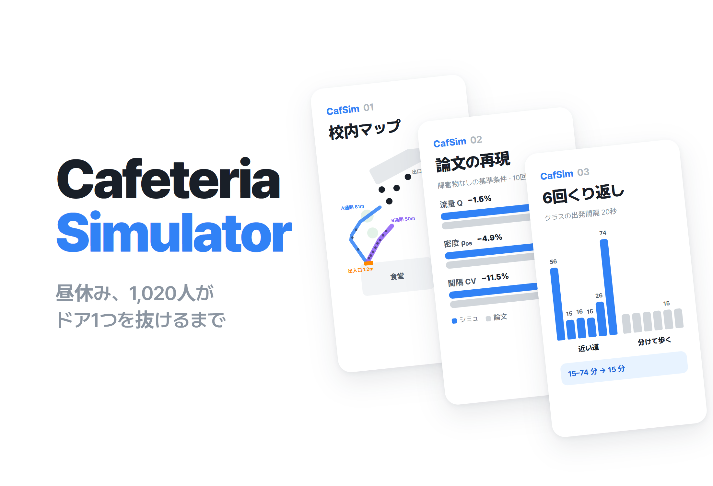
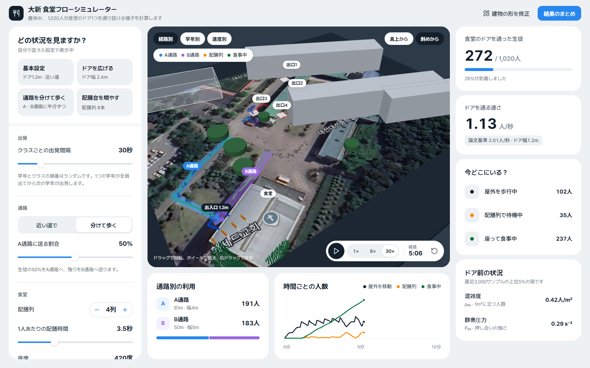
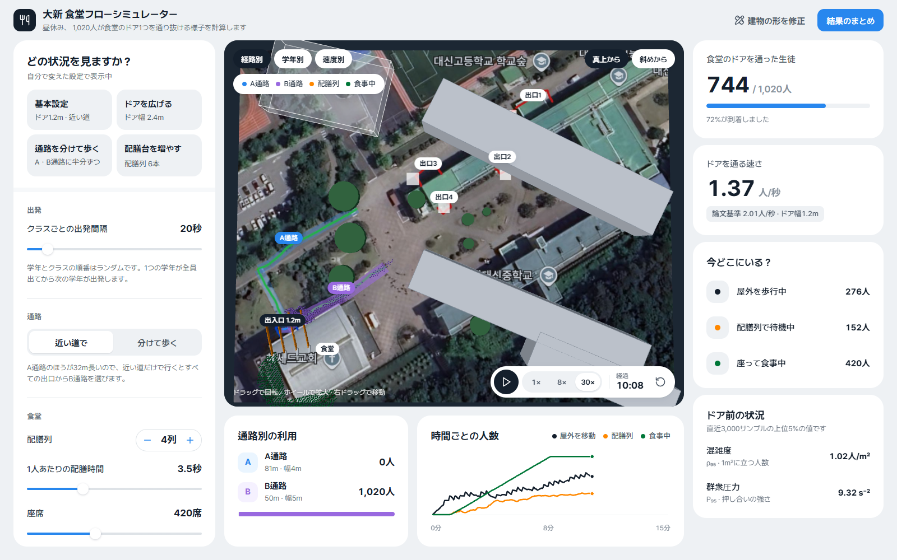
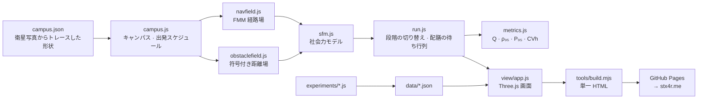

# CafeteriaSimulator

<p align="center"></p>

> サムスン HumanTech 論文で使った社会力モデルを JavaScript で実装し直して論文の基準値を再現し、大田大新高校のキャンパス全体に広げて、生徒1,020人が食堂のドア1つを通り抜ける昼休みの移動を計算する群衆シミュレーター

---

## 1. プロジェクト概要 (Overview)

| 項目 | 内容 |
|---|---|
| プロジェクト名 | CafeteriaSimulator（Web 版「大新 食堂フローシミュレーター」、コミット略称 CafSim） |
| 一言で | 論文が変えてみた「ドア前の障害物」ではなく、学校が工事なしで変えられる2つ、クラスごとの出発間隔と通路の振り分けを変えながら食堂ドア前のボトルネックを計算する |
| 期間 | 2026.09.10 ~ 2026.10.03（v1.0.0 → v1.1.4）· 09.10 シミュレーションのコアと実験 · 10.03 Web 公開と画面の刷新 |
| 参加人数 | 個人プロジェクト |
| 担当 | 社会力モデルと経路場の実装、論文基準値の再現と定数の較正、キャンパス形状のトレース、実験設計、3D Web アプリの開発と公開 |
| 貢献度 | 100%（リポジトリのコミット9件すべて本人） |

サムスン HumanTech 論文「群衆流体の観点から分析した学校給食室ボトルネック前方障害物の流れ安定化効果の分析」（原題：「군중 유체 관점에서 분석한 학교 급식실 병목부 전방 장애물의 흐름 안정화 효과 분석」）は、MATLAB で幅6.0mの通路が1.2mの出入口へ狭まる区間に60人を入れ、ドアの前に円柱の障害物を置いたとき流れがどう変わるかを調べた。障害物の大きさ・距離・位置を変えてみたが、処理量と安全を同時に改善する配置は見つからなかった。

このリポジトリはその論文の補足資料だ。まず同じモデルを JavaScript で一から実装し、論文 Table 1 の障害物なしの基準値を再現した。次に舞台を実際のキャンパスへ広げた。校舎の出口4か所から出た生徒が広場を渡り、2本の通路のどちらかを通って食堂のドア1つから入り、配膳列と座席まで続く。変える変数は障害物ではなく、学校がルールだけで決められるクラスごとの出発間隔と通路の振り分けだ。

## 2. 技術スタック (Tech Stack)

| 区分 | 技術 | 選んだ理由 |
|---|---|---|
| 群衆物理 | Vanilla JavaScript で実装した Helbing–Farkas–Vicsek 社会力モデル（空間ハッシュによる近傍探索、半陰的オイラー積分） | 論文と同じモデルでないと基準値を突き合わせられない |
| 経路探索 | 高速行進法（FMM）で解いたアイコナール方程式 | 8方向ダイクストラは方向誤差が約8%あり、ボトルネック付近の歩行方向がずれる。FMM は1%未満だ |
| 壁の処理 | ふさがった格子から作った符号付き距離場と法線（Felzenszwalb–Huttenlocher 距離変換） | キャンパス規模では歩行者ごとに壁の線分を回す計算がコストの大半を占めた。距離場にすれば配列を2回読むだけで済む |
| 食堂内部 | 待ち行列モデル（配膳列 + 座席での滞在） | 屋内で答えるべき問いは「ドアと配膳台のどちらがボトルネックか」だ。力のモデルはそこに接触ノイズを足すだけだ |
| レンダリング | Three.js r160 + 衛星写真の地面テクスチャ | キャンパスを3Dで見せつつ、物理計算とは切り離した |
| ビルド · 公開 | Node のビルドスクリプトで単一 HTML（約1.0MB）にバンドル → GitHub Actions → GitHub Pages、stx4r.me の Cloudflare Worker でプロキシ | Three.js・コア・形状データ・地面テクスチャをすべてインライン化し、数週間後もファイル1つで開ける |
| 実験 | Node スクリプト4種（`replicate` · `calibrate` · `sweep` · `bimodal`） | シード固定の乱数（mulberry32）で、すべての実行を再現できる |

## 3. 主な機能と担当業務 (Key Features & Contributions)

<p align="center"></p>
<p align="center">
  
  </p>
<p align="center"><sub>ローカルビルドでキャプチャ。上：通路を分けて歩く・出発間隔30秒、5分時点（A通路191人、B通路183人）。下左：出発間隔20秒・近い道、10分時点を真上から見た様子（1,020人全員がB通路に集まり、ドア前の群衆圧力 P₉₅ は9.32）。下右：基本設定の結果まとめ（23分7秒、6回くり返しの棒グラフ）</sub></p>

### 実装した機能

- **キャンパス3D画面**：衛星写真の上に校舎・花壇・2本の通路・出入口を置き、生徒1,020人を動かす。色は経路別・学年別・速度別に切り替え、真上からの視点と斜めからの視点を行き来できる。
- **シナリオのプリセット4種**：基本（ドア1.2m・近い道）· ドアを広げる（2.4m）· 通路を分けて歩く（A・B に半分ずつ）· 配膳台を増やす（6列）。
- **設定スライダー**：クラスごとの出発間隔、経路ポリシー（近い道 / 分けて歩く）と A 通路の割合、配膳列の数、1人あたりの配膳時間、座席数、食事時間、ドア幅。ドア幅を変えると経路マップを計算し直す。
- **リアルタイムのメーター**：ドアを通った人数、ドアの流量（論文基準 2.01人/秒と並べて表示）、場所ごとの人数（屋外・配膳列・食事中）、ドア前の混雑度 ρ₉₅ と群衆圧力 P₉₅、時間ごとの人数グラフ、通路別の利用人数。
- **結果のまとめ**：全員入るまでの時間、屋外の最大人数、救出した生徒の数に加えて、事前に計算した6回くり返しの結果を棒グラフで見せる。画像で保存でき、設定は URL に入るのでリンクで同じ条件を共有できる（`?hw=45&route=split&a=50…`）。
- **詰まり判定**：全クラスが出発した後、600秒のあいだにドアを通った人が10人未満なら「ドア前が詰まってしまいました」で終え、残った人数を知らせる。
- **形状の編集**：`campus.json` をアプリの中で直して適用する。衛星写真から直接読み取った値と、低解像度の写真から推定した値を分けて表示する。

### モデル構成と主な数式

```
m dv/dt = m (v₀e − v)/τ + Σ f_ij + Σ f_iW
f_ij = [ A·exp((r_ij − d_ij)/B) + k·g(r_ij − d_ij) ] n_ij + κ·g(r_ij − d_ij)·(Δv_ji · t_ij) t_ij
e = −∇T/|∇T|,   |∇T| = 1   (アイコナール, FMM)
ρ = N/A,   Q = (N − 1)/(t_N − t_1),   CV_h = s_h / h̄,   P = ρ·Var(v)
```

歩行者の値は論文どおりにした（r 0.23m、m 75kg、v₀ 1.34 ± 0.12m/s、τ 0.5s、dt 0.03s）。論文に書かれていない力の定数は較正で決めた（A 3000N、B 0.055m、通路長8.0m）。キャンパスでの実行では、歩行者は6つの段階を通る。

| 段階 | 内容 | モデル |
|---|---|---|
| 0 | 出口から割り当てられた通路の入口まで | 社会力 |
| 1 | 通路に沿って食堂のドアまで | 社会力 |
| 2 | いちばん短い配膳列で待つ | 待ち行列 |
| 3 | 配膳（3.5秒 × 0.75~1.25） | 待ち行列 |
| 4 | 食事（780秒 × 0.8~1.2） | 滞在 |
| 5 | 退場 | — |

### 主な業務

- 社会力モデル・空間ハッシュ・積分器を一から実装し、論文のシナリオ（6.0m → 1.2m、60人）を再構成
- 論文 Table 1 の基準値の再現と、論文にない定数の格子スキャン
- 衛星写真上でのキャンパス形状のトレース（Google Earth の60m縮尺バー = 372px → 0.1613m/px、駐車枠の間隔2.3m = 14.46px でクロスチェック）
- 出発間隔 × 通路振り分けの実験設計、結果が分かれる条件はシードごとに全件実行
- Three.js の3Dアプリ、単一 HTML ビルド、GitHub Pages への自動公開

## 4. 成果と結果 (Results & Metrics)

### 定量的成果

**論文基準値の再現**（障害物なし、シード10個、2026.10 再実行）

| 指標 | シミュレーション | 論文 Table 1 | 差 | 95% 信頼区間 |
|---|---|---|---|---|
| 流量 Q（人/s） | 1.979 ± 0.061 | 2.008 ± 0.040 | −1.5% | 重なる |
| 密度 ρ₉₅（人/m²） | 2.870 ± 0.074 | 3.017 ± 0.014 | −4.9% | 重ならない |
| 間隔のばらつき CV_h | 0.542 ± 0.035 | 0.612 ± 0.032 | −11.5% | 重ならない |
| 圧力 P₉₅（s⁻²、区域平均） | 0.934 | 1.431 ± 0.047 | −34.7% | 定義の違い |
| 圧力 P₉₅（s⁻²、局所場） | 1.803 ± 0.063 | 1.431 ± 0.047 | +26.0% | 定義の違い |

較正前の既定の定数（A 2000N、B 0.08m）では、Q が −15.5%、CV_h が +26.5% ずれていた。

**出発間隔 × 通路の振り分け**（シード3個の平均、`data/sweep.json`）

| 出発間隔 | 経路 | ドア流量 Q（人/s） | 間隔 CV_h | P₉₅（s⁻²） | 最後の配膳まで（s） | 屋外の最大人数 |
|---|---|---|---|---|---|---|
| 20秒 | 近い道 | 0.886 | 8.27 | 8.40 | 1,749 ± 1,577 | 300 |
| 20秒 | A 30% | 0.912 | 7.17 | 7.76 | 1,317 ± 632 | 295 |
| 20秒 | **A 50%** | **1.211** | **1.34** | 8.52 | **916 ± 9** | 291 |
| 30秒 | 近い道 | 1.116 | 3.09 | 0.11 | 982 ± 30 | 136 |
| 30秒 | A 30% | 1.095 | 2.10 | 0.22 | 997 ± 17 | 137 |
| 30秒 | A 50% | 1.104 | 1.94 | 0.24 | 997 ± 29 | 139 |
| 45秒 | 近い道 | 0.752 | 3.71 | 0.08 | 1,427 ± 31 | 102 |
| 45秒 | A 30% | 0.746 | 2.82 | 0.17 | 1,431 ± 25 | 102 |
| 45秒 | A 50% | 0.747 | 2.64 | 0.19 | 1,434 ± 24 | 103 |

近い道を選ぶと A 通路のほうが32m長いので、4つの出口すべてが B 通路を使う（A の割合0%）。

**出発間隔20秒、シード6個すべて**（`data/bimodal.json`）

| 経路 | 最後の配膳まで（s）、シード1~6 | 範囲 |
|---|---|---|
| 近い道 | 3,358 · 921 · 968 · 906 · 1,577 · 4,415 | 906 ~ 4,415 |
| A 50% | 906 · 920 · 921 · 920 · 921 · 922 | 906 ~ 922 |

| 項目 | 結果 |
|---|---|
| 規模 | コア・実験 JS 1,765行、アプリ JS 1,037行 + HTML・CSS 574行 |
| ビルド結果 | `dist/simulator.html` 1.0MB |
| 実際の食堂の実測値との突き合わせ | （確認が必要） |
| 論文の審査結果 | （確認が必要） |

### 定性的成果

- **論文が決めていない設定をデータで絞り込んだ。** 力の定数と通路の長さは密集度を左右するのに、論文には書かれていない。仮定する代わりに格子スキャンで Table 1 にいちばん近い組み合わせを探し、その結果がそのまま「論文が実際に使った設定」の推定になった。
- **圧力指標の定義の違いを明らかにした。** 論文は ρ を区域平均で定義しながら、P は Helbing（2007）を引用している。両方のやり方で計算すると区域平均が0.934、局所場が1.803になり、論文値1.431はその間にある。P₉₅ を比べるなら、まず定義をそろえる必要がある。
- **通路を分ける効果は平均ではなく裾に出る。** 出発間隔30・45秒では、最後の配膳時刻がほぼ同じだ（982対997秒、1,427対1,434秒）。差が出るのは間隔がぎりぎりの20秒のときだけだ。近い道では6回中3回が25分を超え、半分ずつに分けると6回とも15分6秒~15分22秒で終わった。ただしドア前の群衆圧力 P₉₅ は8.40と8.52でほとんど変わらない。分けてもドア前がすいてくるわけではない。詰まりが固まってしまうケースをなくすだけだ。
- **変えられる変数を選んだ。** 論文の障害物には施設工事が要る。出発間隔と通路の振り分けは、案内のルールだけで変えられる。

### 確認された限界

- **再現指標のうち信頼区間に入るのは Q だけだ。** ρ₉₅ は −4.9%、CV_h は −11.5% で区間から外れる。リポジトリの README には誤差が 2.4 / 6.8 / 6.5% 以内と書いてあるが、今のコードで回し直すと CV_h の誤差は11.5%だ。`calibrate.js` を今実行すると最適値は通路長6.5m・B 0.05m となり、`calibration.json` の8.0m・0.055m とも違う。B 0.055 はスキャン格子（0.05 / 0.08 / 0.12 / 0.16）にない値なので、較正値の出どころを確かめ直す必要がある。
- **校舎の輪郭がいちばん弱い入力だ。** 出口・2本の通路・出入口の位置は注釈付きの衛星写真から直接読み取ったので信頼できる。校舎の輪郭・運動場の境界・通路の幅は低解像度の写真から推定した。ドア幅1.2mは実測しておらず、論文の W をそのまま使った。
- **食堂内部の値は文献の既定値だ。** 配膳列4本、1人3.5秒、座席420席、食事13分は、どれも実測値に置き換える必要がある。
- **社会力モデルは一度固まった詰まりを自力でほどけない。** ドア前でアーチができるとほどけない。そのため長く1人で挟まっている人はドアの中へ移し、その人数を結果に報告する。出発間隔20秒の条件では、実行ごとに1~4人だった。
- **教員100人はまだ動かない。** `campus.json` に教員の人数があり歩行者の容量も確保してあるが、実行の総数は生徒1,020人だ。
- **sweep のデータが一部しかない。** `sweep.js` は出発間隔60・90秒も定義しているが、`data/sweep.json` には20・30・45秒しか入っていない。条件ごとのシードも3個だけだ。

## 5. トラブルシューティング (Troubleshooting)

### ① 論文にない定数のせいで基準値が合わなかった

**問題** 論文のシナリオをそのまま移しても、Helbing の既定定数（A 2000N、B 0.08m）で回すと流量 Q は1.697人/s で論文より15.5%低く、間隔のばらつき CV_h は26.5%高い。

**原因** 論文は半径・質量・希望速度・緩和時間・時間刻み・ドア幅・通路幅は書いていたが、力の定数 A・B と通路の長さは書いていなかった。この3つがドア前の密集度を決め、密集度が4つの指標すべてを動かす。

**解決** 値を1つ選んで仮定せず、スキャンした。通路長4種 × A 3種 × B 4種の48通りをシード5個で回し、論文の信頼区間に入った指標の数と正規化誤差で順位をつけた。圧力 P は定義があいまいなので、区域平均と局所場の2通りで記録した。

**結果** A 3000N、B 0.055m、通路長8.0mで Q の誤差は −1.5% まで縮んだ。それでも ρ₉₅ と CV_h は信頼区間の外に残った（確認された限界を参照）。

### ② 1クラス34人をいっせいに出したら出口が丸ごと閉じ込められた

**問題** クラスが出発するとき34人を出口前の生成ボックスに同時に置くと、その出口に割り当てられた全員が動けなくなった。

**原因** ボックス内の密度が約7人/m²になり、接触力が重なりをほどけなかった。実際には34人が教室のドア1つから列になって出てくるので、同時生成は物理的にありえない初期状態だ。

**解決** 出発したクラスを待ち行列に入れ、出口ごとに毎秒2人ずつ外へ出した。出すときはほかの人から0.6m以上離れた場所を最大12回探し、なければ次のステップに回す。

**結果** 出発間隔30・45秒の条件で18回実行し、取り残された人は0人、完了率は1.000だった。

### ③ 止まっている人が並んでいるのか挟まっているのか見分ける必要があった

**問題** 数人がドア前の合流部の壁に挟まり、最後まで到着しなかった。これでは完了率の指標が意味をなくす。

**原因** 通路の経路場の勾配が校舎の内側を向いている隅があり、そこに入った人は壁を押したまま止まる。ところがドア前で並んでいる人も同じように止まっている。速度だけでは2つを区別できない。

**解決** 近くの人数で分けた。2.5m以内にほかの歩行者が3人以上いれば並んでいると見なして手を出さない。1人で120秒以上止まっている人だけをドアの中へ移し、その人数を「救出した生徒」として結果にそのまま報告する。この数が小さくなければ、群衆ではなく形状データが間違っているサインと読む。モデルの中でも、15秒以上止まった人にはランダムな向きの小さな力を加えて少しずつ動かした。

**結果** 出発間隔30・45秒では救出した生徒が0人、20秒では実行ごとに1~4人だった。

### ④ ±1,577秒という信頼区間はノイズではなかった

**問題** 出発間隔20秒・近い道の条件で、最後の配膳時刻が1,749 ± 1,577秒になった。平均が意味をなさないほど散らばっていた。

**原因** 結果が2つに分かれる。15分前後で終わるか、ドア前の合流部で詰まりが生じて回復できず、数千秒も長引くかだ。シード3個の平均は2つのモードを混ぜてしまう。

**解決** 平均を取らず、シード6個をすべて回して1つずつ報告する実験（`bimodal.js`）を別に作った。アプリの結果画面にも、この6本の棒をそのまま入れた。

**結果** 近い道は906秒から4,415秒まで、半分ずつは906秒から922秒までだった。「分けて歩けば平均が下がる」ではなく、「分けて歩けば詰まりの裾が消える」へと結論が変わった。

### ⑤ 詰まった実行では結果画面がいつまでも出なかった

**問題** Web アプリは全員がドアを通ってはじめて結果画面を開いていた。詰まりが起きた条件ではその瞬間が来ず、画面は「移動中」のままだった。

**原因** 完了判定が「全員通過」しかなかった。④で見たとおりこのモデルは固まった詰まりを自力でほどけないので、終わらない実行が生まれる。

**解決** v1.1.3 で結果の状態を「進行中 · 完了 · 詰まり」の3つに分けた。全クラスが出発したのに直近600秒でドアを通った人が10人未満なら、詰まりと判定する。詰まりならアイコンをオレンジの警告に変え、ドア前に残った人数とともに「この条件ではモデルが詰まりを自力で解消できません」と知らせる。

**結果** どんな設定でも結果画面が開く。詰まっても「ドア前が詰まってしまいました」というタイトルと、ドア前に残った生徒の数で終わる。

## 6. リンクと成果物 (Links & Deliverables)

| 区分 | リンク |
|---|---|
| GitHub リポジトリ | [stx4R/CafeteriaSimulator](https://github.com/stx4R/CafeteriaSimulator)（非公開） |
| 公開 URL | https://stx4r.me/project/CafeteriaSimulator/ |
| 実験の再現 | `node experiments/replicate.js` · `calibrate.js` · `sweep.js` · `bimodal.js` |
| ビルド | `node tools/build.mjs` → `dist/simulator.html` |
| 元の論文 | 「群衆流体の観点から分析した学校給食室ボトルネック前方障害物の流れ安定化効果の分析」（サムスン HumanTech 論文） |

### 構成



---

+++

## カスタマージャーニーマップ (Journey Map)

ユーザーは昼食時の動線を決める先生や生徒会だ。

| 段階 | ユーザーの行動 | ユーザーの考え | ツールの応答 |
|---|---|---|---|
| 探索 | 基本設定をそのまま再生する | 「昼休み、外はどれくらい混むんだろう？」 | 23分7秒のあいだ屋外に最大102人、ドアの流量が論文基準 2.01人/秒 の横に表示される |
| 発見 | 通路別の利用カードを見る | 「どうして A 通路は誰も使わないの？」 | A 通路のほうが32m長く、すべての出口が B を選ぶという案内が出る |
| 比較 | 出発間隔を20秒に縮めてもう一度回す | 「早く出せば早く終わるよね？」 | ドア前に人がたまり、群衆圧力が9を超える |
| 確認 | 結果まとめの6回くり返しの棒を見る | 「1回詰まったのは偶然じゃない？」 | 近い道は15~74分、分けて歩くと6回とも15分前後 |
| 共有 | 「リンクをコピー」を押す | 「会議でこの条件をそのまま見せよう」 | 設定入りの URL がコピーされる |

## ジェスチャー設計 (Gesturing)

- 3D画面をドラッグして回し、ホイールで拡大・縮小し、右ドラッグで移動する。
- 真上からと斜めからの視点をチップ1つで切り替え、視点はなめらかに移る。

## アダプティブデザイン (Adaptive Design)

- 広い画面では設定 · 地図 · メーターを3列に並べる。
- 幅1,279px以下では設定と地図を2列にし、メーターをその下に1行のグリッドで下ろす。
- 899px以下では地図（画面の高さの62%）→ メーター → 設定の順に1列に積む。地図の上の凡例・チップ・再生バーも重ならないよう置き直す。
- 「動きを減らす」設定をオンにしたユーザーには、トランジションを切る。
