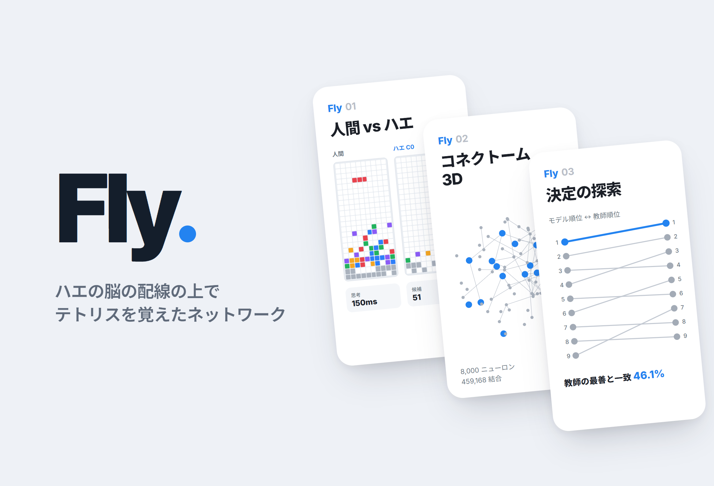
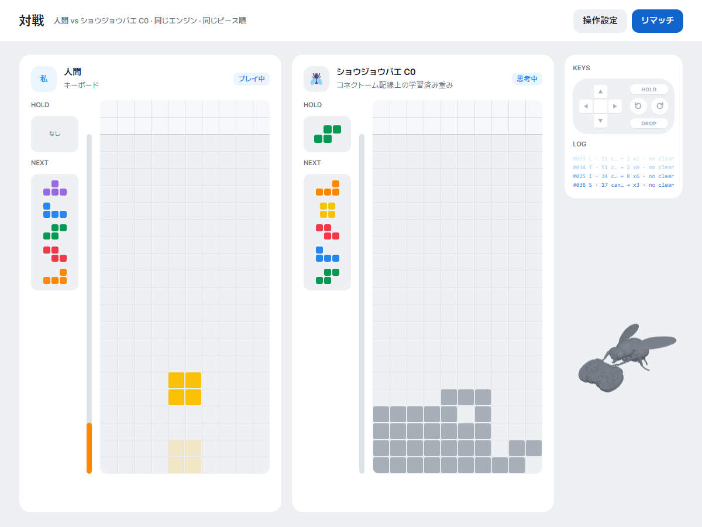
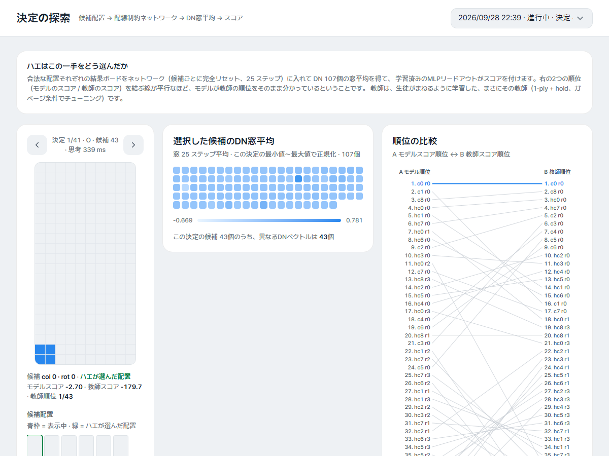
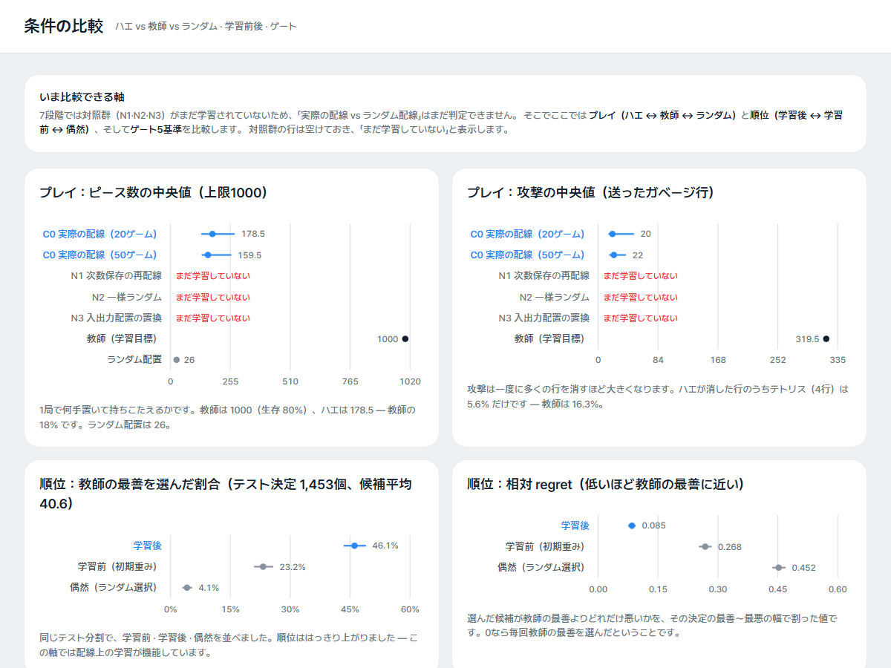
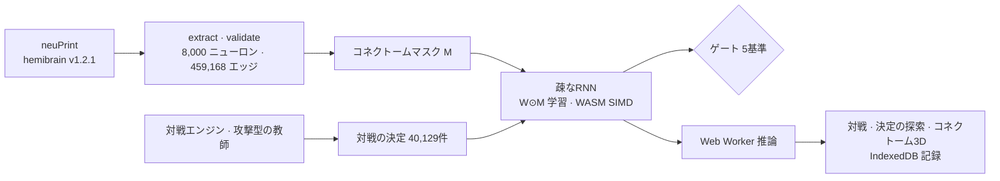

# Fly

> ショウジョウバエの脳のコネクトーム（hemibrain）の配線を制約としたネットワークにテトリスの対戦を教え、その結果をWebで公開して人間が直接対戦できるようにした研究型プロジェクト

---

## 1. プロジェクト概要 (Overview)

| 項目 | 内容 |
|---|---|
| プロジェクト名 | Fly（VFB-Tetris） |
| 一行要約 | ショウジョウバエのニューロン8,000個・接続459,168本の配線をスパース性マスクとして使い、その上の重みを学習させてテトリス対戦の方策を得た。ゲートには届かず、届かなかった結果をそのまま見せる対戦Webを公開した |
| 期間 | 2026.09.15 〜 2026.09.24（v0.1.0 → v0.13.6、コミット26件） |
| 参加人数 | 個人プロジェクト |
| 本人の役割 | 研究設計、データ抽出、シミュレーション・学習コード、実験と判定、Webの実装・デプロイ |
| 貢献度 | 100% |

出発点の問いは「本物のショウジョウバエの脳の配線は、テトリスを打つのに役立つのか」だった。最初は、コネクトームのシナプス数をそのまま固定重みとして使うリザバー（スパイキングニューラルネットワーク）を作った。第5段階まで結果は陰性だった。そこで第6段階で主張を変えた。コネクトームからは「どのニューロンがどのニューロンにつながっているか」だけを借り、重みは学習する。レポートにもWebにも、「ショウジョウバエがテトリスを覚えた」という表現は一切使わない。

| 段階 | 内容 | 結果 |
|---|---|---|
| 1 | neuPrintからhemibrain v1.2.1を抽出（入力 LC/LPLC · 中間層 · 出力 DN） | 8,000ニューロン · 459,168エッジ |
| 2–3 | スパイキングリザバー（LIF）+ キャリブレーション | 仕様範囲内での合格 0/1200、プローブのゲート未達 |
| 4–5 | afterstate評価、null model 6種との比較 | 候補は区別できるが、順位の情報がない（τ ≤ 0.075） |
| 6 | 対戦エンジン · 攻撃型の教師 · ランキング損失の検証 | 原因は損失ではなく固定重みの表現力 |
| 7 | コネクトームマスク上での重み学習（A → A-2 → A-3 → A-4′） | 順位の指標は合格、プレイのゲートは未達 |
| 8 | 人間 vs ショウジョウバエのリアルタイム対戦Web | デプロイ |

## 2. 技術スタック (Tech Stack)

| 区分 | 技術 | 選定理由 |
|---|---|---|
| データ | neuPrint Cypher API（hemibrain v1.2.1） | ショウジョウバエ半脳のコネクトームを、ニューロンのtype・ROI・シナプス数まで取得できる。レスポンスはローカルにキャッシュする |
| シミュレーション・学習 | Node.js（ESモジュール）、`node:test`、worker_threads | 学習ライブラリを使わず、疎なRNN・BPTT・Adam・DAggerを自作した。同じコードをブラウザでの推論にも使う |
| カーネル | WebAssembly SIMD（f64x2） | 12個のワーカーが同時に重みを読むときに起きるメモリ帯域のボトルネックを軽くした。外部ツールを使わず、バイナリを手で組み立てた |
| Web | Vanilla JSのハッシュルーター、three.js、esbuild、Web Worker、IndexedDB | 10画面を1つのアプリにまとめた。ショウジョウバエの推論はワーカーで動き、対戦記録はブラウザの外に出ない |
| デザイン | Tossデザインシステムのトークン、Pretendardのセルフホスト | 外部リクエストなしで、バンドル（7.3 MB）だけで動く |
| デプロイ | GitHub Pages（`gh-pages`ブランチ） | 静的サイトで十分である |

## 3. 主な機能と担当業務 (Key Features & Contributions)

公開サイトでキャプチャ。左が人間、右が学習済みのC0モデル。同じエンジン、同じピース順で打つ。右のKEYS・LOGは、ショウジョウバエが選んだ配置をボタン入力に逆算して表示している

### コネクトームの抽出（第1段階）

- 入力層は視覚投射ニューロン（LC・LPLC）、出力層は下行ニューロン（DN）である。名前は似ていても役割の違うニューロン（LCNOは中心複合体のニューロン、DN1〜3は概日時計ニューロン）は除外した。
- 中間層は、入力から2-hop、出力まで2-hop以内にあるニューロンとした。シナプスが3個以上のエッジだけを残し、8,000個を超えた分はシナプス総量の順に切り捨てた。
- ニューロンごとにprimary ROI（脳領域）を付けた。8,000個のうちnullは3個、領域は44個である。

### 固定重みのリザバー（第2–5段階）

- イベント駆動のLIFニューロン（dt 1 ms）、スパイク頻度適応（SFA）、ROI単位の局所抑制、決定的な乱数（xorshift128+）。
- 盤面は入力ニューロンごとのガウス型受容野を通して電流に変換され、DN 107個の発火数で行動を選ぶ。
- null model 6種（次数保存の再配線、重みの置換、層ブロックのランダムグラフ、Kenyon cellの除去、直接エッジの除去、活動量の統制）と比較した。

### 対戦エンジンと教師（第6段階）

- ガイドラインのルールを配置単位で実装した。hold、next 5、ガベージのキューと相殺、コンボ、T-スピン（3-corner判定 + BFSで求めた到達可能な位置）、パーフェクトクリアを含む。
- 攻撃型の教師は11個の特徴量とビームサーチを使い、CEMで調整した。1000ピースでの攻撃の中央値は377、生存率100%。
- 教師のプレイから対戦時の決定を40,129件（候補1.70 M）集めた。ゲーム単位で60/20/20に分割し、リーク検査も行った。

### 配線制約つきの学習（第7段階）

- モデル：レートRNN `x(t+1) = (1−lr)x + lr·tanh((W⊙M)x + W_in·u + b)`。Mはコネクトームの隣接マスクで固定し、Wはマスクがある位置でだけ学習される。パラメータ数は1,067,041個である。
- 学習：決定ごとに教師が選んだ手と負の候補7個を比べるpairwise損失、BPTT（T 25）、AdamW、ドロップアウト、DAgger。評価は常に候補全体で行う。
- 対照群：同じパラメータ数の密なMLP（D0）、配線のnull 3種（次数保存の再配線 · 一様ランダム · 入出力配置の置換）。3つのnullは、ニューロン・エッジ・パラメータの数がC0と完全に一致する。

### 対戦Web（第8段階）

決定の探索。1手分の候補51個をネットワークに入力して得たDN 107個のウィンドウ平均（中央）と、モデルの順位と教師の順位を結ぶbump chart（右）

- **対戦**：人間はキーボードで、ショウジョウバエは150 ms間隔で打つ。推論はピースごとに1回、ワーカーで非同期に回す。
- **対戦から生まれる画面**：対戦記録、コネクトーム3D（層化抽出した907ニューロン · 5,963シナプスを活性の強さで点灯）、決定の探索、神経活動のラスター、プレイ分析。1戦もしていなければ空の状態を描き、値をでっち上げたりはしない。
- **オフラインの実測画面**：ホーム（ゲート5基準）、実験、条件比較。まだ学習していないnull 3種の欄は「まだ学習していない」として空けておく。
- モバイルではサイドバーが上部バーに折りたたまれる。reduced-motionを尊重し、WebGLがなくても3D以外の画面は動く。

### 主な業務

- neuPrintの抽出・検証パイプライン、ニューロンの層の判定とROIの付与
- LIFリザバー・ESN・疎なRNNとBPTT・Adam・DAggerの自作実装、WASM SIMDカーネル
- 実験設計とゲート判定、ブートストラップ95% CI、段階ごとの文書6本（`docs/`）
- 実験の予算見積もりツール（実測した単位コスト × 計画した軸。8時間を超える場合は削るべき軸を提案）
- 対戦Web 10画面、ショウジョウバエ3Dモデルの軽量化（Blenderスクリプト）、GitHub Pagesへのデプロイ

## 4. 成果と結果 (Results & Metrics)

### 定量的成果

条件比較。プレイの指標はショウジョウバエ・教師・ランダムを、順位の指標は学習前・学習後・偶然を並べた

**最終モデルC0（第7段階 A-4′、テスト1,453決定 · 候補は平均40.6個、プレイは20ゲーム × 1000ピース · ガベージ注入あり）**

| 指標 | 学習前 | 学習後 [95% CI] | 教師 | ゲート |
|---|---|---|---|---|
| 教師の最善手との一致（top-1） | 23.2% | **46.1%** [43.6, 48.8] | — | — |
| 相対regret（低いほど良い） | 0.268 | **0.085** [0.077, 0.092] | 0 | ≤ 0.10 合格 |
| ピース数の中央値 | — | 178.5 [134.5, 270.5] | 1000 | ≥ 700 **未達** |
| 攻撃の中央値 | — | 20 [15.5, 49] | 319.5 | ≥ 191.7 **未達** |
| テトリス数/ゲームの中央値 | — | 1 [0, 2] | 41.5 | ≥ 1 合格 |

5つのゲートのうち3つを通過した（表にない1つは、ガベージで負けたゲームの割合 ≤ 50%で、実測は50%）。順位を付ける能力は学習前の2倍になったが、1ゲームを耐え抜く力は教師の18%にとどまった。Phase B（配線のnullとの比較）はゲート通過が条件だったので実行しておらず、その後、対戦Webを先に作る方向に切り替えたため、N1の学習途中（ラウンド0、エポック10/15）で打ち切った。

| 項目 | 結果 |
|---|---|
| 単体テスト | `npm test` 151/151 合格（2026.09に再実行） |
| 第6段階の原因の切り分け | 同じリザバー特徴量で損失をmse → listwiseに変えても、τの変化は−0.011。同じ損失を元の盤面に適用するとτ 0.31 |
| 密なMLPとの対照（D0、Phase Aのパイロット） | 同じパラメータ数・同じプロトコルでtop-1 35.6%、ピース数80と、同じ形で失敗した。配線マスクがなくても失敗したので、当時の未達は学習設定のせいだった |
| 学習後の重み | コネクトームの初期値との相関0.537、エッジの46.9%が抑制性に変化（初期は0%）。入力→中間層が初期値から最も遠ざかり（相関0.14）、中間層どうしは0.36 |
| WASM SIMDカーネル | 決定あたりのBPTTが325–423 ms → 199–223 ms（×1.6–1.9）、JSカーネルとの結果の差 ≤ 1e-18 |
| Node ↔ ブラウザの推論の一致 | 最大差1.42e-14 |
| デプロイ | https://stx4r.me/project/Fly-Tetris/（レスポンス200を確認） |
| ユーザー数・訪問数 | （要確認） |

### 定性的成果

- **陰性の結果を根拠に主張を変えた。** 固定重みのリザバーがうまくいかない理由を、損失のせいか表現力のせいかに分けて確かめたうえで、「配線だけを制約し、重みは学習する」方式に移った。前の段階の文書は消さず、根拠となる章として残した。
- **すべての判定に事前のゲートとCIを設けた。** 結果を見てから基準をいじらないように、段階ごとに先に基準を決め、未達なら止めて、原因と次に攻める軸を文書に残した。
- **Webは失敗を隠さない。** ホームの最初の画面にゲート3/5を表示し、学習していない対照群は空欄のままにしてある。

### 確認された限界

- **プレイのゲートは未達。** 20ゲームすべてが1000ピースに届く前に負け、負けた時点での穴の数の中央値は19だった。教師を1手ずつ真似る学習なので、ウェルの維持のような長い流れに弱い。ウェルを維持できた連続区間の中央値は、教師が6手、モデルが2手である。
- **配線が役に立ったのかどうかには、まだ答えられていない。** Phase Bのnull 3種の学習が終わらないと、「本物の配線 vs ランダムな配線」について何も言えない。
- **入力の受容野の割り当ては恣意的である。** 実際のLCニューロンの視野マップ（レチノトピー）とは関係なく、格子に均等にばらまいた。
- **対戦の物理は配置単位の近似である。** 重力・ロックディレイ・180°回転・B2Bはない。
- 第9段階（最終レポート）はまだ書いていない。

## 5. トラブルシューティング (Troubleshooting)

### ① 仕様どおりに設定したネットワークが、すべて沈黙した

**問題** 第3段階のキャリブレーションで、仕様範囲（ρ 0.8–1.3）の探索点1,200個が1つも制約を通過しなかった。中間層のニューロンがほとんど発火しなかった（発火率の中央値0 Hz）。

**原因** ρは線形化したスペクトル半径で決めていたが、閾値とリークのあるLIFニューロンでは、入力1単位あたりのスパイク利得が1よりずっと小さい。線形の判定は、実際の崖（g ≈ 0.07）を4倍も低く（g = 0.0169）見積もっていた。さらにSFAがないと、少数のニューロンが発火を独占していた（平均30–50 Hzなのに中央値は0 Hz）。

**解決** 探索範囲をρ ≤ 5まで広げた結果は、仕様範囲の結果と混ぜずに`extended`として別に記録した。b = 0、k_local = 0に固定した部分探索もあわせて回し、何が勝者総取りを崩しているのかを切り分けた。

**結果** 通過した点はすべてSFAが有効なケースだった。勝者総取りを崩したのはSFAである。局所抑制はk_local > 0.5でネットワークをまるごと止めてしまうことも確認した。元の入力をそのまま入れた線形プローブでも+4.3%pにとどまることを示し、このゲート（+10%p）がこの課題ではそもそも超えられない基準だったことも記録した。

### ② 固定重みのリザバーが手の順位を付けられなかった

**問題** 第4–5段階では、候補の手ごとにDNの発火は異なっていた（互いに異なるベクトルが70–90%）が、1つの決定の中での教師の順位との相関はτ ≤ 0.075だった。プレイはどの条件でもランダム並みだった。

**原因** 損失関数が順位を教えられていないのか、固定重みの表現にそもそも順位の情報がないのかを、まず見極める必要があった。

**解決** 第6段階で、同じリザバー特徴量に対して損失だけを差し替え（mse · centered · listwise · pairwise）、同じ損失を元の盤面200マスにも適用して比べた。

**結果** リザバーの上ではどの損失でもτ 0.00–0.03だったが、元の盤面ではτ 0.31が出た。損失の寄与はゼロで、問題は固定重みの表現力だった。これを根拠に、第7段階で重みを学習する構造に切り替えた。固定リザバーで16–20%だったtop-1は、最初の学習（Phase A）で37.8%、最終モデルで46.1%になった（最終モデルは、教師とテスト分割を変えたA-4′での値）。

### ③ 数時間かかる学習が途中で2回消えた

**問題** 第7段階の本学習には5–6時間かかるが、ラウンド0が2回失われた。実行を起動したターミナルのセッションが終了した際に、そのプロセスツリーまで片付けられてしまったためである。

**原因** 学習の状態がプロセスのメモリ上にしかなく、実行自体もセッションに紐づいていた。

**解決** エポックごとにパラメータ・ベストのパラメータ・Adamの状態（m, v, t）・履歴をチェックポイントとして書き出し、同じ設定なら次のエポックから再開するようにした。再開すると結果が変わってしまうバグもここで見つけた。エポックのシャッフルが前のエポックの順列を引き継いでいたので、エポックのシードだけに依存するよう直した。実行はWindowsのタスクスケジューラでセッションから切り離し、異常終了コードで落ちた場合はランナーが最大5回まで再起動する。

**結果** 再実行テストを書いた。子プロセスをエポックの途中で強制終了し、再起動させる方式である。最終パラメータとAdamの状態、エポックごとの検証損失が、中断なしで回した実行と1e-9以内で一致する。その後のA-2（5.01 h）、A-3（6.36 h）、A-4′（5.85 h）はすべて最後まで走り切った。

### ④ ブラウザでモデルが遅く、WASMが無効になっていた

**問題** 学習で12個のワーカーを回すと、実測のエポック時間が計算値の2.9倍になった。ブラウザでの推論では、WASMバックエンドが無効のままJSだけで動いていた。

**原因** 12個のワーカーが毎ステップ重み（3.7 MB）とインデックス（1.8 MB）を同時に読むため、メモリ帯域がボトルネックになっていた。ブラウザ側は、WASMカーネルのコードにNode専用の`Buffer`が残っていたせいでWASMが無効になっていた。

**解決** 疎行列積と逆伝播の要素ごとの処理をWebAssembly SIMDに移し、配列をWASMメモリ内に置いた。`Buffer`は`TextEncoder`に置き換え、SharedArrayBufferのないブラウザ向けに`ArrayBuffer`へのフォールバックを入れた。対戦では、ショウジョウバエの着手の推論をピースごとに1回だけ、ワーカーで非同期に回す。

**結果** 決定あたりのBPTTが1.6–1.9倍速くなった。Nodeとブラウザの推論結果は最大1.42e-14の差で一致する。

## 6. リンクと成果物 (Links & Deliverables)

| 区分 | リンク |
|---|---|
| GitHub リポジトリ | [stx4R/Fly-Tetris](https://github.com/stx4R/Fly-Tetris) |
| 公開URL | https://stx4r.me/project/Fly-Tetris/ |
| 段階ごとの文書 | `docs/stage3-calibration.md` 〜 `docs/stage8-web-v1.md`（6本） |
| データの出典 | [neuPrint](https://neuprint.janelia.org) hemibrain v1.2.1 |

### 構成

---

+++

## カスタマージャーニーマップ (Journey Map)

ユーザーは、コネクトームやニューラルネットワークにはあまり詳しくないが、ショウジョウバエとテトリスを1戦してみたい訪問者である。

| 段階 | ユーザーの行動 | ユーザーの考え | サイトの対応 |
|---|---|---|---|
| 到着 | ホームを開く | 「ショウジョウバエがテトリスをするって？」 | 冒頭の段落で、借りたのは配線だけで重みは学習したものだと明かす。ゲート3/5も一緒に表示する |
| 対戦 | 方向キーとスペースで打つ | 「思ったより上手い／すぐ負けるな」 | ショウジョウバエは150 ms間隔で打ち、KEYS・LOGがその手をボタン入力に分解して見せる |
| 疑問 | 決定の探索を開く | 「なんであの手を打ったんだろう？」 | 候補全体に対するDNの反応と、モデルの順位と教師の順位を結ぶ線を表示する |
| 深掘り | コネクトーム3D・神経活動を開く | 「脳の中で何が光ったんだろう？」 | 直前の手の活性でニューロンを点灯させ、25ステップを再生する |
| 判断 | 条件比較を開く | 「で、配線は役に立ったの？」 | まだ答えられないという事実を、空欄（「まだ学習していない」）で示す |

## アダプティブデザイン (Adaptive Design)

- 1戦もしていないユーザーには、対戦系の画面が空の状態と「対戦する」ボタンを表示する。1戦すれば、同じ画面がその対戦の値で埋まる。
- 狭い画面ではサイドバーが上部バーに折りたたまれ、2つの盤面が縦に並ぶ。WebGLがなければ3Dだけが省かれる。
- 操作キーと表示オプションは設定画面で変更でき、ブラウザに保存される。

## モーションデザイン (Motion Design)

- 対戦画面の横にいるショウジョウバエの3Dモデルが、着手に合わせてパッドを叩く。元のモデルはBlenderスクリプトでポリゴンを減らし、2秒ループのアニメーションにした。
- コネクトーム3Dはドラッグで回転、ホイールで拡大でき、1つの決定の活性をステップ単位で再生する。
- reduced-motionの設定を尊重する。

## DREAD 脆弱性管理 (DREAD Risk Assessment)

| 脅威 | D | R | E | A | D | スコア | 対応 |
|---|---|---|---|---|---|---|---|
| neuPrint APIトークンの漏えい | 2 | 1 | 1 | 1 | 2 | 1.4 | トークンは環境変数か`.env`からのみ受け取り、`.gitignore`でコミットを防ぐ。デプロイするバンドルには抽出結果しか含めない |
| 対戦記録の外部送信 | 1 | 1 | 1 | 1 | 1 | 1.0 | 記録はIndexedDB（直近20戦）にだけ保存し、サーバーには送らない。サイトからの外部リクエストは0件である |

D・R・E・A・D = 被害・再現性・悪用の難易度・影響範囲・発見可能性（1〜3）。スコアは平均。
