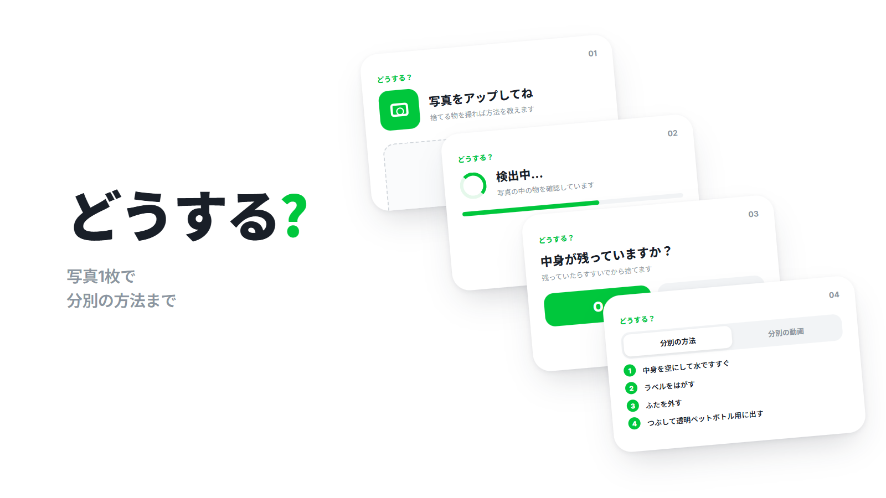
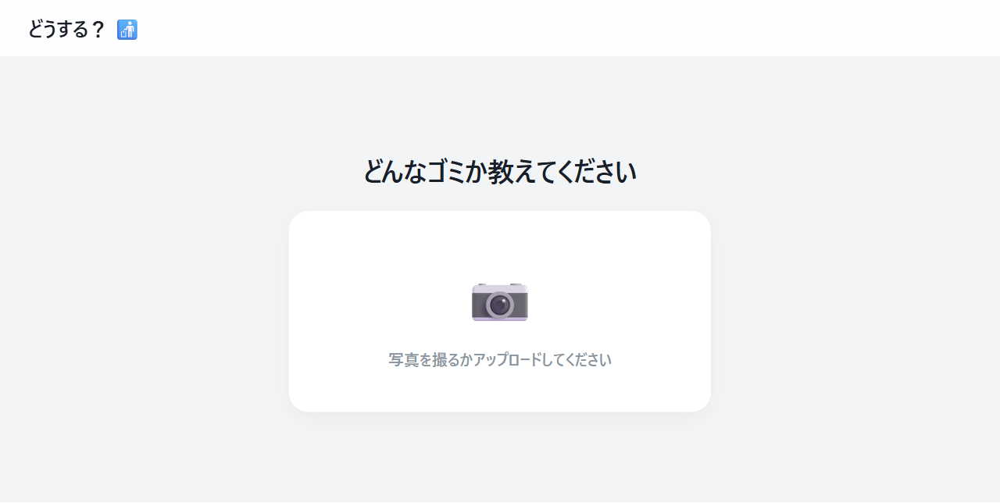
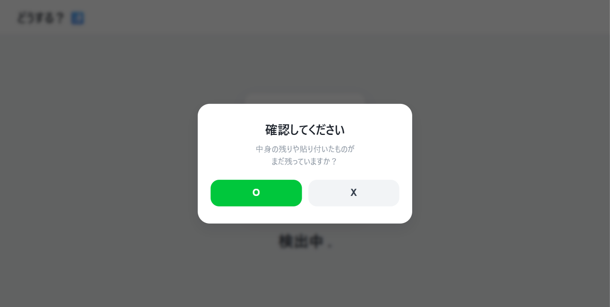
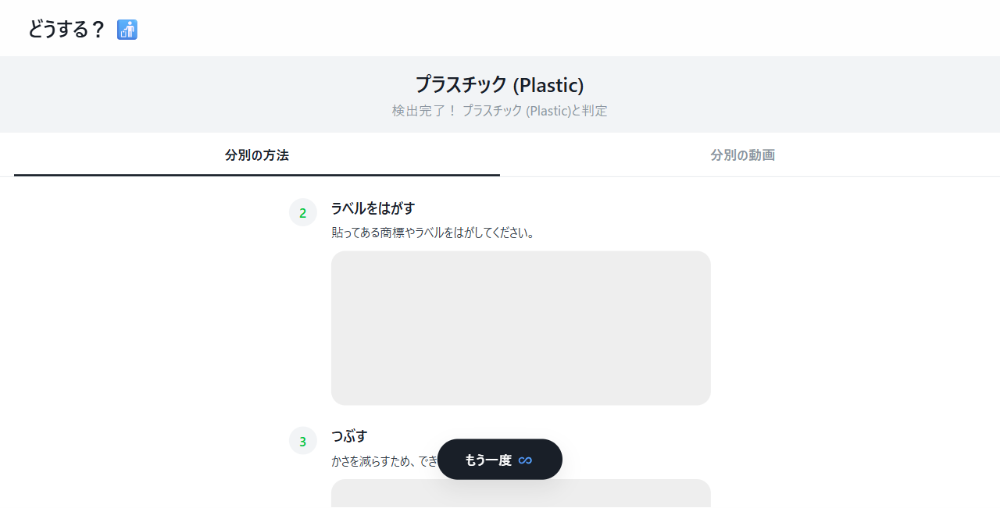
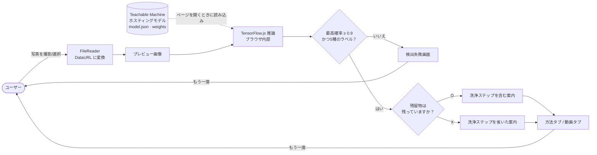

# HowTo

> ゴミの写真を1枚アップロードすると素材を判別し、分別の手順と動画を見せてくれる Web アプリ「어떻게?」（「どうする？」の意）

---

## 1. プロジェクト概要 (Overview)

| 項目 | 内容 |
|---|---|
| プロジェクト名 | HowTo（サービス名「어떻게?」） |
| 一行要約 | ブラウザ内で動く画像分類モデルでゴミの素材を判別する。残留物の有無まで尋ね、その人に必要な排出ステップだけを案内する |
| 期間 | 2025.12.10 ~ 2025.12.18（9日間、2025 DDC 研究課題）・その後 2025.12.22、2026.03.03 に小規模な修正 |
| 参加人数 | 4人チーム（大田大新高等学校1年生） |
| 本人の役割 | チームリーダー。Web アプリの設計と開発全般、分類モデルの連携、UI 実装。リポジトリのコミット50件はすべて本人のアカウント |
| 貢献度 | （要確認） |

分別のルールは複雑で、迷ったときは周りに聞く（47.2%）か勘で済ませる（38.9%）人が多い。チームのアンケートでは、回答者の72.2%が分別のときによく混乱すると答えた。検索欄に品目名を打ち込んで答えを探すこと自体が面倒だと考え、カメラを向けるだけで答えが出るようにすることを目標にした。

## 2. 技術スタック (Tech Stack)

| 区分 | 技術 | 選定理由 |
|---|---|---|
| 画面 | HTML · CSS · Vanilla JavaScript（単一の `index.html`） | 9日で仕上げる必要があり、サーバーの要らない構成だった。ビルドツールなしで、ファイル1つでデプロイも修正も済む |
| 推論 | TensorFlow.js + `@teachablemachine/image` | モデルがユーザーのブラウザ上で動く。写真が外部サーバーに送られないので、推論サーバーを別に運用する必要もない |
| モデル学習 | Google Teachable Machine（画像分類、入力 224px） | クラスごとに画像を入れるだけで転移学習が走り、結果を URL 1つで読み込める。短期間でモデルを何度も再学習するのに向いていた |
| データ | ゴミ画像 11分類 20,773枚（出典は要確認） | 公開されているゴミ分類データセットの構成に、ビニールのフォルダを加えた形である。最終モデルはこのうち5種類の素材を使う |
| デプロイ | GitHub Pages | 静的ファイルだけで済むので、ホスティング費用が別にかからない |
| デザイン | 独自のデザイントークン（CSS 変数） | 色・角丸・影を変数にまとめ、画面全体のトーンを揃えた |

## 3. 主な機能と担当業務 (Key Features & Contributions)

  
  
  

### 実装した機能

- **写真の判別**：撮影した写真やアルバムから選んだ写真を `FileReader` で読み込み、モデルに入力する。結果のラベルはプラスチック、ビニール、紙、金属、ガラスの5種類である。
- **判別失敗の処理**：最も高い確率が0.9未満か、5種類のどれにも当てはまらない場合は案内を出さず、「検出失敗」画面に送る。下部の `또다시`（「もう一度」）ボタンを一度押せば、最初から撮り直せる。
- **残留物の確認に応じた案内**：判別の直後に「残留物や付着物は残っていますか？」と尋ねる。ないと答えると洗浄・中身を空けるステップを省き、すぐ排出のステップから表示する。
- **排出方法／動画タブ**：素材ごとに2〜3ステップのテキスト案内と、チームメンバーが撮影した排出動画をタブに分けて提供する。
- **チュートリアル**：最初の画面の `이렇게!`（「こうする！」）ボタンから入る、6枚構成の使い方説明。判別に失敗したときの状況にも1枚を割いて説明している。
- **ホーム画面への追加**：iOS の Web アプリ用メタタグを入れてあり、ホーム画面に追加するとアドレスバーのないフルスクリーンで開く。

### 主な業務

- 画面フローの設計（イントロ → アップロード → 検出中 → 残留物の確認 → 結果／失敗）
- モデルの読み込み・推論・しきい値判定のロジック作成、モデル再学習後の差し替え
- 素材別の案内データの構造設計。各ステップに `isCleaning` フラグを付け、残留物についての回答に応じて除外されるようにした
- デザイントークンの定義と全面リデザイン（2025.12.16、640行追加・538行削除）
- チュートリアルのスライドと切り替えアニメーションの実装

## 4. 成果と結果 (Results & Metrics)

### 定量的成果

| 項目 | 結果 |
|---|---|
| 開発期間 | 9日間、コミット50件 |
| 学習データ | 11分類 20,773枚を収集 → 最終モデルは5種類の素材 |
| 判定基準 | 最高確率が0.9以上のときだけ案内 |
| アンケート：好む方式 | 「写真を撮ってから案内」方式を好む 85.7% |
| アンケート：名前・キャラクター | 質問形の名前「어떻게?」に親しみを感じる 80.6%、キャラクターがいればもっと使う 88.9% |
| アンケート：公共での導入 | 学校・自治体が提供すれば使う 86.1% |
| アンケート回答者数 | （要確認） |
| モデルの精度 | 測定記録なし（要確認） |

アンケートで有料課金を拒んだ理由は、「アプリがなくても捨てられる」（51.5%）と「面倒」（48.5%）に分かれた。個人からお金を取るモデルは難しいということなので、チームは学校・自治体に提供する B2G の方向を結論とした。

### 定性的成果

- サーバーなしでブラウザだけで完結する構成なので、運用コストは0である。ユーザーの写真も端末の外に出ない。
- モデルには判断できない情報（残留物の有無）を、質問1つで補った。分類クラスを増やさなくても、案内が人によって変わる。
- 確信度が低いときは誤った案内をする代わりに撮り直させ、間違った出し方を助長するケースを減らした。

### 確認された問題（2026.09 時点のコード）

- ビニールと判別されると、ガラスの案内とガラスの動画が表示される。案内データの `Vinyl` 項目が、ガラスの内容をコピーしたまま残っている。用意済みの `HowTo_Vinyl_Recycle.mp4` は使われていない。
- 紙の動画のパスが `.mp4r` と誤記されていて、紙の動画タブが再生されない。
- チュートリアルには「O を押すと洗浄ステップが省略される」と書かれているが、実際のコードは X（残留物なし）を押したときに省略する。動作はコードのほうが正しく、説明文が間違っている。
- TensorFlow.js のスクリプトを `@latest` で読み込んでいるため、ライブラリが更新されると予告なく動作が変わる可能性がある。

## 5. トラブルシューティング (Troubleshooting)

### ① モデルが読み込まれない

**問題** Teachable Machine のモデルを初めて連携したとき、判別がまったく動かなかった。

**原因** 2つの原因が重なっていた。モデルの URL を貼り付けた際に URL の中にもう一度 URL が入り込み（`.../models/https://.../models/zEph8gOIH//`）、末尾にスラッシュが2つ付いていた。さらに TensorFlow.js と Teachable Machine のライブラリを読み込む `<script>` タグが抜けていたので、URL が正しかったとしても `tmImage` が未定義のままだった。

**解決** 3回のコミットで URL を直し、CDN のスクリプトタグを追加した。モデルを読み込む前に、`tmImage` と `tf` が存在するかを先に確認する。存在しない場合や読み込みに失敗した場合は、コンソールに出すだけでなく画面（ロゴの横）にも「モデル読み込み失敗」を表示するようにした。

**結果** 読み込みが終わるとクラス数をコンソールに出力するので、モデルが正しく入ったかをすぐ確認できるようになった。その後、モデルを再学習して差し替えたとき（`zEph8gOIH` → `HPWXwtXOO`）は、URL を1行変えるだけで済んだ。

### ② 食べ物の付いた容器をきれいな容器として案内してしまう

**問題** 初期のモデルは、食べ残しの付いたデリバリー容器もただの「プラスチック」と判別し、アプリはそのまま捨てるよう案内していた。実際には洗わないとリサイクルされない。

**原因** 画像分類モデルが学習したのは素材であって、状態ではなかった。「汚れたプラスチック」と「きれいなプラスチック」を見分けるには、素材ごとに汚れの有無で分けた写真を別に集め、学習し直す必要がある。

**解決** モデルに状態まで当てさせるのではなく、判別が終わったらユーザーに「残留物は残っていますか？」と一度だけ尋ねる2段階の構成に変えた。案内データの各ステップに `isCleaning` フラグを付けておき、残留物がないと答えた場合はそのステップを除外する。

**結果** 同じ5種類のモデルのまま、状態に応じて異なる案内を出せるようになった。写真だけでは分からない情報をユーザーが補うので、モデルを大きくする必要がなかった。ただし、この変更で精度がどれだけ改善したかは測定していない。

### ③ 判別できない写真にも自信満々で答える

**問題** ぼやけた写真やまったく関係のない物をアップロードしても、アプリは常に何かしらの案内を出していた。

**原因** 分類モデルは確率の合計が1になるように出力する。どんな写真でも、確率が最も高いクラスが必ず1つは出てくる。最初の連携コードは、その値がいくつであってもそのまま結果として使っていた。

**解決** 2回に分けて直した。まず、最高確率が0.7未満なら失敗扱いにするしきい値を入れた。この時点ではラベルが案内データにない場合に「一般ゴミ」として案内していたが、これも結局は根拠のない答えだった。そこでしきい値を0.9に上げ、ラベル外の結果も失敗画面に送るように変えた。失敗画面には撮り直しを促す文言と `또다시` ボタンを置き、チュートリアルにも失敗時の説明を1枚加えた。

**結果** 誤った案内の代わりに、撮り直しを促すようになった。分別においては、間違った答えのほうが「分からない」という答えより害が大きい。ただし、0.7と0.9を選んだ根拠は記録に残っていない（要確認）。

## 6. リンクと成果物 (Links & Deliverables)

| 区分 | リンク |
|---|---|
| GitHub リポジトリ | [stx4R/HowTo](https://github.com/stx4R/HowTo)（非公開） |
| 公開URL | https://stx4r.github.io/HowTo/ （2026.09 時点でアクセス不可、要確認） |
| 成果物 | 研究結果報告書、経営（市場参入）報告書、探究ポスター、ブックポスター |

### システム構成図

---

+++

## カスタマージャーニーマップ (Journey Map)

| 段階 | ユーザーの行動 | ユーザーの考え | アプリの対応 |
|---|---|---|---|
| 捨てる直前 | 捨てる物を持って回収ボックスの前に立つ | 「これ、どこに捨てればいいんだろう？」 | 最初の画面には文言1つ（「分別をもっと簡単に。」）とボタン2つだけを置く |
| 初めての利用 | 初めて使うアプリなのでためらう | 「何を押せばいいの？」 | `이렇게!` チュートリアルで全体の流れを先に見せる |
| 撮影 | 物を撮ってアップロードする | 「ちゃんと認識してくれるかな？」 | アップロードした写真を大きく表示し、「検出中...」のアニメーションで処理中であることを伝える |
| 確認 | 質問のポップアップに答える | 「洗わないといけないのかな？」 | 残留物の有無を尋ね、必要なステップだけを残す |
| 排出 | 順番どおりにやってみる | 「こうすればいいのか」 | 番号付きのステップと動画をタブに分けて見せる |
| 失敗 | 認識されない | 「だめか」 | 間違った答えの代わりに失敗を知らせ、`또다시` ですぐ再試行させる |

## アダプティブ・予測型デザイン (Adaptive & Predictive Design)

- **アダプティブ**：アプリのコンテナを 1920×1080 基準で固定し、画面より大きい場合は縮小するようにした。ウィンドウのサイズが変わってもレイアウトが崩れない。縦向きのタブレット・スマートフォン（幅 1024px 以下、縦向き）では、チュートリアルだけ画像と説明を上下に積む専用のレイアウトを使う。
- **予測型**：「残留物は残っていますか？」という質問は、ユーザーの次の行動を先回りするための仕掛けである。すでに洗ってきた人に洗浄の案内は要らないので、答え1つでその人がやるべきことだけを残す。

## モーションデザイン (Motion Design)

- イントロはタップするたびに1段階ずつ開く。ロゴが上に移動したあとにサブタイトルが、続いてボタンが浮かび上がる。
- チュートリアルのスライドは、今のページが上に抜け、次のページが下から上がってくる（0.5秒）。切り替え中の連打は `isAnimating` フラグで防いだ。
- 検出中は点が1〜3個に変わる「検出中...」の文言を表示し、1.5秒後に結果を出す。初期は1〜2秒のランダムな遅延だったが、のちに固定値に変わった。
- ポップアップは背景をぼかしながら下から20px上がってくる。ボタンは押している間だけわずかに縮む（scale 0.95）。

## セキュリティ脆弱性管理 (DREAD)

HowTo にはサーバーもアカウントもない。写真も端末の外には送らない。残るリスクは、外部から読み込むコードとモデルである。

| 脅威 | 損害 | 再現性 | 悪用性 | 影響ユーザー | 発見性 | 判断 |
|---|---|---|---|---|---|---|
| CDN スクリプトを `@latest` で読み込んでおり、新バージョンがアプリを壊したり、改ざんされたコードが混入したりする | 中 | 高 | 低 | 全体 | 中 | バージョンを固定し SRI（整合性ハッシュ）を付けるのが最も安上がりな対策 |
| モデルを毎回 Teachable Machine のサーバーから取得している。サービスが止まると判別できない | 中 | 中 | 低 | 全体 | 低 | モデルファイルをリポジトリに同梱してセルフホスティング |
| 判別結果を信じて誤った出し方をする（誤分類） | 低 | 中 | 低 | 個人 | 高 | しきい値0.9と失敗画面で一部は緩和済み、精度の測定が必要 |

修正の順序は、SRI・バージョン固定 → モデルのセルフホスティング → 精度の測定が妥当である。前の2つはコード数行で済むうえ、効果は全ユーザーに及ぶ。
