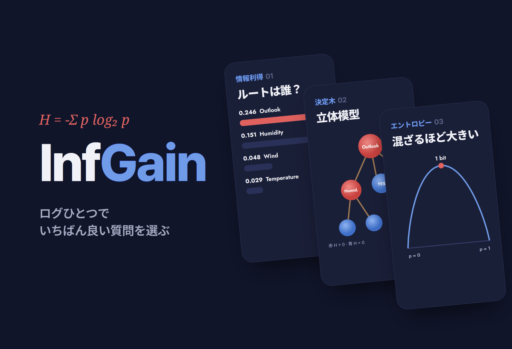
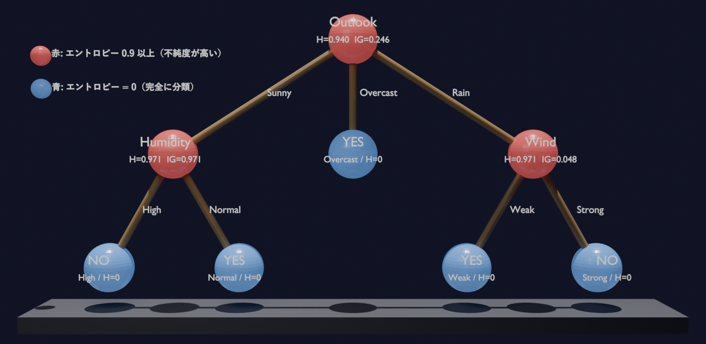

# InfGain.

<p align="center"></p>

> 高校で習う対数関数が、決定木で「最も良い質問」をどう選ぶのかを、Play Tennisの14サンプルでエントロピーと情報利得をすべて手計算して確かめた代数学の探究。結果は、エントロピーを色で塗り分けた立体の木の模型にまとめた

---

## 1. プロジェクト概要 (Overview)

| 項目 | 内容 |
|---|---|
| プロジェクト名 | InfGain.（対数関数と決定木の情報利得） |
| 一行要約 | シャノンエントロピー → 情報利得 → ID3による木の完成までを手計算でたどり、情報利得が最大のOutlook（0.246）がルートになり、SunnyはHumidity、RainはWindで分岐することを示した。ルートから葉までの「累積情報利得」を独自の指標として提案した |
| 期間 | 2026.06（2年生「代数学」D.D.I.M.-O.P. 第3回） |
| 参加人数 | 個人での探究 |
| 本人の役割 | テーマ選定、背景調査、全過程の手計算、立体模型の設計・制作、レポート（8ページ）の作成 |
| 貢献度 | 100% |

前回のHIU探究で、二分探索の最大探索回数が`log₂N`であることを学んだ。そのとき、対数は効率を表すだけでなく、人工知能のアルゴリズムの中でも中心的な役割を担っていることに興味を持った。決定木はスパムフィルター、医療診断、信用評価などに幅広く使われる基礎的なアルゴリズムだが、データをどの基準で分けるかを決める計算に、高校の対数関数がそのまま使われている。

**研究課題。** 決定木が「最も良い質問」を選ぶ基準は何か。そしてその基準は、対数関数のどんな性質から生まれるのか？

| 仮説 | 内容 |
|---|---|
| 1. 分岐の効率 | 情報利得が最大の特徴量をルートに選ぶほど、少ない分岐でデータを正確に分類できる |
| 2. 対数の性質 | `H = −Σ p log₂ p`において、データが1種類だけならエントロピーは0、2種類が半々なら最大値（1ビット）になる |

## 2. 技術スタック (Tech Stack)

手計算による探究なので、ツールの代わりに数学の概念と資料を記す。

| 区分 | 内容 | 用途 |
|---|---|---|
| シャノンエントロピー | `H(X) = −Σ p(xᵢ) log₂ p(xᵢ)` | ノードの不純度（混ざり具合）をビットで測る |
| 情報利得 | `IG(S, A) = H(S) − Σ (\|Sᵥ\|/\|S\|) · H(Sᵥ)` | 分岐の前後でエントロピーがどれだけ減ったかで、質問の良さを測る |
| ID3（Quinlan, 1986） | 情報利得が最大の特徴量を選び、下位のノードで繰り返す | 木を再帰的に完成させる |
| データ | Play Tennis（Mitchell, *Machine Learning* 第3章）14サンプル、Yes 9 / No 5 | 特徴量4つ：Outlook · Temperature · Humidity · Wind |
| 模型 | 球と爪楊枝の立体模型、Blenderモデル | エントロピーを色で、累積情報利得をラベルで示す |

**底が2である理由。** エントロピーを「1つのサンプルを分類するのに、はい/いいえの質問を平均何回すればよいか」と読めるからである。1種類に確定していれば質問は要らないので`H = 0`、半々なら1回必要なので`H = 1ビット`となる。HIU探究の二分探索が、候補を半分ずつ減らして`log₂n`回で答えにたどり着いたのと同じ原理である。

## 3. 主な機能と担当業務 (Key Features & Contributions)

### 計算の手順

1. データ全体のルートのエントロピー`H(S)`を計算
2. 4つの特徴量それぞれの情報利得を計算 → 最大の特徴量をルートに選択
3. ルートの各枝で、残りの特徴量について同じ計算を繰り返し、木を完成
4. 選ばれた構造が、最も少ない分岐でデータを分類しているかを確認

**ルート。** Yes 9 · No 5なので、`H(S) = −(9/14)log₂(9/14) − (5/14)log₂(5/14) ≈ 0.940`。1に近く、不純度が高い。

| 特徴量 | 枝ごと（Yes : No → H） | 情報利得 |
|---|---|:---:|
| **Outlook** | Sunny 2:3 → 0.971 · Overcast 4:0 → **0** · Rain 3:2 → 0.971 | **0.246** |
| Humidity | High 3:4 → 0.985 · Normal 6:1 → 0.592 | 0.151 |
| Wind | Weak 6:2 → 0.811 · Strong 3:3 → **1.000** | 0.048 |
| Temperature | Hot 2:2 → **1.000** · Mild 4:2 → 0.918 · Cool 3:1 → 0.811 | 0.029 |

**2回目の分岐。**

| 枝 | 残りの特徴量の情報利得 | 選択 |
|---|---|---|
| Sunny（2:3, H = 0.971） | Humidity **0.971** · Temperature ≈ 0.571 · Wind ≈ 0.020 | Humidity（High → すべてNo、Normal → すべてYes） |
| Rain（3:2, H = 0.971） | Wind **0.971** · Humidity 0.020 · Temperature ≈ 0.020 | Wind（Weak → すべてYes、Strong → すべてNo） |

```
                     [ Outlook ]  H=0.940, IG=0.246
                    /      |      \
              Sunny/   Overcast    \Rain
                  /         |        \
         [ Humidity ]     YES      [ Wind ]
          H=0.971         H=0       H=0.971
          IG=0.971      (n=4)       IG=0.971
          /      \                  /     \
      High      Normal          Weak      Strong
       |          |               |         |
      NO         YES            YES        NO
```

### 立体模型

<p align="center"></p>
<p align="center"><sub>ローカルに残っているBlenderモデルをレンダリングした（台座の氏名・学籍番号の文字は非表示）。赤い球はさらに分岐が必要な内部ノード、青い球は1種類に分類し終えた葉ノード</sub></p>

| 模型の要素 | 対応 |
|---|---|
| 球 / 爪楊枝 | ノード / 分岐 |
| 赤い球 | エントロピー > 0：まだ分類が終わっていない内部ノード |
| 青い球 | エントロピー = 0：1種類に完全に分類された葉ノード |
| ノードのラベル | 特徴量名、そのノードの`H`、その地点の`IG` |
| 葉のラベル | 到達したサンプル数`n`、ルートからの**累積情報利得** |

平面の図との違いは2つある。1つは、ノードのエントロピーを赤・青で塗り分け、不純度と完全に分類できたかどうかがひと目でわかるようにしたこと。もう1つは、ノードごとの情報利得の代わりにルートから葉までの情報利得を足し合わせて書き、経路ごとに、完全な分類に至るまでに必要な総情報量と深さをすぐに比べられるようにしたことである。

### 主な業務

- エントロピー・情報利得・ID3の背景の整理と、底2の意味の解釈（二分探索とのつながり）
- ルートから2回目の分岐までの全過程の手計算、エントロピーの参照表の作成
- 累積情報利得という指標の設計、立体模型の設計・制作
- レポートの作成

## 4. 成果と結果 (Results & Metrics)

### 定量的成果

| 経路 | 分岐回数 | 累積情報利得 | 到達先 |
|---|:---:|:---:|---|
| Overcast | **1回** | **0.246** | 青い葉（Yes, n = 4） |
| Sunny → Humidity | 2回 | 1.217 | 青い葉（No / Yes） |
| Rain → Wind | 2回 | 1.217 | 青い葉（Yes / No） |

| 項目 | 結果 |
|---|---|
| 仮説1 | 支持。情報利得が最大のOutlookをルートに置くと、Overcastの枝（4個）は1回で分類され、残りの2本の枝も1回ずつ分けるだけで、すべての葉のエントロピーが0になった |
| 仮説2 | 支持。1種類だけからなるOvercast · Rain-Weak · Rain-Strongは`H = 0`、半々のWind-Strong · Temperature-Hotは`H = 1.000` |
| コードによる再計算（2026.09） | 木の構造と順位は手計算と同じ。ルートでの情報利得はOutlook 0.247、Humidity 0.152で、手計算（0.246、0.151）とは小数第3位で1ずつ異なる（後述の§5-③） |
| 実技評価の点数 | （要確認） |

**エントロピーの参照表（Yes : No）**

| 構成 | 0 | 6:1 | 3:1 · 6:2 | 4:2 | 9:5 | 2:3 · 3:2 | 3:4 | 2:2 · 3:3 |
|---|:---:|:---:|:---:|:---:|:---:|:---:|:---:|:---:|
| エントロピー | **0** | 0.592 | 0.811 | 0.918 | 0.940 | 0.971 | 0.985 | **1.000** |

（「0」は4:0、0:2、3:0のように一方しかない場合）

### 定性的成果

- **エントロピーの式がまさに対数関数そのものであることを、計算で確かめた。** 対数の性質が、「1種類なら0、半々なら最大」という不純度の尺度の性質とぴったり一致する。
- **対数を、計算を速くするための関数ではなく、不確実性を測る道具として理解できるようになった。** 底2を「質問の回数」と読めば、二分探索と決定木が同じ言葉でつながる。
- **「AIが学習する」ことの実体を、手を動かして実感した。** それは、分岐のたびにエントロピーを比べ、最も情報の多い選択を繰り返すという数学的な過程だった。

### 確認された限界

- **14サンプルの教科書的な例題である。** 連続値の特徴量、欠損値、過学習は扱っていない。
- **ほかの分岐基準とは比べていない。** CARTのジニ不純度、C4.5の情報利得比との比較は今後の課題である。
- **BlenderモデルのWindノードのラベルが`IG=0.048`になっている。** この値はルートから見たWindの情報利得であり、Rainの枝でのWindの情報利得は0.971である。実物の模型に同じラベルが使われたかは（要確認）
- **Blenderモデルの凡例では、赤を「エントロピー0.9以上」と書いている。** レポートの定義（エントロピー > 0）とは異なる。この木では内部ノードがすべて0.94以上なので、結果は変わらない。

## 5. トラブルシューティング (Troubleshooting)

### ① 数字だけでは、仮説が木の上でどう表れるのかが見えなかった

**問題** エントロピーと情報利得を表ですべて計算し終えると、数字が多すぎて抽象的だった。「情報利得の大きい特徴量をルートに置くほど分岐が少なくなる」という仮説が、木の構造の上で実際にどう見えるのかを確かめにくかった。

**原因** 表は特徴量ごとの値を並べて見せるだけで、その値が木のどの枝をどれだけ早く終わらせるのかは見せてくれない。

**解決** 平面の図の代わりに立体模型を作った。ノードを球、分岐を爪楊枝で表し、エントロピーが0の葉は青、まだ混ざっている内部ノードは赤で塗った。

**結果** Overcastの枝は1回で青い葉にたどり着き、SunnyとRainは赤いノードをもう1つ経由してから青い葉に着く様子が、色だけで見えるようになった。

### ② ノードごとの情報利得だけでは、経路どうしを比べられなかった

**問題** 標準的な決定木の図は、ノードごとにその位置での情報利得しか書かない。これでは「どの経路が、分類を終えるのにより多くの情報を必要としたか」を比べられない。

**原因** 情報利得は1回の分岐の効果なので、経路全体のコストは人が頭の中で足し合わせるしかない。

**解決** ルートから各葉までの情報利得を足した「累積情報利得」を、葉ごとに書き込んだ。

**結果** Overcastは0.246（1回）、Sunny・Rainは1.217（2回）と、経路ごとの深さと必要な情報量を1つの数で比べられるようになった。

### ③ 手計算とコードの計算が小数第3位で違った（再検証）

**問題** このレポートを書く際に同じデータをコードで計算し直すと、ルートでの情報利得がOutlook 0.247、Humidity 0.152になった。手計算の値は0.246、0.151だった。

**原因** 手計算では、枝ごとのエントロピーを小数第3位で丸めた値（0.971、0.985など）で加重和を求めていた。途中の値の丸め誤差が、最後の桁に積み重なった。

**解決** （レポートv2.0で記録）順位と木の構造には影響しないことを確認し、両方の値を併記した。手計算では、途中の値を1桁多く持ち、最後にだけ丸めればよい。

**結果** Outlook > Humidity > Wind > Temperatureという順序と2回目の分岐（Humidity、Wind）は、手計算とコードで完全に一致する。

## 6. リンクと成果物 (Links & Deliverables)

| 区分 | リンク |
|---|---|
| GitHub リポジトリ | なし |
| 成果物 | 探究レポート（8ページ）、決定木の立体模型、Blenderモデル（`.blend`） |
| 関連する探究 | HIU探究（二分探索と`log₂N`） |

<details>
<summary><b>用語</b></summary>

- **情報量`I(x) = log₂(1/p)`**：確率の低い事象ほど大きくなる値
- **シャノンエントロピー**：情報量の期待値。データの不純度をビット単位で測る
- **ビット**：はい/いいえの質問1回分に相当する情報の単位
- **情報利得（IG）**：分岐の前後でのエントロピーの減少量。大きいほど良い質問
- **ID3**：1986年にロス・クインランが考案した、情報利得を使って木を再帰的に構成するアルゴリズム
- **ルート / 内部 / 葉ノード**：木の始点 / さらに分ける必要があるノード（H > 0） / 分類が終わったノード（H = 0）
- **累積情報利得**：ルートから葉までの各分岐のIGを足し合わせた値。この探究独自の指標
- **ジニ不純度 / 情報利得比**：それぞれCART、C4.5が使う分岐基準

</details>

<details>
<summary><b>参考文献</b></summary>

- ジェイ・ウェングロウ『誰でもわかるデータ構造とアルゴリズム』（韓国語版、書名は和訳）、イ・ミンソク訳、ハンビットメディア、2018（pp. 85–92）
- Tom M. Mitchell, *Machine Learning*, McGraw-Hill, 1997（第3章 Decision Tree Learning）
- J. R. Quinlan, "Induction of Decision Trees," *Machine Learning*, vol. 1, 1986
- Wikipedia, "Entropy (information theory)", "Information gain (decision tree)"

</details>
