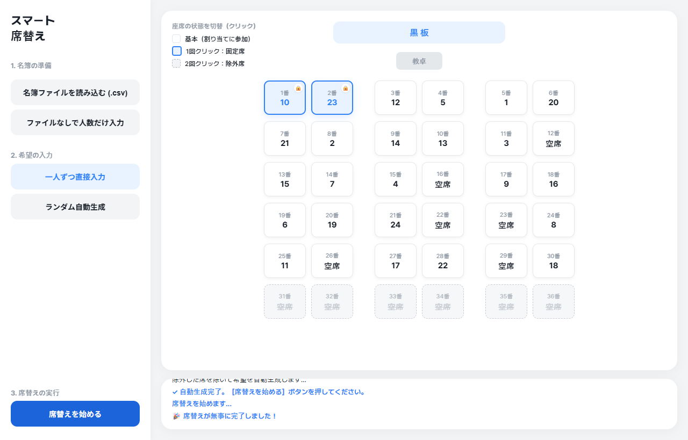
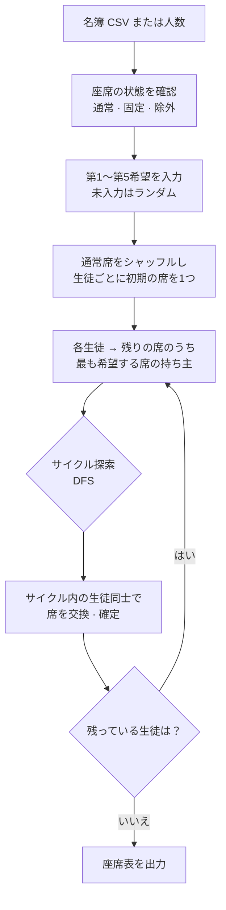

# Jari

<p align="center"></p>

> 生徒一人ひとりから第5希望まで座りたい席を集め、Top Trading Cycles（TTC）アルゴリズムで席を交換させて割り当てる教室の席決めプログラム

---

## 1. プロジェクト概要 (Overview)

| 項目 | 内容 |
|---|---|
| プロジェクト名 | Jari（デスクトップ版「우리반 자리 배정 시스템」（「うちのクラスの席決めシステム」の意）、Web 版「스마트 자리 배정」（「スマート席決め」の意）） |
| 一行要約 | くじ引きの代わりに生徒の希望を集め、最初に配った席を望む者同士で交換させて席を決める |
| 期間 | 2026.03.03 ~ 2026.03.06（4日間）・03.03 デスクトップ版（Python）→ 03.06 Web 版（HTML/JS） |
| 参加人数 | 個人プロジェクト |
| 本人の役割 | アルゴリズムの選定と実装、デスクトップ GUI と Web UI の開発、実行ファイルのパッケージング |
| 貢献度 | 100%（リポジトリのコミット5件はすべて本人） |

新学期の席決めは、たいていくじ引きで行う。公平ではあるが、座りたい席がある生徒の希望はまったく反映されない。逆に希望を集めて先生が手作業で調整すると、誰が先に言ったか、誰の事情を汲んだかで結果が決まってしまう。希望を反映しつつ、ルールの決まった割り当てを行うことを目標にした。

アルゴリズムはマッチング理論から選んだ。よく知られた Gale-Shapley は、双方が選好を持つ両側マッチング（学生と学校、応募者と企業）のためのものである。席のほうは生徒を選ばないので、この問題は片側だけが選好を持つ一方向の割り当てになる。そこで、まず生徒一人ひとりに席を1つずつ配り、そのあと希望する席の持ち主と交換させる TTC を選んだ。

## 2. 技術スタック (Tech Stack)

| 区分 | 技術 | 選定理由 |
|---|---|---|
| デスクトップ版 | Python 3.13 · customtkinter（278行） | 標準の tkinter より見た目の整ったダークテーマのウィジェットが使える。ファイルダイアログとメッセージウィンドウは tkinter のものをそのまま使う |
| パッケージング | PyInstaller による単一実行ファイル（`.exe`、約14MB） | 教室のパソコンに Python をインストールしなくても、そのまま実行できる |
| Web 版 | HTML · CSS · Vanilla JavaScript（単一の `index.html`、579行） | インストール不要で、ブラウザから開ける。教室のレイアウトをクリックで変えられる座席表は、Web のほうが作りやすかった |
| フォント | Pretendard（jsDelivr CDN） | ハングルの可読性 |
| 入力 | CSV（`번호,이름`、つまり番号と名前） | 学校で使っている名簿を、Excel からそのまま保存して使える |

## 3. 主な機能と担当業務 (Key Features & Contributions)

<p align="center"></p>
<p align="center"><sub>Web 版、人数モードで24人。1・2番を固定席、31〜36番を除外席にして割り当てた結果</sub></p>

### 実装した機能

- **名簿の準備**：`번호,이름` 形式の CSV を読み込む。Web 版には名簿なしで人数（最大36人）だけを入れるモードがあり、名前を登録しなくても使える。
- **希望の入力**：生徒ごとに第1〜第5希望の席を選ぶ。同じ席を2回選ぶと保存しない。全員分の入力が集まらなかった場合は、残りの生徒の希望をランダムに埋めるかどうかを尋ねる。デモ用に、全員分をランダムに生成するボタンもある。
- **TTC による割り当て**：各ラウンドで、生徒は「まだ残っている席のうち、最も希望する席の持ち主」を指す。指す先をたどってできるサイクルの中の生徒同士が席を交換し、抜けていく。希望する席がすべてなくなっていれば、自分の席を指してそのまま座る。
- **座席表**：黒板・教卓の下に、2列ずつ3ブロックに分けた配置で結果を表示する。
- **座席の状態設定（Web 版）**：机を1回押すと固定席、2回押すと除外席になる。固定席の生徒は次の割り当てでもその席に残り、除外席は希望リストと割り当てから外れる。残りの席が生徒数より少ない場合は割り当てを止め、理由を知らせる。

### 主な業務

- 問題の定義とアルゴリズムの選定（両側マッチングの Gale-Shapley ではなく、一方向の割り当ての TTC）
- TTC の実装：指し示しのグラフの構築、DFS によるサイクル探索、ラウンドの繰り返し
- customtkinter の GUI（3段階のサイドバー、ログウィンドウ、希望入力ウィンドウ、座席表ウィンドウ）と PyInstaller によるパッケージング
- Web 版への移植と機能追加（ランダムな初期割り当て、固定席・除外席、人数モード、座席不足のチェック）

## 4. 成果と結果 (Results & Metrics)

### 定量的成果

Web 版の割り当てコードをそのまま Node.js に移し、生徒ごとにランダムな第5希望までを与えて5,000回ずつ回した結果である（2026.09 のレポート作成中に測定、スクリプトは [`assets/jp/Jari/seat_sim.js`](../assets/jp/Jari/seat_sim.js)）。

| 条件（生徒 / 座席） | 第1希望に割り当て | 第3希望以内 | 第5希望以内 |
|---|---|---|---|
| 30人 / 30席 | 49.7% | 73.4% | 81.2% |
| 24人 / 30席 | 39.0% | 66.8% | 76.7% |
| 24人 / 36席 | 31.3% | 58.9% | 70.3% |

| 項目 | 結果 |
|---|---|
| 開発期間 | 4日間（デスクトップ版1日、Web 版1日） |
| 成果物 | 実行ファイル1つ（約14MB）+ Web ページ1つ |
| 対応規模 | Web 版は最大36席、デスクトップ版の座席表は35席 |
| 実際の教室での利用 | （要確認） |

生徒数と座席数が同じとき、約半数が第1希望の席を、80%以上が第5希望以内の席を得る。座席が余るほど数値が下がる理由は、後述の「確認された限界」にまとめた。

### 定性的成果

- くじ引きか手作業の調整か、という問題をマッチング理論の問題として定義し直し、問題の構造（一方向）に合うアルゴリズムを選んだ。
- 同じアルゴリズムを Python の GUI と Web の2通りで実装し、教室の PC の事情に合わせてインストール型とブラウザ型のどちらかを選べるようにした。
- Web 版では、教室ごとに異なる机の配置や「この生徒は前の席に固定」といった現実の条件を、座席の3段階の状態で解決した。

### 確認された限界（2026.09 時点のコード）

- **空席は交換市場に入らない。** Web 版は使用可能な座席をシャッフルしたあと、生徒数の分だけを切り出して初期の席として配る。残りの空席は誰のものでもないため、生徒が第1希望に書いても手に入らない。24人 / 36席では、第1希望の33.2%がこうした空席を指していた。空席まで市場に入れる変形（YRMH-IGYT：空席は優先順位が最も高い生徒を指す）で同じ条件を回すと、結果は大きく変わる。

  | 条件 | 現在の第1希望 / 第5希望以内 | 空席を含めた場合の第1希望 / 第5希望以内 |
  |---|---|---|
  | 24人 / 30席 | 39.0% / 76.7% | 61.4% / 95.7% |
  | 24人 / 36席 | 31.3% / 70.3% | 68.2% / 98.5% |

- **座席のシャッフル方法が均等ではない。** `sort(() => 0.5 - Math.random())` は比較関数に一貫性がないため、並び順ごとに確率が異なる。30個をシャッフルしたとき、先頭の要素がそのまま先頭に残る確率は8.49%で、均等な場合（3.33%）の2.5倍だった。初期の席の配分が公平かどうかはここにかかっているので、Fisher-Yates シャッフルに置き換えるべきである。
- **第5希望までしか受け付けない。** TTC は、選好をすべて受け付ける場合には嘘を書いても得をしないという性質が証明されている。5つに切った場合にこの保証がそのまま成り立つかどうかは、別途検討する必要がある。
- **Web 版は CSV を UTF-8 でしか読まない。** デスクトップ版にあった CP949 での読み直しが移植されておらず、Excel で保存したハングルの名簿が文字化けする可能性がある。
- **デスクトップ版の座席表は35席で固定である。** 36人以上だと割り当てはできるが、座席表には表示されない。
- **生徒のいない席を固定席に指定すると、実質的に除外席になる。** 固定席は割り当て対象の座席から外れるためである。

## 5. トラブルシューティング (Troubleshooting)

### ① 名簿の順番がそのまま初期の席になり、番号の若い生徒が有利になる

**問題** デスクトップ版は、名簿の k 番目の生徒に k 番の席を初期の席として与える。TTC は初期の席から出発して交換していく方式なので、人気のある席を最初から持っている生徒が交渉で有利になる。

**原因** 前の席を好む生徒が多いと仮定し（前方の席ほど選ばれる確率が高くなる重み付け）、30人 / 30席で5,000回回した。名簿の1〜5番は66.5%が第1希望を得たのに対し、26〜30番は7.1%にとどまった。番号が若いというだけで前の席の所有権を得て、その席を持ったまま交換に参加するからである。

**解決** Web 版では、使用可能な座席をシャッフルしてから生徒に配るように変えた（ランダムな初期割り当て）。

**結果** 同じ条件で、1〜5番と26〜30番の第1希望の割り当て率は31.6%と31.8%で同等になった。なお、ランダムな初期割り当てを行う TTC は、ランダムな順番で1人ずつ選ばせる方式（ランダム・シリアル・ディクテーターシップ）と結果の分布が同じであることが知られている（Abdulkadiroğlu & Sönmez, 1998）。ただし前述のシャッフルの偏りのせいで、現在の実装は完全には均等でない。数値はレポート作成中のシミュレーション（[`seat_sim2.js`](../assets/jp/Jari/seat_sim2.js)）で得た。

### ② 教室の机は生徒の数ちょうどとは限らない

**問題** デスクトップ版は座席数を生徒数と同じにし、座席表は35席で描いていた。実際の教室には空いている机があり、使わない席や、視力・事情のためにあらかじめ決めておく席もある。

**原因** 座席を「生徒数と同じ数だけある番号のリスト」としてしか扱っていなかった。座席ごとに状態を持たせる場所がなかった。

**解決** Web 版では36席のグリッドを先に描き、座席ごとに状態（通常 · 固定 · 除外）を持たせた。机を押すたびに状態が順に切り替わる。希望入力のリストとランダムな希望生成は、除外席を除いて作る。割り当ての前に `36 - 除外席 - 固定席` が割り当てる生徒数より少なければ処理を止め、どの席を解除すべきかを知らせる。

**結果** 名簿を読み込む前に、まず教室のレイアウトを合わせておける。固定席の生徒は、割り当てをやり直しても同じ席に残る。

### ③ Excel で保存した名簿のハングルが文字化けする

**問題** 学校の名簿は、たいてい Excel から CSV で保存して使う。このファイルを UTF-8 でしか読まないと、読み込みに失敗する。

**原因** 韓国語版 Windows の Excel は、CSV を CP949（EUC-KR 系）で保存する。UTF-8 で読むと、ハングルのバイト列で `UnicodeDecodeError` が発生する。

**解決** デスクトップ版では、まず UTF-8 で読み、デコードエラーが出たら CP949 で読み直すようにした。どちらの場合も、ファイルは `finally` で閉じる。

**結果** Excel からそのまま保存した名簿も UTF-8 の名簿も、どちらも読める。Web 版にはこの処理がまだない。

## 6. リンクと成果物 (Links & Deliverables)

| 区分 | リンク |
|---|---|
| GitHub リポジトリ | [stx4R/Jari](https://github.com/stx4R/Jari)（非公開） |
| 公開URL | https://stx4r.me/project/Jari/ |
| 実行ファイル | リポジトリ内の `Jari.exe`（Windows） |
| シミュレーション | [`seat_sim.js`](../assets/jp/Jari/seat_sim.js)、[`seat_sim2.js`](../assets/jp/Jari/seat_sim2.js) |

### アルゴリズムの流れ



1ラウンドの例：

```
A は B の席を、B は C の席を、C は A の席を望む
→ A → B → C → A のサイクル → 3人が同時に希望の席へ移動して抜ける
```

---

+++

## カスタマージャーニーマップ (Journey Map)

ユーザーは、席を割り当てる担任の先生（または学級委員）である。

| 段階 | ユーザーの行動 | ユーザーの考え | プログラムの対応 |
|---|---|---|---|
| 準備 | 教室の机の配置を思い浮かべる | 「うちのクラスは後ろの列を使わないんだけど」 | 名簿がなくても、机を押して除外席を先に指定できる |
| 名簿 | 名簿ファイルを探す | 「名前をアップロードしても大丈夫かな？」 | 人数だけを入れるモードなら、番号だけで割り当てられる |
| 希望の収集 | 生徒から希望の席を聞く | 「全員分は集まらなかったな」 | 未入力の生徒をランダムで埋めるかどうか尋ねる |
| 割り当て | ボタンを押す | 「この結果、信用していいのかな？」 | デスクトップ版は、ラウンドごとのサイクルをログに残す |
| 調整 | 特定の生徒を前の席にする | 「この子だけ固定してもう一回」 | 固定席に指定すれば、再割り当てでも同じ席に残る |

## アダプティブデザイン (Adaptive Design)

- デスクトップ版は 1000×650 の固定ウィンドウに3段階のサイドバーを置き、上から順にボタンを押していけば作業が終わるようにした。前の段階が終わるまで、次のボタンは無効になっている。
- Web 版は同じ3段階のサイドバーを使い、座席表を右側に置いた。2026.03.06 の2回目のコミットで余白・文字・机のサイズを一括で小さくし（机 84×70 → 78×64）、1画面に36席が収まるようにした。

## セキュリティ脆弱性管理 (DREAD)

席の割り当てでは、結果の公平性を守らなければならない。操作や偏りによって結果が変わりうるポイントを脅威とみなす。

| 脅威 | 損害 | 再現性 | 悪用性 | 影響ユーザー | 発見性 | 判断 |
|---|---|---|---|---|---|---|
| 偏ったシャッフルのせいで、特定の座席が特定の番号の生徒に回りやすくなる | 中 | 高 | 低 | クラス全体 | 低 | Fisher-Yates に置き換える。コード1行の修正だが表からは見えないので、優先して直す対象 |
| 運用者が、割り当て結果が気に入るまで何度も回し直す | 中 | 高 | 高 | クラス全体 | 低 | 乱数シードを公開して結果と一緒に記録すれば、再実行したかどうかを確認できる |
| CSV の名前を `innerHTML` で描画しており、スクリプトを埋め込まれうる | 低 | 中 | 中 | 運用者の PC | 中 | 名簿ファイルは運用者が自分で選ぶので、リスクは低い。`textContent` に変えれば済む |

修正の順序は、シャッフルの置き換え → シードの記録 → `textContent` への切り替えが妥当である。前の2つは公平性に直結している。
