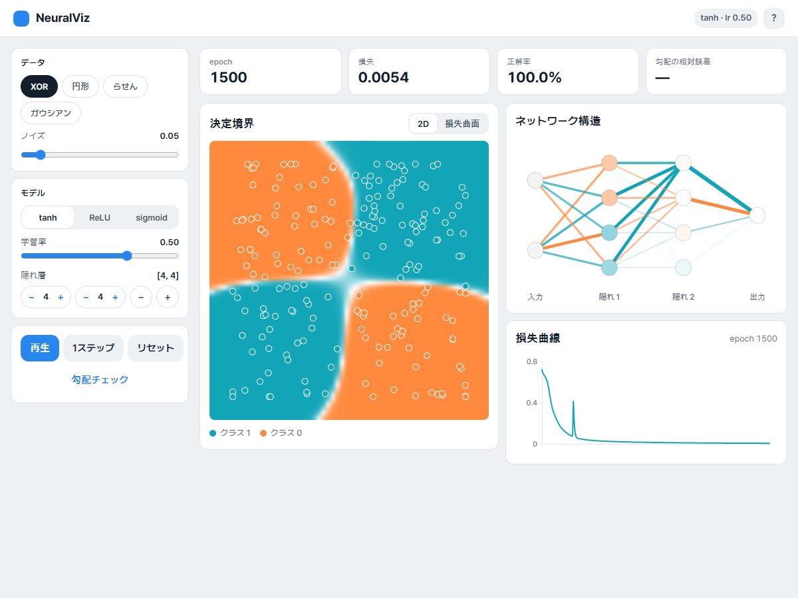
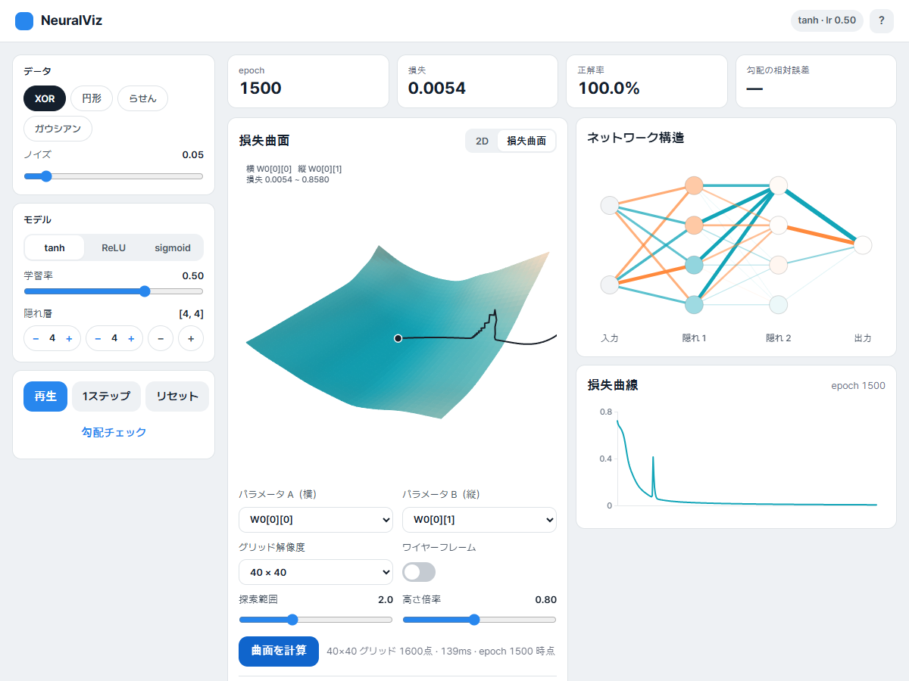
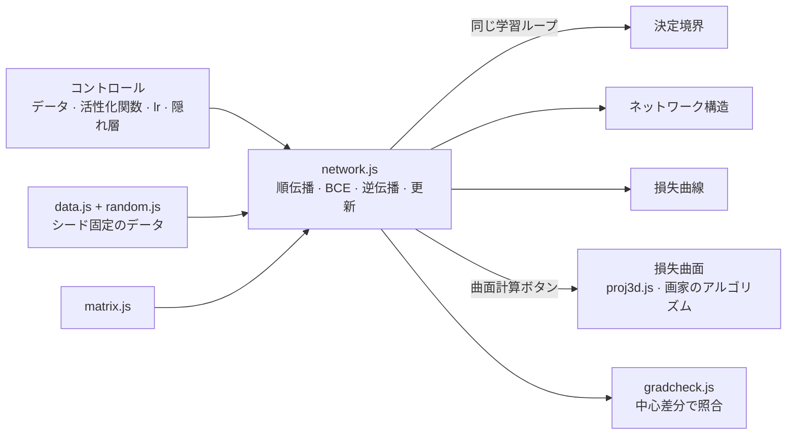

# NeuralVisualizer

<p align="center"></p>

> 外部ライブラリを使わず、行列演算から逆伝播、3D 投影までを自前で実装し、多層パーセプトロンが学習する様子をブラウザ上の4つの画面で見せる教育用ツール「NeuralViz」

---

## 1. プロジェクト概要 (Overview)

| 項目 | 内容 |
|---|---|
| プロジェクト名 | NeuralVisualizer（アプリ名「NeuralViz」） |
| 一行要約 | データ・活性化関数・学習率・隠れ層を変えると、決定境界、ネットワーク構造、損失曲線、3D 損失曲面が同じ学習ループに合わせてリアルタイムに変わる |
| 期間 | 2026.09.09 ~ 2026.09.11（v1.0.0 → v1.0.6） |
| 参加人数 | 個人プロジェクト |
| 本人の役割 | 設計、ニューラルネットワークエンジン・3D レンダラー・可視化・UI の実装、検証実験 |
| 貢献度 | 100%（リポジトリのコミット7件はすべて本人） |

ニューラルネットワークの授業では、逆伝播を数式で学ぶ。しかし数式だけでは、なぜ隠れ層が必要なのか、学習率が大きいとなぜ発散するのか、ReLU と sigmoid でなぜ収束の仕方が違うのかを目で確かめにくい。このツールでは、その違いを画面上で直接比べられる。

外部ライブラリを1つも使わなかったのは、このプロジェクトの本質が「自前で実装すること」にあるからである。テンソルライブラリを使えば逆伝播は1行で済み、何を学んだのかが消えてしまう。

## 2. 技術スタック (Tech Stack)

| 区分 | 技術 | 選定理由 |
|---|---|---|
| 言語 | Vanilla JavaScript（ES モジュール） · HTML · CSS | ビルドツールなしで、`index.html` 1つで開ける。ツールチェーンが「自前実装」の邪魔をしないようにした |
| 数値計算 | 自作の `number[][]` 行列演算（float64） | 次元が合わなければ形状を出力して throw する。JS 標準の float64 なので、勾配チェックの基準に 1e-7 を使える |
| レンダリング | Canvas 2D | 3D も WebGL を使わず、回転・透視投影・ランバート照明・画家のアルゴリズムを自分で計算して描く |
| 乱数 | mulberry32 + Box–Muller | シードが同じなら同じデータ・同じ初期重みが得られ、実験を再現できる |
| デプロイ | GitHub Pages | 静的ファイルだけで済む |

## 3. 主な機能と担当業務 (Key Features & Contributions)

<p align="center"></p>
<p align="center"></p>
<p align="center"><sub>ローカルで XOR · [4,4] · tanh · lr 0.5 により1500 epoch 学習したあとにキャプチャ。上：決定境界、下：2つの重み方向の損失曲面と学習経路</sub></p>

### 実装した機能

- **データ4種**：XOR（象限）、円形、らせん、ガウス分布の2クラスター。線形に分離できるものとできないものを対比させ、隠れ層の必要性を示す。ノイズは調節できる。
- **モデル設定**：隠れ層の活性化関数（tanh / ReLU / sigmoid）、学習率、隠れ層の数と層ごとのニューロン数を変えられる。出力は sigmoid、損失は二値交差エントロピーに固定した。初期化には、tanh・sigmoid で Xavier、ReLU で He を使う。
- **決定境界**：グリッド3,600点を1回の順伝播で計算し、ヒートマップで塗る。データ点はラベルの色で塗りつぶして白い縁取りを付けるので、正しく分類された点は背景に溶け込み、誤分類された点だけが浮き上がる。
- **ネットワーク構造**：線の太さは重みの大きさ、色は符号、円の塗りはバイアスを表す。
- **損失曲線**：点の数が描画幅を超えたら、均等に間引いて描く。
- **3D 損失曲面**：2つのパラメータを選んで現在値の周りを 40×40 のグリッドで走査し、その上に学習経路を描く。ドラッグで回転できる。
- **勾配検証ボタン**：逆伝播で求めた勾配を中心差分による数値微分と照合し、相対誤差を表示する。

### 実装した数式

```
順伝播   z[l] = W[l]·a[l-1] + b[l],   a[l] = f(z[l])
損失     J = -(1/m) Σ [ y·log(a) + (1-y)·log(1-a) ]      a は [1e-12, 1-1e-12] にクリップ
逆伝播   δ[L] = a[L] - y
         δ[l] = (W[l+1]ᵀ·δ[l+1]) ⊙ f'(z[l])
         dW[l] = (1/m)·δ[l]·a[l-1]ᵀ,   db[l] = (1/m)·Σ δ[l]
3D       Ry(yaw) → Rx(−pitch) の合成, 透視 s = f / (z + d), 照明 I = 0.35 + 0.65·max(0, n·l)
```

出力層のデルタが `a - y` と単純になるのは、BCE の `∂J/∂a = (a-y) / (a(1-a))` とシグモイドの `σ'(z) = a(1-a)` が連鎖律で掛け合わされ、分母が打ち消し合うからである。

### 主な業務

- 行列演算・MLP（順伝播・BCE・逆伝播・更新）・データ生成・シード付き乱数の実装
- 勾配チェックと ReLU の折れ点判定（後述のトラブルシューティング①②）
- 3D 投影・法線・ランバート照明・画家のアルゴリズムによるレンダラー
- 4つの可視化とコントロール、学習ループとの接続、v1.0.6 での UI 再構成
- 実験（隠れ層と XOR、学習率、活性化関数別の収束、らせんに対する容量の限界）と README の整理

## 4. 成果と結果 (Results & Metrics)

### 定量的成果

| 項目 | 結果 |
|---|---|
| 外部ライブラリ | 0個 · コード約2,800行 |
| エンジンテスト（`tests/run.html`） | **5/5 通過**（2026.09 に再実行）。勾配の相対誤差は tanh 9.622e-10、ReLU 2.788e-10、sigmoid 1.732e-10 |
| 勾配チェックのスイープ | データ4 × 活性化関数3 × 層構成7 = 84通りを3回繰り返し（252件）+ 学習後4件、失敗0件、最大相対誤差 1.2e-8（README の記録。スイープのスクリプトはリポジトリにない） |
| 3D 検証 | 回転後の長さ保存の誤差 8.88e-16、`R(θ)R(-θ) = I` の誤差 2.22e-16。yaw 36通り × 31,408ピクセルで、画家のアルゴリズムによる深度の逆転0件 |
| XOR 学習 | [2,4,4,1] tanh、2000 epoch 後に損失 0.0043 · 正解率 100%（265ms） |
| 実際の授業・ユーザーでの活用 | （要確認） |

**活性化関数別の収束**（XOR 200点、[2,4,4,1]、lr 0.5、2000 epoch、シード1〜8の中央値）

| 活性化関数 | 損失 < 0.1 に到達 | 到達 epoch | 最終損失 | 正解率 |
|---|---|---|---|---|
| tanh | 8/8回 | 226 | 0.0043 | 100% |
| ReLU | 7/8回 | **162** | 0.0105 | 100% |
| sigmoid | **0/8回** | — | 0.3040 | 87.0% |

ReLU が最も速いが、8回中1回は死んだユニット（dead unit）のせいで基準に届かなかった。sigmoid は導関数の最大値が 0.25 なので、隠れ層を2つ通ると勾配が16分の1以下に縮み、一度も基準に届かなかった。

### 定性的成果

- **2D と 3D が同じ事実を別の言葉で語る。** 隠れ層をすべて外して XOR を学習させると、損失は 0.6849（ln 2 ≈ 0.6931 付近）で止まり、正解率は49.5%である。決定境界では1本の直線が点の間をさまよう姿として、損失曲面では最低点が 0.6852 と現在の損失と事実上同じ、平らな皿として見える。曲面を併せて見れば、「これ以上回しても無駄だ」ということがはっきりする。
- **らせんでどこから先にほどけるかを測った。** `[6,6]` tanh では5,370 epoch で94.5%に達する。半径の区間別に見ると、外側は500 epoch の時点ですでに81%と最も早く整理され、中間の帯は2000 epoch まで20%台にとどまって最も遅い。2本の腕の間隔は一定だが、内側ほど曲率が大きく、少数の隠れユニットで作れる曲がりでは足りないためである。20%台というのは当てられていないのではなく、逆向きに当てているという意味である。
- **「見える」ではなく「測った」で検証した。** リファクタリング前後の出力をバイト単位で比較し、ニューロンの円の重なりはキャンバスのアルファチャンネルを走査してピクセル単位で測った（`[2,8,8,1]` が 280px の中で直径 26px、最小間隔 3px）。

### 確認された限界

- **損失曲面は2次元の断面である。** 選んだ2つのパラメータだけを動かし、残りは現在値に固定する。実際の学習では残りも一緒に動くので、曲面上の経路は近似にすぎない。
- **学習が十分に進んだあとは、勾配検証が基準を超えることがある。** 報告書を書きながら XOR · [4,4] · tanh で1500 epoch 学習させ、検証ボタンを押すと、相対誤差が 2.8e-7 と基準（1e-7）を超えて「失敗」と表示された。損失が 0.005 程度まで下がると勾配そのものが小さくなり、浮動小数点の丸め誤差が相対誤差に占める割合が大きくなるためだと考えられる（推測、要確認）。基準を絶対誤差と併せて見るか、ε を勾配の大きさに合わせるなどして補う必要がある。
- **252件のスイープには再現手段がない。** リポジトリに残っているテストは5件である。スイープのスクリプトも一緒にコミットしなければ、README の数値を他人が確認できない。
- **画家のアルゴリズムは高さ場という前提に頼っている。** オーバーハングのある形状まで広げるなら、z バッファかセル分割が必要になる。

## 5. トラブルシューティング (Troubleshooting)

### ① ReLU だけが勾配チェックに失敗した

**問題** tanh と sigmoid は相対誤差 1e-10 台で通過するのに、ReLU だけが 2e-2 で失敗した。

**原因** 逆伝播ではなく、数値微分の側の問題だった。ReLU は `z = 0` で微分できない。バイアスを0で初期化すると、前の層の出力がすべて0になる死んだユニットでは、z がちょうど0になる。その点では中心差分が折れ点をまたぎ、左微分0と右微分1を平均してしまうので、数値勾配そのものが誤った値になる。対照実験で確定させた。シード30個を調べると、`min|z| = 0` の17件はすべて失敗し、`min|z| > 0` の13件はすべて通過した。例外はなかった。

**解決** 検査の前に「この点は折れ点から十分に離れているか」を判定させた。折れ点に引っかかる点なら、折れ点のないシードに移して測り直し、そのことを画面とログに記す。

**結果** 折れ点から離れた点だけを選んで測ると、相対誤差は 1e-8〜1e-10 台まで下がる。テストログにも「シード3の点は折れ点に該当 → 折れ点のないシード1で再検査 → 2.788e-10 で通過」とそのまま残る。

### ② 折れ点の判定が楽観的すぎた

**問題** 判定を入れたあとも、252件中2件が最大相対誤差 5.17e-4 で失敗した。

**原因** 最初の判定は、「パラメータを ε 揺らすと、次の層の z は最大で `ε·max|a|` だけ動く」ことしか見ていなかった。しかし前の層で生じた揺れは、後ろの層に進むほど重みの分だけ増幅される。

**解決** 揺れの上限を層ごとに累積するように変えた。

```
R[l] = ‖W[l]‖∞ · R[l-1] + ε · max(|a[l-1]|, 1)
```

tanh・sigmoid・ReLU のいずれも導関数の絶対値が1以下であるという性質を使った、リプシッツ上界である。各層で `min|z| > R[l]` なら、どのパラメータを揺らしても折れ点を越えない。

**結果** 残っていた失敗2件が消えた。「失敗したらシードを引き直し、通過するまで回す」方式はあえて使わなかった。その方式だと、本物の逆伝播のバグがあっても偶然通過する点を見つけ出してしまい、検証が骨抜きになる。測定が有効な点かどうかを先に判定して結果と切り離しておけば、通過は信頼でき、折れ点に引っかかったという事実も隠れない。

### ③ z バッファなしで 3D 曲面の隠面処理は正しくできるか

**問題** 損失曲面を Canvas 2D で描くには、隠面処理が必要になる。z バッファをピクセル単位で実装すると、遅いうえにコードが大きくなる。

**原因** 一般的な形状では、セル A が B を隠すと同時に B が A を隠す循環的な重なりが起こりうる。そのため、セル単位で並べ替えるだけでは安全ではない。

**解決** この曲面はグリッド上の高さ場を上から見下ろす形状なので、循環的な重なりが起こりえない。この点を利用した。セルの4頂点の平均深度で降順に並べ替え、遠いセルから塗る（画家のアルゴリズム）。その前提が正しいかは実測で確かめた。yaw 36通りについて、31,408ピクセルごとに画家のアルゴリズムの結果と、重心補間で求めた実際の最近接セルを比較した。

**結果** 深度の逆転は0件。セル1つにつき代表値1つで全順序を作れるという前提が、この形状では成り立つ。

## 6. リンクと成果物 (Links & Deliverables)

| 区分 | リンク |
|---|---|
| GitHub リポジトリ | [stx4R/NeuralVisualizer](https://github.com/stx4R/NeuralVisualizer)（非公開） |
| 公開URL | https://stx4r.me/project/NeuralVisualizer/ |
| エンジンテスト | リポジトリの `tests/run.html`（静的サーバーで開いてコンソールを確認） |

### 構成



| ファイル | 役割 |
|---|---|
| `src/matrix.js` | 行列演算。次元が合わなければ形状を出力して throw |
| `src/network.js` | MLP 本体 |
| `src/gradcheck.js` | 数値微分と解析的勾配の相対誤差を比較 |
| `src/proj3d.js` | 3D 回転・透視投影・法線・ランバートシェーディング（純粋関数） |
| `src/viz-*.js` | 決定境界 · ネットワーク構造 · 損失曲線 · 損失曲面 |
| `src/main.js` | コントロール・学習ループ・ビューの切り替え |

---

+++

## カスタマージャーニーマップ (Journey Map)

ユーザーは、ニューラルネットワークを初めて学ぶ学生である。

| 段階 | ユーザーの行動 | ユーザーの考え | ツールの対応 |
|---|---|---|---|
| 開始 | XOR を選んで再生を押す | 「何が動いてるんだろう？」 | 決定境界の色がにじむように広がり、損失曲線が下がっていく |
| 実験1 | 隠れ層をすべて外す | 「なんでうまくいかないの？」 | 損失が 0.69 で止まり、曲面は平らな皿になる |
| 実験2 | 学習率を 3.0 に上げる | 「もっと速くなるよね？」 | 損失曲線が 0.3〜0.8 の間でのこぎりの歯のように跳ねる |
| 実験3 | sigmoid に切り替える | 「活性化関数で何が違うの？」 | 同じ設定なのに、損失の下がり方がずっと遅い |
| 確認 | 勾配検証を押す | 「この計算、合ってるの？」 | 解析的勾配と数値勾配の相対誤差が表示される |

## モーションデザイン (Motion Design)

- 学習中は毎フレーム、4つの画面が同じ学習ループに合わせて一緒に動く。決定境界は白（出力 0.5）から始まり、2色に分かれていく。学習前の背景が白いのは、Xavier 初期化で重みが小さく、出力が全域で 0.5 付近に張り付いているためである。
- 損失曲面はドラッグで回転させる（pitch 5°〜85°）。計算は「曲面計算」ボタンを押したときにしか行わないので、学習ループを遅くしない。

## ジェスチャー設計 (Gesturing)

- 損失曲面をマウスや指でドラッグし、垂直軸まわりの回転（yaw）と傾き（pitch）を変える。見下ろす角度を 5°〜85° に制限し、曲面が裏返って見えないようにした。

## アダプティブデザイン (Adaptive Design)

- v1.0.6 で、上部のバーに集まっていたコントロールを左側のカード（データ · モデル · 再生）に移し、右側に指標カード（epoch · 損失 · 正解率 · 勾配の相対誤差）と4つの可視化を配置した。
