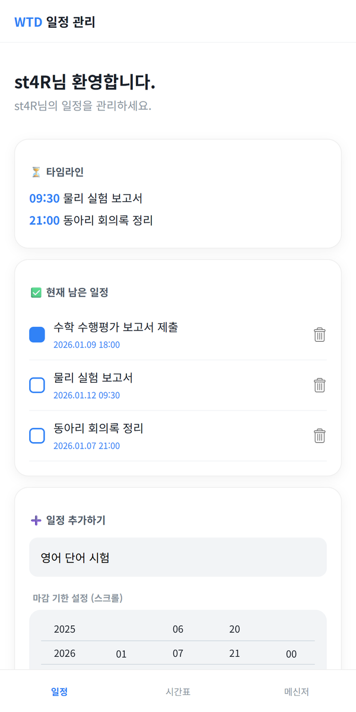
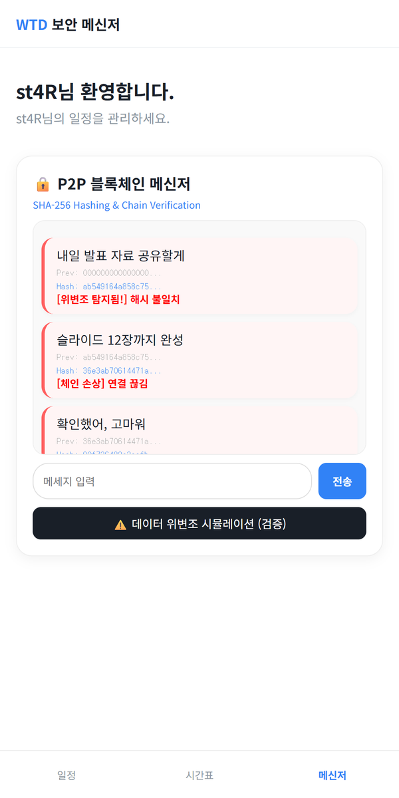
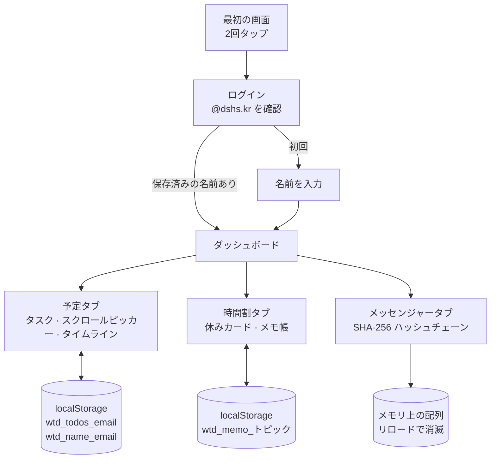

# Plan-ME

<p align="center"></p>

> 学校のメールアドレスでログインして締め切りのあるタスクを管理し、ハッシュチェーンでメッセージ改ざんの概念を体験できる学生向けスケジュールアプリ「WTD」

---

## 1. プロジェクト概要 (Overview)

| 項目 | 内容 |
|---|---|
| プロジェクト名 | Plan-ME（アプリ名「WTD」— What To Do → All in One School Manager） |
| 一行要約 | サーバーを使わずブラウザのストレージだけでユーザーごとのタスク・締め切り・メモを管理し、SHA-256 ハッシュチェーンのメッセンジャーでブロックチェーンの改ざん検知の原理を見せるシングルページアプリ |
| 期間 | 2025.12.19（第1版、1日で10コミット）・2026.01.05（タブ3つに拡張）・2026.01.13、2026.03.03（コメント整理） |
| 参加人数 | 個人プロジェクト |
| 本人の役割 | 企画、画面設計、全体の実装 |
| 貢献度 | 100%（リポジトリのコミット13件はすべて本人） |

最初は名前のとおり「何をすべきか」だけに答える ToDo リストだった。学校のメールアドレスでログインすると自分の予定だけが表示され、締め切りがいつなのかが一目で分かることを目標にした。冬休みの間に時間割・メモ・メッセンジャーのタブを加えて「学校生活オールインワン」へと範囲を広げ、メッセンジャーにはブロックチェーンのハッシュチェーン構造を自分で実装して組み込んだ。

## 2. 技術スタック (Tech Stack)

| 区分 | 技術 | 選定理由 |
|---|---|---|
| 画面 | HTML · CSS · Vanilla JavaScript（単一の `index.html`、463行） | ファイル1つを開けばすぐ使える構成にしたかった。フレームワークは使わず、画面の切り替えは `section` とタブの `active` クラスで処理する |
| 保存 | `localStorage`（ユーザーのメールアドレスごとのキー） | サーバーや DB がなくても、リロードや再アクセスの後にデータが残る。キーにメールアドレスを含め、1台の端末で複数のアカウントを区別する |
| ハッシュ | Web Crypto API `crypto.subtle.digest('SHA-256')` | ブラウザ標準の API なので、ライブラリが要らない。ハッシュチェーンメッセンジャーのブロックハッシュを生成する |
| 入力 UI | CSS `scroll-snap` ベースの自作スクロールピッカー | 年・月・日・時・分をホイールのように回して選ぶ。モバイルブラウザごとに見た目が違う標準の日付入力の代わりに、アプリのトーンに合う入力部品を自作した |
| フォント | Noto Sans KR（Google Fonts） | ハングルの可読性 |
| デプロイ | なし（要確認） | リポジトリに Pages の設定がない |

## 3. 主な機能と担当業務 (Key Features & Contributions)

<p align="center">
  
  
</p>
<p align="center"><sub>ローカルで実行してキャプチャ。ロゴ画像はリポジトリに含まれていないため隠した。</sub></p>

### 実装した機能

- **段階的に進む最初の画面**：1回目のタップで案内文が変わり、2回目のタップでログインボタンが現れる。
- **学校アカウントでのログイン**：`@dshs.kr` で終わるメールアドレスだけを受け付ける。初めてログインしたアカウントには名前（ニックネーム）を一度だけ尋ね、次回からは保存された名前ですぐにダッシュボードを開く。
- **タスク＋締め切り**：タスクを入力し始めるとスクロールピッカーが開く。年（2025〜2030）・月・日・時・分の5列を回して締め切りを決める。完了チェックと削除にも対応する。
- **タイムライン**：まだ終わっていないタスクだけを、締め切り時刻と一緒に別枠でまとめて表示する。
- **時間割タブ**：休み期間の案内カードと、休み中の計画を書くメモ帳。通常の時間割は新学期が始まってから NEIS API と連携する予定で、枠だけ用意してある。
- **メモ帳**：トピックごとにメモを保存する。
- **ハッシュチェーンメッセンジャー**：メッセージごとに `前のブロックのハッシュ + 本文 + 時刻` を SHA-256 でハッシュしてブロックを作り、チェーンにつなぐ。吹き出しごとに、前のハッシュと現在のハッシュの先頭部分を表示する。
- **改ざんシミュレーション**：ボタンを押すと最初のブロックの内容を書き換えたうえで、そのブロックを「ハッシュ不一致」、後続のブロックを「チェーン破損」と表示する。1つのブロックの改ざんが後ろ全体に波及する構造を見せる。

### 主な業務

- 画面フローの設計（最初の画面 → ログイン → 名前の登録 → ダッシュボード3タブ）
- ユーザーごとのデータ保存構造の設計（`wtd_name_{email}`、`wtd_todos_{email}`、`wtd_memo_{トピック}`）
- スクロールピッカーの実装（列の生成、現在時刻に合わせた初期位置の設定、スクロール位置 → 値の変換）
- SHA-256 ハッシュチェーンの実装と改ざんの可視化
- 2026.01.05 の拡張改修（256行追加・55行削除）

## 4. 成果と結果 (Results & Metrics)

### 定量的成果

| 項目 | 結果 |
|---|---|
| 第1版の完成 | 1日（2025.12.19）、コミット10件 |
| 最終的な規模 | `index.html` 463行、外部 JS ライブラリ0個 |
| 機能 | タブ3つ（予定 · 時間割 · メッセンジャー）、保存キー3種類 |
| ハッシュ | ブロックごとに SHA-256（256ビット）のハッシュ、前のハッシュで連結 |
| 実ユーザー | （要確認） |

### 定性的成果

- サーバーがなくても、ユーザーごとに分かれたデータがリロード後も残る構成を作った。
- ブロックチェーンを「各ブロックが前のブロックのハッシュを抱えている」という1つの性質に絞り、自分で実装した。前のブロックが1つ変わると後ろがすべて食い違うことを、画面で見せられる。
- ブラウザ標準の入力部品を使わずにスクロールピッカーを自作する過程で、スクロール位置と値の変換を自分で設計した。

### 確認された限界（2026.09 時点のコード）

- **ログインは認証ではない。** メールアドレスが `@dshs.kr` で終わるかどうかと、パスワード欄が空かどうかしか見ていない。パスワードは検証も保存もしない。
- **「共有」と「P2P」はまだ名前だけである。** メモ帳には「P2P 同期済み」と書かれているが、すべてのデータはその端末の `localStorage` にしかない。他の人とは共有されない。
- **改ざんの検証ではハッシュを再計算していない。** ボタンを押すと、最初のブロックとそれ以降のブロックを無条件に破損と表示する。2026.03.03 に削除した初期のコメントにも、本来は前のハッシュ・本文・時刻からハッシュを計算し直して比較すべきだが、シミュレーションなので強制的に検知状態にしている、と明記してあった。メッセンジャーのチェーンはメモリ上にしかなく、リロードすると消える。
- **NEIS の時間割は連携されていない。** 案内文があるだけである。
- **ピッカーの日付の範囲が月と連動していない。** 2月でも31日まで選べる。
- **タイムラインに日付がない。** 時刻だけを表示し、締め切り順にも並べ替えないため、日付の違うタスクが同じ日の予定のように見える（上のスクリーンショットの 09:30 は1月12日、21:00 は1月7日である）。

## 5. トラブルシューティング (Troubleshooting)

### ① リロードするとタスクと名前がすべて消える

**問題** 第1版では、タスクを追加してもページを再読み込みするとリストが空になった。名前もログインのたびに聞き直していた。

**原因** タスクの配列と名前を JavaScript の変数にしか持っていなかった。ページが再読み込みされると、変数は初期化される。

**解決** `localStorage` に保存し、キーにログインしたメールアドレスを入れてユーザーごとに分けた（`todos_{email}`、`name_{email}`）。ログイン時にそのメールアドレスの名前がすでにあれば、名前の入力画面を飛ばす。

**結果** 同じ端末でログインし直しても予定が残り、1台の端末を複数人で使ってもお互いのリストが混ざらない。

### ② スクロール位置を日付の値に変換する

**問題** 締め切りをホイールのように回して選ばせるには、ユーザーが止めた位置から「今、中央にある値」を読み取る必要があった。列が最初に描画されるときに、現在時刻に合わせておくことも必要だった。

**原因** 選択枠が列の中央に来るよう、各列の上下に空のセルを1つずつ入れていた。そのため、スクロール位置から求めた番号と実際の子要素の番号が1つずれる。初期位置も、列が画面に配置された後で指定しなければならない。

**解決** セルの高さを CSS とスクリプトで同じ値（34px）に揃え、値は `Math.round(scrollTop / 34) + 1` 番目の子要素から読み取る。`+1` が上側の空セルを飛ばす役目である。初期位置は列を追加してから100ms後に `(現在値 - 開始値) × 34` で指定し、`scroll-snap` でセルの中央にぴたりと止まるようにした。端まで回したときに計算上の番号が範囲外になってもエラーにならないよう、該当する要素がなければ `'00'` を返す防御コードを拡張改修の際に入れた。

**結果** 5列すべてが現在時刻から始まり、止めたセルの値がそのまま `2026.01.09 18:00` 形式の締め切りとして保存される。

### ③ 保存キーが他のアプリと衝突しうる

**問題** 初期の保存キーは `todos_{email}`、`name_{email}` のような、ありふれた名前だった。

**原因** `localStorage` はオリジン（ドメイン）単位で共有される。GitHub Pages では `stx4r.github.io/アプリ名` 形式の複数のアプリが同じオリジンを使うので、別のアプリが同じ名前のキーを使うとデータが上書きされる。

**解決** すべてのキーの先頭に `wtd_` を付けた（`wtd_todos_{email}`、`wtd_name_{email}`、のちに `wtd_memo_{トピック}`）。

**結果** 同じオリジンに別のアプリが載っても、このアプリのデータは自分のプレフィックスの中だけに収まる。

## 6. リンクと成果物 (Links & Deliverables)

| 区分 | リンク |
|---|---|
| GitHub リポジトリ | [stx4R/Plan-ME](https://github.com/stx4R/Plan-ME)（非公開） |
| 公開URL | なし（要確認） |

### システム構成図



ハッシュチェーンのブロック構造：

```
ブロック 0: prev = 000…000 (64文字)         hash = SHA256(prev + 本文 + 時刻)
ブロック 1: prev = ブロック 0 の hash        hash = SHA256(prev + 本文 + 時刻)
ブロック 2: prev = ブロック 1 の hash        …
```

---

+++

## ジェスチャー設計 (Gesturing)

- 最初の画面はボタンではなく、画面のどこかをタップする操作で先に進む。1回目のタップで文言が変わり、2回目のタップでログインボタンが上がってくる。
- 締め切りは数字を入力せず、各列を上下にスワイプして選ぶ。指を離した位置を、`scroll-snap` が最も近いセルに合わせてくれる。

## モーションデザイン (Motion Design)

- 最初の画面の文言は、消えるときに下へ20px下がりながらフェードアウトし、次の文言が0.4秒後に元の位置へ上がりながら現れる（0.6秒のトランジション）。
- タブを切り替えると、内容が下から10px上がりながら0.3秒かけて現れる。
- チェックボックスは押すと青く塗りつぶされ、改ざんが検知された吹き出しは左側の帯と背景が赤く変わる。

## アダプティブデザイン (Adaptive Design)

- すべてのタブの内容の最大幅を500pxにし、スマートフォンの画面を基準に設計した。広い画面では、中央寄せされたスマートフォン幅のレイアウトとして表示される。
- 下部固定のタブバーと上部固定のヘッダーを置き、本文にその分の余白（`padding-bottom: 80px`）を取って、最後のカードがタブバーに隠れないようにした。

## セキュリティ脆弱性管理 (DREAD)

| 脅威 | 損害 | 再現性 | 悪用性 | 影響ユーザー | 発見性 | 判断 |
|---|---|---|---|---|---|---|
| タスクやメッセージの本文を `innerHTML` でそのまま挿入しており、スクリプトを埋め込まれうる（XSS） | 中 | 高 | 高 | その端末のユーザー | 高 | `textContent` に変えれば済む、最も安上がりな修正。保存データが端末の外に出ないので、被害範囲は狭い |
| パスワードを検証しないログイン。他人のメールアドレスさえ分かれば、その人のリストを開ける | 中 | 高 | 高 | 同じ端末のユーザー | 高 | 実際の認証（学校アカウントの OAuth など）を付けるか、ログイン画面を「ユーザー選択」と正直に改める |
| 改ざんの検証がハッシュを再計算しておらず、検知結果が実際の整合性を反映していない | 低 | 高 | 低 | 全体 | 中 | ブロックごとにハッシュを計算し直し、保存値と比較する検証関数に置き換える |

修正の順序は、`textContent` への切り替え → ハッシュ再計算による検証 → 認証が妥当である。前の2つはコード数行で済むが、認証はサーバーが必要になるので構成が変わる。
