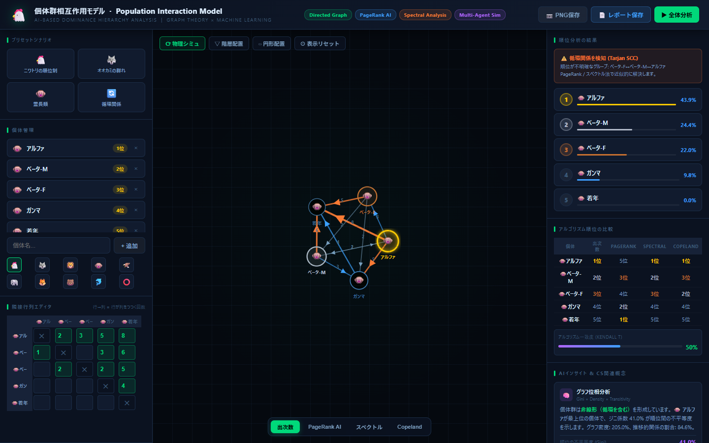
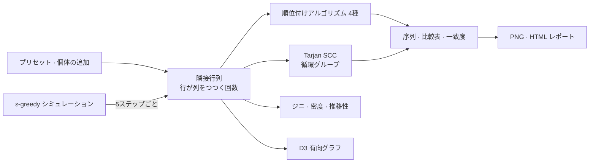

# PopInT.

> 動物の群れの順位制（pecking order）を有向グラフに置き換え、4つの順位付けアルゴリズムを1画面で比べられる教育用の分析ツール

---

## 1. プロジェクト概要 (Overview)

| 項目 | 内容 |
|---|---|
| プロジェクト名 | PopInT.（Population Interaction Model · 個体群相互作用モデル） |
| 一行要約 | 「誰が誰を何回つついたか」を隣接行列で入力すると、グラフを描き、出次数・PageRank・スペクトル・Copelandの4方式で序列を付けて並べて見せる |
| 期間 | 2026.06（ファイル基準。開始時期は要確認） |
| 参加人数 | （要確認） |
| 本人の役割 | 企画、アルゴリズムの実装、可視化、UI |
| 貢献度 | （要確認） |
| 実施の経緯 | 生命科学の順位制の単元とグラフ理論をつなぐ教育用ツール（授業・課題としての経緯は要確認） |

ニワトリは群れの中でつつく順番が決まっている。生物の教科書では、これを「AがBをつつき、BがCをつつく」という連鎖で説明する。しかし実際の観察記録はそれほどきれいではない。互いにつつき合うこともあれば、A→B→C→Aのようなじゃんけん型の構造ができることもある。このツールは、観察回数を行列に入れるとすぐにグラフと序列を表示し、序列の付け方によって結果がどう変わるかを比べられるようにする。

リポジトリはない。このレポートは、ローカルに残っている単一ファイル（`index.html`、1,181行）をもとに書いた。

## 2. 技術スタック (Tech Stack)

| 区分 | 技術 | 選定理由 |
|---|---|---|
| 構成 | 単一のHTMLファイル、Vanilla JavaScript | インストール不要で、ファイル1つで開ける。授業で配りやすい |
| グラフ | D3.js v7.8.5（force simulation · zoom · drag） | 有向エッジ、矢印、物理ベースの配置、拡大・移動を細かく制御できる |
| エクスポート | html2canvas 1.4.1、Blobダウンロード | グラフを2倍解像度のPNGで保存し、分析結果を1枚のHTMLレポートとしてダウンロードする |
| アルゴリズム | 自作（ライブラリなし） | 出次数、PageRank（反復120回）、べき乗法による固有ベクトル、Copeland、Tarjan SCC、Floyd–Warshall、Kahnのトポロジカルソート |

## 3. 主な機能と担当業務 (Key Features & Contributions)

ローカルでキャプチャ（霊長類プリセット）。左は個体と隣接行列のエディター、中央は有向グラフ、右は序列・循環の警告・アルゴリズム比較表。比較表のPageRankの列に、§5-③の問題がそのまま表れている

| 領域 | 機能 |
|---|---|
| プリセット | ニワトリの順位制 · オオカミの群れ · 霊長類 · 循環関係の4つのシナリオをワンクリックで読み込む |
| 個体・行列 | 名前（8文字）と10種類のアイコンで個体を追加・削除し、「行が列をつつく回数」をマスごとに入力する。入力から0.28秒後に分析全体を再実行する |
| グラフ | 物理シミュレーション · 階層配置（トポロジカルソートの後、最長経路で層を分ける） · 円形配置の3つのレイアウト。エッジの太さは回数に比例し、1位の個体にはグロー効果をかける。ドラッグ・拡大（0.08–5倍）・ツールチップ |
| 序列の分析 | 選んだアルゴリズムのスコアで順位を付け、棒グラフで表示する。循環があればTarjan SCCで検出し、「序列が不明確なグループ」として警告する |
| アルゴリズムの比較 | 4方式の順位を1つの表に並べ、アルゴリズム間の一致度を棒グラフで示す |
| インサイト | 順位の不平等度（ジニ係数）、グラフ密度、推移的な関係の割合から、群れの順位制のタイプ（強い線形 · 中程度の線形 · 弱い · 循環を含む）を判定する |
| シミュレーション | 2個体をランダムに出会わせ、過去の勝率どおりに勝者を決めるが、10%はランダムに決める（ε-greedy）。120回の出会いの中で序列が固まっていく過程をログで見せる |
| エクスポート | グラフのPNG、アルゴリズム比較表・隣接行列・概念の説明を収めたHTMLレポート |

### 順位付けアルゴリズム

| アルゴリズム | スコア | 何を見るか |
|---|---|---|
| 出次数 | 自分がつついた回数の合計 | 直接的な支配の量 |
| PageRank | エッジに沿ってスコアが流れるマルコフ連鎖の定常分布（減衰係数0.85） | 間接的な影響力 |
| スペクトル | 隣接行列の主固有ベクトル（べき乗法） | 強い個体に勝つことの価値 |
| Copeland | ペアごとにどちらが多くつついたかで勝ち1 · 引き分け0.5 | 1対1の対戦成績 |

### 主な業務

- 4種類の順位付けアルゴリズムと循環の検出（Tarjan SCC）、推移閉包（Floyd–Warshall）、トポロジカルソート（Kahn）の実装
- D3による有向グラフと3つのレイアウト、隣接行列エディター
- 4つのプリセットシナリオとε-greedyによる相互作用シミュレーション
- PNG・HTMLレポートのエクスポート

## 4. 成果と結果 (Results & Metrics)

### 定量的成果

4つのプリセットを、このレポートを書いている最中（2026.09）にNodeで再実行した結果である。各セルは、そのアルゴリズムが1位にした個体である。

| プリセット | 出次数 | PageRank | スペクトル | Copeland | 循環の検出 |
|---|---|---|---|---|---|
| ニワトリの順位制（完全線形） | アルファ | **イプシロン**（最下位の個体） | アルファ（残り4羽は0点） | アルファ | なし |
| オオカミの群れ | アルファ♂ | **オメガ**（最下位の個体） | アルファ♀ | アルファ♂ · アルファ♀ 同点 | アルファ♂ ↔ アルファ♀ |
| 霊長類 | アルファ | **若年個体**（最下位の個体） | アルファ | アルファ | アルファ · ベータ-M · ベータ-F |
| 循環関係 | C | B | B | A · C 同点 | A–B–C–D 全体 |

| 項目 | 結果 |
|---|---|
| コード | 単一ファイル1,181行、外部ライブラリ2つ（CDN） |
| ユーザー · 活用の結果 | （要確認） |

### 定性的成果

- **序列が「正解が1つの値」ではないことを画面で示す。** 循環関係のプリセットでは、1位がアルゴリズムによってC、B、A・C同点に分かれる。同じ観察記録でも、何を支配とみなすかで順位が変わる。
- **生物の概念とCSの概念を1つのツールにまとめた。** 順位制は有向グラフに、循環する序列は強連結成分に、序列の不平等はジニ係数に置き換えて説明する。

### 確認された限界

- **PageRankが序列を逆に付ける。** 線形の順位制のプリセット3つすべてで、最も多くつつかれた個体が1位になる（§5-③）。まだ直していない。
- **完全に線形な序列ではスペクトルのスコアが破綻する。** ニワトリのプリセットのように循環がまったくないと、隣接行列を掛けるほど0に近づくので、1位だけが100%で、残りはすべて0点の同点になる。
- **階層配置は、循環が1つでもあると層に分けられない。** トポロジカルソートが循環で止まってしまうので、オオカミのプリセットでは5頭がすべて同じ層に置かれる。
- **「グラフ密度」が100%を超える。** エッジの有無ではなく、つついた回数を合計して割っているので、霊長類のプリセットでは205.0%になる。
- **「Kendall τ」の一致度はτではない。** 一致するペアの割合（0–100%）である。τとして扱うなら、2 × 割合 − 1に変換する必要がある。
- インサイトパネルの概念のつながり（GNN、ナッシュ均衡など）は説明文であり、ツールが実際にその計算をしているわけではない。

## 5. トラブルシューティング (Troubleshooting)

### ① 循環があると、一列に並べること自体ができない

**問題** 教科書的な序列は、トポロジカルソート、つまり「つつく側が前」というルールで一列に並べれば済む。ところがA→B→C→Aのような循環が1つでもあると、トポロジカルソートが終わらない。オオカミや霊長類のプリセットのように、上位の個体どうしが互いにつつき合う場合も同じである。

**原因** トポロジカルソートは、循環のないグラフ（DAG）でしか定義されない。実際の観察記録では、つつき合いや循環は珍しくない。

**解決** 一列に並べる処理と循環の検出を切り離した。序列は、どんなグラフでも計算できるスコアベースのアルゴリズムで付け、循環はTarjanのアルゴリズムで強連結成分を見つけて、「序列が不明確なグループ」として別に警告する。

**結果** 循環関係のプリセットではA–B–C–D全体が、オオカミのプリセットでは2頭のアルファが1つのグループとして表示される。順位表はそのまま出しつつ、どの区間を信用してはいけないかも一緒に示せるようになった。

### ② 1つのアルゴリズムの結果だけを見ていると、間違っていても気づけない

**問題** 序列のスコアは式の立て方によって変わるのに、画面に1つのアルゴリズムの順位しかなければ、その順位がおかしくても気づく手段がない。

**原因** 順位には比べるべき正解がない。事実上、アルゴリズムどうしの合意だけが基準になる。

**解決** 4つのアルゴリズムの順位を個体ごとに1つの表に並べ、アルゴリズム2つずつの組で順位のペアが一致する割合の平均を棒グラフで示す比較パネルを作った。

**結果** この比較表のおかげで③の問題が見つかった。霊長類のプリセットでは、出次数・スペクトル・Copelandがアルファを1位にしているのに、PageRankだけが若年個体を1位にしていて、一致度が50%まで下がる。

### ③ PageRankが最も弱い個体を1位に選んだ（再検証で発見、未修正）

**問題** このレポートを書きながらプリセットを再実行したところ、PageRankが線形の順位制のプリセット3つすべてで最下位の個体を1位にしていた（ニワトリのイプシロン43.1%、オオカミのオメガ43.3%、霊長類の若年個体43.6%）。

**原因** 行列の向きは「行が列をつつく」なのに、PageRankのスコアがつついた個体からつつかれた個体へ流れるように実装されている。Webページのリンクのように「受け取る矢印が多いほど重要」という本来の前提をそのまま持ち込んだため、多くつつかれた個体がスコアを集めてしまう。

**解決** （未反映）スコアがつつかれた側からつついた側へ流れるよう、行列を転置して渡せば直せる。優劣関係では、エッジを「負けた側が勝った側を指す」と読まなければならない。

**結果** （要確認）修正後に、4つのアルゴリズムの一致度と順位を改めて確認する必要がある。

## 6. リンクと成果物 (Links & Deliverables)

| 区分 | リンク |
|---|---|
| GitHub リポジトリ | なし |
| 公開URL | （要確認） |
| 成果物 | 単一ファイルのWebツール`index.html`、エクスポート結果（グラフのPNG · 分析のHTMLレポート） |

---

+++

## カスタマージャーニーマップ (Journey Map)

ユーザーは、順位制の単元を学んでいる学生である。

| 段階 | ユーザーの行動 | ユーザーの考え | ツールの対応 |
|---|---|---|---|
| 開始 | ファイルを開く | 「何を入れればいいんだろう？」 | ニワトリの順位制のプリセットが最初から開いている |
| 探索 | プリセットを切り替えてみる | 「オオカミはアルファが2頭いるんだ？」 | グラフの形と循環の警告がすぐに切り替わる |
| 入力 | 観察した回数を行列に入れる | 「うちのクラスで見たデータでやってみよう」 | 入力が終わると0.28秒後にグラフと順位が再計算される |
| 比較 | アルゴリズムのボタンを押してみる | 「なんで順位が変わるの？」 | 比較表と一致度で違いを見せる |
| 提出 | レポートを保存する | 「課題に添付したい」 | PNGとHTMLレポートをダウンロードする |

## ジェスチャー設計 (Gesturing)

- ノードをドラッグすると物理シミュレーションが追従し、ホイールで0.08–5倍まで拡大できる。「ビューをリセット」は0.45秒のトランジションで元の位置に戻る。
- ノードにマウスを乗せると、その個体の序列スコアと出次数・入次数がツールチップに表示される。
- 行列のマスは、値が0より大きければ入力中からすぐに強調表示される。

## モーションデザイン (Motion Design)

- 物理シミュレーションのレイアウトは、エッジの長さ130、反発力−320で、個体が位置に落ち着いていく過程をそのまま見せる。
- 順位リストは`fadeUp`で浮かび上がり、1位の個体はグローフィルターで光る。
- シミュレーションは0.55秒ごとに1回の出会いを起こし、5回ごとに行列・グラフ・順位を更新して、序列が固まっていく流れを見せる。

## アダプティブデザイン (Adaptive Design)

- 3カラムのレイアウト（入力 · グラフ · 結果）は、1,280pxと1,060pxで両側のパネル幅を縮め、1,060px以下ではヘッダーのタグを隠す。
- ウィンドウサイズが変わると、グラフを新しいサイズで描き直す。
- 循環があるときだけ、循環の警告と「非推移的な関係」のインサイトカードが表示される。
