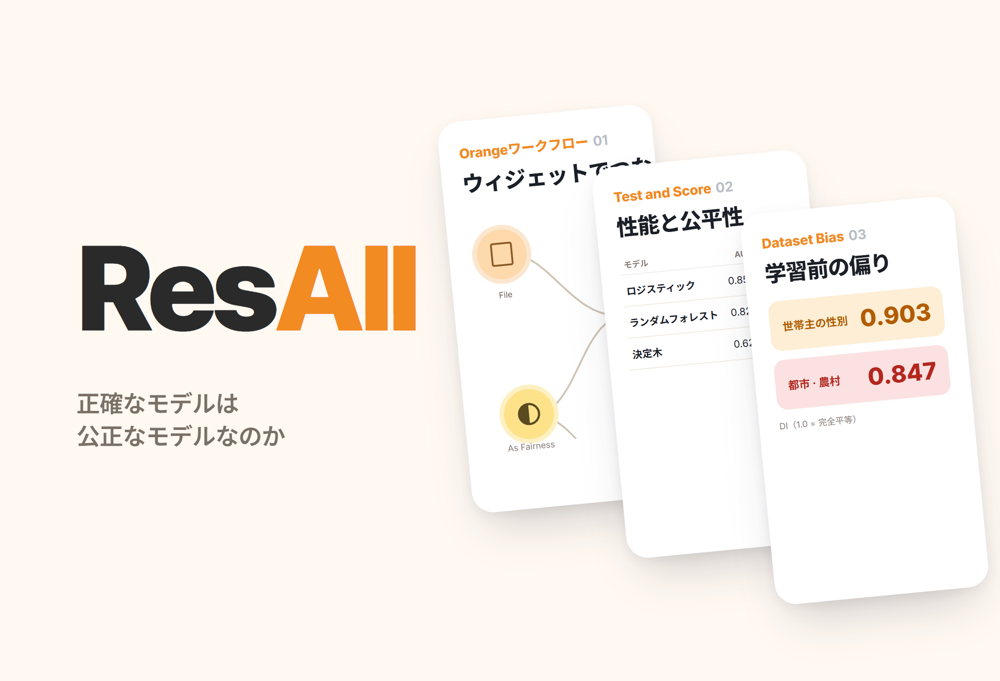
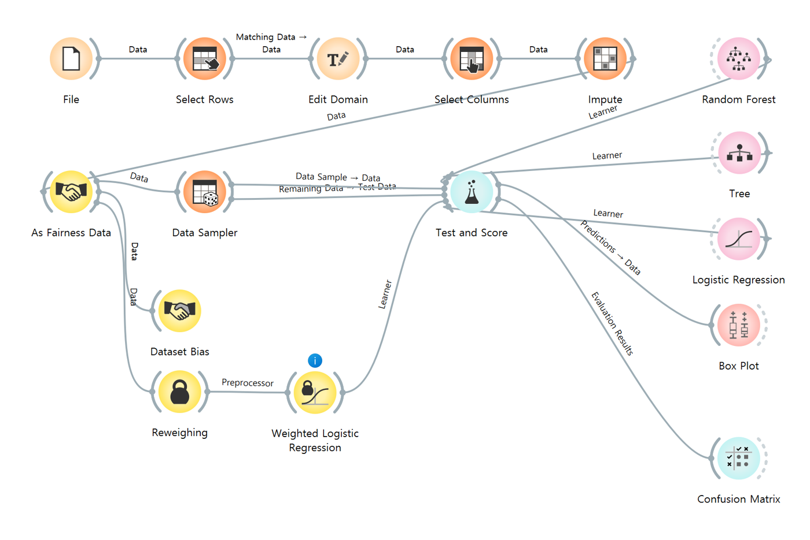
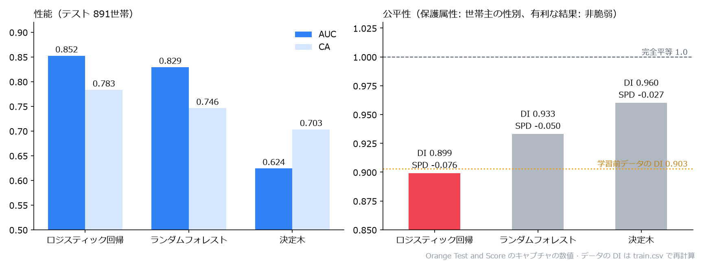

# ResAll.

> 「限られた福祉予算を誰に配るか」を、コスタリカの世帯貧困データの分類問題に置き換えた Orange による探究。3つのモデルの性能に加え、追加で導入した Fairness アドオンで、世帯主の性別・地域に対する公平性を監査した

---

## 1. プロジェクト概要 (Overview)

| 項目 | 内容 |
|---|---|
| プロジェクト名 | ResAll.（Resource Allocation、福祉資源の配分） |
| 一行要約 | 所得を使わず、住居・資産・教育・世帯構成だけで脆弱世帯を見分ける分類器を Orange で作った。性能1位のロジスティック回帰（AUC 0.852）が、性別の公平性では最も悪かった（DI 0.899） |
| 期間 | 2026.06（2年生の科目「人工知能基礎」、作業ファイル基準で 2026.06.08–06.09） |
| 参加人数 | 個人探究 |
| 本人の役割 | 問題設定、データ整備の設計、Orange ワークフローの構築、Fairness アドオンの導入・監査、結果の解釈 |
| 貢献度 | 100% |
| 実施の背景 | 「機械学習モデルの実装」課題（評価方式は要確認） |

福祉予算は限られているのに、最も貧しい世帯ほど所得を公式に証明するのが難しい。米州開発銀行（IADB）は、この問題を代理所得調査（Proxy Means Test、PMT）で解いている。所得の代わりに、壁・屋根の材質、家電の保有、教育水準のように目で確かめられる特性から貧困を推定する方式である。この探究では PMT を機械学習の分類問題に置き換え、そのモデルが女性世帯主や農村の世帯を体系的に見落としていないかまで確認した。

| 仮説 | 内容 |
|---|---|
| 1. 識別可能性 | 所得の変数がなくても、住居・資産・教育・世帯構成だけで脆弱／非脆弱を分けられる |
| 2. 指標の選択 | 福祉では、支援が必要なのに見逃した世帯（偽陰性）のコストのほうが大きいので、正解率よりも Recall・F1 が重要である |
| 3. 偏りの出発点 | モデルを作る前から、データそのものに集団間の偏りがある |
| 4. trade-off | 偏りを緩和すると正解率を一部手放す代わりに公平性が得られ、複数の公平性基準を同時に満たすことはできない |

## 2. 技術スタック (Tech Stack)

| 区分 | 技術 | 選定理由 |
|---|---|---|
| ツール | Orange Data Mining（ウィジェットベースのワークフロー） | コードを書かずに前処理 → 学習 → 評価をつなぎ、各段階のデータをすぐに確認できる |
| 公平性 | Orange **Fairness アドオン**（標準インストールには含まれない）：As Fairness Data, Dataset Bias, Reweighing, Weighted Logistic Regression | 公平性指標（DI・SPD・EOD・AOD）を性能指標と同じ表で見られる |
| データ | Kaggle「Costa Rican Household Poverty Level Prediction」（IADB）`train.csv`、9,557人 · 142変数 | 実際の福祉対象の選定に使われる PMT を改善するために公開されたデータ |
| モデル | 決定木、ランダムフォレスト、ロジスティック回帰 | ルールベース・アンサンブル・線形確率モデルと性格がそれぞれ異なり、比較に向いている |

## 3. 主な機能と担当業務 (Key Features & Contributions)

作業当時にキャプチャした Orange のワークフロー。上の列が前処理、中央が学習・評価、左下が Fairness アドオン（Dataset Bias、Reweighing → Weighted Logistic Regression）

### 前処理

| 段階 | ウィジェット | 処理 |
|:---:|---|---|
| ① | Select Rows | 世帯主（`parentesco1 = 1`）の行だけを残し、1行 = 1世帯にする（9,557人 → 2,973世帯） |
| ② | Edit Domain | `Target` の4段階（極貧・中程度の貧困・脆弱・非脆弱）を脆弱（1–3）／非脆弱（4）にまとめ、`male` に男性／女性のラベルを付ける |
| ③ | Select Columns | 解釈できる約20個の変数だけを選ぶ。文字と数字が混在する `edjefe`・`edjefa`・`dependency` と、識別子の `Id`・`idhogar` は meta に回してリークを防ぐ |
| ④ | Impute | 欠損値を平均値・最頻値で埋める |
| ⑤ | As Fairness Data | 保護属性 = 世帯主の性別、特権グループ = 男性、有利な結果 = 非脆弱 |
| ⑥ | Data Sampler | 70% の層化抽出（固定シード） → 学習 2,082 / テスト 891 |

| 変数の系統 | 変数 |
|---|---|
| 住居 | `epared1~3`（壁）、`etecho1~3`（屋根）、`eviv1~3`（床）、`abastaguadentro`（水道）、`noelec`（電気なし）、`v14a`（トイレ） |
| 過密・規模 | `rooms`, `overcrowding`, `hacdor`, `tamhog`, `hogar_nin`, `hogar_mayor` |
| 資産 | `refrig`, `computer`, `television`, `qmobilephone`, `v18q` |
| 教育・人口 | `meaneduc`, `escolari`, `age`, `male` |
| 地域 | `area1`（都市）・`area2`（農村）、`lugar1~6`（圏域） |

### モデル

| モデル | 特徴 |
|---|---|
| 決定木 | 情報利得が最大になる質問を繰り返して枝分かれさせる。どの要因が貧困を分けるのかを人が読み取れる |
| ランダムフォレスト | 異なるデータ・変数の部分集合で作った複数の木による多数決。安定しているが、解釈は難しくなる |
| ロジスティック回帰 | 重み付き和をシグモイドに通して貧困の確率を出す。係数から各要因の向きまで解釈できる |

### 公平性監査

- **Dataset Bias** で、モデルを作る**前**のデータそのものの偏りを測った。
- **Test and Score** で、性能指標と公平性指標（DI・SPD・EOD・AOD）を1つの表にまとめて比較した。
- **Weighted Logistic Regression** に **Reweighing** を前処理器としてつなぎ、偏りを緩和したモデルを作った。
- 地域（都市・農村）は、保護属性を変えた別の Orange ファイルで分析した。

### 主な業務

- 福祉配分の問題を PMT ベースの二値分類として定義し、ターゲットの二値化と世帯単位への正規化を設計
- リーク変数の除外、欠損処理、層化分割を含む前処理ワークフローの構築
- Fairness アドオンの導入、保護属性・特権グループ・有利な結果の指定、性能と公平性の同時比較
- 偏り緩和モデルの作成と結果の解釈

## 4. 成果と結果 (Results & Metrics)

### 定量的成果

Test and Score のキャプチャの数値をもとに描き直したグラフ。点線は、モデルを使わずにデータから測った性別の DI（0.903）

**テスト891世帯、クラス平均**

| モデル | AUC | CA | F1 | Prec | Recall | MCC | SPD | EOD | AOD | DI |
|---|:---:|:---:|:---:|:---:|:---:|:---:|:---:|:---:|:---:|:---:|
| **ロジスティック回帰** | **0.852** | **0.783** | **0.776** | **0.778** | **0.783** | **0.501** | −0.076 | −0.046 | −0.066 | 0.899 |
| ランダムフォレスト | 0.829 | 0.746 | 0.738 | 0.738 | 0.746 | 0.413 | −0.050 | −0.017 | −0.045 | 0.933 |
| 決定木 | 0.624 | 0.703 | 0.702 | 0.702 | 0.703 | 0.338 | **−0.027** | **−0.024** | **−0.011** | **0.960** |

**学習前のデータの偏り（報告書 v2.0 の作成中に `train.csv` から再計算、世帯主2,973世帯）**

| 保護属性 | 有利な結果（非脆弱）の割合 | DI | SPD |
|---|---|:---:|:---:|
| 世帯主の性別 | 男性 68.3% · 女性 61.7% | 0.903 | −0.066 |
| 地域 | 都市 68.7% · 農村 58.2% | 0.847 | −0.105 |

| 項目 | 結果 |
|---|---|
| 仮説1 | 支持。所得の変数なしで CA 0.783、AUC 0.852 |
| 仮説3 | 支持。モデルがなくても、データの DI は性別 0.903、地域 0.847 |
| 仮説2 · 4 | 部分的に確認（後述の限界を参照） |
| 実技評価の点数 | （要確認） |

### 定性的成果

- **正確なモデルが、そのまま公平なモデルではなかった。** 公平性の4指標すべてで性能1位のロジスティック回帰が最も悪く、最も良かったのは性能が最も低い決定木だった。性能表だけを見てモデルを選んでいたら、差別まで一緒にデプロイしていたはずである。
- **モデルはデータの偏りをほぼそのまま引き継いだ。** ロジスティック回帰の DI（0.899）は、学習前のデータの DI（0.903）とほぼ同じである。偏りはアルゴリズムから新たに生じたのではなく、社会とデータに端を発していた。
- 課題の範囲になかった監査の段階まで組み込んだ。標準の Orange にはない Fairness アドオンを自分で探して導入し、データ整備 → モデル比較 → 公平性監査 → 偏りの緩和までを1つのワークフローでつないだ。

### 確認された限界

- **表の Recall は脆弱世帯の再現率ではない。** Test and Score が「クラス平均」に設定されていたため、表の Recall は2クラスの再現率の加重平均であり、正解率（CA）と同じ値になる。仮説2でいう「見逃した脆弱世帯」を見るには、対象クラスを「脆弱」に変えるか、Confusion Matrix を見る必要がある。（要確認）
- **偏り緩和モデルの結果が残っていない。** Weighted Logistic Regression は Test and Score につながっているが、結果のキャプチャには3つのモデルしかなく、ウィジェットには情報表示が出ている。緩和前後の比較数値は（要確認）
- **ランダムフォレストの木の数が記録によって異なる。** 以前の報告書には10本と書いたが、保存されたワークフローでは75本である。性能をキャプチャした時点の値は（要確認）
- コスタリカのデータで学習したモデルなので、ほかの社会に適用するには地域ごとに学習し直し、公平性を継続的に点検する必要がある。
- 予測は支援対象の発掘にのみ使うべきである。烙印や制裁に使ってはならず、最終判断には人による確認が必要である。

## 5. トラブルシューティング (Troubleshooting)

### ① 個人単位のデータをそのまま使うと、同じ世帯が何度も入る

**問題** 元データは1行が1人（9,557人）だが、貧困等級や住居・資産の特性は世帯単位で同じ値になっている。このまま学習させると、世帯員の多い家が何度も数えられ、同じ世帯が学習とテストの両方に入りうる。

**原因** 福祉支援の単位は世帯なのに、データの単位は個人だった。

**解決** Select Rows で世帯主（`parentesco1 = 1`）の行だけを残し、1行 = 1世帯にそろえた。識別子の `Id`・`idhogar` と、文字と数字が混在する変数は meta に回し、学習に入らないようにした。

**結果** 2,973世帯に整理され、層化抽出によってクラス比率を保ったまま学習 2,082 / テスト 891 に分けた。

### ② 正解率だけを見ると、最も「良い」モデルが最も不公平だった

**問題** 性能指標だけを見れば、ロジスティック回帰を選んで終わりだった。しかし、このモデルが女性世帯主をどう扱うかは性能表には出てこない。

**原因** 標準の Orange には公平性指標がない。正解率や AUC は全体の平均なので、集団間の差を覆い隠してしまう。

**解決** Fairness アドオンを導入し、As Fairness Data で保護属性（世帯主の性別）、特権グループ（男性）、有利な結果（非脆弱）を指定した。すると Test and Score の1つの表に、性能と DI・SPD・EOD・AOD が並んで表示された。Dataset Bias で、モデル以前のデータの偏りも別に測った。

**結果** 性能の順位（ロジスティック > ランダムフォレスト > 決定木）と公平性の順位（決定木 > ランダムフォレスト > ロジスティック）が正反対であることを、1つの表で示した。

### ③ 表の Recall が正解率とまったく同じだった（再検証）

**問題** 報告書をまとめ直していて気づいたが、3つのモデルとも Recall が CA と小数第3位まで一致していた（0.783、0.746、0.703）。仮説2は「脆弱世帯をどれだけ見逃すか」を核心に据えていたのに、その値が別に見えていなかった。

**原因** Test and Score の対象クラスが「None, show average over classes」になっていた。クラス比率で加重平均した再現率は、数学的に正解率と一致する。

**解決** （報告書 v2.0 で記録）元資料のキャプチャで原因を確認し、表の Recall を「クラス平均」と明記した。脆弱世帯の再現率は、対象クラスを「脆弱」に変えて出し直す必要がある。

**結果** 仮説2（指標選択の原則）は今も有効だが、今回の数値では「脆弱世帯を何%見つけたか」は言えない。このことを限界として記した。

## 6. リンクと成果物 (Links & Deliverables)

| 区分 | リンク |
|---|---|
| GitHub リポジトリ | なし |
| 成果物 | Orange ワークフロー（`기계학습 모델 구현.ows`、「機械学習モデルの実装」の意）、ウィジェット・データテーブル・Data Sampler・Test and Score のキャプチャ、ワークフローのガイド文書 |
| データ | Kaggle「Costa Rican Household Poverty Level Prediction」（IADB） |

<b>指標</b>

| 指標 | 意味 |
|---|---|
| CA | 全体の正解率。クラスの不均衡に弱い |
| Precision / Recall | 予測したもののうち当たった割合 / 実際に該当するもののうち見つけ出せた割合 |
| F1 | 適合率と再現率の調和平均 |
| AUC | ROC 曲線の下の面積。しきい値に左右されない判別力 |
| MCC | マシューズ相関係数。不均衡なデータでも信頼できる総合指標 |
| DI | 2集団の有利な結果の割合の比。1.0 で完全に同等 |
| SPD | 2集団の有利な結果の割合の差。0 で完全に同等 |
| EOD | 2集団の再現率（TPR）の差 |
| AOD | 2集団の TPR・FPR の差の平均 |

<b>用語</b>

- **代理所得調査（PMT）**：所得の証明が難しいとき、住居・資産など観察可能な特性から貧困を推定する、福祉対象の選定方式
- **層化抽出**：クラスや集団の比率を保ったまま標本を分ける方法
- **データリーク**：予測時点では知りえない変数や、ターゲットの情報を含む変数が学習に混ざり、性能が水増しされる現象
- **偽陰性 / 偽陽性**：実際は脆弱なのに非脆弱と判定（支援から除外）/ 実際は非脆弱なのに脆弱と判定（過剰な支援）
- **保護属性 / 特権グループ**：差別が生じてはならない基準の変数 / 有利な結果をより多く受ける集団（指標計算の基準）
- **Reweighing**：学習前にサンプルの重みを付け直し、集団間の不均衡を補正する前処理手法

---

+++

## カスタマージャーニーマップ (Journey Map)

ここでいう「ユーザー」は、モデルを使う福祉担当者である。

| 段階 | 行動 | 考え | モデル・監査が提供するもの |
|---|---|---|---|
| 調査 | 世帯を訪問し、住居・資産を記録する | 「所得の書類がない家は、どう判断すればいい？」 | 観察可能な約20個の特性だけで判定 |
| 選別 | モデルのスコアで支援候補を選ぶ | 「このリスト、信じていいのかな？」 | AUC 0.852 の判別力 |
| 点検 | 候補者名簿の構成を見る | 「女性世帯主や農村が抜け落ちていないか？」 | 性別の DI 0.899、データそのものの地域 DI 0.847 |
| 決定 | 最終的な支援対象を確定する | 「モデルが間違っていたら、誰が責任を取るの？」 | 予測は発掘のためのもので、最終判断は人が下すという原則 |

## DREAD 脆弱性管理 (DREAD Risk Assessment)

| 脅威 | D | R | E | A | D | スコア | 対応 |
|---|---|---|---|---|---|---|---|
| 農村・女性世帯主の脆弱世帯を体系的に取りこぼす | 3 | 3 | 2 | 3 | 2 | 2.6 | 集団別の再現率の点検、Reweighing などによる偏りの緩和 |
| クラス平均の指標だけを見て、取りこぼしに気づかない | 3 | 3 | 3 | 2 | 1 | 2.4 | 対象クラスを「脆弱」にした Recall と Confusion Matrix で監査 |
| 予測を烙印・制裁に転用する | 3 | 2 | 2 | 3 | 1 | 2.2 | 用途を支援対象の発掘に限定し、最終確認は人が行う |

D·R·E·A·D = 損害・再現性・悪用の難易度・影響範囲・発見可能性（1〜3）。スコアは平均。
