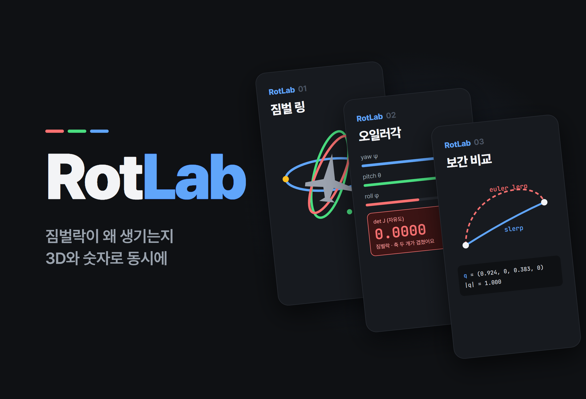
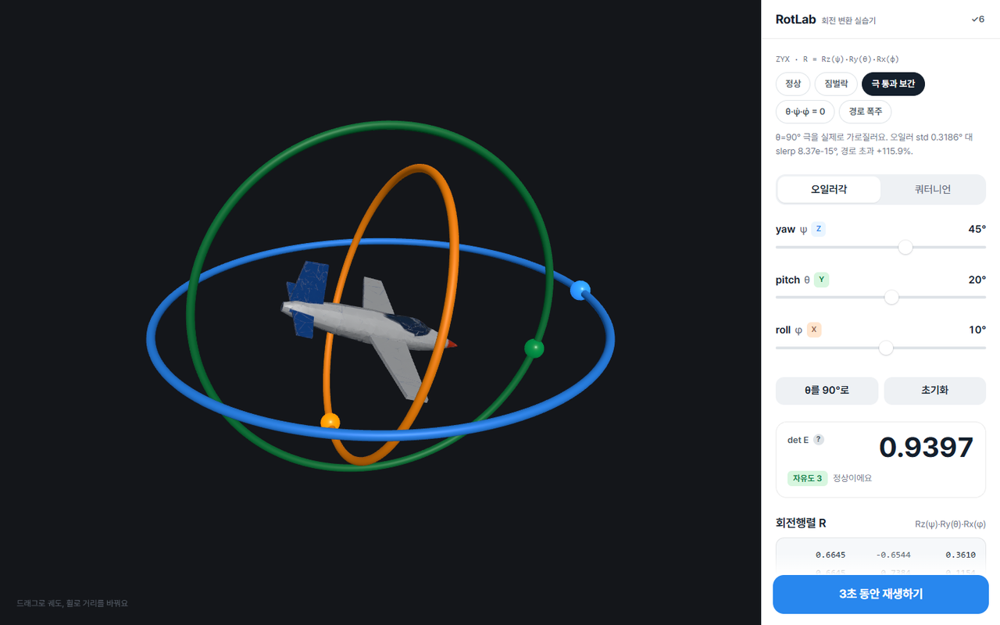
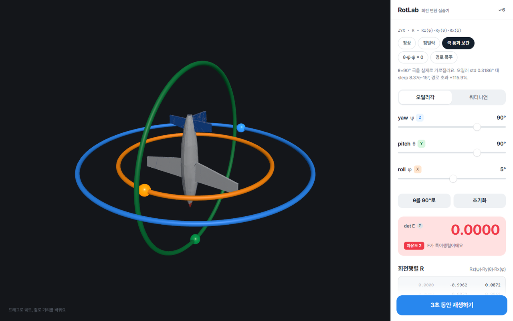
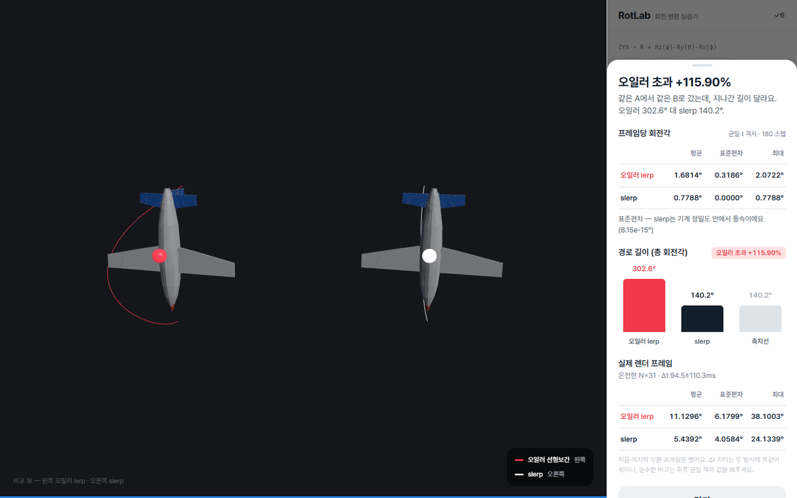
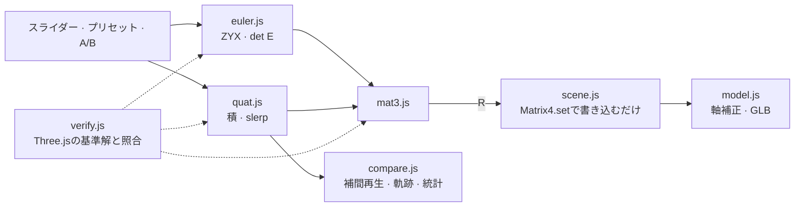

# RotLab

<p align="center"></p>

> オイラー角・回転行列・クォータニオンをライブラリなしで自作し、ジンバルロックと補間方式の違いを3D画面と数値の両方で同時に見せる回転変換の実験室

---

## 1. プロジェクト概要 (Overview)

| 項目 | 内容 |
|---|---|
| プロジェクト名 | RotLab（回転変換の実習ツール） |
| 一行要約 | 飛行機モデルを3つのジンバルリングに載せて回し、θが±90°に近づくと自由度が失われる様子と、オイラー角の線形補間がslerpよりどれだけ遠回りするかを測定値で示す |
| 期間 | 2026.09.09（v1.0.0 → v1.1.3、1日） |
| 参加人数 | 個人プロジェクト |
| 本人の役割 | 回転の数学の実装、検証設計、3Dシーン・UIの実装、測定方法論 |
| 貢献度 | 100%（リポジトリのコミット6件すべて本人） |

回転を学ぶと、オイラー角、回転行列、クォータニオンに順に出会う。オイラー角は直感的だがジンバルロックがあること、クォータニオンは補間が滑らかであることまでは教科書に書いてある。しかし、ジンバルロックで正確に何が失われるのか、オイラー補間が「滑らかでない」のは速度の問題なのか経路の問題なのかは、実際に測ってみないとわからない。このツールはその2つの問いに数値で答える。

Three.jsはレンダリング（シーン・カメラ・ライト・メッシュ）にだけ使った。**回転の数学にはライブラリを1行も使っていない。** `THREE.Euler`・`THREE.Quaternion`・`Matrix4`の回転生成メソッドは、検証モジュールの中で自作の実装と照合するための基準解としてのみ使う。

## 2. 技術スタック (Tech Stack)

| 区分 | 技術 | 選定理由 |
|---|---|---|
| 回転の数学 | Vanilla JavaScriptの純粋関数（`mat3` · `euler` · `quat`） | 実装そのものが学習目標である。レンダラーと混ざらないようにモジュールを分けた |
| レンダリング | Three.js r185（esbuildで単一ファイルにバンドルし、`vendor/`に固定） | シーン・ライト・メッシュだけを任せる。`npm install`なしでクローン直後から動き、CDNも使わない |
| 検証 | 自作の検証器 + Three.js内蔵の回転を基準解として照合（ブラウザ・Nodeランナー） | 独立に実装された答えがすでにあるので、成分単位で照合できる |
| 3Dアセット | GLB飛行機モデル（Meshy AIで生成 → リメッシュ） | 元の307万ポリゴンを26,762ポリゴンまで減らし、テクスチャも縮小した |
| フォント · デプロイ | Pretendard（リポジトリに同梱） · GitHub Pages | 静的ファイルしかない |

## 3. 主な機能と担当業務 (Key Features & Contributions)

<p align="center"></p>
<p align="center">
  
  </p>
<p align="center"><sub>ローカルでキャプチャ。上：正常姿勢（det E 0.9397、自由度3）。左下：θ=90°のジンバルロック（青のZリングとオレンジのXリングが同一平面に重なり、det E 0.0000、自由度2）。右下：極通過補間の結果（オイラー経路の超過 +115.90%）</sub></p>

### 実装した機能

- **姿勢の調整**：yaw・pitch・rollのスライダー（オイラーモード）またはクォータニオンモードで機体を回す。3つのジンバルリング（Z 青 · Y 緑 · X オレンジ）がそれぞれの軸を示す。
- **計器盤**：回転行列R、角速度写像行列の行列式`det E = cos θ`、残りの自由度をリアルタイムで表示する。`|det E| < 0.05`になると警告色に変わる。
- **ジンバルロック実証ボタン**：θの符号から「同じ回転になるペア」を自動で選び、一致・対照群・消失方向の3つを数値で出す。
- **補間の比較**：A・Bの姿勢を指定し、3秒間オイラー線形補間（赤）とslerp（白）を並べて再生する。機首先端の軌跡を描き、フレームごとの回転角の平均・標準偏差・最大値と総回転角、測地線に対する超過率を結果シートに表示する。
- **プリセット5種**：正常 · ジンバルロック · 極通過補間 · θ̇·ψ̇·φ̇=0 · 経路の暴走。チップ1つで姿勢をセットするか、そのまま再生する。
- **検証レポート**：パネルの`✓6`ボタンを押すと、ブラウザ上でその場で実行した照合結果が開く。

### 座標規約と主要な数式

ワールドはZ-up、機体は+xが機首 · +zが上 · +yが左翼で、オイラー角の順序はZYX（yaw ψ → pitch θ → roll φ）である。

```
R = Rz(ψ) · Ry(θ) · Rx(φ)
E = [ Rz(ψ)Ry(θ)·e₁ ,  Rz(ψ)·e₂ ,  e₃ ]      ω = E · [φ̇, θ̇, ψ̇]ᵀ,     det E = cos θ
slerp(q₀,q₁,t) = ( sin((1−t)Ω)·q₀ + sin(tΩ)·q₁ ) / sin Ω,   Ω = arccos(q₀·q₁)
```

`matrixToEuler`では、θが±90°付近で条件数が悪化する`asin`の代わりに`atan2`を使う。行列 → クォータニオン変換はShepperd法で、4成分のうち絶対値が最大のものから取り出す。wから取り出すと、180°付近の回転で精度が崩れるためである。

### 主な業務

- 3×3行列・ZYXオイラー角・クォータニオン（ハミルトン積、軸-角、回転の適用、slerp）の自作実装
- Three.js内蔵の回転との照合検証6項目の設計、ブラウザ・Nodeランナー
- ジンバルロックの代数的分析と実証、補間比較の測定方法論
- ジンバルリング・軌跡・計器盤・結果シートのUI、GLBモデルの軸補正とフォールバック

## 4. 成果と結果 (Results & Metrics)

### 定量的成果

**Three.js内蔵との照合**（Nodeランナー、2026.09に再実行、6項目すべて合格）

| # | 項目 | 照合対象 | サンプル数 | 最大誤差 | 基準 |
|---|---|---|---|---|---|
| 1 | `eulerToMatrix` (ZYX) | `Matrix4.makeRotationFromEuler` | 200 | 2.220e-16 | 1e-12 |
| 2 | `quat.multiply` | `Quaternion.multiply` | 200 | 2.220e-16 | 1e-12 |
| 3 | `toMatrix`/`fromMatrix` 往復 | 自己無矛盾性 | 200 | 1.110e-15 | 1e-12 |
| 4 | `quat.rotateVector` | `Vector3.applyQuaternion` | 200 | 8.882e-16 | 1e-12 |
| 5 | `quat.slerp` | `Quaternion.slerp` | 1100 | 3.331e-16 | 1e-9 |
| 6 | `gimbalMeasure` = det E | `cos θ`（解析解） | 200 | 2.220e-16 | 1e-14 |

5番のサンプルには対蹠点ペア（`dot < 0`）が47/100含まれている。6番ではθ=±90°で`|det E| = 6.12e-17`になることもあわせて確認する。乱数シード400個をすべて試しても失敗は0件で、全項目を通じた最悪誤差は2.442e-15である。

**オイラー補間とslerpの比較**（一様なt格子、180ステップ）

| 事例 | オイラーの標準偏差 | slerpの標準偏差 | オイラーの総回転角 | slerpの総回転角 | 超過 |
|---|---|---|---|---|---|
| 極通過 (90, −45, 5) → (85, 95, 10) | 0.3186° | 8.37e-15° | 302.647° | 140.177° | **+115.9%** |
| θ̇·ψ̇·φ̇ = 0 (−70, 80, 0) → (100, −80, 0) | 1.24e-14° | — | 233.451° | 178.266° | **+31.0%** |
| 経路の暴走 (135, 85, 15) → (145, 95, 5) | 1.62e-14° | 5.70e-15° | 339.676° | 22.355° | **+1419.5%（15.19倍）** |

| 項目 | 結果 |
|---|---|
| 規模 | 回転の数学・検証・シーンのJSで約2,700行 |
| 3Dモデル | 307万 → 26,762ポリゴン |
| 実際の授業・ユーザーでの活用 | （要確認） |

### 定性的成果

- **ジンバルロックを3つの方法で示した。** 数値（det Eがθ=0°で1、60°で0.5、90°で0）、代数（θ=+90°ではRのすべての成分が`sin(φ−ψ)`、`cos(φ−ψ)`だけで表され、2つの角が1つにまとまってしまう）、実証（θ=+90°でyaw +30°とroll −30°の差が1.110e-16になり、φとψを一緒に動かすと5°〜180°のどこでも姿勢が変わらない）である。
- **オイラー補間の失敗モードが2つあることを明らかにした。** 角速度の大きさを展開すると`|ω|² = ψ̇² + θ̇² + φ̇² − 2ψ̇φ̇·sin θ(t)`となるので、3つの角速度のうち1つでも0ならオイラー補間も完全な等速になる。それでも経路は測地線の15倍まで伸びる。速度の揺らぎ（標準偏差）だけを見ていたら、最も劇的な失敗を見逃していたはずだ。
- **補正と回転の数学を切り離した。** GLBモデルのローカル軸をアプリの規約に合わせて回す定数（`MODEL_AXIS_FIX`、det = +1）はモデルモジュールの1か所にしかなく、回転の数学モジュールはこのファイルの存在を知らない。三脚モデルからGLBに差し替えた後も、ジンバルロックの実測値（`θ=+90°: 1.110e-16 / 0.9962`）はまったく変わらなかった。

### 確認された限界

- **pitchの符号が航空の慣例と逆である。** 右手座標系でxを前、zを上にするとyは左に決まり、`Ry(θ)·(1,0,0) = (cos θ, 0, −sin θ)`なので+pitchで機首が下がる。実装ミスではなく、規約から必然的に出てくる結果である。スライダーの符号だけを反転すると、すでに測った数値の意味がすべて変わってしまうので、規約はそのままにして文書化した。
- **θ=±90°ではオイラー分解が一意に定まらない。** `|cos θ| < 1e-6`なら`degenerate: true`を立て、φ=0に固定する。
- **差がちょうど±180°のときは補間の方向が定まらない。** 最短方向が2つあるため、浮動小数点の符号で決まってしまう。A(20, 85, −10) → B(20, 95, −10)は符号の組み合わせ次第でオイラー経路が35.97倍にも1.57倍にもなる。そのため、すべてのプリセットを±180°から5°以上離した。
- **モードを切り替えると姿勢が最大約0.9°ずれる。** 分解した値をスライダーの刻みに丸めるためである。補間比較はクォータニオンで別に保存しているので影響を受けない。
- **READMEのGIF3つがリポジトリにない。** `hero.gif`などを参照しているのにファイルがコミットされておらず、READMEで画像がリンク切れになっている。

## 5. トラブルシューティング (Troubleshooting)

### ① slerpがときどき遠い側の弧を回った

**問題** クォータニオンのslerpを仕様書の式どおりに実装すると、一部のA・Bペアで回転が180°を超える遠回りをする。符号処理を外した状態でThree.jsの基準解と照合すると、対蹠点ペアで最大誤差が1.95まで開いた（基準は1e-9）。

**原因** クォータニオンの二重被覆である。qと−qは同じ回転を表すが、4次元球面上では正反対の点になる。`dot(q₀,q₁) < 0`ならq₁は反対側の半球にあるので、`Ω = arccos(dot)`が90°を超え、補間は遠い側の弧をたどる。

**解決** `dot < 0`ならq₁の符号を反転して短い側を選ぶようにした。2つのクォータニオンがほぼ等しく`dot > 0.9995`（Ω ≈ 1.81°）となる場合はsin Ωが0に近づいて除算が破綻するので、線形補間してから正規化するnlerpで代用する。この区間でのnlerpと真のslerpの差は最大6e-5°である。さらに、検証サンプルに対蹠点ペアが1つもなければ失敗扱いにして、このケースを検査しないまま合格してしまう事態を防いだ。

**結果** slerp照合1100サンプルの最大誤差は3.331e-16になった。対蹠点ペア47個を含んだうえでの結果である。

### ② 仕様書に書いたジンバルロックの検証基準が間違っていた

**問題** 最初に立てた基準は「θ=90°でyaw +30°とroll +30°が同じ回転になる」だった。ところが実測すると2つの行列の差は0.9962で、まったく同じではなかった。

**原因** 符号を考慮していない記述だった。θ=+90°でRを展開すると、すべての成分が`(φ − ψ)`だけに依存する。同じ回転になるにはこの差が等しくなければならないので、yaw +30°と対になるのはroll **−30°**である。θ=−90°では`(φ + ψ)`に依存するので、対の符号がさらに反転する。

**解決** 展開式をもとに基準を正し、ジンバルロック実証ボタンがθの符号を見て対を自動で選ぶようにした。結果には一致ペア・対照群・消失方向の3つをすべて出す。

**結果** θ=+90°では、yaw +30°に対してroll −30°は1.110e-16（同じ回転）、roll +30°は0.9962（別の回転）となった。θ=−90°ではちょうど逆になる。仕様書をコードに合わせたのではなく、数学で仕様書を直したわけである。

### ③ 標準偏差だけでは最大の失敗を見逃す

**問題** オイラー補間の悪さを「フレームごとの回転角の標準偏差」で示そうとした。ところが経路の暴走の事例(135, 85, 15) → (145, 95, 5)では、オイラーとslerpの標準偏差がどちらも1e-14台で、区別がつかなかった。

**原因** 角速度の大きさを展開すると、時間とともに変化する項は`−2ψ̇φ̇·sin θ(t)`の1つしかない。この事例ではθが両端とも85°に分解されてθ̇ = 0になるので、オイラー補間も完全な等速になる。その代わり経路が大きく曲がり、slerpが22.4°回る間にオイラーは339.7°も回る。

**解決** 指標に総回転角と測地線に対する超過率を加えた。測定方法も見直した。描画時のΔtのジッターは両方式に同じように混ざって差を覆い隠すので、統計は一様なt格子で取った。再生の最初と最後のフレームは構造上どうしても部分フレームになるので、統計から除いた。除く前のslerpの標準偏差0.0493°は180個中たった1つの外れ値によるもので、除くと1.06e-14°になった。実際の描画フレームの統計は、その旨を明記したうえで別に載せている。

**結果** 結果シートは「速度の揺らぎ」と「経路の暴走」を分けて表示するようになった。経路の暴走は+1419.5%、つまり15.19倍としてはっきり現れる。

### ④ 小さな角度で回転角の公式が破綻した

**問題** フレームごとの回転角を回転行列のトレース（`α = arccos((tr − 1)/2)`）から求めると、AとBがほぼ同じ再生で値がおかしくなる。

**原因** `arccos`の導関数は入力が1に近づくほど発散する。トレースの公式は`arccos`に`1 − α²/4`を入れる形になるので、αが小さいほど誤差が大きくなる。真値を軸-角で正確に作ってから測ってみると、0.0001°で相対誤差1.7e-4、0.000001°では1.0（0を返す）だった。

**解決** 2つの姿勢の相対クォータニオンで測ることにした。`q_rel = q_t ⊗ conj(q_{t−1})`、`α = 2·atan2(‖(x,y,z)‖, |w|)`。`|w|`を使うので、二重被覆も自然に処理される。

**結果** A≈B（0.005°）の再生で、最大相対誤差はトレースの3.10e-3に対してクォータニオンは1.01e-9と、大きく差がついた。大きな角度では2つの公式が機械精度で一致するので、公式を切り替えても既存の数値は変わらなかった。

## 6. リンクと成果物 (Links & Deliverables)

| 区分 | リンク |
|---|---|
| GitHub リポジトリ | [stx4R/RotLab](https://github.com/stx4R/RotLab)（非公開） |
| 公開URL | https://stx4r.github.io/RotLab/ |
| 検証 | `npm install && npm run verify`（Node） · `tests/run.html`（ブラウザのコンソール） · アプリの`✓6`ボタン |

### 構成

```
payload (Group)     ← 回転の数学が計算した R がそのまま入る
  └ fixed (Group)   ← MODEL_AXIS_FIX · 倍率 · 中心移動。定数で、一度だけ適用
       └ GLB シーン    （読み込みに失敗したら三脚モデルに自動フォールバックし、画面に表示）
```



---

+++

## カスタマージャーニーマップ (Journey Map)

ユーザーは3D回転を学ぶ学生である。

| 段階 | ユーザーの行動 | ユーザーの考え | ツールの対応 |
|---|---|---|---|
| 探索 | yawスライダーを端まで動かす | 「なんでリングが別々に回るの？」 | 外側のZリングだけが回転し、内側のリングと機体はそれに載って一緒に回る |
| 発見 | 「θを90°に」ボタンを押す | 「ロックされるって、何が？」 | 2つのリングが同一平面に重なり、det Eが0.0000、自由度が2に落ちる |
| 確認 | ジンバルロック実証を押す | 「本当に同じ回転なの？」 | yaw +30°とroll −30°の差1.110e-16を数値で示す |
| 比較 | 極通過補間プリセットを再生する | 「クォータニオンの何がいいの？」 | 赤い軌跡が大きく回り込み、結果シートに超過+115.9%が表示される |
| 疑い | `✓6`検証レポートを開く | 「この計算、信用していいの？」 | ブラウザでたった今実行した照合6項目の誤差が表示される |

## モーションデザイン (Motion Design)

- 補間再生では、3秒間2機が並んで動き、機首先端が軌跡線を残す。オイラーは赤、slerpは白である。
- 再生は`requestAnimationFrame`で回すが、ウィンドウが合成されない環境ではrAFが呼ばれない。100ms以内に来なければタイマーで進め、統計には実際のΔtを記録する。
- det Eの計器は0.05を下回ると警告色に変わる。

## ジェスチャー設計 (Gesturing)

- 3D画面をドラッグするとカメラが軌道上を回り、ホイールで拡大・縮小する。OrbitControlsは使わず、カメラの軌道回転を自作した。

## アダプティブデザイン (Adaptive Design)

- 3Dビューを左側の広い領域に、コントロールと計器盤を右側のパネルに置く。補間結果は右側からせり上がるシートで表示し、3Dビューを隠さないようにした。
