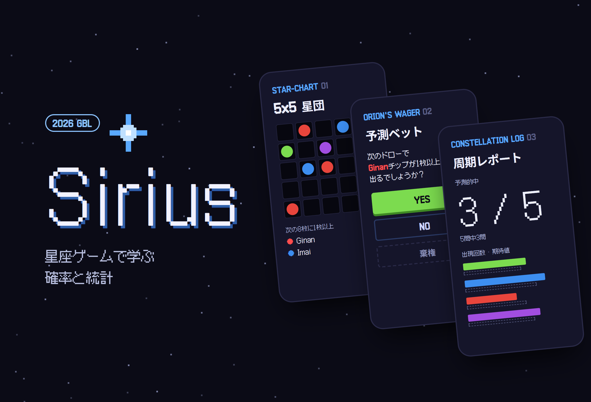
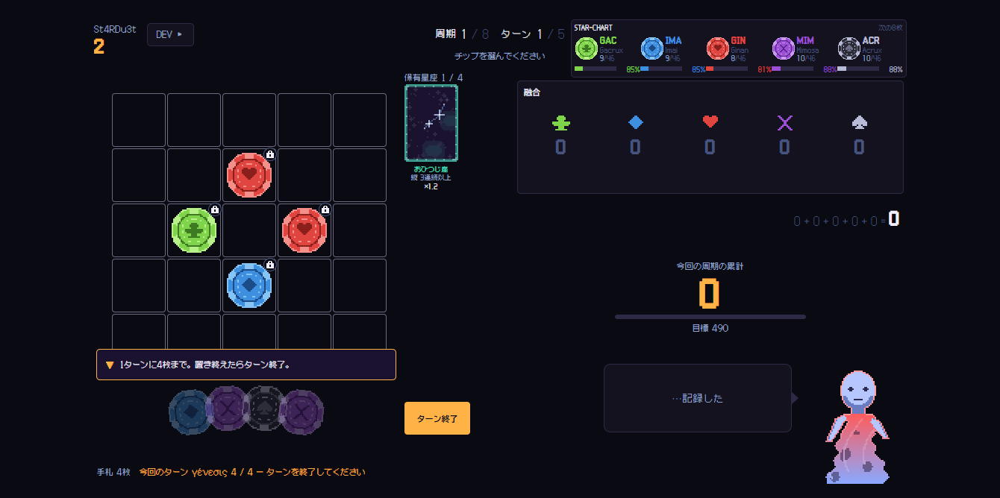
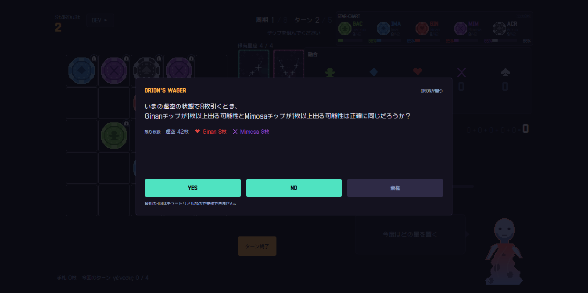
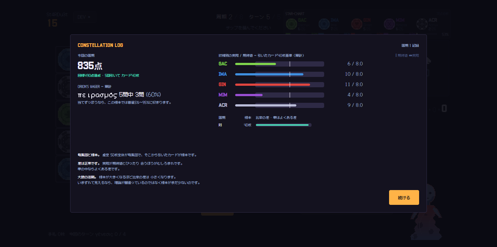
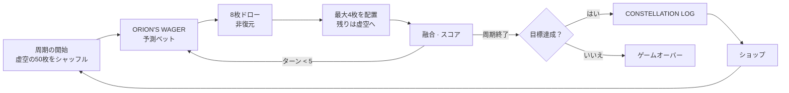

# Sirius

<p align="center"></p>

> 確率と統計を、説明文ではなく判定ルールに埋め込んだドット絵のボードゲーム。バランスはシード固定のモンテカルロ法で検証し、ブースのノートPC向けに単一の exe で配布する

---

## 1. プロジェクト概要 (Overview)

| 項目 | 内容 |
|---|---|
| プロジェクト名 | Sirius（パッケージ名 STA-mble） |
| 一行要約 | 中学生が毎ターン「今どちらを選ぶか」を確率で判断するように仕向けるゲーム。教科書の達成基準をゲームのルールに 1:1 で対応させた |
| 期間 | 2026.08.05 ~ 2026.08.15（11日間） · コミット37件、v0.1.0 → v7.0.0 |
| 対象イベント | GBL（Game Based Learning）2026 Math 部門 · テーマは確率と統計 · 対象は中学生 · ブースでの展示 |
| 参加人数 | 個人プロジェクト |
| 本人の役割 | ゲーム企画（GDD 3,400行）、教科との連携設計、ルールエンジン・UI・シミュレーター・パッケージングのすべて |
| 貢献度 | 100%（リポジトリのコミットはすべて本人） |

生徒は `C(50,8)` を計算できても、「で、今どちらを選ぶのか」は教わらない。計算は紙の上で終わり、判断は教室の外にある。ゲームは選択を迫り、その結果をすぐに返すので、このギャップを扱うのに向いている。

まず教科書を読んで、設計の基準を決めた。2022年改訂の高校『確率と統計』は大単元ごとに中学校との関連内容を記しており、中学生はすでに場合の数・確率（中2）と相対度数（中1）を学んでいる。だからこのゲームは、知らないことを教えるわけではない。すでに知っていることを高校の概念（統計的確率・期待値）へつなぐ、橋渡しの役割を担う。

## 2. 技術スタック (Tech Stack)

| 区分 | 技術 | 選定理由 |
|---|---|---|
| 言語 · ビルド | TypeScript（`strict`） · Vite 8 | ルールエンジンを型で縛っておけば、「正解の確率を設問に載せない」といった設計ルールをデータ構造で強制できる |
| ルールエンジン | 純粋な TypeScript の `core/`（React・DOM 依存0） | ゲーム・シミュレーター・テストが、同じ状態機械（`core/game.ts`）1つを共有する |
| UI | React 19 · Zustand · Tailwind CSS 4 · Framer Motion | 1120×630 の固定キャンバスにドット絵を描く。ストアは状態機械を包むだけである |
| シミュレーション | Node + tsx、シードベースの `mulberry32` | 同じシードなら同じ結果が出てこそ、バランスの測定を再現できる |
| テスト | Vitest 4 | 確率の式を BigInt による厳密な組み合わせ計算と照合する検査など、設計規約を守るためのガードを含む |
| パッケージング | Electron 43 · electron-builder 26（`portable`） | インストールもランタイムもネットワークも要らない exe ファイル1つ。ブースのノートPCにコピーするだけでよい |

## 3. 主な機能と担当業務 (Key Features & Contributions)

<p align="center"></p>
<p align="center">
  
  
</p>
<p align="center"><sub>リポジトリの自動スクリーンショットツールでローカルにキャプチャ（シード固定）。上：プレイ画面、下左：予測ベット、下右：周期終了時の統計レポート</sub></p>

### 実装した機能

**コアループ。** 1周期は5ターンである。毎ターン、虚空（カード50枚）から8枚を引き、そのうち最大4枚を 5×5 の星団に置く。置かなかったピースは虚空に戻り、再びシャッフルされる。置いたピースが同じ紋様でつながると融合スコアが入り、周期の累積スコアが目標に達すると次の周期に進む。ドローは非復元で、カードを母集団から取り除くのは配置という事象だけなので、このループそのものが標本抽出の実習になっている。

**ピースの構成がそのまま場合の数である。** 基本ピースは5種類。特殊ピースは2つの紋様を半分ずつ合わせたチップで、₅C₂ = 10種類ある。漂流ピースは隣接する4方向のうち3方向を選んで判定するので、₄C₃ = 4通りの場合がある。特殊ピースの数は適当に決めた値ではなく、組み合わせの数そのものである。

**学習装置4種。** 装置ごとに、担当する単元と統計の単位が異なる。

| 装置 | 役割 | 教科 |
|---|---|---|
| `STAR-CHART` | 紋様ごとの残り枚数と「次の8枚に1枚以上出る確率」（計算）を、これまでの手札で観測した割合（実際）と並べて常時表示 | Ⅱ-1 確率の意味 · Ⅱ-2 余事象 · Ⅲ-5 母集団と標本 |
| `ORION'S WAGER` | ドロー直前に YES / NO / 棄権で予測ベットする。周期が進むほど、単純比較 → 余事象 → 条件付きと難しくなる | Ⅱ-1 · Ⅱ-2 · Ⅱ-3 条件付き確率 |
| `DRIFT ORACLE` | 漂流ピースが読み取りうる場合をすべて表で示し、期待値を問う | Ⅲ-2 期待値 |
| `CONSTELLATION LOG` | 周期の終わりに、予測の的中率と紋様別の出現回数を期待値と比較する。割合には必ず標本数を付ける（「5問中3問」） | Ⅱ-1 統計的確率 · Ⅲ-3 |

**余事象で計算し、階乗は作らない。** 「少なくとも1枚」は `1 − C(n−k, h) / C(n, h)` で求めるが、計算は累積積 `∏ (n−k−i)/(n−i)` で行う。`C(50,8)` だけですでに 5.4×10⁸ あり、60! は倍精度の範囲を超えるので、分子と分母を別々に求めると、割り算の前に `Infinity ÷ Infinity` になってしまう。累積積なら各因数が0〜1に収まるので、確率の範囲を外れることがない。

### 主な業務

- GDD の作成と教科とのマッピング（ゲームシステム9個 ↔ 達成基準）
- ヘッドレスの状態機械 `core/game.ts`、融合スコア、ショップ、学習装置3種（`wager` · `oracle` · `report`）
- モンテカルロシミュレーター（プレイヤー方策 random · greedy · smart）とバランス曲線の設計
- ドット絵の手続き的生成パイプライン（チップ・星座カード・キャラクター）
- Electron シェルと portable exe のパッケージング、ブース運営向けのビルド分岐

## 4. 成果と結果 (Results & Metrics)

### 定量的成果

| 項目 | 結果 |
|---|---|
| テスト | Vitest **493件通過**（24ファイル、v7.0.0 基準で 2026.09 に再実行） · 型チェックはクリーン |
| バランス測定 | 組み合わせごとに1,000回 × 9組み合わせ、シード 20260101 |
| コード規模 | `src/` · `sim/` 15,178行、GDD 3,409行 |
| ブースの処理量 | 1人あたり27.8分（計算値）、ノートPC 3台で1時間あたり5.5人 |
| 配布物 | Windows 用 portable exe 1個 |
| イベントの結果 · 実際に参加した生徒数 | （要確認） |

**予測ベットが結果に与える影響**（以前のブース版の目標曲線 `[490, 630, 640]` 基準）：

| プレイヤー方策 | ベット的中 0% | 50% | 100% |
|---|--:|--:|--:|
| greedy（ブース版） | **71.3%** | 85.0% | 87.2% |
| smart（ブース版） | 94.7% | 94.2% | 94.2% |
| smart（フル版） | 4.2% | — | 40.4%（+36.2%p） |

ブース版では、確率の問題を1問も当てられなくても greedy が71.3%クリアする。学習装置が参入障壁にならない。フル版では、予測ベットが勝敗を分ける。2つのバージョンに異なる原則を当てはめた判断が、数値で裏付けられた。ブース版の目標は、その後設計者自身がプレイしたうえで、意図的に `[600, 900, 2000]` へ引き上げた。

### 定性的成果

- **2つの確率を並べると、統計的確率が説明なしに見えてきた。** 第1周期の終わりには5つの紋様がすべて 10/51 なので、計算値は5行とも85%だが、実際の観測は 100 / 80 / 100 / 60 / 100% とばらついた。標本が小さいと計算と観測が食い違うことを、生徒が自分の目で確かめる。
- **教科書が設計を正した。** 教科書の表記は `큰수의법칙`（「大数の法則」を分かち書きせずに表記）で、二項分布の単元の学習要素だった。非復元抽出は条件付き確率ではなく、母集団と標本の単元に属していた。指導上の留意点が、条件付き確率での時間順序・因果関係による解釈を禁じていたので、「もう3枚出たから次は」式の設問をすべて「今、虚空がこの状態のとき」に書き直した。
- **標本が小さいという事実を隠さない。** 統計レポートは割合の横に標本数を書き、当てずっぽうで答えた場合に出る範囲も一緒に示す。3周期の累積で、「よくある差」が 6.3% → 4.5% → 3.6% と縮まっていく収束が観測された。

### 確認された限界

- **伴星30種には効果がない。** 名前・説明・ティア・価格しかない。バランス曲線はすべて伴星なしで測定したので、有効にした瞬間に9組み合わせを測り直す必要がある。購入アクションの型に該当するバリアントをそもそも置かないことで封印した。
- **処理量の27.8分は計算であって、測定ではない。** 読む速さ（250字/分）と判断にかかる時間は仮定値である。
- **学習効果は測っていない。** 検証したのは「概念がルールに埋め込まれているか」と「ゲームが動くか」である。事前・事後テストが次の段階になる。
- **自動スクリーンショットツールが、現在のタイトル画面に対応していない。** v7 の新しいタイトルメニュー（ゲーム開始 · ブースモード · 図鑑 · 設定）をツールが知らない。この報告書の画面は、ツールの開始手順だけを直して撮影した。

## 5. トラブルシューティング (Troubleshooting)

### ① 2つの学習装置が互いを無力化した

**問題** 予測ベット（`ORION'S WAGER`）のウィンドウが開くと、不透明度85%の背景幕が確率パネル（`STAR-CHART`）を覆った。確率の設問に答えるには残り枚数を見る必要があるのに、答える瞬間にはその値が画面になかった。時間がいくらあっても、設問そのものが解けなかった。

**原因** 背景幕だけの問題ではなかった。ウィンドウ本体がパネルの66%を隠していた。背景幕を透明にしても、パネルを移動してもだめだった。パネルを移動すると確率の%列まで見えてしまい、読むだけで正解が分かる。

**解決** 設問ウィンドウの中に、紋様ごとの残り枚数だけを入れた。確率は載せない。これを条件分岐ではなくデータ構造で強制した。設問の型に確率を入れる場所がないので、設問ジェネレーターは確率の値を知っていても、ウィンドウに渡す手段がない。明度コントラストも測ってみると、背景幕越しの紋様の色と本文のコントラストは 1.08〜1.44:1 で、基準（4.5:1）にまったく届いていなかった。覆われた%列は、どこに置いても読めない。

**結果** 単純比較の設問には「枚数が多ければ可能性が高い」という1段階の推論が、余事象の設問には計算が残る。正解が漏れることなく、設問が再び解ける問題になった。

### ② シミュレーターがルールのバグを見つけた

**問題** フル版のクリア率が設計意図より高く出て、ルールを直すとブース版とは違う方向に動いた。

**原因** 星座カードの所持上限（4枚）の処理に欠陥があった。上限に達してもカードを弾けず、所持数が5・6・7枚と増えていった。フル版の smart 方策はショップ訪問の48%が上限に達した状態だったので、常にこの欠陥の恩恵を受けていた。ブース版は上限に達しないので、影響は0だった。2つのバージョンの数値が互いに違う方向に動いたことが手がかりだった。

**解決** 上限の処理を直し、9組み合わせを測り直した。この測定は、構造のおかげで信頼できた。シミュレーターが独自のループを持つと、測定したゲームとリリースしたゲームが別の実装になってしまう。そこで `core/game.ts` 1つをゲーム・シミュレーター・テストで共用し、`Math.random()` はどこからも直接呼ばず、乱数を注入で受け取る。セリフ出力用の乱数まで、ゲームの乱数から分離した（`seed ^ 0x5ee0`）。セリフがゲームの乱数を消費すると、シードによる再現が崩れるからである。

**結果** フル版 smart のクリア率が 28.1% → 11.7% に正された。ブース版の数値は、再測定でもそのまま有効だった。

### ③ 「ブース版15分」は測定ではなかった

**問題** 企画の初期には、ブース版1回を15分と見積もり、1時間に12人を受け入れられると考えていた。

**原因** その数字は、どの計算から出てきたものでもなかった。設問の文字数と読む速さから計算し直すと1回32.4分で、予測ベット15問がそのうち44%（14.1分）を占めていた。読む速さは、韓国の成人の最高速度（約589字/分）に中学生の係数0.8と、判断を要する文章であることの係数0.6を掛けて、250字/分とした。

**解決** 正解したら解説を省略し、解説の長さを半分にした（ベットの設問 3,030字 → 1,627字）。統計レポートは削らなかった。収束を示す3つの点が大数の法則を見せる装置のすべてなので、学習装置を削って時間を稼ぐ選択はしなかった。

**結果** 1回が27.8分に縮んだ。入れ替えの時間まで含めると、ノートPC 3台で1時間あたり5.5人である。GBL は参加した生徒の投票で順位を決めるので、処理量がそのまま成績になる。ノートPCの台数を確保することが想像以上に重い条件だと、イベントの前に分かった。

### ④ ハングルを含むパスでだけビルドが落ちる

**問題** 型チェックとテストは通るのに、本番ビルドだけが `STATUS_STACK_BUFFER_OVERRUN` でクラッシュした。

**原因** プロジェクトのパスに、ハングル・空白・クラウド同期フォルダが混在していた。バンドラーがこうしたパスで落ち、それがビルドの段階でだけ表面化した。

**解決** 作業ツリーを ASCII のみで空白を含まない単純なパスに移し、同期フォルダには戻さないことをプロジェクトのルールとしてドキュメントに残した。

**結果** ビルドとパッケージングが安定して完了する。

## 6. リンクと成果物 (Links & Deliverables)

| 区分 | リンク |
|---|---|
| GitHub リポジトリ | [stx4R/Sirius](https://github.com/stx4R/Sirius)（非公開） |
| 配布物 | `Sirius-v<version>-portable.exe`（electron-builder `portable`） |
| 設計文書 | リポジトリの `docs/GDD.md`（3,409行）、`sim/out/results.md`（シミュレーション結果） |

### 構成

```
core/game.ts  ←──  sim/     (シミュレーターが駆動)
              ←──  store/   (Zustand がラップ)
              ←──  tests/   (テストが検証)

src/core/   純粋な TypeScript。ルール・確率計算・学習装置。React・DOM 依存0
src/ui/     React コンポーネント。ゲームルールのロジックは禁止
sim/        Node のモンテカルロシミュレーター (core のみ import)
electron/   パッケージング用シェル。ゲームロジック0行
```



---

+++

## カスタマージャーニーマップ (Journey Map)

ユーザーは、ブースを訪れた中学生である。

| 段階 | ユーザーの行動 | ユーザーの考え | ゲームの対応 |
|---|---|---|---|
| 着席 | ノートPCの前に座る | 「どうやるんだろう？」 | 最初のゲームの最初のターンで、コーチマークが1段階ずつ操作を示す。最初の3回の予測ベットはチュートリアルとして強制 |
| 最初の周期 | ピースを置いてみる | 「適当に置けばいいの？」 | 最初の周期は誰でも通過できるように設計。脱落させると、その生徒の票を失う |
| 判断 | ベットの設問を読む | 「何枚残ってたっけ？」 | 設問ウィンドウの中に残り枚数がある。確率は自分で推論する |
| 観察 | 確率パネルを見る | 「85%って言ってたのに、なんで60%？」 | 計算と実際が並んでいるので、小さな標本の揺らぎが見える |
| 整理 | 周期のレポートを見る | 「うまくできたのかな？」 | 「5問中3問」のように、標本数と当てずっぽうで答えた場合の範囲を一緒に示す |
| 退場 | 投票しに行く | | 終了時に投票の案内が出る |

## モーションデザイン (Motion Design)

- 手札は扇形に広がり、融合の精算では紋様ごとに1つずつスコアが加算される。まとめて合計しないので、どの列がスコアを生んだのかを目で追える。
- キャラクターの ORION が、状況に応じて表情を変えながら話しかける。セリフ用の乱数はゲームの乱数と分けてあるので、演出がゲームの結果を変えることはない。
- Electron のウィンドウは最初のフレームの前に背景色を塗るので、白い画面ではなく暗闇の中からゲームが浮かび上がる。

## アダプティブデザイン (Adaptive Design)

- 1120×630 の固定キャンバスを使い、画面に合わせて比率を保ったまま拡大・縮小する。ブースのノートPCごとに解像度が違っても、どの画面でも同じゲームが見える。テストでは、固定キャンバス上でボックスの重なりやはみ出しを測る。
- 配布形態も運用環境に合わせた。本番ビルドはブース版だけを表示する（フル版の8周期・約40分は、座席1つが票1つを失う時間である）。デモ用には `?mode=full` で開く。実行時の設定ファイルを使わないので、ノートPCごとに設定がずれることがない。

## セキュリティ脆弱性管理 (DREAD)

オフラインのゲームなので、個人情報もサーバーもない。ブースの PC 上で起こりうる悪用を脅威として扱う。

| 脅威 | 損害 | 再現性 | 悪用性 | 影響 | 発見性 | 対応 |
|---|---|---|---|---|---|---|
| exe 内のリンクから、学校の PC がブラウザとして使われる | 中 | 中 | 低 | ブースの PC | 中 | 新しいウィンドウを開く要求はシステムのブラウザに渡さず拒否（`setWindowOpenHandler`） — **適用** |
| 生徒がフル版を起動し、座席を40分占有する | 中 | 低 | 低 | 待っている生徒 | 低 | 本番ビルドはブース版のみ、解除は URL パラメータでのみ可能 — **適用** |
| 開発者ツールでスコアを改ざんする | 低 | 中 | 中 | そのゲーム | 中 | ショートカットキーは手動でバインドしたが、開発者ツールのショートカットが残っている。配布ビルドで塞ぐのが残る課題 |
