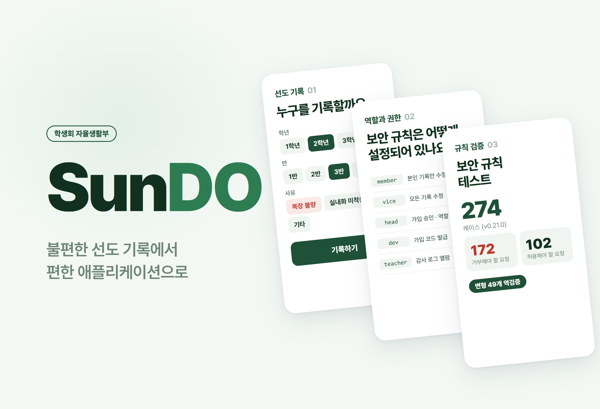
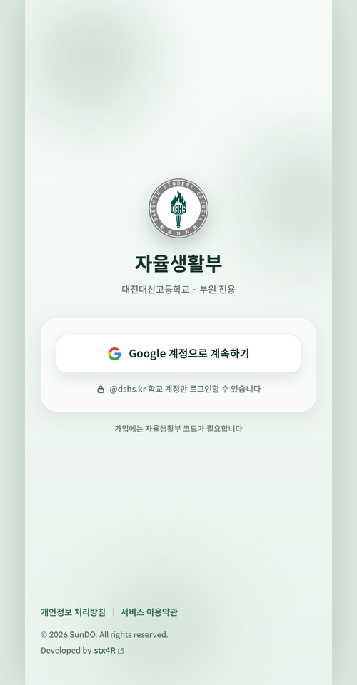
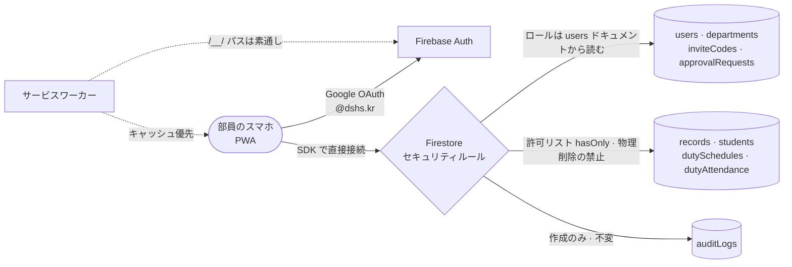

# SunDO

<p align="center"></p>

> 生徒会・自律生活部の指導記録を紙から移した学校専用の PWA。サーバーを持たず Firestore のセキュリティルールだけで権限を強制し、そのルールが実際に拒否するかどうかを変異による逆検証で証明した

---

## 1. プロジェクト概要 (Overview)

| 項目 | 内容 |
|---|---|
| プロジェクト名 | SunDO（自律生活部の指導記録を電子化する PWA） |
| 一行要約 | 部員が生徒を選んで指導の理由を記録し、見回りの日程と出席を管理する。未成年者の生活指導記録なので、「誰が何を見られるか」をルールで確定させることに設計の重心を置いた |
| 期間 | 2026.08.20 ~ 2026.09.18 · v0.0.1 → v1.0.0（09.11 正式リリース） → v1.1.0（セキュリティ強化） |
| 参加人数 | 個人プロジェクト（ユーザー：大田大新高等学校 生徒会 自律生活部の部員 約40人） |
| 本人の役割 | 企画、権限モデル・脅威モデルの設計、セキュリティルール、画面・PWA の実装全般、デプロイ・運用 |
| 貢献度 | 100%（リポジトリのコミット60件はすべて本人） |

自律生活部の指導記録は紙で管理されていた。誰がいつ何を書いたのかを追跡できず、誤って書いた記録を消しても痕跡が残らず、どの生徒の記録を誰が見られるのかを定めた文書もなかった。

電子化そのものは難しくない。問題は、扱うデータが未成年者の生活指導記録だという点である。設計を誤れば紙より悪くなる。紙は物理的に1部しかないが、データベースはクエリ1行で全校生徒の記録を差し出してしまう。

このアプリにはアプリケーションサーバーがない。ブラウザの Firebase SDK がデータベースに直接接続する。そのため、権限を判定できる場所はセキュリティルールの1か所しかない。画面でボタンを隠すのは防御ではない。コンソールから SDK を直接呼べば済んでしまう。**画面は利便性を担い、ルールは強制を担う。両者が食い違えば、実際に防げるのはルールが防ぐものだけである。**

## 2. 技術スタック (Tech Stack)

| 区分 | 技術 | 選定理由 |
|---|---|---|
| 画面 | React 19 · TypeScript · Vite 8 · React Router 8 · Tailwind CSS 4 | 画面13個・コンポーネント31個規模のモバイルアプリ。ドックタブ構成とボトムシート中心の UI |
| 認証 | Firebase Auth（Google OAuth、`@dshs.kr` ドメイン） | 学校の Google アカウントがそのまま身元になる。パスワードを別途管理しない |
| データ · 権限 | Cloud Firestore + セキュリティルール 577行 | サーバーなしで、ロール・状態・フィールド単位の権限をルールで強制する。ルールファイルでは、条件よりコメントのほうが長い |
| ルール検証 | Firestore エミュレーター · `@firebase/rules-unit-testing` · 自作の変異逆検証ハーネス | 「許可されるか」だけでなく、「拒否が実際に起きるか」を測る |
| PWA | Web マニフェスト · 自作のサービスワーカー（`public/sw.js`） | アプリストアを通さずにホーム画面へインストール。オフラインバナー・アップデートバナー・インストール案内を含む |
| デプロイ | Firebase Hosting · セキュリティヘッダー | アプリと認証ハンドラーを同一オリジンに置く。X-Frame-Options・CSP `frame-ancestors` などを適用 |

## 3. 主な機能と担当業務 (Key Features & Contributions)

<p align="center"></p>
<p align="center"><sub>公開サイトのログイン画面。ログイン後の画面は実際の生徒情報を含むため、掲載していない。</sub></p>

### 実装した機能

- **登録と承認**：学校の Google アカウントで認証 → 部長が発行した登録コードを入力 → ポリシーに同意 → 部長の承認待ち。承認前（`pending`）のアカウントは、業務データに一切アクセスできない。
- **指導記録（ホーム）**：学年 → クラス → 生徒の順に選び、理由（服装不良 · 上履き未着用 · その他）を記録する。記録日時は自動で入る。虫眼鏡アイコンから学籍番号を検索し、すぐに記録することもできる。
- **記録の閲覧・修正（記録）**：記録をリアルタイムで閲覧でき、修正・削除ができるのは作成者・副部長・部長・dev だけである。削除はデータを消さず、状態だけを変える。
- **見回りの日程と出席（日程）**：週単位で昼食・夕食時の見回り要員を編成し、部員の出席（正常・遅刻・欠席）を記録する。
- **管理（管理）**：登録の承認・拒否、ロールの変更、部長の譲渡、登録コードの発行・失効、生徒名簿、監査ログ。副部長以上しか入れない。
- **設定・ポリシー**：退会、個人情報処理方針・利用規約・オープンソースライセンスの画面。
- **PWA**：ホーム画面へのインストール案内、オフラインバナー、新バージョンのアップデートバナー、プルして更新、キーボードが出たときの下部余白の補正。

### ロールと権限

| ロール | 権限の要点 |
|---|---|
| `member`（部員） | 指導記録の作成。自分が書いた記録だけを修正・削除できる |
| `vice`（副部長） | 上記 + すべての記録の修正・削除、登録申請の閲覧 |
| `head`（部長） | 上記 + 登録の承認・拒否、ロールの変更、名簿の管理、見回り日程の編成 |
| `dev` | 上記 + 登録コードの発行・失効、ユーザードキュメントの物理削除 |
| `teacher`（教師） | 監査ログ・登録申請の閲覧専用 |

### 主な業務

- 脅威モデル10項目（T1〜T10）を先に列挙してから、ルールを設計
- セキュリティルールの `match` ブロック12個を作成し、ルールで表現できない6項目とその代替防御をドキュメント化
- エミュレーターでの実測5件（Q-1〜Q-5）で、ルールエンジンの実際の挙動を確認
- ルールテストのハーネスと変異逆検証のハーネスを作成
- 画面・PWA・サービスワーカーの実装、デプロイと運用中のホットフィックス

## 4. 成果と結果 (Results & Metrics)

### 定量的成果

| 項目 | 結果 |
|---|---|
| ルールテスト | 6スイート **274ケース** — 拒否 172 / 許可 102（v0.21.0 基準） |
| 変異逆検証 | **49種** — ルールの条件を1つずつ意図的に開き、宣言したケースが実際に壊れるかを照合 |
| エミュレーター実測 | 5件（リストクエリ · バッチ内の読み取り時点 · バッチの原子性 · 読み取り回数の上限 · 正規表現のアンカー） |
| 規模 | `src/` 14,937行、セキュリティルール 577行、コミット60件 |
| 運用 | 2026.09.11 正式リリース、部員約40人 · 全校生徒の名簿 |
| 実際の累積記録数 · 1日の利用量 | （要確認） |

拒否ケースは許可ケースの1.7倍ある。ルールテストの本体は「できる」ではなく「できない」だからである。

### 定性的成果

- **通過だけを測る検証を捨てた。** 「許可されるべきものが許可される」ことだけを確認すると、条件をまったく書いていないルールでも通ってしまう。そこで、ルールの条件を1つずつ意図的に開いてから実行し、その条件が守っていたテストが実際に失敗するかを見る。失敗しなければ、その条件は何の役にも立っていない。
- **禁止リストではなく許可リストで書いた。** 記録の修正は、`affectedKeys().hasOnly(['reasonCode', 'reasonText', 'updatedBy', 'updatedAt'])` のように変更してよいフィールドだけを列挙する。フィールドが増えたとき、禁止リストには自動的に穴が開くが、許可リストは自動的に閉じる。
- **物理削除をなくした。** 記録・監査ログ・登録申請・コードは `allow delete: if false` である。削除は状態遷移としてしか起こらず、`dev` も例外ではない。監査ログは作成後、誰も修正できない。
- **catch-all の拒否ルールをあえて置かなかった。** エンジンはもともとデフォルトで拒否する。`match /{document=**} { allow read, write: if false; }` は開発時の仮ルールとまったく同じ形なので、誰かが1文字直すだけで全コレクションが再び開いてしまう。
- **ルールにできないことを書き出した。** 「部長はちょうど1人」（集合に対するクエリができない）、「監査ログがなければ修正も失敗させる」（兄弟の操作を参照できない）、フィールド単位の読み取り制限（`allow read` はドキュメント単位）など6項目を列挙し、それぞれにバッチの原子性・画面側の規律・サーバー関数への移管という代替防御を割り当てた。

### 確認された限界

- **ユーザードキュメントは、部員に対して全フィールドが開いている。** 「メールアドレスを表示しない」は画面側の約束であって、ルールではない。機微なフィールドをサブドキュメントに切り出すスキーマ変更が、根本的な解決策である。
- **集合の不変条件と、同時に行われる譲渡の競合は、ルールでは塞げない。** サーバー関数（トランザクション）に移す必要がある。
- **監査ログの完全性は、バッチの原子性に依存している。** バッチを組み立てるのはアプリのコードなので、アプリを通さずに SDK を直接呼べば、ログのない修正が可能になる。
- **登録コードの総当たり。** 一覧は閉じたが、コード1件の読み取りは学校アカウント全体に開いている（場合の数は4,569,760通り）。対になる対策として、申請のレートリミットが必要である。
- **ルールテストがリポジトリの外にある。** リポジトリの整理（v0.22.0）の際に `tests/` をツリーから外した。新たにクローンした人はルールテストを実行できず、v1.1.0 でのルール強化分はリポジトリ上に検証記録がない（要確認）。

## 5. トラブルシューティング (Troubleshooting)

### ① 正式リリース直後、ログインが無限にループした

**問題** v1.0.0 をデプロイすると、Google ログインを終えてもログイン画面に戻ってしまう現象が起きた。ブラウザのポップアップ方式でも、PWA のリダイレクト方式でも症状は同じだった。

**原因** サービスワーカーだった。認証ドメイン（`authDomain`）をアプリと同じドメインにしていたため、ログイン時に開かれる Firebase の予約パス `/__/auth/handler` と `/__/auth/iframe` も、アプリと同一オリジンのナビゲーションリクエストとして入ってきた。サービスワーカーは、ナビゲーションであればパスを見ずにキャッシュ済みの `index.html` を返していた。認証ハンドラーの代わりにアプリの画面が表示され、資格情報が親ウィンドウに戻る道が断たれた。`curl` で同じアドレスを呼ぶとサーバーは本物のハンドラーを返し、ブラウザで開くと SunDO の画面が表示された。横取りしていたのはサービスワーカーだった。PWA の性能改善の回（W-27）でネットワーク優先の戦略をキャッシュ優先に変えたことで、タイムアウト時にたまに失敗する程度だったものが、常に失敗するようになっていた。

**解決** サービスワーカーの fetch 処理の先頭で、`/__/` で始まるパスには手を出さず、ブラウザの標準処理に任せるようにした（v1.0.1、同日にデプロイ）。このパスにはオフライン用の代替画面も付けなかった。そもそもネットワークがなければ意味のないパスである。

**結果** ログインのループが消えた。原因と再現方法、「なぜ以前のバージョンでは表に出なかったのか」をコードのコメントに残し、同じ戦略変更が再び入っても気づけるようにした。

### ② 一覧画面が丸ごと動かなくなるか、登録コードがすべて漏れる

**問題** 仕様書にあったルールの骨組みは、単一ドキュメントの読み取り（`get`）と一覧の読み取り（`list`）を `allow read` 1つにまとめていた。そのままにしておくと、ユーザードキュメントに「本人または部員」という条件を掛けた瞬間に部員一覧の画面が動かなくなり、登録コードに「ログインしていれば」を掛けた瞬間に有効なコードがすべて一覧として漏れ出す。

**原因** エミュレーターで確かめると、`allow read: if request.auth.uid == uid` だけを置いたルールでは、単一の読み取りは許可され、コレクションの一覧は拒否された。`where(ドキュメントID == 本人)` で絞り込んだクエリは通った。ルールは一覧の結果を1件ずつふるいにかけてはくれない。クエリがルールの条件を自ら証明できなければ、クエリそのものを拒否する。これが「ルールはフィルターではない」の正確な意味である。

**解決** すべてのコレクションで、`get` と `list` を分けて書いた。登録コードでは、この性質を逆に利用した。ドキュメント ID がコード文字列そのものなので、単一の読み取りを学校アカウント全体に開いても、読めるのはコードをすでに知っている人がその1件だけである。一覧は部長にだけ開き、コードの列挙を防いだ。

**結果** 一覧画面は条件を証明するクエリで動作し、登録コードはすでに知っている人しか確認できない。

### ③ 仕様書が名指しした防御は、何も防いでいなかった

**問題** 仕様書は、ドメインを検査する正規表現 `.*@dshs[.]kr$` の末尾の `$` を必須条件と定めていた。

**原因** 実測すると、`$` を消しても `attacker@dshs.kr.evil.com` は依然として拒否された。ルールエンジンの `matches()` は文字列全体での一致だからである。逆に、末尾に `.*` を付けた瞬間に攻撃が通った。`$` の有無は関係がなく、本当の急所は `.*` という接尾辞だった。

**解決** `$` は二重の防御として残しつつ、本当のリスクをコメントに書いた。この結論は変異逆検証にも組み込んだ。`no-dollar-anchor` 変異は「どのテストも壊れないこと」が期待値として宣言されており、`domain-suffix-open` 変異はドメイン防御のケースを壊さなければならない。

**結果** ドキュメントではなく、実測がルールの根拠になった。同じ方法で実測したバッチの挙動（バッチ内の読み取りはバッチ実行前の状態を見る、1つの操作が拒否されるとバッチ全体がロールバックされる）が、部長の譲渡・登録承認のバッチ設計の根拠になった。

### ④ 逆検証が捕まえたのは、テスト側のミスだった

**問題** 変異ごとに「この条件を開いたら、どのケースが壊れるべきか」を宣言しておいたが、逆検証を実行すると、宣言になかったケースも一緒に失敗した。

**原因** 権限を狭める回で新しいバッチのケースを追加した際、既存の変異の宣言リストを更新していなかった。同じことが2回あった。

**解決** 宣言を実際の結果に合わせた。さらに、権限を狭めるときは、先にアプリのソースでそのコレクションを使っている箇所をすべて洗い出してからデプロイする手順を作った。広げるときはルールを先に、狭めるときはアプリを先にデプロイする。

**結果** 逆検証は、ルールに加えて「ルールとテストの対応関係」まで検査していることが確認できた。宣言を手で管理する限り同じ漏れは起こりうるので、変異ごとの実際の失敗リストをスナップショットとして固定する方式が、次の改善点として残った。

## 6. リンクと成果物 (Links & Deliverables)

| 区分 | リンク |
|---|---|
| GitHub リポジトリ | [stx4R/SunDO](https://github.com/stx4R/SunDO)（非公開） |

### システム構成図



ルール検証の二層構造：

```
1層  ケース検証    274件 (拒否 172 / 許可 102) — フィクスチャはルールを無効にして投入する
2層  変異逆検証    49種 — 条件を1つ開いたとき、宣言されたケースが実際に失敗するか
                   例) no-dollar-anchor → 壊れるケース0件が正解
```

---

+++

## カスタマージャーニーマップ (Journey Map)

ユーザーは、昼食・夕食の時間に見回りをする自律生活部の部員である。

| 段階 | ユーザーの行動 | ユーザーの考え | アプリの対応 |
|---|---|---|---|
| 登録 | 学校アカウントでログインし、コードを入力する | 「誰でも入れたらまずいよな」 | ドメイン制限 + 部長発行のコード + 部長の承認の3段階 |
| 見回り | 服装が乱れている生徒を見つける | 「早く記録しないと」 | 学年 → クラス → 生徒の3タップ、または学籍番号の検索1回 |
| 記録 | 理由を選ぶ | 「時刻は自分で書くの？」 | 記録日時は自動で入り、変更できない |
| 訂正 | 誤って書いた記録を直す | 「消したらバレるかな？」 | 理由を直せるのは作成者だけで、削除は痕跡を残す状態遷移である |
| 運営 | 部長が来週の見回りを組む | 「誰が来なかったっけ？」 | 週単位の日程と出席（正常・遅刻・欠席）を1つの画面で |

## アダプティブデザイン (Adaptive Design)

- 対応端末を明記した（Android 10 以上の Galaxy S シリーズ、iOS 17 以上の iPhone SE 第3世代以降）。見回りの現場で片手で使うスマホの画面を基準に、ドックタブとボトムシートを配置した。
- 入力欄にフォーカスが移って仮想キーボードが出ると、その高さの分だけ下部の余白を補正する（`useKeyboardInset`）。端末ごとに異なる画面の高さは、実際に見えている高さで計算し直す（`appHeight`）。
- オフラインになると上部にバナーを出し、新しいバージョンがデプロイされるとアップデートバナーで知らせる。

## ジェスチャー設計 (Gesturing)

- 日程・管理の画面は、下に引っ張って更新する。見回り中に、片手の親指で最新の状態を取得するための操作である。
- 記録の修正・生徒の検索・日程の編集は、下からせり上がるボトムシートで開く。

## セキュリティ脆弱性管理 (DREAD)

| 脅威 | 損害 | 再現性 | 悪用性 | 影響ユーザー | 発見性 | 対応 |
|---|---|---|---|---|---|---|
| 外部の人が学校アカウントなしでアクセスする | 高 | 高 | 中 | 全体 | 高 | トークンのメールドメインを検査 — **適用** |
| 自分のロールを偽造して送信する | 高 | 高 | 中 | 全体 | 中 | ロールはサーバー側の users ドキュメントからのみ読む — **適用** |
| 記録の生徒・日時・作成者を事後に改ざんする | 高 | 中 | 中 | 該当する生徒 | 低 | `hasOnly` による許可リスト — **適用** |
| 記録を痕跡なく削除する | 高 | 中 | 中 | 該当する生徒 | 低 | 物理削除を禁止し、状態遷移のみ — **適用** |
| 登録コードの一覧を閲覧する | 高 | 高 | 中 | 全体 | 中 | `get`/`list` の分離 — **適用** |
| 部長が `dev`・`teacher` ロールを付与する | 中 | 高 | 中 | 全体 | 中 | 付与できるロールを制限 — **v1.1.0 で適用** |
| 存在しない生徒の名前で記録する | 中 | 高 | 中 | 記録の信頼性 | 中 | 生徒ドキュメントの存在・名前の一致を検査 — **v1.1.0 で適用** |
| 部員がほかの部員のメールアドレスを閲覧する | 中 | 高 | 低 | 部員 | 低 | フィールドの分離が必要 — **残る課題** |
| 登録コードの総当たり | 中 | 中 | 中 | 全体 | 中 | レートリミットが必要 — **残る課題** |

損害の大きい項目からルールで塞ぎ、ルールの表現力の外にある2項目は、スキーマ変更とサーバー側の制限に回した状態である。
